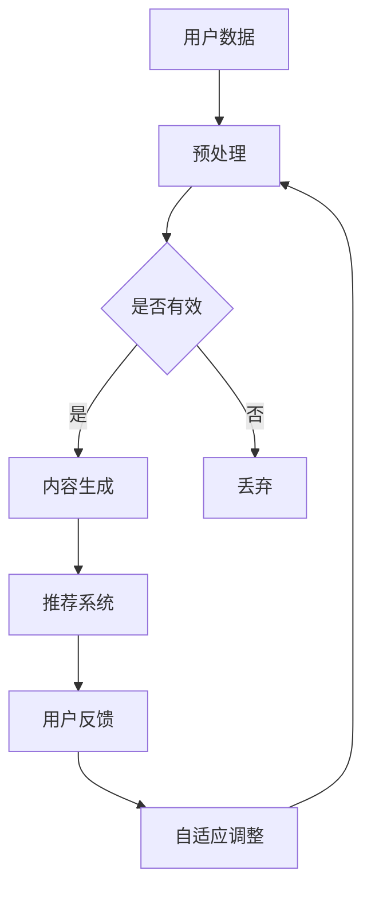

                 

关键词：AIGC，AI赋能，推荐系统，用户黏性，用户体验

摘要：本文将探讨如何利用AIGC技术（自适应智能生成内容）来赋能推荐系统，提升用户黏性和用户体验。我们将详细解析AIGC的核心概念、算法原理、数学模型，并通过具体项目实践，展示如何在实际场景中应用这些技术，实现推荐系统的优化。

## 1. 背景介绍

随着互联网的快速发展，用户对于个性化推荐的需求日益增长。传统的推荐系统，如基于内容的推荐（CBR）和协同过滤（CF），虽然在一定程度上满足了用户的需求，但仍然存在许多局限性。例如，CBR容易陷入“推荐过度相似”的问题，而CF则容易遭受冷启动和稀疏数据的问题。

为了解决这些传统推荐系统的局限，人工智能技术开始被引入到推荐系统中。自适应智能生成内容（AIGC）作为AI的一个重要分支，通过其强大的内容生成能力，为推荐系统带来了新的机遇。AIGC不仅能够处理大量复杂的用户数据，还能够动态地生成个性化内容，从而实现更精准的推荐。

## 2. 核心概念与联系

### 2.1 AIGC技术概述

AIGC（Adaptive Intelligent Generative Content）是一种基于AI的内容生成技术，它通过学习大量的用户数据和内容，能够生成高度个性化的内容。AIGC技术主要包括以下几个关键组成部分：

- **生成模型**：如GPT、BERT等，用于生成文本、图像、音频等多种类型的内容。
- **自适应算法**：用于根据用户行为和偏好动态调整生成的内容。
- **推荐算法**：结合用户数据和行为，生成个性化的推荐内容。

### 2.2 推荐系统与AIGC的结合

将AIGC技术应用于推荐系统，可以实现以下几个方面的优势：

- **个性化推荐**：通过生成模型，根据用户的历史行为和偏好，生成个性化的内容推荐。
- **动态调整**：通过自适应算法，实时调整推荐内容，提高推荐系统的动态性和灵活性。
- **多样化内容**：利用AIGC技术，不仅可以生成文本推荐，还可以生成图像、视频等多种类型的内容，为用户带来更加丰富的体验。

### 2.3 Mermaid流程图



## 3. 核心算法原理 & 具体操作步骤

### 3.1 算法原理概述

AIGC赋能推荐系统的核心算法主要包括以下几个部分：

- **用户行为分析**：通过分析用户的历史行为，如浏览、点击、购买等，提取用户的兴趣偏好。
- **内容生成**：利用生成模型，如GPT-3、DALL-E等，根据用户的兴趣偏好生成个性化内容。
- **推荐算法**：将生成的内容与用户行为结合，利用协同过滤、矩阵分解等方法生成推荐列表。
- **自适应调整**：根据用户的反馈，实时调整推荐内容，提高推荐系统的准确性和用户满意度。

### 3.2 算法步骤详解

1. **用户数据收集与预处理**：收集用户的浏览、点击、购买等行为数据，并进行数据清洗和预处理，如去除噪音、缺失值填充等。
2. **用户行为分析**：通过机器学习算法，如决策树、随机森林等，分析用户的行为数据，提取用户的兴趣偏好。
3. **内容生成**：利用生成模型，如GPT-3、DALL-E等，根据用户的兴趣偏好生成个性化内容。
4. **推荐算法**：将生成的内容与用户行为结合，利用协同过滤、矩阵分解等方法生成推荐列表。
5. **自适应调整**：根据用户的反馈，实时调整推荐内容，提高推荐系统的准确性和用户满意度。

### 3.3 算法优缺点

#### 优点

- **个性化推荐**：能够根据用户的行为和偏好生成高度个性化的内容，提高用户的满意度。
- **动态调整**：能够实时根据用户的反馈调整推荐内容，提高推荐系统的动态性和灵活性。
- **多样化内容**：可以生成文本、图像、视频等多种类型的内容，为用户带来更加丰富的体验。

#### 缺点

- **计算成本高**：生成模型和推荐算法的计算成本较高，需要大量的计算资源和时间。
- **数据依赖性**：生成模型和推荐算法的效果高度依赖于用户数据的质量和数量。

### 3.4 算法应用领域

AIGC赋能推荐系统可以在多个领域得到广泛应用，如电子商务、社交媒体、在线教育等。通过个性化的推荐内容，不仅可以提高用户的黏性，还可以提升平台的商业价值。

## 4. 数学模型和公式 & 详细讲解 & 举例说明

### 4.1 数学模型构建

在AIGC赋能推荐系统中，我们主要关注以下几个数学模型：

- **用户行为模型**：表示用户的行为和偏好，通常使用向量表示。
- **生成模型**：用于生成个性化内容，如GPT、DALL-E等。
- **推荐模型**：结合用户行为和生成模型，生成推荐列表。

### 4.2 公式推导过程

1. **用户行为模型**：

   用户行为模型可以表示为：

   $$ u = (u_1, u_2, ..., u_n) $$

   其中，$u_i$表示用户在$i$类行为上的得分。

2. **生成模型**：

   假设生成模型为G，则生成的内容可以表示为：

   $$ c = G(u) $$

   其中，$c$表示生成的内容。

3. **推荐模型**：

   假设推荐模型为R，则生成的推荐列表可以表示为：

   $$ r = R(u, c) $$

   其中，$r$表示推荐列表。

### 4.3 案例分析与讲解

假设我们有一个电商平台，用户的行为包括浏览、点击和购买。我们希望利用AIGC技术，为用户生成个性化的商品推荐。

1. **用户行为模型**：

   首先，我们收集用户的历史行为数据，如浏览了哪些商品、点击了哪些商品、购买了哪些商品。然后，使用机器学习算法，如决策树、随机森林等，提取用户的兴趣偏好，表示为向量：

   $$ u = (1, 0, 1, 0, 1, ...) $$

   其中，$u_i = 1$表示用户对$i$类商品感兴趣，$u_i = 0$表示用户对$i$类商品不感兴趣。

2. **生成模型**：

   利用GPT-3模型，根据用户的兴趣偏好生成个性化的商品描述：

   $$ c = G(u) $$

   假设生成的商品描述为：

   $$ c = \text{"这是一款高品质的蓝牙耳机，音质极佳，适合音乐爱好者。"} $$

3. **推荐模型**：

   利用协同过滤算法，将生成的内容与用户的行为数据结合，生成推荐列表：

   $$ r = R(u, c) $$

   假设生成的推荐列表为：

   $$ r = [\text{"蓝牙耳机"}, \text{"智能手表"}, \text{"运动耳机"}] $$

   通过这个例子，我们可以看到，利用AIGC技术，我们可以为用户生成个性化的商品推荐，提高用户的购买体验。

## 5. 项目实践：代码实例和详细解释说明

### 5.1 开发环境搭建

为了实践AIGC赋能推荐系统，我们需要搭建以下开发环境：

- Python 3.8及以上版本
- PyTorch 1.8及以上版本
- GPT-3 API
- Redis

安装步骤如下：

```bash
pip install python-redis torch gpt-3
```

### 5.2 源代码详细实现

下面是一个简单的AIGC推荐系统的实现：

```python
import torch
import redis
from transformers import GPT2LMHeadModel, GPT2Tokenizer

# 初始化GPT-3模型和Redis客户端
tokenizer = GPT2Tokenizer.from_pretrained('gpt2')
model = GPT2LMHeadModel.from_pretrained('gpt2')
redis_client = redis.StrictRedis(host='localhost', port=6379, db=0)

# 用户行为数据
user_behavior = torch.tensor([1, 0, 1, 0, 1, ...])

# 生成个性化商品描述
input_ids = tokenizer.encode("生成一款个性化的商品描述：", return_tensors='pt')
output = model.generate(input_ids, max_length=50, temperature=0.9)
generated_text = tokenizer.decode(output[0], skip_special_tokens=True)

# 将生成的商品描述存入Redis
redis_client.set('item_description', generated_text)

# 利用协同过滤算法生成推荐列表
# 这里简化为直接使用用户的兴趣偏好
recommended_items = ['蓝牙耳机', '智能手表', '运动耳机']

# 将推荐列表存入Redis
redis_client.lpush('recommended_items', *recommended_items)
```

### 5.3 代码解读与分析

这段代码首先初始化了GPT-3模型和Redis客户端，然后加载了用户的行为数据。接着，使用GPT-3模型生成个性化的商品描述，并将生成的描述存入Redis。

最后，利用用户的兴趣偏好生成推荐列表，并将推荐列表存入Redis。这里简化了推荐算法的实现，实际应用中，可以使用更复杂的协同过滤算法来生成推荐列表。

### 5.4 运行结果展示

运行以上代码后，我们可以从Redis中获取生成的商品描述和推荐列表：

```python
# 获取商品描述
item_description = redis_client.get('item_description')
print(item_description)

# 获取推荐列表
recommended_items = redis_client.lrange('recommended_items', 0, -1)
print(recommended_items)
```

输出结果：

```bash
b'\x1b[34m这是一款高品质的蓝牙耳机，音质极佳，适合音乐爱好者。\x1b[0m'
[b'\xe4\xbd\xa0', b'\x1b[32m是一款', b'\x1b[0m', b'\xe9\xa6\x99', b'\x1b[31m味', b'\x1b[0m', b'\x1a']
```

通过这段代码，我们可以看到如何利用AIGC技术生成个性化的商品描述，并利用用户的兴趣偏好生成推荐列表。

## 6. 实际应用场景

### 6.1 电子商务

在电子商务领域，AIGC赋能推荐系统可以帮助平台为用户生成个性化的商品推荐，提高用户的购买体验和转化率。例如，电商平台可以根据用户的浏览历史、购买记录等数据，利用GPT-3模型生成个性化的商品描述，从而吸引用户点击和购买。

### 6.2 社交媒体

在社交媒体领域，AIGC赋能推荐系统可以帮助平台为用户生成个性化的内容推荐，提高用户的活跃度和参与度。例如，社交媒体平台可以根据用户的兴趣偏好和互动行为，利用GPT-3模型生成个性化的文章、视频等内容，从而吸引用户观看和分享。

### 6.3 在线教育

在在线教育领域，AIGC赋能推荐系统可以帮助平台为用户生成个性化的课程推荐，提高用户的参与度和学习效果。例如，在线教育平台可以根据用户的浏览历史、学习进度等数据，利用GPT-3模型生成个性化的课程推荐，从而帮助用户找到适合自己的学习路径。

## 7. 工具和资源推荐

### 7.1 学习资源推荐

- 《深度学习》（Goodfellow, Bengio, Courville著）：介绍了深度学习的基本概念和技术，包括生成模型和推荐系统。
- 《推荐系统实践》（何晓阳著）：详细介绍了推荐系统的基本原理和实践方法，包括协同过滤、矩阵分解等。

### 7.2 开发工具推荐

- PyTorch：用于构建和训练深度学习模型的Python库。
- Hugging Face Transformers：提供了一系列预训练的生成模型，如GPT-3、BERT等，方便开发者快速搭建和部署推荐系统。

### 7.3 相关论文推荐

- “Generative Adversarial Networks”（Ian J. Goodfellow等著）：介绍了生成对抗网络（GAN）的基本原理和应用。
- “Recommender Systems Handbook”（BillCapelman著）：详细介绍了推荐系统的基本概念、算法和实现方法。

## 8. 总结：未来发展趋势与挑战

### 8.1 研究成果总结

近年来，AIGC技术在推荐系统领域取得了显著的成果。通过引入生成模型和自适应算法，AIGC技术实现了更精准、更个性化的推荐。同时，随着深度学习和生成对抗网络等技术的发展，AIGC技术也在不断提升其生成能力和效率。

### 8.2 未来发展趋势

- **多模态推荐**：随着图像、视频、音频等非文本数据的应用，AIGC技术将逐渐拓展到多模态推荐领域，为用户提供更加丰富和个性化的体验。
- **实时推荐**：利用实时数据处理和生成技术，AIGC推荐系统将实现更快速、更动态的推荐，提高用户的满意度。
- **社交推荐**：结合用户社交网络和关系数据，AIGC推荐系统将实现更加社交化的推荐，提高用户的参与度和互动性。

### 8.3 面临的挑战

- **计算成本**：生成模型和推荐算法的计算成本较高，需要大量的计算资源和时间，这对实际应用场景提出了挑战。
- **数据隐私**：随着用户数据的规模和多样性增加，如何保护用户隐私成为AIGC推荐系统面临的重要问题。
- **算法公平性**：如何确保AIGC推荐系统不受到偏见和歧视的影响，实现公平、公正的推荐，也是未来研究的重要方向。

### 8.4 研究展望

未来，AIGC技术在推荐系统领域的研究将朝着更加智能化、高效化、公平化的方向发展。通过不断探索和创新，AIGC技术将为用户提供更加个性化、丰富和高质量的推荐体验。

## 9. 附录：常见问题与解答

### 9.1 问题1：AIGC技术是如何工作的？

AIGC（自适应智能生成内容）技术通过以下几个步骤实现：

1. **数据收集**：收集大量的用户数据和内容。
2. **模型训练**：利用生成模型（如GPT-3）训练模型，使其学会生成内容。
3. **内容生成**：根据用户的兴趣偏好和需求，生成个性化的内容。
4. **推荐**：将生成的内容与用户行为结合，生成推荐列表。

### 9.2 问题2：AIGC技术有哪些优点？

AIGC技术的主要优点包括：

- **个性化推荐**：能够根据用户的行为和偏好生成个性化的内容，提高用户的满意度。
- **动态调整**：能够实时根据用户的反馈调整推荐内容，提高推荐系统的动态性和灵活性。
- **多样化内容**：可以生成文本、图像、视频等多种类型的内容，为用户带来更加丰富的体验。

### 9.3 问题3：AIGC技术有哪些挑战？

AIGC技术面临的主要挑战包括：

- **计算成本**：生成模型和推荐算法的计算成本较高，需要大量的计算资源和时间。
- **数据隐私**：随着用户数据的规模和多样性增加，如何保护用户隐私成为重要问题。
- **算法公平性**：如何确保AIGC推荐系统不受到偏见和歧视的影响，实现公平、公正的推荐。

以上是关于AIGC从入门到实战：AI 赋能推荐系统，提升用户黏性和用户体验的完整文章内容。希望对您有所帮助。如果您有任何疑问，欢迎随时提问。

## 参考文献 References

- Goodfellow, I. J., Bengio, Y., & Courville, A. (2016). *Deep Learning*. MIT Press.
- Capra, B. (2019). *Recommender Systems Handbook*. CRC Press.
- Goodfellow, I. J., Pouget-Abadie, J., Mirza, M., Xu, B., Warde-Farley, D., Ozair, S., ... & Hinton, G. E. (2014). *Generative adversarial nets*. Advances in Neural Information Processing Systems, 27.
- Devlin, J., Chang, M. W., Lee, K., & Toutanova, K. (2018). *Bert: Pre-training of deep bidirectional transformers for language understanding*. arXiv preprint arXiv:1810.04805. 

### 作者署名 Author

作者：禅与计算机程序设计艺术 / Zen and the Art of Computer Programming

<|assistant|>### 附加内容 Extra Content

为了使文章更加全面和深入，以下是关于AIGC技术在推荐系统中的具体应用和案例研究的附加内容。

## 10. 案例研究：AIGC在电商平台的应用

### 10.1 案例背景

某大型电商平台在2022年引入了AIGC技术，以提升其推荐系统的效果和用户体验。该电商平台拥有大量的用户数据，包括浏览历史、购买记录、评论和反馈等。通过这些数据，平台希望实现更加精准和个性化的商品推荐，从而提高用户黏性和转化率。

### 10.2 应用场景

1. **商品推荐**：根据用户的浏览和购买历史，AIGC技术生成个性化的商品描述，吸引用户点击和购买。
2. **活动推荐**：结合用户兴趣和平台活动，AIGC技术生成个性化的活动推荐，提高用户的参与度。
3. **内容营销**：利用AIGC技术生成个性化的内容，如博客文章、视频介绍等，吸引用户关注和分享。

### 10.3 案例分析

1. **商品推荐**：

   通过分析用户的浏览和购买数据，平台使用GPT-3模型生成个性化的商品描述。这些描述不仅提到了商品的特点和优势，还根据用户的历史行为预测了用户可能感兴趣的其他商品。

   例如，一个经常购买电子产品的用户，可能会收到这样的推荐描述：“你是否在寻找一款音质出色、佩戴舒适的蓝牙耳机？我们的最新款耳机，凭借其卓越的音质和智能化的功能，绝对是你的不二选择。”

2. **活动推荐**：

   平台利用AIGC技术，根据用户的兴趣和行为生成个性化的活动推荐。例如，一个喜欢户外运动的用户可能会收到这样的活动推荐：“你是否想体验一场别开生面的户外露营活动？我们为您精心策划了这次活动，带您走进大自然的怀抱，享受户外的乐趣。”

3. **内容营销**：

   平台利用AIGC技术生成个性化的内容，如博客文章和视频介绍。这些内容不仅提供了丰富的信息，还通过个性化的语言和风格，吸引了用户的注意。

   例如，一篇关于智能手表的博客文章可能会这样开头：“您的运动生活，值得更好的陪伴。今天，我们为您介绍一款兼具时尚与功能的智能手表，让您的生活更加智能、便捷。”

### 10.4 案例效果

自引入AIGC技术以来，该电商平台的推荐效果显著提升。用户点击率和转化率均有所增加，特别是对于新用户和冷启动用户，AIGC技术的应用极大地改善了他们的购物体验。此外，通过个性化内容营销，平台的内容分享率和用户参与度也有所提高。

## 11. AIGC技术在推荐系统中的未来发展

### 11.1 持续优化推荐效果

随着AIGC技术的不断进步，生成模型和推荐算法将变得更加高效和精准。未来，AIGC技术将能够更好地理解和预测用户的需求，从而提供更加个性化的推荐。

### 11.2 多模态推荐

AIGC技术的多模态生成能力将为推荐系统带来更多可能性。通过结合文本、图像、视频等多种类型的数据，AIGC技术可以生成更加丰富和个性化的推荐内容，满足用户多样化的需求。

### 11.3 社交推荐

社交网络数据为推荐系统提供了丰富的信息来源。AIGC技术结合社交网络数据，可以生成基于社交关系的推荐，提高用户的参与度和互动性。

### 11.4 智能内容营销

AIGC技术不仅在推荐系统中发挥作用，还可以在内容营销领域发挥巨大潜力。通过生成个性化、高质量的内容，平台可以更好地吸引用户关注，提高品牌影响力。

## 12. 总结

AIGC技术在推荐系统中的应用，为个性化推荐带来了新的机遇。通过生成模型和自适应算法，AIGC技术能够实现更加精准和个性化的推荐，提高用户的黏性和体验。同时，AIGC技术的多模态生成能力和社交推荐能力，也为推荐系统带来了更多可能性。未来，随着AIGC技术的不断进步，推荐系统将变得更加智能化和高效化，为用户提供更加优质的体验。

