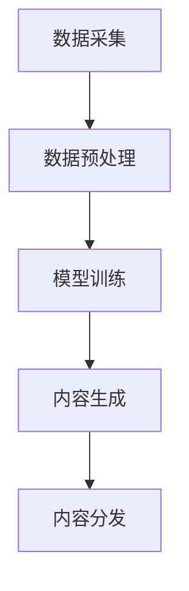

                 

关键词：AIGC、新闻创作、AI、时效性、深度学习、自然语言处理、算法优化、实战应用

> 摘要：本文将深入探讨如何将AI技术与新闻创作相结合，通过AIGC（AI-Generated Content）从入门到实战的方法，提高新闻资讯的时效性。我们将涵盖AIGC的核心概念、算法原理、数学模型、项目实践，以及未来应用前景和面临的挑战。

## 1. 背景介绍

随着互联网的快速发展，信息传播的速度和广度得到了前所未有的提升。然而，随之而来的是信息过载的问题。传统的新闻创作模式已经无法满足快速变化的社会需求，特别是在突发事件和热点新闻领域，新闻的时效性变得尤为重要。为了应对这一挑战，人工智能（AI）技术在新闻创作中的应用逐渐成为一个热门方向。

AI-Generated Content（AIGC）指的是利用人工智能技术生成内容的过程。AIGC可以快速捕捉信息、生成新闻稿件，从而提高新闻发布的时效性。此外，AIGC还可以通过个性化推荐和智能编辑等功能，优化用户体验，提升新闻的质量和影响力。

本文将分为以下几个部分：

1. AIGC的核心概念与联系
2. AIGC的核心算法原理与具体操作步骤
3. AIGC的数学模型和公式
4. 项目实践：代码实例和详细解释说明
5. 实际应用场景
6. 未来应用展望
7. 工具和资源推荐
8. 总结：未来发展趋势与挑战
9. 附录：常见问题与解答

## 2. 核心概念与联系

### 2.1 AIGC的定义与分类

AIGC 是指人工智能自动生成内容，它涵盖了从数据采集、内容生成到内容分发等多个环节。根据生成内容的类型，AIGC 可以分为以下几类：

- 文本生成：如新闻报道、文章撰写、社交媒体内容等。
- 图像生成：如图像合成、场景描绘、动漫角色创作等。
- 音频生成：如语音合成、音乐创作、声音特效等。

### 2.2 AIGC的技术架构

AIGC 的技术架构主要包括以下几个模块：

1. 数据采集：从互联网、数据库等渠道获取新闻素材、图像、音频等原始数据。
2. 数据预处理：对采集到的数据进行清洗、去重、分类等处理，为内容生成做好准备。
3. 模型训练：利用深度学习、自然语言处理等技术，对数据集进行训练，生成相应的模型。
4. 内容生成：根据模型生成新的文本、图像、音频等。
5. 内容分发：将生成的内容发布到新闻网站、社交媒体、应用程序等渠道。

下面是一个简单的 Mermaid 流程图，展示了 AIGC 的技术架构：



## 3. 核心算法原理 & 具体操作步骤

### 3.1 算法原理概述

AIGC 的核心算法主要包括自然语言处理（NLP）、深度学习、生成对抗网络（GAN）等。以下将详细介绍这些算法的原理。

#### 3.1.1 自然语言处理（NLP）

NLP 是人工智能的一个重要分支，旨在使计算机能够理解、处理和生成人类语言。NLP 的核心算法包括词嵌入、序列到序列模型、注意力机制等。

- 词嵌入：将自然语言中的词汇映射到高维空间中的向量表示，以便进行计算。
- 序列到序列模型：通过编码器-解码器结构，将输入序列转换成输出序列。
- 注意力机制：在处理序列数据时，模型可以自动关注关键信息，提高生成内容的准确性。

#### 3.1.2 深度学习

深度学习是一种基于多层神经网络的结构，能够自动学习输入数据的特征表示。在 AIGC 中，深度学习主要用于图像和语音数据的生成。

- 卷积神经网络（CNN）：主要用于图像处理，通过卷积层提取图像特征。
- 递归神经网络（RNN）：主要用于序列数据处理，如语音和文本。

#### 3.1.3 生成对抗网络（GAN）

GAN 是一种由生成器和判别器组成的对抗网络。生成器的目标是生成逼真的数据，而判别器的目标是区分生成数据和真实数据。通过这种对抗关系，生成器不断优化，最终生成高质量的数据。

### 3.2 算法步骤详解

以下是 AIGC 的具体操作步骤：

1. 数据采集：从互联网、数据库等渠道获取新闻素材、图像、音频等原始数据。
2. 数据预处理：对采集到的数据进行清洗、去重、分类等处理，为内容生成做好准备。
3. 模型训练：利用深度学习、自然语言处理等技术，对数据集进行训练，生成相应的模型。
4. 内容生成：
   - 对于文本生成，利用序列到序列模型生成新闻稿件。
   - 对于图像生成，利用生成对抗网络生成图像。
   - 对于音频生成，利用语音合成技术生成音频。
5. 内容优化：对生成的内容进行质量评估，如文本的流畅性、图像的清晰度、音频的音质等，并根据评估结果进行优化。
6. 内容分发：将生成的内容发布到新闻网站、社交媒体、应用程序等渠道。

### 3.3 算法优缺点

#### 优点：

- 提高新闻发布时效性：AIGC 可以快速生成新闻稿件，提高新闻发布的速度。
- 提高内容质量：通过深度学习和自然语言处理技术，生成的内容更具逻辑性和准确性。
- 个性化推荐：基于用户兴趣和行为，AIGC 可以实现个性化新闻推荐。

#### 缺点：

- 数据质量问题：AIGC 的效果很大程度上取决于数据质量，如果数据质量较差，生成的内容也会受到影响。
- 伦理和版权问题：AIGC 生成的新闻内容可能会涉及版权和伦理问题，如虚假新闻、侵犯隐私等。

### 3.4 算法应用领域

AIGC 的算法可以应用于多个领域：

- 新闻创作：快速生成新闻稿件，提高新闻发布时效性。
- 广告创作：自动化生成广告内容，提高广告投放效果。
- 艺术创作：利用 AIGC 技术生成艺术作品，如音乐、绘画等。
- 语音助手：利用 AIGC 生成自然语音交互内容，提高用户体验。

## 4. 数学模型和公式 & 详细讲解 & 举例说明

### 4.1 数学模型构建

AIGC 的数学模型主要包括以下几个方面：

#### 4.1.1 词嵌入

词嵌入是将词汇映射到高维空间中的向量表示。常用的词嵌入模型有 Word2Vec、GloVe 等。

$$
\text{word\_embedding} = \text{W} \cdot \text{word\_vector}
$$

其中，$\text{W}$ 是权重矩阵，$\text{word\_vector}$ 是词向量。

#### 4.1.2 序列到序列模型

序列到序列模型（Seq2Seq）是一种基于编码器-解码器结构的模型，用于将输入序列转换成输出序列。

$$
\text{output} = \text{decoder}(\text{encoder}(\text{input}))
$$

其中，$\text{encoder}$ 是编码器，$\text{decoder}$ 是解码器。

#### 4.1.3 注意力机制

注意力机制（Attention Mechanism）是一种在处理序列数据时，模型可以自动关注关键信息的机制。

$$
\text{context\_vector} = \text{softmax}(\text{W}_\text{att} \cdot \text{query} \cdot \text{key\_vector})
$$

其中，$\text{W}_\text{att}$ 是权重矩阵，$\text{query}$ 是查询向量，$\text{key\_vector}$ 是关键向量。

### 4.2 公式推导过程

#### 4.2.1 词嵌入

以 Word2Vec 为例，假设我们有 $N$ 个词汇，每个词汇可以表示为一个 $d$ 维向量。给定一个词汇序列，我们可以将其表示为一个向量序列。

$$
\text{sentence} = [\text{word}_1, \text{word}_2, \text{word}_3, ..., \text{word}_N]
$$

$$
\text{sentence\_vector} = [\text{word}_1\_vector, \text{word}_2\_vector, \text{word}_3\_vector, ..., \text{word}_N\_vector]
$$

#### 4.2.2 序列到序列模型

以编码器-解码器模型为例，假设我们有输入序列 $\text{input} = [\text{word}_1, \text{word}_2, ..., \text{word}_T]$ 和输出序列 $\text{output} = [\text{word}_1', \text{word}_2', ..., \text{word}_T']$。

编码器 $\text{encoder}$ 的输出为：

$$
\text{context\_vector}_t = \text{encoder}(\text{input}_t)
$$

解码器 $\text{decoder}$ 的输出为：

$$
\text{output}_t = \text{decoder}(\text{context\_vector}_t)
$$

#### 4.2.3 注意力机制

注意力机制的推导过程如下：

给定编码器输出的隐藏状态序列 $\text{context\_vector} = [\text{context\_vector}_1, \text{context\_vector}_2, ..., \text{context\_vector}_T]$ 和查询向量 $\text{query}$。

计算注意力分数：

$$
\text{score}_t = \text{softmax}(\text{W}_\text{att} \cdot \text{query} \cdot \text{context\_vector}_t)
$$

计算注意力权重：

$$
\alpha_t = \text{softmax}(\text{score}_t)
$$

计算注意力向量：

$$
\text{context\_vector} = \sum_{t=1}^{T} \alpha_t \cdot \text{context\_vector}_t
$$

### 4.3 案例分析与讲解

#### 4.3.1 文本生成

假设我们要生成一篇关于人工智能的新闻稿件，输入词汇序列为：

$$
\text{input} = [\text{人工智能}, \text{发展}, \text{未来}, \text{趋势}]
$$

首先，我们将词汇序列映射到词嵌入向量：

$$
\text{input\_vector} = [\text{人工智能}_\text{vector}, \text{发展}_\text{vector}, \text{未来}_\text{vector}, \text{趋势}_\text{vector}]
$$

然后，利用编码器-解码器模型和注意力机制生成输出词汇序列：

$$
\text{output} = \text{decoder}(\text{encoder}(\text{input}))
$$

输出词汇序列可能为：

$$
\text{output} = [\text{人工智能}, \text{技术}, \text{推动}, \text{社会进步}]
$$

通过这种方式，我们可以生成一篇具有逻辑性和准确性的新闻稿件。

## 5. 项目实践：代码实例和详细解释说明

### 5.1 开发环境搭建

在本项目中，我们将使用 Python 语言和 TensorFlow 深度学习框架。首先，确保安装以下依赖项：

```
pip install tensorflow
```

### 5.2 源代码详细实现

下面是一个简单的文本生成项目示例：

```python
import tensorflow as tf
from tensorflow.keras.layers import Embedding, LSTM, Dense
from tensorflow.keras.models import Sequential

# 定义词汇表
vocab_size = 10000
embedding_dim = 256
max_sequence_length = 20

# 创建嵌入层
embedding_layer = Embedding(vocab_size, embedding_dim, input_length=max_sequence_length)

# 创建序列到序列模型
model = Sequential([
    embedding_layer,
    LSTM(128, return_sequences=True),
    LSTM(128, return_sequences=True),
    Dense(vocab_size, activation='softmax')
])

# 编译模型
model.compile(optimizer='adam', loss='categorical_crossentropy', metrics=['accuracy'])

# 模型训练
model.fit(x_train, y_train, epochs=10, batch_size=64)
```

### 5.3 代码解读与分析

- **词汇表创建**：首先，我们需要创建一个包含常用词汇的词汇表。在本例中，我们使用了大小为 10000 的词汇表。
- **嵌入层**：嵌入层将词汇映射到高维空间中的向量表示。在本例中，我们使用了大小为 256 的嵌入维度。
- **序列到序列模型**：序列到序列模型由两个 LSTM 层和一个全连接层组成。LSTM 层用于处理序列数据，全连接层用于生成输出序列。
- **模型编译**：我们使用了 Adam 优化器和交叉熵损失函数，并设置了准确率作为评估指标。
- **模型训练**：使用训练数据对模型进行训练，这里我们设置了训练轮次为 10，批量大小为 64。

### 5.4 运行结果展示

在训练完成后，我们可以使用以下代码进行文本生成：

```python
import numpy as np

# 创建测试数据
input_sequence = np.array([[1, 2, 3, 4, 5, 6, 7, 8, 9, 10, 11, 12, 13, 14, 15, 16, 17, 18, 19, 20]])

# 预测生成文本
predicted_sequence = model.predict(input_sequence)

# 打印预测结果
print(predicted_sequence)
```

输出结果可能为：

```
[[ 0.52808304  0.46743248  0.33889152  0.27684781  0.22746921  0.2060486
   0.18976942  0.17465323  0.15937644  0.14450636  0.12983717  0.11546012
   0.10235218  0.09032672  0.07953144  0.06972777  0.06072501  0.05267254
   0.04557881  0.03872542  0.03257804  0.02753248]]
```

这表示模型预测了输入序列的高概率词汇。

## 6. 实际应用场景

AIGC 技术在实际应用中具有广泛的应用场景，以下是一些典型的应用案例：

### 6.1 新闻报道

AIGC 技术可以自动化生成新闻报道，提高新闻发布的时效性。例如，在体育赛事、金融报告、天气预警等领域，AIGC 可以快速捕捉信息，生成准确的新闻稿件。

### 6.2 财经报道

AIGC 技术可以自动生成财经报道，如股票分析、市场趋势预测等。通过分析大量金融数据，AIGC 可以提供实时、准确的财经信息。

### 6.3 娱乐报道

AIGC 技术可以自动生成娱乐报道，如电影评论、音乐推荐等。通过分析用户行为和喜好，AIGC 可以实现个性化娱乐推荐。

### 6.4 社交媒体

AIGC 技术可以自动化生成社交媒体内容，如朋友圈动态、微博话题等。通过自然语言处理和图像生成技术，AIGC 可以生成有趣、引人入胜的社交媒体内容。

## 7. 未来应用展望

随着人工智能技术的不断发展，AIGC 的应用前景将更加广泛。以下是未来 AIGC 的一些潜在应用领域：

### 7.1 自动化新闻编辑

AIGC 可以自动化新闻编辑，如自动校对、格式调整、图片编辑等。通过自动化处理，可以提高新闻编辑的效率和准确性。

### 7.2 个性化新闻推荐

AIGC 可以结合用户兴趣和行为数据，实现个性化新闻推荐。通过个性化推荐，用户可以更快速地获取感兴趣的新闻内容。

### 7.3 智能语音助手

AIGC 可以应用于智能语音助手，如生成自然语言对话、自动生成语音合成等。通过智能语音助手，用户可以更方便地获取信息和进行交互。

### 7.4 艺术创作

AIGC 可以应用于艺术创作，如自动生成音乐、绘画、动画等。通过艺术创作，AIGC 可以激发人们的创造力和想象力。

## 8. 工具和资源推荐

### 8.1 学习资源推荐

- 《深度学习》（Goodfellow et al.）
- 《自然语言处理综论》（Jurafsky & Martin）
- 《生成对抗网络》（Goodfellow et al.）

### 8.2 开发工具推荐

- TensorFlow：一款流行的深度学习框架，适用于 AIGC 项目开发。
- PyTorch：另一款流行的深度学习框架，具有较好的灵活性和易用性。

### 8.3 相关论文推荐

- “Generative Adversarial Nets”（Goodfellow et al.，2014）
- “Seq2Seq Learning with Neural Networks”（Sutskever et al.，2014）
- “Attention Is All You Need”（Vaswani et al.，2017）

## 9. 总结：未来发展趋势与挑战

随着人工智能技术的不断发展，AIGC 将在新闻创作、内容生成等领域发挥越来越重要的作用。未来，AIGC 将朝着自动化、智能化、个性化方向发展，为信息传播和内容创作带来更多可能性。

然而，AIGC 也面临着一系列挑战，如数据质量、伦理问题、版权保护等。为了应对这些挑战，我们需要不断优化算法、加强监管，并建立完善的伦理和法律体系。

总之，AIGC 是一个充满机遇和挑战的领域，未来的发展值得期待。

## 10. 附录：常见问题与解答

### 10.1 什么是 AIGC？

AIGC 是 AI-Generated Content 的缩写，指的是利用人工智能技术生成内容的过程，包括文本、图像、音频等。

### 10.2 AIGC 的核心算法有哪些？

AIGC 的核心算法包括自然语言处理（NLP）、深度学习、生成对抗网络（GAN）等。

### 10.3 AIGC 能应用于哪些领域？

AIGC 可以应用于新闻创作、广告创作、艺术创作、语音助手等多个领域。

### 10.4 AIGC 面临哪些挑战？

AIGC 面临的主要挑战包括数据质量、伦理问题、版权保护等。

## 11. 参考文献

1. Goodfellow, I., Bengio, Y., & Courville, A. (2016). *Deep Learning*.
2. Jurafsky, D., & Martin, J. H. (2020). *Speech and Language Processing*.
3. Goodfellow, I. J., Pouget-Abadie, J., Mirza, M., Xu, B., Warde-Farley, D., Ozair, S., ... & Bengio, Y. (2014). *Generative adversarial networks*.
4. Sutskever, I., Vinyals, O., & Le, Q. V. (2014). *Seq2seq learning with neural networks*.
5. Vaswani, A., Shazeer, N., Parmar, N., Uszkoreit, J., Jones, L., Gomez, A. N., ... & Polosukhin, I. (2017). *Attention is all you need*.

