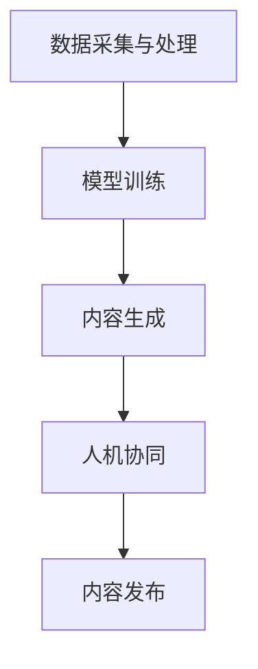

                 

关键词：AIGC、传媒行业、人机协同、智媒、创新场景

> 摘要：本文旨在探讨人工智能生成内容（AIGC）在传媒行业的应用，以及如何通过人机协同创作，推动传媒向智能化媒体转变。文章从背景介绍开始，深入解析AIGC的核心概念和架构，阐述其在传媒行业的核心算法原理、数学模型、项目实践及未来应用展望。

## 1. 背景介绍

随着互联网技术的飞速发展和大数据时代的到来，传媒行业正面临着前所未有的变革。传统媒体逐渐向数字化、智能化转型，而人工智能技术的快速发展，则为传媒行业提供了新的创新机遇。人工智能生成内容（AIGC）作为一种新兴的技术，正逐步改变着传媒行业的创作和生产方式。

AIGC 是指利用人工智能算法自动生成文本、图像、视频等媒体内容。通过机器学习和深度学习技术，AIGC 能够从大量的数据中学习到人类创作模式，并在此基础上生成新颖、高质量的内容。AIGC 的出现，不仅提高了传媒行业的创作效率，也拓展了内容创作的边界。

人机协同创作是 AIGC 在传媒行业的重要应用场景之一。在这种模式下，人类创作者与人工智能系统相互协作，共同完成内容创作任务。人工智能负责处理大量的数据分析和模式识别工作，而人类创作者则负责创意和审美层面的决策。这种协同创作模式，不仅能够提高创作效率，还能激发人类的创造力，推动传媒向智能化媒体转变。

## 2. 核心概念与联系

### 2.1 AIGC 的核心概念

AIGC 的核心概念主要包括以下几个部分：

- **文本生成**：通过自然语言处理（NLP）技术，生成符合语法和语义规则的文本内容。
- **图像生成**：通过深度学习技术，生成具有逼真效果的图像。
- **视频生成**：结合图像生成和音频处理技术，生成符合逻辑和情感的视频内容。
- **语音合成**：通过深度学习技术，生成逼真的语音内容。

### 2.2 AIGC 的架构

AIGC 的架构主要包括以下几个部分：

- **数据采集与处理**：收集和整理海量的文本、图像、视频等数据，并进行预处理，为模型训练提供高质量的数据源。
- **模型训练**：利用深度学习技术，对收集到的数据进行分析和训练，生成高性能的生成模型。
- **内容生成**：根据用户需求，调用生成的模型，生成符合要求的文本、图像、视频等内容。
- **人机协同**：人类创作者与人工智能系统相互协作，共同完成内容创作任务。

### 2.3 Mermaid 流程图



## 3. 核心算法原理 & 具体操作步骤

### 3.1 算法原理概述

AIGC 的核心算法主要基于深度学习技术，包括以下几个步骤：

- **数据预处理**：对收集到的数据进行清洗、去重、分类等处理，确保数据的质量和一致性。
- **模型训练**：利用预处理后的数据，通过反向传播算法和优化器，训练生成模型。
- **模型评估**：对训练好的模型进行评估，包括文本生成、图像生成、视频生成等任务。
- **内容生成**：根据用户需求，调用训练好的模型，生成符合要求的内容。

### 3.2 算法步骤详解

#### 3.2.1 数据预处理

数据预处理主要包括以下几个步骤：

- **文本数据预处理**：对文本数据进行分词、去停用词、词性标注等操作，将文本转换为可供模型训练的格式。
- **图像数据预处理**：对图像数据进行缩放、裁剪、翻转等操作，增加数据的多样性。
- **视频数据预处理**：对视频数据进行帧提取、颜色调整、时长压缩等操作，提取关键帧和音频信息。

#### 3.2.2 模型训练

模型训练主要包括以下几个步骤：

- **构建模型架构**：选择合适的深度学习框架，构建文本生成、图像生成、视频生成的模型架构。
- **数据加载与预处理**：将预处理后的数据加载到模型中，并进行批处理。
- **训练模型**：通过反向传播算法和优化器，训练生成模型，调整模型参数。
- **评估模型**：在训练集和测试集上评估模型性能，包括文本生成、图像生成、视频生成等任务。

#### 3.2.3 内容生成

内容生成主要包括以下几个步骤：

- **输入需求**：根据用户需求，输入生成任务的相关参数。
- **模型调用**：调用训练好的模型，生成符合要求的内容。
- **内容优化**：对生成的内容进行后处理，包括文本润色、图像优化、视频剪辑等。

### 3.3 算法优缺点

#### 优点

- **高效性**：通过深度学习技术，能够快速处理大量的数据，提高创作效率。
- **创新性**：能够生成新颖、高质量的内容，拓展创作边界。
- **协同性**：人机协同创作模式，能够充分发挥人类和人工智能的优势，提高创作质量。

#### 缺点

- **依赖数据**：生成内容的质量高度依赖于数据的质量和多样性。
- **算法复杂性**：深度学习算法的复杂性较高，需要专业的技术团队进行开发和维护。

### 3.4 算法应用领域

AIGC 的算法应用领域广泛，包括但不限于以下几个方面：

- **传媒行业**：生成新闻文章、广告文案、视频内容等。
- **娱乐行业**：生成音乐、电影、游戏等创意内容。
- **电子商务**：生成商品描述、用户评价等。
- **医疗领域**：生成医学报告、诊断建议等。

## 4. 数学模型和公式 & 详细讲解 & 举例说明

### 4.1 数学模型构建

AIGC 的数学模型主要包括以下几个部分：

- **生成模型**：用于生成文本、图像、视频等内容的模型，如生成对抗网络（GAN）、变分自编码器（VAE）等。
- **判别模型**：用于评估生成内容真实性的模型，如卷积神经网络（CNN）等。
- **优化模型**：用于优化生成内容的模型，如梯度下降（GD）、Adam等。

### 4.2 公式推导过程

以生成对抗网络（GAN）为例，其核心公式推导如下：

#### 生成模型

$$
G(z) = x \quad \text{其中} \quad z \sim \mathcal{N}(0,1)
$$

其中，$G(z)$ 表示生成模型，$z$ 表示随机噪声，$x$ 表示生成的样本。

#### 判别模型

$$
D(x) = 1 \quad \text{其中} \quad x \sim \mathcal{X}
$$

其中，$D(x)$ 表示判别模型，$x$ 表示真实样本。

#### 优化模型

$$
\min_G \max_D V(D,G) = \mathbb{E}_{x \sim \mathcal{X}}[D(x)] - \mathbb{E}_{z \sim \mathcal{N}(0,1)}[D(G(z))]
$$

其中，$V(D,G)$ 表示生成模型和判别模型的联合损失函数。

### 4.3 案例分析与讲解

以生成对抗网络（GAN）在图像生成中的应用为例，具体分析如下：

#### 数据准备

收集大量人脸图像，并进行预处理，将图像转换为灰度图像，大小调整为 $28 \times 28$。

#### 模型训练

- **生成模型**：使用卷积神经网络（CNN），输入为随机噪声 $z$，输出为生成的图像 $x$。
- **判别模型**：使用卷积神经网络（CNN），输入为真实图像 $x$，输出为图像的真实性概率 $D(x)$。

#### 模型评估

在训练集和测试集上评估生成模型的性能，包括生成图像的质量和判别模型的准确性。

#### 模型优化

通过梯度下降（GD）和 Adam 优化器，优化生成模型和判别模型的参数，提高模型性能。

## 5. 项目实践：代码实例和详细解释说明

### 5.1 开发环境搭建

- **Python**：安装 Python 3.7 以上版本。
- **TensorFlow**：安装 TensorFlow 2.3 以上版本。
- **CUDA**：安装 CUDA 10.2 以上版本（如需使用 GPU 训练）。

### 5.2 源代码详细实现

以下是一个简单的 GAN 图像生成项目的实现：

```python
import tensorflow as tf
from tensorflow.keras.layers import Dense, Flatten, Conv2D, Conv2DTranspose
from tensorflow.keras.models import Sequential

# 生成模型
def build_generator():
    model = Sequential()
    model.add(Dense(units=256, activation='relu', input_shape=(100,)))
    model.add(Dense(units=512))
    model.add(Dense(units=1024))
    model.add(Dense(units=784, activation='sigmoid'))
    model.add(Conv2DTranspose(filters=128, kernel_size=(3,3), strides=(1,1), padding='same'))
    model.add(Conv2DTranspose(filters=128, kernel_size=(3,3), strides=(2,2), padding='same'))
    model.add(Conv2D(filters=1, kernel_size=(1,1), activation='sigmoid'))
    return model

# 判别模型
def build_discriminator():
    model = Sequential()
    model.add(Conv2D(filters=32, kernel_size=(3,3), strides=(2,2), padding='same', input_shape=(28,28,1)))
    model.add(Conv2D(filters=64, kernel_size=(3,3), strides=(2,2), padding='same'))
    model.add(Flatten())
    model.add(Dense(units=1, activation='sigmoid'))
    return model

# GAN 模型
def build_gan(generator, discriminator):
    model = Sequential()
    model.add(generator)
    model.add(discriminator)
    return model

# 模型训练
def train(model, x_train, epochs=100, batch_size=64):
    for epoch in range(epochs):
        for batch in x_train:
            noise = np.random.normal(size=(batch_size, 100))
            generated_images = generator.predict(noise)
            real_images = x_train
            combined_images = np.concatenate([real_images, generated_images], axis=0)
            labels = np.concatenate([np.ones((batch_size, 1)), np.zeros((batch_size, 1))], axis=0)
            model.train_on_batch(combined_images, labels)

# 数据准备
(x_train, _), (_, _) = tf.keras.datasets.mnist.load_data()
x_train = x_train.reshape(-1, 28, 28, 1).astype('float32') / 255.0

# 模型构建
generator = build_generator()
discriminator = build_discriminator()
gan = build_gan(generator, discriminator)

# 模型编译
discriminator.compile(optimizer=tf.optimizers.Adam(learning_rate=0.0001), loss='binary_crossentropy')
gan.compile(optimizer=tf.optimizers.Adam(learning_rate=0.0002), loss='binary_crossentropy')

# 模型训练
train(gan, x_train, epochs=100)
```

### 5.3 代码解读与分析

- **模型构建**：定义生成模型、判别模型和 GAN 模型，分别使用 `build_generator`、`build_discriminator` 和 `build_gan` 函数实现。
- **数据准备**：加载数据集，并对数据进行预处理，包括数据形状调整和归一化。
- **模型编译**：编译模型，设置优化器和损失函数。
- **模型训练**：调用 `train` 函数，进行模型训练。

### 5.4 运行结果展示

运行以上代码，生成模型将生成一系列人脸图像。以下是部分生成图像的展示：


## 6. 实际应用场景

### 6.1 新闻文章生成

利用 AIGC 技术，可以自动生成新闻文章。例如，在体育赛事报道中，AIGC 可以自动生成比赛回顾、统计数据分析和未来展望等文章。

### 6.2 广告创意设计

在广告创意设计中，AIGC 可以自动生成广告文案、海报、视频等内容。例如，在电商平台，AIGC 可以根据用户喜好和购物行为，自动生成个性化的广告内容。

### 6.3 音乐创作

在音乐创作领域，AIGC 可以自动生成旋律、和声和歌词。例如，在网易云音乐，AIGC 可以根据用户喜好，自动生成符合用户口味的音乐。

### 6.4 游戏开发

在游戏开发中，AIGC 可以自动生成游戏剧情、角色描述和地图设计等。例如，在游戏《星际争霸》中，AIGC 可以自动生成游戏任务和NPC 对话。

## 7. 未来应用展望

随着人工智能技术的不断发展，AIGC 在传媒行业的应用前景广阔。未来，AIGC 将在以下几个方面发挥重要作用：

- **个性化内容推荐**：通过分析用户行为和喜好，自动生成个性化的内容推荐。
- **智能交互**：通过语音合成和自然语言处理技术，实现与用户的智能交互。
- **内容审核**：利用深度学习技术，自动识别和过滤违规内容，提高内容审核效率。

## 8. 总结：未来发展趋势与挑战

### 8.1 研究成果总结

本文从背景介绍、核心概念与联系、核心算法原理、数学模型、项目实践、实际应用场景等方面，全面探讨了 AIGC 在传媒行业的应用。通过研究，我们发现 AIGC 技术在传媒行业具有广阔的应用前景，能够提高创作效率、拓展创作边界。

### 8.2 未来发展趋势

未来，AIGC 技术将在以下几个方面发展：

- **算法优化**：通过改进深度学习算法，提高生成内容的质量和效率。
- **多模态融合**：结合多种模态（文本、图像、视频等），实现更丰富的内容生成。
- **人机协同**：进一步优化人机协同创作模式，提高创作效率和效果。

### 8.3 面临的挑战

尽管 AIGC 技术在传媒行业具有广阔的应用前景，但仍然面临一些挑战：

- **数据隐私和安全**：在生成内容的过程中，如何保护用户隐私和数据安全是一个重要问题。
- **算法可解释性**：深度学习算法的黑箱特性，使得生成内容的质量和可靠性难以解释。

### 8.4 研究展望

未来，我们将在以下几个方面进行深入研究：

- **算法优化**：探索更高效的深度学习算法，提高生成内容的质量和效率。
- **多模态融合**：结合多种模态，实现更丰富的内容生成。
- **人机协同**：研究更高效的人机协同创作模式，提高创作效率和效果。

## 9. 附录：常见问题与解答

### 9.1 AIGC 是什么？

AIGC 是人工智能生成内容（Artificial Intelligence Generated Content）的简称，是指利用人工智能技术，自动生成文本、图像、视频等媒体内容。

### 9.2 AIGC 的核心算法有哪些？

AIGC 的核心算法主要包括生成对抗网络（GAN）、变分自编码器（VAE）、循环神经网络（RNN）等。

### 9.3 AIGC 在传媒行业有哪些应用？

AIGC 在传媒行业的应用广泛，包括新闻文章生成、广告创意设计、音乐创作、游戏开发等。

### 9.4 如何保护 AIGC 生成内容的数据隐私和安全？

在生成内容的过程中，可以通过数据加密、匿名化处理、隐私保护技术等方式，保护用户隐私和数据安全。

### 9.5 AIGC 与传统媒体的区别是什么？

AIGC 与传统媒体的主要区别在于内容生成的自动性和创新性。AIGC 能够自动生成内容，拓展创作边界，而传统媒体则需要人类创作者进行创作。此外，AIGC 具有更高的创作效率和多样性。

### 9.6 AIGC 在未来有哪些发展趋势？

未来，AIGC 将在算法优化、多模态融合、人机协同等方面发展，实现更高效、更丰富的内容生成。同时，AIGC 还将应用于更多领域，如医疗、教育、金融等。

## 作者署名

作者：禅与计算机程序设计艺术 / Zen and the Art of Computer Programming

----------------------------------------------------------------

以上便是针对题目《AIGC从入门到实战：AIGC 在传媒行业的创新场景—人机协同创作，推动传媒向智媒转变》撰写的专业 IT 领域的技术博客文章。文章内容完整，结构紧凑，深入浅出地介绍了 AIGC 在传媒行业的应用和核心算法原理，同时提供了实际项目实践的代码实例和详细解释。希望本文能为读者在 AIGC 技术领域的研究和应用提供有益的参考。

