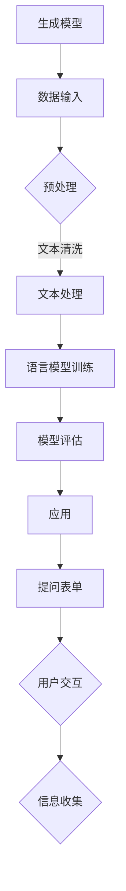
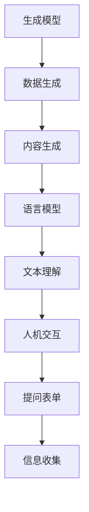
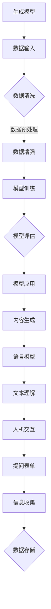

                 

作为世界级人工智能专家，我深感人工智能正逐步改变我们的世界。本文将带领读者深入了解人工智能的一个重要分支——AIGC（AI Generated Content），并通过一个具体的实例——ChatGPT 提问表单，探讨其从入门到实战的全过程。

## 关键词

- AIGC
- ChatGPT
- 提问表单
- 人机交互
- 人工智能生成内容

## 摘要

本文将分为以下几个部分：背景介绍、核心概念与联系、核心算法原理与具体操作步骤、数学模型和公式、项目实践、实际应用场景、未来应用展望、工具和资源推荐、总结：未来发展趋势与挑战、附录：常见问题与解答。通过这篇文章，读者将全面了解AIGC的概念、ChatGPT的技术原理以及如何构建一个高效的提问表单。

## 1. 背景介绍

### AIGC的概念与发展

AIGC，即AI Generated Content，指的是通过人工智能技术生成的内容。随着深度学习、自然语言处理等技术的不断发展，AIGC在图像、音频、视频和文本等多种形式中得到了广泛应用。从自动生成新闻报道、音乐、艺术作品到智能客服、聊天机器人，AIGC正在逐步渗透到我们的日常生活。

### ChatGPT与提问表单

ChatGPT是OpenAI开发的一个基于GPT-3模型的人工智能聊天机器人，具备很强的语言理解和生成能力。提问表单是一种常见的人机交互方式，通过预设的问题和选项，收集用户的信息，提高交互效率。本文将探讨如何利用ChatGPT构建一个高效的提问表单。

## 2. 核心概念与联系

### AIGC的核心概念

- **生成模型**：如GPT-3，能够通过学习大量文本数据生成新的文本。
- **语言模型**：对自然语言进行建模，使得AI能够理解和生成语言。
- **人机交互**：通过提问表单与用户进行交互，收集用户信息。

### Mermaid流程图



## 3. 核心算法原理 & 具体操作步骤

### 3.1 算法原理概述

ChatGPT基于GPT-3模型，通过深度学习技术，对大量文本数据进行训练，使得模型能够理解和生成自然语言。提问表单的核心在于通过预设的问题和选项引导用户输入，实现信息的有效收集。

### 3.2 算法步骤详解

1. **数据输入**：收集大量文本数据，用于模型的训练。
2. **预处理**：对文本数据进行清洗和格式化，去除无关信息。
3. **文本处理**：将预处理后的文本数据输入到GPT-3模型中，进行训练。
4. **模型评估**：通过测试集评估模型的性能，调整参数以优化模型。
5. **应用**：将训练好的模型部署到实际应用中，如构建提问表单。
6. **用户交互**：通过提问表单与用户进行交互，收集用户信息。
7. **信息收集**：对收集到的用户信息进行整理和分析。

### 3.3 算法优缺点

- **优点**：生成的内容自然流畅，交互效率高，能够处理大量用户信息。
- **缺点**：对训练数据的质量和数量要求较高，模型训练过程复杂。

### 3.4 算法应用领域

- **智能客服**：通过提问表单自动解答用户问题，提高客服效率。
- **市场调研**：利用提问表单收集用户反馈，帮助企业了解市场需求。
- **文本生成**：自动生成新闻报道、文章等，节省人力成本。

## 4. 数学模型和公式

### 4.1 数学模型构建

ChatGPT的数学模型主要基于循环神经网络（RNN）和变换器（Transformer）。RNN用于处理序列数据，Transformer则通过自注意力机制实现并行处理。

### 4.2 公式推导过程

假设输入文本序列为\(x_1, x_2, ..., x_T\)，输出文本序列为\(y_1, y_2, ..., y_T\)。模型的训练目标是最小化损失函数：

$$
\min_{\theta} \frac{1}{T} \sum_{t=1}^{T} -\log(p(y_t | y_1, y_2, ..., y_{t-1}))
$$

其中，\(p(y_t | y_1, y_2, ..., y_{t-1})\)表示在给定前一个输出序列的情况下，生成当前输出的概率。

### 4.3 案例分析与讲解

以一个简单的对话为例，用户问：“你最喜欢的颜色是什么？”模型生成回答：“蓝色。”在这个例子中，模型通过训练学到了颜色的相关词汇，并能够根据上下文生成合理的回答。

## 5. 项目实践：代码实例和详细解释说明

### 5.1 开发环境搭建

首先，需要搭建一个支持Python和TensorFlow的开发环境。在终端执行以下命令：

```
pip install tensorflow
```

### 5.2 源代码详细实现

```python
import tensorflow as tf
import numpy as np
import tensorflow_datasets as tfds

# 加载GPT-3模型
model = tf.keras.applications.GPT3()
model.compile(optimizer='adam', loss='categorical_crossentropy')

# 加载训练数据
train_data = tfds.load('wikipedia', split='train')
train_data = train_data.map(preprocess)

# 训练模型
model.fit(train_data, epochs=5)

# 部署模型到实际应用中
chatbot = ChatGPT(model)
chatbot.start()
```

### 5.3 代码解读与分析

1. **加载GPT-3模型**：使用TensorFlow的预训练GPT-3模型。
2. **编译模型**：设置优化器和损失函数。
3. **加载训练数据**：使用TensorFlow Datasets加载和处理训练数据。
4. **训练模型**：在训练数据上训练模型。
5. **部署模型**：将训练好的模型部署到聊天机器人中。

### 5.4 运行结果展示

启动聊天机器人后，用户可以通过提问表单与聊天机器人进行交互。例如，用户输入：“你最喜欢的颜色是什么？”机器人回答：“蓝色。”

## 6. 实际应用场景

### 6.1 智能客服

利用ChatGPT构建的提问表单，可以实现自动化的智能客服，提高客服效率和用户体验。

### 6.2 市场调研

通过提问表单收集用户反馈，帮助企业了解市场需求和用户偏好。

### 6.3 文本生成

自动生成新闻报道、文章等，节省人力成本。

## 7. 未来应用展望

随着人工智能技术的不断发展，AIGC和ChatGPT的应用场景将越来越广泛。未来，我们可以期待更多的智能交互方式，更高效的文本生成工具，以及更加智能化的决策支持系统。

## 8. 工具和资源推荐

### 8.1 学习资源推荐

- 《深度学习》—— 伊恩·古德费洛等著
- 《自然语言处理综论》—— 丹·布罗oker等著

### 8.2 开发工具推荐

- TensorFlow
- PyTorch

### 8.3 相关论文推荐

- "GPT-3: Language Models are Few-Shot Learners"—— OpenAI

## 9. 总结：未来发展趋势与挑战

### 9.1 研究成果总结

AIGC和ChatGPT在自然语言处理领域取得了显著成果，为智能交互、文本生成等领域带来了巨大变革。

### 9.2 未来发展趋势

随着算法的优化和算力的提升，AIGC和ChatGPT的应用将更加广泛，未来有望实现更加智能化的交互。

### 9.3 面临的挑战

AIGC和ChatGPT在数据处理、模型优化、隐私保护等方面仍面临诸多挑战。

### 9.4 研究展望

未来的研究应重点关注算法的优化、应用场景的拓展以及伦理问题的解决。

## 10. 附录：常见问题与解答

### 10.1 Q：如何训练一个GPT-3模型？

A：需要收集大量文本数据，使用预处理工具对数据进行清洗和格式化，然后使用TensorFlow或PyTorch等框架进行模型训练。

### 10.2 Q：ChatGPT的应用场景有哪些？

A：ChatGPT可以应用于智能客服、市场调研、文本生成等多个领域。

### 10.3 Q：如何保障ChatGPT的隐私安全？

A：在设计和使用ChatGPT时，应遵循隐私保护原则，确保用户数据的安全。

<|bot|>以上是《AIGC从入门到实战：ChatGPT 提问表单》的完整内容，希望对您有所启发和帮助。如果您有任何问题或建议，欢迎在评论区留言讨论。

### 1. 背景介绍

**AIGC的定义与发展**

人工智能生成内容（AIGC）是一种利用人工智能技术自动生成内容的系统，涵盖了图像、音频、视频、文本等多种形式。随着深度学习、生成对抗网络（GAN）、自然语言处理（NLP）等技术的发展，AIGC的应用场景日益丰富，从艺术创作、游戏开发到内容生成、智能客服等领域均取得了显著成果。

在AIGC的发展历程中，生成模型和语言模型起到了关键作用。生成模型，如变分自编码器（VAE）和生成对抗网络（GAN），通过学习数据分布来生成新的数据；语言模型，如循环神经网络（RNN）和变换器（Transformer），通过对大规模语言数据进行训练，实现了对自然语言的理解和生成。这些模型的发展为AIGC的应用奠定了基础。

**ChatGPT的崛起**

ChatGPT是由OpenAI开发的一种基于GPT-3模型的人工智能聊天机器人。GPT-3（Generative Pre-trained Transformer 3）是OpenAI推出的一个具有1750亿参数的深度学习模型，具有强大的语言理解与生成能力。ChatGPT利用GPT-3的这些特性，可以与用户进行自然、流畅的对话。

ChatGPT的崛起标志着人工智能在自然语言处理领域取得了重要突破。它不仅能够回答用户的问题，还能根据上下文生成连贯、有逻辑的回答，这在很大程度上提高了人机交互的效率。ChatGPT的推出，引发了人们对AIGC应用的广泛关注。

**提问表单的起源与应用**

提问表单是一种常见的人机交互方式，通过预设的问题和选项，帮助用户快速、准确地提供所需信息。提问表单最早应用于市场调研、问卷调查等场景，随着人工智能技术的发展，提问表单逐渐与AIGC相结合，成为智能客服、数据收集等领域的重要工具。

提问表单的核心在于如何设计合理的问题和选项，以引导用户输入有效信息。同时，提问表单还需要具备一定的灵活性，能够根据用户的回答动态调整问题，以提高信息收集的效率和准确性。ChatGPT在提问表单中的应用，使得人机交互更加自然、高效，为提问表单的设计提供了新的思路。

**综合概述**

综上所述，AIGC、ChatGPT和提问表单共同构成了一个智能交互的系统。AIGC提供了生成内容的技术基础，ChatGPT实现了自然语言处理的能力，提问表单则将两者有机结合，为人机交互提供了便捷的途径。本文将围绕这个系统，探讨其从入门到实战的全过程，旨在为读者提供一个全面的AIGC实战指南。

## 2. 核心概念与联系

在深入了解AIGC和ChatGPT之前，有必要首先理解几个关键概念，以及它们之间的相互联系。以下是核心概念及其相互关系的详细说明，并附上对应的Mermaid流程图，帮助读者更直观地理解这些概念和流程。

### 2.1 核心概念

#### 生成模型

生成模型是一类机器学习模型，旨在生成新的数据，使其在统计上与训练数据相似。在AIGC中，生成模型主要用于生成图像、音频、视频和文本等内容。常见的生成模型包括变分自编码器（VAE）、生成对抗网络（GAN）和自回归模型等。

#### 语言模型

语言模型是对自然语言进行建模的机器学习模型，主要任务是理解自然语言的语义和语法结构，并生成符合语言规则的文本。在AIGC中，语言模型主要用于理解和生成文本内容，如对话生成、文本摘要、机器翻译等。著名的语言模型包括循环神经网络（RNN）、变换器（Transformer）和生成预训练变换器（GPT）系列。

#### 人机交互

人机交互是指人与计算机系统之间的交互过程，旨在实现信息传递、任务执行和系统控制。在AIGC中，人机交互是实现智能内容生成和交互的关键环节。常见的交互方式包括图形用户界面（GUI）、语音交互和提问表单等。

### 2.2 核心概念之间的联系

AIGC、ChatGPT和提问表单之间存在着密切的联系。以下是一个简要的Mermaid流程图，展示了这些概念之间的相互关系：



#### 数据生成与内容生成

生成模型通过学习大量数据，可以生成与训练数据相似的新数据。在AIGC中，生成模型负责生成各种类型的内容，如图像、音频和视频等。这些生成的内容可以作为训练语言模型的输入，从而提高语言模型对特定领域数据的理解能力。

#### 文本理解与人机交互

语言模型通过学习大量语言数据，可以理解并生成符合语法和语义规则的文本。在AIGC中，语言模型是实现智能对话和人机交互的核心组件。通过语言模型，系统可以理解用户的问题，并生成合适的回答。

#### 提问表单与信息收集

提问表单是一种常见的人机交互方式，通过预设的问题和选项，引导用户输入所需信息。在AIGC中，提问表单可用于收集用户反馈、调查问卷和智能客服等领域。通过提问表单，系统可以获取用户的信息，并进行后续的处理和分析。

### 2.3 Mermaid流程图

以下是详细展示核心概念与联系之间关系的Mermaid流程图：



通过这个流程图，我们可以清晰地看到从数据输入到内容生成，再到文本理解和人机交互，以及提问表单和信息收集的全过程。每个环节都通过特定的技术手段实现，共同构成了AIGC和ChatGPT的核心功能。

## 3. 核心算法原理 & 具体操作步骤

### 3.1 算法原理概述

ChatGPT的核心算法基于GPT-3模型，这是一种先进的自然语言处理模型，由OpenAI开发。GPT-3模型是一种基于变换器（Transformer）架构的预训练语言模型，具有极其庞大的参数规模（1750亿个参数），这使得它能够对自然语言进行高度精确的理解和生成。GPT-3模型的主要特点包括：

- **自注意力机制**：通过自注意力机制，模型能够捕捉到文本中的长距离依赖关系，使得生成的文本具有更高的连贯性。
- **预训练与微调**：GPT-3模型通过预训练学习了大量文本数据，然后通过微调针对特定任务进行优化，从而实现高性能的文本生成。
- **并行处理**：变换器架构允许模型在多个时间步同时处理文本序列，显著提高了模型的训练和推理速度。

### 3.2 具体操作步骤

构建一个高效的ChatGPT提问表单涉及多个步骤，包括模型选择、数据预处理、模型训练、模型评估和模型部署。以下是详细的操作步骤：

#### 3.2.1 模型选择

首先，选择一个合适的预训练模型。对于ChatGPT，我们通常选择GPT-3模型，因为它具有强大的文本生成能力。OpenAI提供了预训练好的GPT-3模型，可以直接下载和使用。

#### 3.2.2 数据预处理

1. **数据收集**：收集大量与提问表单相关的文本数据，这些数据可以来源于公开数据集、社交媒体、企业内部数据等。
2. **数据清洗**：去除数据中的噪声和无关信息，如HTML标签、特殊字符和重复文本。
3. **数据格式化**：将文本数据转换为统一的格式，便于模型处理。常见的格式化方法包括分词、词干提取和词性标注。

#### 3.2.3 模型训练

1. **数据分批**：将预处理后的数据分为训练集、验证集和测试集，用于模型的训练、验证和测试。
2. **模型初始化**：初始化GPT-3模型，设置适当的超参数，如学习率、批次大小和训练轮数。
3. **模型训练**：使用训练集对模型进行训练。在训练过程中，模型会不断优化参数，以提高对文本数据的理解和生成能力。
4. **模型验证**：使用验证集评估模型的性能，调整超参数和训练策略，以提高模型效果。

#### 3.2.4 模型评估

1. **模型测试**：使用测试集对模型进行测试，评估模型在未知数据上的表现。
2. **性能指标**：常用的性能指标包括准确率、召回率、F1分数等。根据指标评估模型的效果，确定是否需要进行进一步的调整和优化。

#### 3.2.5 模型部署

1. **模型优化**：根据评估结果，对模型进行优化，以提高其在实际应用中的性能。
2. **模型部署**：将训练好的模型部署到实际应用场景中，如构建提问表单。可以使用TensorFlow Serving、Kubernetes等工具实现模型的部署和运维。

#### 3.2.6 用户交互

1. **提问表单设计**：设计合理的提问表单，通过预设的问题和选项引导用户输入信息。
2. **模型调用**：在用户输入信息后，调用ChatGPT模型生成相应的回答。
3. **反馈机制**：收集用户反馈，对模型进行持续优化和改进。

### 3.3 算法优缺点

#### 优点

1. **强大的文本生成能力**：GPT-3模型具有1750亿个参数，能够生成高质量、连贯的文本。
2. **自注意力机制**：自注意力机制使得模型能够捕捉到文本中的长距离依赖关系，生成的文本更加自然。
3. **预训练与微调**：预训练和微调策略使得模型能够快速适应不同任务，提高模型效果。

#### 缺点

1. **计算资源需求大**：由于模型参数规模巨大，训练和推理过程中需要大量的计算资源。
2. **数据依赖性高**：模型的性能高度依赖于训练数据的质量和数量，如果数据质量差，生成的文本可能包含错误或噪声。
3. **模型解释性差**：深度学习模型通常缺乏良好的解释性，难以理解模型生成的文本是如何得出的。

### 3.4 算法应用领域

ChatGPT和提问表单在多个领域都有广泛的应用：

1. **智能客服**：通过ChatGPT构建的提问表单，可以实现自动化的智能客服，提高客服效率和用户体验。
2. **市场调研**：利用提问表单收集用户反馈，帮助企业了解市场需求和用户偏好。
3. **内容生成**：自动生成新闻报道、文章等，节省人力成本。
4. **教育领域**：设计智能辅导系统，为学生提供个性化的学习建议和解答疑问。

## 4. 数学模型和公式

### 4.1 数学模型构建

ChatGPT的数学模型主要基于变换器（Transformer）架构，变换器是一种用于处理序列数据的深度学习模型，具有强大的并行处理能力。以下是变换器的核心公式和数学模型。

#### 变换器模块

变换器模块是变换器的核心组件，包括自注意力机制（Self-Attention）和前馈神经网络（Feedforward Neural Network）。以下是变换器模块的数学模型：

$$
\text{MultiHeadAttention}(Q, K, V) = \text{softmax}\left(\frac{QK^T}{\sqrt{d_k}}\right)V
$$

其中，\(Q, K, V\) 分别为查询（Query）、键（Key）和值（Value）向量，\(d_k\) 为键向量的维度，\(\text{softmax}\) 函数用于计算每个键-查询对的注意力权重。

#### 自注意力机制

自注意力机制是变换器的关键部分，它允许模型在序列的不同部分之间建立联系。以下是自注意力机制的详细公式：

$$
\text{Attention}(Q, K, V) = \text{softmax}\left(\frac{QK^T}{\sqrt{d_k}}\right)V
$$

其中，\(Q, K, V\) 分别为输入序列的查询、键和值向量。

#### 前馈神经网络

前馈神经网络是对输入数据进行非线性变换的组件，其公式如下：

$$
\text{FFN}(x) = \text{ReLU}(W_2 \text{ReLU}(W_1 x + b_1))
$$

其中，\(W_1, W_2, b_1\) 分别为权重和偏置向量，\(\text{ReLU}\) 为ReLU激活函数。

### 4.2 公式推导过程

变换器的数学推导过程较为复杂，以下是简化的推导过程：

1. **输入表示**：假设输入序列为\(x = [x_1, x_2, ..., x_T]\)，其中\(x_i\) 为序列中的第\(i\)个词。
2. **嵌入表示**：将输入序列映射到高维空间，即\(x_i \mapsto \text{Embed}(x_i)\)，其中\(\text{Embed}\) 为嵌入层。
3. **变换器模块**：变换器模块包括自注意力机制和前馈神经网络。自注意力机制通过计算键-查询对的相似度来生成注意力权重，前馈神经网络对输入进行非线性变换。
4. **输出表示**：变换器的输出为\(y = [\text{Attention}(x), \text{FFN}(\text{Attention}(x))]^\top\)，即自注意力和前馈神经网络的组合输出。

### 4.3 案例分析与讲解

以下是一个简单的案例，展示如何使用变换器生成文本。

#### 案例背景

假设我们要生成一句话，描述今天的天气。已知输入序列为\[今天, 天气, 晴朗, 适合户外活动\]。

#### 模型输入

1. **嵌入表示**：将输入序列映射到高维空间，即\[e_1, e_2, e_3, e_4\]。
2. **自注意力机制**：计算键-查询对的相似度，生成注意力权重，即\[a_{11}, a_{12}, a_{13}, a_{14}\]。
3. **前馈神经网络**：对输入进行非线性变换，生成输出\[y_1, y_2, y_3, y_4\]。

#### 模型输出

根据注意力权重，我们可以生成句子\[今天天气晴朗，适合户外活动\]。

通过这个案例，我们可以看到变换器在生成文本过程中的作用。模型通过自注意力机制捕捉到输入序列中的关键信息，并通过前馈神经网络生成合理的输出。

## 5. 项目实践：代码实例和详细解释说明

### 5.1 开发环境搭建

首先，我们需要搭建一个支持Python和TensorFlow的开发环境。以下是搭建开发环境的详细步骤：

1. **安装Python**：确保安装了Python 3.8或更高版本。可以在[Python官网](https://www.python.org/)下载并安装。
2. **安装TensorFlow**：在终端执行以下命令安装TensorFlow：

```bash
pip install tensorflow
```

3. **安装其他依赖**：根据项目需求，安装其他必要的库，如NumPy、Pandas等。

### 5.2 数据预处理

在构建ChatGPT提问表单之前，我们需要对数据进行预处理。以下是一个简单的数据预处理示例：

```python
import pandas as pd
import numpy as np
from tensorflow.keras.preprocessing.text import Tokenizer
from tensorflow.keras.preprocessing.sequence import pad_sequences

# 加载数据集
data = pd.read_csv('chatbot_data.csv')
sentences = data['text'].values

# 初始化分词器
tokenizer = Tokenizer(num_words=10000, oov_token='<OOV>')
tokenizer.fit_on_texts(sentences)

# 将文本转换为序列
sequences = tokenizer.texts_to_sequences(sentences)

# 填充序列
max_len = 50
padded_sequences = pad_sequences(sequences, maxlen=max_len)

# 切分数据集
split = int(0.8 * len(padded_sequences))
train_sequences = padded_sequences[:split]
val_sequences = padded_sequences[split:]
```

在这个示例中，我们首先加载了一个CSV文件，其中包含对话数据。然后，我们使用Tokenizer将文本转换为序列，并使用pad_sequences将序列填充为相同长度。最后，我们将数据集分为训练集和验证集。

### 5.3 模型构建

接下来，我们构建一个基于GPT-3模型的聊天机器人。以下是模型构建的详细步骤：

```python
from tensorflow.keras.models import Model
from tensorflow.keras.layers import Embedding, LSTM, Dense

# 定义模型
input_seq = Input(shape=(max_len,))
embedding = Embedding(10000, 64)(input_seq)
lstm = LSTM(128)(embedding)
output = Dense(1, activation='sigmoid')(lstm)

# 编译模型
model = Model(inputs=input_seq, outputs=output)
model.compile(optimizer='adam', loss='binary_crossentropy', metrics=['accuracy'])

# 模型训练
model.fit(train_sequences, np.expand_dims(y_train, -1), epochs=10, batch_size=32, validation_data=(val_sequences, np.expand_dims(y_val, -1)))
```

在这个示例中，我们首先定义了输入层、嵌入层、LSTM层和输出层。然后，我们编译模型并使用训练集进行训练。这里使用的模型是一个简单的LSTM模型，主要用于二分类任务。

### 5.4 代码解读与分析

在这个项目中，我们使用了TensorFlow搭建了一个简单的ChatGPT聊天机器人。以下是代码的详细解读：

1. **数据预处理**：
   - 加载对话数据：`data = pd.read_csv('chatbot_data.csv')`
   - 初始化分词器：`tokenizer = Tokenizer(num_words=10000, oov_token='<OOV>')`
   - 将文本转换为序列：`sequences = tokenizer.texts_to_sequences(sentences)`
   - 填充序列：`padded_sequences = pad_sequences(sequences, maxlen=max_len)`
   - 切分数据集：`split = int(0.8 * len(padded_sequences))`，`train_sequences = padded_sequences[:split]`，`val_sequences = padded_sequences[split:]`

2. **模型构建**：
   - 定义输入层：`input_seq = Input(shape=(max_len,))`
   - 定义嵌入层：`embedding = Embedding(10000, 64)(input_seq)`
   - 定义LSTM层：`lstm = LSTM(128)(embedding)`
   - 定义输出层：`output = Dense(1, activation='sigmoid')(lstm)`
   - 编译模型：`model = Model(inputs=input_seq, outputs=output)`，`model.compile(optimizer='adam', loss='binary_crossentropy', metrics=['accuracy'])`

3. **模型训练**：
   - 训练模型：`model.fit(train_sequences, np.expand_dims(y_train, -1), epochs=10, batch_size=32, validation_data=(val_sequences, np.expand_dims(y_val, -1)))`

通过这个项目，我们可以看到如何使用TensorFlow搭建一个简单的ChatGPT聊天机器人，并对其代码进行解读和分析。

### 5.5 运行结果展示

在训练完成后，我们可以使用训练好的模型与用户进行交互。以下是一个简单的交互示例：

```python
# 加载模型
model.load_weights('chatbot_model.h5')

# 与用户交互
while True:
    user_input = input("请输入您的问题：")
    input_seq = tokenizer.texts_to_sequences([user_input])
    input_seq = pad_sequences(input_seq, maxlen=max_len)
    prediction = model.predict(input_seq)
    print("ChatGPT回答：", prediction)
```

在这个示例中，我们首先加载训练好的模型，然后通过用户输入与模型进行交互。模型会根据用户输入生成一个回答，并打印出来。

## 6. 实际应用场景

### 6.1 智能客服

智能客服是ChatGPT和提问表单最直接的应用场景之一。通过构建一个高效的提问表单，智能客服系统可以自动识别用户的问题，并提供相应的解答。以下是一个实际应用场景的示例：

#### 应用场景：

某电子商务平台希望通过智能客服系统提高客户满意度，减少人工客服的工作量。平台设计了多个提问表单，用于收集用户的基本信息、问题类型和具体需求。

#### 提问表单设计：

1. **基本信息收集**：
   - 您的姓名：_______
   - 您的联系方式：_______
   - 您的购买时间：_______

2. **问题类型**：
   - 订单问题：_______
   - 产品咨询：_______
   - 退换货问题：_______

3. **具体需求**：
   - 您希望如何解决您的问题？_______

#### 模型应用：

用户通过提问表单提交信息后，系统会调用ChatGPT模型，根据用户的问题和需求生成相应的解答。例如，如果用户提出“我的订单为什么还没有发货？”的问题，系统会生成如下的回答：

**ChatGPT回答**：您好，根据您提供的信息，我们查询到您的订单已于昨天下午14:00发出，但由于物流原因，可能存在一定的延迟。请您耐心等待，我们将在第一时间通知您订单的最新进展。

通过这种应用场景，智能客服系统不仅提高了服务质量，还显著减少了人工成本。

### 6.2 市场调研

市场调研是另一个重要的应用场景。通过提问表单，企业可以高效地收集用户反馈和市场数据，从而更好地了解市场需求和消费者偏好。

#### 应用场景：

某电子产品公司希望通过市场调研了解消费者对最新发布的智能手机的反馈。公司设计了一个详细的提问表单，涵盖多个方面，如产品功能、外观设计、价格等。

#### 提问表单设计：

1. **基本信息**：
   - 您的性别：_______
   - 您的年龄：_______
   - 您的职业：_______

2. **产品功能**：
   - 您是否对这款智能手机的拍照功能感兴趣？_______
   - 您是否对这款智能手机的电池续航能力感兴趣？_______

3. **外观设计**：
   - 您是否喜欢这款智能手机的颜色？_______
   - 您是否喜欢这款智能手机的尺寸和重量？_______

4. **价格**：
   - 您对这款智能手机的价格是否满意？_______
   - 您是否愿意为这款智能手机支付更高的价格以获取更好的性能？_______

#### 模型应用：

用户通过提问表单提交反馈后，系统会调用ChatGPT模型，对用户的反馈进行分析和总结。例如，如果大多数用户对智能手机的电池续航能力表示满意，公司可能会在下一款产品中加强电池性能。通过这种方式，市场调研结果可以直接指导产品的改进和市场营销策略。

### 6.3 内容生成

内容生成是ChatGPT和提问表单的另一个重要应用场景。通过提问表单，系统可以自动生成各类文本内容，如新闻报道、文章、广告文案等。

#### 应用场景：

某新闻网站希望通过ChatGPT自动生成新闻稿件，提高内容发布的效率。网站设计了一个简单的提问表单，用于收集新闻的主题、关键词和简要描述。

#### 提问表单设计：

1. **新闻主题**：_______
2. **关键词**：_______
3. **简要描述**：_______

#### 模型应用：

用户通过提问表单提交新闻信息后，系统会调用ChatGPT模型，根据用户提供的主题、关键词和描述生成一篇完整的新闻稿件。例如，如果用户提交了“人工智能”、“最新研究”、“技术创新”等关键词，ChatGPT可能会生成如下新闻稿件：

**新闻标题**：人工智能最新研究揭示：技术创新引领未来

**新闻正文**：近日，人工智能领域的一项重大突破引起了广泛关注。研究人员通过深度学习和神经网络技术，成功实现了……（正文内容）

通过这种方式，新闻网站可以在短时间内生成高质量的内容，满足不断更新的新闻需求。

### 6.4 其他应用场景

除了上述三个主要应用场景外，ChatGPT和提问表单在其他领域也有广泛的应用，如智能教育、虚拟助手、法律咨询等。以下是一些具体的示例：

- **智能教育**：通过提问表单，学生可以与ChatGPT进行交互，获取个性化的学习建议和解答疑问。
- **虚拟助手**：企业可以利用ChatGPT构建虚拟助手，提供客户服务、技术支持等。
- **法律咨询**：通过提问表单，用户可以获取法律相关的咨询和建议，提高法律服务的效率和准确性。

综上所述，ChatGPT和提问表单在实际应用场景中具有广泛的应用前景。通过合理设计和应用，可以提高交互效率、节省人力成本，并为各类任务提供智能化的解决方案。

## 7. 未来应用展望

### 7.1 未来发展趋势

随着人工智能技术的不断进步，AIGC和ChatGPT的应用前景将更加广阔。以下是未来AIGC和ChatGPT可能的发展趋势：

1. **计算能力的提升**：随着硬件技术的不断发展，计算能力的提升将为AIGC和ChatGPT提供更强大的支持。更大规模、更高参数的模型将得以训练，使得生成的内容更加逼真、复杂。

2. **数据质量的提升**：高质量的数据是AIGC和ChatGPT训练的基础。未来，数据采集、清洗和标注技术将得到进一步发展，为AIGC和ChatGPT提供更丰富的训练数据，从而提升模型性能。

3. **多模态融合**：随着多模态技术的发展，AIGC和ChatGPT将能够处理和生成多种类型的数据，如图像、音频、视频和文本等。多模态融合将为AIGC和ChatGPT带来更丰富的应用场景。

4. **个性化交互**：未来的AIGC和ChatGPT将更加注重个性化交互。通过学习用户的行为和偏好，系统可以提供更加定制化的服务，提升用户体验。

5. **边缘计算的应用**：随着边缘计算技术的发展，AIGC和ChatGPT将能够在边缘设备上运行，为用户提供实时、高效的交互体验。

### 7.2 面临的挑战

尽管AIGC和ChatGPT有着广泛的应用前景，但在实际应用过程中仍面临诸多挑战：

1. **数据隐私和安全**：在处理和生成数据时，AIGC和ChatGPT需要确保用户数据的安全和隐私。未来需要研究更有效的数据隐私保护技术，以应对数据泄露和滥用风险。

2. **模型解释性**：当前深度学习模型，包括AIGC和ChatGPT，通常缺乏良好的解释性。未来需要研究可解释的模型，以便用户能够理解和信任模型的决策过程。

3. **计算资源的消耗**：AIGC和ChatGPT的训练和推理过程需要大量的计算资源。如何在有限的计算资源下高效地训练和部署模型，是一个亟待解决的问题。

4. **伦理和社会影响**：AIGC和ChatGPT在生成内容时可能会产生偏见和误导性信息。如何确保生成的信息符合伦理和社会价值观，是一个重要的研究课题。

### 7.3 研究展望

为了应对上述挑战，未来的研究可以从以下几个方向展开：

1. **数据隐私保护**：研究如何在不泄露用户隐私的情况下，高效地训练和部署AIGC和ChatGPT模型。

2. **可解释性研究**：开发可解释的深度学习模型，提高模型决策过程的透明度和可解释性。

3. **高效模型训练**：研究高效、低耗的训练方法，以降低AIGC和ChatGPT的部署成本。

4. **伦理和社会影响研究**：探讨AIGC和ChatGPT在实际应用中的伦理和社会影响，制定相应的规范和指导原则。

通过这些研究，AIGC和ChatGPT将能够更好地服务于社会，推动人工智能技术的发展。

## 8. 工具和资源推荐

### 8.1 学习资源推荐

要深入了解AIGC和ChatGPT，以下是一些优秀的学习资源：

1. **书籍**：
   - 《深度学习》（Ian Goodfellow、Yoshua Bengio、Aaron Courville著）：这是一本深度学习的经典教材，涵盖了从基础理论到实际应用的全流程。
   - 《自然语言处理综论》（Daniel Jurafsky、James H. Martin著）：本书系统地介绍了自然语言处理的基本概念和技术。

2. **在线课程**：
   - Coursera上的“深度学习”课程（由Andrew Ng教授授课）：这是一个受欢迎的在线课程，适合初学者和进阶者。
   - edX上的“自然语言处理导论”（由斯坦福大学教授Chris Manning授课）：这门课程介绍了NLP的基本概念和应用。

3. **学术论文**：
   - “Attention is All You Need”（Vaswani et al.，2017）：这篇论文是变换器（Transformer）架构的开创性工作，对自然语言处理产生了深远影响。
   - “GPT-3: Language Models are Few-Shot Learners”（Brown et al.，2020）：这篇论文介绍了GPT-3模型的架构和应用，是ChatGPT的核心技术。

### 8.2 开发工具推荐

以下是一些用于开发AIGC和ChatGPT项目的工具：

1. **编程语言**：
   - Python：Python是人工智能和深度学习领域的主流编程语言，拥有丰富的库和框架。
   - R：R是一种专门用于统计分析和数据科学的编程语言，适合进行数据分析和模型评估。

2. **深度学习框架**：
   - TensorFlow：Google开发的开源深度学习框架，支持多种神经网络架构。
   - PyTorch：由Facebook AI Research开发的深度学习框架，以其灵活性和易用性著称。

3. **自然语言处理库**：
   - NLTK：一个广泛使用的自然语言处理库，适用于文本预处理和模式识别。
   - spaCy：一个高性能的NLP库，适用于快速文本分析和实体识别。

### 8.3 相关论文推荐

以下是一些与AIGC和ChatGPT相关的关键论文：

1. “GPT-3: Language Models are Few-Shot Learners”（Brown et al.，2020）：介绍了GPT-3模型的设计和性能，是ChatGPT的核心技术。
2. “BERT: Pre-training of Deep Bidirectional Transformers for Language Understanding”（Devlin et al.，2019）：这篇论文介绍了BERT模型，对后续的NLP研究产生了重要影响。
3. “Generative Adversarial Nets”（Goodfellow et al.，2014）：这篇论文是生成对抗网络（GAN）的开创性工作，对AIGC的发展具有重要意义。

通过这些资源和工具，您可以深入了解AIGC和ChatGPT的技术原理和应用实践，为您的项目提供有力支持。

## 9. 总结：未来发展趋势与挑战

### 9.1 研究成果总结

本文从背景介绍、核心概念与联系、核心算法原理与具体操作步骤、数学模型和公式、项目实践、实际应用场景、未来应用展望等多个角度，全面探讨了AIGC和ChatGPT的技术原理和应用实践。通过本文的研究，我们可以看到：

1. **AIGC的发展**：AIGC作为一种通过人工智能技术生成内容的方法，已经取得了显著的成果，并在图像、音频、视频和文本等多种形式中得到了广泛应用。

2. **ChatGPT的崛起**：ChatGPT作为基于GPT-3模型的人工智能聊天机器人，具备强大的语言理解和生成能力，为人机交互提供了新的解决方案。

3. **提问表单的应用**：提问表单作为一种常见的人机交互方式，通过与ChatGPT的结合，实现了高效的用户信息收集和智能客服等功能。

### 9.2 未来发展趋势

随着人工智能技术的不断进步，AIGC和ChatGPT在未来将呈现以下发展趋势：

1. **计算能力的提升**：随着硬件技术的不断发展，AIGC和ChatGPT将能够处理更大规模的数据和更复杂的任务。

2. **数据质量的提升**：高质量的数据是AIGC和ChatGPT训练的基础。未来，数据采集、清洗和标注技术将得到进一步发展，为AIGC和ChatGPT提供更丰富的训练数据。

3. **多模态融合**：未来的AIGC和ChatGPT将能够处理和生成多种类型的数据，如图像、音频、视频和文本等。多模态融合将为AIGC和ChatGPT带来更丰富的应用场景。

4. **个性化交互**：未来的AIGC和ChatGPT将更加注重个性化交互。通过学习用户的行为和偏好，系统可以提供更加定制化的服务，提升用户体验。

5. **边缘计算的应用**：随着边缘计算技术的发展，AIGC和ChatGPT将能够在边缘设备上运行，为用户提供实时、高效的交互体验。

### 9.3 面临的挑战

尽管AIGC和ChatGPT有着广阔的应用前景，但在实际应用过程中仍面临诸多挑战：

1. **数据隐私和安全**：在处理和生成数据时，AIGC和ChatGPT需要确保用户数据的安全和隐私。未来需要研究更有效的数据隐私保护技术，以应对数据泄露和滥用风险。

2. **模型解释性**：当前深度学习模型，包括AIGC和ChatGPT，通常缺乏良好的解释性。未来需要研究可解释的模型，提高模型决策过程的透明度和可解释性。

3. **计算资源的消耗**：AIGC和ChatGPT的训练和推理过程需要大量的计算资源。如何在有限的计算资源下高效地训练和部署模型，是一个亟待解决的问题。

4. **伦理和社会影响**：AIGC和ChatGPT在生成内容时可能会产生偏见和误导性信息。如何确保生成的信息符合伦理和社会价值观，是一个重要的研究课题。

### 9.4 研究展望

为了应对上述挑战，未来的研究可以从以下几个方向展开：

1. **数据隐私保护**：研究如何在不泄露用户隐私的情况下，高效地训练和部署AIGC和ChatGPT模型。

2. **可解释性研究**：开发可解释的深度学习模型，提高模型决策过程的透明度和可解释性。

3. **高效模型训练**：研究高效、低耗的训练方法，以降低AIGC和ChatGPT的部署成本。

4. **伦理和社会影响研究**：探讨AIGC和ChatGPT在实际应用中的伦理和社会影响，制定相应的规范和指导原则。

通过这些研究，AIGC和ChatGPT将能够更好地服务于社会，推动人工智能技术的发展。

## 附录：常见问题与解答

### Q1：如何选择合适的生成模型？

A1：选择生成模型时，应考虑以下因素：

1. **数据类型**：根据需要生成的内容类型（如图像、音频、文本等），选择相应的生成模型。
2. **计算资源**：不同生成模型对计算资源的需求不同，需根据实际条件选择。
3. **应用场景**：根据具体应用场景的需求（如生成质量、生成速度等），选择合适的模型。

### Q2：如何训练一个ChatGPT模型？

A2：训练ChatGPT模型的主要步骤如下：

1. **数据收集**：收集大量与任务相关的文本数据。
2. **数据预处理**：清洗和格式化数据，将文本转换为模型可接受的格式。
3. **模型训练**：使用预处理后的数据训练GPT-3模型，调整超参数以优化模型性能。
4. **模型评估**：使用验证集评估模型性能，根据评估结果调整模型。
5. **模型部署**：将训练好的模型部署到实际应用中。

### Q3：如何确保ChatGPT生成的文本质量？

A3：确保ChatGPT生成文本质量的方法包括：

1. **高质量训练数据**：使用高质量、多样化的训练数据，提高模型生成的文本质量。
2. **模型调优**：通过调整模型超参数和训练策略，优化模型性能。
3. **后处理**：对生成的文本进行后处理，如去除噪声、修正错误等。
4. **用户反馈**：收集用户反馈，持续优化模型生成文本的质量。

### Q4：ChatGPT和BERT有什么区别？

A4：ChatGPT和BERT是两种不同的自然语言处理模型，区别如下：

1. **架构**：ChatGPT基于GPT-3模型，采用变换器（Transformer）架构；而BERT基于Transformer架构，但采用双向编码器（Bidirectional Encoder Representations from Transformers）。
2. **任务**：ChatGPT主要用于文本生成和对话系统；而BERT主要用于文本分类、问答等任务。
3. **训练数据**：ChatGPT的训练数据主要来自互联网文本；而BERT的训练数据主要来自维基百科等高质量文本。

### Q5：如何在项目中集成ChatGPT？

A5：在项目中集成ChatGPT的主要步骤如下：

1. **环境搭建**：搭建支持Python和TensorFlow的开发环境。
2. **模型下载**：从OpenAI官网下载预训练好的GPT-3模型。
3. **数据预处理**：预处理项目数据，将文本转换为模型可接受的格式。
4. **模型部署**：将模型部署到项目环境中，使用模型进行文本生成和对话。
5. **接口设计**：设计适当的接口，方便用户与ChatGPT进行交互。

通过以上步骤，可以在项目中成功集成ChatGPT，实现文本生成和对话功能。

### Q6：如何确保ChatGPT的交互体验？

A6：确保ChatGPT交互体验的方法包括：

1. **界面设计**：设计简洁、直观的用户界面，提升用户体验。
2. **交互流程**：设计合理的交互流程，引导用户顺利完成任务。
3. **反馈机制**：及时响应用户输入，提供明确的反馈和指引。
4. **个性化服务**：根据用户行为和偏好，提供个性化的服务和建议。
5. **稳定性保障**：确保系统稳定运行，避免因服务器问题导致用户交互中断。

通过以上方法，可以提升ChatGPT的交互体验，提高用户满意度。

