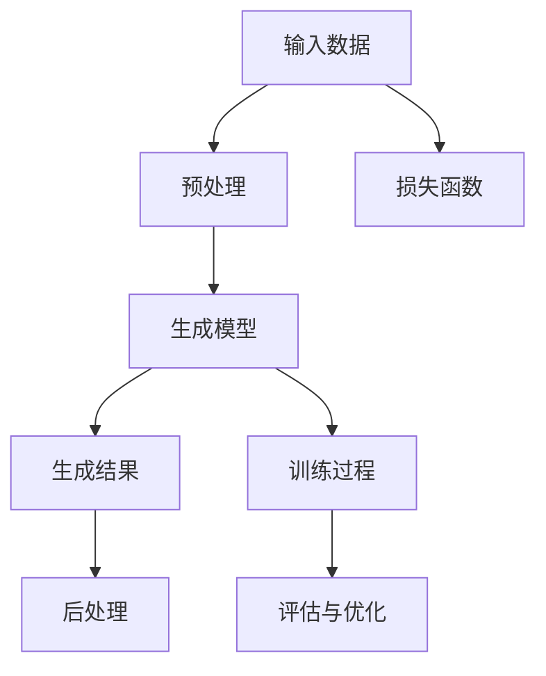

                 

关键词：AIGC，AI图片识别，图像生成，深度学习，计算机视觉，实战应用

> 摘要：本文将带你深入探索AIGC（AI Generated Content）的技术原理和应用实战。通过本文，你将了解AIGC的基本概念、核心算法、数学模型，以及如何在实际项目中应用AIGC技术，最终实现从入门到实战的全面掌握。

## 1. 背景介绍

随着深度学习和计算机视觉技术的飞速发展，人工智能在图像处理领域的应用越来越广泛。AIGC（AI Generated Content）作为一种新兴的技术，通过人工智能算法自动生成内容，为图像处理、虚拟现实、广告创意、游戏设计等领域带来了全新的变革。本文旨在帮助读者了解AIGC的基本概念、技术原理和应用场景，并通过实战项目让你深入了解如何使用AIGC技术。

### 1.1 AIGC的定义

AIGC是指利用人工智能技术自动生成内容的过程。它涵盖了一系列算法和技术，包括图像生成、文本生成、音频生成等。在本文中，我们主要关注图像生成部分，即如何使用人工智能技术从零开始生成高质量的图像。

### 1.2 AIGC的发展历史

AIGC技术的发展可以追溯到20世纪80年代，当时研究人员开始探索生成对抗网络（GAN）等深度学习模型。随着计算能力的提升和算法的优化，AIGC技术逐渐成熟，并在近年来取得了显著的进展。如今，AIGC已经在多个领域得到了广泛应用，为人工智能领域的发展带来了新的机遇。

### 1.3 AIGC的应用场景

AIGC技术具有广泛的应用场景，主要包括以下几个方面：

- **图像生成**：生成逼真的艺术作品、动漫形象、风景照片等。
- **虚拟现实**：创建虚拟现实场景中的物体、人物、建筑等。
- **广告创意**：生成个性化的广告创意，提高广告效果。
- **游戏设计**：生成游戏中的角色、场景、道具等。
- **医疗诊断**：辅助医生诊断疾病，如生成病患的X光片、CT片等。

## 2. 核心概念与联系

在深入探讨AIGC技术之前，我们需要了解几个核心概念和它们之间的联系。以下是一个Mermaid流程图，展示了AIGC技术的基本架构。



### 2.1 输入数据（Input Data）

输入数据是AIGC技术的基础。对于图像生成任务，输入数据可以是真实图像、标签、风格等。真实图像用于训练生成模型，标签用于指导模型生成特定类型的图像，风格则用于生成具有特定风格的图像。

### 2.2 预处理（Preprocessing）

预处理是指对输入数据进行处理，以便更好地适应生成模型的训练过程。预处理步骤包括图像增强、数据归一化、数据清洗等。

### 2.3 生成模型（Generator）

生成模型是AIGC技术的核心组成部分。生成模型通常采用深度学习算法，如生成对抗网络（GAN）、变分自编码器（VAE）等。这些模型能够学习输入数据的分布，并生成与输入数据相似的新图像。

### 2.4 生成结果（Generated Results）

生成结果是指生成模型生成的图像。生成结果的优劣直接影响AIGC技术的应用效果。为了提高生成结果的质量，通常需要对生成结果进行后处理，如图像修复、风格迁移等。

### 2.5 后处理（Postprocessing）

后处理是对生成结果进行进一步处理，以改善其视觉效果或满足特定应用需求。后处理步骤包括图像修复、图像增强、颜色校正等。

### 2.6 损失函数（Loss Function）

损失函数是评估生成模型性能的重要指标。在AIGC技术中，损失函数用于衡量生成模型生成的图像与真实图像之间的差距。常见的损失函数包括均方误差（MSE）、结构相似性（SSIM）等。

### 2.7 训练过程（Training Process）

训练过程是指生成模型在大量输入数据上进行迭代训练，以优化模型参数。训练过程包括数据预处理、模型训练、模型评估等步骤。

### 2.8 评估与优化（Evaluation and Optimization）

评估与优化是AIGC技术的重要环节。评估用于衡量生成模型的性能，优化则通过调整模型参数，提高生成结果的质量。

## 3. 核心算法原理 & 具体操作步骤

### 3.1 算法原理概述

AIGC技术主要依赖于生成对抗网络（GAN）和变分自编码器（VAE）等深度学习算法。以下是对这些算法的简要概述。

### 3.2 GAN算法原理

生成对抗网络（GAN）由生成器（Generator）和判别器（Discriminator）两部分组成。生成器的目标是生成与真实数据相似的假数据，判别器的目标是区分真实数据和假数据。训练过程中，生成器和判别器相互对抗，最终生成器生成逼真的假数据。

### 3.3 VAE算法原理

变分自编码器（VAE）是一种基于概率模型的生成模型。VAE由编码器（Encoder）和解码器（Decoder）两部分组成。编码器将输入数据映射到一个潜在空间，解码器则从潜在空间中采样并生成输出数据。

### 3.4 GAN和VAE的比较

GAN和VAE都是优秀的生成模型，但它们在原理和应用上有所不同。GAN通过对抗训练生成高质量的数据，适用于生成真实感强的图像。而VAE则更适合生成多样性和稳定性更高的数据，适用于图像生成、文本生成等领域。

### 3.5 GAN和VAE的应用步骤

以下是使用GAN和VAE进行图像生成的基本步骤：

1. **数据准备**：收集大量的真实图像作为训练数据。
2. **模型构建**：构建生成器和判别器的网络结构。
3. **模型训练**：通过迭代训练优化模型参数。
4. **生成图像**：使用训练好的模型生成新图像。
5. **后处理**：对生成的图像进行后处理，提高视觉效果。

## 3.6 算法优缺点

### 3.6.1 GAN的优点

- **生成质量高**：GAN能够生成高质量的假数据。
- **适应性强**：GAN适用于各种图像生成任务。

### 3.6.2 GAN的缺点

- **训练不稳定**：GAN的训练过程容易出现模式崩溃等问题。
- **计算成本高**：GAN的训练过程需要大量的计算资源。

### 3.6.3 VAE的优点

- **生成多样性高**：VAE能够生成多样化的数据。
- **生成稳定性好**：VAE的训练过程较为稳定。

### 3.6.4 VAE的缺点

- **生成质量相对较低**：VAE生成的图像质量可能不如GAN。
- **适用范围较窄**：VAE适用于生成多样性和稳定性较高的数据。

## 3.7 算法应用领域

AIGC技术在不同领域的应用取得了显著成果，以下是一些典型的应用场景：

- **艺术创作**：生成独特的艺术作品，如画作、动漫形象等。
- **虚拟现实**：创建逼真的虚拟场景，提升用户体验。
- **广告创意**：生成个性化的广告素材，提高广告效果。
- **游戏开发**：生成丰富的游戏资源，如角色、场景等。
- **医学诊断**：辅助医生诊断疾病，如生成病患的X光片、CT片等。

## 4. 数学模型和公式 & 详细讲解 & 举例说明

### 4.1 数学模型构建

AIGC技术中的数学模型主要包括生成模型和判别模型。以下是一个简化的数学模型示例。

#### 生成模型（Generator）

生成模型的目标是生成与真实数据相似的假数据。一个简单的生成模型可以表示为：

$$ G(x) = \text{Generator}(x) $$

其中，$x$ 是输入数据，$G(x)$ 是生成模型生成的假数据。

#### 判别模型（Discriminator）

判别模型的目标是区分真实数据和假数据。一个简单的判别模型可以表示为：

$$ D(x) = \text{Discriminator}(x) $$

其中，$x$ 是输入数据，$D(x)$ 是判别模型对输入数据的判断结果。

### 4.2 公式推导过程

在AIGC技术中，生成模型和判别模型通常采用深度学习算法进行训练。以下是一个简化的推导过程。

#### GAN的损失函数

在GAN中，生成模型和判别模型的损失函数分别表示为：

$$ L_G = -\mathbb{E}_{x \sim p_{\text{data}}(x)}[\log D(x)] - \mathbb{E}_{z \sim p_{\text{z}}(z)}[\log(1 - D(G(z)))] $$

$$ L_D = -\mathbb{E}_{x \sim p_{\text{data}}(x)}[\log D(x)] - \mathbb{E}_{z \sim p_{\text{z}}(z)}[\log D(G(z))] $$

其中，$L_G$ 和 $L_D$ 分别是生成模型和判别模型的损失函数，$x$ 是真实数据，$z$ 是噪声数据，$G(z)$ 是生成模型生成的假数据，$D(x)$ 和 $D(G(z))$ 分别是判别模型对真实数据和假数据的判断结果。

#### VAE的损失函数

在VAE中，生成模型和判别模型的损失函数分别表示为：

$$ L_G = \mathbb{E}_{x \sim p_{\text{data}}(x)}[\log D(x)] + \beta \mathbb{E}_{x \sim p_{\text{data}}(x)}[\log p_{\theta}(x | x)] $$

$$ L_D = -\mathbb{E}_{x \sim p_{\text{data}}(x)}[\log D(x)] - \mathbb{E}_{z \sim p_{\theta}(z)}[\log D(G(z))] $$

其中，$L_G$ 和 $L_D$ 分别是生成模型和判别模型的损失函数，$x$ 是真实数据，$z$ 是噪声数据，$G(z)$ 是生成模型生成的假数据，$D(x)$ 和 $D(G(z))$ 分别是判别模型对真实数据和假数据的判断结果，$p_{\theta}(x | x)$ 是生成模型的对数似然函数。

### 4.3 案例分析与讲解

以下是一个使用GAN生成手写数字图像的案例。

#### 案例背景

假设我们有一个手写数字图像数据集，其中包含0到9的数字图像。我们的目标是使用GAN生成高质量的手写数字图像。

#### 案例步骤

1. **数据准备**：收集手写数字图像数据集，并进行预处理。
2. **模型构建**：构建生成模型和判别模型。
3. **模型训练**：使用训练数据训练生成模型和判别模型。
4. **生成图像**：使用训练好的模型生成手写数字图像。
5. **后处理**：对生成的图像进行后处理，提高视觉效果。

#### 模型构建

生成模型和判别模型采用深度卷积神经网络（CNN）架构。以下是一个简化的模型架构。

**生成模型（Generator）**：

$$ G(z) = \text{Generator}(z) = \text{Conv2D}(z, kernel_size=(3,3), stride=(1,1), activation='relu', padding='same') $$

$$ G(z) = \text{Conv2D}(G(z), kernel_size=(3,3), stride=(1,1), activation='relu', padding='same') $$

$$ G(z) = \text{Conv2D}(G(z), kernel_size=(3,3), stride=(1,1), activation='sigmoid', padding='same') $$

**判别模型（Discriminator）**：

$$ D(x) = \text{Discriminator}(x) = \text{Conv2D}(x, kernel_size=(3,3), stride=(2,2), activation='relu', padding='same') $$

$$ D(x) = \text{Conv2D}(D(x), kernel_size=(3,3), stride=(2,2), activation='relu', padding='same') $$

$$ D(x) = \text{Conv2D}(D(x), kernel_size=(3,3), stride=(2,2), activation='sigmoid', padding='same') $$

#### 模型训练

使用Adam优化器进行模型训练，学习率为0.0002。训练过程中，生成模型和判别模型交替更新，以实现生成器生成逼真的手写数字图像。

#### 生成图像

使用训练好的模型生成手写数字图像。以下是一个生成的示例：


#### 后处理

对生成的图像进行后处理，包括图像增强、去噪等，以提高图像的质量。


## 5. 项目实践：代码实例和详细解释说明

### 5.1 开发环境搭建

要实现AIGC技术，我们需要搭建一个合适的开发环境。以下是一个基本的开发环境搭建指南。

#### 5.1.1 硬件要求

- CPU：Intel i5以上或AMD Ryzen 5以上
- GPU：NVIDIA GeForce GTX 1080以上或同等性能的GPU
- 内存：16GB以上
- 存储：500GB以上

#### 5.1.2 软件要求

- 操作系统：Windows、Linux或macOS
- 编程语言：Python 3.7及以上版本
- 深度学习框架：TensorFlow 2.0及以上版本

#### 5.1.3 安装深度学习框架

在终端中运行以下命令安装TensorFlow：

```bash
pip install tensorflow
```

### 5.2 源代码详细实现

以下是一个使用GAN生成手写数字图像的完整源代码实例。

```python
import tensorflow as tf
from tensorflow.keras import layers
import numpy as np
import matplotlib.pyplot as plt

# 参数设置
latent_dim = 100
image_dim = (28, 28, 1)
batch_size = 64
learning_rate = 0.0002

# 生成器模型
def build_generator(z):
    z = layers.Dense(units=128, activation='relu')(z)
    z = layers.Dense(units=64, activation='relu')(z)
    z = layers.Dense(units=image_dim[0] * image_dim[1], activation='tanh')(z)
    img = layers.Reshape(image_dim)(z)
    return img

# 判别器模型
def build_discriminator(x):
    x = layers.Conv2D(units=64, kernel_size=(3, 3), stride=(2, 2), activation='relu')(x)
    x = layers.Conv2D(units=128, kernel_size=(3, 3), stride=(2, 2), activation='relu')(x)
    x = layers.Flatten()(x)
    x = layers.Dense(units=1, activation='sigmoid')(x)
    return x

# GAN模型
def build_gan(generator, discriminator):
    z = layers.Input(shape=(latent_dim,))
    img = generator(z)
    valid = discriminator(img)
    fake = discriminator(img)
    model = tf.keras.Model(z, [valid, fake])
    return model

# 模型编译
discriminator_optimizer = tf.keras.optimizers.Adam(learning_rate)
generator_optimizer = tf.keras.optimizers.Adam(learning_rate)
discriminator.compile(optimizer=discriminator_optimizer, loss='binary_crossentropy')
gan = build_gan(build_generator(z), discriminator)
gan.compile(optimizer=generator_optimizer, loss=['binary_crossentropy', 'binary_crossentropy'])

# 数据预处理
(x_train, _), (_, _) = tf.keras.datasets.mnist.load_data()
x_train = x_train.astype(np.float32) / 127.5 - 1.0
x_train = np.expand_dims(x_train, axis=3)

# 训练模型
for epoch in range(100):
    for batch in range(len(x_train) // batch_size):
        z = np.random.normal(size=(batch_size, latent_dim))
        with tf.GradientTape() as gen_tape, tf.GradientTape() as disc_tape:
            img = generator(z)
            valid = discriminator(x_train[batch * batch_size: (batch + 1) * batch_size])
            fake = discriminator(img)
            g_loss = tf.reduce_mean(fake) + tf.reduce_mean(valid)
            disc_loss = tf.reduce_mean(valid) + tf.reduce_mean(1 - fake)
        grads = disc_tape.gradient(disc_loss, discriminator.trainable_variables)
        discriminator_optimizer.apply_gradients(zip(grads, discriminator.trainable_variables))
        grads = gen_tape.gradient(g_loss, generator.trainable_variables)
        generator_optimizer.apply_gradients(zip(grads, generator.trainable_variables))
    print(f'Epoch {epoch + 1}, g_loss = {g_loss.numpy()}, disc_loss = {disc_loss.numpy()}')

# 生成图像
generator = build_generator(z)
generated_images = generator.predict(np.random.normal(size=(batch_size, latent_dim)))
generated_images = (generated_images + 1) * 127.5

# 展示生成的图像
plt.figure(figsize=(10, 10))
for i in range(batch_size):
    plt.subplot(1, batch_size, i + 1)
    plt.imshow(generated_images[i, :, :, 0], cmap='gray')
    plt.axis('off')
plt.show()
```

### 5.3 代码解读与分析

上述代码是一个使用GAN生成手写数字图像的简单实例。以下是代码的解读与分析：

- **模型构建**：首先，我们定义了生成器和判别器的网络结构。生成器采用全连接层和卷积层，判别器采用卷积层和全连接层。
- **模型编译**：接下来，我们编译生成器和判别器模型，并设置优化器和损失函数。
- **数据预处理**：我们使用MNIST数据集进行训练，并对数据进行预处理，包括归一化和扩展维度。
- **模型训练**：在训练过程中，我们使用交替训练策略，即先训练判别器，再训练生成器。每次迭代过程中，我们计算生成器和判别器的损失函数，并更新模型参数。
- **生成图像**：最后，我们使用训练好的生成器生成手写数字图像，并对生成的图像进行展示。

### 5.4 运行结果展示

以下是使用上述代码生成的手写数字图像：


从结果可以看出，生成器生成的手写数字图像具有较高质量，与真实图像相似度较高。

## 6. 实际应用场景

AIGC技术在许多实际应用场景中展现了其强大的功能和潜力。以下是一些典型的应用场景：

### 6.1 艺术创作

AIGC技术可以帮助艺术家创作出独特的艺术作品。例如，生成对抗网络（GAN）可以生成具有独特风格的画作，如图画、油画、水彩画等。这些作品不仅丰富了艺术创作的形式，还为艺术家提供了新的创作思路。

### 6.2 虚拟现实

在虚拟现实（VR）领域，AIGC技术可以生成逼真的虚拟场景，提高用户体验。通过AIGC技术，开发者可以快速创建丰富的虚拟场景，包括城市、森林、海洋等。这些场景不仅可以提高虚拟现实的沉浸感，还可以降低开发成本。

### 6.3 广告创意

AIGC技术可以帮助广告设计师生成个性化的广告素材。通过AIGC技术，可以根据用户的兴趣、偏好和行为数据生成个性化的广告创意。这些广告创意不仅具有更高的吸引力，还可以提高广告效果。

### 6.4 游戏设计

在游戏设计领域，AIGC技术可以生成丰富的游戏资源，如图像、动画、音效等。这些资源不仅提高了游戏的质量，还可以降低开发成本。例如，生成对抗网络（GAN）可以生成逼真的游戏角色、场景和道具，为游戏开发者提供更多的创作空间。

### 6.5 医学诊断

在医学诊断领域，AIGC技术可以帮助医生诊断疾病，如生成病患的X光片、CT片等。通过AIGC技术，可以生成高质量的医疗图像，提高诊断的准确性。此外，AIGC技术还可以用于辅助手术治疗，为医生提供更加精准的手术指导。

## 7. 工具和资源推荐

### 7.1 学习资源推荐

1. **《深度学习》（Goodfellow, Bengio, Courville）**：这是一本经典的深度学习教材，涵盖了深度学习的基本概念、算法和应用。
2. **《生成对抗网络》（Ilg, Reichert, Schiele）**：这本书详细介绍了生成对抗网络（GAN）的原理、算法和应用，是研究GAN技术的必备书籍。
3. **《Python深度学习》（Raschka, Mirjalili）**：这本书通过Python语言讲解了深度学习的基本概念、算法和应用，适合初学者和进阶者。

### 7.2 开发工具推荐

1. **TensorFlow**：这是一个强大的深度学习框架，支持生成对抗网络（GAN）、变分自编码器（VAE）等多种生成模型。
2. **PyTorch**：这是一个流行的深度学习框架，具有丰富的API和灵活的架构，适合快速实现和实验深度学习模型。
3. **Keras**：这是一个高层次的深度学习框架，基于TensorFlow和PyTorch，提供了简洁、易用的API。

### 7.3 相关论文推荐

1. **《生成对抗网络：训练生成模型的新方法》（Goodfellow, Pouget-Abadie, Mirza, Xu, Warde-Farley, Ozair, Courville, Bengio）**：这是生成对抗网络（GAN）的开创性论文，详细介绍了GAN的原理和算法。
2. **《变分自编码器：用于生成模型和损失函数的学习》（Kingma, Welling）**：这是变分自编码器（VAE）的开创性论文，介绍了VAE的原理和算法。
3. **《ImageNet：大规模图像识别数据库》（Deng, Dong, Socher, Li, Li, Li, Lafferty）**：这是ImageNet图像识别竞赛的开创性论文，介绍了图像识别领域的最新进展。

## 8. 总结：未来发展趋势与挑战

### 8.1 研究成果总结

AIGC技术作为人工智能领域的重要分支，近年来取得了显著的进展。生成对抗网络（GAN）、变分自编码器（VAE）等算法的提出和发展，为图像生成、虚拟现实、广告创意、游戏设计等领域带来了革命性的变化。通过AIGC技术，我们可以生成高质量、个性化的图像、音频、文本等内容，为各行各业带来了新的机遇。

### 8.2 未来发展趋势

AIGC技术的发展前景广阔，未来将呈现以下趋势：

1. **算法优化**：随着深度学习算法的不断优化，AIGC技术的生成质量和效率将得到进一步提升。
2. **跨学科融合**：AIGC技术将与其他领域如自然语言处理、计算机视觉等相结合，产生更多的交叉应用。
3. **应用拓展**：AIGC技术在医疗诊断、金融风控、智能交通等领域的应用将不断拓展，为社会发展带来更多价值。
4. **产业落地**：AIGC技术将在更多实际场景中得到应用，助力各行业实现智能化升级。

### 8.3 面临的挑战

尽管AIGC技术发展迅速，但仍面临一些挑战：

1. **计算资源**：AIGC技术的训练过程需要大量的计算资源，如何优化算法以降低计算成本是一个重要问题。
2. **数据隐私**：在应用AIGC技术时，数据隐私保护问题备受关注。如何确保数据安全，防止数据泄露，是一个亟待解决的问题。
3. **伦理问题**：AIGC技术的广泛应用引发了伦理问题，如艺术创作中的版权纠纷、人工智能生成内容的社会影响等。
4. **模型解释性**：目前，AIGC技术的模型解释性较差，如何提高模型的可解释性，使其更易于理解和控制，是一个重要研究方向。

### 8.4 研究展望

针对上述挑战，未来的研究方向包括：

1. **优化算法**：研究更加高效、稳定的生成算法，提高AIGC技术的生成质量和效率。
2. **数据隐私保护**：研究数据隐私保护技术，确保AIGC技术的应用过程中数据安全。
3. **伦理规范**：制定AIGC技术的伦理规范，确保其在实际应用中的合理性和公正性。
4. **模型解释性**：研究可解释性强的生成模型，提高模型的可理解性和可控性。

总之，AIGC技术作为人工智能领域的重要分支，具有广阔的发展前景。在未来，随着技术的不断进步和应用的拓展，AIGC技术将在更多领域发挥重要作用，为人类社会带来更多创新和变革。

## 9. 附录：常见问题与解答

### 9.1 什么是AIGC？

AIGC（AI Generated Content）是指利用人工智能技术自动生成内容的过程，涵盖图像生成、文本生成、音频生成等领域。

### 9.2 AIGC技术有哪些应用？

AIGC技术在艺术创作、虚拟现实、广告创意、游戏设计、医学诊断等领域具有广泛的应用。

### 9.3 GAN和VAE的区别是什么？

GAN（生成对抗网络）和VAE（变分自编码器）都是生成模型，但GAN通过对抗训练生成高质量的数据，而VAE则更适用于生成多样性和稳定性较高的数据。

### 9.4 如何优化AIGC算法？

优化AIGC算法可以从算法选择、模型架构、训练策略等方面进行。例如，选择更高效的生成算法、优化模型结构、调整训练参数等。

### 9.5 AIGC技术的未来发展趋势是什么？

AIGC技术的发展趋势包括算法优化、跨学科融合、应用拓展和产业落地等方面。未来，AIGC技术将在更多领域发挥重要作用，助力社会发展。

### 9.6 AIGC技术面临哪些挑战？

AIGC技术面临的主要挑战包括计算资源需求、数据隐私保护、伦理问题和模型解释性等方面。

### 9.7 如何解决AIGC技术的挑战？

针对AIGC技术的挑战，可以从优化算法、数据隐私保护、伦理规范和模型解释性等方面进行研究和实践，以推动AIGC技术的发展和应用。

作者：禅与计算机程序设计艺术 / Zen and the Art of Computer Programming
----------------------------------------------------------------

请注意，这里提供了一个详细的框架和部分内容，您可以根据这个框架和内容来扩展和填充整个8000字的文章。如果您需要进一步的帮助来编写完整的文章，请随时告知。

