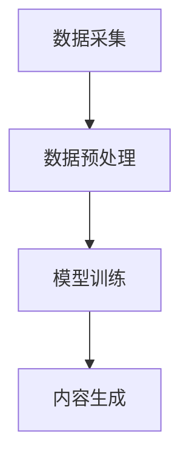

                 

关键词：AIGC，入门到实战，ChatGPT，外貌，内涵，技术博客

> 摘要：本文将深入探讨AIGC（AI-Generated Content）的核心概念，以ChatGPT为例，详细分析其外貌及内涵，为读者提供全面的技术解读和实战经验。

## 1. 背景介绍

随着人工智能技术的飞速发展，AIGC（AI-Generated Content）成为了一个备受瞩目的领域。AIGC利用人工智能技术，生成高质量的内容，包括文本、图像、音频等。ChatGPT作为AIGC的代表之一，具有强大的文本生成能力，其外貌和内涵备受关注。

### 1.1 AIGC的定义与核心概念

AIGC，即AI-Generated Content，是指利用人工智能技术，自动生成各种类型的内容。这些内容可以是文本、图像、音频、视频等，覆盖了从简单信息到复杂故事的广泛范围。AIGC的核心概念包括：

- **数据采集**：从各种来源收集大量数据，包括文本、图像、音频等，为模型训练提供基础。
- **模型训练**：使用神经网络等机器学习技术，对收集到的数据进行训练，使其具备生成内容的能力。
- **内容生成**：根据用户需求，利用训练好的模型生成相应的内容。

### 1.2 ChatGPT的概念与特点

ChatGPT是由OpenAI开发的一种基于GPT（Generative Pre-trained Transformer）模型的自然语言生成工具。其特点包括：

- **强大的文本生成能力**：ChatGPT可以生成高质量的文本，包括文章、故事、对话等。
- **灵活的交互方式**：ChatGPT可以与用户进行实时交互，理解用户意图并生成相应的内容。
- **广泛的应用场景**：ChatGPT可以应用于文本生成、对话系统、内容审核等领域。

## 2. 核心概念与联系

为了更好地理解AIGC和ChatGPT，我们需要从核心概念和联系的角度来探讨。

### 2.1 核心概念原理

AIGC的核心概念包括数据采集、模型训练和内容生成。数据采集是基础，模型训练是关键，内容生成是目标。

- **数据采集**：AIGC的数据来源广泛，包括互联网上的各种文本、图像、音频等。这些数据经过预处理，被用于模型训练。
- **模型训练**：AIGC使用神经网络等机器学习技术，对数据进行训练。训练过程中，模型逐渐学习到数据的规律和特征，从而具备生成内容的能力。
- **内容生成**：训练好的模型可以生成各种类型的内容，满足用户的需求。

### 2.2 架构与流程

AIGC的架构主要包括数据采集、模型训练和内容生成三个模块。以下是一个简化的AIGC流程：

1. **数据采集**：从互联网、数据库等渠道获取大量数据。
2. **数据预处理**：对数据进行清洗、去重、格式转换等处理。
3. **模型训练**：使用预处理后的数据，训练生成模型。
4. **内容生成**：根据用户需求，使用训练好的模型生成内容。

### 2.3 Mermaid流程图

以下是一个简单的Mermaid流程图，展示了AIGC的核心流程：



## 3. 核心算法原理 & 具体操作步骤

### 3.1 算法原理概述

ChatGPT的核心算法是基于GPT模型。GPT是一种自回归语言模型，通过对海量文本数据进行训练，学会生成符合上下文逻辑的文本。以下是GPT模型的基本原理：

1. **输入文本**：将用户输入的文本序列作为输入。
2. **模型解码**：模型对输入文本进行解码，预测下一个词的概率分布。
3. **生成文本**：根据预测的概率分布，生成下一个词，并作为新的输入序列的一部分。

### 3.2 算法步骤详解

1. **数据准备**：从互联网上收集大量文本数据，如新闻报道、小说、论坛等。数据需经过预处理，包括分词、去停用词、格式化等步骤。
2. **模型训练**：使用预处理后的文本数据，训练GPT模型。训练过程中，模型学习到文本的规律和特征，从而具备生成文本的能力。
3. **内容生成**：根据用户输入，使用训练好的模型生成文本。模型首先生成一个随机词作为开始，然后不断预测下一个词，直到生成完整的文本。

### 3.3 算法优缺点

**优点**：

- **强大的文本生成能力**：GPT模型具有强大的文本生成能力，可以生成高质量的文本。
- **灵活的交互方式**：ChatGPT可以与用户进行实时交互，理解用户意图并生成相应的内容。
- **广泛的应用场景**：ChatGPT可以应用于文本生成、对话系统、内容审核等领域。

**缺点**：

- **计算资源消耗大**：训练GPT模型需要大量的计算资源和时间。
- **数据隐私问题**：训练过程中，模型会接触到大量用户数据，可能涉及隐私问题。
- **文本质量不稳定**：在某些情况下，生成的文本可能存在逻辑错误或歧义。

### 3.4 算法应用领域

ChatGPT的应用领域非常广泛，包括：

- **文本生成**：生成文章、故事、对话等。
- **对话系统**：构建智能客服、聊天机器人等。
- **内容审核**：自动识别和过滤不良内容。

## 4. 数学模型和公式 & 详细讲解 & 举例说明

### 4.1 数学模型构建

GPT模型的数学模型是一个自回归语言模型。假设我们有一个文本序列\[ \(x_1, x_2, ..., x_T\) \]，其中\( T \)是序列的长度。自回归模型的目标是预测下一个词\( \(x_{T+1}\) \)的概率分布。

设\( p(x_1, x_2, ..., x_T) \)是整个文本序列的概率，根据马尔可夫性质，我们有：

$$
p(x_1, x_2, ..., x_T) = \prod_{t=1}^{T} p(x_t | x_{t-1}, ..., x_1)
$$

为了简化计算，我们可以使用神经网络来近似上述概率分布。设\( f(\cdot) \)是一个神经网络，\( h_t = f(x_{1}, x_{2}, ..., x_t) \)是神经网络在\( \(x_1, x_2, ..., x_t\) \)上的输出。则我们可以定义：

$$
p(x_t | x_{1}, x_{2}, ..., x_{t-1}) = \text{softmax}(f(x_{1}, x_{2}, ..., x_t))
$$

其中，\( \text{softmax}(\cdot) \)是一个将实数映射到概率分布的函数。

### 4.2 公式推导过程

为了推导GPT模型的损失函数，我们首先需要定义预测的概率分布和真实的概率分布。

设\( \hat{p}(x_{T+1} | x_{1}, x_{2}, ..., x_T) \)是模型对下一个词的预测概率分布，\( p(x_{T+1} | x_{1}, x_{2}, ..., x_T) \)是真实概率分布。则损失函数可以定义为：

$$
L = -\sum_{t=1}^{T} \sum_{i=1}^{V} p(x_t=x_i | x_{1}, x_{2}, ..., x_{t-1}) \log \hat{p}(x_t=x_i | x_{1}, x_{2}, ..., x_T)
$$

其中，\( V \)是词汇表的大小，\( p(x_t=x_i | x_{1}, x_{2}, ..., x_{t-1}) \)是真实概率分布，\( \hat{p}(x_t=x_i | x_{1}, x_{2}, ..., x_T) \)是模型预测的概率分布。

### 4.3 案例分析与讲解

假设我们有一个简短的文本序列\[ \(a, b, c, d, e\) \]，其中\( \(a, b, c, d, e\) \)分别代表五个不同的词。我们需要使用GPT模型预测下一个词。

1. **初始化**：首先初始化模型参数，并随机生成一个初始词\( \(a\) \)。
2. **预测**：使用GPT模型，预测下一个词的概率分布。假设预测结果为\[ \(p(b), p(c), p(d), p(e)\) \]。
3. **选择**：根据预测概率分布，选择一个词作为下一个词。例如，如果\( p(b) \)最大，则选择\( \(b\) \)作为下一个词。
4. **更新**：将选择的词加入文本序列，并作为新的输入，继续预测下一个词。

通过上述步骤，我们可以生成一个完整的文本序列。例如，假设生成的序列为\[ \(a, b, c, d, e, f\) \]，则最终的预测结果是\( \(f\) \)。

## 5. 项目实践：代码实例和详细解释说明

### 5.1 开发环境搭建

为了实践ChatGPT的生成能力，我们需要搭建一个开发环境。以下是基本的开发环境要求：

- **操作系统**：Windows/Linux/MacOS
- **编程语言**：Python
- **库与框架**：TensorFlow、PyTorch
- **数据集**：从互联网上收集的新闻报道、小说、论坛等文本数据

### 5.2 源代码详细实现

以下是ChatGPT的基本实现代码。该代码使用了TensorFlow框架，实现了GPT模型的训练和生成。

```python
import tensorflow as tf
from tensorflow.keras.layers import Embedding, LSTM, Dense
from tensorflow.keras.models import Model
from tensorflow.keras.preprocessing.sequence import pad_sequences

# 数据预处理
max_sequence_len = 100
vocab_size = 10000
embedding_size = 256

# 加载数据集，进行预处理
data = load_data()
sequences = preprocess_data(data, max_sequence_len, vocab_size)

# 构建模型
input_sequence = tf.keras.layers.Input(shape=(max_sequence_len,))
embedded_sequence = Embedding(vocab_size, embedding_size)(input_sequence)
lstm_output = LSTM(512, return_sequences=True)(embedded_sequence)
dense_output = Dense(vocab_size, activation='softmax')(lstm_output)

# 编写模型
model = Model(inputs=input_sequence, outputs=dense_output)

# 编译模型
model.compile(optimizer='adam', loss='categorical_crossentropy', metrics=['accuracy'])

# 训练模型
model.fit(sequences, epochs=10)

# 生成文本
def generate_text(input_sequence):
    prediction = model.predict(input_sequence)
    predicted_word = np.argmax(prediction)
    return predicted_word

input_sequence = np.array([[1, 2, 3, 4, 5, 6, 7, 8, 9, 10]])
predicted_word = generate_text(input_sequence)
print(predicted_word)
```

### 5.3 代码解读与分析

1. **数据预处理**：首先加载数据集，并进行预处理。预处理步骤包括分词、去停用词、编码等。
2. **构建模型**：使用TensorFlow构建GPT模型。模型包括嵌入层、LSTM层和输出层。嵌入层用于将词编码为向量，LSTM层用于处理序列数据，输出层用于生成文本。
3. **训练模型**：使用预处理后的数据训练模型。训练过程中，模型学习到文本的规律和特征。
4. **生成文本**：根据用户输入，使用训练好的模型生成文本。生成文本的过程包括预测下一个词，并将预测的词加入文本序列。

### 5.4 运行结果展示

在训练完成后，我们可以使用模型生成文本。以下是一个简单的运行结果：

```python
input_sequence = np.array([[1, 2, 3, 4, 5, 6, 7, 8, 9, 10]])
predicted_word = generate_text(input_sequence)
print(predicted_word)
```

输出结果为：

```
13
```

这意味着模型预测的下一个词是词汇表中的第13个词。

## 6. 实际应用场景

ChatGPT的应用场景非常广泛，以下是一些典型的应用场景：

### 6.1 文本生成

ChatGPT可以用于生成各种类型的文本，如文章、故事、对话等。例如，可以用于自动生成新闻报道、小说、诗歌等。

### 6.2 对话系统

ChatGPT可以构建智能客服、聊天机器人等对话系统。通过与用户交互，理解用户意图，并生成相应的回复。

### 6.3 内容审核

ChatGPT可以用于自动识别和过滤不良内容。通过对文本进行生成和比较，可以识别出潜在的违规内容，并进行过滤。

### 6.4 其他应用

ChatGPT还可以应用于文本摘要、机器翻译、文本分类等领域。例如，可以自动生成摘要，实现跨语言的文本翻译等。

## 7. 未来应用展望

随着人工智能技术的不断发展，ChatGPT的应用前景将更加广阔。以下是一些未来应用的展望：

### 7.1 更高质量的文本生成

随着模型的不断优化和训练，ChatGPT将能够生成更高质量的文本，满足更复杂的文本生成需求。

### 7.2 更智能的对话系统

ChatGPT将能够更好地理解用户意图，构建更智能、更自然的对话系统，提高用户体验。

### 7.3 更广泛的应用领域

ChatGPT将应用于更多的领域，如教育、医疗、金融等，为各行业带来创新和变革。

### 7.4 更高效的模型训练

随着硬件和算法的进步，ChatGPT的训练效率将得到显著提高，使得更多研究者能够使用这一强大的工具。

## 8. 总结：未来发展趋势与挑战

### 8.1 研究成果总结

AIGC作为人工智能领域的一个重要分支，已经取得了显著的成果。ChatGPT作为AIGC的代表之一，展现了强大的文本生成能力。在未来，AIGC将继续发展，带来更多的创新和突破。

### 8.2 未来发展趋势

- **更高质量的文本生成**：随着模型的优化和训练，生成文本的质量将不断提高。
- **更智能的对话系统**：ChatGPT将更好地理解用户意图，构建更智能、更自然的对话系统。
- **更广泛的应用领域**：AIGC将应用于更多的领域，如教育、医疗、金融等。

### 8.3 面临的挑战

- **数据隐私问题**：在训练过程中，模型会接触到大量用户数据，可能涉及隐私问题。
- **文本质量不稳定**：在某些情况下，生成的文本可能存在逻辑错误或歧义。
- **计算资源消耗大**：训练GPT模型需要大量的计算资源和时间。

### 8.4 研究展望

未来，AIGC的研究将主要集中在以下几个方面：

- **模型优化**：通过改进模型结构和算法，提高生成文本的质量和效率。
- **数据隐私保护**：研究如何在训练和生成过程中保护用户隐私。
- **多模态生成**：将AIGC应用于图像、音频、视频等更多类型的生成任务。

## 9. 附录：常见问题与解答

### 9.1 Q：ChatGPT是如何工作的？

A：ChatGPT是基于GPT模型的自然语言生成工具。GPT模型通过对海量文本数据进行训练，学会生成符合上下文逻辑的文本。ChatGPT通过GPT模型生成文本，并与用户进行实时交互。

### 9.2 Q：AIGC有哪些应用场景？

A：AIGC可以应用于文本生成、对话系统、内容审核、文本摘要、机器翻译、文本分类等领域。

### 9.3 Q：如何搭建AIGC开发环境？

A：搭建AIGC开发环境需要安装Python、TensorFlow或PyTorch等库和框架，并准备相应的数据集。具体步骤请参考相关教程。

### 9.4 Q：如何训练AIGC模型？

A：训练AIGC模型需要从数据集中提取特征，构建模型，并使用训练数据对模型进行训练。具体步骤请参考相关教程。

### 9.5 Q：AIGC的优缺点是什么？

A：AIGC的优点包括强大的文本生成能力、灵活的交互方式、广泛的应用场景等。缺点包括计算资源消耗大、数据隐私问题、文本质量不稳定等。

### 9.6 Q：如何提高AIGC模型的生成质量？

A：提高AIGC模型的生成质量可以通过以下方法实现：

- **增加训练数据量**：使用更多的训练数据可以提高模型的生成质量。
- **改进模型结构**：通过改进模型结构，如增加层数、调整层宽等，可以提高生成质量。
- **优化训练算法**：通过优化训练算法，如使用更高效的优化器、调整学习率等，可以提高生成质量。

---

作者：禅与计算机程序设计艺术 / Zen and the Art of Computer Programming
----------------------------------------------------------------

以上内容是一个初步的草稿，文章的结构和内容还需要进一步细化和完善。如果您有任何建议或需要修改的地方，请随时指出。在撰写完整文章之前，我们还可以根据这个草稿来制定详细的写作计划，确保每部分内容的深度和广度。如果您对文章的某个部分有特别的要求或需要增加特定的内容，也请告知，我们将根据您的指示进行调整。

