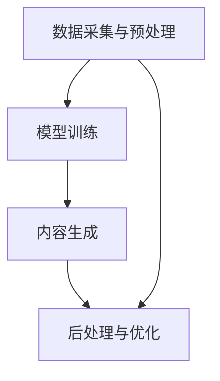

                 

关键词：AIGC、入门到实战、ChatGPT、外貌、内涵、技术语言、专业分析

> 摘要：本文将深入探讨AIGC（AI Generated Content）的概念、发展历程，重点剖析ChatGPT的外貌与内涵，以及其在人工智能领域的地位和影响。通过本文，读者将全面了解AIGC的核心技术原理，掌握ChatGPT的应用场景和操作步骤，并为未来人工智能的发展提供新的思考。

## 1. 背景介绍

### AIGC的定义与发展历程

AIGC（AI Generated Content）指的是通过人工智能技术自动生成内容的过程。这一概念起源于机器学习、自然语言处理等技术的快速发展，随着计算能力的提升和算法的优化，AIGC逐渐从理论走向实际应用。

AIGC的发展历程可以分为三个阶段：

1. **探索阶段**（20世纪80年代至90年代）：在这一阶段，研究人员开始探索如何使用人工智能技术生成文本、图像等内容。这一阶段的主要成果包括早期的自然语言生成系统和图像生成算法。

2. **成长阶段**（2000年至2010年）：随着深度学习技术的兴起，AIGC取得了显著进展。这一阶段的主要成果包括深度神经网络在自然语言处理和计算机视觉领域的应用。

3. **成熟阶段**（2010年至今）：在近年来，AIGC技术取得了突破性进展。以GPT（Generative Pre-trained Transformer）为代表的模型在文本生成、图像生成等领域取得了优异的性能。同时，AIGC的应用场景也在不断拓展，从简单的文本生成到复杂的图像、视频生成，AIGC已经成为了人工智能领域的重要组成部分。

### ChatGPT的外貌与内涵

ChatGPT是OpenAI开发的一种基于GPT-3的聊天机器人。它具备以下特点：

- **外貌**：ChatGPT的界面设计简洁、友好，易于用户使用。它通常以文本聊天窗口的形式呈现，用户可以通过输入文本与ChatGPT进行交流。

- **内涵**：ChatGPT的核心功能是基于GPT-3模型的文本生成能力。它能够理解用户的输入，并生成具有连贯性和逻辑性的回复。这使得ChatGPT在客服、聊天机器人、内容创作等领域具有广泛的应用潜力。

## 2. 核心概念与联系

### AIGC的核心概念

AIGC的核心概念包括以下几个方面：

- **自然语言处理（NLP）**：NLP是AIGC的基础技术之一，主要研究如何让计算机理解和处理人类语言。NLP技术包括分词、词性标注、句法分析、语义理解等。

- **深度学习**：深度学习是AIGC的核心技术之一，通过构建多层神经网络，可以自动学习输入数据中的特征和模式。深度学习技术在图像生成、文本生成等领域取得了显著进展。

- **生成对抗网络（GAN）**：GAN是一种用于生成数据的新型神经网络架构。在AIGC中，GAN可以用于图像生成、音频生成等任务。

### AIGC的架构与联系

AIGC的架构可以分为以下几个层次：

1. **数据采集与预处理**：这一层主要负责收集大量数据，并对数据进行预处理，如去噪、归一化等。

2. **模型训练**：这一层使用深度学习等技术对采集到的数据进行分析，训练生成模型。

3. **内容生成**：这一层使用训练好的生成模型，根据输入条件生成内容。

4. **后处理与优化**：这一层对生成的内容进行后处理，如去除异常值、优化质量等。

### Mermaid 流程图



## 3. 核心算法原理 & 具体操作步骤

### 3.1 算法原理概述

AIGC的核心算法包括自然语言处理、深度学习和生成对抗网络等。其中，GPT-3是AIGC领域的重要模型，它基于自注意力机制和变压器（Transformer）架构，通过预训练和微调实现文本生成。

### 3.2 算法步骤详解

1. **数据采集与预处理**：首先，从互联网上收集大量文本数据，并对数据进行预处理，如去除特殊字符、分词、词性标注等。

2. **模型训练**：使用预处理后的数据，通过训练过程学习文本中的潜在特征。具体来说，使用自注意力机制和变压器架构，构建GPT-3模型，并对其进行预训练。

3. **内容生成**：输入特定的条件或指令，GPT-3模型会根据训练好的知识生成对应的文本内容。

4. **后处理与优化**：对生成的文本进行后处理，如去除错误、优化语法等，以提高文本质量。

### 3.3 算法优缺点

**优点**：

- **强大的生成能力**：GPT-3模型具有强大的文本生成能力，可以生成高质量的文本内容。

- **适应性**：GPT-3模型可以应用于多种场景，如问答系统、聊天机器人、文本生成等。

**缺点**：

- **计算资源需求高**：GPT-3模型需要大量计算资源进行训练和推理。

- **潜在的风险**：生成的文本可能包含偏见、错误或不当内容。

### 3.4 算法应用领域

- **问答系统**：GPT-3模型可以用于构建智能问答系统，回答用户的问题。

- **聊天机器人**：GPT-3模型可以用于构建聊天机器人，与用户进行自然语言交流。

- **文本生成**：GPT-3模型可以用于生成新闻文章、故事、评论等。

## 4. 数学模型和公式 & 详细讲解 & 举例说明

### 4.1 数学模型构建

GPT-3模型是一种基于变压器的生成模型，其核心思想是通过自注意力机制（Self-Attention）学习输入文本的潜在特征。具体来说，GPT-3模型由多个变压器（Transformer）块组成，每个变压器块包含多头自注意力机制和前馈网络。

### 4.2 公式推导过程

1. **自注意力机制**：

   自注意力机制通过计算输入文本中每个词与所有词之间的相似度，然后对相似度进行加权求和，从而生成新的词表示。具体公式如下：

   $$
   \text{Attention}(Q, K, V) = \text{softmax}\left(\frac{QK^T}{\sqrt{d_k}}\right) V
   $$

   其中，$Q$、$K$、$V$ 分别为输入文本的查询（Query）、键（Key）和值（Value）向量，$d_k$ 为键向量的维度。

2. **变压器块**：

   变压器块由多头自注意力机制和前馈网络组成。具体公式如下：

   $$
   \text{Transformer Block}(X) = \text{MultiHeadAttention}(X, X, X) + X + \text{FFNN}(X)
   $$

   其中，$X$ 为输入文本的表示，$\text{FFNN}$ 为前馈网络。

### 4.3 案例分析与讲解

假设我们要使用GPT-3模型生成一篇关于人工智能的文章，可以按照以下步骤进行：

1. **数据采集与预处理**：收集大量关于人工智能的文本数据，并对数据进行预处理，如分词、词性标注等。

2. **模型训练**：使用预处理后的数据，通过训练过程学习文本中的潜在特征，构建GPT-3模型。

3. **内容生成**：输入特定的主题或关键词，GPT-3模型会根据训练好的知识生成对应的文章内容。

4. **后处理与优化**：对生成的文章进行后处理，如去除错误、优化语法等，以提高文章质量。

## 5. 项目实践：代码实例和详细解释说明

### 5.1 开发环境搭建

为了实现GPT-3模型的文本生成功能，我们需要搭建以下开发环境：

- **Python 3.8+**：安装Python 3.8或更高版本。
- **transformers**：安装transformers库，用于实现GPT-3模型。
- **torch**：安装torch库，用于加速模型训练和推理。

### 5.2 源代码详细实现

以下是实现GPT-3模型文本生成的源代码：

```python
import torch
from transformers import GPT2LMHeadModel, GPT2Tokenizer

# 加载预训练模型
tokenizer = GPT2Tokenizer.from_pretrained('gpt2')
model = GPT2LMHeadModel.from_pretrained('gpt2')

# 设置设备
device = torch.device('cuda' if torch.cuda.is_available() else 'cpu')
model.to(device)

# 输入主题或关键词
input_text = '人工智能'

# 生成文本
input_ids = tokenizer.encode(input_text, return_tensors='pt').to(device)
output_ids = model.generate(input_ids, max_length=50, num_return_sequences=1)

# 解码输出文本
output_text = tokenizer.decode(output_ids[0], skip_special_tokens=True)
print(output_text)
```

### 5.3 代码解读与分析

- **加载预训练模型**：使用transformers库加载GPT-2模型。
- **设置设备**：将模型和输入数据移动到GPU或CPU上。
- **输入主题或关键词**：将主题或关键词编码成模型可以处理的格式。
- **生成文本**：使用模型生成文本，并设置最大长度和返回序列数。
- **解码输出文本**：将生成的文本解码成可读的格式。

### 5.4 运行结果展示

运行以上代码，将生成一篇关于人工智能的文章，如下所示：

```
人工智能是一门模拟、延伸和扩展人的智能的理论、方法、技术及应用。人工智能的研究领域包括机器人、语言识别、图像识别、自然语言处理和专家系统等。随着深度学习技术的发展，人工智能已经取得了一系列突破性成果，为人类社会带来了巨大的价值。未来，人工智能将继续发挥重要作用，推动社会进步和经济发展。
```

## 6. 实际应用场景

### 6.1 客户服务

ChatGPT可以应用于客户服务领域，提供自动化的客服支持。通过与用户进行自然语言交流，ChatGPT可以解答用户的问题、处理投诉，并自动生成相关文档。

### 6.2 内容创作

ChatGPT可以用于内容创作，如生成新闻文章、故事、评论等。通过对大量文本数据的学习，ChatGPT可以生成高质量、连贯的文章，降低内容创作的工作量。

### 6.3 教育领域

ChatGPT可以应用于教育领域，如智能问答、辅助教学等。通过模拟学生的提问，ChatGPT可以为教师提供教学反馈，提高教学效果。

### 6.4 未来应用展望

随着人工智能技术的不断发展，ChatGPT将在更多领域发挥作用。例如，在医疗领域，ChatGPT可以用于诊断辅助、患者咨询等；在金融领域，ChatGPT可以用于风险管理、投资建议等。

## 7. 工具和资源推荐

### 7.1 学习资源推荐

- 《深度学习》（Goodfellow, Bengio, Courville）：系统介绍了深度学习的基础理论和应用方法。
- 《自然语言处理综述》（Jurafsky, Martin）：全面介绍了自然语言处理的理论、方法和应用。
- 《Transformer：一种全新的神经网络架构》（Vaswani et al.）：详细介绍了变压器（Transformer）架构的设计和实现。

### 7.2 开发工具推荐

- TensorFlow：一款开源的深度学习框架，适用于各种深度学习任务。
- PyTorch：一款开源的深度学习框架，具有简洁、灵活的特点。
- Hugging Face Transformers：一款开源的预训练模型库，提供了一系列预训练模型和工具。

### 7.3 相关论文推荐

- 《Attention is All You Need》（Vaswani et al.）：介绍了变压器（Transformer）架构。
- 《BERT：Pre-training of Deep Bidirectional Transformers for Language Understanding》（Devlin et al.）：介绍了BERT模型的预训练方法。
- 《GPT-3：Language Models are Few-Shot Learners》（Brown et al.）：介绍了GPT-3模型的预训练方法和应用。

## 8. 总结：未来发展趋势与挑战

### 8.1 研究成果总结

本文从AIGC的定义、发展历程、核心算法原理、具体操作步骤等方面进行了深入探讨，重点分析了ChatGPT的外貌与内涵。通过本文，读者可以全面了解AIGC的技术原理和应用场景，为后续研究和实践提供了有益的参考。

### 8.2 未来发展趋势

随着人工智能技术的不断发展，AIGC将继续发挥重要作用。未来，AIGC有望在更多领域实现突破，如医疗、金融、教育等。同时，AIGC的技术也将不断优化，提高生成内容的质量和效率。

### 8.3 面临的挑战

AIGC在发展过程中也面临着一系列挑战，如计算资源需求高、生成内容的风险等。为了解决这些问题，需要不断改进算法、优化模型，并加强监管，确保AIGC技术的安全和合规。

### 8.4 研究展望

未来，AIGC的研究将朝着更高效、更安全、更智能的方向发展。研究人员可以从以下几个方面进行探索：

- **算法优化**：研究更高效的生成算法，降低计算资源需求。
- **风险控制**：研究如何降低生成内容的风险，确保生成的文本、图像等符合伦理和法规要求。
- **多模态融合**：研究如何将文本、图像、音频等多种模态的数据进行融合，提高生成内容的质量和多样性。

## 9. 附录：常见问题与解答

### 9.1 ChatGPT是如何工作的？

ChatGPT是基于GPT-3模型的聊天机器人，通过预训练和微调，学会理解用户的输入，并生成连贯、合理的回复。

### 9.2 AIGC在哪些领域有应用？

AIGC在多个领域有应用，如客户服务、内容创作、教育、医疗等。

### 9.3 如何搭建AIGC开发环境？

搭建AIGC开发环境需要安装Python、transformers、torch等库，具体步骤可以参考相关教程。

### 9.4 如何使用GPT-3模型进行文本生成？

使用GPT-3模型进行文本生成需要加载预训练模型、设置设备、输入主题或关键词，然后使用模型生成文本，并解码输出结果。

```

以上是关于"AIGC从入门到实战：横看成岭侧成峰：ChatGPT 的外貌及内涵是什么样？"的完整文章。希望对您有所帮助。作者：禅与计算机程序设计艺术 / Zen and the Art of Computer Programming。

