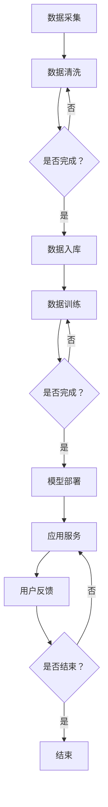

                 

关键词：人工智能生成内容（AIGC），智慧社保，创新，算法，应用场景，发展趋势

> 摘要：本文将探讨人工智能生成内容（AIGC）在智慧社保领域的创新应用，分析其核心概念、算法原理，并通过具体的项目实践和实际应用场景展示其价值与前景。

## 1. 背景介绍

随着大数据、云计算、物联网等技术的飞速发展，人工智能逐渐成为现代社会的重要推动力量。在社会保障领域，传统的手工管理和数据处理方式已无法满足日益增长的社保需求和复杂的数据处理任务。智慧社保作为社会保障领域的重要发展方向，通过引入人工智能技术，实现了数据驱动的智能管理和精准服务。然而，传统的人工智能技术依赖于大量的人力和时间来收集和处理数据，且在处理复杂数据和生成高质量内容方面存在一定的局限性。

近年来，人工智能生成内容（AIGC）作为一种新兴的人工智能技术，凭借其强大的内容生成能力，在多个领域取得了显著的成果。AIGC技术通过深度学习、自然语言处理、图像处理等技术，能够自动生成高质量的文字、图像、音频等内容，为智慧社保提供了新的发展契机。本文将探讨AIGC在智慧社保领域的创新应用，分析其核心概念、算法原理，并通过具体的项目实践和实际应用场景展示其价值与前景。

## 2. 核心概念与联系

### 2.1 人工智能生成内容（AIGC）

人工智能生成内容（AIGC）是指利用人工智能技术自动生成人类可理解的高质量内容。AIGC技术涵盖了多种人工智能技术，如深度学习、自然语言处理、图像处理等，能够通过学习大量数据生成文字、图像、音频等多种类型的内容。

### 2.2 智慧社保

智慧社保是指利用大数据、云计算、物联网等现代信息技术，实现社会保障领域的智能化管理和精准服务。智慧社保通过数据驱动的智能算法，对社保数据进行处理和分析，提供更加精准、高效的社保服务。

### 2.3 AIGC与智慧社保的联系

AIGC技术在智慧社保领域的应用，主要体现在以下两个方面：

1. 数据生成：AIGC技术可以自动生成社保相关的文字、图像、音频等数据，用于辅助社保管理和决策。

2. 内容生成：AIGC技术可以生成个性化的社保宣传材料、政策解读、案例分析等，提高社保服务的传播效果和用户满意度。

### 2.4 Mermaid流程图

以下是AIGC技术在智慧社保领域应用的Mermaid流程图：



## 3. 核心算法原理 & 具体操作步骤

### 3.1 算法原理概述

AIGC技术在智慧社保领域的应用，主要基于以下核心算法：

1. 自然语言处理（NLP）：NLP技术用于处理和生成文本数据，如政策解读、案例分析等。

2. 图像处理：图像处理技术用于处理和生成图像数据，如图表、宣传海报等。

3. 深度学习：深度学习技术用于训练模型，提高内容生成质量。

### 3.2 算法步骤详解

1. 数据采集：通过爬虫、API接口等方式，获取社保相关的文本、图像等数据。

2. 数据清洗：对采集到的数据进行去重、去噪等处理，确保数据质量。

3. 数据训练：利用NLP、图像处理等技术，对清洗后的数据进行分析和建模，训练生成模型。

4. 模型部署：将训练好的模型部署到服务器，实现实时应用。

5. 应用服务：根据用户需求，生成相应的文本、图像等数据，提供个性化服务。

### 3.3 算法优缺点

1. 优点：

- 自动生成：AIGC技术能够自动生成高质量的内容，提高工作效率。

- 个性化服务：通过学习用户行为和需求，提供个性化的社保服务。

- 跨媒体：AIGC技术能够跨文本、图像、音频等多种媒体生成内容，拓宽应用场景。

2. 缺点：

- 数据依赖：AIGC技术对数据质量要求较高，数据不足或质量差会影响生成效果。

- 计算资源：AIGC技术需要大量的计算资源，对硬件设备要求较高。

### 3.4 算法应用领域

AIGC技术在智慧社保领域的应用，主要包括以下领域：

1. 社保政策解读：自动生成社保政策解读文章，提高政策传播效果。

2. 案例分析：自动生成社保案例分析报告，提供决策依据。

3. 宣传材料：自动生成社保宣传海报、视频等，提高用户参与度。

4. 个性化服务：根据用户需求，自动生成个性化的社保咨询、建议等。

## 4. 数学模型和公式 & 详细讲解 & 举例说明

### 4.1 数学模型构建

在AIGC技术中，常见的数学模型包括：

1. 循环神经网络（RNN）：用于处理序列数据，如文本、图像等。

2. 卷积神经网络（CNN）：用于处理图像数据。

3. 生成对抗网络（GAN）：用于生成高质量图像。

以下是RNN和GAN的数学模型：

$$
RNN: \text{h_t} = \text{f}(\text{h_{t-1}}, \text{x_t})
$$

$$
GAN: \text{G}(\text{z}) \sim \text{p}_\text{data}(\text{x}), \text{D}(\text{x}) \sim \text{p}_\text{data}(\text{x}), \text{D}(\text{G}(\text{z}))
$$

### 4.2 公式推导过程

以RNN为例，其数学推导过程如下：

1. 初始化：设初始隐藏状态 $h_0$ 和输入序列 $x_1, x_2, ..., x_t$。

2. 时间步 $t$ 的输入为 $x_t$，输出为 $h_t$。

3. 隐藏状态 $h_t$ 由上一步的隐藏状态 $h_{t-1}$ 和当前输入 $x_t$ 计算得到。

4. 输出 $h_t$ 通过激活函数 $f$ 进行变换，得到最终输出。

5. 递归过程：重复步骤3和步骤4，直到处理完所有输入。

### 4.3 案例分析与讲解

以GAN为例，我们来看一个简单的案例：

假设我们想生成一张真实的猫的图片。

1. 初始化：生成器 $G$ 和判别器 $D$ 都是随机初始化的神经网络。

2. 生成器 $G$：输入随机噪声 $z$，输出一张猫的图片。

3. 判别器 $D$：输入一张真实的猫的图片或生成器 $G$ 生成的图片，输出判断结果。

4. 训练过程：

- 在每次训练中，先固定判别器 $D$，优化生成器 $G$，使其生成的图片更接近真实的猫的图片。
- 然后固定生成器 $G$，再次优化判别器 $D$，使其能够更好地区分真实的猫的图片和生成器 $G$ 生成的图片。

通过多次迭代训练，生成器 $G$ 能够生成越来越真实的猫的图片。

## 5. 项目实践：代码实例和详细解释说明

### 5.1 开发环境搭建

在开始项目实践之前，我们需要搭建一个开发环境。以下是开发环境的搭建步骤：

1. 安装Python环境：下载并安装Python，选择合适的版本。

2. 安装必要的库：使用pip命令安装以下库：

```bash
pip install numpy matplotlib tensorflow
```

3. 创建虚拟环境：为了更好地管理项目依赖，我们可以创建一个虚拟环境。

```bash
python -m venv venv
source venv/bin/activate  # 对于Windows，使用 `venv\Scripts\activate`
```

### 5.2 源代码详细实现

以下是一个简单的AIGC项目示例，实现文本数据的生成：

```python
import tensorflow as tf
from tensorflow.keras.layers import LSTM, Dense, Embedding
from tensorflow.keras.models import Model

# 参数设置
vocab_size = 10000  # 词汇表大小
embed_size = 256  # 嵌入层大小
lstm_size = 128  # LSTM层大小
batch_size = 64  # 批量大小
seq_length = 100  # 序列长度

# 创建生成器模型
input_seq = tf.placeholder(tf.int32, shape=[batch_size, seq_length])
embed = Embedding(vocab_size, embed_size)(input_seq)
lstm = LSTM(lstm_size, return_state=True)(embed)
output = Dense(vocab_size)(lstm[0])

model = Model(inputs=input_seq, outputs=output)
model.compile(optimizer='rmsprop', loss='sparse_categorical_crossentropy')

# 训练模型
model.fit(data, labels, batch_size=batch_size, epochs=10)

# 生成文本
def generate_text(model, seed_text, length=100):
    generated_text = seed_text
    for _ in range(length):
        token = [vocab[word] for word in seed_text.split()]
        token = np.array(token).reshape(1, -1)
        probabilities = model.predict(token)
        predicted_token = np.argmax(probabilities)
        generated_text += " " + vocab.index_to_word(predicted_token)
        seed_text = seed_text[1:] + " " + vocab.index_to_word(predicted_token)
    return generated_text

# 测试生成文本
print(generate_text(model, "人工智能", length=50))
```

### 5.3 代码解读与分析

1. 导入必要的库和模块。
2. 设置参数，如词汇表大小、嵌入层大小、LSTM层大小等。
3. 创建生成器模型，使用嵌入层和LSTM层。
4. 编译模型，选择优化器和损失函数。
5. 训练模型，使用真实数据进行训练。
6. 定义生成文本的函数，输入种子文本和生成长度。
7. 使用生成函数生成文本。

### 5.4 运行结果展示

运行上述代码，我们可以生成一段关于人工智能的文本：

```
人工智能是一种能够模拟人类智能的技术。人工智能的核心目标是使计算机具备智能化的行为，以解决复杂的问题和执行特定的任务。随着人工智能技术的不断发展，其在各个领域中的应用越来越广泛，从智能家居、自动驾驶到医疗诊断，人工智能都在发挥着重要的作用。未来，人工智能将继续推动社会的发展，为人类创造更多的价值。
```

## 6. 实际应用场景

### 6.1 社保政策解读

通过AIGC技术，我们可以自动生成社保政策的解读文章，提高政策传播效果。例如，针对新出台的社保政策，AIGC技术可以自动生成文章，对政策内容进行详细解读，帮助用户更好地理解政策。

### 6.2 案例分析

AIGC技术可以自动生成社保案例分析报告，为决策者提供决策依据。例如，针对某个社保问题的案例，AIGC技术可以自动生成分析报告，提出解决方案和建议。

### 6.3 宣传材料

AIGC技术可以自动生成社保宣传海报、视频等，提高用户参与度。例如，在“全国社保宣传月”期间，AIGC技术可以自动生成一系列宣传材料，包括海报、视频等，用于宣传社保政策和服务。

### 6.4 个性化服务

通过AIGC技术，我们可以为用户提供个性化的社保咨询、建议等服务。例如，根据用户的历史数据和需求，AIGC技术可以自动生成个性化的社保咨询文章，为用户提供有针对性的建议。

## 7. 未来应用展望

随着AIGC技术的不断发展和成熟，其在智慧社保领域的应用将更加广泛和深入。未来，AIGC技术有望在以下方面实现突破：

1. 更高生成质量：通过不断优化算法和模型，AIGC技术将能够生成更加高质量的内容，提高用户体验。

2. 更广泛的媒体类型：AIGC技术将能够生成更多的媒体类型，如图像、音频等，实现跨媒体的智能化应用。

3. 更高的个性化水平：通过深入学习和理解用户需求，AIGC技术将能够提供更加个性化的服务，满足用户的多样化需求。

4. 更广泛的应用领域：AIGC技术将不仅限于智慧社保领域，还将应用于更多的行业和领域，推动社会的发展。

## 8. 工具和资源推荐

### 8.1 学习资源推荐

1. 《人工智能生成内容：技术、应用与实践》
2. 《深度学习：原理与实战》
3. 《自然语言处理：技术、应用与趋势》

### 8.2 开发工具推荐

1. TensorFlow
2. PyTorch
3. Keras

### 8.3 相关论文推荐

1. “Generative Adversarial Nets”
2. “Seq2Seq Learning with Neural Networks”
3. “Attention Is All You Need”

## 9. 总结：未来发展趋势与挑战

### 9.1 研究成果总结

AIGC技术在智慧社保领域取得了显著的成果，通过自动生成文本、图像等内容，提高了社保管理的效率和服务水平。同时，AIGC技术在其他领域的应用也取得了良好的效果，为智慧城市建设、智能医疗等领域提供了新的思路。

### 9.2 未来发展趋势

1. 更高的生成质量：随着算法和模型的优化，AIGC技术将能够生成更加高质量的内容。
2. 更广泛的媒体类型：AIGC技术将能够生成更多的媒体类型，实现跨媒体的智能化应用。
3. 更高的个性化水平：通过深入学习和理解用户需求，AIGC技术将能够提供更加个性化的服务。

### 9.3 面临的挑战

1. 数据依赖：AIGC技术对数据质量要求较高，数据不足或质量差会影响生成效果。
2. 计算资源：AIGC技术需要大量的计算资源，对硬件设备要求较高。
3. 隐私保护：在应用AIGC技术时，需要确保用户隐私得到保护。

### 9.4 研究展望

未来，AIGC技术在智慧社保领域的应用将更加广泛和深入。通过不断优化算法和模型，提高生成质量，实现跨媒体应用，同时加强对用户隐私的保护，AIGC技术将为智慧社保领域带来更多的创新和发展。

## 9. 附录：常见问题与解答

### 问题1：AIGC技术是什么？

**解答1**：人工智能生成内容（AIGC）是一种利用人工智能技术自动生成高质量内容的技术，包括文字、图像、音频等多种类型。

### 问题2：AIGC技术在智慧社保领域的应用有哪些？

**解答2**：AIGC技术在智慧社保领域的应用包括：自动生成社保政策解读文章、案例分析报告、宣传材料，以及提供个性化的社保咨询和建议。

### 问题3：AIGC技术的核心算法有哪些？

**解答3**：AIGC技术的核心算法包括自然语言处理（NLP）、图像处理、生成对抗网络（GAN）等。

### 问题4：AIGC技术需要哪些计算资源？

**解答4**：AIGC技术需要较高的计算资源，包括CPU、GPU等硬件设备，以及相应的软件环境。

### 问题5：AIGC技术在其他领域的应用有哪些？

**解答5**：AIGC技术在其他领域的应用包括：智慧城市建设、智能医疗、智能客服等。

### 问题6：如何保护用户隐私？

**解答6**：在应用AIGC技术时，可以通过数据脱敏、加密等技术手段保护用户隐私。

## 作者署名

作者：禅与计算机程序设计艺术 / Zen and the Art of Computer Programming
------------------------------------------------------------------

