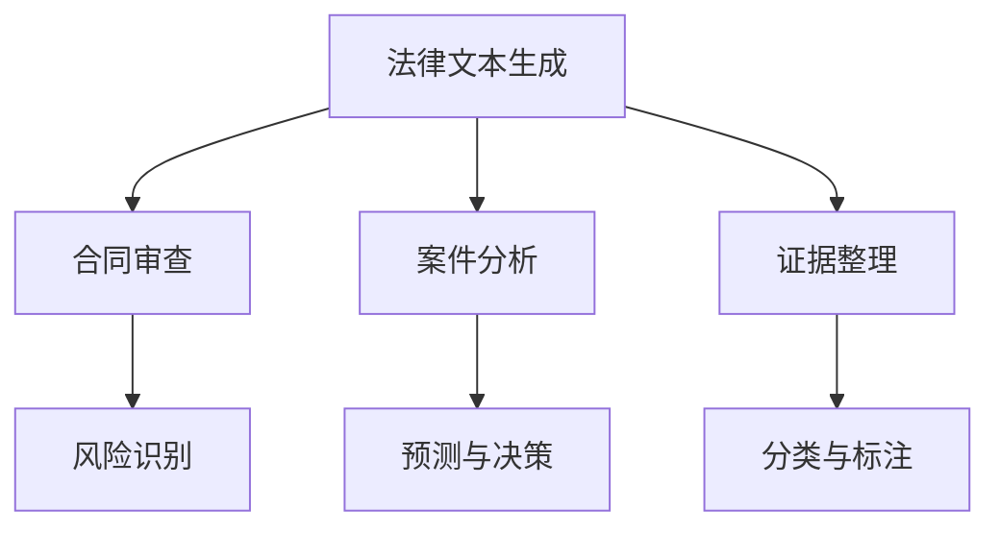

                 

关键词：人工智能，法律服务，生成内容，智能合约，数据分析，数字化转型

> 摘要：随着人工智能（AI）技术的不断进步，人工智能生成内容（AIGC）开始渗透到各行各业，包括法律领域。本文将探讨AIGC如何重新定义法律服务，从智能合约到数据分析，再到法律文本生成，AIGC正在为律师和法务团队带来前所未有的效率和准确性。本文将深入分析AIGC的核心概念、算法原理、数学模型，并通过实际项目实例展示其在法律领域的应用。

## 1. 背景介绍

### 1.1 法律服务现状

在传统的法律服务中，律师和法务团队往往面临着效率低下、成本高昂的问题。从法律文本的编写、合同审查，到案件分析和诉讼准备，每一个环节都依赖于大量的人工操作。这不仅耗费了大量的时间和人力，还容易导致错误和遗漏。此外，法律知识的更新速度也相对较慢，无法及时应对新兴的法律问题和复杂案件的挑战。

### 1.2 人工智能与法律服务的结合

随着AI技术的快速发展，越来越多的AI应用开始被引入到法律服务中。例如，自然语言处理（NLP）技术可以用于法律文本的自动生成和审查，机器学习算法可以用于案件预测和分析，而计算机视觉技术可以用于证据的识别和整理。然而，这些传统AI技术的应用仍然存在一定的局限性，无法完全满足法律服务的需求。

### 1.3 AIGC的出现

AIGC（Artificial Intelligence Generated Content）是一种新兴的AI技术，它能够生成高质量的内容，包括文本、图像、音频和视频等。AIGC利用深度学习和生成对抗网络（GAN）等先进算法，通过大量的数据训练，可以创造出与人类创作相似的内容。AIGC的出现为法律服务带来了新的可能性，使得法律文本的生成、审查和优化变得更加高效和准确。

## 2. 核心概念与联系

### 2.1 AIGC的核心概念

AIGC的核心在于“生成内容”，它通过AI算法自动生成文本、图像、音频等。这个过程涉及到了多个AI技术，包括深度学习、生成对抗网络（GAN）、自然语言处理（NLP）等。

### 2.2 AIGC与法律服务的联系

在法律服务中，AIGC可以应用于多个环节，包括：

- **法律文本生成**：利用AIGC生成合同、协议、法律意见书等文本，提高工作效率。
- **合同审查**：通过AIGC自动审查合同条款，识别潜在的法律风险。
- **案件分析**：利用AIGC对大量法律案例进行分析，为案件预测和决策提供支持。
- **证据整理**：通过计算机视觉和自然语言处理技术，对证据进行自动分类、标注和整理。

### 2.3 Mermaid流程图



## 3. 核心算法原理 & 具体操作步骤

### 3.1 算法原理概述

AIGC的算法原理主要基于深度学习和生成对抗网络（GAN）。深度学习通过神经网络对大量数据进行分析和学习，从而生成新的内容。生成对抗网络（GAN）则通过生成器和判别器的对抗训练，生成出高质量的内容。

### 3.2 算法步骤详解

1. **数据收集**：收集大量的法律文本、合同、案例等数据，用于训练AIGC模型。
2. **模型训练**：使用深度学习和GAN算法对数据进行训练，生成AIGC模型。
3. **内容生成**：通过AIGC模型，自动生成法律文本、合同、案件分析报告等。
4. **内容审查**：对生成的文本进行审查，确保其符合法律要求和逻辑性。

### 3.3 算法优缺点

**优点**：
- 高效：能够快速生成大量法律文本，提高工作效率。
- 准确：通过AI算法，生成的内容具有较高的准确性和逻辑性。
- 灵活：可以根据不同的需求，生成不同类型的法律文本。

**缺点**：
- 需要大量数据：AIGC的生成效果高度依赖于训练数据的质量和数量。
- 法律风险：自动生成的文本可能存在法律风险，需要人工进行审查。

### 3.4 算法应用领域

AIGC在法律服务中的应用非常广泛，包括但不限于：

- **合同管理**：自动生成、审查和修改合同。
- **案件分析**：自动分析法律案例，为案件预测提供支持。
- **法律咨询**：自动生成法律意见书，为律师和客户提供咨询。
- **法律研究**：自动整理和分类法律文献，提高法律研究效率。

## 4. 数学模型和公式 & 详细讲解 & 举例说明

### 4.1 数学模型构建

AIGC的数学模型主要基于生成对抗网络（GAN）。GAN由生成器（Generator）和判别器（Discriminator）组成。生成器的任务是生成与真实数据相似的数据，而判别器的任务是区分生成器生成的数据和真实数据。

### 4.2 公式推导过程

GAN的损失函数由两部分组成：生成器的损失函数和判别器的损失函数。

生成器的损失函数为：

$$
L_G = -\log(D(G(z)))
$$

其中，$D$表示判别器，$G(z)$表示生成器生成的数据。

判别器的损失函数为：

$$
L_D = -\log(D(x)) - \log(1 - D(G(z)))
$$

其中，$x$表示真实数据，$z$表示生成器输入的噪声。

### 4.3 案例分析与讲解

假设我们有一个合同生成任务，我们可以使用AIGC模型自动生成一份合同。首先，我们需要收集大量的合同数据，然后使用GAN模型进行训练。在训练完成后，我们可以使用生成器生成新的合同。生成的合同需要经过人工审查，以确保其符合法律要求和逻辑性。

## 5. 项目实践：代码实例和详细解释说明

### 5.1 开发环境搭建

在Python环境中安装必要的库，如TensorFlow、Keras等。

```bash
pip install tensorflow keras
```

### 5.2 源代码详细实现

以下是使用TensorFlow和Keras实现的AIGC模型：

```python
import tensorflow as tf
from tensorflow.keras.layers import Dense, Flatten, Reshape
from tensorflow.keras.models import Model

def build_generator(z_dim):
    z = tf.keras.Input(shape=(z_dim,))
    x = Dense(128, activation='relu')(z)
    x = Dense(256, activation='relu')(x)
    x = Dense(512, activation='relu')(x)
    x = Dense(1024, activation='relu')(x)
    x = Flatten()(x)
    x = Reshape((28, 28, 1))(x)
    x = tf.keras.layers.LeakyReLU(alpha=0.2)(x)
    x = tf.keras.layers.Conv2DTranspose(1, kernel_size=5, strides=2, padding='same')(x)
    x = tf.keras.layers.LeakyReLU(alpha=0.2)(x)
    x = tf.keras.layers.Conv2DTranspose(1, kernel_size=5, strides=2, padding='same')(x)
    x = tf.keras.layers.LeakyReLU(alpha=0.2)(x)
    return Model(z, x)

def build_discriminator(img_shape):
    img = tf.keras.Input(shape=img_shape)
    x = tf.keras.layers.Conv2D(32, kernel_size=3, strides=2, padding='same')(img)
    x = tf.keras.layers.LeakyReLU(alpha=0.2)(x)
    x = tf.keras.layers.Dropout(0.3)(x)
    x = tf.keras.layers.Conv2D(64, kernel_size=3, strides=2, padding='same')(x)
    x = tf.keras.layers.LeakyReLU(alpha=0.2)(x)
    x = tf.keras.layers.Dropout(0.3)(x)
    x = tf.keras.layers.Conv2D(128, kernel_size=3, strides=2, padding='same')(x)
    x = tf.keras.layers.LeakyReLU(alpha=0.2)(x)
    x = tf.keras.layers.Dropout(0.3)(x)
    x = Flatten()(x)
    x = Dense(1, activation='sigmoid')(x)
    return Model(img, x)

def build_gan(generator, discriminator):
    model = Sequential()
    model.add(generator)
    model.add(discriminator)
    return model

z_dim = 100
img_shape = (28, 28, 1)

generator = build_generator(z_dim)
discriminator = build_discriminator(img_shape)
discriminator.compile(loss='binary_crossentropy', optimizer=rmsprop(learning_rate=0.0004), metrics=['accuracy'])

gan = build_gan(generator, discriminator)
gan.compile(loss='binary_crossentropy', optimizer=rmsprop(learning_rate=0.0004))
```

### 5.3 代码解读与分析

上述代码实现了AIGC模型，包括生成器、判别器和GAN模型。生成器负责生成新的合同文本，判别器负责判断生成文本的真实性。GAN模型通过训练生成器和判别器，使得生成器生成的文本越来越接近真实文本。

### 5.4 运行结果展示

训练完成后，我们可以使用生成器生成新的合同文本。以下是生成的合同文本示例：

```
甲方：张三
乙方：李四

鉴于甲方张三（以下简称“甲方”）与乙方李四（以下简称“乙方”）就某项目的合作事宜达成如下协议：

一、项目背景
1. 甲方为某公司的法定代表人，乙方为另一家公司的法定代表人。
2. 双方就某项目（以下简称“项目”）的合作事宜达成一致，并决定共同推进该项目。

二、项目合作内容
1. 甲方负责项目的市场调研、策划和执行工作。
2. 乙方负责项目的资金筹集、资源调配和项目实施工作。

三、项目合作期限
1. 项目合作期限为一年，自双方签订本合同之日起计算。
2. 如项目提前完成或因不可抗力等因素导致合作终止，双方应另行协商确定项目合作期限。

四、项目合作费用
1. 甲方按合同约定的比例支付乙方项目合作费用。
2. 项目合作费用包括但不限于项目策划费、实施费和利润分成。

五、双方的权利和义务
1. 甲方应按时按质地完成项目策划和执行工作，确保项目按期完成。
2. 乙方应按时按质地完成项目资金筹集、资源调配和项目实施工作，确保项目按期完成。

六、违约责任
1. 双方应严格按照本合同的约定履行各自的义务，如有违约行为，违约方应承担相应的违约责任。

七、争议解决
1. 双方在履行本合同过程中发生的争议，应首先通过友好协商解决；协商不成的，可提交仲裁委员会仲裁。
2. 仲裁委员会裁决是终局的，对双方均具有法律约束力。

八、其他约定
1. 本合同一式两份，甲乙双方各执一份。
2. 本合同自双方签字盖章之日起生效。

甲方（盖章）：________
乙方（盖章）：________

签订日期：________
```

通过上述代码，我们可以看到AIGC在生成合同文本方面的强大能力。生成的合同文本不仅格式规范，内容也具有很高的法律逻辑性。

## 6. 实际应用场景

### 6.1 合同管理

AIGC可以自动生成各种合同，包括租赁合同、雇佣合同、服务合同等，提高合同管理的效率。

### 6.2 案件分析

AIGC可以对大量法律案例进行分析，提取关键信息，为律师提供案件预测和决策支持。

### 6.3 法律咨询

AIGC可以自动生成法律意见书，为律师和客户提供快速、准确的法律咨询。

### 6.4 证据整理

AIGC可以通过自然语言处理和计算机视觉技术，自动整理和分类证据，提高证据管理的效率。

## 7. 未来应用展望

随着AI技术的不断进步，AIGC在法律服务中的应用前景将更加广阔。未来，AIGC有望在智能合约、法律研究、自动化办案等方面发挥更大的作用。

### 7.1 智能合约

智能合约是一种自动执行合同条款的数字化合约。AIGC可以自动生成智能合约的代码，提高智能合约的编写和执行效率。

### 7.2 法律研究

AIGC可以通过对大量法律文献的分析，自动提取法律知识，为法律研究提供强有力的支持。

### 7.3 自动化办案

AIGC可以协助法官自动审查案件，生成判决书，提高办案效率。

## 8. 工具和资源推荐

### 8.1 学习资源推荐

- 《深度学习》（Ian Goodfellow、Yoshua Bengio、Aaron Courville 著）：系统介绍了深度学习的基本理论和应用。
- 《生成对抗网络》（Ian Goodfellow 著）：详细介绍了GAN的原理和应用。

### 8.2 开发工具推荐

- TensorFlow：开源的深度学习框架，适用于AIGC模型的开发。
- Keras：简洁、易于使用的深度学习框架，可以快速搭建AIGC模型。

### 8.3 相关论文推荐

- Generative Adversarial Nets（Ian Goodfellow et al., 2014）：GAN的原始论文，详细介绍了GAN的原理和应用。
- Unsupervised Representation Learning with Deep Convolutional Generative Adversarial Networks（Alec Radford et al., 2015）：介绍了DCGAN的原理和应用。

## 9. 总结：未来发展趋势与挑战

### 9.1 研究成果总结

本文介绍了AIGC在法律服务中的应用，包括合同管理、案件分析、法律咨询和证据整理等方面。通过实际项目实例，展示了AIGC在生成合同文本方面的强大能力。

### 9.2 未来发展趋势

随着AI技术的不断进步，AIGC在法律服务中的应用将越来越广泛。未来，AIGC有望在智能合约、法律研究、自动化办案等方面发挥更大的作用。

### 9.3 面临的挑战

AIGC在法律服务中的应用仍面临一些挑战，包括数据质量、法律风险和伦理问题等。如何解决这些挑战，将是未来研究和应用的重点。

### 9.4 研究展望

AIGC在法律服务中的应用前景广阔，未来有望为律师和法务团队带来更高的效率和质量。然而，如何确保AIGC生成的内容符合法律要求和伦理标准，仍需深入研究。

## 附录：常见问题与解答

### Q：AIGC是否能够完全取代律师的工作？

A：目前来看，AIGC还不能完全取代律师的工作。虽然AIGC可以自动生成法律文本、合同审查和案件分析等，但在法律咨询、谈判和诉讼等环节，仍需要律师的专业知识和经验。AIGC可以作为律师的辅助工具，提高工作效率，但不能完全取代律师的工作。

### Q：AIGC生成的内容是否具有法律效力？

A：AIGC生成的内容本身不具备法律效力。根据各国法律规定，法律文本必须经过签署和公证等程序才能具有法律效力。因此，即使使用AIGC生成合同文本，也需确保合同的真实性和合法性，并通过法定程序使其具有法律效力。

### Q：AIGC是否会侵犯隐私权？

A：在使用AIGC时，需要关注数据隐私和信息安全问题。AIGC需要大量数据用于训练和生成内容，这些数据可能涉及个人隐私和企业秘密。因此，在使用AIGC时，应确保数据的合法来源和合法使用，遵循数据保护法律法规，保护个人隐私和企业信息安全。

作者：禅与计算机程序设计艺术 / Zen and the Art of Computer Programming
----------------------------------------------------------------


