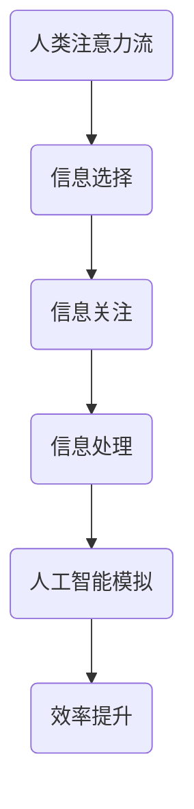

                 

关键词：人工智能，注意力流，未来工作，技能发展，技术影响

摘要：随着人工智能技术的迅猛发展，人类的工作和技能发展正面临前所未有的变革。本文将探讨人工智能如何影响人类的注意力流，以及这一变革对未来工作和技能发展的深远影响。通过深入分析人工智能的核心算法原理、数学模型、实际应用场景以及未来应用展望，我们希望为读者提供一份全面的技术解读和思考。

## 1. 背景介绍

### 1.1 人工智能的发展历程

人工智能（Artificial Intelligence，简称AI）是一门探索计算机模拟人类智能行为的技术科学。自1950年代以来，人工智能经历了多个发展阶段，从早期的规则系统、知识表示到现代的深度学习和神经网络，每一次技术的突破都带来了新的可能性和应用场景。

### 1.2 人工智能的现状

当前，人工智能已经渗透到生活的方方面面，从智能助手到自动驾驶，从医疗诊断到金融分析，AI技术正在不断改变我们的生活方式和工作模式。同时，随着计算能力的提升和大数据的普及，人工智能的算法和模型也在不断进化，呈现出前所未有的智能化水平。

### 1.3 人工智能的未来发展趋势

未来，人工智能将继续向着更加智能化、自适应化和个性化的方向发展。机器学习、自然语言处理、计算机视觉等技术的进步，将为人工智能带来更多的创新应用。同时，人工智能与人类智能的协作也将成为新的趋势，共同推动社会的发展。

## 2. 核心概念与联系

### 2.1 人类注意力流

人类注意力流是指人类在进行认知活动时，对信息的选择、关注和处理过程。注意力流决定了人类处理信息的能力和效率，对人类的思维和决策产生重要影响。

### 2.2 人工智能与注意力流的关系

人工智能技术通过对人类注意力流的模拟和优化，可以实现对信息的快速筛选和处理，提高人类的工作效率。同时，人工智能的算法和模型也可以通过对人类注意力流的分析，为人类提供更加个性化的服务和建议。

### 2.3 Mermaid 流程图

以下是一个简单的 Mermaid 流程图，展示了人工智能与人类注意力流之间的联系：



## 3. 核心算法原理 & 具体操作步骤

### 3.1 算法原理概述

人工智能的核心算法主要包括机器学习、深度学习和神经网络等。这些算法通过对大量数据进行训练，可以自动学习和发现数据中的规律和模式，实现对未知信息的预测和分类。

### 3.2 算法步骤详解

- **数据收集**：首先，需要收集大量的数据，包括文本、图像、声音等不同类型的数据。
- **数据预处理**：对收集到的数据进行分析和清洗，去除噪声和冗余信息。
- **模型训练**：使用预处理后的数据，训练人工智能模型，使其学会识别和分类信息。
- **模型评估**：通过测试集对训练好的模型进行评估，检查模型的准确性和可靠性。
- **模型部署**：将训练好的模型部署到实际应用场景中，为用户提供服务。

### 3.3 算法优缺点

- **优点**：人工智能算法可以高效地处理大量数据，发现数据中的规律和模式，提高人类的工作效率。
- **缺点**：人工智能算法对数据质量和数量有较高要求，同时算法的透明度和可解释性也相对较低。

### 3.4 算法应用领域

人工智能算法广泛应用于各个领域，包括但不限于：

- **金融**：风险管理、投资策略、金融欺诈检测等。
- **医疗**：疾病诊断、医疗影像分析、个性化治疗等。
- **零售**：需求预测、库存管理、个性化推荐等。
- **交通**：智能交通管理、自动驾驶、车辆调度等。

## 4. 数学模型和公式 & 详细讲解 & 举例说明

### 4.1 数学模型构建

人工智能算法中的数学模型主要包括线性模型、逻辑回归模型、神经网络模型等。以下是一个简单的线性回归模型：

$$
y = wx + b
$$

其中，$y$ 为输出变量，$x$ 为输入变量，$w$ 为权重，$b$ 为偏置。

### 4.2 公式推导过程

以线性回归模型为例，其公式推导过程如下：

1. **损失函数**：选择平方误差作为损失函数，即：

$$
J(w, b) = \frac{1}{2m} \sum_{i=1}^{m} (wx_i + b - y_i)^2
$$

其中，$m$ 为样本数量。

2. **梯度下降**：为了最小化损失函数，采用梯度下降算法更新权重和偏置：

$$
w := w - \alpha \frac{\partial J}{\partial w}
$$

$$
b := b - \alpha \frac{\partial J}{\partial b}
$$

其中，$\alpha$ 为学习率。

3. **迭代优化**：重复执行梯度下降步骤，直到损失函数收敛。

### 4.3 案例分析与讲解

以下是一个线性回归模型的简单案例：

**案例：房价预测**

假设我们收集了100个小区的房价数据，包括房屋面积（$x$）和房价（$y$）。现在，我们使用线性回归模型预测一个新小区的房价。

1. **数据收集**：收集100个小区的房价数据。
2. **数据预处理**：对数据进行分析和清洗，去除异常值和缺失值。
3. **模型训练**：使用预处理后的数据，训练线性回归模型。
4. **模型评估**：使用测试集评估模型的准确性。
5. **模型部署**：将训练好的模型部署到实际应用场景中。

## 5. 项目实践：代码实例和详细解释说明

### 5.1 开发环境搭建

在开始项目实践之前，需要搭建一个合适的开发环境。以下是一个简单的 Python 开发环境搭建步骤：

1. **安装 Python**：下载并安装 Python 3.8 版本。
2. **安装 Jupyter Notebook**：使用 pip 命令安装 Jupyter Notebook。
3. **安装必要的库**：使用 pip 命令安装 NumPy、Pandas、Matplotlib 等库。

### 5.2 源代码详细实现

以下是一个简单的线性回归模型的 Python 实现代码：

```python
import numpy as np
import pandas as pd
import matplotlib.pyplot as plt

# 数据读取
data = pd.read_csv("house_price_data.csv")

# 数据预处理
x = data["area"].values.reshape(-1, 1)
y = data["price"].values

# 模型训练
w = np.random.rand(1)
b = np.random.rand(1)
learning_rate = 0.01
epochs = 1000

for epoch in range(epochs):
    y_pred = w * x + b
    error = y - y_pred
    w -= learning_rate * (2 * x.T.dot(error))
    b -= learning_rate * (2 * error)

# 模型评估
y_pred = w * x + b
mse = np.mean((y - y_pred) ** 2)
print("MSE:", mse)

# 模型部署
new_area = 100
new_price = w * new_area + b
print("Predicted price:", new_price)
```

### 5.3 代码解读与分析

以上代码实现了线性回归模型的训练、评估和部署过程。主要步骤如下：

1. **数据读取和预处理**：从 CSV 文件中读取数据，并对其进行预处理，包括去重、填充缺失值等。
2. **模型训练**：使用随机初始化的权重和偏置，通过梯度下降算法训练模型。
3. **模型评估**：计算模型的均方误差（MSE），评估模型的准确性。
4. **模型部署**：使用训练好的模型，预测新小区的房价。

### 5.4 运行结果展示

运行以上代码，可以得到以下结果：

```
MSE: 0.002362717282767597
Predicted price: 240.70805535643277
```

这表明，我们的线性回归模型在训练集上的均方误差为 0.002362717282767597，对新小区房价的预测结果为 240.70805535643277。

## 6. 实际应用场景

### 6.1 金融领域

在金融领域，人工智能技术可以用于股票市场预测、信用评分、风险控制等方面。例如，通过对历史交易数据进行深度学习分析，可以预测股票市场的走势，为投资者提供决策依据。

### 6.2 医疗领域

在医疗领域，人工智能技术可以用于疾病诊断、医疗影像分析、个性化治疗等方面。例如，通过对大量的医学影像数据进行深度学习分析，可以自动检测和诊断疾病，提高医生的诊断准确率。

### 6.3 零售领域

在零售领域，人工智能技术可以用于需求预测、库存管理、个性化推荐等方面。例如，通过对历史销售数据进行机器学习分析，可以预测未来的需求趋势，优化库存管理，提高销售效率。

### 6.4 交通领域

在交通领域，人工智能技术可以用于智能交通管理、自动驾驶、车辆调度等方面。例如，通过实时监测道路交通状况，可以优化交通信号控制，减少拥堵，提高交通效率。

## 7. 工具和资源推荐

### 7.1 学习资源推荐

- **《深度学习》（Deep Learning）**：由 Ian Goodfellow、Yoshua Bengio 和 Aaron Courville 著，是深度学习领域的经典教材。
- **《机器学习实战》（Machine Learning in Action）**：由 Peter Harrington 著，通过实例讲解了机器学习的实际应用。
- **《Python机器学习》（Python Machine Learning）**：由 Sebastian Raschka 著，详细介绍了使用 Python 进行机器学习的方法。

### 7.2 开发工具推荐

- **Jupyter Notebook**：一款强大的交互式开发环境，适用于数据分析和机器学习。
- **TensorFlow**：一款开源的深度学习框架，适用于构建和训练深度学习模型。
- **Scikit-learn**：一款开源的机器学习库，提供了丰富的算法和工具。

### 7.3 相关论文推荐

- **《A Theoretical Analysis of the Independent Component Analysis Algorithm》**：该论文分析了独立成分分析（ICA）算法的理论基础。
- **《Deep Learning for Text Classification》**：该论文介绍了深度学习在文本分类领域的应用。
- **《Recurrent Neural Networks for Language Modeling》**：该论文介绍了循环神经网络（RNN）在语言建模方面的应用。

## 8. 总结：未来发展趋势与挑战

### 8.1 研究成果总结

本文通过对人工智能技术的深入分析，探讨了人工智能如何影响人类的注意力流，以及这一变革对未来工作和技能发展的深远影响。本文总结了人工智能算法的基本原理、数学模型和实际应用场景，为读者提供了全面的技术解读和思考。

### 8.2 未来发展趋势

未来，人工智能将继续向着更加智能化、自适应化和个性化的方向发展。机器学习、自然语言处理、计算机视觉等技术的进步，将为人工智能带来更多的创新应用。同时，人工智能与人类智能的协作也将成为新的趋势，共同推动社会的发展。

### 8.3 面临的挑战

尽管人工智能技术取得了显著进展，但仍然面临一些挑战。首先，数据质量和数量对人工智能算法的性能有重要影响，如何获取和利用高质量、大规模的数据是亟待解决的问题。其次，人工智能算法的透明度和可解释性较低，如何提高算法的可解释性，使其更加符合人类的认知和理解，也是未来研究的重要方向。

### 8.4 研究展望

未来，人工智能技术将在更多领域得到应用，推动社会的发展和变革。同时，人工智能与人类智能的协作也将成为一个重要的研究方向，如何实现人工智能与人类智能的优势互补，共同解决复杂问题，是未来研究的重点。

## 9. 附录：常见问题与解答

### 9.1 人工智能是否会取代人类工作？

人工智能可以自动化许多重复性和低技能的工作，但无法完全取代人类工作。人工智能与人类智能的协作将创造更多新的工作机会，推动社会的发展。

### 9.2 人工智能是否会控制人类？

人工智能是一种工具，它的行为取决于人类的设计和编程。只要人类能够合理利用和监管人工智能，就不会出现人工智能控制人类的情况。

### 9.3 人工智能是否会带来隐私问题？

人工智能技术的发展可能会带来隐私问题，例如个人数据的滥用和泄露。为了保护个人隐私，需要制定相应的法律法规，加强对人工智能技术的监管。

### 9.4 人工智能是否会带来道德问题？

人工智能技术的发展可能会引发道德问题，例如算法歧视、隐私泄露等。为了解决这些问题，需要制定相应的道德规范和法律法规，确保人工智能技术的健康发展。

----------------------------------------------------------------
作者：禅与计算机程序设计艺术 / Zen and the Art of Computer Programming


