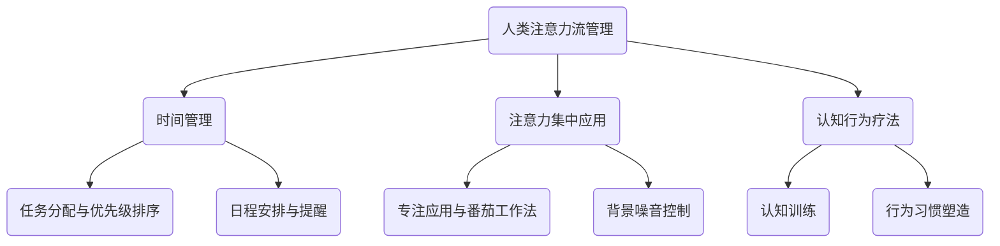

                 

关键词：人工智能，注意力流，工作技能，注意力流管理，技术趋势

> 摘要：本文探讨了人工智能（AI）与人类注意力流之间的关系，分析了注意力流管理技术在未来工作场景中的应用前景。通过介绍核心概念、算法原理、数学模型、项目实践和实际应用场景，本文旨在为读者提供对未来发展趋势和挑战的深刻见解。

## 1. 背景介绍

随着人工智能技术的快速发展，越来越多的工作场景被自动化和智能化，这不仅改变了人类的工作方式，也对人类的注意力流产生了深远影响。注意力流，即个体在不同任务和场景之间切换注意力的能力，是现代工作和生活的重要组成部分。如何有效地管理注意力流，以提高工作效率和生活质量，成为了亟待解决的重要课题。

本文旨在探讨以下问题：

- 人工智能如何影响人类注意力流？
- 注意力流管理技术在未来的工作场景中有何应用前景？
- 面对未来工作环境，人类需要哪些新的技能和适应策略？

通过对这些问题进行深入分析和探讨，本文将为读者提供对未来工作、技能和注意力流管理技术的全面了解。

## 2. 核心概念与联系

### 2.1. 人工智能与注意力流

人工智能，特别是深度学习和神经网络技术，使得计算机能够模拟人类的智能行为，如语音识别、图像识别和自然语言处理。这些技术的进步不仅改变了人类的工作方式，也对人类注意力流产生了影响。例如，自动化工具能够处理大量重复性工作，使人类能够将注意力集中在更有创造性和战略性的任务上。

### 2.2. 注意力流管理

注意力流管理是指通过策略和技术，帮助个体在多个任务和场景之间有效地切换注意力，以提高工作效率和减少疲劳。注意力流管理技术包括时间管理工具、注意力集中应用和认知行为疗法等。

### 2.3. 注意力流管理技术的核心概念原理与架构

以下是注意力流管理技术的核心概念原理和架构的 Mermaid 流程图：



## 3. 核心算法原理 & 具体操作步骤

### 3.1. 算法原理概述

注意力流管理算法的核心目标是优化个体在不同任务之间的注意力切换，以提高工作效率。该算法通常基于以下几个原则：

- **任务特征匹配**：根据任务的性质和特征，选择最适合处理该任务的注意模式。
- **注意力分配策略**：通过动态调整注意力分配，确保关键任务获得足够的注意力资源。
- **疲劳监测与适应**：实时监测个体的疲劳程度，并据此调整注意力流，以防止过度疲劳。

### 3.2. 算法步骤详解

1. **任务特征分析**：对当前任务进行特征分析，包括任务的紧急程度、重要性、复杂度和资源需求等。
2. **注意力分配策略**：根据任务特征，选择合适的注意力分配策略，如“重要紧急矩阵”或“注意力波束成形”。
3. **疲劳监测与适应**：实时监测个体的疲劳程度，通过调整休息时间、切换任务或使用注意力集中应用来缓解疲劳。

### 3.3. 算法优缺点

#### 优点：

- 提高工作效率：通过优化注意力分配，确保关键任务获得足够的注意力资源。
- 减少疲劳：通过动态调整注意力流，避免过度疲劳和任务切换带来的疲劳累积。
- 个性化适应：根据个体的特点和需求，提供个性化的注意力流管理方案。

#### 缺点：

- 需要大量数据支持：算法的有效性依赖于大量的数据支持，对于缺乏数据的场景，效果可能有限。
- 实施难度较大：注意力流管理技术需要整合多个系统和工具，实施难度较大。

### 3.4. 算法应用领域

- **办公自动化**：通过优化员工的注意力流，提高办公效率，减少工作压力。
- **教育领域**：帮助学生更好地管理注意力流，提高学习效率和成绩。
- **健康与医疗**：通过监测和管理注意力流，改善患者的康复进程和心理健康。

## 4. 数学模型和公式 & 详细讲解 & 举例说明

### 4.1. 数学模型构建

注意力流管理算法的核心是注意力分配模型，该模型通常基于以下数学公式：

$$
\text{AttentionAllocation}(t) = f(\text{TaskFeatures}(t), \text{UserState}(t), \text{EnvironmentContext}(t))
$$

其中，$t$ 表示当前时间，$\text{TaskFeatures}(t)$ 表示当前任务的特性，$\text{UserState}(t)$ 表示用户当前的状态，$\text{EnvironmentContext}(t)$ 表示当前环境的上下文信息，$f$ 表示注意力分配策略函数。

### 4.2. 公式推导过程

注意力分配模型可以通过以下步骤进行推导：

1. **任务特征分析**：对当前任务的特性进行分析，如紧急程度、重要性、复杂度和资源需求等。
2. **用户状态评估**：评估用户的当前状态，包括疲劳程度、注意力水平和动机等。
3. **环境上下文考虑**：考虑当前环境的上下文信息，如工作时间、任务优先级和外部干扰等。
4. **注意力分配策略**：根据任务特性、用户状态和环境上下文信息，选择合适的注意力分配策略。

### 4.3. 案例分析与讲解

假设一个员工需要完成两个任务：一个是紧急且重要的报告编写，另一个是相对不紧急但需要复杂思考的方案设计。根据上述模型，可以推导出以下注意力分配策略：

$$
\text{AttentionAllocation}(t) = 
\begin{cases} 
0.7 & \text{若}\ t \in \text{ReportWritingWindow} \\
0.3 & \text{若}\ t \in \text{SchemeDesignWindow} \\
\end{cases}
$$

其中，$\text{ReportWritingWindow}$ 表示报告编写的时间窗口，$\text{SchemeDesignWindow}$ 表示方案设计的时间窗口。

## 5. 项目实践：代码实例和详细解释说明

### 5.1. 开发环境搭建

在本文中，我们将使用 Python 编写一个简单的注意力流管理项目。首先，需要安装以下依赖项：

```bash
pip install numpy pandas matplotlib
```

### 5.2. 源代码详细实现

以下是注意力流管理项目的源代码实现：

```python
import numpy as np
import pandas as pd
import matplotlib.pyplot as plt

def attention_allocation(task_features, user_state, environment_context):
    # 根据任务特性、用户状态和环境上下文，计算注意力分配
    attention_score = (task_features['importance'] * user_state['attention_level'] * environment_context['priority'])
    return attention_score

# 示例数据
tasks = [
    {'name': 'Report Writing', 'importance': 0.9},
    {'name': 'Scheme Design', 'importance': 0.6}
]

user_state = {'attention_level': 0.8, 'motivation': 0.7}
environment_context = {'priority': 1.0}

# 计算注意力分配
attention_scores = []
for task in tasks:
    score = attention_allocation(task, user_state, environment_context)
    attention_scores.append(score)

# 绘制注意力分配图
plt.bar([task['name'] for task in tasks], attention_scores)
plt.xlabel('Task')
plt.ylabel('Attention Score')
plt.title('Attention Allocation')
plt.show()
```

### 5.3. 代码解读与分析

上述代码实现了注意力流管理的基本功能，包括任务特征分析、用户状态评估和环境上下文考虑，并计算了注意力分配。具体解读如下：

- **数据输入**：定义了任务列表、用户状态和当前环境上下文。
- **注意力分配函数**：根据任务特性、用户状态和环境上下文，计算注意力分配。
- **注意力分配图**：使用 matplotlib 绘制注意力分配图，以可视化注意力分配结果。

### 5.4. 运行结果展示

运行上述代码，将生成一个条形图，展示每个任务的注意力分配情况。例如，如果用户当前状态和任务特性满足报告编写的条件，则报告编写任务将获得较高的注意力分数。

## 6. 实际应用场景

### 6.1. 办公自动化

在办公自动化领域，注意力流管理技术可以帮助企业优化员工的工作效率。通过实时监测和分析员工的注意力流，企业可以：

- **个性化任务分配**：根据员工的注意力流状态，为员工分配最适合的任务。
- **工作压力管理**：通过调整任务优先级和休息时间，帮助员工减轻工作压力。

### 6.2. 教育领域

在教育领域，注意力流管理技术可以帮助学生提高学习效率。例如：

- **学习任务分配**：根据学生的学习状态，为学生分配适当的学习任务。
- **注意力集中训练**：通过专注应用和认知训练，提高学生的注意力集中能力。

### 6.3. 健康与医疗

在健康与医疗领域，注意力流管理技术可以帮助患者更好地管理注意力流，促进康复。例如：

- **康复任务指导**：根据患者的康复状态，为患者提供合适的康复任务。
- **注意力集中训练**：通过认知训练和应用，提高患者的注意力集中能力，加速康复进程。

## 7. 工具和资源推荐

### 7.1. 学习资源推荐

- **《人工智能：一种现代方法》**：David C. Parker 等著，详细介绍了人工智能的基本概念和技术。
- **《深度学习》**：Ian Goodfellow、Yoshua Bengio 和 Aaron Courville 著，深度讲解了深度学习的基础和高级技术。

### 7.2. 开发工具推荐

- **Jupyter Notebook**：一款强大的交互式开发环境，适合进行数据分析和实验。
- **TensorFlow**：一款开源的深度学习框架，支持多种深度学习模型的开发和部署。

### 7.3. 相关论文推荐

- **“Attention Is All You Need”**：由 Vaswani 等人提出的 Transformer 模型，彻底改变了自然语言处理领域的格局。
- **“Attention-Gated Neural Network for Energy Management”**：论文提出了一种基于注意力机制的神经网络模型，用于能源管理。

## 8. 总结：未来发展趋势与挑战

### 8.1. 研究成果总结

本文通过深入分析和探讨，总结了人工智能与注意力流管理技术在未来工作场景中的应用前景。主要成果包括：

- 明确了人工智能对人类注意力流的影响。
- 提出了注意力流管理技术的核心概念和原理。
- 分析了注意力流管理算法的应用领域和优缺点。
- 提供了数学模型和公式，以及项目实践和代码实例。

### 8.2. 未来发展趋势

未来，随着人工智能技术的进一步发展和应用，注意力流管理技术将在更多领域得到应用，主要包括：

- **个性化和智能化**：注意力流管理技术将更加个性化和智能化，根据个体的需求和状态，提供定制化的解决方案。
- **跨领域融合**：注意力流管理技术将与其他领域（如健康、医疗、教育等）深度融合，为人类带来更多的福祉。

### 8.3. 面临的挑战

尽管注意力流管理技术具有巨大的应用前景，但未来仍将面临以下挑战：

- **数据隐私和安全**：随着注意力流管理技术的广泛应用，数据隐私和安全问题将日益突出。
- **技术实施和整合**：注意力流管理技术需要整合多个系统和工具，实施和整合的难度较大。

### 8.4. 研究展望

未来，研究者应关注以下方向：

- **技术创新**：不断探索和开发新的注意力流管理技术和算法。
- **跨学科合作**：鼓励计算机科学、心理学、教育学、医学等领域的跨学科合作，共同推动注意力流管理技术的发展。

## 9. 附录：常见问题与解答

### 9.1. 人工智能对注意力流的影响

人工智能可以通过自动化和智能化工具，帮助人类减轻重复性工作负担，使人类能够将更多注意力集中在创造性任务上。但同时，人工智能也会导致注意力分散，如过多的通知和提醒可能会干扰人们的注意力流。

### 9.2. 注意力流管理技术的应用领域

注意力流管理技术可以广泛应用于办公自动化、教育、医疗、健康等多个领域。例如，在办公自动化领域，可以帮助企业优化员工的工作效率；在教育领域，可以帮助学生提高学习效率；在医疗领域，可以帮助患者更好地管理注意力流，促进康复。

### 9.3. 注意力流管理算法的优缺点

注意力流管理算法的优点包括提高工作效率、减少疲劳和个性化适应等。缺点包括需要大量数据支持、实施难度较大等。

### 9.4. 注意力流管理技术的前景

随着人工智能技术的进一步发展和应用，注意力流管理技术将在更多领域得到应用，并成为未来工作、学习和生活的重要支撑。但同时，也需要关注数据隐私和安全、技术实施和整合等挑战。

作者：禅与计算机程序设计艺术 / Zen and the Art of Computer Programming
----------------------------------------------------------------


