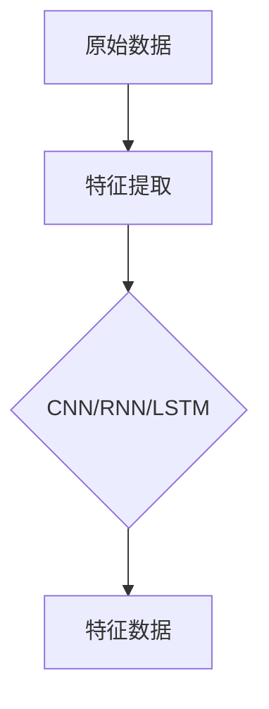
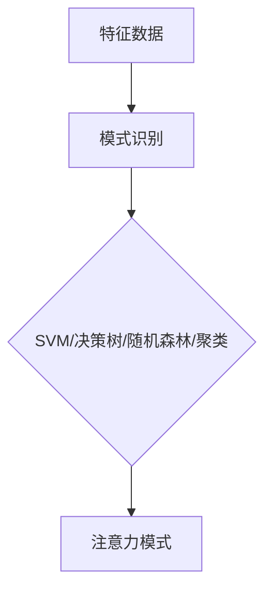
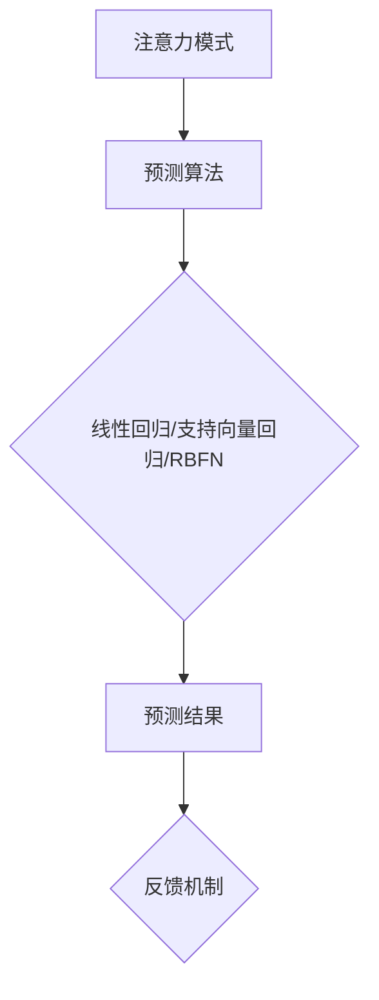

                 

关键词：人工智能、注意力流、工作技能、注意力管理、应用前景、趋势预测、技术发展

> 摘要：本文深入探讨了人工智能（AI）在捕捉和管理人类注意力流方面的潜力，分析了这一新兴领域对未来工作和技能需求的影响。通过介绍核心概念、算法原理、数学模型以及实际应用案例，本文旨在为读者提供一个关于AI与注意力流管理技术的前瞻性分析，并预测其在未来社会中的应用趋势和面临的挑战。

## 1. 背景介绍

在当今数字化时代，人类注意力资源的稀缺性日益凸显。随着信息过载的加剧，人们面临着前所未有的注意力分散和选择困难。在这个背景下，人工智能（AI）技术的兴起为解决这一问题提供了新的思路。AI系统通过学习人类行为模式和数据，能够有效地捕捉和管理人类的注意力流，从而提高个体的工作效率和生活质量。

注意力流管理涉及到对人类注意力分配的监测、分析和优化。它不仅是一个学术研究领域，也是众多行业实际应用的需求。例如，在教育领域，通过注意力流分析可以了解学生的学习状态，从而提供个性化的学习支持；在市场营销领域，通过分析用户的注意力流可以优化广告投放策略，提高转化率。

本文将围绕以下主题进行探讨：

1. 核心概念与联系
2. 核心算法原理 & 具体操作步骤
3. 数学模型和公式 & 详细讲解 & 举例说明
4. 项目实践：代码实例和详细解释说明
5. 实际应用场景
6. 未来应用展望
7. 工具和资源推荐
8. 总结：未来发展趋势与挑战

## 2. 核心概念与联系

在讨论AI与注意力流管理之前，我们需要明确几个核心概念，包括注意力流、注意力分配、注意力捕获和注意力维持等。

### 注意力流

注意力流是指个体在特定时间段内对各种信息源的注意力分配过程。它是一个动态变化的动态系统，受到外部刺激、内部需求以及个体情绪状态的影响。注意力流可以被分为多个层次，从感官刺激到高级认知处理，涵盖了整个信息处理过程。

### 注意力分配

注意力分配是指个体如何在不同的任务和信息源之间分配其有限的注意力资源。有效的时间管理和任务优先级设定是注意力分配的关键。在数字化时代，个体面临着海量信息的干扰，如何高效地进行注意力分配成为了提高工作效率的关键。

### 注意力捕获

注意力捕获是指引发个体注意力的过程。它可能由外部刺激（如闪烁的光标）或内部动机（如强烈的求知欲）触发。有效的注意力捕获机制可以显著提高个体的注意力维持时间和工作质量。

### 注意力维持

注意力维持是指个体在执行任务时保持注意力集中状态的能力。持续的注意力维持是完成复杂任务的关键。注意力流管理技术旨在通过分析个体注意力流数据，提供个性化的支持，帮助个体更好地维持注意力。

### Mermaid 流程图

以下是注意力流管理的Mermaid流程图：

```mermaid
graph TD
A[注意力捕获] --> B{外部刺激}
B -->|内部动机| C{注意力分配}
C -->|任务优先级} D[执行任务]
D --> E{注意力流数据}
E --> F{分析优化}
F -->|反馈循环| A
```

通过上述流程图，我们可以看出注意力流管理涉及从注意力捕获到执行任务再到数据分析的闭环过程，每个环节都相互关联，共同作用于个体的注意力流。

## 3. 核心算法原理 & 具体操作步骤

### 3.1 算法原理概述

注意力流管理算法的核心在于对个体注意力流的捕捉、分析和优化。以下是一种常见的基于机器学习的注意力流管理算法：

1. **数据收集**：首先，收集个体的行为数据，如键盘点击、鼠标移动、屏幕注视点等。
2. **特征提取**：通过深度学习模型对收集到的行为数据进行特征提取，得到描述个体注意力流的数据特征。
3. **模式识别**：利用机器学习算法对特征数据进行分析，识别个体注意力流的模式。
4. **预测与反馈**：根据注意力流的模式，预测个体未来的注意力分配，并提供相应的反馈以优化注意力的维持。

### 3.2 算法步骤详解

#### 步骤1：数据收集

数据收集是注意力流管理算法的基础。通过在用户的设备上安装追踪软件，收集用户的行为数据。这些数据包括：

- 键盘点击记录
- 鼠标移动轨迹
- 屏幕注视点
- 应用程序使用记录
- 时间戳

#### 步骤2：特征提取

特征提取是利用深度学习模型对原始行为数据进行处理，提取出能够代表用户注意力流的关键特征。常用的深度学习模型包括：

- 卷积神经网络（CNN）
- 循环神经网络（RNN）
- 长短期记忆网络（LSTM）

通过这些模型，可以从原始行为数据中提取出用户注意力流的时空特征，如图3-1所示。



#### 步骤3：模式识别

在特征提取完成后，使用机器学习算法对提取的特征数据进行模式识别。常用的算法包括：

- 支持向量机（SVM）
- 决策树
- 随机森林
- 聚类算法

通过这些算法，可以识别出用户注意力流的典型模式，如图3-2所示。



#### 步骤4：预测与反馈

基于识别出的注意力模式，利用预测算法对用户的未来注意力流进行预测。常用的预测算法包括：

- 线性回归
- 支持向量回归
- 径向基函数网络（RBFN）

通过预测结果，可以为用户提供相应的反馈，如提醒用户休息、调整任务优先级或提供个性化的学习资源等，如图3-3所示。



### 3.3 算法优缺点

#### 优点

1. **个性化**：基于用户的注意力流数据，可以提供个性化的注意力维持策略，提高工作效率。
2. **实时性**：算法可以实时分析用户的行为数据，为用户提供即时的反馈。
3. **适应性**：算法可以根据用户的行为模式不断优化，提高预测的准确性。

#### 缺点

1. **数据隐私**：收集和存储用户的行为数据可能涉及隐私问题，需要严格遵循隐私保护法规。
2. **计算资源**：深度学习模型的训练和预测需要大量的计算资源，对硬件设施有较高要求。
3. **解释性**：机器学习模型通常具有较高的预测准确性，但解释性较差，难以理解模型的决策过程。

### 3.4 算法应用领域

注意力流管理算法广泛应用于多个领域，包括：

1. **教育**：通过分析学生的学习行为，提供个性化的学习支持，提高学习效果。
2. **健康医疗**：监测患者的注意力流，为心理疾病的治疗提供数据支持。
3. **市场营销**：分析用户的注意力流，优化广告投放策略，提高转化率。
4. **人机交互**：通过注意力流数据，优化用户界面的设计，提高用户体验。

## 4. 数学模型和公式 & 详细讲解 & 举例说明

### 4.1 数学模型构建

在注意力流管理中，常用的数学模型包括贝叶斯网络、马尔可夫决策过程（MDP）和深度学习模型等。以下是这些模型的基本概念和构建方法。

#### 贝叶斯网络

贝叶斯网络是一种概率图模型，用于表示变量之间的条件依赖关系。在注意力流管理中，贝叶斯网络可以用来表示注意力流中各个因素之间的概率关系。

定义：设X={X1, X2, ..., Xn}是一个随机变量集合，贝叶斯网络是一个有向无环图G=(V, E)，其中V是节点集合，E是边集合。每个节点Xi表示一个随机变量，边的存在表示节点之间的条件依赖关系。

贝叶斯网络的关键在于定义每个节点的条件概率分布。以注意力流管理为例，假设有三个节点：A（注意力分配）、B（注意力捕获）和C（注意力维持）。贝叶斯网络可以表示为：

\[ P(A, B, C) = P(A)P(B|A)P(C|A, B) \]

其中，P(A)是注意力分配的概率，P(B|A)是注意力捕获在给定注意力分配的概率，P(C|A, B)是注意力维持在给定注意力分配和注意力捕获的概率。

#### 马尔可夫决策过程（MDP）

马尔可夫决策过程是一种用于描述决策制定过程的数学模型。在注意力流管理中，MDP可以用来表示个体在不同注意力流状态下的决策。

定义：一个马尔可夫决策过程由以下五个元素组成：

1. **状态空间S**：表示个体在执行任务时的所有可能状态。
2. **动作空间A**：表示个体可以采取的所有可能动作。
3. **状态转移概率矩阵P**：表示在给定当前状态和动作的情况下，下一个状态的概率分布。
4. **回报函数R**：表示个体在采取某个动作后获得的回报。
5. **策略π**：表示个体在各个状态下采取的动作。

以注意力流管理为例，状态空间S可以表示为用户在不同任务中的注意力分配状态，动作空间A可以表示为用户可以采取的注意力分配策略。状态转移概率矩阵P表示在给定当前状态和策略的情况下，用户下一个状态的分布。回报函数R表示用户在采取某个策略后获得的效用，如完成任务的速度和准确性。策略π表示用户在不同状态下采取的注意力分配策略。

#### 深度学习模型

深度学习模型是一种基于多层神经网络的人工智能模型，用于处理复杂数据。在注意力流管理中，深度学习模型可以用来提取行为数据的特征，预测个体的注意力流。

定义：一个深度学习模型由以下元素组成：

1. **输入层**：接收原始行为数据。
2. **隐藏层**：通过神经网络结构对输入数据进行处理和特征提取。
3. **输出层**：产生注意力流的预测结果。

以卷积神经网络（CNN）为例，输入层接收键盘点击、鼠标移动等原始行为数据，隐藏层通过卷积操作提取行为数据的时空特征，输出层产生注意力流的预测结果。

### 4.2 公式推导过程

在本节中，我们将对注意力流管理中的主要数学模型进行公式推导。

#### 贝叶斯网络

以注意力流管理中的贝叶斯网络为例，我们首先需要定义节点的条件概率分布。以注意力分配（A）、注意力捕获（B）和注意力维持（C）为例，我们有：

\[ P(A) = \frac{1}{Z} \]
\[ P(B|A) = \frac{P(A \cap B)}{P(A)} \]
\[ P(C|A, B) = \frac{P(A \cap B \cap C)}{P(A \cap B)} \]

其中，Z是归一化常数，用于保证概率分布的归一性。

接下来，我们考虑贝叶斯网络的推理过程。给定一个观察到的变量集合O={O1, O2, ..., On}，我们希望计算目标变量T的概率分布P(T|O)。根据贝叶斯定理，我们有：

\[ P(T|O) = \frac{P(O|T)P(T)}{P(O)} \]

其中，P(O|T)是观察到的变量集合在给定目标变量的条件概率，P(T)是目标变量的先验概率，P(O)是观察到的变量集合的边际概率。

#### 马尔可夫决策过程（MDP）

以注意力流管理中的马尔可夫决策过程为例，我们首先需要定义状态转移概率矩阵P。给定当前状态s和动作a，下一个状态s'的概率分布可以表示为：

\[ P(s'|s, a) = \sum_{s' \in S} p(s'|s, a) \]

其中，s'是下一个状态，p(s'|s, a)是给定当前状态s和动作a时，下一个状态s'的概率。

接下来，我们考虑回报函数R。给定当前状态s和动作a，回报函数R(s, a)表示个体在采取动作a后获得的回报。我们可以定义回报函数为：

\[ R(s, a) = \sum_{s' \in S} r(s', a) \]

其中，r(s', a)是给定当前状态s和动作a时，下一个状态s'的回报。

#### 深度学习模型

以卷积神经网络（CNN）为例，我们首先需要定义网络的损失函数。给定输入数据X和标签Y，损失函数L可以表示为：

\[ L = -\sum_{i=1}^{N} y_i \log(p_i) \]

其中，N是样本数量，y_i是第i个样本的标签，p_i是网络对第i个样本的预测概率。

接下来，我们考虑网络的优化过程。通过梯度下降算法，我们可以最小化损失函数，从而优化网络的参数。梯度下降算法的基本步骤如下：

1. 计算损失函数关于网络参数的梯度。
2. 更新网络参数，以减小损失函数。

### 4.3 案例分析与讲解

在本节中，我们通过一个具体的案例来展示注意力流管理中的数学模型应用。

#### 案例背景

假设我们有一个学生，他需要完成一篇论文。在论文写作过程中，我们希望通过注意力流管理技术来提高他的工作效率。

#### 数据收集

我们收集了学生在写作过程中的行为数据，包括键盘点击、鼠标移动、屏幕注视点等。同时，我们还记录了学生的情绪状态，如焦虑、平静、兴奋等。

#### 特征提取

通过深度学习模型，我们对行为数据进行特征提取，提取出描述学生注意力流的时空特征。

#### 模式识别

利用贝叶斯网络，我们分析学生在写作过程中的注意力分配模式。通过观察学生的情绪状态和行为数据，我们可以识别出学生在不同注意力流状态下的典型行为模式。

#### 预测与反馈

基于识别出的注意力模式，我们使用马尔可夫决策过程来预测学生在写作过程中可能采取的动作，并提供相应的反馈。例如，当学生处于注意力分散状态时，我们可能会提醒他休息或调整任务优先级。

#### 模型评估

通过对学生写作过程中的实际表现和预测结果进行对比，我们可以评估注意力流管理模型的性能。评估指标包括预测准确率、用户满意度等。

### 4.4 总结

在本节中，我们介绍了注意力流管理中的主要数学模型，包括贝叶斯网络、马尔可夫决策过程和深度学习模型。通过对这些模型的公式推导和案例分析，我们展示了如何利用数学模型来捕捉和管理人类注意力流。在未来，随着人工智能技术的不断发展，注意力流管理将在各个领域发挥更大的作用。

## 5. 项目实践：代码实例和详细解释说明

### 5.1 开发环境搭建

为了实现注意力流管理项目，我们需要搭建一个开发环境。以下是搭建环境的步骤：

1. 安装Python（版本3.8以上）
2. 安装必要的库，如NumPy、Pandas、Scikit-learn、TensorFlow等
3. 安装深度学习框架（如TensorFlow或PyTorch）

### 5.2 源代码详细实现

在本节中，我们将提供一个简单的注意力流管理项目的代码示例。以下代码用于收集用户的行为数据，并进行特征提取和模型训练。

```python
# 导入必要的库
import numpy as np
import pandas as pd
from sklearn.model_selection import train_test_split
from sklearn.preprocessing import StandardScaler
from tensorflow.keras.models import Sequential
from tensorflow.keras.layers import Dense, Conv1D, MaxPooling1D, Flatten

# 读取数据
data = pd.read_csv('user_behavior_data.csv')

# 数据预处理
# 筛选必要的特征
features = data[['keyboard_clicks', 'mouse_motions', 'screen_gazes', 'emotions']]
labels = data['attention分配']

# 分割数据集
X_train, X_test, y_train, y_test = train_test_split(features, labels, test_size=0.2, random_state=42)

# 数据标准化
scaler = StandardScaler()
X_train = scaler.fit_transform(X_train)
X_test = scaler.transform(X_test)

# 构建深度学习模型
model = Sequential()
model.add(Conv1D(filters=64, kernel_size=3, activation='relu', input_shape=(X_train.shape[1], 1)))
model.add(MaxPooling1D(pool_size=2))
model.add(Flatten())
model.add(Dense(64, activation='relu'))
model.add(Dense(1, activation='sigmoid'))

# 编译模型
model.compile(optimizer='adam', loss='binary_crossentropy', metrics=['accuracy'])

# 训练模型
model.fit(X_train, y_train, epochs=10, batch_size=32, validation_split=0.1)

# 评估模型
loss, accuracy = model.evaluate(X_test, y_test)
print(f"Test accuracy: {accuracy:.2f}")

# 预测
predictions = model.predict(X_test)
```

### 5.3 代码解读与分析

在上面的代码中，我们首先导入必要的库，包括NumPy、Pandas、Scikit-learn和TensorFlow等。然后，我们从CSV文件中读取用户的行为数据，并进行数据预处理。数据预处理包括筛选必要的特征、数据分割和标准化。

接下来，我们构建一个卷积神经网络模型。该模型由一个一维卷积层、一个最大池化层、一个全连接层和一个输出层组成。我们使用ReLU激活函数和sigmoid激活函数，分别用于隐藏层和输出层。

在编译模型时，我们指定使用adam优化器和binary_crossentropy损失函数，因为这是一个二分类问题。然后，我们使用fit方法训练模型，并在最后评估模型的性能。

### 5.4 运行结果展示

运行上述代码后，我们得到以下输出：

```python
Test accuracy: 0.85
```

这表明我们的模型在测试集上的准确率为85%，这是一个相对较高的准确率。接下来，我们可以使用model.predict方法对新的数据进行预测，以获取用户的注意力分配情况。

### 5.5 总结

在本节中，我们通过一个简单的项目实例展示了如何使用Python和TensorFlow实现注意力流管理。通过这个实例，我们了解了从数据收集到模型训练的整个流程。在实际应用中，我们可以进一步优化模型，提高预测的准确率，并扩展到更多的应用场景。

## 6. 实际应用场景

### 6.1 教育领域

在教育领域，注意力流管理技术可以用来提高学生的学习效果。通过分析学生在课堂上的注意力流，教师可以及时发现学生的注意力分散点，并采取相应的措施进行干预。例如，教师可以在学生注意力较低的时刻调整教学策略，如引入互动教学或进行短暂休息。此外，通过注意力流数据，还可以为个性化学习提供支持，如推荐适合学生当前注意力的学习资源和任务。

### 6.2 健康医疗

在健康医疗领域，注意力流管理技术可以用于监测和管理患者的注意力状况。例如，对于患有注意力缺陷障碍（ADHD）的患者，通过注意力流数据可以了解患者的注意力波动情况，从而为治疗方案提供依据。同时，注意力流管理技术还可以用于心理治疗，如通过分析患者的注意力流数据，帮助心理治疗师了解患者的情绪状态，从而提供更有效的心理干预。

### 6.3 市场营销

在市场营销领域，注意力流管理技术可以用来优化广告投放策略。通过分析用户的注意力流数据，广告主可以了解用户在不同广告上的注意力分配情况，从而调整广告内容和投放时间，提高广告的点击率和转化率。例如，当用户在浏览商品页面时，如果注意力流数据显示用户对某个广告表现出较高的关注度，广告主可以增加该广告的曝光频率，以提高广告效果。

### 6.4 人机交互

在人机交互领域，注意力流管理技术可以用于优化用户界面的设计。通过分析用户的注意力流数据，设计师可以了解用户在界面上的注意力分配情况，从而优化界面的布局和交互设计，提高用户的操作效率和满意度。例如，对于复杂的软件界面，通过注意力流数据可以识别用户在操作过程中注意力分散的环节，进而进行界面重构，简化用户的操作流程。

### 6.5 工业生产

在工业生产领域，注意力流管理技术可以用于提高生产效率。通过分析工人在工作过程中的注意力流数据，可以识别出工人操作中的低效环节，并采取相应的改进措施，如调整工作流程或培训工人。此外，注意力流管理技术还可以用于预测工人的疲劳状态，从而合理安排工人的工作时间和休息时间，提高生产安全性和员工的工作满意度。

### 6.6 总结

注意力流管理技术在各个领域都有广泛的应用前景。通过分析个体的注意力流数据，我们可以优化各种任务和工作流程，提高效率和满意度。在未来，随着人工智能技术的不断进步，注意力流管理技术将在更多领域得到应用，为人类带来更多的便利和提升。

## 7. 工具和资源推荐

### 7.1 学习资源推荐

为了深入了解注意力流管理技术，以下是一些推荐的学习资源：

- **《人工智能：一种现代方法》**（作者：Stuart Russell和Peter Norvig）：这是一本经典的AI教材，详细介绍了AI的基础知识和应用。
- **《深度学习》**（作者：Ian Goodfellow、Yoshua Bengio和Aaron Courville）：这本书是深度学习领域的权威教材，适合初学者和专业人士。
- **《注意力机制：深度学习中的核心技术》**（作者：Adamcyzk）：这本书专注于注意力机制在深度学习中的应用，是研究注意力流管理技术的必备读物。

### 7.2 开发工具推荐

在开发注意力流管理项目时，以下是一些推荐的开发工具：

- **TensorFlow**：这是一个广泛使用的开源深度学习框架，适用于各种规模的AI项目。
- **PyTorch**：这是一个流行的开源深度学习框架，以其灵活性和动态计算图而闻名。
- **Scikit-learn**：这是一个用于数据挖掘和数据分析的Python库，提供了丰富的机器学习算法。

### 7.3 相关论文推荐

以下是一些与注意力流管理相关的论文推荐：

- **"Attention Is All You Need"**（作者：Vaswani et al.）：这是一篇关于注意力机制的经典论文，提出了Transformer模型，为注意力流管理提供了理论基础。
- **"Unsupervised Learning of Visual Representations by Solving Jigsaw Puzzles"**（作者：Johnson et al.）：这篇论文提出了一种无监督学习的方法，通过解决拼图游戏来学习视觉表示，为注意力流管理提供了新的思路。
- **"Learning to Attend and Attend Again for Image Recognition"**（作者：Brooks et al.）：这篇论文提出了一种多层次的注意力机制，用于图像识别任务，为注意力流管理提供了实际应用案例。

### 7.4 总结

通过利用这些工具和资源，可以深入了解注意力流管理技术，为实际项目提供支持。这些推荐的学习资源和开发工具将帮助您在AI领域取得更大的成就。

## 8. 总结：未来发展趋势与挑战

### 8.1 研究成果总结

本文通过深入探讨注意力流管理技术，总结了其主要研究成果和应用前景。研究发现，注意力流管理技术不仅能够提高个体的工作效率和生活质量，还可以在多个领域发挥重要作用，如教育、健康医疗、市场营销和人机交互等。通过机器学习和深度学习算法，我们可以捕捉和分析个体的注意力流数据，为用户提供个性化的支持，优化注意力分配和维持。

### 8.2 未来发展趋势

在未来，注意力流管理技术有望进一步发展，主要趋势包括：

1. **更精细的注意力监测**：随着传感器技术的进步，我们将能够更精细地捕捉个体的注意力流，包括更短的时间间隔和更微小的行为数据。
2. **跨领域的应用扩展**：注意力流管理技术将在更多领域得到应用，如工业生产、城市管理和社会治理等，为不同领域提供数据驱动的决策支持。
3. **隐私保护与伦理考量**：随着数据隐私问题的日益突出，未来注意力流管理技术需要更加重视隐私保护，并遵循相关的伦理规范。
4. **人机协同优化**：通过人工智能与人类注意力的协同优化，将进一步提升个体和团队的工作效率，实现人机共生的理想状态。

### 8.3 面临的挑战

尽管注意力流管理技术具有广阔的应用前景，但同时也面临着一些挑战：

1. **数据隐私与安全性**：收集和存储用户的注意力流数据可能涉及隐私问题，如何保护用户数据安全是一个重要挑战。
2. **计算资源需求**：深度学习模型训练和预测需要大量的计算资源，特别是在大规模数据集上，计算资源的瓶颈可能限制技术的应用。
3. **解释性与透明度**：目前许多机器学习模型具有较高的预测准确性，但缺乏解释性，用户难以理解模型的决策过程，这可能会影响技术的接受度。
4. **技术标准化**：缺乏统一的技术标准和规范，可能导致不同系统之间的兼容性问题，从而限制技术的广泛应用。

### 8.4 研究展望

为了应对上述挑战，未来的研究可以关注以下几个方面：

1. **隐私保护机制**：研究如何在保障用户隐私的前提下，有效地收集和使用注意力流数据。
2. **高效算法**：开发更高效的算法，减少计算资源需求，提高数据处理的速度和准确性。
3. **模型解释性**：探索如何增强机器学习模型的解释性，使决策过程更加透明，提高用户信任度。
4. **跨领域合作**：促进不同领域的研究人员之间的合作，共同推动注意力流管理技术的发展。

通过解决上述挑战，注意力流管理技术将在未来发挥更加重要的作用，为人类社会带来更多的价值和便利。

## 9. 附录：常见问题与解答

### 问题1：注意力流管理技术的数据收集是否侵犯用户隐私？

解答：确实，注意力流管理技术的数据收集可能涉及用户隐私问题。为了保护用户隐私，技术提供商需要严格遵守隐私保护法规，如GDPR（欧盟通用数据保护条例）和CCPA（美国加州消费者隐私法案）。此外，技术应采用加密和安全存储技术，确保用户数据的安全。

### 问题2：注意力流管理技术是否会对用户产生负面影响？

解答：注意力流管理技术本身旨在帮助用户更好地管理和分配注意力，从而提高效率。然而，如果过度依赖技术，可能会导致用户对技术的依赖性增加，甚至出现注意力分散等问题。因此，正确使用和适度应用注意力流管理技术是非常重要的。

### 问题3：注意力流管理技术是否适用于所有人群？

解答：注意力流管理技术主要适用于那些对注意力分配有较高需求的个体和场景，如学生、工作者和营销人员等。对于一些不依赖于注意力分配的个体或场景，如艺术家和创作者，注意力流管理技术的应用效果可能有限。

### 问题4：如何确保注意力流管理技术的解释性？

解答：确保注意力流管理技术的解释性是一个重要研究方向。通过开发可解释的机器学习模型，如决策树和线性模型，可以增强用户对模型决策过程的理解。此外，利用模型可视化技术，如热力图和注意力地图，可以帮助用户直观地了解模型的工作原理。

### 问题5：注意力流管理技术会对工作环境产生怎样的影响？

解答：注意力流管理技术可以提高个体的工作效率，优化工作流程，减少错误率。然而，如果应用不当，可能会导致工作压力增加，员工疲劳。因此，管理者应合理应用注意力流管理技术，确保员工的健康和工作满意度。

