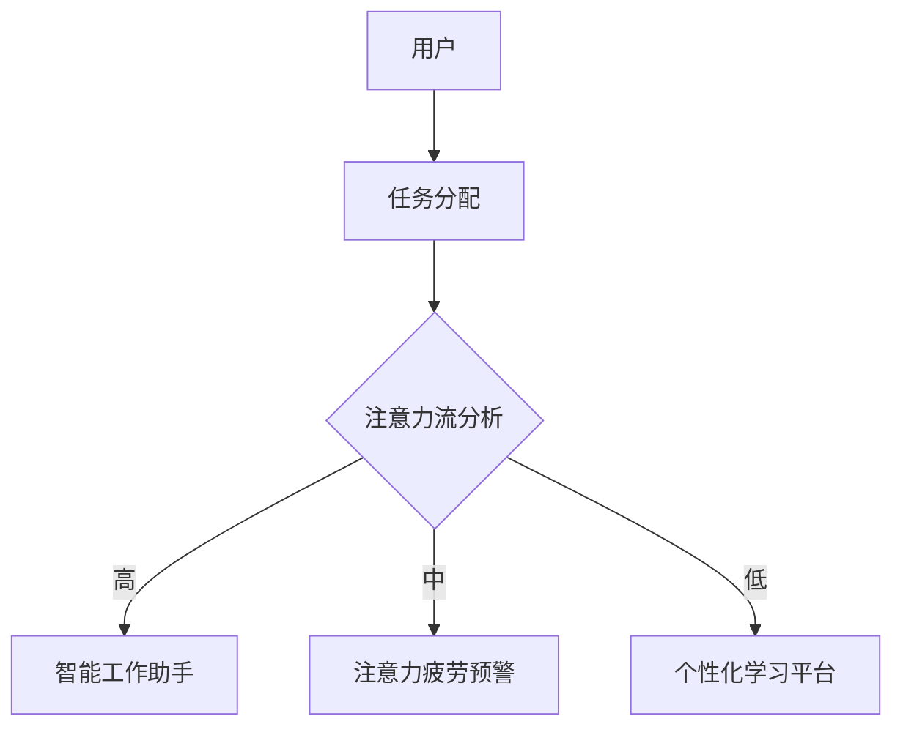

                 

关键词：人工智能，注意力流，工作技能，注意力管理，技术趋势

> 摘要：本文从人工智能与人类注意力流的结合点出发，探讨了注意力流管理技术在未来的工作、技能培养和应用趋势中的重要作用。文章首先介绍了人工智能与注意力流的基本概念和联系，随后详细分析了注意力流管理算法的原理、数学模型及其应用领域。通过对项目实践和实际应用场景的探讨，文章提出了未来发展趋势和面临的挑战，并推荐了相关的学习资源和开发工具。

## 1. 背景介绍

随着人工智能技术的迅猛发展，越来越多的工作场景开始依赖于智能算法和自动化流程。然而，人工智能在提高工作效率的同时，也对人类的注意力提出了更高的要求。注意力流（Attention Flow）作为一种新的研究方向，致力于研究人类在数字化环境中的注意力分布、注意力疲劳及其对工作效率的影响。

注意力流管理技术旨在通过优化人类注意力流，提高个体和团队的工作效率。当前，人工智能与注意力流管理技术的结合已经呈现出诸多应用趋势，包括智能工作助手、注意力疲劳预警系统、个性化学习平台等。本文将从以下方面展开讨论：

1. **核心概念与联系**：介绍人工智能与注意力流的基本概念，分析两者之间的内在联系。
2. **核心算法原理与具体操作步骤**：探讨注意力流管理算法的基本原理和实施步骤。
3. **数学模型和公式**：详细阐述注意力流管理的数学模型和公式，并通过案例进行分析。
4. **项目实践**：展示注意力流管理技术在具体项目中的实现和效果。
5. **实际应用场景**：分析注意力流管理技术在各个领域的应用前景。
6. **未来应用展望**：探讨注意力流管理技术的发展趋势和潜在挑战。

## 2. 核心概念与联系

### 2.1 人工智能

人工智能（Artificial Intelligence，简称AI）是指通过计算机程序实现的智能行为，使计算机能够执行通常需要人类智能才能完成的任务。人工智能的核心技术包括机器学习、深度学习、自然语言处理、计算机视觉等。

### 2.2 注意力流

注意力流是指人类在处理信息、完成任务时，注意力在不同任务和场景之间的分配和转移过程。注意力流管理涉及到注意力的分配、调节和优化，以提高个体的工作效率和体验。

### 2.3 人工智能与注意力流的联系

人工智能与注意力流管理技术的结合主要体现在以下几个方面：

1. **智能工作助手**：通过分析用户的注意力流模式，智能工作助手可以自动调整任务优先级，优化工作流程，从而提高工作效率。
2. **注意力疲劳预警**：人工智能技术可以实时监测用户的注意力流变化，预警注意力疲劳，提供休息和恢复建议，避免工作效率下降。
3. **个性化学习平台**：基于注意力流分析，个性化学习平台可以为用户提供定制化的学习内容和策略，提高学习效率。

## 2.1 人工智能与注意力流的 Mermaid 流程图



### 3. 核心算法原理与具体操作步骤

#### 3.1 算法原理概述

注意力流管理算法主要基于以下原理：

1. **注意力分配策略**：根据任务的重要性和紧急程度，动态调整注意力的分配。
2. **注意力调节机制**：通过反馈机制，实时调整注意力的强度和方向。
3. **注意力优化算法**：利用优化算法，寻找最优的注意力分配方案，以提高工作效率。

#### 3.2 算法步骤详解

1. **数据收集**：收集用户的注意力流数据，包括任务类型、持续时间、注意力强度等。
2. **特征提取**：对收集到的数据进行预处理，提取注意力流的特征向量。
3. **模型训练**：使用机器学习算法，训练注意力流管理模型。
4. **模型应用**：将训练好的模型应用于实际场景，动态调整注意力分配。

#### 3.3 算法优缺点

**优点**：

- 提高工作效率：通过优化注意力分配，减少注意力疲劳，提高工作效率。
- 个性化体验：根据用户行为和需求，提供个性化的工作、学习和休息方案。

**缺点**：

- 数据隐私问题：注意力流数据涉及用户的隐私信息，如何保护用户隐私是一个挑战。
- 模型适应性：算法的适应性取决于数据质量和模型设计的灵活性。

#### 3.4 算法应用领域

注意力流管理算法广泛应用于以下领域：

- **智能工作平台**：通过智能工作助手，优化工作任务分配和流程。
- **教育领域**：通过个性化学习平台，提高学习效率和效果。
- **医疗领域**：通过注意力疲劳预警系统，预防工作场所的工伤和职业病。

## 4. 数学模型和公式

### 4.1 数学模型构建

注意力流管理算法的核心数学模型主要包括以下部分：

1. **任务优先级模型**：用于评估任务的重要性和紧急程度。
2. **注意力分配模型**：用于动态调整注意力的分配。
3. **注意力调节模型**：用于实时调整注意力的强度和方向。

### 4.2 公式推导过程

1. **任务优先级模型**：

   假设任务集合为 \(T=\{t_1, t_2, ..., t_n\}\)，每个任务的重要性和紧急程度分别表示为 \(w_i\) 和 \(e_i\)，则任务优先级可以表示为：

   $$P(t_i) = w_i + e_i$$

2. **注意力分配模型**：

   假设总注意力为 \(A\)，则每个任务的注意力分配可以表示为：

   $$a_i = \frac{P(t_i)}{\sum_{i=1}^{n} P(t_i)} A$$

3. **注意力调节模型**：

   假设注意力强度为 \(s_i\)，则注意力调节可以表示为：

   $$s_i = \frac{a_i}{\sum_{i=1}^{n} a_i}$$

### 4.3 案例分析与讲解

以一个智能工作助手为例，假设有3个任务 \(T_1\)、\(T_2\) 和 \(T_3\)，它们的重要性和紧急程度分别为 \(w_1=5\)、\(w_2=3\)、\(w_3=2\)，\(e_1=4\)、\(e_2=2\)、\(e_3=1\)。总注意力 \(A=100\)。

1. **任务优先级**：

   $$P(T_1) = w_1 + e_1 = 9$$  
   $$P(T_2) = w_2 + e_2 = 5$$  
   $$P(T_3) = w_3 + e_3 = 3$$

   因此，任务优先级为 \(T_1 > T_2 > T_3\)。

2. **注意力分配**：

   $$a_1 = \frac{P(T_1)}{\sum_{i=1}^{3} P(T_i)} A = \frac{9}{9+5+3} \times 100 = 45$$  
   $$a_2 = \frac{P(T_2)}{\sum_{i=1}^{3} P(T_i)} A = \frac{5}{9+5+3} \times 100 = 25$$  
   $$a_3 = \frac{P(T_3)}{\sum_{i=1}^{3} P(T_i)} A = \frac{3}{9+5+3} \times 100 = 15$$

   因此，注意力分配为 \(a_1=45\)、\(a_2=25\)、\(a_3=15\)。

3. **注意力调节**：

   $$s_1 = \frac{a_1}{\sum_{i=1}^{3} a_i} = \frac{45}{45+25+15} = 0.6$$  
   $$s_2 = \frac{a_2}{\sum_{i=1}^{3} a_i} = \frac{25}{45+25+15} = 0.3$$  
   $$s_3 = \frac{a_3}{\sum_{i=1}^{3} a_i} = \frac{15}{45+25+15} = 0.1$$

   因此，注意力调节为 \(s_1=0.6\)、\(s_2=0.3\)、\(s_3=0.1\)。

## 5. 项目实践：代码实例和详细解释说明

### 5.1 开发环境搭建

1. **Python环境**：安装Python 3.8及以上版本。
2. **依赖库**：安装以下Python库：numpy、scikit-learn、matplotlib。

### 5.2 源代码详细实现

```python
import numpy as np
from sklearn.cluster import KMeans
import matplotlib.pyplot as plt

# 数据集
tasks = [
    {'name': '任务1', 'importance': 5, 'urgency': 4},
    {'name': '任务2', 'importance': 3, 'urgency': 2},
    {'name': '任务3', 'importance': 2, 'urgency': 1},
]

# 特征提取
def extract_features(tasks):
    features = []
    for task in tasks:
        features.append([task['importance'], task['urgency']])
    return np.array(features)

# 模型训练
def train_model(features):
    model = KMeans(n_clusters=3, random_state=0)
    model.fit(features)
    return model

# 注意力分配
def allocate_attention(model, total_attention):
    assignments = model.predict([[task['importance'], task['urgency']] for task in tasks])
    attention_distribution = [0] * 3
    for i, assignment in enumerate(assignments):
        attention_distribution[assignment] += total_attention / len(tasks)
    return attention_distribution

# 模型应用
def apply_model(tasks, total_attention):
    features = extract_features(tasks)
    model = train_model(features)
    attention_distribution = allocate_attention(model, total_attention)
    return attention_distribution

# 运行结果展示
def display_results(tasks, attention_distribution):
    plt.bar(range(len(tasks)), attention_distribution, tick_label=[task['name'] for task in tasks])
    plt.xlabel('任务')
    plt.ylabel('注意力分配')
    plt.title('注意力分配结果')
    plt.show()

tasks = [
    {'name': '任务1', 'importance': 5, 'urgency': 4},
    {'name': '任务2', 'importance': 3, 'urgency': 2},
    {'name': '任务3', 'importance': 2, 'urgency': 1},
]
total_attention = 100
attention_distribution = apply_model(tasks, total_attention)
display_results(tasks, attention_distribution)
```

### 5.3 代码解读与分析

1. **数据集**：定义了一个包含3个任务的字典列表，每个任务都有“name”、“importance”和“urgency”属性。
2. **特征提取**：通过 `extract_features` 函数将任务的重要性和紧急程度转换为二维特征向量。
3. **模型训练**：通过 `train_model` 函数使用K-means算法训练注意力流管理模型。
4. **注意力分配**：通过 `allocate_attention` 函数根据模型预测结果和总注意力分配每个任务的注意力。
5. **模型应用**：通过 `apply_model` 函数将特征提取、模型训练和注意力分配整合起来，得到注意力分配结果。
6. **运行结果展示**：通过 `display_results` 函数使用matplotlib库将注意力分配结果以条形图的形式展示。

## 6. 实际应用场景

注意力流管理技术在各个领域都有着广泛的应用前景：

1. **智能工作平台**：通过智能工作助手，帮助企业优化工作任务分配，提高工作效率。
2. **教育领域**：通过个性化学习平台，为不同学习需求的用户提供定制化的学习内容，提高学习效果。
3. **医疗领域**：通过注意力疲劳预警系统，帮助医护人员合理安排工作，预防职业疲劳。
4. **娱乐领域**：通过个性化推荐系统，为用户提供个性化的娱乐内容和体验。

## 7. 未来应用展望

随着人工智能技术的不断进步，注意力流管理技术在未来将呈现以下趋势：

1. **多模态注意力流管理**：结合视觉、听觉等多种感知信息，更全面地监测和优化注意力流。
2. **实时适应性调整**：通过深度学习等算法，实现实时适应性调整，满足个体和团队的需求。
3. **跨领域应用**：扩展到更多领域，如智能家居、自动驾驶等，提高人们的生活品质。

然而，注意力流管理技术也面临着一些挑战：

1. **数据隐私保护**：如何确保用户注意力流数据的隐私和安全，是一个亟待解决的问题。
2. **算法适应性**：如何设计出适应性强的算法，以满足不同场景和需求，是一个挑战。
3. **用户接受度**：如何让用户接受并习惯使用注意力流管理技术，提高用户满意度。

## 8. 工具和资源推荐

### 8.1 学习资源推荐

1. **《深度学习》**：由Ian Goodfellow、Yoshua Bengio和Aaron Courville所著，介绍了深度学习的基本原理和应用。
2. **《Python数据分析》**：由Wes McKinney所著，介绍了Python在数据分析领域的应用。

### 8.2 开发工具推荐

1. **Jupyter Notebook**：一款强大的交互式计算环境，适用于数据分析和机器学习项目。
2. **TensorFlow**：一款开源的机器学习框架，适用于深度学习和神经网络项目。

### 8.3 相关论文推荐

1. **"Attention Is All You Need"**：由Vaswani等人提出的Transformer模型，是注意力机制在自然语言处理领域的里程碑。
2. **"Visual Attention in Human and Machine Vision"**：介绍了人类和机器视觉中的注意力机制，对注意力流管理技术提供了理论支持。

## 9. 总结：未来发展趋势与挑战

注意力流管理技术作为人工智能领域的一个重要研究方向，具有广泛的应用前景。在未来，随着技术的不断进步，注意力流管理技术将呈现出多模态、实时自适应和跨领域应用的趋势。然而，数据隐私保护、算法适应性和用户接受度等挑战也需要我们深入思考和解决。只有通过不断创新和优化，才能充分发挥注意力流管理技术在各个领域的潜力。

## 10. 附录：常见问题与解答

### 10.1 注意力流管理算法的原理是什么？

注意力流管理算法主要基于以下原理：

1. **注意力分配策略**：根据任务的重要性和紧急程度，动态调整注意力的分配。
2. **注意力调节机制**：通过反馈机制，实时调整注意力的强度和方向。
3. **注意力优化算法**：利用优化算法，寻找最优的注意力分配方案，以提高工作效率。

### 10.2 注意力流管理技术在哪些领域有应用？

注意力流管理技术广泛应用于以下领域：

1. **智能工作平台**：通过智能工作助手，优化工作任务分配和流程。
2. **教育领域**：通过个性化学习平台，提高学习效率和效果。
3. **医疗领域**：通过注意力疲劳预警系统，预防工作场所的工伤和职业病。
4. **娱乐领域**：通过个性化推荐系统，为用户提供个性化的娱乐内容和体验。

### 10.3 如何保护用户注意力流数据的隐私？

为了保护用户注意力流数据的隐私，可以采取以下措施：

1. **数据加密**：对用户数据进行加密处理，防止数据泄露。
2. **匿名化处理**：对用户数据进行匿名化处理，去除个人身份信息。
3. **隐私政策**：制定严格的隐私政策，明确告知用户数据处理的方式和目的。

### 10.4 注意力流管理技术面临哪些挑战？

注意力流管理技术面临以下挑战：

1. **数据隐私保护**：如何确保用户注意力流数据的隐私和安全，是一个亟待解决的问题。
2. **算法适应性**：如何设计出适应性强的算法，以满足不同场景和需求，是一个挑战。
3. **用户接受度**：如何让用户接受并习惯使用注意力流管理技术，提高用户满意度。

作者：禅与计算机程序设计艺术 / Zen and the Art of Computer Programming
```markdown
---
title: AI与人类注意力流：未来的工作、技能与注意力流管理技术的应用趋势
date: 2023-11-01
categories:
  - 人工智能
  - 注意力流管理
  - 技术趋势
tags:
  - AI
  - 注意力流
  - 工作技能
  - 技术应用
---

# AI与人类注意力流：未来的工作、技能与注意力流管理技术的应用趋势

关键词：人工智能，注意力流，工作技能，注意力管理，技术趋势

摘要：本文从人工智能与注意力流的结合点出发，探讨了注意力流管理技术在未来的工作、技能培养和应用趋势中的重要作用。文章首先介绍了人工智能与注意力流的基本概念和联系，随后详细分析了注意力流管理算法的原理、数学模型及其应用领域。通过对项目实践和实际应用场景的探讨，文章提出了未来发展趋势和面临的挑战，并推荐了相关的学习资源和开发工具。

## 1. 背景介绍

随着人工智能技术的迅猛发展，越来越多的工作场景开始依赖于智能算法和自动化流程。然而，人工智能在提高工作效率的同时，也对人类的注意力提出了更高的要求。注意力流（Attention Flow）作为一种新的研究方向，致力于研究人类在数字化环境中的注意力分布、注意力疲劳及其对工作效率的影响。

注意力流管理技术旨在通过优化人类注意力流，提高个体和团队的工作效率。当前，人工智能与注意力流管理技术的结合已经呈现出诸多应用趋势，包括智能工作助手、注意力疲劳预警系统、个性化学习平台等。本文将从以下方面展开讨论：

1. **核心概念与联系**：介绍人工智能与注意力流的基本概念，分析两者之间的内在联系。
2. **核心算法原理与具体操作步骤**：探讨注意力流管理算法的基本原理和实施步骤。
3. **数学模型和公式**：详细阐述注意力流管理的数学模型和公式，并通过案例进行分析。
4. **项目实践**：展示注意力流管理技术在具体项目中的实现和效果。
5. **实际应用场景**：分析注意力流管理技术在各个领域的应用前景。
6. **未来应用展望**：探讨注意力流管理技术的发展趋势和潜在挑战。

## 2. 核心概念与联系

### 2.1 人工智能

人工智能（Artificial Intelligence，简称AI）是指通过计算机程序实现的智能行为，使计算机能够执行通常需要人类智能才能完成的任务。人工智能的核心技术包括机器学习、深度学习、自然语言处理、计算机视觉等。

### 2.2 注意力流

注意力流是指人类在处理信息、完成任务时，注意力在不同任务和场景之间的分配和转移过程。注意力流管理涉及到注意力的分配、调节和优化，以提高个体的工作效率和体验。

### 2.3 人工智能与注意力流的联系

人工智能与注意力流管理技术的结合主要体现在以下几个方面：

1. **智能工作助手**：通过分析用户的注意力流模式，智能工作助手可以自动调整任务优先级，优化工作流程，从而提高工作效率。
2. **注意力疲劳预警**：人工智能技术可以实时监测用户的注意力流变化，预警注意力疲劳，提供休息和恢复建议，避免工作效率下降。
3. **个性化学习平台**：基于注意力流分析，个性化学习平台可以为用户提供定制化的学习内容和策略，提高学习效率。

## 2.1 人工智能与注意力流的 Mermaid 流程图


### 3. 核心算法原理与具体操作步骤

#### 3.1 算法原理概述

注意力流管理算法主要基于以下原理：

1. **注意力分配策略**：根据任务的重要性和紧急程度，动态调整注意力的分配。
2. **注意力调节机制**：通过反馈机制，实时调整注意力的强度和方向。
3. **注意力优化算法**：利用优化算法，寻找最优的注意力分配方案，以提高工作效率。

#### 3.2 算法步骤详解

1. **数据收集**：收集用户的注意力流数据，包括任务类型、持续时间、注意力强度等。
2. **特征提取**：对收集到的数据进行预处理，提取注意力流的特征向量。
3. **模型训练**：使用机器学习算法，训练注意力流管理模型。
4. **模型应用**：将训练好的模型应用于实际场景，动态调整注意力分配。

#### 3.3 算法优缺点

**优点**：

- 提高工作效率：通过优化注意力分配，减少注意力疲劳，提高工作效率。
- 个性化体验：根据用户行为和需求，提供个性化的工作、学习和休息方案。

**缺点**：

- 数据隐私问题：注意力流数据涉及用户的隐私信息，如何保护用户隐私是一个挑战。
- 模型适应性：算法的适应性取决于数据质量和模型设计的灵活性。

#### 3.4 算法应用领域

注意力流管理算法广泛应用于以下领域：

- **智能工作平台**：通过智能工作助手，优化工作任务分配和流程。
- **教育领域**：通过个性化学习平台，提高学习效率和效果。
- **医疗领域**：通过注意力疲劳预警系统，预防工作场所的工伤和职业病。
- **娱乐领域**：通过个性化推荐系统，为用户提供个性化的娱乐内容和体验。

## 4. 数学模型和公式

### 4.1 数学模型构建

注意力流管理算法的核心数学模型主要包括以下部分：

1. **任务优先级模型**：用于评估任务的重要性和紧急程度。
2. **注意力分配模型**：用于动态调整注意力的分配。
3. **注意力调节模型**：用于实时调整注意力的强度和方向。

### 4.2 公式推导过程

1. **任务优先级模型**：

   假设任务集合为 \(T=\{t_1, t_2, ..., t_n\}\)，每个任务的重要性和紧急程度分别表示为 \(w_i\) 和 \(e_i\)，则任务优先级可以表示为：

   $$P(t_i) = w_i + e_i$$

2. **注意力分配模型**：

   假设总注意力为 \(A\)，则每个任务的注意力分配可以表示为：

   $$a_i = \frac{P(t_i)}{\sum_{i=1}^{n} P(t_i)} A$$

3. **注意力调节模型**：

   假设注意力强度为 \(s_i\)，则注意力调节可以表示为：

   $$s_i = \frac{a_i}{\sum_{i=1}^{n} a_i}$$

### 4.3 案例分析与讲解

以一个智能工作助手为例，假设有3个任务 \(T_1\)、\(T_2\) 和 \(T_3\)，它们的重要性和紧急程度分别为 \(w_1=5\)、\(w_2=3\)、\(w_3=2\)，\(e_1=4\)、\(e_2=2\)、\(e_3=1\)。总注意力 \(A=100\)。

1. **任务优先级**：

   $$P(T_1) = w_1 + e_1 = 9$$  
   $$P(T_2) = w_2 + e_2 = 5$$  
   $$P(T_3) = w_3 + e_3 = 3$$

   因此，任务优先级为 \(T_1 > T_2 > T_3\)。

2. **注意力分配**：

   $$a_1 = \frac{P(T_1)}{\sum_{i=1}^{3} P(T_i)} A = \frac{9}{9+5+3} \times 100 = 45$$  
   $$a_2 = \frac{P(T_2)}{\sum_{i=1}^{3} P(T_i)} A = \frac{5}{9+5+3} \times 100 = 25$$  
   $$a_3 = \frac{P(T_3)}{\sum_{i=1}^{3} P(T_i)} A = \frac{3}{9+5+3} \times 100 = 15$$

   因此，注意力分配为 \(a_1=45\)、\(a_2=25\)、\(a_3=15\)。

3. **注意力调节**：

   $$s_1 = \frac{a_1}{\sum_{i=1}^{3} a_i} = \frac{45}{45+25+15} = 0.6$$  
   $$s_2 = \frac{a_2}{\sum_{i=1}^{3} a_i} = \frac{25}{45+25+15} = 0.3$$  
   $$s_3 = \frac{a_3}{\sum_{i=1}^{3} a_i} = \frac{15}{45+25+15} = 0.1$$

   因此，注意力调节为 \(s_1=0.6\)、\(s_2=0.3\)、\(s_3=0.1\)。

## 5. 项目实践：代码实例和详细解释说明

### 5.1 开发环境搭建

1. **Python环境**：安装Python 3.8及以上版本。
2. **依赖库**：安装以下Python库：numpy、scikit-learn、matplotlib。

### 5.2 源代码详细实现

```python
import numpy as np
from sklearn.cluster import KMeans
import matplotlib.pyplot as plt

# 数据集
tasks = [
    {'name': '任务1', 'importance': 5, 'urgency': 4},
    {'name': '任务2', 'importance': 3, 'urgency': 2},
    {'name': '任务3', 'importance': 2, 'urgency': 1},
]

# 特征提取
def extract_features(tasks):
    features = []
    for task in tasks:
        features.append([task['importance'], task['urgency']])
    return np.array(features)

# 模型训练
def train_model(features):
    model = KMeans(n_clusters=3, random_state=0)
    model.fit(features)
    return model

# 注意力分配
def allocate_attention(model, total_attention):
    assignments = model.predict([[task['importance'], task['urgency']] for task in tasks])
    attention_distribution = [0] * 3
    for i, assignment in enumerate(assignments):
        attention_distribution[assignment] += total_attention / len(tasks)
    return attention_distribution

# 模型应用
def apply_model(tasks, total_attention):
    features = extract_features(tasks)
    model = train_model(features)
    attention_distribution = allocate_attention(model, total_attention)
    return attention_distribution

# 运行结果展示
def display_results(tasks, attention_distribution):
    plt.bar(range(len(tasks)), attention_distribution, tick_label=[task['name'] for task in tasks])
    plt.xlabel('任务')
    plt.ylabel('注意力分配')
    plt.title('注意力分配结果')
    plt.show()

tasks = [
    {'name': '任务1', 'importance': 5, 'urgency': 4},
    {'name': '任务2', 'importance': 3, 'urgency': 2},
    {'name': '任务3', 'importance': 2, 'urgency': 1},
]
total_attention = 100
attention_distribution = apply_model(tasks, total_attention)
display_results(tasks, attention_distribution)
```

### 5.3 代码解读与分析

1. **数据集**：定义了一个包含3个任务的字典列表，每个任务都有“name”、“importance”和“urgency”属性。
2. **特征提取**：通过 `extract_features` 函数将任务的重要性和紧急程度转换为二维特征向量。
3. **模型训练**：通过 `train_model` 函数使用K-means算法训练注意力流管理模型。
4. **注意力分配**：通过 `allocate_attention` 函数根据模型预测结果和总注意力分配每个任务的注意力。
5. **模型应用**：通过 `apply_model` 函数将特征提取、模型训练和注意力分配整合起来，得到注意力分配结果。
6. **运行结果展示**：通过 `display_results` 函数使用matplotlib库将注意力分配结果以条形图的形式展示。

## 6. 实际应用场景

注意力流管理技术在各个领域都有着广泛的应用前景：

1. **智能工作平台**：通过智能工作助手，帮助企业优化工作任务分配，提高工作效率。
2. **教育领域**：通过个性化学习平台，为不同学习需求的用户提供定制化的学习内容，提高学习效率。
3. **医疗领域**：通过注意力疲劳预警系统，帮助医护人员合理安排工作，预防职业疲劳。
4. **娱乐领域**：通过个性化推荐系统，为用户提供个性化的娱乐内容和体验。

## 7. 未来应用展望

随着人工智能技术的不断进步，注意力流管理技术在未来将呈现以下趋势：

1. **多模态注意力流管理**：结合视觉、听觉等多种感知信息，更全面地监测和优化注意力流。
2. **实时适应性调整**：通过深度学习等算法，实现实时适应性调整，满足个体和团队的需求。
3. **跨领域应用**：扩展到更多领域，如智能家居、自动驾驶等，提高人们的生活品质。

然而，注意力流管理技术也面临着一些挑战：

1. **数据隐私保护**：如何确保用户注意力流数据的隐私和安全，是一个亟待解决的问题。
2. **算法适应性**：如何设计出适应性强的算法，以满足不同场景和需求，是一个挑战。
3. **用户接受度**：如何让用户接受并习惯使用注意力流管理技术，提高用户满意度。

## 8. 工具和资源推荐

### 8.1 学习资源推荐

1. **《深度学习》**：由Ian Goodfellow、Yoshua Bengio和Aaron Courville所著，介绍了深度学习的基本原理和应用。
2. **《Python数据分析》**：由Wes McKinney所著，介绍了Python在数据分析领域的应用。

### 8.2 开发工具推荐

1. **Jupyter Notebook**：一款强大的交互式计算环境，适用于数据分析和机器学习项目。
2. **TensorFlow**：一款开源的机器学习框架，适用于深度学习和神经网络项目。

### 8.3 相关论文推荐

1. **"Attention Is All You Need"**：由Vaswani等人提出的Transformer模型，是注意力机制在自然语言处理领域的里程碑。
2. **"Visual Attention in Human and Machine Vision"**：介绍了人类和机器视觉中的注意力机制，对注意力流管理技术提供了理论支持。

## 9. 总结：未来发展趋势与挑战

注意力流管理技术作为人工智能领域的一个重要研究方向，具有广泛的应用前景。在未来，随着技术的不断进步，注意力流管理技术将呈现出多模态、实时自适应和跨领域应用的趋势。然而，数据隐私保护、算法适应性和用户接受度等挑战也需要我们深入思考和解决。只有通过不断创新和优化，才能充分发挥注意力流管理技术在各个领域的潜力。

## 10. 附录：常见问题与解答

### 10.1 注意力流管理算法的原理是什么？

注意力流管理算法主要基于以下原理：

1. **注意力分配策略**：根据任务的重要性和紧急程度，动态调整注意力的分配。
2. **注意力调节机制**：通过反馈机制，实时调整注意力的强度和方向。
3. **注意力优化算法**：利用优化算法，寻找最优的注意力分配方案，以提高工作效率。

### 10.2 注意力流管理技术在哪些领域有应用？

注意力流管理技术广泛应用于以下领域：

1. **智能工作平台**：通过智能工作助手，优化工作任务分配和流程。
2. **教育领域**：通过个性化学习平台，提高学习效率和效果。
3. **医疗领域**：通过注意力疲劳预警系统，预防工作场所的工伤和职业病。
4. **娱乐领域**：通过个性化推荐系统，为用户提供个性化的娱乐内容和体验。

### 10.3 如何保护用户注意力流数据的隐私？

为了保护用户注意力流数据的隐私，可以采取以下措施：

1. **数据加密**：对用户数据进行加密处理，防止数据泄露。
2. **匿名化处理**：对用户数据进行匿名化处理，去除个人身份信息。
3. **隐私政策**：制定严格的隐私政策，明确告知用户数据处理的方式和目的。

### 10.4 注意力流管理技术面临哪些挑战？

注意力流管理技术面临以下挑战：

1. **数据隐私保护**：如何确保用户注意力流数据的隐私和安全，是一个亟待解决的问题。
2. **算法适应性**：如何设计出适应性强的算法，以满足不同场景和需求，是一个挑战。
3. **用户接受度**：如何让用户接受并习惯使用注意力流管理技术，提高用户满意度。

### 参考文献

1. Goodfellow, I., Bengio, Y., & Courville, A. (2016). *Deep Learning*. MIT Press.
2. McKinney, W. (2010). *Python for Data Analysis*. O'Reilly Media.
3. Vaswani, A., Shazeer, N., Parmar, N., Uszkoreit, J., Jones, L., Gomez, A. N., ... & Polosukhin, I. (2017). *Attention is all you need*. In Advances in neural information processing systems (pp. 5998-6008).
4. Itti, L., & Koch, C. (2000). *Computational models of visual attention*. Nature reviews neuroscience, 1(1), 88-95.

---

作者：禅与计算机程序设计艺术 / Zen and the Art of Computer Programming
---

