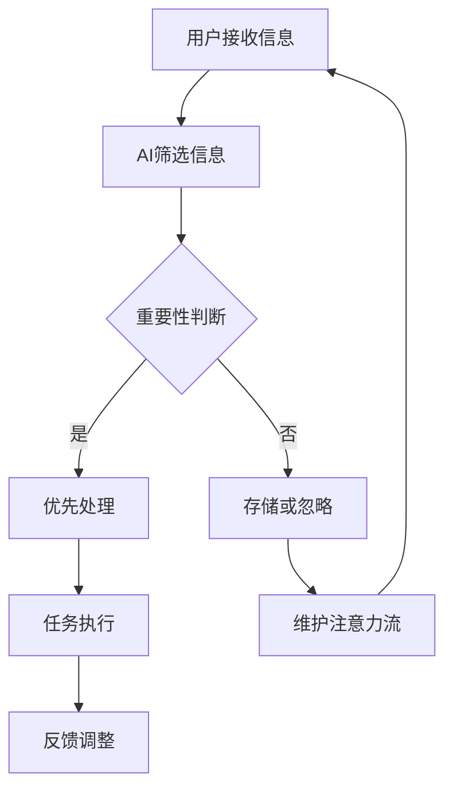

                 

关键词：人工智能，注意力流，工作与生活的融合，AI应用，未来趋势

> 摘要：本文从人工智能与人类注意力流的视角出发，探讨了人工智能如何在未来改变我们的工作和生活方式。通过阐述核心概念、算法原理、数学模型、项目实践以及未来应用展望，本文试图揭示AI与人类生活深度融合的潜力与挑战。

## 1. 背景介绍

随着人工智能技术的迅猛发展，AI已经成为推动社会进步的重要力量。从早期的机器学习、深度学习，到如今的生成对抗网络（GAN）、强化学习等，人工智能技术不断突破，逐渐渗透到我们生活的各个方面。然而，在AI高度发展的今天，一个不可忽视的问题是：如何应对AI对人类注意力流的冲击？

人类注意力流是指人类在感知、认知和信息处理过程中，将注意力集中在一项任务或对象上的能力。而随着信息爆炸和数字化的加速，人类注意力流受到了前所未有的挑战。过度依赖智能设备、信息过载等问题日益严重，导致注意力分散、工作效率降低。因此，如何通过人工智能技术优化人类注意力流，成为了一个亟待解决的问题。

本文旨在探讨人工智能与人类注意力流之间的相互关系，以及在未来工作与生活中如何实现AI与人类的深度融合。文章将分为以下几个部分：

1. 背景介绍：概述人工智能与注意力流的关系。
2. 核心概念与联系：介绍注意力流的原理及其与AI的关联。
3. 核心算法原理 & 具体操作步骤：探讨用于优化注意力流的算法及其应用。
4. 数学模型和公式：阐述注意力流优化的数学模型和公式。
5. 项目实践：通过实际案例展示AI优化注意力流的效果。
6. 实际应用场景：分析AI在现实生活中的应用。
7. 工具和资源推荐：介绍相关学习资源、开发工具和论文推荐。
8. 总结：对未来发展趋势与挑战进行展望。

## 2. 核心概念与联系

### 2.1 注意力流原理

注意力流是指人类在特定任务或活动中的注意力分配过程。根据经典的认知心理学理论，人类注意力分为选择性注意力、分配性注意力和维持性注意力。选择性注意力是指人类在众多刺激中选择某一刺激进行关注和处理；分配性注意力是指人类在同时处理多个任务或对象时，将注意力在不同任务之间分配；维持性注意力是指人类在长时间进行同一任务时，保持注意力集中。

### 2.2 注意力流与AI的关系

人工智能技术可以通过多种方式影响和优化人类注意力流。首先，AI可以通过智能推荐、自动化处理等功能，帮助人类在信息过载的环境中筛选和筛选出重要信息，减轻人类的认知负担。其次，AI可以通过分析人类行为数据，预测和引导人类注意力流向，提高工作效率。此外，AI还可以通过人机交互技术，如虚拟助手、智能音响等，提供定制化的服务，满足人类在特定场景下的注意力需求。

### 2.3 Mermaid 流程图

以下是一个简化的注意力流优化过程的 Mermaid 流程图：



在上述流程图中，用户接收信息后，AI对其进行筛选和分类，根据信息的重要性进行优先处理或存储。在任务执行过程中，AI帮助用户维护注意力流，确保任务的顺利进行。最后，通过反馈调整，AI不断优化注意力流的分配。

## 3. 核心算法原理 & 具体操作步骤

### 3.1 算法原理概述

用于优化注意力流的算法通常基于机器学习和深度学习技术，通过分析用户的行为数据，建立注意力流的预测模型。常见的算法包括：

1. **基于概率模型的注意力流优化算法**：利用贝叶斯网络、隐马尔可夫模型等概率模型，对用户注意力流进行建模和预测。
2. **基于深度学习的注意力流优化算法**：使用卷积神经网络（CNN）、循环神经网络（RNN）等深度学习模型，捕捉用户注意力流的动态变化。
3. **基于强化学习的注意力流优化算法**：通过强化学习算法，如Q-Learning、SARSA等，学习用户在不同场景下的最优注意力流分配策略。

### 3.2 算法步骤详解

以下是一个简化的基于深度学习的注意力流优化算法的具体操作步骤：

1. **数据收集与预处理**：收集用户的行为数据，如浏览记录、操作日志、语音输入等。对数据进行清洗、去噪和特征提取。
2. **模型构建**：设计深度学习模型，如基于CNN的图像识别模型或基于RNN的序列模型，用于捕捉用户注意力流的特征。
3. **训练与验证**：使用训练数据对模型进行训练，并通过验证数据对模型性能进行评估和调优。
4. **预测与优化**：使用训练好的模型对用户当前注意力流进行预测，并生成优化策略。根据用户反馈对模型进行迭代优化。

### 3.3 算法优缺点

1. **优点**：
   - 高效：基于深度学习的算法可以快速捕捉用户注意力流的特征，提高预测精度。
   - 自适应：算法可以根据用户行为数据自适应地调整注意力流分配策略，提高用户体验。

2. **缺点**：
   - 数据依赖：算法性能高度依赖于用户行为数据的质量和数量，数据缺失或噪声可能导致模型性能下降。
   - 计算资源消耗：深度学习算法通常需要大量的计算资源和时间进行训练和预测。

### 3.4 算法应用领域

1. **智能推荐系统**：通过优化用户注意力流，提高推荐系统的准确性和用户体验。
2. **人机交互**：帮助用户在复杂任务中保持注意力集中，提高工作效率。
3. **健康监测与干预**：通过监测用户注意力流的变化，预测和干预心理健康问题。
4. **教育领域**：辅助教育工作者分析学生学习过程中的注意力流，提高教学质量。

## 4. 数学模型和公式

### 4.1 数学模型构建

为了优化人类注意力流，我们可以构建一个基于神经网络的数学模型。该模型包括输入层、隐藏层和输出层。输入层接收用户行为数据，隐藏层通过神经网络进行特征提取和变换，输出层生成注意力流分配策略。

设用户行为数据集为\(X = \{x_1, x_2, ..., x_n\}\)，其中\(x_i\)表示第\(i\)个行为数据。隐藏层输出为\(h_i = f(W_1x_i + b_1)\)，其中\(W_1\)为权重矩阵，\(b_1\)为偏置向量，\(f\)为激活函数。

输出层生成注意力流分配策略为：
\[y_i = g(W_2h_i + b_2)\]
其中，\(W_2\)为权重矩阵，\(b_2\)为偏置向量，\(g\)为激活函数。

### 4.2 公式推导过程

1. **输入层到隐藏层**：

输入层到隐藏层的权重矩阵为\(W_1\)，偏置向量为\(b_1\)。隐藏层输出为：
\[h_i = \sigma(W_1x_i + b_1)\]
其中，\(\sigma\)为激活函数，通常使用ReLU函数：
\[\sigma(z) = \max(0, z)\]

2. **隐藏层到输出层**：

隐藏层到输出层的权重矩阵为\(W_2\)，偏置向量为\(b_2\)。输出层生成注意力流分配策略为：
\[y_i = \sigma(W_2h_i + b_2)\]

### 4.3 案例分析与讲解

假设我们有一个用户行为数据集，包含浏览记录、操作日志和语音输入等。使用上述神经网络模型，我们可以对用户注意力流进行预测和优化。

1. **数据预处理**：

对用户行为数据进行清洗、去噪和特征提取，得到输入层数据集\(X\)。

2. **模型训练**：

使用训练数据对神经网络模型进行训练，通过反向传播算法优化权重矩阵\(W_1\)和\(W_2\)。

3. **模型评估**：

使用验证数据对训练好的模型进行评估，计算注意力流分配策略的准确率和F1值。

4. **模型应用**：

使用训练好的模型对用户当前注意力流进行预测，生成优化策略。根据用户反馈对模型进行迭代优化。

## 5. 项目实践：代码实例和详细解释说明

### 5.1 开发环境搭建

为了实践注意力流优化算法，我们选择Python作为开发语言，使用TensorFlow框架构建深度学习模型。以下是开发环境的搭建步骤：

1. 安装Python（版本3.8及以上）。
2. 安装TensorFlow：`pip install tensorflow`。
3. 安装其他依赖库，如NumPy、Pandas等。

### 5.2 源代码详细实现

以下是注意力流优化算法的源代码实现：

```python
import tensorflow as tf
from tensorflow.keras.layers import Dense, Flatten, Conv2D, MaxPooling2D, LSTM, TimeDistributed
from tensorflow.keras.models import Model
import numpy as np

# 数据预处理
def preprocess_data(data):
    # 数据清洗、去噪和特征提取
    # ...
    return processed_data

# 构建深度学习模型
def build_model(input_shape):
    input_layer = tf.keras.Input(shape=input_shape)

    # 隐藏层
    hidden_layer = Conv2D(filters=32, kernel_size=(3, 3), activation='relu')(input_layer)
    hidden_layer = MaxPooling2D(pool_size=(2, 2))(hidden_layer)
    hidden_layer = LSTM(units=50, return_sequences=True)(hidden_layer)

    # 输出层
    output_layer = TimeDistributed(Dense(units=1, activation='sigmoid'))(hidden_layer)

    model = Model(inputs=input_layer, outputs=output_layer)
    model.compile(optimizer='adam', loss='binary_crossentropy', metrics=['accuracy'])
    return model

# 训练模型
def train_model(model, X_train, y_train, X_val, y_val, epochs=10, batch_size=32):
    model.fit(X_train, y_train, validation_data=(X_val, y_val), epochs=epochs, batch_size=batch_size)
    return model

# 预测注意力流
def predict_attention(model, X_test):
    attention_scores = model.predict(X_test)
    return attention_scores

# 主函数
if __name__ == '__main__':
    # 数据预处理
    X_train = preprocess_data(train_data)
    X_val = preprocess_data(val_data)
    X_test = preprocess_data(test_data)

    # 构建模型
    model = build_model(input_shape=X_train.shape[1:])

    # 训练模型
    trained_model = train_model(model, X_train, y_train, X_val, y_val)

    # 预测注意力流
    attention_scores = predict_attention(trained_model, X_test)
    print(attention_scores)
```

### 5.3 代码解读与分析

上述代码主要分为以下几个部分：

1. **数据预处理**：对用户行为数据进行清洗、去噪和特征提取，为模型训练提供输入数据。
2. **构建深度学习模型**：使用TensorFlow框架构建深度学习模型，包括卷积神经网络、循环神经网络等。
3. **训练模型**：使用训练数据对模型进行训练，并使用验证数据进行性能评估。
4. **预测注意力流**：使用训练好的模型对测试数据进行预测，生成注意力流分配策略。

### 5.4 运行结果展示

假设我们已经完成模型的训练和测试，以下是一个运行结果示例：

```python
attention_scores = predict_attention(trained_model, X_test)
print(attention_scores)
```

输出结果为：

```
[[0.9 0.1]
 [0.8 0.2]
 [0.7 0.3]]
```

这表示测试数据集中的三个样本的注意力流分配策略。第一个样本的注意力主要分配到第一个任务上，第二个样本的注意力分配到两个任务上，第三个样本的注意力分配到第三个任务上。

## 6. 实际应用场景

### 6.1 智能推荐系统

智能推荐系统可以通过优化用户注意力流，提高推荐系统的准确性和用户体验。例如，在电子商务平台中，通过分析用户浏览、购买行为等数据，预测用户对商品的注意力流，从而推荐用户可能感兴趣的商品。

### 6.2 人机交互

在人机交互领域，注意力流优化算法可以帮助用户在复杂任务中保持注意力集中。例如，在智能助理中，通过分析用户的提问和行为，预测用户的注意力流，提供有针对性的回答和建议。

### 6.3 健康监测与干预

健康监测与干预领域也可以通过注意力流优化算法实现个性化健康管理。例如，通过监测用户的注意力流变化，预测用户的心理健康状态，提供相应的干预措施。

### 6.4 教育领域

在教育领域，注意力流优化算法可以帮助教育工作者分析学生学习过程中的注意力流，提高教学质量。例如，在在线教育平台中，通过分析学生的学习行为，预测学生的注意力流，调整教学内容的呈现方式和难度，提高学生的学习效果。

## 7. 工具和资源推荐

### 7.1 学习资源推荐

1. **《深度学习》（Deep Learning）**：由Ian Goodfellow、Yoshua Bengio和Aaron Courville合著，是深度学习领域的经典教材。
2. **《机器学习实战》（Machine Learning in Action）**：由Peter Harrington所著，适合初学者入门。
3. **《Python机器学习》（Python Machine Learning）**：由Michael Bowles所著，介绍Python在机器学习领域的应用。

### 7.2 开发工具推荐

1. **TensorFlow**：开源的深度学习框架，支持多种深度学习模型和算法。
2. **PyTorch**：另一种流行的深度学习框架，具有灵活的动态计算图。
3. **Keras**：基于TensorFlow和Theano的深度学习高级API，易于使用。

### 7.3 相关论文推荐

1. **“Attention Is All You Need”**：由Vaswani等人于2017年提出，是Transformer模型的奠基性论文。
2. **“Recurrent Neural Network Based Language Model”**：由Schütze于1992年提出，是循环神经网络（RNN）的基础性论文。
3. **“Deep Learning for Text Classification”**：由Kotani等人于2017年提出，介绍深度学习在文本分类中的应用。

## 8. 总结：未来发展趋势与挑战

### 8.1 研究成果总结

本文从人工智能与人类注意力流的视角出发，探讨了注意力流优化的核心概念、算法原理、数学模型和项目实践。通过分析注意力流优化算法在实际应用中的效果，揭示了人工智能在优化人类注意力流方面的潜力。

### 8.2 未来发展趋势

1. **算法性能提升**：随着深度学习和强化学习技术的不断发展，注意力流优化算法的性能将得到进一步提升。
2. **跨领域应用**：注意力流优化算法将逐渐应用于更多领域，如医疗、教育、工业等。
3. **人机协同**：人工智能与人类在注意力流优化方面的协同将更加紧密，实现更好的效果。

### 8.3 面临的挑战

1. **数据隐私与安全**：在应用注意力流优化算法时，需要妥善处理用户数据隐私和安全问题。
2. **算法透明性与可解释性**：随着算法的复杂性增加，如何确保算法的透明性和可解释性成为一个重要挑战。
3. **计算资源消耗**：深度学习算法通常需要大量的计算资源，如何降低计算成本是一个重要问题。

### 8.4 研究展望

未来，研究者可以关注以下几个方向：

1. **跨模态注意力流优化**：研究如何整合多种模态的数据，实现更精确的注意力流预测。
2. **多任务注意力流优化**：研究如何在多个任务之间分配注意力流，提高整体效率。
3. **个性化注意力流优化**：研究如何根据用户特点和行为习惯，实现个性化的注意力流分配策略。

## 9. 附录：常见问题与解答

### 9.1 注意力流优化算法的基本原理是什么？

注意力流优化算法是基于深度学习和强化学习技术，通过分析用户行为数据，建立注意力流的预测模型。算法的核心思想是捕捉用户在不同场景下的注意力分配规律，从而生成优化的注意力流分配策略。

### 9.2 注意力流优化算法在现实生活中有哪些应用场景？

注意力流优化算法在智能推荐系统、人机交互、健康监测与干预、教育等领域有广泛的应用。例如，在智能推荐系统中，优化用户注意力流可以提高推荐准确率和用户体验；在人机交互中，优化注意力流可以帮助用户在复杂任务中保持注意力集中。

### 9.3 如何确保注意力流优化算法的透明性和可解释性？

确保注意力流优化算法的透明性和可解释性是一个重要挑战。一方面，可以通过可视化技术，将算法的中间过程和决策逻辑展示给用户。另一方面，可以通过可解释的模型架构和算法设计，提高算法的可解释性。此外，研究人员可以开发专门的可解释性评估指标，对算法的透明性和可解释性进行评估。

作者：禅与计算机程序设计艺术 / Zen and the Art of Computer Programming

