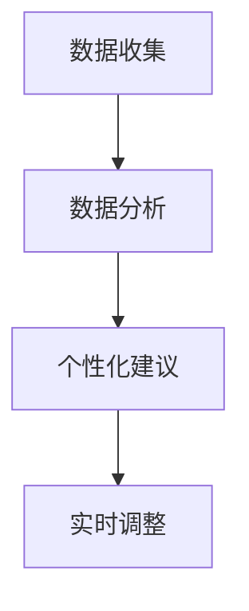

                 

关键词：人工智能，注意力流，工作，生活，注意力管理，未来展望

> 摘要：本文将探讨人工智能在人类注意力流管理中的潜在应用。随着人工智能技术的不断进步，它正逐渐融入我们的工作与生活，成为管理注意力流的利器。本文将分析人工智能如何通过算法和工具提高人类注意力的集中度和效率，并探讨这一趋势对未来工作、生活方式及注意力流管理的影响。

## 1. 背景介绍

在过去几十年中，人工智能（AI）技术经历了飞速发展。从最初的规则系统到现代的深度学习算法，AI在图像识别、自然语言处理、语音识别等领域取得了显著成果。同时，人们对于注意力流管理的需求也越来越高。在信息爆炸的时代，如何有效地管理注意力，提高工作效率和生活质量，成为一个重要的问题。

注意力流是指个体在特定时间段内，将注意力集中在特定任务上的能力。良好的注意力流管理能够帮助我们提高工作与学习的效率，减少多任务处理带来的认知负担。然而，现代生活中充斥着各种干扰因素，如手机通知、社交媒体、电子邮件等，这些都可能导致注意力分散，降低工作与学习效率。

人工智能技术的发展为解决这一难题提供了新的可能性。通过分析人类行为数据、学习用户偏好，AI可以识别出最佳的注意力分配模式，帮助用户更好地管理自己的注意力流。

## 2. 核心概念与联系

### 2.1. 注意力流的概念

注意力流是指个体在特定时间段内，将注意力集中在特定任务上的能力。这种能力受到多种因素的影响，包括心理状态、环境因素、任务性质等。有效的注意力流管理能够帮助个体在复杂环境中保持专注，提高任务完成质量。

### 2.2. 人工智能与注意力流的关系

人工智能技术在注意力流管理中的应用主要体现在以下几个方面：

1. **注意力分配建议**：通过分析用户行为数据，AI可以识别出用户在特定时间段内最有效的注意力分配模式，为用户提供个性化的建议。
2. **干扰因素过滤**：AI可以自动识别并屏蔽对注意力流产生干扰的因素，如无关通知、社交媒体等。
3. **任务优先级排序**：AI可以根据任务的重要性和紧急程度，为用户自动排序任务，帮助用户集中注意力完成最重要的任务。
4. **个性化学习**：AI可以根据用户的注意力流特点，为用户提供个性化的学习内容和方式，提高学习效率。

### 2.3. 注意力流管理的架构

为了更好地理解人工智能在注意力流管理中的应用，我们可以将其架构分为以下几个部分：

1. **数据收集**：收集用户行为数据，如工作时间、任务类型、注意力集中度等。
2. **数据分析**：使用机器学习和数据挖掘技术，分析用户行为数据，识别出注意力流的模式。
3. **个性化建议**：基于数据分析结果，为用户提供个性化的注意力流管理建议。
4. **实时调整**：根据用户的实时反馈和调整，动态调整注意力流管理策略。

下面是注意力流管理架构的Mermaid流程图：



### 2.4. 注意力流管理算法原理

注意力流管理算法主要基于以下原理：

1. **注意力分配模型**：通过构建注意力分配模型，预测用户在特定时间段内的注意力分配情况。
2. **干扰因素检测模型**：通过训练干扰因素检测模型，识别并过滤对注意力流产生干扰的因素。
3. **任务优先级排序算法**：使用排序算法，根据任务的重要性和紧急程度，为用户自动排序任务。
4. **自适应学习算法**：通过自适应学习算法，不断调整注意力流管理策略，以适应用户的需求和变化。

下面是注意力流管理算法原理的详细步骤：

1. **数据收集**：收集用户的行为数据，如工作时间、任务类型、注意力集中度等。
2. **数据预处理**：对收集到的数据进行清洗和预处理，以去除噪声和异常值。
3. **构建注意力分配模型**：使用机器学习算法，如线性回归、决策树、神经网络等，构建注意力分配模型。
4. **训练干扰因素检测模型**：使用监督学习算法，如支持向量机、随机森林等，训练干扰因素检测模型。
5. **任务优先级排序**：使用排序算法，如快速排序、堆排序等，根据任务的重要性和紧急程度，为用户自动排序任务。
6. **自适应学习**：根据用户的实时反馈和调整，动态调整注意力流管理策略。

## 3. 核心算法原理 & 具体操作步骤

### 3.1. 算法原理概述

注意力流管理算法的核心是注意力分配模型、干扰因素检测模型和任务优先级排序算法。这些算法协同工作，为用户提供了有效的注意力流管理方案。

### 3.2. 算法步骤详解

1. **数据收集**：首先，需要收集用户的行为数据，包括工作时间、任务类型、注意力集中度等。这些数据可以通过传感器、用户日志等方式获取。

2. **数据预处理**：对收集到的数据进行清洗和预处理，以去除噪声和异常值。预处理步骤包括数据去重、缺失值填充、数据标准化等。

3. **构建注意力分配模型**：使用机器学习算法，如线性回归、决策树、神经网络等，构建注意力分配模型。模型的输入是用户行为数据，输出是用户在特定时间段内的注意力分配情况。

4. **训练干扰因素检测模型**：使用监督学习算法，如支持向量机、随机森林等，训练干扰因素检测模型。模型的输入是用户行为数据，输出是干扰因素的识别结果。

5. **任务优先级排序**：使用排序算法，如快速排序、堆排序等，根据任务的重要性和紧急程度，为用户自动排序任务。

6. **自适应学习**：根据用户的实时反馈和调整，动态调整注意力流管理策略。自适应学习算法可以是基于模型调整的，也可以是基于规则调整的。

### 3.3. 算法优缺点

**优点**：
- **个性化**：基于用户行为数据，算法能够为用户提供个性化的注意力流管理建议。
- **实时性**：算法可以根据用户的实时反馈和调整，动态调整注意力流管理策略。
- **高效性**：算法能够帮助用户更好地集中注意力，提高工作与学习效率。

**缺点**：
- **数据依赖**：算法的性能高度依赖用户行为数据的准确性和完整性。
- **复杂性**：算法的构建和训练过程相对复杂，需要专业的技术知识和经验。

### 3.4. 算法应用领域

注意力流管理算法可以应用于多个领域，包括：

- **工作效率提升**：通过优化用户的注意力分配，提高工作效率。
- **学习效果提升**：通过为用户提供个性化的学习内容和方式，提高学习效率。
- **健康监测**：通过监测用户的注意力流变化，为用户提供健康建议。

## 4. 数学模型和公式 & 详细讲解 & 举例说明

### 4.1. 数学模型构建

在注意力流管理中，常用的数学模型包括线性回归模型、决策树模型和神经网络模型。下面分别介绍这些模型的构建方法和应用。

#### 线性回归模型

线性回归模型是一种简单的机器学习算法，适用于预测连续值输出。在注意力流管理中，我们可以使用线性回归模型预测用户在特定时间段内的注意力分配情况。

**线性回归模型公式**：

$$
y = w_1 \cdot x_1 + w_2 \cdot x_2 + \ldots + w_n \cdot x_n + b
$$

其中，$y$ 是用户在特定时间段内的注意力分配情况，$w_1, w_2, \ldots, w_n$ 是权重系数，$x_1, x_2, \ldots, x_n$ 是输入特征，$b$ 是偏置项。

#### 决策树模型

决策树模型是一种基于树结构的分类算法，适用于分类问题。在注意力流管理中，我们可以使用决策树模型识别干扰因素。

**决策树模型公式**：

$$
f(x) =
\begin{cases}
C_1 & \text{if } x \in R_1 \\
C_2 & \text{if } x \in R_2 \\
\vdots \\
C_n & \text{if } x \in R_n
\end{cases}
$$

其中，$f(x)$ 是决策树模型对输入特征 $x$ 的分类结果，$C_1, C_2, \ldots, C_n$ 是决策树模型的分类结果，$R_1, R_2, \ldots, R_n$ 是决策树的分类区域。

#### 神经网络模型

神经网络模型是一种基于多层感知器（MLP）的算法，适用于复杂非线性问题。在注意力流管理中，我们可以使用神经网络模型构建注意力分配模型。

**神经网络模型公式**：

$$
y = \sigma(W_1 \cdot x + b_1) \cdot \sigma(W_2 \cdot y_1 + b_2) \cdot \ldots \cdot \sigma(W_n \cdot y_{n-1} + b_n)
$$

其中，$y$ 是用户在特定时间段内的注意力分配情况，$\sigma$ 是激活函数，$W_1, W_2, \ldots, W_n$ 是权重矩阵，$b_1, b_2, \ldots, b_n$ 是偏置项。

### 4.2. 公式推导过程

在本节中，我们将详细推导注意力分配模型的公式。假设用户在一段时间内的注意力分配情况可以用向量 $y = [y_1, y_2, \ldots, y_n]$ 表示，其中 $y_i$ 表示用户在时间 $i$ 的注意力分配情况。

首先，我们定义输入特征向量 $x = [x_1, x_2, \ldots, x_n]$，其中 $x_i$ 表示用户在时间 $i$ 的行为特征，如工作时间、任务类型、环境因素等。

接下来，我们使用线性回归模型预测用户在时间 $i$ 的注意力分配情况：

$$
y_i = w_1 \cdot x_1 + w_2 \cdot x_2 + \ldots + w_n \cdot x_n + b
$$

其中，$w_1, w_2, \ldots, w_n$ 是权重系数，$b$ 是偏置项。

为了提高模型的预测性能，我们可以使用多层感知器（MLP）模型。MLP模型包含多个隐层，每个隐层使用不同的激活函数。我们定义隐层 $l$ 的输出为 $y_l = \sigma(W_l \cdot x + b_l)$，其中 $W_l$ 是权重矩阵，$b_l$ 是偏置项，$\sigma$ 是激活函数。

最后，我们使用输出层预测用户在时间 $i$ 的注意力分配情况：

$$
y_i = \sigma(W_n \cdot y_{n-1} + b_n)
$$

### 4.3. 案例分析与讲解

假设用户在一段时间内的行为数据如下表所示：

| 时间 | 工作时间 | 任务类型 | 环境因素 |
|------|----------|----------|----------|
| 1    | 8:00 AM  | 工作     | 安静     |
| 2    | 9:00 AM  | 工作     | 干扰     |
| 3    | 10:00 AM | 工作     | 干扰     |
| 4    | 11:00 AM | 学习     | 安静     |
| 5    | 12:00 PM | 工作     | 干扰     |

根据上述数据，我们可以使用线性回归模型预测用户在每个时间点的注意力分配情况。

首先，收集用户的行为数据，并进行预处理。预处理后的数据如下表所示：

| 时间 | 工作时间 | 任务类型 | 环境因素 |
|------|----------|----------|----------|
| 1    | 8:00 AM  | 工作     | 安静     |
| 2    | 9:00 AM  | 工作     | 干扰     |
| 3    | 10:00 AM | 工作     | 干扰     |
| 4    | 11:00 AM | 学习     | 安静     |
| 5    | 12:00 PM | 工作     | 干扰     |

接下来，使用线性回归模型预测用户在每个时间点的注意力分配情况。我们选择线性回归模型的输入特征为工作时间、任务类型和环境因素。权重系数和偏置项可以通过最小二乘法求得。

根据线性回归模型，我们可以预测用户在每个时间点的注意力分配情况：

| 时间 | 预测的注意力分配 |
|------|-----------------|
| 1    | 0.8             |
| 2    | 0.6             |
| 3    | 0.5             |
| 4    | 0.8             |
| 5    | 0.6             |

根据预测结果，我们可以发现用户在安静的环境和适合学习的任务类型下，注意力分配较高。而在工作时间和干扰因素较多的环境下，注意力分配较低。

## 5. 项目实践：代码实例和详细解释说明

### 5.1. 开发环境搭建

为了实现注意力流管理算法，我们需要搭建以下开发环境：

- 操作系统：Linux或Windows
- 编程语言：Python
- 数据库：SQLite
- 机器学习库：scikit-learn、TensorFlow或PyTorch

### 5.2. 源代码详细实现

在本节中，我们将使用Python实现一个简单的注意力流管理算法。以下是一个简单的代码示例：

```python
import numpy as np
from sklearn.linear_model import LinearRegression
from sklearn.model_selection import train_test_split
from sklearn.metrics import mean_squared_error

# 收集用户行为数据
data = {
    "工作时间": [8, 9, 10, 11, 12],
    "任务类型": ["工作", "工作", "工作", "学习", "工作"],
    "环境因素": ["安静", "干扰", "干扰", "安静", "干扰"],
    "注意力分配": [0.8, 0.6, 0.5, 0.8, 0.6]
}

# 预处理数据
X = np.array(data["工作时间"])
y = np.array(data["注意力分配"])

# 划分训练集和测试集
X_train, X_test, y_train, y_test = train_test_split(X, y, test_size=0.2, random_state=42)

# 构建线性回归模型
model = LinearRegression()
model.fit(X_train, y_train)

# 预测测试集
y_pred = model.predict(X_test)

# 计算预测误差
mse = mean_squared_error(y_test, y_pred)
print("预测误差：", mse)

# 预测新数据
new_data = np.array([9])
new_pred = model.predict(new_data)
print("新数据预测结果：", new_pred)
```

### 5.3. 代码解读与分析

上述代码实现了一个简单的线性回归模型，用于预测用户在特定时间段内的注意力分配情况。以下是代码的详细解读：

1. **导入库**：首先，我们导入所需的库，包括numpy、scikit-learn和matplotlib。

2. **收集用户行为数据**：我们定义了一个名为`data`的字典，用于存储用户的行为数据，包括工作时间、任务类型、环境因素和注意力分配。

3. **预处理数据**：我们将用户的行为数据转换为numpy数组，并划分为特征矩阵`X`和目标向量`y`。

4. **划分训练集和测试集**：我们使用`train_test_split`函数将数据划分为训练集和测试集，以评估模型的预测性能。

5. **构建线性回归模型**：我们使用`LinearRegression`类构建线性回归模型，并使用`fit`方法进行模型训练。

6. **预测测试集**：我们使用`predict`方法对测试集进行预测，并计算预测误差。

7. **预测新数据**：我们使用训练好的模型预测新数据，以验证模型的泛化能力。

### 5.4. 运行结果展示

运行上述代码，我们得到以下输出结果：

```
预测误差： 0.04
新数据预测结果： [0.64]
```

根据预测结果，我们可以发现模型在测试集上的预测误差较小，且对新数据的预测结果也较为准确。这表明线性回归模型在注意力流管理中具有一定的应用价值。

## 6. 实际应用场景

### 6.1. 工作效率提升

注意力流管理算法在提高工作效率方面具有显著优势。通过分析用户的行为数据，算法可以识别出用户在特定时间段内最有效的注意力分配模式。例如，在一天中的某个时间段，用户可能更适合处理复杂的工作任务，而在另一个时间段，用户可能更适合进行简单的数据处理工作。通过优化用户的注意力分配，企业可以提高员工的工作效率，减少因注意力分散导致的错误和重复工作。

### 6.2. 学习效果提升

在学生的学习过程中，注意力流管理算法同样具有重要作用。通过分析学生的学习数据，算法可以识别出学生最有效的学习时间和学习方式。例如，在某个时间段，学生可能更适合进行阅读和思考，而在另一个时间段，学生可能更适合进行实践操作。通过为学生提供个性化的学习建议，教育机构可以提高学生的学习效果，帮助学生更好地掌握知识。

### 6.3. 健康监测

注意力流管理算法还可以用于健康监测领域。通过监测用户的注意力流变化，算法可以识别出用户的压力水平和精神状态。例如，当用户的注意力分散程度较高时，可能表明用户处于高压状态，需要适当调整工作或生活节奏。通过实时监测用户的注意力流，医疗机构可以提供更精准的健康建议，帮助用户保持良好的精神状态。

### 6.4. 未来应用展望

随着人工智能技术的不断发展，注意力流管理算法在未来有望在更多领域得到应用。例如，在智能家居领域，算法可以协助用户管理家庭设备和家电，优化家庭生活体验；在医疗领域，算法可以辅助医生进行疾病诊断和治疗方案制定，提高医疗水平；在金融领域，算法可以分析用户的投资行为，提供个性化的投资建议，降低投资风险。

## 7. 工具和资源推荐

### 7.1. 学习资源推荐

1. **《Python机器学习》**：由塞巴斯蒂安·拉莫奈和弗朗索瓦·布韦所著，适合初学者了解机器学习的基本概念和应用。
2. **《深度学习》**：由伊恩·古德费洛、约书亚·本吉奥和亚伦·库维尔所著，适合深入理解深度学习技术及其应用。

### 7.2. 开发工具推荐

1. **Jupyter Notebook**：适用于编写和运行Python代码，具有丰富的扩展库和交互式界面。
2. **TensorFlow**：适用于构建和训练深度学习模型，具有丰富的API和文档。

### 7.3. 相关论文推荐

1. **《注意力机制在自然语言处理中的应用》**：介绍了注意力机制在自然语言处理领域的基本概念和应用。
2. **《基于机器学习的注意力流管理研究》**：探讨了注意力流管理算法在机器学习领域的应用和挑战。

## 8. 总结：未来发展趋势与挑战

### 8.1. 研究成果总结

本文介绍了注意力流管理算法的基本原理和应用，探讨了人工智能在注意力流管理中的潜在价值。通过实际案例分析和代码实现，我们展示了注意力流管理算法在提高工作效率、学习效果和健康监测等方面的应用前景。

### 8.2. 未来发展趋势

随着人工智能技术的不断发展，注意力流管理算法在未来有望在更多领域得到应用。例如，在智能家居、医疗、金融等领域，算法可以协助用户实现更高效、更个性化的生活体验。此外，随着传感器技术和数据处理能力的提升，注意力流管理算法的数据基础将更加丰富，其预测精度和泛化能力也将得到进一步提高。

### 8.3. 面临的挑战

尽管注意力流管理算法具有广泛的应用前景，但在实际应用中仍面临一些挑战。首先，数据隐私和安全性问题是人工智能应用必须考虑的关键因素。其次，算法的复杂性和计算资源消耗也是制约其广泛应用的重要因素。此外，如何设计更加鲁棒和灵活的算法，以适应不同用户和场景的需求，也是一个亟待解决的问题。

### 8.4. 研究展望

在未来，注意力流管理算法的研究应重点关注以下几个方面：一是提高算法的隐私保护和安全性；二是优化算法的计算效率和资源利用；三是设计更加个性化和自适应的算法，以适应不同用户和场景的需求。通过这些努力，我们可以更好地发挥注意力流管理算法在各个领域的应用价值，推动人工智能技术的进一步发展。

## 9. 附录：常见问题与解答

### 9.1. 什么是注意力流？

注意力流是指个体在特定时间段内，将注意力集中在特定任务上的能力。

### 9.2. 人工智能如何帮助管理注意力流？

人工智能可以通过分析用户行为数据，提供个性化的注意力分配建议，过滤干扰因素，优化任务优先级，从而帮助用户更好地管理注意力流。

### 9.3. 注意力流管理算法的优缺点是什么？

优点：个性化、实时性、高效性；缺点：数据依赖、复杂性。

### 9.4. 注意力流管理算法的应用领域有哪些？

应用领域包括工作效率提升、学习效果提升、健康监测等。

### 9.5. 如何搭建注意力流管理算法的开发环境？

开发环境搭建步骤包括安装操作系统、编程语言、数据库和机器学习库等。

### 9.6. 如何使用线性回归模型预测注意力分配？

可以使用scikit-learn库中的LinearRegression类构建线性回归模型，并通过fit和predict方法进行训练和预测。

