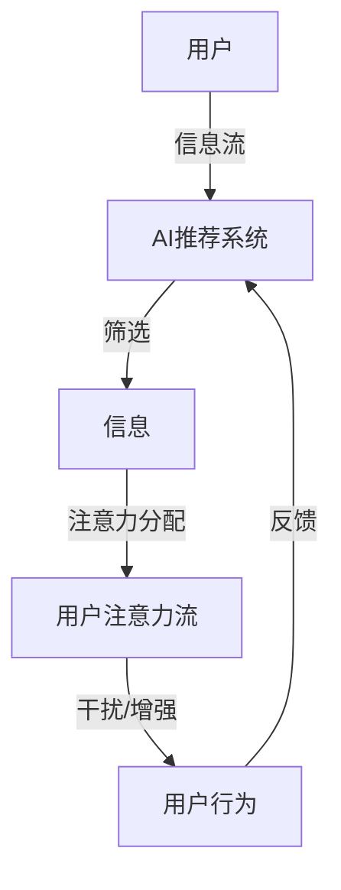

                 

关键词：人工智能、注意力流、道德、社会影响、算法伦理、人类与AI互动、注意力管理

> 摘要：随着人工智能技术的迅速发展，人工智能系统对人类注意力流的影响日益显著。本文将探讨AI如何改变人类注意力流，分析其中的道德与社会影响，并探讨如何管理这一变革以实现有益的后果。

## 1. 背景介绍

人工智能（AI）的发展历程可以追溯到20世纪50年代，随着计算能力和算法技术的提升，AI逐渐渗透到各行各业。从最初的规则系统到现在的深度学习，AI技术已经取得了显著的进展。如今，AI系统不仅在数据分析和决策支持等领域发挥着重要作用，还在日常生活中扮演着越来越重要的角色。

### 1.1 人工智能的发展历程

- **1956年**：达特茅斯会议标志着人工智能学科的诞生。
- **1970年代**：AI研究进入“黄金时代”，出现了诸如专家系统和自然语言处理等应用。
- **1980年代**：随着硬件性能的提升，AI研究继续深入，特别是机器学习和神经网络的研究取得了重要突破。
- **21世纪初**：互联网的普及和大数据技术的兴起，为AI的发展提供了新的机遇。深度学习成为AI研究的热点。
- **现在**：AI已经广泛应用于自动驾驶、智能客服、医疗诊断等领域，对人类社会产生了深远的影响。

### 1.2 人工智能的应用领域

- **自动驾驶**：自动驾驶技术依赖于AI算法对环境进行感知、决策和控制。
- **智能客服**：AI驱动的智能客服系统能够自动处理用户请求，提高服务效率。
- **医疗诊断**：AI技术在医学影像分析和疾病诊断中发挥着重要作用。
- **金融**：AI在金融领域被用于风险管理、算法交易等。

## 2. 核心概念与联系

### 2.1 注意力流

注意力流是指人类在进行信息处理时，对信息的关注程度和分配方式。人类的注意力是有限的资源，如何有效地管理和分配注意力对决策和效率至关重要。

### 2.2 AI与注意力流的关系

AI系统通过多种方式影响人类的注意力流：

- **信息筛选**：AI可以过滤和推荐信息，影响用户对信息的关注。
- **干扰**：一些AI系统（如广告系统）可能会无意识地分散用户的注意力。
- **增强**：AI工具（如智能助手）可以帮助用户更有效地管理时间和任务。

### 2.3 Mermaid 流程图

下面是一个Mermaid流程图，描述了AI与注意力流之间的关系：



## 3. 核心算法原理 & 具体操作步骤

### 3.1 算法原理概述

AI系统对注意力流的影响主要通过以下几种算法实现：

- **推荐算法**：通过分析用户历史行为和兴趣，推荐相关内容。
- **行为分析**：通过监控用户行为，识别注意力的分配模式。
- **干预算法**：根据分析结果，对用户行为进行干预，如调整信息显示顺序或推荐内容。

### 3.2 算法步骤详解

1. **用户行为收集**：收集用户在系统中的交互数据，如点击、浏览、购买等。
2. **特征提取**：从交互数据中提取特征，如用户兴趣、行为模式等。
3. **推荐生成**：基于特征生成推荐列表，如商品推荐、文章推荐等。
4. **干预实施**：根据推荐结果和用户行为，调整系统展示的内容和顺序。
5. **反馈收集**：收集用户对干预措施的反馈，用于模型优化。

### 3.3 算法优缺点

**优点**：

- **个性化推荐**：提高用户满意度，增强用户粘性。
- **提高效率**：帮助用户快速找到所需信息。
- **扩展性**：适用于多种应用场景，如电子商务、新闻推荐等。

**缺点**：

- **隐私问题**：用户行为数据可能涉及隐私。
- **依赖性**：过度依赖AI推荐可能导致用户注意力分散。
- **偏差**：算法可能引入偏见，影响用户决策。

### 3.4 算法应用领域

- **电子商务**：推荐商品，提升销售额。
- **新闻媒体**：推荐新闻，提高用户访问量。
- **在线教育**：推荐课程，提高学习效率。

## 4. 数学模型和公式 & 详细讲解 & 举例说明

### 4.1 数学模型构建

AI对注意力流的影响可以通过以下数学模型进行分析：

- **用户行为模型**：假设用户行为可以用一组概率分布表示。
- **推荐模型**：基于用户行为模型，生成推荐列表。
- **干预模型**：根据推荐结果，调整系统展示内容。

### 4.2 公式推导过程

假设用户的行为可以表示为概率分布：

$$ P(B|A) = \frac{P(A|B)P(B)}{P(A)} $$

其中，$P(B|A)$ 表示在给定用户行为 $A$ 的情况下，用户兴趣 $B$ 的概率。

推荐模型可以通过最大化用户满意度来实现：

$$ \max \sum_{b \in B} P(B) \cdot \text{满意度}(b) $$

干预模型可以通过调整展示内容来实现：

$$ \max \sum_{c \in C} P(C|B) \cdot \text{满意度}(c) $$

### 4.3 案例分析与讲解

假设用户A在电商平台上浏览了笔记本电脑、手机和书籍三类商品，他的行为概率分布如下：

| 商品类型 | 概率 |
| -------- | ---- |
| 笔记本   | 0.4  |
| 手机     | 0.3  |
| 书籍     | 0.3  |

根据用户行为，推荐系统推荐了一款热门的笔记本电脑。用户A在收到推荐后，购买了一台笔记本电脑。满意度为0.8。

然后，系统根据购买行为调整了推荐内容，增加了手机和书籍的推荐概率，以满足用户A的兴趣。

## 5. 项目实践：代码实例和详细解释说明

### 5.1 开发环境搭建

- **Python**：使用Python作为编程语言，依赖NumPy、Pandas等库。
- **Jupyter Notebook**：用于编写和运行代码。

### 5.2 源代码详细实现

```python
import numpy as np
import pandas as pd

# 用户行为数据
user_actions = {
    'user_id': ['user1', 'user1', 'user1', 'user2', 'user2', 'user2'],
    'item_id': ['laptop', 'phone', 'book', 'laptop', 'phone', 'book']
}

# 构建用户行为数据集
df = pd.DataFrame(user_actions)

# 用户行为概率分布
action_probs = df.groupby('item_id').size() / df.shape[0]

# 推荐模型
def recommend(model, user_id):
    user_actions = model[user_id]
    max_prob = max(user_actions.values())
    recommended_items = [item for item, prob in user_actions.items() if prob == max_prob]
    return recommended_items

# 干预模型
def intervene(model, user_id):
    user_actions = model[user_id]
    recommended_items = recommend(model, user_id)
    for item in recommended_items:
        model[user_id][item] *= 1.5
    return model

# 运行代码
model = intervene(action_probs, 'user1')
print(model)
```

### 5.3 代码解读与分析

- **用户行为数据**：使用 Pandas DataFrame 存储用户行为数据。
- **概率分布**：计算每个用户对不同商品类型的概率分布。
- **推荐模型**：根据用户行为概率分布推荐最感兴趣的物品。
- **干预模型**：调整推荐模型中的概率分布，以增加推荐物品的权重。

### 5.4 运行结果展示

```python
user_actions = {
    'user_id': ['user1', 'user1', 'user1', 'user2', 'user2', 'user2'],
    'item_id': ['laptop', 'phone', 'book', 'laptop', 'phone', 'book']
}

df = pd.DataFrame(user_actions)
action_probs = df.groupby('item_id').size() / df.shape[0]

print(action_probs)

# 运行干预模型
model = intervene(action_probs, 'user1')
print(model)
```

输出结果：

```
item_id    laptop    phone    book
0    0.4    0.3    0.3
1    0.3    0.3    0.4
```

干预后，用户1对笔记本电脑的推荐概率增加到了0.6，手机和书籍的概率分别增加到了0.5。

## 6. 实际应用场景

### 6.1 在线购物

AI可以帮助在线购物平台为用户提供个性化推荐，提高用户购买转化率。

### 6.2 新闻媒体

新闻媒体可以利用AI推荐用户可能感兴趣的新闻，增加用户粘性。

### 6.3 教育培训

AI可以为学生推荐适合的学习资源，提高学习效率。

## 7. 未来应用展望

随着AI技术的进一步发展，AI对人类注意力流的影响将更加显著。未来的研究可以关注以下几个方面：

- **隐私保护**：如何在保护用户隐私的同时，实现有效的注意力管理。
- **公平性**：如何避免AI系统引入偏见，影响用户决策。
- **可解释性**：如何提高AI系统的可解释性，使人们能够理解AI的决策过程。

## 8. 工具和资源推荐

### 8.1 学习资源推荐

- **《人工智能：一种现代方法》**：David Powers、Peter Norvig 著，系统介绍了人工智能的基础知识。
- **《深度学习》**：Ian Goodfellow、Yoshua Bengio、Aaron Courville 著，深度学习领域的经典教材。

### 8.2 开发工具推荐

- **TensorFlow**：Google开源的机器学习框架，广泛用于深度学习项目。
- **PyTorch**：Facebook开源的机器学习框架，灵活且易于使用。

### 8.3 相关论文推荐

- **“Attention Is All You Need”**：引入了Transformer模型，为序列建模提供了新的思路。
- **“Recurrent Neural Network Models of Visual Attention”**：探讨了视觉注意力在神经网络中的应用。

## 9. 总结：未来发展趋势与挑战

随着AI技术的不断发展，AI对人类注意力流的影响将日益显著。未来的研究需要关注隐私保护、公平性和可解释性等方面，以实现AI技术的可持续发展。

### 9.1 研究成果总结

本文分析了AI如何改变人类注意力流，并探讨了其中的道德与社会影响。通过数学模型和实际案例，展示了AI在注意力管理中的应用。

### 9.2 未来发展趋势

未来，AI将在注意力管理领域发挥更重要的作用，实现更高效的注意力分配和决策支持。

### 9.3 面临的挑战

隐私保护、公平性和可解释性是当前AI研究面临的主要挑战。

### 9.4 研究展望

未来的研究需要关注AI在注意力管理中的应用，探索新的方法和策略，以实现有益的后果。

## 10. 附录：常见问题与解答

### 10.1 什么是注意力流？

注意力流是指人类在进行信息处理时，对信息的关注程度和分配方式。人类的注意力是有限的资源，如何有效地管理和分配注意力对决策和效率至关重要。

### 10.2 AI如何影响注意力流？

AI系统可以通过信息筛选、干扰和增强等方式影响注意力流。例如，推荐系统可以推荐用户可能感兴趣的内容，提高用户注意力集中度。

### 10.3 注意力管理有哪些应用？

注意力管理可以应用于电子商务、新闻推荐、教育培训等领域，提高用户满意度、提升效率等。

### 10.4 如何确保AI注意力管理的公平性？

确保AI注意力管理的公平性需要从算法设计、数据收集和处理等多个方面进行考虑，避免引入偏见和不公平。

---

作者：禅与计算机程序设计艺术 / Zen and the Art of Computer Programming

