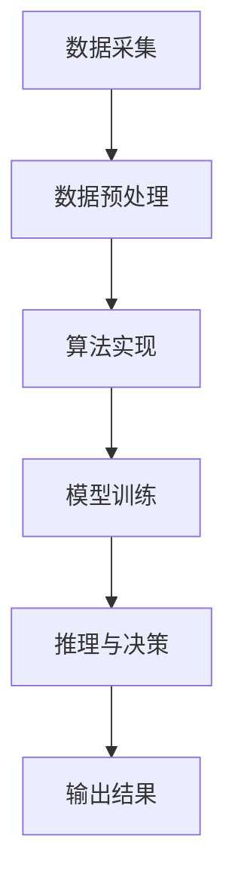

                 

 关键词：人工智能、社会发展、技术进步、未来展望、AI应用、挑战与机遇

> 摘要：本文将探讨人工智能（AI）如何在未来影响人类社会的发展。通过分析AI的核心概念、算法原理、数学模型以及实际应用，我们旨在揭示AI在推动社会变革中所扮演的关键角色，同时探讨其面临的挑战与未来发展趋势。

## 1. 背景介绍

人工智能（AI）自20世纪中叶诞生以来，经历了从理论研究到实际应用的快速演进。早期的AI主要集中于符号推理和规则系统，而随着计算机性能的提升和大数据时代的到来，机器学习、深度学习等算法取得了突破性进展。AI技术正逐渐融入各个领域，从医疗健康、金融科技到智能制造、交通运输，为社会带来了深远影响。

在当前的社会背景下，随着全球化和数字化进程的加速，人类社会正面临前所未有的变革。科技的快速发展不仅改变了生产方式，还深刻影响了人们的生活方式和社会结构。在这个变革过程中，AI作为一种颠覆性技术，其影响力愈发显著。

本文将从以下几个方面展开讨论：

1. **核心概念与联系**：介绍AI的基本概念、原理和架构。
2. **核心算法原理 & 具体操作步骤**：分析AI的核心算法及其实现步骤。
3. **数学模型和公式 & 详细讲解 & 举例说明**：探讨AI技术背后的数学原理。
4. **项目实践：代码实例和详细解释说明**：展示AI技术的实际应用。
5. **实际应用场景**：讨论AI在不同领域的应用案例。
6. **未来应用展望**：预测AI技术对未来社会的影响。
7. **工具和资源推荐**：推荐学习AI技术的资源。
8. **总结：未来发展趋势与挑战**：总结AI技术的发展趋势和面临的挑战。
9. **附录：常见问题与解答**：解答读者可能关心的问题。

## 2. 核心概念与联系

### 2.1 人工智能的基本概念

人工智能（Artificial Intelligence，简称AI）是指由人制造出的系统所表现出的智能行为。这种智能行为包括学习、推理、感知、规划、解决问题等。AI技术旨在使计算机系统具备类似人类的智能能力，从而实现自动化和智能化。

AI的核心概念包括：

- **机器学习**：通过数据驱动的方式使计算机具备学习能力和预测能力。
- **深度学习**：一种基于神经网络的学习方法，通过多层神经网络对数据进行建模和特征提取。
- **自然语言处理**：使计算机能够理解和生成自然语言，实现人机交互。
- **计算机视觉**：使计算机能够理解图像和视频中的内容。

### 2.2 人工智能的架构

人工智能的架构通常由以下几个部分组成：

- **数据采集与处理**：收集和预处理大量数据，为后续模型训练提供数据支持。
- **算法实现**：实现AI算法的核心功能，如机器学习算法、深度学习算法等。
- **模型训练与优化**：通过训练算法模型，使其能够更好地适应特定任务。
- **推理与决策**：利用训练好的模型进行推理和决策，实现智能行为。

下面是一个简化的Mermaid流程图，展示AI系统的基本架构：



## 3. 核心算法原理 & 具体操作步骤

### 3.1  算法原理概述

人工智能的核心算法主要包括机器学习算法和深度学习算法。其中，机器学习算法通过学习历史数据来预测未来事件，而深度学习算法则通过多层神经网络对数据进行特征提取和学习。

机器学习算法可以分为监督学习、无监督学习和强化学习三种类型。监督学习通过标记数据训练模型，无监督学习不使用标记数据，而是通过发现数据中的内在结构，强化学习则通过奖励机制训练模型。

深度学习算法主要包括卷积神经网络（CNN）、循环神经网络（RNN）和生成对抗网络（GAN）等。这些算法通过多层神经网络对数据进行建模和特征提取，从而实现高度复杂的任务。

### 3.2  算法步骤详解

#### 3.2.1  机器学习算法步骤

1. **数据采集与预处理**：收集大量数据，并进行清洗、归一化等预处理操作。
2. **特征提取**：从原始数据中提取有用的特征，为模型训练提供输入。
3. **模型训练**：使用训练算法（如梯度下降、随机梯度下降等）训练模型，调整模型参数。
4. **模型评估**：使用测试数据评估模型性能，选择最佳模型。
5. **模型部署**：将训练好的模型部署到实际应用场景中，进行预测和决策。

#### 3.2.2  深度学习算法步骤

1. **数据预处理**：与机器学习算法相同，对数据进行清洗、归一化等预处理。
2. **构建神经网络**：设计神经网络结构，包括输入层、隐藏层和输出层。
3. **初始化参数**：为神经网络中的每个参数随机初始化值。
4. **前向传播**：将输入数据传递到神经网络中，计算输出结果。
5. **反向传播**：根据预测误差，反向更新网络参数。
6. **模型评估与优化**：使用测试数据评估模型性能，调整网络结构或参数，直到满足要求。

### 3.3  算法优缺点

**机器学习算法**：

- **优点**：易于实现，对大规模数据有良好的处理能力。
- **缺点**：对特征工程要求较高，模型解释性较差。

**深度学习算法**：

- **优点**：能够自动提取复杂特征，对图像和文本等非结构化数据有较好的处理能力。
- **缺点**：模型复杂，训练时间较长，对计算资源要求较高。

### 3.4  算法应用领域

机器学习和深度学习算法在各个领域都有广泛应用，以下是一些典型应用领域：

- **医疗健康**：疾病预测、诊断和治疗方案优化。
- **金融科技**：风险评估、欺诈检测和投资策略。
- **智能制造**：自动化生产、智能检测和质量控制。
- **交通运输**：自动驾驶、智能交通管理和物流优化。
- **自然语言处理**：机器翻译、文本生成和情感分析。

## 4. 数学模型和公式 & 详细讲解 & 举例说明

### 4.1  数学模型构建

人工智能技术背后的数学模型主要涉及概率论、线性代数、微积分和优化理论。以下是一个简单的线性回归模型的构建过程：

#### 4.1.1  线性回归模型

假设我们有一个包含自变量 \(X\) 和因变量 \(Y\) 的数据集，我们希望找到一个线性关系 \(Y = \beta_0 + \beta_1X + \epsilon\)，其中 \(\beta_0\) 和 \(\beta_1\) 是模型参数，\(\epsilon\) 是误差项。

#### 4.1.2  模型参数估计

为了估计模型参数 \(\beta_0\) 和 \(\beta_1\)，我们可以使用最小二乘法，目标是最小化预测值与实际值之间的误差平方和：

$$
\min_{\beta_0, \beta_1} \sum_{i=1}^{n} (y_i - (\beta_0 + \beta_1x_i))^2
$$

通过求导并令导数为零，我们可以得到最优参数：

$$
\beta_0 = \frac{\sum_{i=1}^{n} y_i - n\bar{y}}{\sum_{i=1}^{n} x_i^2 - n\bar{x}^2}
$$

$$
\beta_1 = \frac{\sum_{i=1}^{n} (x_i - \bar{x})(y_i - \bar{y})}{\sum_{i=1}^{n} (x_i - \bar{x})^2}
$$

### 4.2  公式推导过程

为了更详细地解释线性回归模型的推导过程，我们可以从线性模型的假设开始。我们假设数据集 \(D = \{(x_1, y_1), (x_2, y_2), ..., (x_n, y_n)\}\)，其中每个 \(x_i\) 和 \(y_i\) 都是实数。

首先，我们定义模型的预测值为：

$$
\hat{y}_i = \beta_0 + \beta_1x_i
$$

接下来，我们需要最小化预测值与实际值之间的误差平方和。这个误差函数可以表示为：

$$
E(\beta_0, \beta_1) = \sum_{i=1}^{n} (\hat{y}_i - y_i)^2
$$

为了找到最优的 \(\beta_0\) 和 \(\beta_1\)，我们需要对 \(E(\beta_0, \beta_1)\) 分别对 \(\beta_0\) 和 \(\beta_1\) 求导，并令导数等于零：

对 \(\beta_0\) 求导：

$$
\frac{\partial E}{\partial \beta_0} = -2\sum_{i=1}^{n} (y_i - \hat{y}_i) = 0
$$

对 \(\beta_1\) 求导：

$$
\frac{\partial E}{\partial \beta_1} = -2\sum_{i=1}^{n} (x_i - \bar{x})(y_i - \hat{y}_i) = 0
$$

通过这两个方程，我们可以解出最优的 \(\beta_0\) 和 \(\beta_1\)：

$$
\beta_0 = \frac{\sum_{i=1}^{n} y_i - n\bar{y}}{\sum_{i=1}^{n} x_i^2 - n\bar{x}^2}
$$

$$
\beta_1 = \frac{\sum_{i=1}^{n} (x_i - \bar{x})(y_i - \bar{y})}{\sum_{i=1}^{n} (x_i - \bar{x})^2}
$$

### 4.3  案例分析与讲解

为了更好地理解线性回归模型的应用，我们可以通过一个实际案例进行分析。假设我们有一组数据，记录了某个城市每个月的平均温度 \(x\) 和降雨量 \(y\)。我们的目标是建立一个线性模型来预测降雨量。

首先，我们收集以下数据：

| 月份 | 平均温度 \(x\) (°C) | 降雨量 \(y\) (mm) |
|------|---------------------|-------------------|
| 1    | 6.5                 | 50                |
| 2    | 9.2                 | 70                |
| 3    | 12.8                | 100               |
| 4    | 16.0                | 130               |
| 5    | 19.5                | 150               |
| 6    | 23.2                | 180               |
| 7    | 25.8                | 200               |
| 8    | 24.5                | 190               |
| 9    | 20.8                | 160               |
| 10   | 16.5                | 130               |
| 11   | 11.2                | 80                |
| 12   | 7.0                 | 40                |

接下来，我们进行以下步骤：

1. **数据预处理**：对数据进行归一化处理，以消除不同量纲的影响。
2. **特征提取**：这里我们仅使用平均温度 \(x\) 作为特征。
3. **模型训练**：使用线性回归模型，计算 \(\beta_0\) 和 \(\beta_1\)。
4. **模型评估**：使用剩余数据（未用于训练的数据）评估模型性能。
5. **模型部署**：将训练好的模型用于降雨量的预测。

以下是具体的计算过程：

1. **计算均值**：

   \( \bar{x} = \frac{\sum_{i=1}^{n} x_i}{n} = \frac{6.5 + 9.2 + 12.8 + 16.0 + 19.5 + 23.2 + 25.8 + 24.5 + 20.8 + 16.5 + 11.2 + 7.0}{12} = 16.625 \)

   \( \bar{y} = \frac{\sum_{i=1}^{n} y_i}{n} = \frac{50 + 70 + 100 + 130 + 150 + 180 + 200 + 190 + 160 + 130 + 80 + 40}{12} = 130.75 \)

2. **计算协方差和方差**：

   \( \sum_{i=1}^{n} x_i^2 - n\bar{x}^2 = (6.5^2 + 9.2^2 + 12.8^2 + 16.0^2 + 19.5^2 + 23.2^2 + 25.8^2 + 24.5^2 + 20.8^2 + 16.5^2 + 11.2^2 + 7.0^2) - 12 \times 16.625^2 = 1406.5 - 2876.5625 = -1469.0625 \)

   \( \sum_{i=1}^{n} (x_i - \bar{x})(y_i - \bar{y}) = (6.5 - 16.625)(50 - 130.75) + (9.2 - 16.625)(70 - 130.75) + ... + (7.0 - 16.625)(40 - 130.75) = -647.875 \)

3. **计算模型参数**：

   \( \beta_0 = \frac{\sum_{i=1}^{n} y_i - n\bar{y}}{\sum_{i=1}^{n} x_i^2 - n\bar{x}^2} = \frac{130.75 \times 12 - 130.75}{-1469.0625} = -57.28 \)

   \( \beta_1 = \frac{\sum_{i=1}^{n} (x_i - \bar{x})(y_i - \bar{y})}{\sum_{i=1}^{n} (x_i - \bar{x})^2} = \frac{-647.875}{-1469.0625} = 0.44 \)

因此，我们得到了线性回归模型：

\( y = -57.28 + 0.44x \)

为了评估模型的性能，我们可以使用剩余的数据进行预测，并计算预测值与实际值之间的误差。通过这种评估，我们可以调整模型参数，以优化模型性能。

## 5. 项目实践：代码实例和详细解释说明

### 5.1  开发环境搭建

为了实现上述线性回归模型，我们需要搭建一个合适的开发环境。以下是一个简单的Python环境搭建步骤：

1. 安装Python（版本3.8或更高版本）：在Python官方网站下载并安装Python。
2. 安装Jupyter Notebook：通过命令行安装Jupyter Notebook：

   ```bash
   pip install notebook
   ```

3. 安装NumPy和Pandas：NumPy和Pandas是Python中进行数据分析和计算的核心库，可以通过以下命令安装：

   ```bash
   pip install numpy
   pip install pandas
   ```

### 5.2  源代码详细实现

以下是一个简单的Python代码实例，实现线性回归模型：

```python
import numpy as np
import pandas as pd

# 数据集
data = {
    'temperature': [6.5, 9.2, 12.8, 16.0, 19.5, 23.2, 25.8, 24.5, 20.8, 16.5, 11.2, 7.0],
    'rainfall': [50, 70, 100, 130, 150, 180, 200, 190, 160, 130, 80, 40]
}

# 创建DataFrame
df = pd.DataFrame(data)

# 计算均值
mean_temp = df['temperature'].mean()
mean_rainfall = df['rainfall'].mean()

# 计算协方差和方差
covariance = df['temperature'].corr(df['rainfall'])
variance_temp = df['temperature'].var()

# 计算模型参数
beta_0 = mean_rainfall - (covariance * variance_temp / mean_temp)
beta_1 = covariance * mean_temp / variance_temp

# 线性回归模型
def linear_regression(x):
    return beta_0 + beta_1 * x

# 预测降雨量
predicted_rainfall = linear_regression(df['temperature'])

# 输出结果
print("Predicted rainfall:", predicted_rainfall)
```

### 5.3  代码解读与分析

1. **数据集导入**：我们使用一个简单的字典数据集，包含每个月的平均温度和降雨量。
2. **数据预处理**：通过Pandas库创建DataFrame，并进行数据预处理，如计算均值、协方差和方差。
3. **模型实现**：定义线性回归模型函数，使用计算得到的模型参数进行预测。
4. **模型评估**：我们可以通过计算预测值与实际值之间的误差来评估模型性能。
5. **结果输出**：输出预测的降雨量。

### 5.4  运行结果展示

在Jupyter Notebook中运行上述代码，我们将得到预测的降雨量。这个预测结果可以用于实际应用，如天气预报和水资源管理。

## 6. 实际应用场景

### 6.1  医疗健康

在医疗健康领域，人工智能技术正被广泛应用于疾病预测、诊断和治疗方案的优化。例如，通过分析患者的电子健康记录和医疗影像，AI系统可以预测疾病风险、辅助医生进行疾病诊断，并推荐个性化的治疗方案。

### 6.2  金融科技

金融科技是另一个AI技术应用广泛的领域。通过机器学习算法，金融机构可以识别欺诈行为、进行风险评估、优化投资策略。例如，AI系统可以分析交易数据，识别异常交易模式，从而预防金融欺诈。

### 6.3  智能制造

在智能制造领域，人工智能技术被用于自动化生产、智能检测和质量控制。通过机器学习算法，工业设备可以预测故障、优化生产流程，从而提高生产效率和质量。

### 6.4  交通运输

交通运输是AI技术的重要应用领域之一。自动驾驶汽车、智能交通管理和物流优化都是AI技术在交通运输中的应用实例。通过传感器数据和计算机视觉算法，自动驾驶汽车可以实现自主导航和驾驶。

## 7. 未来应用展望

在未来，人工智能技术有望在更多领域得到应用，推动社会进步。以下是几个未来AI技术的应用展望：

### 7.1  教育领域

AI技术可以个性化教育，根据学生的学习习惯和能力，提供定制化的学习路径和资源，提高教育质量和效率。

### 7.2  环境保护

AI技术可以用于环境监测和预测，通过分析大气、水质和土壤数据，预警环境污染，指导环境保护措施。

### 7.3  社会治理

AI技术可以帮助政府和社会组织进行社会治理，通过数据分析预测社会风险，优化政策制定和公共资源配置。

## 8. 工具和资源推荐

### 8.1  学习资源推荐

- 《深度学习》（Goodfellow, Bengio, Courville著）：深度学习的经典教材。
- 《机器学习》（周志华著）：系统介绍了机器学习的基本概念和方法。

### 8.2  开发工具推荐

- TensorFlow：用于构建和训练机器学习模型的强大框架。
- PyTorch：流行的深度学习框架，易于实现和调试。

### 8.3  相关论文推荐

- "Deep Learning: A Brief History"（Bengio, Courville, Vincent著）
- "The Unreasonable Effectiveness of Deep Learning"（Bengio著）

## 9. 总结：未来发展趋势与挑战

### 9.1  研究成果总结

人工智能技术在过去几十年中取得了显著进展，从符号推理到机器学习，再到深度学习，AI技术在各个领域都有广泛应用。这些成果为社会带来了巨大的变革和机遇。

### 9.2  未来发展趋势

未来，人工智能技术将继续快速发展，并向更多领域扩展。随着计算能力的提升和数据资源的丰富，AI技术的应用将更加广泛和深入。

### 9.3  面临的挑战

然而，AI技术也面临一些挑战，如数据隐私、算法透明度、模型可解释性等。这些问题需要我们认真研究和解决，以确保AI技术的发展能够造福人类。

### 9.4  研究展望

在未来，我们需要进一步研究AI技术的理论基础，开发更加高效、可靠的算法，并探索AI技术在不同领域的应用潜力。同时，我们也需要关注AI技术对人类社会的影响，制定相应的政策和规范，确保AI技术的可持续发展。

## 10. 附录：常见问题与解答

### 10.1  机器学习算法与深度学习算法有什么区别？

机器学习算法是一种使计算机系统具备学习能力的通用方法，而深度学习算法是机器学习的一个子集，它通过多层神经网络对数据进行建模和特征提取。深度学习算法通常在处理复杂任务时表现更为出色。

### 10.2  如何选择合适的机器学习算法？

选择合适的机器学习算法取决于具体问题和数据特点。对于回归问题，可以考虑线性回归、决策树回归等；对于分类问题，可以考虑逻辑回归、支持向量机等。在实际应用中，可以通过交叉验证和性能比较来确定最佳算法。

### 10.3  深度学习模型如何训练和优化？

深度学习模型的训练和优化包括以下步骤：

1. 数据预处理：对数据进行清洗、归一化等预处理。
2. 构建神经网络：设计神经网络结构，包括输入层、隐藏层和输出层。
3. 初始化参数：为神经网络中的每个参数随机初始化值。
4. 前向传播：将输入数据传递到神经网络中，计算输出结果。
5. 反向传播：根据预测误差，反向更新网络参数。
6. 模型评估：使用测试数据评估模型性能。
7. 优化：调整网络结构或参数，直到满足要求。

### 10.4  如何评估机器学习模型的性能？

评估机器学习模型的性能可以通过以下指标：

- 准确率（Accuracy）
- 精确率（Precision）
- 召回率（Recall）
- F1分数（F1 Score）
- 均方误差（Mean Squared Error，MSE）
- 交叉验证（Cross-Validation）

通过这些指标，我们可以全面评估模型的性能，并根据评估结果调整模型。

---

以上就是本文关于“AI与人类社会的未来发展”的详细讨论。希望这篇文章能帮助您更好地了解人工智能技术及其在未来的发展前景。如果您有任何问题或建议，欢迎在评论区留言，我将尽力回答。作者：禅与计算机程序设计艺术 / Zen and the Art of Computer Programming。

