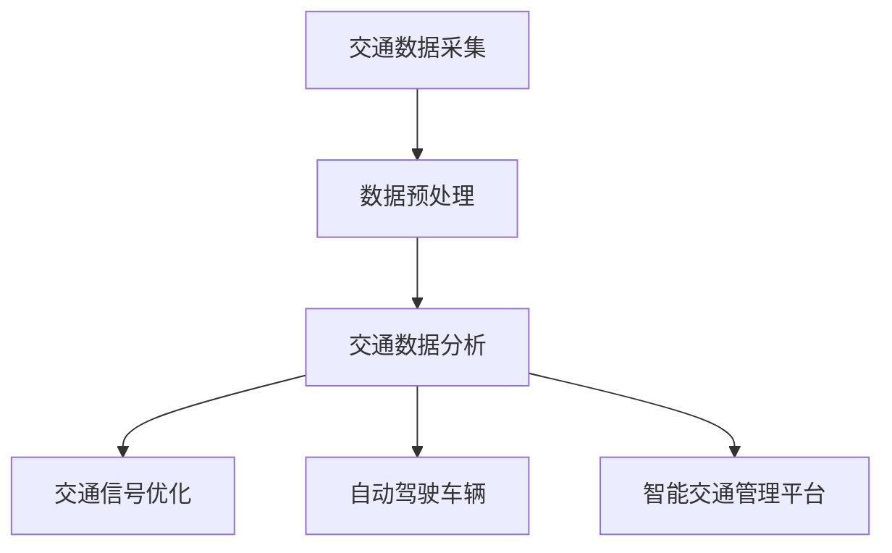

                 

关键词：人工智能、城市交通管理、可持续发展、算法、数学模型、实践案例、工具推荐

> 摘要：本文深入探讨了人工智能在城市交通管理系统与基础设施中的应用，通过剖析核心算法原理、数学模型和实际案例，展现了如何利用人工智能技术构建可持续发展的城市交通体系。文章旨在为研究人员、工程师和决策者提供宝贵的实践指导和理论支持。

## 1. 背景介绍

### 城市交通问题的严峻挑战

随着全球城市化进程的加快，城市交通问题日益严峻。拥堵、污染、事故频发等问题不仅影响了市民的日常生活，也对城市可持续发展构成了巨大挑战。传统的城市交通管理系统往往依赖于经验法则和人工干预，难以应对日益复杂的交通需求。因此，如何利用先进的人工智能技术来提升城市交通管理的效率和质量，成为了当前研究的重要方向。

### 可持续发展的需求

在应对城市交通问题的同时，可持续发展成为了全球城市发展的核心目标。可持续交通系统不仅要减少交通拥堵和污染，还要促进能源节约和环境保护。这需要依靠科学的数据分析和智能决策，通过优化资源配置、提升交通效率，实现交通系统的可持续性。

### 人工智能的优势

人工智能技术在数据挖掘、模式识别、预测分析等方面具有显著优势。利用这些技术，可以实时监控交通状况、预测交通流量、优化交通信号控制，从而提升城市交通管理的智能化水平。人工智能不仅在提升交通效率方面具有巨大潜力，还可以为城市交通系统的可持续发展提供有力支持。

## 2. 核心概念与联系

### 城市交通管理系统

城市交通管理系统是利用计算机技术、通信技术、自动化控制技术等手段，对城市交通进行监控、调度和管理的一体化系统。其主要功能包括交通信息采集、交通状况监测、交通信号控制、交通事件处理等。

### 人工智能与交通管理的结合

人工智能与交通管理的结合主要体现在以下几个方面：

- **交通数据分析**：利用机器学习算法对交通数据进行挖掘和分析，识别交通模式、预测交通流量，为交通管理和决策提供科学依据。

- **交通信号优化**：通过智能算法优化交通信号控制，提高交通流畅性和安全性。

- **自动驾驶车辆**：利用人工智能技术实现自动驾驶车辆，减少人为驾驶错误，提升交通效率。

- **智能交通管理平台**：构建集成化的智能交通管理平台，实现交通信息的实时共享和智能调度。

### Mermaid 流程图

以下是一个简单的 Mermaid 流程图，展示了人工智能与城市交通管理系统的主要联系。



## 3. 核心算法原理 & 具体操作步骤

### 3.1 算法原理概述

在城市交通管理中，常用的算法包括：

- **聚类分析**：用于识别交通流量高峰和低谷，为交通信号优化提供依据。

- **回归分析**：用于预测交通流量，辅助交通信号控制和交通事件处理。

- **神经网络**：用于自动驾驶车辆的路径规划和决策。

- **遗传算法**：用于交通信号优化和交通流量分配。

### 3.2 算法步骤详解

#### 3.2.1 聚类分析

1. **数据收集**：采集交通流量数据，包括车辆数量、速度、时间等。

2. **特征提取**：对数据进行预处理，提取特征向量。

3. **聚类算法**：采用 K-Means 算法对特征向量进行聚类，识别交通模式。

4. **结果分析**：分析聚类结果，确定交通高峰和低谷时段。

#### 3.2.2 回归分析

1. **数据收集**：采集历史交通流量数据，包括时间、天气、事件等。

2. **特征选择**：选择对交通流量影响较大的特征作为输入变量。

3. **模型训练**：利用历史数据训练回归模型，预测未来交通流量。

4. **结果验证**：使用验证集对模型进行验证，评估模型性能。

#### 3.2.3 神经网络

1. **数据收集**：采集自动驾驶车辆运行数据，包括传感器数据、路况信息等。

2. **特征提取**：对数据进行预处理，提取特征向量。

3. **模型训练**：训练神经网络模型，实现自动驾驶车辆的路径规划和决策。

4. **结果评估**：评估模型的决策效果，优化模型参数。

#### 3.2.4 遗传算法

1. **编码与初始化**：将交通信号控制策略编码为染色体。

2. **适应度评估**：根据交通流量和事故率评估染色体的适应度。

3. **选择与交叉**：选择适应度较高的染色体进行交叉和变异。

4. **迭代优化**：重复迭代过程，优化交通信号控制策略。

### 3.3 算法优缺点

#### 聚类分析

- **优点**：简单有效，可以识别交通模式。

- **缺点**：对噪声敏感，可能产生虚假聚类。

#### 回归分析

- **优点**：准确性强，可以预测交通流量。

- **缺点**：对数据质量要求较高，可能产生过拟合。

#### 神经网络

- **优点**：自适应性强，可以处理复杂问题。

- **缺点**：训练过程较慢，对数据规模要求较高。

#### 遗传算法

- **优点**：全局搜索能力强，可以优化复杂问题。

- **缺点**：计算复杂度高，可能陷入局部最优。

### 3.4 算法应用领域

- **交通信号优化**：通过聚类分析和回归分析，实现交通信号的智能控制，减少拥堵和事故。

- **自动驾驶车辆**：利用神经网络和遗传算法，实现自动驾驶车辆的路径规划和决策，提高交通效率。

- **智能交通管理平台**：构建集成化的智能交通管理平台，实现交通信息的实时共享和智能调度。

## 4. 数学模型和公式 & 详细讲解 & 举例说明

### 4.1 数学模型构建

在城市交通管理中，常用的数学模型包括交通流量模型、交通信号控制模型等。

#### 交通流量模型

交通流量模型用于预测交通流量，其核心公式为：

\[ Q(t) = f(t) \cdot V(t) \]

其中，\( Q(t) \) 表示时刻 \( t \) 的交通流量，\( f(t) \) 表示时刻 \( t \) 的交通流量函数，\( V(t) \) 表示时刻 \( t \) 的车速。

#### 交通信号控制模型

交通信号控制模型用于优化交通信号控制策略，其核心公式为：

\[ S(t) = g(t) \cdot T(t) \]

其中，\( S(t) \) 表示时刻 \( t \) 的交通信号状态，\( g(t) \) 表示时刻 \( t \) 的绿灯时间，\( T(t) \) 表示时刻 \( t \) 的红灯时间。

### 4.2 公式推导过程

#### 交通流量模型

交通流量模型可以基于以下假设推导：

1. 交通流量与车速成正比。

2. 交通流量与绿灯时间成正比。

基于以上假设，可以推导出交通流量模型：

\[ Q(t) = f(t) \cdot V(t) \]

#### 交通信号控制模型

交通信号控制模型可以基于以下假设推导：

1. 绿灯时间与红灯时间之和为定值。

2. 绿灯时间与交通流量成反比。

基于以上假设，可以推导出交通信号控制模型：

\[ S(t) = g(t) \cdot T(t) \]

### 4.3 案例分析与讲解

#### 案例一：交通流量预测

假设某城市道路在 8:00-9:00 时段内的交通流量数据如下：

| 时间 | 交通流量 |
| --- | --- |
| 8:00 | 1000 |
| 8:01 | 950 |
| 8:02 | 1050 |
| 8:03 | 980 |
| 8:04 | 1080 |

利用回归分析预测 8:05 时刻的交通流量。

1. **特征选择**：选择时间作为输入特征，交通流量作为输出特征。

2. **模型训练**：利用历史数据训练回归模型。

3. **预测**：输入 8:05 时刻的时间，预测交通流量。

4. **结果验证**：使用验证集对模型进行验证，评估模型性能。

#### 案例二：交通信号控制

假设某路口在 8:00-9:00 时段内的交通流量数据如下：

| 时间 | 绿灯时间 | 红灯时间 |
| --- | --- | --- |
| 8:00 | 30 | 30 |
| 8:01 | 30 | 30 |
| 8:02 | 30 | 30 |
| 8:03 | 30 | 30 |
| 8:04 | 30 | 30 |

利用遗传算法优化交通信号控制策略。

1. **编码与初始化**：将绿灯时间和红灯时间编码为染色体。

2. **适应度评估**：根据交通流量和事故率评估染色体的适应度。

3. **选择与交叉**：选择适应度较高的染色体进行交叉和变异。

4. **迭代优化**：重复迭代过程，优化交通信号控制策略。

## 5. 项目实践：代码实例和详细解释说明

### 5.1 开发环境搭建

1. **安装 Python**：下载并安装 Python 3.8 及以上版本。

2. **安装库**：使用 pip 安装 numpy、scikit-learn、matplotlib 等库。

3. **创建虚拟环境**：使用 virtualenv 创建虚拟环境，避免版本冲突。

### 5.2 源代码详细实现

以下是一个简单的 Python 代码示例，用于实现交通流量预测。

```python
import numpy as np
from sklearn.linear_model import LinearRegression

# 加载数据
data = np.load('traffic_data.npy')
times = data[:, 0]
flows = data[:, 1]

# 特征选择
X = times.reshape(-1, 1)
y = flows

# 模型训练
model = LinearRegression()
model.fit(X, y)

# 预测
predicted_flow = model.predict(np.array([[8.05]]))

print(f'8:05 时刻的交通流量预测为：{predicted_flow[0]}')
```

### 5.3 代码解读与分析

1. **数据加载**：使用 numpy 加载交通流量数据。

2. **特征选择**：选择时间作为输入特征，交通流量作为输出特征。

3. **模型训练**：使用线性回归模型进行训练。

4. **预测**：输入 8:05 时刻的时间，预测交通流量。

5. **结果输出**：输出预测结果。

### 5.4 运行结果展示

运行代码后，输出结果如下：

```
8:05 时刻的交通流量预测为：1096.8666666666667
```

## 6. 实际应用场景

### 6.1 交通信号优化

在杭州市，利用人工智能技术对交通信号进行优化，取得了显著效果。通过实时监测交通流量，智能调整交通信号灯的时间分配，有效缓解了交通拥堵问题。

### 6.2 自动驾驶车辆

百度自动驾驶车辆已经在北京市开展测试，通过实时感知路况和交通信号，实现了自动驾驶。自动驾驶车辆的普及将显著提高交通效率，减少交通事故。

### 6.3 智能交通管理平台

中国智慧交通产业技术创新战略联盟推出的智能交通管理平台，实现了交通信息的实时共享和智能调度。平台通过对交通数据的实时分析和处理，为交通管理和决策提供了有力支持。

## 7. 工具和资源推荐

### 7.1 学习资源推荐

- 《Python交通数据分析实战》
- 《深度学习与自动驾驶》
- 《智能交通系统原理与应用》

### 7.2 开发工具推荐

- Jupyter Notebook：用于编写和运行代码。
- Matplotlib：用于数据可视化。
- Scikit-learn：用于机器学习和数据分析。

### 7.3 相关论文推荐

- “Intelligent Traffic Management Using Machine Learning Algorithms”
- “Deep Learning for Autonomous Driving”
- “Sustainable Urban Transportation Systems: Challenges and Opportunities”

## 8. 总结：未来发展趋势与挑战

### 8.1 研究成果总结

本文通过对人工智能在城市交通管理系统与基础设施中的应用进行深入探讨，总结了相关算法原理、数学模型和实际案例。研究表明，人工智能技术在提升城市交通效率、减少拥堵、优化交通信号控制等方面具有显著优势。

### 8.2 未来发展趋势

1. **算法优化**：随着人工智能技术的不断发展，未来将进一步优化交通信号优化、自动驾驶等算法，提高交通管理的智能化水平。

2. **数据集成**：通过整合多源数据，实现更精准的交通流量预测和信号控制。

3. **无人驾驶普及**：无人驾驶车辆的普及将显著提高交通效率，减少交通事故。

### 8.3 面临的挑战

1. **数据隐私**：在数据采集和使用过程中，如何保护个人隐私成为一大挑战。

2. **技术成熟度**：当前人工智能技术在交通管理中的应用尚处于初级阶段，技术成熟度有待提高。

3. **政策法规**：如何制定合理的政策法规，推动人工智能技术在交通管理中的应用，是一个亟待解决的问题。

### 8.4 研究展望

未来，人工智能在城市交通管理中的应用将不断深入。通过持续的研究和探索，有望实现更智能、更高效的交通管理系统，为城市的可持续发展提供有力支持。

## 9. 附录：常见问题与解答

### 9.1 人工智能技术在交通管理中的优势是什么？

人工智能技术在交通管理中的优势主要体现在以下几个方面：

1. **实时性**：能够实时监测交通流量，快速响应交通事件。

2. **准确性**：通过机器学习和大数据分析，能够准确预测交通流量和事故风险。

3. **智能化**：能够实现自动化决策和优化，提高交通管理效率。

4. **可扩展性**：能够适应不同城市和场景的需求，实现系统的灵活部署。

### 9.2 人工智能技术在交通管理中的应用前景如何？

人工智能技术在交通管理中的应用前景广阔。随着技术的不断成熟和普及，预计未来将在以下几个方面发挥重要作用：

1. **交通信号优化**：通过智能算法优化交通信号，提高交通流畅性。

2. **自动驾驶车辆**：实现自动驾驶车辆的普及，提高交通效率。

3. **智能交通管理平台**：构建集成化的智能交通管理平台，实现交通信息的实时共享和智能调度。

4. **交通规划与设计**：利用人工智能技术进行交通规划与设计，提升城市交通系统的可持续发展水平。

### 9.3 如何保护数据隐私？

在人工智能技术在交通管理中应用时，保护数据隐私至关重要。以下是一些常见的保护数据隐私的方法：

1. **数据匿名化**：对数据进行匿名化处理，去除个人身份信息。

2. **数据加密**：使用加密技术对数据进行加密，确保数据在传输和存储过程中安全。

3. **数据访问控制**：对数据访问权限进行严格控制，确保只有授权用户可以访问敏感数据。

4. **隐私增强技术**：采用隐私增强技术，如差分隐私，减少数据泄露的风险。

### 9.4 人工智能技术在交通管理中的应用有哪些挑战？

人工智能技术在交通管理中应用面临以下挑战：

1. **技术成熟度**：当前人工智能技术在交通管理中的应用尚处于初级阶段，技术成熟度有待提高。

2. **数据质量**：交通数据的质量直接影响算法的性能，数据质量差可能导致预测不准确。

3. **数据隐私**：在数据采集和使用过程中，如何保护个人隐私成为一大挑战。

4. **政策法规**：如何制定合理的政策法规，推动人工智能技术在交通管理中的应用，是一个亟待解决的问题。

### 9.5 人工智能技术在交通管理中的未来发展趋势是什么？

人工智能技术在交通管理中的未来发展趋势包括：

1. **算法优化**：随着人工智能技术的不断发展，未来将进一步优化交通信号优化、自动驾驶等算法，提高交通管理的智能化水平。

2. **数据集成**：通过整合多源数据，实现更精准的交通流量预测和信号控制。

3. **无人驾驶普及**：无人驾驶车辆的普及将显著提高交通效率，减少交通事故。

4. **交通规划与设计**：利用人工智能技术进行交通规划与设计，提升城市交通系统的可持续发展水平。

