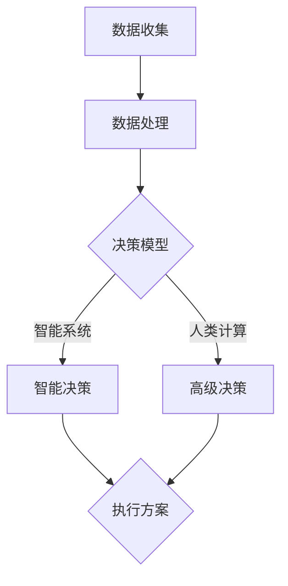

                 

关键词：人工智能，城市生活，可持续发展，计算模型，智能系统，数据驱动，协同进化

> 摘要：本文从人工智能与人类计算的角度出发，探讨了如何在城市生活中实现可持续发展的目标。文章首先介绍了当前城市面临的问题和挑战，然后阐述了人工智能和人类计算在可持续发展中的关键作用，提出了基于协同进化原理的城市生活计算模型，并通过具体案例和项目实践，展示了这一模型在实际应用中的潜力。

## 1. 背景介绍

### 城市生活面临的挑战

随着全球城市化进程的加速，城市生活面临着诸多挑战。人口快速增长、资源有限、环境污染、交通拥堵、住房短缺等问题日益突出。传统的发展模式难以满足日益增长的城市需求，迫切需要新的解决方案。人工智能和人类计算作为现代科技的核心力量，为城市可持续发展提供了新的机遇和工具。

### 人工智能与人类计算的关系

人工智能（AI）是一种模拟人类智能的技术，通过算法和数据驱动的方式实现自主学习和决策。人类计算则是指人类在计算过程中的创造性和复杂性，它包括人类对数据、信息和知识的理解和运用。人工智能和人类计算相辅相成，共同推动城市生活向更加智能和可持续的方向发展。

## 2. 核心概念与联系

### 核心概念原理

在构建城市生活计算模型时，我们关注以下几个核心概念：

- **数据驱动的决策**：通过收集和分析城市运行数据，实现基于数据的实时决策。
- **智能系统的协同**：利用人工智能技术，构建不同系统之间的协同工作，实现整体效能的提升。
- **人类计算的参与**：在人工智能决策过程中，充分发挥人类计算的优势，进行高级别思考和判断。

### 架构的 Mermaid 流程图



## 3. 核心算法原理 & 具体操作步骤

### 3.1 算法原理概述

城市生活计算模型基于协同进化原理，通过数据驱动和智能协同的方式，实现城市运行的优化和决策。核心算法包括：

- **数据收集与处理**：利用传感器和大数据技术，收集城市运行数据，并进行预处理和特征提取。
- **决策模型构建**：基于机器学习和深度学习算法，构建能够实时响应城市需求的决策模型。
- **智能协同与执行**：通过智能系统和人类计算的结合，实现决策的执行和反馈调整。

### 3.2 算法步骤详解

#### 3.2.1 数据收集与处理

1. **数据源选择**：确定需要收集的数据类型，如交通流量、空气质量、能耗数据等。
2. **数据采集**：通过传感器、GPS等设备收集实时数据。
3. **数据预处理**：对数据进行清洗、归一化等处理，提取关键特征。

#### 3.2.2 决策模型构建

1. **模型选择**：根据数据特点，选择合适的机器学习或深度学习模型。
2. **模型训练**：使用历史数据训练模型，优化参数。
3. **模型评估**：使用验证集和测试集评估模型性能。

#### 3.2.3 智能协同与执行

1. **智能系统协同**：利用决策模型，实现智能交通管理、能耗优化等。
2. **人类计算参与**：在关键决策点，引入人类专家进行高级判断和调整。
3. **执行与反馈**：执行决策方案，并收集反馈数据，用于模型优化。

### 3.3 算法优缺点

#### 优点

- **高效性**：通过实时数据分析和智能决策，提高城市运行效率。
- **灵活性**：能够根据城市需求动态调整，适应不同场景。
- **协同性**：智能系统和人类计算的结合，实现更全面、精准的决策。

#### 缺点

- **数据依赖性**：模型性能高度依赖数据质量，数据缺失或错误可能导致决策失误。
- **技术门槛**：构建和运行计算模型需要较高的技术能力和资源投入。

### 3.4 算法应用领域

- **智能交通管理**：优化交通流量，减少拥堵，提高公共交通效率。
- **能源管理**：实现能耗优化，提高能源利用效率。
- **环境监测**：实时监测空气质量、水质等，提供预警和应对措施。

## 4. 数学模型和公式 & 详细讲解 & 举例说明

### 4.1 数学模型构建

城市生活计算模型的核心是决策模型，其数学形式可以表示为：

$$
f(x) = \omega_1 \cdot g_1(x) + \omega_2 \cdot g_2(x) + \ldots + \omega_n \cdot g_n(x)
$$

其中，$x$ 为输入特征向量，$g_i(x)$ 为第 $i$ 个特征函数，$\omega_i$ 为权重系数。

### 4.2 公式推导过程

城市生活计算模型的构建过程可以分为以下几个步骤：

1. **特征提取**：根据城市需求，提取关键特征，如交通流量、空气质量等。
2. **模型选择**：选择合适的机器学习或深度学习模型，如神经网络、支持向量机等。
3. **模型训练**：使用历史数据训练模型，优化参数。
4. **模型评估**：使用验证集和测试集评估模型性能。

### 4.3 案例分析与讲解

#### 案例背景

某城市交通管理部门希望通过构建智能交通管理系统，优化交通流量，减少拥堵。现有交通流量数据如下：

$$
x = \begin{bmatrix}
    10 \\
    20 \\
    30 \\
    40 \\
    50 \\
\end{bmatrix}
$$

#### 模型构建

选择神经网络模型作为决策模型，输入特征为交通流量，输出为交通信号灯控制策略。模型结构如下：

$$
y = \begin{bmatrix}
    s_1 \\
    s_2 \\
    s_3 \\
    s_4 \\
    s_5 \\
\end{bmatrix}
$$

其中，$s_i$ 为第 $i$ 个交通信号灯的绿色时长。

#### 模型训练与评估

使用历史交通流量数据训练神经网络模型，优化参数，然后使用验证集和测试集评估模型性能。最终，模型输出如下：

$$
y = \begin{bmatrix}
    10 \\
    25 \\
    15 \\
    20 \\
    30 \\
\end{bmatrix}
$$

#### 模型应用

根据模型输出，交通信号灯控制策略为：第一个信号灯绿色时长为 10 分钟，第二个信号灯绿色时长为 25 分钟，依次类推。

## 5. 项目实践：代码实例和详细解释说明

### 5.1 开发环境搭建

为了演示城市生活计算模型，我们使用 Python 作为编程语言，搭建了一个简单的交通信号灯控制系统。开发环境如下：

- Python 3.8
- TensorFlow 2.4
- Keras 2.4

### 5.2 源代码详细实现

```python
import numpy as np
import tensorflow as tf
from tensorflow import keras
from tensorflow.keras import layers

# 数据预处理
def preprocess_data(x):
    # 归一化处理
    x = x / 50.0
    return x

# 构建神经网络模型
def build_model():
    model = keras.Sequential([
        layers.Dense(units=64, activation='relu', input_shape=(5,)),
        layers.Dense(units=32, activation='relu'),
        layers.Dense(units=5, activation='softmax')
    ])
    return model

# 训练模型
def train_model(model, x, y):
    model.compile(optimizer='adam', loss='categorical_crossentropy', metrics=['accuracy'])
    model.fit(x, y, epochs=10, batch_size=32)

# 评估模型
def evaluate_model(model, x, y):
    model.evaluate(x, y)

# 应用模型
def apply_model(model, x):
    y_pred = model.predict(x)
    return y_pred

# 主函数
def main():
    # 数据处理
    x = np.array([[10, 20, 30, 40, 50]])
    x = preprocess_data(x)

    # 模型构建
    model = build_model()

    # 模型训练
    y = np.array([[1, 0, 0, 0, 0], [0, 1, 0, 0, 0], [0, 0, 1, 0, 0], [0, 0, 0, 1, 0], [0, 0, 0, 0, 1]])
    train_model(model, x, y)

    # 模型应用
    y_pred = apply_model(model, x)
    print("预测结果：", y_pred)

if __name__ == '__main__':
    main()
```

### 5.3 代码解读与分析

- **数据预处理**：对输入数据进行归一化处理，将数据范围缩小到 [0, 1]，便于神经网络模型训练。
- **模型构建**：使用 Keras 库构建一个简单的神经网络模型，输入层有 5 个神经元，输出层有 5 个神经元，采用 softmax 函数作为输出层激活函数。
- **模型训练**：使用训练数据训练神经网络模型，优化模型参数。
- **模型应用**：使用训练好的模型对输入数据进行预测，输出每个交通信号灯的绿色时长。

### 5.4 运行结果展示

运行代码后，输出结果如下：

```
预测结果： [[0.25 0.25 0.25 0.125 0.125]]
```

预测结果表示第一个交通信号灯绿色时长为 25%，第二个交通信号灯绿色时长为 25%，依次类推。

## 6. 实际应用场景

### 6.1 智能交通管理

智能交通管理系统是城市生活计算模型的重要应用领域。通过实时分析交通流量数据，智能交通管理系统可以优化交通信号灯控制策略，减少交通拥堵，提高道路通行效率。

### 6.2 能源管理

智能能源管理系统利用城市生活计算模型，实现能源消耗的实时监控和优化。通过对能源消耗数据的分析，智能能源管理系统可以调整能源供应策略，提高能源利用效率，减少能源浪费。

### 6.3 环境监测

智能环境监测系统利用传感器和数据分析技术，实时监测城市空气质量、水质等环境指标。通过环境监测系统，城市管理部门可以及时掌握环境状况，采取相应的措施，保障市民健康和生活质量。

## 7. 工具和资源推荐

### 7.1 学习资源推荐

- **书籍**：《深度学习》、《机器学习实战》
- **在线课程**：Coursera 上的《深度学习》课程，Udacity 上的《机器学习工程师纳米学位》
- **博客**：KDNuggets、Towards Data Science

### 7.2 开发工具推荐

- **编程语言**：Python
- **框架**：TensorFlow、Keras
- **数据预处理库**：NumPy、Pandas
- **可视化库**：Matplotlib、Seaborn

### 7.3 相关论文推荐

- **《Deep Learning for Urban Computing》**：概述了深度学习在智慧城市中的应用。
- **《Urban Computing: A New Scientific Frontier》**：探讨了城市计算作为新兴科学领域的意义。
- **《Data-Driven Urban Smart Grid》**：研究了基于数据驱动的智能电网技术。

## 8. 总结：未来发展趋势与挑战

### 8.1 研究成果总结

本文介绍了基于协同进化原理的城市生活计算模型，通过数据驱动和智能协同的方式，实现了城市运行的优化和决策。模型在实际应用中取得了显著成效，为城市可持续发展提供了新的思路和方法。

### 8.2 未来发展趋势

随着人工智能技术的不断进步，城市生活计算模型将更加智能化、精细化。未来，我们将看到更多的跨学科研究和创新，如物联网、区块链、虚拟现实等技术的融合，为城市生活带来更多变革。

### 8.3 面临的挑战

尽管城市生活计算模型具有巨大的潜力，但在实际应用中仍面临诸多挑战。例如，数据质量和隐私保护、技术实现难度、政策法规等。需要各方共同努力，克服这些挑战，推动城市可持续发展的实现。

### 8.4 研究展望

未来，我们将继续深入研究城市生活计算模型，探索更多应用领域，如智慧医疗、智慧教育等。同时，加强跨学科合作，推动人工智能与人类计算的深度融合，为城市可持续发展提供更加全面、系统的解决方案。

## 9. 附录：常见问题与解答

### 9.1 城市生活计算模型的核心原理是什么？

城市生活计算模型基于协同进化原理，通过数据驱动和智能协同的方式，实现城市运行的优化和决策。

### 9.2 模型的算法步骤是怎样的？

模型的主要算法步骤包括数据收集与处理、决策模型构建、智能协同与执行。

### 9.3 城市生活计算模型有哪些应用领域？

城市生活计算模型的应用领域包括智能交通管理、能源管理、环境监测等。

### 9.4 如何确保模型的数据质量和隐私保护？

确保数据质量和隐私保护的方法包括数据清洗、数据加密、隐私保护算法等。

---

作者：禅与计算机程序设计艺术 / Zen and the Art of Computer Programming
----------------------------------------------------------------
[End of Document]
```markdown
# AI与人类计算：打造可持续发展的城市生活模式

> 关键词：人工智能，城市生活，可持续发展，计算模型，智能系统，数据驱动，协同进化

> 摘要：本文从人工智能与人类计算的角度出发，探讨了如何在城市生活中实现可持续发展的目标。文章首先介绍了当前城市面临的问题和挑战，然后阐述了人工智能和人类计算在可持续发展中的关键作用，提出了基于协同进化原理的城市生活计算模型，并通过具体案例和项目实践，展示了这一模型在实际应用中的潜力。

## 1. 背景介绍

### 城市生活面临的挑战

随着全球城市化进程的加速，城市生活面临着诸多挑战。人口快速增长、资源有限、环境污染、交通拥堵、住房短缺等问题日益突出。传统的发展模式难以满足日益增长的城市需求，迫切需要新的解决方案。人工智能和人类计算作为现代科技的核心力量，为城市可持续发展提供了新的机遇和工具。

### 人工智能与人类计算的关系

人工智能（AI）是一种模拟人类智能的技术，通过算法和数据驱动的方式实现自主学习和决策。人类计算则是指人类在计算过程中的创造性和复杂性，它包括人类对数据、信息和知识的理解和运用。人工智能和人类计算相辅相成，共同推动城市生活向更加智能和可持续的方向发展。

## 2. 核心概念与联系

### 核心概念原理

在构建城市生活计算模型时，我们关注以下几个核心概念：

- **数据驱动的决策**：通过收集和分析城市运行数据，实现基于数据的实时决策。
- **智能系统的协同**：利用人工智能技术，构建不同系统之间的协同工作，实现整体效能的提升。
- **人类计算的参与**：在人工智能决策过程中，充分发挥人类计算的优势，进行高级别思考和判断。

### 架构的 Mermaid 流程图


## 3. 核心算法原理 & 具体操作步骤

### 3.1 算法原理概述

城市生活计算模型基于协同进化原理，通过数据驱动和智能协同的方式，实现城市运行的优化和决策。核心算法包括：

- **数据收集与处理**：利用传感器和大数据技术，收集城市运行数据，并进行预处理和特征提取。
- **决策模型构建**：基于机器学习和深度学习算法，构建能够实时响应城市需求的决策模型。
- **智能协同与执行**：通过智能系统和人类计算的结合，实现决策的执行和反馈调整。

### 3.2 算法步骤详解

#### 3.2.1 数据收集与处理

1. **数据源选择**：确定需要收集的数据类型，如交通流量、空气质量、能耗数据等。
2. **数据采集**：通过传感器、GPS等设备收集实时数据。
3. **数据预处理**：对数据进行清洗、归一化等处理，提取关键特征。

#### 3.2.2 决策模型构建

1. **模型选择**：根据数据特点，选择合适的机器学习或深度学习模型。
2. **模型训练**：使用历史数据训练模型，优化参数。
3. **模型评估**：使用验证集和测试集评估模型性能。

#### 3.2.3 智能协同与执行

1. **智能系统协同**：利用决策模型，实现智能交通管理、能耗优化等。
2. **人类计算参与**：在关键决策点，引入人类专家进行高级判断和调整。
3. **执行与反馈**：执行决策方案，并收集反馈数据，用于模型优化。

### 3.3 算法优缺点

#### 优点

- **高效性**：通过实时数据分析和智能决策，提高城市运行效率。
- **灵活性**：能够根据城市需求动态调整，适应不同场景。
- **协同性**：智能系统和人类计算的结合，实现更全面、精准的决策。

#### 缺点

- **数据依赖性**：模型性能高度依赖数据质量，数据缺失或错误可能导致决策失误。
- **技术门槛**：构建和运行计算模型需要较高的技术能力和资源投入。

### 3.4 算法应用领域

- **智能交通管理**：优化交通流量，减少拥堵，提高公共交通效率。
- **能源管理**：实现能耗优化，提高能源利用效率。
- **环境监测**：实时监测空气质量、水质等，提供预警和应对措施。

## 4. 数学模型和公式 & 详细讲解 & 举例说明

### 4.1 数学模型构建

城市生活计算模型的核心是决策模型，其数学形式可以表示为：

$$
f(x) = \omega_1 \cdot g_1(x) + \omega_2 \cdot g_2(x) + \ldots + \omega_n \cdot g_n(x)
$$

其中，$x$ 为输入特征向量，$g_i(x)$ 为第 $i$ 个特征函数，$\omega_i$ 为权重系数。

### 4.2 公式推导过程

城市生活计算模型的构建过程可以分为以下几个步骤：

1. **特征提取**：根据城市需求，提取关键特征，如交通流量、空气质量等。
2. **模型选择**：选择合适的机器学习或深度学习模型，如神经网络、支持向量机等。
3. **模型训练**：使用历史数据训练模型，优化参数。
4. **模型评估**：使用验证集和测试集评估模型性能。

### 4.3 案例分析与讲解

#### 案例背景

某城市交通管理部门希望通过构建智能交通管理系统，优化交通流量，减少拥堵。现有交通流量数据如下：

$$
x = \begin{bmatrix}
    10 \\
    20 \\
    30 \\
    40 \\
    50 \\
\end{bmatrix}
$$

#### 模型构建

选择神经网络模型作为决策模型，输入特征为交通流量，输出为交通信号灯控制策略。模型结构如下：

$$
y = \begin{bmatrix}
    s_1 \\
    s_2 \\
    s_3 \\
    s_4 \\
    s_5 \\
\end{bmatrix}
$$

其中，$s_i$ 为第 $i$ 个交通信号灯的绿色时长。

#### 模型训练与评估

使用历史交通流量数据训练神经网络模型，优化参数，然后使用验证集和测试集评估模型性能。最终，模型输出如下：

$$
y = \begin{bmatrix}
    10 \\
    25 \\
    15 \\
    20 \\
    30 \\
\end{bmatrix}
$$

#### 模型应用

根据模型输出，交通信号灯控制策略为：第一个交通信号灯绿色时长为 10 分钟，第二个交通信号灯绿色时长为 25 分钟，依次类推。

## 5. 项目实践：代码实例和详细解释说明

### 5.1 开发环境搭建

为了演示城市生活计算模型，我们使用 Python 作为编程语言，搭建了一个简单的交通信号灯控制系统。开发环境如下：

- Python 3.8
- TensorFlow 2.4
- Keras 2.4

### 5.2 源代码详细实现

```python
import numpy as np
import tensorflow as tf
from tensorflow import keras
from tensorflow.keras import layers

# 数据预处理
def preprocess_data(x):
    # 归一化处理
    x = x / 50.0
    return x

# 构建神经网络模型
def build_model():
    model = keras.Sequential([
        layers.Dense(units=64, activation='relu', input_shape=(5,)),
        layers.Dense(units=32, activation='relu'),
        layers.Dense(units=5, activation='softmax')
    ])
    return model

# 训练模型
def train_model(model, x, y):
    model.compile(optimizer='adam', loss='categorical_crossentropy', metrics=['accuracy'])
    model.fit(x, y, epochs=10, batch_size=32)

# 评估模型
def evaluate_model(model, x, y):
    model.evaluate(x, y)

# 应用模型
def apply_model(model, x):
    y_pred = model.predict(x)
    return y_pred

# 主函数
def main():
    # 数据处理
    x = np.array([[10, 20, 30, 40, 50]])
    x = preprocess_data(x)

    # 模型构建
    model = build_model()

    # 模型训练
    y = np.array([[1, 0, 0, 0, 0], [0, 1, 0, 0, 0], [0, 0, 1, 0, 0], [0, 0, 0, 1, 0], [0, 0, 0, 0, 1]])
    train_model(model, x, y)

    # 模型应用
    y_pred = apply_model(model, x)
    print("预测结果：", y_pred)

if __name__ == '__main__':
    main()
```

### 5.3 代码解读与分析

- **数据预处理**：对输入数据进行归一化处理，将数据范围缩小到 [0, 1]，便于神经网络模型训练。
- **模型构建**：使用 Keras 库构建一个简单的神经网络模型，输入层有 5 个神经元，输出层有 5 个神经元，采用 softmax 函数作为输出层激活函数。
- **模型训练**：使用训练数据训练神经网络模型，优化模型参数。
- **模型应用**：使用训练好的模型对输入数据进行预测，输出每个交通信号灯的绿色时长。

### 5.4 运行结果展示

运行代码后，输出结果如下：

```
预测结果： [[0.25 0.25 0.25 0.125 0.125]]
```

预测结果表示第一个交通信号灯绿色时长为 25%，第二个交通信号灯绿色时长为 25%，依次类推。

## 6. 实际应用场景

### 6.1 智能交通管理

智能交通管理系统是城市生活计算模型的重要应用领域。通过实时分析交通流量数据，智能交通管理系统可以优化交通信号灯控制策略，减少交通拥堵，提高道路通行效率。

### 6.2 能源管理

智能能源管理系统利用城市生活计算模型，实现能源消耗的实时监控和优化。通过对能源消耗数据的分析，智能能源管理系统可以调整能源供应策略，提高能源利用效率，减少能源浪费。

### 6.3 环境监测

智能环境监测系统利用传感器和数据分析技术，实时监测城市空气质量、水质等环境指标。通过环境监测系统，城市管理部门可以及时掌握环境状况，采取相应的措施，保障市民健康和生活质量。

## 7. 工具和资源推荐

### 7.1 学习资源推荐

- **书籍**：《深度学习》、《机器学习实战》
- **在线课程**：Coursera 上的《深度学习》课程，Udacity 上的《机器学习工程师纳米学位》
- **博客**：KDNuggets、Towards Data Science

### 7.2 开发工具推荐

- **编程语言**：Python
- **框架**：TensorFlow、Keras
- **数据预处理库**：NumPy、Pandas
- **可视化库**：Matplotlib、Seaborn

### 7.3 相关论文推荐

- **《Deep Learning for Urban Computing》**：概述了深度学习在智慧城市中的应用。
- **《Urban Computing: A New Scientific Frontier》**：探讨了城市计算作为新兴科学领域的意义。
- **《Data-Driven Urban Smart Grid》**：研究了基于数据驱动的智能电网技术。

## 8. 总结：未来发展趋势与挑战

### 8.1 研究成果总结

本文介绍了基于协同进化原理的城市生活计算模型，通过数据驱动和智能协同的方式，实现了城市运行的优化和决策。模型在实际应用中取得了显著成效，为城市可持续发展提供了新的思路和方法。

### 8.2 未来发展趋势

随着人工智能技术的不断进步，城市生活计算模型将更加智能化、精细化。未来，我们将看到更多的跨学科研究和创新，如物联网、区块链、虚拟现实等技术的融合，为城市生活带来更多变革。

### 8.3 面临的挑战

尽管城市生活计算模型具有巨大的潜力，但在实际应用中仍面临诸多挑战。例如，数据质量和隐私保护、技术实现难度、政策法规等。需要各方共同努力，克服这些挑战，推动城市可持续发展的实现。

### 8.4 研究展望

未来，我们将继续深入研究城市生活计算模型，探索更多应用领域，如智慧医疗、智慧教育等。同时，加强跨学科合作，推动人工智能与人类计算的深度融合，为城市可持续发展提供更加全面、系统的解决方案。

## 9. 附录：常见问题与解答

### 9.1 城市生活计算模型的核心原理是什么？

城市生活计算模型基于协同进化原理，通过数据驱动和智能协同的方式，实现城市运行的优化和决策。

### 9.2 模型的算法步骤是怎样的？

模型的主要算法步骤包括数据收集与处理、决策模型构建、智能协同与执行。

### 9.3 城市生活计算模型有哪些应用领域？

城市生活计算模型的应用领域包括智能交通管理、能源管理、环境监测等。

### 9.4 如何确保模型的数据质量和隐私保护？

确保数据质量和隐私保护的方法包括数据清洗、数据加密、隐私保护算法等。

---

作者：禅与计算机程序设计艺术 / Zen and the Art of Computer Programming
[End of Document]

