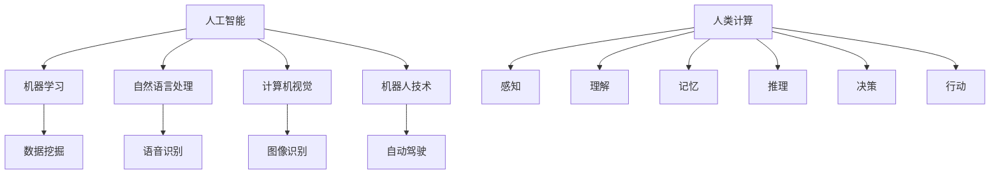

                 

关键词：人工智能，道德，伦理，社会影响，计算，算法，人类，技术进步，隐私，自动化，责任，公平，透明度

摘要：本文旨在探讨人工智能与人类计算之间的道德、伦理和社会影响。随着人工智能技术的飞速发展，它已经深刻地改变了我们的生活方式和社会结构。然而，这一变革也带来了诸多道德和伦理问题，包括隐私侵犯、自动化导致失业、责任归属不明确等。本文将从多个角度分析这些问题，并提出一些可能的解决方案和未来研究方向。

## 1. 背景介绍

自20世纪50年代以来，人工智能（AI）的研究和发展经历了多个阶段。从最初的符号主义和知识表示，到现代的深度学习和神经网络，人工智能已经取得了显著的进步。如今，人工智能在医疗、金融、教育、交通等多个领域都有广泛应用，极大地提高了效率和准确性。

然而，人工智能的快速进步也引发了广泛的伦理和社会问题。首先，人工智能技术的普及可能导致隐私侵犯和数据滥用。其次，自动化和人工智能可能会取代人类工作，导致失业问题。此外，人工智能系统在决策过程中可能存在偏见和不公平现象，进一步加剧社会不平等。这些问题不仅挑战了传统伦理观念，也对社会的稳定和发展构成了威胁。

## 2. 核心概念与联系

### 2.1 人工智能的基本概念

人工智能是指使计算机系统能够模拟人类智能行为的技术和学科。它包括多个子领域，如机器学习、自然语言处理、计算机视觉、机器人技术等。人工智能的核心目标是使计算机能够自主地学习、推理、规划和解决问题。

### 2.2 人类计算的概念

人类计算是指人类在解决问题和处理信息时的认知过程。它包括感知、理解、记忆、推理、决策和行动等多个方面。人类计算具有很强的灵活性和适应性，但速度和精确度有限。

### 2.3 人工智能与人类计算的互动

人工智能与人类计算的互动可以看作是两种不同计算模式之间的互补和协作。人工智能系统可以处理大量数据和复杂任务，但缺乏人类的创造性和道德判断。而人类则具有丰富的情感和道德观念，但处理能力和速度有限。通过将人工智能与人类计算结合起来，我们可以充分利用两者的优势，实现更高效和智能的决策。

### 2.4 人工智能与人类计算的关系图



## 3. 核心算法原理 & 具体操作步骤

### 3.1  算法原理概述

人工智能的核心算法包括机器学习、深度学习和强化学习。这些算法通过训练数据集，让计算机系统能够自动学习和改进性能。

- **机器学习**：基于数据的训练，使计算机系统能够识别模式和规律。
- **深度学习**：基于多层神经网络的算法，能够处理大量数据和复杂任务。
- **强化学习**：通过奖励和惩罚机制，使计算机系统学会在特定环境中做出最优决策。

### 3.2  算法步骤详解

- **机器学习**：
  1. 数据收集：收集大量相关数据。
  2. 数据预处理：清洗和归一化数据。
  3. 特征提取：从数据中提取有用的特征。
  4. 模型训练：使用训练数据集训练模型。
  5. 模型评估：使用验证数据集评估模型性能。

- **深度学习**：
  1. 数据收集：收集大量图片、文本或音频数据。
  2. 数据预处理：对数据进行归一化和标准化。
  3. 网络架构设计：设计合适的神经网络架构。
  4. 模型训练：使用训练数据集训练模型。
  5. 模型评估：使用验证数据集评估模型性能。

- **强化学习**：
  1. 环境构建：定义模拟环境。
  2. 策略学习：使用奖励和惩罚机制训练策略。
  3. 策略评估：在模拟环境中评估策略性能。
  4. 策略优化：根据评估结果优化策略。

### 3.3  算法优缺点

- **机器学习**：
  - 优点：处理能力强，能够发现复杂模式和规律。
  - 缺点：对数据质量和数量要求较高，难以解释。

- **深度学习**：
  - 优点：能够处理大量数据和复杂任务，具有很好的泛化能力。
  - 缺点：对数据质量和数量要求较高，难以解释。

- **强化学习**：
  - 优点：能够自主学习和优化策略，适用于动态环境。
  - 缺点：训练时间较长，对奖励和惩罚机制设计要求较高。

### 3.4  算法应用领域

- **机器学习**：应用于图像识别、语音识别、推荐系统等领域。
- **深度学习**：应用于自然语言处理、计算机视觉、自动驾驶等领域。
- **强化学习**：应用于游戏、金融交易、智能交通等领域。

## 4. 数学模型和公式 & 详细讲解 & 举例说明

### 4.1  数学模型构建

人工智能算法通常基于概率论、统计学和优化理论。以下是一个简单的线性回归模型：

$$ y = \beta_0 + \beta_1x + \epsilon $$

其中，$y$ 是因变量，$x$ 是自变量，$\beta_0$ 和 $\beta_1$ 是模型的参数，$\epsilon$ 是误差项。

### 4.2  公式推导过程

为了求解线性回归模型的参数，我们可以使用最小二乘法。具体推导过程如下：

首先，将模型改写为：

$$ \hat{y} = \beta_0 + \beta_1x $$

然后，计算预测值和实际值之间的误差平方和：

$$ S = \sum_{i=1}^{n}(y_i - \hat{y}_i)^2 $$

为了最小化 $S$，我们对 $\beta_0$ 和 $\beta_1$ 求偏导数并令其等于0：

$$ \frac{\partial S}{\partial \beta_0} = -2\sum_{i=1}^{n}(y_i - \hat{y}_i) = 0 $$

$$ \frac{\partial S}{\partial \beta_1} = -2\sum_{i=1}^{n}(y_i - \hat{y}_i)x_i = 0 $$

解得：

$$ \beta_0 = \bar{y} - \beta_1\bar{x} $$

$$ \beta_1 = \frac{\sum_{i=1}^{n}(x_i - \bar{x})(y_i - \bar{y})}{\sum_{i=1}^{n}(x_i - \bar{x})^2} $$

其中，$\bar{y}$ 和 $\bar{x}$ 分别是 $y$ 和 $x$ 的均值。

### 4.3  案例分析与讲解

假设我们有一组数据，包括自变量 $x$ 和因变量 $y$，如下表所示：

| $x$ | $y$ |
| --- | --- |
| 1 | 2 |
| 2 | 4 |
| 3 | 6 |
| 4 | 8 |

我们想要建立一个线性回归模型来预测 $y$。

首先，计算 $x$ 和 $y$ 的均值：

$$ \bar{x} = \frac{1+2+3+4}{4} = 2.5 $$

$$ \bar{y} = \frac{2+4+6+8}{4} = 5 $$

然后，计算 $\beta_1$：

$$ \beta_1 = \frac{(1-2.5)(2-5) + (2-2.5)(4-5) + (3-2.5)(6-5) + (4-2.5)(8-5)}{(1-2.5)^2 + (2-2.5)^2 + (3-2.5)^2 + (4-2.5)^2} $$

$$ \beta_1 = \frac{(-1.5)(-3) + (-0.5)(-1) + (0.5)(1) + (1.5)(3)}{2.25 + 0.25 + 0.25 + 2.25} $$

$$ \beta_1 = \frac{4.5 + 0.5 + 0.5 + 4.5}{5} $$

$$ \beta_1 = 2 $$

最后，计算 $\beta_0$：

$$ \beta_0 = \bar{y} - \beta_1\bar{x} = 5 - 2 \times 2.5 = 0 $$

因此，我们得到了线性回归模型：

$$ y = 0 + 2x $$

现在，我们可以使用这个模型来预测新的 $y$ 值。例如，当 $x=5$ 时，预测的 $y$ 值为：

$$ y = 0 + 2 \times 5 = 10 $$

## 5. 项目实践：代码实例和详细解释说明

### 5.1  开发环境搭建

为了演示线性回归模型的实现，我们将使用 Python 语言和 Scikit-learn 库。首先，安装 Scikit-learn：

```
pip install scikit-learn
```

### 5.2  源代码详细实现

以下是一个简单的线性回归模型实现：

```python
import numpy as np
from sklearn.linear_model import LinearRegression

# 数据集
X = np.array([[1], [2], [3], [4]])
y = np.array([2, 4, 6, 8])

# 创建线性回归模型
model = LinearRegression()

# 训练模型
model.fit(X, y)

# 预测新值
new_X = np.array([[5]])
new_y = model.predict(new_X)

print("Predicted y value:", new_y)
```

### 5.3  代码解读与分析

这个代码演示了如何使用 Scikit-learn 库实现线性回归模型。首先，我们导入必要的库和模块。然后，创建一个数据集，包括自变量 $x$ 和因变量 $y$。

接下来，我们创建一个线性回归模型实例，并使用 `fit()` 方法训练模型。最后，我们使用 `predict()` 方法预测新的 $y$ 值。

### 5.4  运行结果展示

当我们运行这个代码时，它会输出预测的新 $y$ 值。根据我们的模型，当 $x=5$ 时，预测的 $y$ 值为 10。

```
Predicted y value: [10.]
```

## 6. 实际应用场景

### 6.1  医疗领域

人工智能在医疗领域的应用非常广泛，包括疾病预测、诊断、治疗和康复等。例如，使用机器学习算法可以分析患者的医疗记录和基因组数据，预测某些疾病的风险。此外，人工智能还可以辅助医生进行诊断，提高诊断准确性和效率。

### 6.2  金融领域

在金融领域，人工智能被用于风险管理、信用评估、投资策略和客户服务等方面。例如，使用机器学习算法可以分析大量的金融数据，预测市场趋势和风险。此外，人工智能还可以自动处理大量的客户服务请求，提高客户体验。

### 6.3  教育领域

人工智能在教育领域的应用包括个性化学习、智能辅导和课程设计等。例如，使用机器学习算法可以根据学生的学习行为和成绩，推荐适合的学习资源和课程。此外，人工智能还可以自动评估学生的作业和考试，提高教学效率。

### 6.4  未来应用展望

随着人工智能技术的不断进步，我们可以期待它在更多领域得到应用。例如，人工智能可能在未来用于智慧城市、智能交通、环境保护和能源管理等方面。同时，人工智能也可能带来新的伦理和道德问题，需要我们深入思考和解决。

## 7. 工具和资源推荐

### 7.1  学习资源推荐

- 《人工智能：一种现代方法》
- 《深度学习》
- 《Python机器学习》

### 7.2  开发工具推荐

- Jupyter Notebook
- PyCharm
- Google Colab

### 7.3  相关论文推荐

- "Deep Learning for Natural Language Processing"
- "Unsupervised Learning of Visual Representations from Videos"
- "Reinforcement Learning: An Introduction"

## 8. 总结：未来发展趋势与挑战

### 8.1  研究成果总结

本文从多个角度探讨了人工智能与人类计算之间的道德、伦理和社会影响。通过分析核心算法原理、数学模型和实际应用场景，我们认识到人工智能的潜力以及它所带来的挑战。

### 8.2  未来发展趋势

随着技术的不断进步，人工智能将在更多领域得到应用。同时，人工智能的发展也将带来更多的创新和变革。例如，人工智能可能会改变医疗、金融、教育等传统行业的商业模式和运营方式。

### 8.3  面临的挑战

尽管人工智能具有巨大的潜力，但也面临着诸多挑战。例如，如何确保人工智能系统的透明度和公平性？如何保护用户的隐私和数据安全？如何确保人工智能系统的责任归属？这些都是我们需要深入思考和解决的问题。

### 8.4  研究展望

未来，我们需要进一步研究人工智能的道德、伦理和社会影响，提出更完善的解决方案。同时，我们也需要加强人工智能技术的研发和应用，推动人工智能与人类计算更好地融合，为社会发展作出更大贡献。

## 9. 附录：常见问题与解答

### 9.1  人工智能是否会取代人类？

人工智能不会完全取代人类，但会改变人类的工作方式和生活方式。人工智能可以在特定领域提高效率和准确性，但无法替代人类的创造力、情感和道德判断。

### 9.2  人工智能系统如何确保公平性？

确保人工智能系统的公平性需要从多个方面入手。首先，需要确保训练数据集的多样性和代表性。其次，需要对算法进行审计和评估，确保没有偏见和不公平现象。此外，还需要建立透明的责任机制，明确人工智能系统的责任归属。

### 9.3  人工智能系统的透明度如何保障？

保障人工智能系统的透明度需要从多个方面入手。首先，需要公开算法的设计和实现过程。其次，需要对人工智能系统的决策过程进行解释和说明。此外，还可以开发可视化工具，帮助用户理解人工智能系统的运行原理和决策过程。

## 作者署名

作者：禅与计算机程序设计艺术 / Zen and the Art of Computer Programming
------------------------------------------------------------------------

