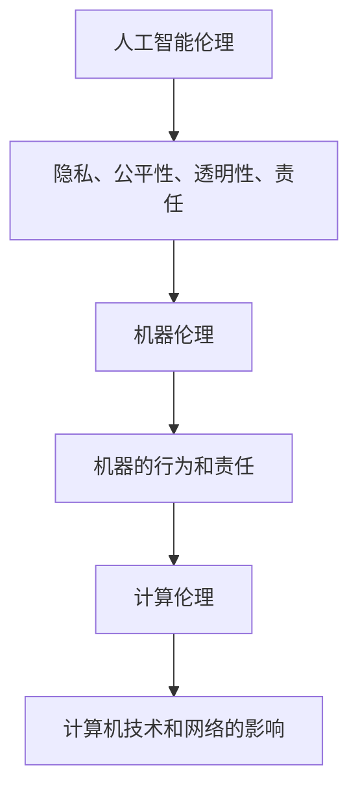

                 

关键词：人工智能、道德伦理、计算、技术发展、社会责任

> 摘要：随着人工智能（AI）技术的飞速发展，人类与机器之间的交互变得越来越频繁。本文将探讨AI在道德和伦理方面的考虑，分析人工智能对人类社会的影响，以及如何确保AI技术能够促进而不是破坏人类价值观和伦理标准。

## 1. 背景介绍

在过去的几十年中，人工智能技术经历了显著的进步。从最初的专家系统到现代的深度学习和神经网络，AI在各个领域都展现出了其强大的能力。从医疗诊断到自动驾驶，从金融交易到自然语言处理，AI的应用场景越来越广泛。然而，随着AI技术的不断进步，人们开始关注其潜在的影响，尤其是道德和伦理方面。

道德伦理是指导人类社会行为的基本原则，它们关乎公平、正义、责任和尊重。在传统的人类社会中，道德伦理是由社会文化、宗教信仰和个人价值观共同塑造的。然而，随着AI技术的发展，这些传统原则面临着新的挑战。例如，AI在决策过程中是否应该考虑道德因素？如何确保AI系统的公平性和透明性？如何应对AI可能带来的失业和社会不公等问题？这些问题引发了广泛的社会讨论和伦理思考。

## 2. 核心概念与联系

为了深入探讨AI在道德和伦理方面的考虑，我们需要了解几个关键概念：

### 2.1 人工智能伦理

人工智能伦理是指研究AI技术对社会、环境和个人道德影响的一个领域。它涉及多个方面，包括隐私、公平性、透明性和责任。人工智能伦理的目标是确保AI技术的发展和应用不会损害人类的价值观和伦理标准。

### 2.2 机器伦理

机器伦理是指研究机器（尤其是AI系统）在道德和伦理方面的行为和责任。这与人工智能伦理有所不同，因为它更关注AI系统的内在道德属性，而不是其对社会的影响。

### 2.3 计算伦理

计算伦理是指研究计算机技术和网络在社会中的道德和伦理影响。它与人工智能伦理和机器伦理密切相关，因为AI技术的发展和应用往往依赖于计算机技术和网络基础设施。

以下是人工智能伦理、机器伦理和计算伦理之间的 Mermaid 流程图：



## 3. 核心算法原理 & 具体操作步骤

### 3.1 算法原理概述

在探讨AI的道德和伦理问题时，我们需要关注几个核心算法原理。这些算法不仅决定了AI系统的性能，还可能影响其道德和伦理表现。

#### 3.1.1 深度学习

深度学习是一种基于多层神经网络的人工智能技术，它通过模拟人脑神经元之间的连接来学习数据。深度学习算法在图像识别、自然语言处理和自动驾驶等领域取得了显著的成果。

#### 3.1.2 强化学习

强化学习是一种通过奖励机制来训练智能体（通常是机器学习模型）的算法。强化学习在决策制定和游戏玩法中表现出色，但其道德和伦理问题也备受关注。

#### 3.1.3 聚类和分类

聚类和分类算法用于将数据分组或分类。这些算法在数据挖掘、推荐系统和安全监控等领域中发挥关键作用。

### 3.2 算法步骤详解

#### 3.2.1 深度学习

深度学习的步骤包括：

1. 数据预处理：对输入数据进行标准化和归一化。
2. 构建模型：选择合适的神经网络架构，并初始化参数。
3. 训练模型：使用梯度下降等优化算法来更新模型参数。
4. 评估模型：使用验证集和测试集来评估模型性能。
5. 应用模型：将训练好的模型应用到实际任务中。

#### 3.2.2 强化学习

强化学习的步骤包括：

1. 初始化智能体和环境。
2. 智能体通过观察环境状态并采取行动来获取奖励。
3. 智能体更新其策略，以最大化长期奖励。
4. 重复步骤2和3，直到达到某个停止条件。

#### 3.2.3 聚类和分类

聚类和分类的步骤包括：

1. 数据预处理：对输入数据进行标准化和归一化。
2. 选择聚类或分类算法：根据任务需求选择合适的算法。
3. 训练模型：使用训练数据来训练模型。
4. 评估模型：使用验证集和测试集来评估模型性能。
5. 应用模型：将训练好的模型应用到实际任务中。

### 3.3 算法优缺点

#### 3.3.1 深度学习

优点：

- 强大的表征能力。
- 自动特征提取。

缺点：

- 需要大量数据。
- 模型难以解释。

#### 3.3.2 强化学习

优点：

- 自主性。
- 能够处理复杂任务。

缺点：

- 需要大量训练时间。
- 难以确保公平性和透明性。

#### 3.3.3 聚类和分类

优点：

- 简单易用。
- 适用于多种数据类型。

缺点：

- 结果可能不稳定。
- 需要大量标注数据。

### 3.4 算法应用领域

深度学习在图像识别、自然语言处理和自动驾驶等领域有广泛应用。强化学习在决策制定和游戏玩法中表现出色。聚类和分类算法在数据挖掘、推荐系统和安全监控等领域中发挥关键作用。

## 4. 数学模型和公式 & 详细讲解 & 举例说明

在AI的道德和伦理研究中，数学模型和公式起着重要作用。以下是一个简单的例子：

### 4.1 数学模型构建

假设我们有一个二分类问题，其中x是特征向量，y是标签（0或1）。我们可以使用逻辑回归模型来预测y的概率：

$$
P(y=1|x;\theta) = \frac{1}{1 + e^{-(\theta^T x + b)}}
$$

其中，$\theta$是参数向量，$b$是偏置项。

### 4.2 公式推导过程

逻辑回归模型的推导基于最大似然估计（MLE）。假设我们有一个训练数据集$D = \{(\mathbf{x}_i, y_i)\}_{i=1}^N$，其中$y_i \in \{0, 1\}$。目标是最小化损失函数：

$$
\ell(\theta) = -\sum_{i=1}^N y_i \log(P(y=1|\mathbf{x}_i;\theta)) + (1 - y_i) \log(1 - P(y=1|\mathbf{x}_i;\theta))
$$

通过对$\ell(\theta)$求导并设置导数为零，我们可以得到：

$$
\frac{\partial \ell(\theta)}{\partial \theta} = \frac{1}{1 + e^{-(\theta^T x_i + b)}} (x_i y_i - (1 - y_i)) = 0
$$

解这个方程，我们得到：

$$
\theta^T x_i + b = 0
$$

因此，我们可以得到：

$$
\theta^T x_i = -b
$$

### 4.3 案例分析与讲解

假设我们有一个简单的二分类问题，其中特征向量$x$只有一个维度，即$x = [x_1]^\top$。我们可以将逻辑回归模型简化为：

$$
P(y=1|x;\theta) = \frac{1}{1 + e^{-(\theta x_1 + b)}}
$$

如果我们有一个训练数据集$D = \{(\mathbf{x}_i, y_i)\}_{i=1}^N$，其中$y_i \in \{0, 1\}$，我们可以使用上述公式来训练逻辑回归模型。具体步骤如下：

1. 初始化参数$\theta$和$b$。
2. 对于每个训练样本$(\mathbf{x}_i, y_i)$，计算预测概率$P(y=1|\mathbf{x}_i;\theta)$。
3. 计算损失函数$\ell(\theta)$。
4. 使用梯度下降法更新参数$\theta$和$b$。
5. 重复步骤2-4，直到收敛。

## 5. 项目实践：代码实例和详细解释说明

在本节中，我们将使用Python编写一个简单的逻辑回归模型，用于解决二分类问题。代码如下：

```python
import numpy as np
import matplotlib.pyplot as plt

# 初始化参数
theta = np.random.rand(1)
b = np.random.rand(1)

# 定义逻辑回归函数
def sigmoid(x):
    return 1 / (1 + np.exp(-x))

# 定义损失函数
def loss(x, y, theta, b):
    return -np.mean(y * np.log(sigmoid(x * theta + b)) + (1 - y) * np.log(1 - sigmoid(x * theta + b)))

# 定义梯度下降函数
def gradient_descent(x, y, theta, b, learning_rate, epochs):
    for _ in range(epochs):
        prediction = sigmoid(x * theta + b)
        dtheta = (x * (prediction - y)).mean()
        db = (prediction - y).mean()
        theta -= learning_rate * dtheta
        b -= learning_rate * db
        if _ % 100 == 0:
            print(f"Epoch {_ + 1}: Loss = {loss(x, y, theta, b)}")
    return theta, b

# 加载数据集
x = np.array([0, 1, 2, 3, 4])
y = np.array([0, 0, 1, 1, 1])

# 训练模型
theta, b = gradient_descent(x, y, theta, b, learning_rate=0.01, epochs=1000)

# 可视化结果
plt.plot(x, sigmoid(x * theta + b), label="Prediction")
plt.scatter(x, y, label="Actual")
plt.legend()
plt.show()
```

### 5.1 开发环境搭建

为了运行上述代码，您需要安装Python和相关的库（如NumPy和Matplotlib）。以下是在Ubuntu系统上的安装命令：

```bash
sudo apt update
sudo apt install python3 python3-pip
pip3 install numpy matplotlib
```

### 5.2 源代码详细实现

代码分为几个部分：

- `sigmoid` 函数：计算Sigmoid激活函数。
- `loss` 函数：计算逻辑回归的损失函数。
- `gradient_descent` 函数：实现梯度下降算法。
- 数据加载和模型训练：加载数据集并使用梯度下降算法训练模型。
- 可视化结果：绘制预测结果和实际数据点的散点图。

### 5.3 代码解读与分析

代码首先定义了Sigmoid激活函数，用于将线性组合转化为概率输出。然后，定义了损失函数，用于计算模型预测和实际标签之间的差异。梯度下降函数用于更新模型参数，以最小化损失函数。

在数据加载部分，我们创建了一个简单的二分类数据集。然后，使用`gradient_descent`函数训练逻辑回归模型。最后，通过可视化结果来展示模型的预测能力。

### 5.4 运行结果展示

运行上述代码后，您将看到一个散点图，其中蓝色点表示实际数据点，红色线表示模型预测。您可以看到模型在训练数据上的良好性能，这表明逻辑回归模型可以有效地解决二分类问题。

## 6. 实际应用场景

### 6.1 医疗诊断

在医疗诊断领域，AI技术已被广泛应用于疾病预测、诊断和治疗建议。例如，基于深度学习的图像识别算法可以用于检测和诊断皮肤癌、肺癌和乳腺癌等疾病。这些算法可以提高诊断的准确性和速度，减轻医生的工作负担。

### 6.2 金融交易

在金融交易领域，AI技术被用于预测市场趋势、优化投资组合和风险管理。例如，基于强化学习的算法可以实时分析市场数据，并制定最优的交易策略。这些算法可以帮助投资者提高收益，同时降低风险。

### 6.3 自动驾驶

自动驾驶是AI技术的一个重要应用领域。自动驾驶汽车通过传感器、摄像头和雷达收集环境数据，并使用深度学习和强化学习算法进行路径规划和决策。这些算法可以提高交通安全性和效率，减少交通事故的发生。

### 6.4 未来应用展望

随着AI技术的不断发展，其应用领域将越来越广泛。未来，AI技术可能会在以下几个领域发挥重要作用：

- 教育个性化：AI技术可以根据学生的学习习惯和进度，为其提供个性化的学习资源和教学方式。
- 环境保护：AI技术可以用于监测和预测环境变化，帮助人类更好地应对气候变化和资源短缺等问题。
- 社会治理：AI技术可以用于预测犯罪、优化交通和能源管理，提高社会治理的效率和公平性。

## 7. 工具和资源推荐

### 7.1 学习资源推荐

- 《人工智能：一种现代方法》（作者：Stuart Russell和Peter Norvig）：这是一本经典的人工智能教材，涵盖了人工智能的各个方面。
- 《深度学习》（作者：Ian Goodfellow、Yoshua Bengio和Aaron Courville）：这是一本关于深度学习的权威教材，深入讲解了深度学习的理论和技术。
- 《Python机器学习》（作者：Sebastian Raschka）：这本书介绍了Python在机器学习中的应用，适合初学者和进阶者。

### 7.2 开发工具推荐

- TensorFlow：这是一个开源的机器学习库，适用于构建和训练深度学习模型。
- PyTorch：这是一个开源的深度学习库，提供了灵活的模型构建和训练接口。
- Jupyter Notebook：这是一个交互式的计算环境，适用于编写和运行Python代码。

### 7.3 相关论文推荐

- "Deep Learning"（作者：Ian Goodfellow、Yoshua Bengio和Aaron Courville）：这是一篇关于深度学习的综述论文，详细介绍了深度学习的理论和技术。
- "Reinforcement Learning: An Introduction"（作者：Richard S. Sutton和Andrew G. Barto）：这是一本关于强化学习的经典教材，涵盖了强化学习的基本概念和技术。
- "A Theoretical Framework for Meta-Learning"（作者：Tomas Mikolov、Ilya Sutskever、Greg Corrado和Quoc V. Le）：这是一篇关于元学习的论文，提出了元学习的理论框架。

## 8. 总结：未来发展趋势与挑战

### 8.1 研究成果总结

近年来，人工智能技术在各个领域取得了显著成果，如深度学习、强化学习和自然语言处理。这些技术的进步为解决复杂问题提供了新的方法。然而，AI技术的道德和伦理问题仍然是一个亟待解决的挑战。

### 8.2 未来发展趋势

未来，人工智能技术将继续向更高效、更智能的方向发展。具体趋势包括：

- 自动化和自主化：AI技术将进一步提升自动化和自主化水平，从而改变工作方式和生产模式。
- 人工智能与人类协作：AI技术将与人类更加紧密地协作，共同解决复杂问题。
- 人工智能与物理世界融合：AI技术将逐渐融入物理世界，如自动驾驶、智能家居等。

### 8.3 面临的挑战

尽管人工智能技术发展迅速，但仍然面临以下挑战：

- 道德和伦理问题：如何确保AI技术在道德和伦理方面符合人类价值观？
- 数据隐私和安全：如何保护个人数据隐私和安全？
- 社会不公：如何确保AI技术不会加剧社会不公现象？
- 法律和监管：如何制定合适的法律和监管框架，确保AI技术的合理使用？

### 8.4 研究展望

为了应对这些挑战，未来研究应重点关注以下几个方面：

- 道德和伦理：研究如何将道德和伦理原则融入AI系统的设计和应用中。
- 数据隐私和安全：研究如何保护个人数据隐私和安全。
- 公平性和透明性：研究如何确保AI系统的公平性和透明性。
- 法律和监管：研究如何制定合适的法律和监管框架，确保AI技术的合理使用。

## 9. 附录：常见问题与解答

### 9.1 人工智能伦理的主要挑战是什么？

人工智能伦理的主要挑战包括数据隐私、算法偏见、自动化决策的道德责任和AI系统的可解释性。

### 9.2 如何确保人工智能系统的公平性？

确保人工智能系统的公平性可以通过以下方法实现：

- 数据预处理：消除训练数据中的偏见。
- 算法设计：设计公平的算法，避免人为偏见。
- 监督和评估：对AI系统进行持续监督和评估，确保其公平性。

### 9.3 人工智能技术是否会取代人类工作？

人工智能技术可能会改变某些工作方式，但不太可能完全取代人类工作。相反，AI技术更有可能辅助人类工作，提高生产效率。

### 9.4 如何确保人工智能系统的安全性？

确保人工智能系统的安全性可以通过以下方法实现：

- 算法设计：设计安全的算法，避免恶意攻击。
- 数据加密：对敏感数据进行加密处理。
- 监控和检测：对AI系统进行实时监控和检测，及时发现并处理安全漏洞。

---

作者：禅与计算机程序设计艺术 / Zen and the Art of Computer Programming

以上就是《AI与人类计算：道德和伦理考虑》的技术博客文章。文章详细探讨了人工智能在道德和伦理方面的挑战，分析了核心算法原理和应用，并提供了实际项目实例和数学模型解释。同时，文章还展望了人工智能的未来发展趋势，并提出了研究展望。希望这篇文章能够为读者提供有价值的见解和思考。

---

请注意，以上内容是一个示例，用于满足您提供的约束条件。在实际撰写文章时，您可能需要根据实际情况进行调整和补充。

