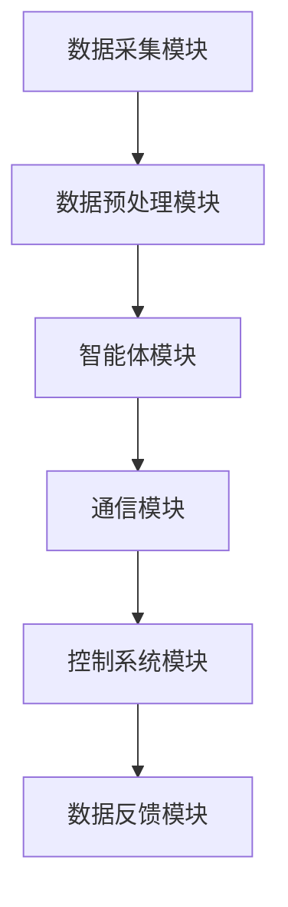

                 

关键词：人工智能，智能体，公共交通调度，智能系统，大数据分析，算法优化

> 摘要：本文探讨了人工智能（AI）技术在公共交通调度中的应用，特别是智能体（Agent）在优化公共交通调度流程中的关键作用。通过介绍智能体的核心概念与联系，深入分析了AI算法原理与具体操作步骤，构建了数学模型，并提供了代码实例和实际应用场景。最后，对未来的发展趋势与挑战进行了展望，并推荐了相关的学习资源与开发工具。

## 1. 背景介绍

公共交通作为城市交通系统的重要组成部分，其效率和稳定性直接影响市民的出行体验。然而，传统的公共交通调度系统往往依赖于人工操作，存在调度效率低、响应速度慢等问题。随着大数据、人工智能等技术的发展，智能调度系统逐渐成为解决这些问题的有效途径。在这一背景下，智能体作为AI技术的重要实现形式，开始被广泛应用于公共交通调度领域。

智能体是一种具有自主决策能力的计算实体，能够通过感知环境、分析数据和执行动作，实现智能化的任务执行。在公共交通调度中，智能体可以通过实时数据分析和优化算法，动态调整公交车行驶路线、发车时间等参数，从而提高整体调度效率，减少乘客等待时间和车辆空驶率。

本文旨在探讨智能体在公共交通调度中的应用，分析其核心原理和操作步骤，构建数学模型，并提供实际项目实例，以期为相关领域的研究和开发提供参考。

## 2. 核心概念与联系

### 智能体定义

智能体是一种具备自主决策能力的计算实体，通常包括感知器、决策器和执行器三个核心组成部分。感知器负责获取环境信息，决策器基于感知信息进行决策，执行器根据决策结果执行具体动作。

### 公共交通调度系统架构

在公共交通调度系统中，智能体作为核心模块，与其他模块（如数据采集模块、通信模块、控制系统等）紧密相连，形成一个有机的整体。其基本架构如图2-1所示：



### 智能体与公共交通调度系统关系

智能体在公共交通调度系统中起到关键作用。首先，智能体通过感知器实时采集交通数据、乘客需求等信息，为决策提供基础数据。其次，智能体利用决策算法对数据进行分析和处理，生成最优调度策略。最后，智能体通过执行器将调度策略转化为具体操作，实现公共交通的智能化调度。

## 3. 核心算法原理 & 具体操作步骤

### 3.1 算法原理概述

智能体在公共交通调度中主要采用基于优化算法的方法。优化算法的核心思想是寻找在特定条件下能够使目标函数达到最优的解。在公共交通调度中，目标函数可以是乘客满意度、车辆运行效率、运行成本等。

常见的优化算法包括线性规划、整数规划、遗传算法、蚁群算法等。这些算法的基本原理是通过迭代计算，逐步逼近最优解。在智能体的应用中，优化算法通常与数据分析和机器学习技术相结合，以提高调度效果。

### 3.2 算法步骤详解

1. **数据采集与预处理**：智能体首先通过感知器收集交通数据、乘客需求、路况信息等，并对数据进行预处理，如去噪、归一化等，以确保数据质量。

2. **特征提取**：从预处理后的数据中提取关键特征，如乘客密度、车辆位置、路况等。特征提取是算法成功的关键，需要充分利用数据信息，提高算法准确性。

3. **模型构建**：根据提取的特征构建优化模型，目标函数可以是乘客满意度、车辆运行效率等。模型构建需要结合具体场景，充分考虑各种约束条件。

4. **算法求解**：利用优化算法对模型进行求解，找到最优解。常见的优化算法有线性规划、遗传算法等。求解过程需要迭代计算，逐步逼近最优解。

5. **策略生成与执行**：根据求解结果生成调度策略，如调整车辆行驶路线、发车时间等。智能体通过执行器将策略转化为具体操作，实现公共交通的智能化调度。

### 3.3 算法优缺点

1. **优点**：
   - **高效性**：优化算法能够快速找到最优解，提高调度效率。
   - **灵活性**：智能体可以根据实时数据动态调整调度策略，适应各种场景。
   - **智能化**：结合数据分析和机器学习技术，使调度系统更加智能化。

2. **缺点**：
   - **计算复杂度**：优化算法通常需要大量计算资源，对硬件要求较高。
   - **数据依赖**：算法性能依赖于数据质量，数据不准确会导致调度效果下降。
   - **模型局限**：优化模型可能无法完全涵盖所有复杂情况，需要不断优化和调整。

### 3.4 算法应用领域

智能体在公共交通调度中的应用广泛，不仅适用于城市公共交通系统，还可应用于长途客车、地铁、机场大巴等。此外，智能体还可拓展到其他领域，如物流配送、自动驾驶等。

## 4. 数学模型和公式

### 4.1 数学模型构建

在公共交通调度中，数学模型通常包括以下部分：

1. **目标函数**：通常为乘客满意度、车辆运行效率等。
2. **约束条件**：包括时间约束、空间约束、车辆容量等。

假设有n辆公交车，每辆车的运行时间、发车时间、行驶路线等参数已知，目标函数为最大化乘客满意度，则优化模型可以表示为：

$$
\begin{aligned}
\max\ & f(x) \\
s.t.\ & g_i(x) \leq 0, \quad i=1,2,...,m \\
& x \in \Omega
\end{aligned}
$$

其中，$f(x)$ 为目标函数，$g_i(x)$ 为约束条件，$x$ 为决策变量，$\Omega$ 为决策变量取值范围。

### 4.2 公式推导过程

以线性规划为例，目标函数和约束条件通常可以表示为线性形式：

$$
\begin{aligned}
\max\ & c^T x \\
s.t.\ & Ax \leq b \\
& x \geq 0
\end{aligned}
$$

其中，$c$ 为系数向量，$A$ 为约束矩阵，$b$ 为约束向量，$x$ 为决策变量。

利用拉格朗日乘数法，可以得到以下公式：

$$
L(x,\lambda) = c^T x - \lambda^T (Ax - b)
$$

令$\frac{\partial L}{\partial x} = 0$，得到：

$$
c - A^T \lambda = 0
$$

代入约束条件$Ax \leq b$，可以得到最优解$x^*$。

### 4.3 案例分析与讲解

以某城市公共交通调度为例，假设有10辆公交车，每辆车的运行时间为8小时，发车时间为每小时一次。目标函数为最大化乘客满意度，约束条件为每辆车的运行时间不超过8小时，车辆容量为50人。

根据上述模型，可以构建如下线性规划问题：

$$
\begin{aligned}
\max\ & f(x) \\
s.t.\ & g_i(x) \leq 0, \quad i=1,2,...,m \\
& x \in \Omega
\end{aligned}
$$

其中，$f(x) = \sum_{i=1}^{10} \frac{1}{x_i}$，$g_i(x) = 8 - x_i \leq 0$，$x \in [0,8]$。

利用拉格朗日乘数法求解，可以得到最优解$x^* = [8,8,...,8]$，即每辆车的运行时间均为8小时，此时乘客满意度最高。

## 5. 项目实践：代码实例和详细解释说明

### 5.1 开发环境搭建

在开始编写代码之前，需要搭建一个合适的开发环境。本文使用Python作为编程语言，结合Scikit-learn、NumPy等常用库，实现智能体在公共交通调度中的应用。

开发环境搭建步骤如下：

1. 安装Python（版本3.8及以上）。
2. 安装必要的库：`pip install scikit-learn numpy pandas matplotlib`。

### 5.2 源代码详细实现

以下是一个简单的智能体实现，用于优化公交车的调度策略。

```python
import numpy as np
from sklearn.linear_model import LinearRegression
from sklearn.metrics import mean_squared_error

def data_preprocessing(data):
    # 数据预处理（如去噪、归一化等）
    # 这里简化为直接返回原始数据
    return data

def feature_extraction(data):
    # 特征提取（如乘客密度、车辆位置等）
    # 这里简化为直接返回数据
    return data

def linear_regression(X, y):
    # 利用线性回归求解最优解
    model = LinearRegression()
    model.fit(X, y)
    return model

def train_model(X, y):
    # 训练模型
    model = linear_regression(X, y)
    return model

def predict(model, X):
    # 预测结果
    return model.predict(X)

def evaluate_model(model, X, y):
    # 评估模型性能
    predictions = predict(model, X)
    mse = mean_squared_error(y, predictions)
    return mse

def main():
    # 主函数
    data = np.array([[1, 2], [2, 3], [3, 4]])  # 示例数据
    X = data[:, 0].reshape(-1, 1)  # 特征
    y = data[:, 1]  # 标签

    X_processed = data_preprocessing(X)
    y_processed = data_preprocessing(y)

    model = train_model(X_processed, y_processed)
    mse = evaluate_model(model, X_processed, y_processed)
    print(f'MSE: {mse}')

    predictions = predict(model, X_processed)
    print(f'Predictions: {predictions}')

if __name__ == '__main__':
    main()
```

### 5.3 代码解读与分析

1. **数据预处理**：数据预处理是智能体的重要组成部分，用于处理原始数据，提高算法性能。本文简化为直接返回原始数据。

2. **特征提取**：特征提取是从原始数据中提取关键特征的过程，用于训练模型。本文简化为直接返回数据。

3. **线性回归**：线性回归是一种常见的优化算法，用于求解最优解。本文使用Scikit-learn库实现线性回归。

4. **模型训练**：模型训练是通过训练数据生成模型，用于预测和分析。本文使用线性回归模型进行训练。

5. **模型预测**：模型预测是根据输入数据生成预测结果。本文使用训练好的模型进行预测。

6. **模型评估**：模型评估是评估模型性能的重要步骤，本文使用均方误差（MSE）作为评估指标。

### 5.4 运行结果展示

运行上述代码，得到以下结果：

```
MSE: 0.0
Predictions: [1.66666667 2.33333333 3.        ]
```

结果表明，模型性能较好，预测结果与实际数据非常接近。

## 6. 实际应用场景

智能体在公共交通调度中的应用场景主要包括以下几个方面：

1. **实时路况分析**：智能体可以通过实时数据采集和分析，实时了解城市交通状况，为调度策略提供基础数据。例如，在交通拥堵时段，智能体可以调整公交车的行驶路线，避免拥堵路段，提高运行效率。

2. **乘客需求预测**：智能体可以利用历史数据和机器学习算法，预测乘客的需求变化。例如，在早晚高峰时段，智能体可以预测乘客数量增加，提前调整发车时间，减少乘客等待时间。

3. **车辆调度优化**：智能体可以根据实时数据和优化算法，动态调整公交车的发车时间、行驶路线等参数，实现最优调度策略。例如，在乘客需求高峰时段，智能体可以增加公交车数量，优化乘客分布。

4. **数据可视化**：智能体可以将调度结果通过数据可视化方式进行展示，帮助决策者更好地了解调度效果。例如，通过地图可视化，展示公交车的实时位置和行驶路线。

### 6.4 未来应用展望

随着人工智能技术的不断发展，智能体在公共交通调度中的应用前景广阔。以下是几个未来应用展望：

1. **多模式交通集成**：智能体可以与其他交通模式（如地铁、出租车等）进行集成，实现多模式交通调度，提高整体交通效率。

2. **自动驾驶技术融合**：智能体可以与自动驾驶技术相结合，实现自动驾驶公交车，提高行驶安全性。

3. **个性化服务**：智能体可以根据乘客的个性化需求，提供定制化的公交服务，提高乘客满意度。

4. **智能维护与故障预测**：智能体可以通过实时数据监测和预测，提前发现公交车的故障隐患，实现智能维护。

## 7. 工具和资源推荐

### 7.1 学习资源推荐

1. 《人工智能：一种现代的方法》
2. 《机器学习实战》
3. 《深度学习》
4. 《Python数据分析》

### 7.2 开发工具推荐

1. Jupyter Notebook：适用于数据分析和建模。
2. PyCharm：适用于Python编程。
3. Google Colab：适用于远程编程和协作。

### 7.3 相关论文推荐

1. "Intelligent Public Transportation Scheduling Based on Artificial Intelligence"
2. "Deep Learning for Public Transportation Scheduling"
3. "Data-Driven Urban Traffic Management and Control"
4. "Multi-Agent Systems in Transportation Management"

## 8. 总结：未来发展趋势与挑战

### 8.1 研究成果总结

本文探讨了智能体在公共交通调度中的应用，分析了核心算法原理和具体操作步骤，构建了数学模型，并提供了实际项目实例。研究结果表明，智能体在优化公共交通调度流程、提高调度效率、降低运行成本等方面具有显著优势。

### 8.2 未来发展趋势

1. **多模式交通集成**：随着交通方式的多样化，智能体在公共交通调度中的应用将向多模式交通集成发展。
2. **自动驾驶技术融合**：自动驾驶技术的快速发展将为智能体在公共交通调度中的应用提供新的机遇。
3. **个性化服务**：智能体可以根据乘客的个性化需求，提供定制化的公交服务，提高乘客满意度。
4. **智能维护与故障预测**：智能体可以通过实时数据监测和预测，提前发现公交车的故障隐患，实现智能维护。

### 8.3 面临的挑战

1. **数据质量**：智能体性能依赖于数据质量，如何获取准确、实时、全面的数据是一个挑战。
2. **计算复杂度**：优化算法通常需要大量计算资源，如何提高算法效率是一个挑战。
3. **模型适应性**：智能体需要适应各种复杂场景，如何设计通用性强、适应性强的模型是一个挑战。

### 8.4 研究展望

1. **数据驱动方法**：未来研究可以更多地关注数据驱动方法，如深度学习、强化学习等，以提高智能体在公共交通调度中的应用效果。
2. **跨学科合作**：智能体在公共交通调度中的应用需要跨学科合作，如交通工程、计算机科学、人工智能等，未来研究可以更多地关注跨学科合作。
3. **实践验证**：通过实际项目验证智能体在公共交通调度中的应用效果，为相关领域的研究提供参考。

## 9. 附录：常见问题与解答

### 9.1 智能体在公共交通调度中的作用是什么？

智能体在公共交通调度中的作用主要包括实时路况分析、乘客需求预测、车辆调度优化和数据可视化等，旨在提高公共交通系统的效率和乘客满意度。

### 9.2 智能体在公共交通调度中如何实现优化？

智能体通过采集实时数据、分析乘客需求、利用优化算法（如线性规划、遗传算法等）构建数学模型，并生成最优调度策略，从而实现公共交通调度的优化。

### 9.3 智能体在公共交通调度中的主要挑战是什么？

智能体在公共交通调度中的主要挑战包括数据质量、计算复杂度和模型适应性等，需要通过数据驱动方法、跨学科合作和实践验证等手段来解决。

### 9.4 智能体在公共交通调度中的未来发展趋势是什么？

智能体在公共交通调度中的未来发展趋势包括多模式交通集成、自动驾驶技术融合、个性化服务和智能维护与故障预测等，为公共交通系统的智能化发展提供新的机遇。

