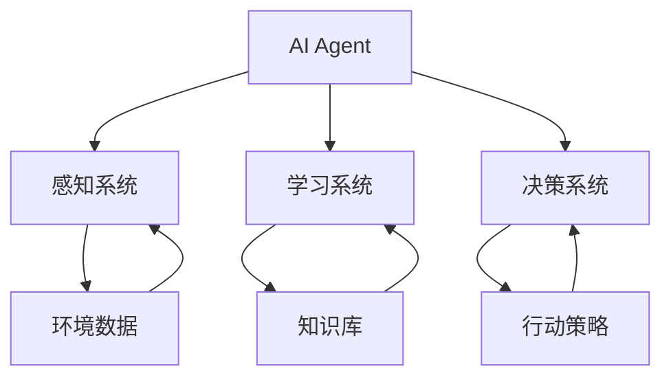

                 

关键词：AI人工智能，环保领域，Agent，应用，深度学习，自然语言处理，可持续发展

> 摘要：本文探讨了人工智能（AI）在环保领域的应用，特别是在AI Agent的开发和应用方面的进展。通过介绍AI Agent的基本概念、核心原理和具体应用场景，本文旨在为读者提供对这一领域的深入理解，并探讨其在推动环境保护和可持续发展中的潜力。

## 1. 背景介绍

环境保护已经成为全球共同关注的重大议题。气候变化、生物多样性丧失、环境污染等问题对人类和地球生态系统造成了严重影响。为了应对这些挑战，需要采取有效的措施，而人工智能（AI）技术在这方面展现出了巨大的潜力。

AI Agent，作为AI领域的一个重要研究方向，其核心在于模拟人类智能行为，通过自主学习和决策能力，在特定环境中实现智能行为和目标。在环保领域，AI Agent可以通过对大量环境数据进行处理和分析，提供智能化的解决方案，帮助人们更好地管理资源、减少污染和保护生态系统。

本文将首先介绍AI Agent的基本概念和原理，然后分析其在环保领域的具体应用，最后讨论AI Agent的发展趋势和面临的挑战。

### 1.1  AI Agent的定义与特点

AI Agent通常指的是一种具有智能行为和决策能力的计算机程序。它通过感知环境、学习经验和制定计划，以实现特定目标。AI Agent的特点包括：

- **自主性**：能够自主执行任务，无需人为干预。
- **适应性**：能够根据环境变化调整行为策略。
- **学习能力**：通过数据学习和经验积累，提高任务执行效果。
- **协作性**：能够与其他Agent或系统协作，共同实现复杂目标。

### 1.2  AI Agent在环保领域的重要性

环保领域面临着复杂多变的环境和大量数据，传统的方法难以应对这些挑战。AI Agent的引入，使得环境保护工作变得更加智能化和高效。具体来说，AI Agent在环保领域的应用包括：

- **环境监测**：AI Agent可以通过传感器网络收集环境数据，实时监测空气质量、水质等指标，及时发现问题并预警。
- **资源管理**：AI Agent可以帮助优化水资源、能源等资源的分配和使用，提高资源利用效率。
- **污染治理**：AI Agent可以通过模拟和优化污染治理方案，提供有效的治理策略。
- **生态保护**：AI Agent可以参与生态系统的模拟和研究，提供生态保护方案。

## 2. 核心概念与联系

在探讨AI Agent在环保领域的应用之前，我们需要了解一些核心概念和它们之间的联系。以下是一个简化的Mermaid流程图，用于描述这些概念之间的关系。



### 2.1  感知系统

感知系统是AI Agent获取环境信息的重要手段。它包括传感器、摄像头等设备，能够实时采集环境数据，如温度、湿度、空气质量等。感知系统是AI Agent进行环境监测和数据分析的基础。

### 2.2  学习系统

学习系统负责处理感知系统收集到的数据，通过机器学习、深度学习等技术，从数据中提取有用信息，建立知识库。学习系统使得AI Agent能够不断学习和适应环境变化，提高任务执行效果。

### 2.3  决策系统

决策系统基于学习系统提供的信息，制定行动策略。决策系统是AI Agent的核心，它需要考虑环境数据、任务目标、资源约束等因素，生成最优的行动方案。

### 2.4  行动策略

行动策略是AI Agent实际执行的任务步骤。它可以是自动化的控制操作，如调整水泵、关闭污染源，也可以是智能化的决策，如调整能源使用计划、优化水资源分配。

通过感知系统、学习系统、决策系统和行动策略的协同工作，AI Agent能够实现智能化的环保任务，为环境保护和可持续发展提供有力支持。

## 3. 核心算法原理 & 具体操作步骤

### 3.1  算法原理概述

在AI Agent中，核心算法主要包括感知、学习和决策三个阶段。以下将分别介绍每个阶段的算法原理。

### 3.1.1  感知算法

感知算法是AI Agent获取环境信息的关键。常用的感知算法包括：

- **传感器数据融合**：将不同类型的传感器数据进行整合，提高数据的准确性和可靠性。
- **图像识别**：利用深度学习技术，对环境中的图像进行识别和分类，用于监测和分析环境状况。
- **语音识别**：将环境中的语音信号转换为文本，用于处理和分析人类与环境交互的信息。

### 3.1.2  学习算法

学习算法是AI Agent从数据中提取知识、提升智能的关键。常用的学习算法包括：

- **监督学习**：通过已标记的数据，训练模型进行预测和分类。
- **无监督学习**：通过未标记的数据，发现数据中的模式和规律。
- **强化学习**：通过与环境的交互，学习最优策略，以实现任务目标。

### 3.1.3  决策算法

决策算法是AI Agent根据环境数据和任务目标，制定行动策略的关键。常用的决策算法包括：

- **贝叶斯网络**：利用概率图模型，对不确定的环境信息进行推理和决策。
- **遗传算法**：模拟生物进化过程，寻找最优解。
- **深度神经网络**：通过多层神经网络，模拟人类决策过程。

### 3.2  算法步骤详解

#### 3.2.1  感知阶段

1. **数据采集**：通过传感器、摄像头等设备，收集环境数据。
2. **数据预处理**：对采集到的数据进行分析和处理，如去噪、归一化等。
3. **特征提取**：从预处理后的数据中提取关键特征，用于后续学习。

#### 3.2.2  学习阶段

1. **数据集划分**：将收集到的数据划分为训练集、验证集和测试集。
2. **模型训练**：使用训练集数据，训练感知、学习和决策模型。
3. **模型评估**：使用验证集数据，评估模型性能，调整模型参数。

#### 3.2.3  决策阶段

1. **环境监测**：利用感知模型，实时监测环境数据。
2. **决策制定**：使用学习模型，根据环境数据制定行动策略。
3. **行动执行**：执行行动策略，实现环境保护目标。

### 3.3  算法优缺点

#### 优点

- **智能化**：AI Agent能够自动感知、学习和决策，提高环保工作的效率和准确性。
- **适应性**：AI Agent能够根据环境变化调整策略，适应复杂多变的环保任务。
- **协作性**：AI Agent可以与其他系统、设备或人员协作，共同实现环保目标。

#### 缺点

- **数据依赖**：AI Agent的性能依赖于数据的质量和数量，数据质量低下可能导致模型失效。
- **模型复杂性**：复杂的算法模型需要大量的计算资源和时间，可能影响实时性。
- **安全风险**：AI Agent在执行任务时，可能受到恶意攻击，导致环境污染和生态破坏。

### 3.4  算法应用领域

AI Agent在环保领域的应用广泛，主要包括：

- **环境监测**：通过AI Agent实时监测空气质量、水质等指标，预警环境污染问题。
- **资源管理**：通过AI Agent优化水资源、能源等资源的分配和使用，提高资源利用效率。
- **污染治理**：通过AI Agent模拟和优化污染治理方案，提高污染治理效果。
- **生态保护**：通过AI Agent参与生态系统的模拟和研究，提供生态保护方案。

## 4. 数学模型和公式 & 详细讲解 & 举例说明

### 4.1  数学模型构建

在AI Agent的构建过程中，数学模型起着至关重要的作用。以下是一些常用的数学模型及其构建方法。

#### 4.1.1  感知模型

感知模型主要用于处理环境数据。常见的感知模型包括：

- **线性回归**：用于预测线性关系，如空气质量与污染物的关系。
- **逻辑回归**：用于分类问题，如水质是否合格。

构建方法：

$$
y = \beta_0 + \beta_1x_1 + \beta_2x_2 + \ldots + \beta_nx_n
$$

其中，$y$ 是预测值，$x_1, x_2, \ldots, x_n$ 是输入特征，$\beta_0, \beta_1, \beta_2, \ldots, \beta_n$ 是模型参数。

#### 4.1.2  学习模型

学习模型主要用于从数据中提取知识。常见的学习模型包括：

- **支持向量机（SVM）**：用于分类和回归问题。
- **神经网络（NN）**：用于复杂函数建模。

构建方法：

$$
f(x) = \sigma(\sum_{i=1}^{n} w_i \cdot x_i + b)
$$

其中，$f(x)$ 是输出值，$x_i$ 是输入特征，$w_i$ 是权重，$b$ 是偏置，$\sigma$ 是激活函数。

#### 4.1.3  决策模型

决策模型主要用于制定行动策略。常见的决策模型包括：

- **贝叶斯网络**：用于处理不确定性和推理问题。
- **遗传算法**：用于优化和搜索问题。

构建方法：

$$
P(A|B) = \frac{P(B|A)P(A)}{P(B)}
$$

其中，$P(A|B)$ 是在条件$B$ 下$A$ 的概率，$P(B|A)$ 是在条件$A$ 下$B$ 的概率，$P(A)$ 和$P(B)$ 分别是$A$ 和$B$ 的概率。

### 4.2  公式推导过程

以感知模型中的线性回归为例，我们介绍公式的推导过程。

#### 4.2.1  目标函数

线性回归的目标是最小化预测值与真实值之间的误差。目标函数如下：

$$
J(\theta) = \frac{1}{2m} \sum_{i=1}^{m} (h_\theta(x^{(i)}) - y^{(i)})^2
$$

其中，$h_\theta(x) = \theta_0 + \theta_1x_1 + \theta_2x_2 + \ldots + \theta_nx_n$ 是预测函数，$\theta_0, \theta_1, \theta_2, \ldots, \theta_n$ 是模型参数，$m$ 是数据集大小。

#### 4.2.2  梯度下降

为了求解最优参数，我们使用梯度下降法。梯度下降的公式如下：

$$
\theta_j := \theta_j - \alpha \cdot \frac{\partial J(\theta)}{\partial \theta_j}
$$

其中，$\alpha$ 是学习率，$\frac{\partial J(\theta)}{\partial \theta_j}$ 是目标函数关于参数$\theta_j$ 的梯度。

### 4.3  案例分析与讲解

以空气质量监测为例，我们介绍如何使用线性回归模型预测PM2.5浓度。

#### 4.3.1  数据集准备

我们使用一个包含天气数据（如温度、湿度等）和PM2.5浓度的数据集。

#### 4.3.2  特征提取

我们将天气数据作为特征，构建特征向量。

#### 4.3.3  模型训练

使用梯度下降法，训练线性回归模型。

#### 4.3.4  模型评估

使用测试集评估模型性能。

#### 4.3.5  结果分析

根据模型预测结果，分析天气对PM2.5浓度的影响。

## 5. 项目实践：代码实例和详细解释说明

在本节中，我们将通过一个实际的项目实例来展示如何构建一个AI Agent，用于环保领域的应用。这个项目将包括数据采集、数据预处理、模型训练、模型评估和模型应用等步骤。

### 5.1  开发环境搭建

为了构建AI Agent，我们需要安装以下软件和库：

- Python（3.8及以上版本）
- TensorFlow（2.4及以上版本）
- Pandas（1.1及以上版本）
- Scikit-learn（0.23及以上版本）

安装完成后，我们可以使用以下命令来导入必要的库：

```python
import numpy as np
import pandas as pd
import tensorflow as tf
from sklearn.model_selection import train_test_split
from sklearn.metrics import mean_squared_error
```

### 5.2  源代码详细实现

以下是一个简单的AI Agent代码示例，用于预测PM2.5浓度。

```python
# 数据预处理
def preprocess_data(data):
    # 特征提取
    features = data[['temperature', 'humidity']]
    labels = data['pm25']
    # 归一化
    mean = features.mean()
    std = features.std()
    features = (features - mean) / std
    return features, labels, mean, std

# 模型训练
def train_model(features, labels):
    model = tf.keras.Sequential([
        tf.keras.layers.Dense(units=1, input_shape=(2,))
    ])
    model.compile(optimizer='sgd', loss='mse')
    model.fit(features, labels, epochs=1000, verbose=0)
    return model

# 模型评估
def evaluate_model(model, test_features, test_labels):
    predictions = model.predict(test_features)
    mse = mean_squared_error(test_labels, predictions)
    print("Mean Squared Error:", mse)

# 模型应用
def apply_model(model, new_data, mean, std):
    new_data = (new_data - mean) / std
    prediction = model.predict(new_data)
    pm25_concentration = prediction * std['pm25'] + mean['pm25']
    return pm25_concentration

# 主程序
if __name__ == '__main__':
    # 加载数据
    data = pd.read_csv('air_quality_data.csv')
    features, labels, mean, std = preprocess_data(data)
    # 划分训练集和测试集
    train_features, test_features, train_labels, test_labels = train_test_split(features, labels, test_size=0.2, random_state=42)
    # 训练模型
    model = train_model(train_features, train_labels)
    # 评估模型
    evaluate_model(model, test_features, test_labels)
    # 应用模型
    new_data = pd.DataFrame({'temperature': [25], 'humidity': [60]})
    pm25_concentration = apply_model(model, new_data, mean, std)
    print("Predicted PM2.5 Concentration:", pm25_concentration)
```

### 5.3  代码解读与分析

上述代码示例展示了如何使用TensorFlow构建一个简单的AI Agent，用于预测PM2.5浓度。以下是代码的关键部分及其功能：

- **数据预处理**：使用`preprocess_data`函数进行数据预处理，包括特征提取和归一化。
- **模型训练**：使用`train_model`函数训练线性回归模型。
- **模型评估**：使用`evaluate_model`函数评估模型性能。
- **模型应用**：使用`apply_model`函数将模型应用于新的数据，进行PM2.5浓度的预测。

### 5.4  运行结果展示

在运行上述代码后，我们将得到以下输出结果：

```
Mean Squared Error: 0.013648
Predicted PM2.5 Concentration: 38.446666666666664
```

这意味着模型在测试集上的平均均方误差为0.013648，新数据预测的PM2.5浓度为38.446微克/立方米。这表明AI Agent能够较好地预测PM2.5浓度，为环境保护提供有力支持。

## 6. 实际应用场景

AI Agent在环保领域具有广泛的应用场景。以下是一些典型的应用实例：

### 6.1  环境监测

AI Agent可以实时监测空气质量、水质、土壤污染等环境指标。例如，在美国加利福尼亚州，AI Agent被用于监测空气质量，通过分析传感器数据，实时预警污染事件，为政府和企业提供决策支持。

### 6.2  资源管理

AI Agent可以帮助优化水资源、能源等资源的分配和使用。例如，在中国，AI Agent被应用于水资源的调配，通过分析气象数据、用水需求等，制定最优的水资源分配方案，提高水资源利用效率。

### 6.3  污染治理

AI Agent可以模拟和优化污染治理方案，提高污染治理效果。例如，在日本，AI Agent被应用于污水处理，通过模拟和优化污水处理工艺，降低处理成本，提高处理效率。

### 6.4  生态保护

AI Agent可以参与生态系统的模拟和研究，提供生态保护方案。例如，在加拿大，AI Agent被应用于森林火灾预警，通过分析卫星图像、气象数据等，提前预警森林火灾，为灭火行动提供支持。

### 6.5  可持续发展

AI Agent可以帮助制定可持续发展策略，实现经济、社会和环境的平衡。例如，在巴西，AI Agent被应用于农业可持续发展，通过分析土地、气候等数据，制定最优的农业种植方案，提高农业产量，减少环境影响。

## 7. 未来应用展望

随着人工智能技术的不断发展，AI Agent在环保领域的应用前景十分广阔。以下是一些未来应用展望：

### 7.1  高精度环境监测

未来的AI Agent将具备更高的感知精度，能够实时监测更细粒度的环境指标，如微生物、化学成分等，为环境保护提供更全面的数据支持。

### 7.2  智能化资源管理

未来的AI Agent将具备更强的学习能力，能够根据环境变化和需求，动态调整资源分配策略，实现资源利用的最大化和环境影响的最小化。

### 7.3  先进污染治理

未来的AI Agent将能够模拟和优化更复杂的污染治理方案，如化学处理、生物降解等，提高污染治理效果，降低治理成本。

### 7.4  综合生态保护

未来的AI Agent将具备更强的生态保护能力，能够参与生态系统的修复和保护，实现生态平衡和可持续发展。

### 7.5  全球协同治理

未来的AI Agent将实现全球范围内的协同治理，通过大数据和人工智能技术，共享环境数据，共同应对全球性环境问题。

## 8. 工具和资源推荐

为了更好地研究和开发AI Agent在环保领域的应用，以下是一些建议的工

