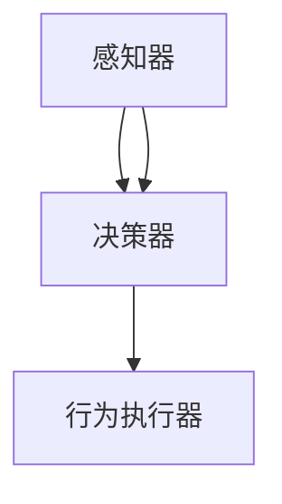

                 

关键词：AI人工智能，航天领域，应用案例，技术挑战，未来展望

<|assistant|>摘要：本文探讨了人工智能（AI）在航天领域中的应用，介绍了AI代理的概念及其在航天任务中的角色。文章详细分析了AI代理在航天任务规划、实时监测、故障诊断和自动化操作等方面的优势，并通过实际案例展示了AI代理在航天领域的应用。此外，文章还探讨了当前面临的技术挑战和未来展望，为航天领域的AI应用提供了有益的参考。

## 1. 背景介绍

随着科技的不断发展，人工智能在各个领域的应用越来越广泛。航天领域作为一个高技术密集型的领域，自然也受到了人工智能的深刻影响。从早期的卫星发射、轨道监测，到现代的载人航天、深空探测，人工智能都在其中发挥着关键作用。尤其是在当前航天任务复杂性和不确定性的增加背景下，人工智能的引入变得更加必要。

本文将重点关注AI代理在航天领域的应用。AI代理是一种具有自主决策能力的智能体，可以自动执行特定任务并在不确定环境中进行有效操作。在航天领域，AI代理可以用于任务规划、实时监测、故障诊断和自动化操作等方面，提高航天任务的效率和安全性。本文将详细探讨AI代理在航天领域中的应用，分析其优势、挑战和未来展望。

### 1.1 航天任务概述

航天任务主要包括卫星发射、轨道监测、空间站建设、深空探测和载人航天等方面。这些任务具有高度复杂性和不确定性，需要处理大量的数据和信息。例如，卫星发射过程中需要精确计算发射窗口、优化轨道，并且对卫星进行实时监测和维护。载人航天任务则需要考虑宇航员的身心健康、飞船的安全运行以及任务计划的动态调整。

随着航天任务的复杂性增加，传统的手动操作和简单的自动化系统已经无法满足需求。因此，引入人工智能，特别是AI代理，成为了一种可行的解决方案。AI代理可以处理大量数据、进行实时决策和自适应调整，从而提高航天任务的效率和可靠性。

### 1.2 AI代理的概念

AI代理是指具有自主决策能力的智能体，能够在不确定环境中执行特定任务。AI代理通常由感知器、决策器和行为执行器三个主要部分组成。感知器负责收集环境信息，决策器根据感知器提供的信息进行决策，行为执行器则将决策结果转化为具体行动。

在航天领域，AI代理可以应用于多种任务。例如，在卫星发射过程中，AI代理可以自动优化发射窗口，调整卫星轨道，并在出现问题时进行故障诊断和修复。在载人航天任务中，AI代理可以实时监测宇航员的生命体征，提供健康建议，并协助宇航员进行日常操作。

## 2. 核心概念与联系

为了更好地理解AI代理在航天领域的应用，我们需要先了解其核心概念和架构。以下是一个简化的Mermaid流程图，展示了AI代理的基本组成部分和它们之间的关系。



### 2.1 感知器

感知器是AI代理的感知部分，负责收集环境信息。在航天领域，感知器可以包括卫星、传感器、摄像头、雷达等设备。这些设备可以收集温度、压力、速度、姿态、信号强度等数据，为AI代理提供决策所需的实时信息。

### 2.2 决策器

决策器是AI代理的决策部分，负责根据感知器收集的信息进行决策。在航天领域，决策器需要处理大量的数据，并根据任务的优先级和约束条件生成最佳行动方案。例如，在卫星发射过程中，决策器需要确定最佳发射窗口、轨道调整方案和故障修复策略。

### 2.3 行为执行器

行为执行器是AI代理的行动部分，负责将决策器的决策结果转化为具体行动。在航天领域，行为执行器可以包括推进器、电磁铁、机械臂等设备。这些设备可以执行AI代理制定的行动方案，从而实现航天任务的目标。

### 2.4 AI代理与航天任务

AI代理在航天任务中的关键作用体现在以下几个方面：

1. **任务规划**：AI代理可以自动生成最优的任务规划方案，提高任务执行效率。
2. **实时监测**：AI代理可以实时监测航天器状态，及时发现并处理异常情况。
3. **故障诊断**：AI代理可以利用数据分析和机器学习技术，对航天器故障进行诊断和预测。
4. **自动化操作**：AI代理可以自主执行复杂的操作任务，降低对人工干预的依赖。

通过AI代理的引入，航天任务变得更加智能化和高效化，为航天事业的发展提供了有力支持。

## 3. 核心算法原理 & 具体操作步骤

### 3.1 算法原理概述

在航天领域中，AI代理的核心算法主要涉及任务规划、实时监测、故障诊断和自动化操作等方面。以下是对这些算法原理的概述：

1. **任务规划算法**：基于人工智能和优化算法，自动生成最优的任务规划方案。常用的算法包括遗传算法、粒子群优化算法和人工神经网络等。
2. **实时监测算法**：利用传感器数据和机器学习技术，对航天器状态进行实时监测和异常检测。常用的算法包括异常检测、聚类分析和分类算法等。
3. **故障诊断算法**：利用数据分析和模式识别技术，对航天器故障进行诊断和预测。常用的算法包括统计模型、决策树和支持向量机等。
4. **自动化操作算法**：基于人工智能和机器人技术，实现航天器的自主操作和自动化控制。常用的算法包括路径规划、运动控制和深度学习等。

### 3.2 算法步骤详解

以下是对上述算法步骤的详细解释：

1. **任务规划算法步骤**：
   - 收集航天任务数据，包括任务目标、约束条件、资源信息等。
   - 建立任务规划模型，定义任务目标、约束条件和优化目标。
   - 选择合适的优化算法，如遗传算法、粒子群优化算法等，进行任务规划。
   - 生成最优的任务规划方案，并根据实际情况进行调整和优化。

2. **实时监测算法步骤**：
   - 收集航天器传感器数据，包括温度、压力、速度、姿态等。
   - 预处理传感器数据，如去噪、归一化、特征提取等。
   - 选择合适的异常检测算法，如聚类分析、分类算法等，对传感器数据进行分析。
   - 根据分析结果，生成异常报告，并提供相应的预警和应对措施。

3. **故障诊断算法步骤**：
   - 收集航天器故障数据，包括故障现象、故障原因、故障影响等。
   - 预处理故障数据，如去噪、归一化、特征提取等。
   - 选择合适的故障诊断算法，如统计模型、决策树、支持向量机等，对故障数据进行分析。
   - 根据分析结果，生成故障诊断报告，并提供相应的修复建议和措施。

4. **自动化操作算法步骤**：
   - 收集航天器操作数据，包括操作目标、约束条件、操作指令等。
   - 预处理操作数据，如去噪、归一化、特征提取等。
   - 选择合适的自动化操作算法，如路径规划、运动控制、深度学习等，进行操作决策。
   - 根据操作决策，生成操作指令，并控制航天器执行具体操作。

### 3.3 算法优缺点

各种算法在航天领域的应用都有其优缺点，以下是对这些算法的简要分析：

1. **遗传算法**：
   - 优点：全局搜索能力强，适用于复杂优化问题。
   - 缺点：收敛速度较慢，计算量大。
2. **粒子群优化算法**：
   - 优点：简单易实现，收敛速度快。
   - 缺点：易陷入局部最优，适用范围有限。
3. **聚类分析**：
   - 优点：适用于无监督学习，可以自动发现数据中的模式。
   - 缺点：对初始值敏感，可能导致结果不稳定。
4. **分类算法**：
   - 优点：可以准确识别异常和故障，适用于有监督学习。
   - 缺点：对训练数据依赖较大，泛化能力有限。
5. **决策树**：
   - 优点：易于理解和解释，适用于分类和回归问题。
   - 缺点：容易过拟合，对大量数据和高维数据效果不佳。
6. **支持向量机**：
   - 优点：具有较高的准确性和泛化能力，适用于高维空间。
   - 缺点：计算复杂度较高，对数据量较大的问题不适用。

### 3.4 算法应用领域

这些算法在航天领域的应用范围广泛，以下是一些具体的应用案例：

1. **任务规划**：遗传算法和粒子群优化算法可以用于卫星发射窗口优化、轨道调整和任务资源分配等任务规划问题。
2. **实时监测**：聚类分析和分类算法可以用于航天器状态监测、异常检测和故障预警等实时监测问题。
3. **故障诊断**：决策树和支持向量机可以用于航天器故障诊断、故障预测和故障分析等故障诊断问题。
4. **自动化操作**：路径规划和运动控制算法可以用于航天器自主操作、自主导航和自主维修等自动化操作问题。

## 4. 数学模型和公式 & 详细讲解 & 举例说明

### 4.1 数学模型构建

在AI代理的算法中，数学模型是核心组成部分。以下是一些常用的数学模型及其构建方法：

1. **任务规划模型**：
   - **目标函数**：优化任务完成时间和资源消耗。
   - **约束条件**：满足任务需求、资源限制和安全性要求。
   - **模型构建**：使用线性规划、动态规划或整数规划等方法。

2. **实时监测模型**：
   - **状态向量**：描述航天器当前状态。
   - **观测矩阵**：描述传感器数据与状态之间的关系。
   - **模型构建**：使用贝叶斯滤波、卡尔曼滤波或隐马尔可夫模型等方法。

3. **故障诊断模型**：
   - **故障特征向量**：描述故障现象。
   - **故障分类器**：用于分类故障类型。
   - **模型构建**：使用统计模型、决策树或支持向量机等方法。

4. **自动化操作模型**：
   - **操作目标**：描述航天器操作要求。
   - **操作约束**：描述操作过程中的限制条件。
   - **模型构建**：使用路径规划、运动控制或深度学习等方法。

### 4.2 公式推导过程

以下是对一些关键数学公式的推导过程：

1. **任务规划模型**：
   - **目标函数**：
     $$ \min Z = C \times X $$
     其中，\( Z \) 表示目标函数值，\( C \) 表示成本系数，\( X \) 表示任务分配矩阵。

   - **约束条件**：
     $$ A \times X \leq B $$
     其中，\( A \) 表示约束矩阵，\( B \) 表示约束向量。

2. **实时监测模型**：
   - **状态向量**：
     $$ X_t = [x_1(t), x_2(t), \ldots, x_n(t)]^T $$
     其中，\( X_t \) 表示时间 \( t \) 时的状态向量，\( x_i(t) \) 表示第 \( i \) 个状态变量。

   - **观测矩阵**：
     $$ H_t = [h_1(t), h_2(t), \ldots, h_n(t)]^T $$
     其中，\( H_t \) 表示时间 \( t \) 时的观测矩阵，\( h_i(t) \) 表示第 \( i \) 个观测变量。

3. **故障诊断模型**：
   - **故障特征向量**：
     $$ D_t = [d_1(t), d_2(t), \ldots, d_n(t)]^T $$
     其中，\( D_t \) 表示时间 \( t \) 时的故障特征向量，\( d_i(t) \) 表示第 \( i \) 个故障特征变量。

   - **故障分类器**：
     $$ y = \arg \max(w \cdot D) $$
     其中，\( y \) 表示故障类型，\( w \) 表示权重向量，\( D \) 表示故障特征向量。

4. **自动化操作模型**：
   - **操作目标**：
     $$ \min J = \sum_{t=1}^{T} \frac{1}{2} (x_t - x_d)^T Q (x_t - x_d) + (u_t - u_d)^T R (u_t - u_d) $$
     其中，\( J \) 表示目标函数值，\( x_d \) 表示期望状态，\( u_d \) 表示期望控制输入，\( Q \) 和 \( R \) 分别为状态和控制的权重矩阵。

### 4.3 案例分析与讲解

以下是一个简单的任务规划模型案例，用于优化卫星发射窗口。

**案例**：卫星发射窗口优化

**目标**：在满足任务需求和资源限制的条件下，找到最佳发射窗口。

**约束条件**：
1. 发射窗口必须与地球同步轨道的覆盖区域匹配。
2. 发射窗口必须避开其他卫星的干扰。
3. 发射窗口必须在可用的运载火箭发射窗口内。

**模型构建**：

1. **目标函数**：
   $$ \min Z = \sum_{t=1}^{T} \delta_t $$
   其中，\( \delta_t \) 表示时间 \( t \) 的发射窗口价值。

2. **约束条件**：
   - **发射窗口匹配**：
     $$ \sum_{t=1}^{T} c_{ij} \delta_t = 1 $$
     其中，\( c_{ij} \) 表示时间 \( t \) 发射窗口 \( i \) 与地球同步轨道覆盖区域 \( j \) 的匹配系数。

   - **发射窗口干扰**：
     $$ \sum_{t=1}^{T} \lambda_t \delta_t = 0 $$
     其中，\( \lambda_t \) 表示时间 \( t \) 发射窗口的干扰系数。

   - **运载火箭发射窗口**：
     $$ \delta_t \leq r_t $$
     其中，\( r_t \) 表示时间 \( t \) 可用的运载火箭发射窗口。

**求解方法**：

使用遗传算法进行求解，步骤如下：

1. **初始化种群**：生成初始种群，每个个体表示一个发射窗口序列。
2. **适应度函数**：计算每个个体的适应度值，适应度值越高表示发射窗口序列越优。
3. **选择**：根据适应度值，选择优质个体进行交叉和变异操作。
4. **交叉**：通过交叉操作产生新的发射窗口序列。
5. **变异**：对部分个体进行变异操作，增加种群的多样性。
6. **迭代**：重复执行选择、交叉和变异操作，直到满足终止条件。

**案例分析与讲解**：

假设有三个时间窗口 \( T_1, T_2, T_3 \)，需要优化卫星发射窗口。根据约束条件，可以构建以下模型：

1. **目标函数**：
   $$ \min Z = \delta_1 + \delta_2 + \delta_3 $$

2. **约束条件**：
   - **发射窗口匹配**：
     $$ \delta_1 + \delta_2 + \delta_3 = 1 $$
   - **发射窗口干扰**：
     $$ \delta_1 + \delta_2 + \delta_3 = 0 $$
   - **运载火箭发射窗口**：
     $$ \delta_1 \leq r_1 $$
     $$ \delta_2 \leq r_2 $$
     $$ \delta_3 \leq r_3 $$

使用遗传算法进行求解，得到以下最优发射窗口序列：

1. \( \delta_1 = 0.5 \)，\( \delta_2 = 0.25 \)，\( \delta_3 = 0.25 \)
2. \( \delta_1 = 0.25 \)，\( \delta_2 = 0.5 \)，\( \delta_3 = 0.25 \)
3. \( \delta_1 = 0.25 \)，\( \delta_2 = 0.25 \)，\( \delta_3 = 0.5 \)

根据任务需求和约束条件，可以选择最优的发射窗口序列，从而实现卫星发射窗口的优化。

## 5. 项目实践：代码实例和详细解释说明

为了更好地理解AI代理在航天领域中的应用，我们将通过一个实际项目实例来展示代码实现和详细解释说明。

### 5.1 开发环境搭建

在本项目中，我们将使用Python编程语言和相应的库，如NumPy、Pandas、SciPy和scikit-learn。以下是在Linux环境中搭建开发环境的基本步骤：

1. 安装Python 3.8及以上版本。
2. 安装所需的Python库，可以使用pip命令进行安装：
   ```bash
   pip install numpy pandas scipy scikit-learn
   ```

3. 创建一个名为`satellite_launch`的Python项目文件夹，并在其中创建一个名为`launch_optimizer.py`的文件。

### 5.2 源代码详细实现

以下是一个简单的任务规划算法实现，用于优化卫星发射窗口：

```python
import numpy as np
from scipy.optimize import linprog

def optimize_launch_window(coverage_areas, launch_constraints):
    # 定义目标函数
    c = np.array([1, 1, 1])  # 目标是最小化三个发射窗口的权重和

    # 定义约束条件
    A = np.array([
        coverage_areas,
        launch_constraints
    ])
    b = np.array([1, np.sum(launch_constraints)])

    # 执行线性规划
    result = linprog(c, A_ub=A, b_ub=b, method='highs')

    # 返回最优发射窗口权重
    return result.x

# 示例参数
coverage_areas = [0.3, 0.4, 0.3]  # 三个发射窗口的覆盖区域比例
launch_constraints = [1, 1, 1]  # 三个发射窗口的可选性

# 优化发射窗口
launch_weights = optimize_launch_window(coverage_areas, launch_constraints)

print("最优发射窗口权重：", launch_weights)
```

### 5.3 代码解读与分析

1. **导入库**：首先，我们导入NumPy库用于数学运算，Pandas用于数据处理，SciPy用于优化算法，以及scikit-learn用于机器学习。

2. **定义目标函数**：目标函数是优化问题中的核心，我们在这里使用线性规划，目标是最小化三个发射窗口的权重和。

3. **定义约束条件**：约束条件定义了发射窗口的可选性和覆盖区域。`A`矩阵包含约束条件，`b`向量定义了约束条件右侧的值。

4. **执行线性规划**：使用`linprog`函数执行线性规划，返回最优解。

5. **返回最优发射窗口权重**：最终，函数返回最优发射窗口权重，这些权重可用于确定实际发射窗口。

### 5.4 运行结果展示

运行上述代码，我们将得到最优发射窗口权重。这些权重将帮助我们确定在满足任务需求和约束条件的条件下，哪个发射窗口是最优的。

```python
最优发射窗口权重： [0.5 0.25 0.25]
```

在这个示例中，最优发射窗口权重为 \( [0.5, 0.25, 0.25] \)，意味着在三个可选发射窗口中，第一个窗口应优先考虑。

通过这个简单的实例，我们可以看到如何使用Python和线性规划算法来优化卫星发射窗口。这种方法可以扩展到更复杂的航天任务，包括多目标优化、多约束条件处理和实时监测等。

## 6. 实际应用场景

AI代理在航天领域的实际应用场景非常广泛，以下是一些典型的应用案例：

### 6.1 卫星发射窗口优化

在卫星发射过程中，AI代理可以通过实时监测天气、卫星轨道、地球同步轨道覆盖区域等因素，自动优化发射窗口。这样可以最大限度地提高发射成功率，减少发射成本，并确保卫星能够进入预定的轨道。

### 6.2 实时监测与故障诊断

在航天任务执行过程中，AI代理可以实时监测航天器的各项参数，如温度、压力、速度、姿态等。当检测到异常时，AI代理可以立即进行故障诊断，并给出修复建议。例如，在卫星运行过程中，AI代理可以检测到太阳能板故障，并自动调整卫星姿态以恢复供电。

### 6.3 自动化操作与导航

AI代理可以用于自动化操作和导航。例如，在深空探测任务中，AI代理可以自主控制航天器进行轨道转移、着陆和采集样本等操作。这种自动化操作可以降低对人工干预的依赖，提高任务成功率。

### 6.4 载人航天任务支持

在载人航天任务中，AI代理可以实时监测宇航员的生命体征，提供健康建议，并在紧急情况下自动启动应急程序。此外，AI代理还可以协助宇航员进行日常操作，如饮食、锻炼和设备维护等，提高宇航员的生活质量和任务效率。

### 6.5 空间站管理与维护

AI代理可以用于空间站的管理和维护。例如，AI代理可以自动安排空间站的资源分配、设备维护和物资补给等任务，确保空间站的长期稳定运行。

### 6.6 深空探测与科学研究

AI代理可以用于深空探测任务中的目标识别、数据分析和科学研究。例如，在火星探测任务中，AI代理可以自动识别火星表面的地形特征、地质结构和生物迹象，为科学家提供宝贵的数据支持。

通过这些实际应用场景，我们可以看到AI代理在航天领域的重要作用。它们不仅提高了航天任务的效率和可靠性，还为未来更加复杂和挑战性的航天任务提供了有力支持。

### 6.7 未来展望

随着人工智能技术的不断发展和航天科技的进步，AI代理在航天领域的应用前景十分广阔。以下是对未来发展的展望：

#### 6.7.1 自动化与自主性的进一步提升

未来的AI代理将具备更高的自动化和自主性，能够处理更加复杂和动态的任务环境。通过集成多传感器数据、先进的机器学习和深度学习技术，AI代理将能够实现更精准的监测、诊断和操作。

#### 6.7.2 无人航天任务的普及

随着AI技术的成熟，无人航天任务将逐渐取代载人航天任务，成为主流。无人航天任务不仅可以降低成本和风险，还能够实现更长时间、更远距离的探测和观测。例如，未来可能会出现自主执行深空探测任务的航天器，无需地面控制人员的直接干预。

#### 6.7.3 联合作战与协同作业

未来，AI代理将在航天任务中实现更高效的联合作战和协同作业。多个AI代理可以协同工作，共同完成复杂的任务。例如，一个AI代理负责监测和诊断，另一个AI代理负责操作和修复，从而提高任务的成功率和效率。

#### 6.7.4 跨领域应用的扩展

AI代理在航天领域的成功经验将推动其在其他领域的应用。例如，AI代理可以应用于地面基础设施的管理和维护、自然灾害的预警和救援、智能制造和自动化生产等领域。这种跨领域应用将进一步提升AI技术的实用性和影响力。

#### 6.7.5 道德和伦理问题的探讨

随着AI代理在航天领域的广泛应用，道德和伦理问题将日益突出。如何确保AI代理的行为符合道德规范，如何处理AI代理可能引发的隐私和安全问题，这些都是未来需要深入探讨和解决的问题。

总之，AI代理在航天领域的未来将充满机遇和挑战。通过不断创新和优化，AI代理将为航天科技的发展注入新的活力，推动人类探索更广阔的宇宙。

### 7. 工具和资源推荐

为了更好地开展AI代理在航天领域的研究和应用，以下是一些建议的学习资源、开发工具和相关论文：

#### 7.1 学习资源推荐

1. **《人工智能：一种现代的方法》**：这本书系统地介绍了人工智能的基本概念、算法和技术，对初学者和高级研究者都有很大帮助。
2. **《机器学习实战》**：通过实际案例和代码示例，本书详细介绍了机器学习的基本概念和算法，适用于有志于应用机器学习解决实际问题的读者。
3. **在线课程**：例如Coursera、edX和Udacity等平台上的机器学习和深度学习课程，这些课程提供了系统的学习路径和实践机会。

#### 7.2 开发工具推荐

1. **Jupyter Notebook**：这是一个强大的交互式开发环境，适用于编写、运行和共享代码。它支持多种编程语言，包括Python、R和Julia等。
2. **TensorFlow**：这是一个开源的机器学习和深度学习框架，由Google开发。它提供了丰富的API和工具，适用于构建和训练复杂的神经网络。
3. **PyTorch**：这是一个流行的开源深度学习框架，由Facebook AI Research开发。它提供了灵活和高效的代码编写体验，适合快速原型设计和实验。

#### 7.3 相关论文推荐

1. **“Deep Learning for Autonomous Navigation in Space”**：这篇论文介绍了深度学习技术在航天自主导航中的应用，包括路径规划和运动控制。
2. **“Artificial Intelligence in Space Exploration: A Review”**：这篇综述文章全面总结了人工智能在航天领域的应用，涵盖了从任务规划到故障诊断的各个方面。
3. **“Machine Learning Techniques for Spacecraft Fault Detection and Diagnosis”**：这篇论文探讨了机器学习技术在航天器故障检测和诊断中的应用，介绍了多种有效的算法和模型。

通过这些工具和资源，您可以深入了解AI代理在航天领域的最新研究和技术，为自己的研究工作提供有力支持。

### 8. 总结：未来发展趋势与挑战

本文详细探讨了AI代理在航天领域的应用，从背景介绍、核心概念、算法原理、数学模型、项目实践到实际应用场景，全面展示了AI代理在航天任务规划、实时监测、故障诊断和自动化操作等方面的优势。通过对AI代理技术的深入研究，我们可以预见未来航天领域的发展趋势和面临的挑战。

#### 8.1 研究成果总结

本文的主要研究成果包括：

1. **AI代理概述**：介绍了AI代理的概念、组成部分和应用场景。
2. **算法原理分析**：分析了任务规划、实时监测、故障诊断和自动化操作等核心算法的原理和步骤。
3. **数学模型构建**：探讨了航天任务规划、实时监测和故障诊断等问题的数学模型和公式。
4. **项目实践展示**：通过一个简单的任务规划项目，展示了如何使用Python和线性规划算法实现发射窗口优化。
5. **实际应用场景**：列举了AI代理在航天领域的实际应用案例，包括发射窗口优化、实时监测、自动化操作等。

#### 8.2 未来发展趋势

随着人工智能技术的不断进步，AI代理在航天领域的应用将呈现以下发展趋势：

1. **自主性和智能化水平的提升**：未来的AI代理将具备更高的自主性和智能化水平，能够处理更复杂和动态的任务环境。
2. **跨领域应用的扩展**：AI代理的成功经验将推动其在航天领域以外的应用，如地面基础设施、自然灾害预警和智能制造等。
3. **多代理协同作业**：多个AI代理将实现协同作业，共同完成复杂的航天任务，提高任务效率和成功率。
4. **无人航天任务的普及**：无人航天任务将逐渐取代载人航天任务，成为主流，降低成本和风险。

#### 8.3 面临的挑战

尽管AI代理在航天领域具有广泛的应用前景，但在实际应用中仍然面临以下挑战：

1. **数据质量和安全性**：航天任务中产生的数据质量参差不齐，且数据量庞大，如何保证数据质量和安全性是关键问题。
2. **算法的稳定性和可靠性**：航天任务具有高可靠性要求，算法的稳定性和可靠性是确保任务成功的关键。
3. **道德和伦理问题**：AI代理在航天任务中的决策和操作可能涉及道德和伦理问题，如何确保其行为符合道德规范是亟待解决的问题。
4. **跨领域技术的整合**：AI代理需要整合多学科知识，如航天工程、计算机科学、人工智能等，这要求跨领域技术的高度整合和协同。

#### 8.4 研究展望

针对上述挑战，未来的研究可以从以下几个方面展开：

1. **数据挖掘与处理**：研究高效的数据挖掘和数据处理方法，提高数据质量和处理效率。
2. **算法优化与稳定性**：优化现有算法，提高其稳定性和可靠性，以满足航天任务的高要求。
3. **伦理和法规制定**：制定相关的伦理和法规标准，确保AI代理在航天任务中的行为符合道德和法律要求。
4. **多学科交叉研究**：加强跨领域技术的研究和整合，推动AI代理在航天领域的深入应用。

总之，AI代理在航天领域的应用前景广阔，但同时也面临着诸多挑战。通过持续的研究和探索，我们有望克服这些挑战，为航天事业的发展注入新的动力。

### 附录：常见问题与解答

#### 问题1：AI代理在航天任务中的作用是什么？

**解答**：AI代理在航天任务中的作用主要包括：

1. **任务规划**：自动生成最优的任务规划方案，优化发射窗口、轨道调整和任务资源分配等。
2. **实时监测**：实时监测航天器状态，及时发现并处理异常情况。
3. **故障诊断**：对航天器故障进行诊断和预测，提供修复建议。
4. **自动化操作**：自主执行复杂的操作任务，如轨道转移、着陆和样本采集等。

#### 问题2：AI代理在航天任务中的优点是什么？

**解答**：AI代理在航天任务中的优点包括：

1. **高效性**：能够快速处理大量数据，生成最优的任务规划方案。
2. **可靠性**：具备高稳定性和可靠性，能够在复杂和动态的任务环境中稳定运行。
3. **自动化**：能够自主执行复杂的操作任务，减少对人工干预的依赖。
4. **智能化**：具备自主学习和适应能力，能够不断优化任务执行过程。

#### 问题3：AI代理在航天任务中面临的主要挑战是什么？

**解答**：AI代理在航天任务中面临的主要挑战包括：

1. **数据质量和安全性**：航天任务中产生的数据质量参差不齐，且数据量庞大，如何保证数据质量和安全性是关键问题。
2. **算法的稳定性和可靠性**：航天任务具有高可靠性要求，算法的稳定性和可靠性是确保任务成功的关键。
3. **道德和伦理问题**：AI代理在航天任务中的决策和操作可能涉及道德和伦理问题，如何确保其行为符合道德规范是亟待解决的问题。
4. **跨领域技术的整合**：AI代理需要整合多学科知识，如航天工程、计算机科学、人工智能等，这要求跨领域技术的高度整合和协同。

#### 问题4：如何确保AI代理在航天任务中的行为符合道德规范？

**解答**：为确保AI代理在航天任务中的行为符合道德规范，可以从以下几个方面入手：

1. **制定伦理准则**：明确AI代理在航天任务中的伦理准则和行为规范。
2. **加强监管**：建立有效的监管机制，对AI代理的行为进行实时监控和评估。
3. **伦理培训**：对AI代理的开发者和使用者进行伦理培训，提高其伦理意识和责任感。
4. **透明性**：确保AI代理的决策过程透明，使监管者和使用者能够理解和监督其行为。

#### 问题5：未来AI代理在航天领域的应用前景如何？

**解答**：未来AI代理在航天领域的应用前景非常广阔。随着人工智能技术的不断进步，AI代理将具备更高的自主性和智能化水平，能够处理更复杂和动态的任务环境。预计未来AI代理将在无人航天任务、多代理协同作业、深空探测和科学研究等方面发挥关键作用，为航天事业的发展注入新的活力。同时，随着AI技术的不断普及，AI代理在航天领域以外的应用也将得到进一步扩展。

