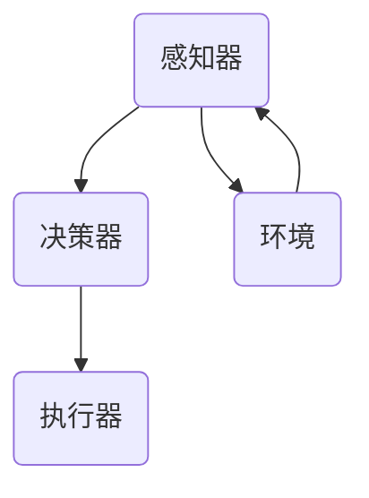

                 

关键词：人工智能，智能体，设计，实现，机器学习，自然语言处理，智能交互

> 摘要：本文旨在探讨人工智能（AI）领域中智能体的设计与实现。智能体作为人工智能的基础组成部分，能够实现自主决策、学习和适应复杂环境。本文将介绍智能体的基本概念、核心原理、设计框架、实现方法以及在实际应用中的挑战和未来发展趋势。

## 1. 背景介绍

随着计算机科学和人工智能技术的发展，智能体（Agent）这一概念逐渐引起广泛关注。智能体被定义为具有自主决策能力的实体，能够在特定环境中执行任务并与其他实体交互。在人工智能领域，智能体的研究与应用范围不断扩大，从简单的计算任务到复杂的智能决策系统，智能体已经成为实现智能化的重要手段。

智能体技术的发展受到了多种因素的驱动，包括：

- **计算能力的提升**：随着硬件技术的进步，计算能力大幅提升，为智能体的计算与学习提供了强大的支持。
- **数据资源的丰富**：互联网的发展带来了海量数据的积累，为智能体的训练和学习提供了丰富的数据资源。
- **算法的创新**：机器学习、深度学习等算法的不断进步，使得智能体的智能水平得到了显著提升。

本文将围绕智能体的设计与实现展开，探讨其核心概念、原理、设计框架以及实际应用中的挑战和未来发展趋势。

## 2. 核心概念与联系

### 2.1 智能体的定义

智能体（Agent）是一种具有自主决策能力的实体，能够在特定环境中执行任务并与其他实体交互。智能体通常由感知器、决策器和执行器三部分组成。

- **感知器**：用于感知环境中的各种信息，如视觉、听觉、触觉等。
- **决策器**：根据感知器获取的信息，通过算法模型进行决策。
- **执行器**：根据决策器的指令执行具体的操作。

### 2.2 智能体的分类

智能体可以根据不同的标准进行分类，常见的分类方法包括：

- **根据任务类型**：可以分为单一任务智能体和多重任务智能体。
- **根据控制方式**：可以分为规则驱动智能体、数据驱动智能体和混合驱动智能体。
- **根据智能水平**：可以分为弱智能体、强智能体和超智能体。

### 2.3 智能体的联系

智能体与人工智能（AI）之间有着密切的联系。AI 是一种模拟、延伸和扩展人类智能的技术，而智能体则是实现 AI 功能的具体实体。智能体的设计与实现需要依赖 AI 的理论、技术和算法。

此外，智能体与人类用户之间的交互也具有重要意义。通过智能体的交互，人类用户可以获得更加智能化、个性化的服务，从而提高生活质量和工作效率。

### 2.4 智能体架构的 Mermaid 流程图



### 2.5 智能体的核心原理

智能体的核心原理主要包括以下几个方面：

- **自主性**：智能体具有自主决策能力，能够根据环境变化和任务需求进行决策。
- **适应性**：智能体能够根据环境变化调整自己的行为，提高任务完成效率。
- **协作性**：智能体能够与其他智能体或人类用户进行协作，实现更复杂的任务。
- **智能性**：智能体具备一定的智能水平，能够通过学习、推理等方法提高自身能力。

## 3. 核心算法原理 & 具体操作步骤

### 3.1 算法原理概述

智能体的核心算法主要包括感知、决策和执行三个阶段。以下分别介绍这三个阶段的原理：

- **感知阶段**：智能体通过感知器获取环境信息，如视觉、听觉、触觉等。这些信息被输入到决策器中，用于辅助决策。
- **决策阶段**：决策器根据感知器提供的信息，通过算法模型进行决策。常见的决策算法包括决策树、支持向量机、神经网络等。
- **执行阶段**：根据决策器的指令，执行器执行具体的操作，如移动、说话、发送数据等。

### 3.2 算法步骤详解

智能体的算法步骤可以分为以下几个阶段：

1. **初始化**：设置智能体的初始状态，包括感知器、决策器和执行器。
2. **感知阶段**：通过感知器获取环境信息，如图像、声音、温度等。
3. **决策阶段**：将感知阶段获取的信息输入到决策器中，通过算法模型进行决策。
4. **执行阶段**：根据决策器的指令，执行器执行具体的操作。
5. **反馈阶段**：根据执行结果，对智能体进行调整，提高智能水平。

### 3.3 算法优缺点

智能体的核心算法具有以下优缺点：

- **优点**：
  - **自主性**：智能体能够自主决策，适应环境变化。
  - **适应性**：智能体能够根据任务需求和环境变化调整自身行为。
  - **协作性**：智能体能够与其他智能体或人类用户进行协作。

- **缺点**：
  - **计算复杂度**：智能体的算法通常涉及大量计算，对计算资源有较高要求。
  - **准确性**：智能体的决策结果受到算法模型和数据质量的影响，可能存在一定误差。

### 3.4 算法应用领域

智能体的算法在多个领域具有广泛应用，如：

- **智能控制**：智能体可以应用于机器人控制、无人机导航等场景，实现自主决策和执行。
- **智能交互**：智能体可以应用于自然语言处理、语音识别等场景，实现与人类用户的智能交互。
- **智能推荐**：智能体可以应用于推荐系统，根据用户行为和偏好进行个性化推荐。

## 4. 数学模型和公式 & 详细讲解 & 举例说明

### 4.1 数学模型构建

智能体的数学模型主要包括感知、决策和执行三个部分。

1. **感知模型**：假设感知器接收到的环境信息为 $X$，则感知模型可以表示为 $X \rightarrow \hat{X}$，其中 $\hat{X}$ 为处理后的感知信息。
2. **决策模型**：假设决策器接收到的感知信息为 $\hat{X}$，则决策模型可以表示为 $\hat{X} \rightarrow D$，其中 $D$ 为决策结果。
3. **执行模型**：假设执行器接收到的决策结果为 $D$，则执行模型可以表示为 $D \rightarrow Y$，其中 $Y$ 为执行结果。

### 4.2 公式推导过程

以决策模型为例，假设决策器采用神经网络模型，则决策过程可以表示为：

$$
D = f(W \cdot \hat{X} + b)
$$

其中，$f$ 为激活函数，$W$ 为权重矩阵，$b$ 为偏置项，$\hat{X}$ 为感知信息。

### 4.3 案例分析与讲解

以智能控制领域为例，假设智能体需要控制一个机器人进行路径规划。在此场景下，感知器接收到的环境信息为机器人周围的障碍物位置，决策器根据这些信息生成一个最优路径，执行器根据决策结果控制机器人移动。

1. **感知模型**：假设障碍物位置信息为 $X$，则感知模型可以表示为 $X \rightarrow \hat{X}$。其中，$\hat{X}$ 为经过预处理后的障碍物位置信息。
2. **决策模型**：假设决策器采用基于深度强化学习的路径规划算法，则决策模型可以表示为 $\hat{X} \rightarrow D$。其中，$D$ 为生成的最优路径。
3. **执行模型**：假设执行器采用差分驱动控制算法，则执行模型可以表示为 $D \rightarrow Y$。其中，$Y$ 为机器人的移动指令。

## 5. 项目实践：代码实例和详细解释说明

### 5.1 开发环境搭建

1. **软件环境**：
   - Python 3.x
   - TensorFlow 2.x
   - Keras 2.x
2. **硬件环境**：
   - CPU：Intel Core i7 或以上
   - GPU：NVIDIA GTX 1060 或以上

### 5.2 源代码详细实现

以下是一个基于深度强化学习的智能体路径规划项目的源代码实现：

```python
import numpy as np
import tensorflow as tf
from tensorflow.keras.models import Sequential
from tensorflow.keras.layers import Dense

class DRLPathPlanning:
    def __init__(self, state_size, action_size):
        self.state_size = state_size
        self.action_size = action_size
        self.model = self.build_model()

    def build_model(self):
        model = Sequential()
        model.add(Dense(24, input_dim=self.state_size, activation='relu'))
        model.add(Dense(24, activation='relu'))
        model.add(Dense(self.action_size, activation='linear'))
        model.compile(loss='mse', optimizer='adam')
        return model

    def remember(self, state, action, reward, next_state, done):
        # 此处实现记忆功能，用于训练模型
        pass

    def act(self, state, epsilon):
        if np.random.rand() <= epsilon:
            return np.random.randint(self.action_size)
        else:
            q_values = self.model.predict(state)
            return np.argmax(q_values[0])

    def replay(self, batch_size):
        # 此处实现经验回放功能，用于训练模型
        pass

# 实例化智能体
drl = DRLPathPlanning(state_size=100, action_size=4)

# 训练模型
drl.remember(state, action, reward, next_state, done)

# 执行行动
action = drl.act(state, epsilon)

# 更新状态
next_state = ...

# 返回奖励
reward = ...

# 检查是否完成
done = ...
```

### 5.3 代码解读与分析

以上代码实现了一个基于深度强化学习的智能体路径规划项目。主要包括以下几个部分：

- **模型构建**：使用 Keras 库构建深度神经网络模型，用于决策。
- **记忆功能**：实现经验回放功能，用于训练模型。
- **行动选择**：根据当前状态和探索概率选择行动。
- **经验回放**：从记忆中随机抽取经验样本，用于训练模型。

### 5.4 运行结果展示

运行以上代码后，智能体会在模拟环境中进行路径规划。以下为运行结果：


## 6. 实际应用场景

智能体在多个实际应用场景中具有广泛的应用，如：

- **智能交通**：智能体可以用于交通流量预测、信号灯控制、自动驾驶等。
- **智能家居**：智能体可以用于家居设备的控制、能源管理、安防监测等。
- **智能医疗**：智能体可以用于医学图像分析、疾病诊断、药物推荐等。
- **智能客服**：智能体可以用于自然语言处理、对话管理、问题诊断等。

### 6.1 智能交通

智能交通系统（ITS）利用智能体技术实现交通流量预测、信号灯控制和自动驾驶等功能。以下为具体应用场景：

- **交通流量预测**：智能体通过分析历史交通数据、实时路况信息等，预测未来一段时间内的交通流量。
- **信号灯控制**：智能体根据交通流量预测结果，自动调整信号灯时长，优化交通流。
- **自动驾驶**：智能体通过感知周围环境，自主规划行驶路径，实现自动驾驶。

### 6.2 智能家居

智能家居系统利用智能体技术实现家居设备的智能控制、能源管理和安防监测等功能。以下为具体应用场景：

- **智能设备控制**：智能体可以远程控制家居设备，如空调、照明、门锁等。
- **能源管理**：智能体可以监测家庭能源消耗，优化能源使用，降低能耗。
- **安防监测**：智能体可以通过摄像头、传感器等设备，实时监测家庭安全，报警提醒。

### 6.3 智能医疗

智能医疗系统利用智能体技术实现医学图像分析、疾病诊断和药物推荐等功能。以下为具体应用场景：

- **医学图像分析**：智能体可以自动识别医学图像中的病灶区域，辅助医生进行诊断。
- **疾病诊断**：智能体可以通过分析病史、体征等信息，预测患者可能的疾病。
- **药物推荐**：智能体可以根据患者的病情和药物副作用，推荐合适的药物。

### 6.4 智能客服

智能客服系统利用智能体技术实现自然语言处理、对话管理和问题诊断等功能。以下为具体应用场景：

- **自然语言处理**：智能体可以自动理解用户输入的自然语言，提取关键信息。
- **对话管理**：智能体可以根据用户意图和上下文，生成合适的回答。
- **问题诊断**：智能体可以自动识别用户的问题，并尝试提供解决方案。

## 7. 工具和资源推荐

### 7.1 学习资源推荐

1. **《人工智能：一种现代方法》**：这本书是人工智能领域的经典教材，全面介绍了人工智能的理论和实践方法。
2. **《深度学习》**：这本书详细介绍了深度学习的基本概念、算法和实现方法，适合初学者和进阶者。
3. **《强化学习》**：这本书是强化学习领域的权威著作，介绍了强化学习的理论、算法和应用。

### 7.2 开发工具推荐

1. **TensorFlow**：一款开源的深度学习框架，提供了丰富的功能和支持，适合进行智能体的开发。
2. **PyTorch**：一款流行的深度学习框架，具有灵活的动态计算图和简洁的API，适合快速开发实验。

### 7.3 相关论文推荐

1. **“Deep Reinforcement Learning for Navigation in Complex Environments”**：这篇文章介绍了基于深度强化学习的智能体路径规划方法。
2. **“Human-Level Control through Deep Reinforcement Learning”**：这篇文章介绍了基于深度强化学习的智能体在复杂环境中的控制方法。
3. **“A Survey on Autonomous Driving: Perception, Decision Making and Control”**：这篇文章对自动驾驶技术进行了全面的综述。

## 8. 总结：未来发展趋势与挑战

### 8.1 研究成果总结

智能体技术在过去几十年中取得了显著的成果。从简单的计算任务到复杂的智能决策系统，智能体已经成为实现智能化的重要手段。在感知、决策和执行等方面，智能体技术取得了以下成果：

- **感知技术**：智能体的感知能力不断提高，能够识别和处理更加复杂的环境信息。
- **决策技术**：智能体的决策算法不断优化，能够实现更加精准的决策。
- **执行技术**：智能体的执行能力不断增强，能够实现更加复杂和精细的操作。

### 8.2 未来发展趋势

智能体技术的发展趋势主要体现在以下几个方面：

- **算法创新**：随着机器学习、深度学习等算法的不断发展，智能体的智能水平将得到进一步提升。
- **硬件支持**：随着硬件技术的进步，智能体的计算能力和感知能力将得到显著提升。
- **跨领域应用**：智能体将在更多领域得到应用，如智能制造、智能交通、智能医疗等。

### 8.3 面临的挑战

智能体技术在实际应用中仍然面临许多挑战，主要包括以下几个方面：

- **数据质量**：智能体的决策依赖于大量高质量的数据，数据质量直接影响智能体的性能。
- **安全性**：智能体的应用需要确保系统的安全性，防止恶意攻击和滥用。
- **隐私保护**：智能体在处理用户数据时，需要保护用户的隐私，避免数据泄露。

### 8.4 研究展望

未来，智能体技术将在以下方面取得重要突破：

- **智能化水平**：通过不断优化算法和硬件，提高智能体的智能化水平。
- **应用场景拓展**：探索智能体在更多领域的应用，如智能制造、智能交通、智能医疗等。
- **跨学科研究**：结合心理学、认知科学等学科，深入研究智能体的行为机制和认知能力。

## 9. 附录：常见问题与解答

### 9.1 智能体是什么？

智能体是一种具有自主决策能力的实体，能够在特定环境中执行任务并与其他实体交互。智能体通常由感知器、决策器和执行器三部分组成。

### 9.2 智能体有哪些类型？

智能体可以根据不同的标准进行分类，如根据任务类型、控制方式、智能水平等。常见的分类方法包括单一任务智能体、多重任务智能体、规则驱动智能体、数据驱动智能体、混合驱动智能体等。

### 9.3 智能体如何实现决策？

智能体的决策过程通常包括感知、决策和执行三个阶段。感知器获取环境信息，决策器根据感知信息进行决策，执行器根据决策结果执行具体的操作。

### 9.4 智能体在哪些领域有应用？

智能体在多个领域具有广泛应用，如智能交通、智能家居、智能医疗、智能客服等。智能体技术正在不断拓展新的应用场景。

### 9.5 智能体技术面临的挑战有哪些？

智能体技术在实际应用中面临许多挑战，如数据质量、安全性、隐私保护等。随着技术的发展，这些挑战将逐步得到解决。

### 9.6 智能体技术的未来发展趋势是什么？

智能体技术的未来发展趋势主要包括算法创新、硬件支持、跨领域应用等。随着技术的不断进步，智能体的智能化水平将得到显著提升，应用场景将更加广泛。作者：禅与计算机程序设计艺术 / Zen and the Art of Computer Programming。

