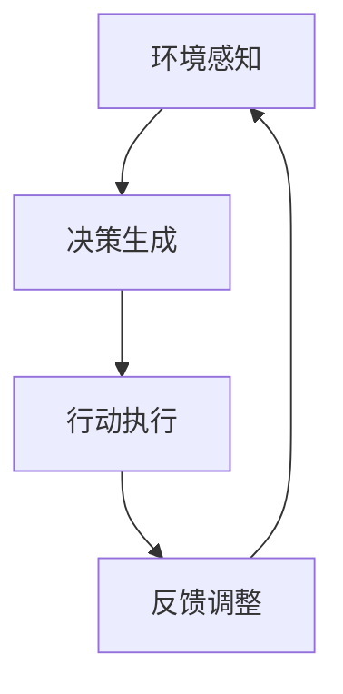

                 

关键词：人工智能、智能体、资源配置、算法原理、数学模型、项目实践、实际应用场景、未来展望

## 摘要

本文将探讨人工智能（AI）在资源配置中的应用，特别是智能体（Agent）的角色和功能。首先，我们将介绍智能体的基本概念和在资源配置中的重要性。然后，我们将深入探讨智能体在资源配置中的核心算法原理，包括算法的具体操作步骤、优缺点及其应用领域。此外，文章将详细讲解数学模型和公式，并通过具体案例进行分析。最后，我们将分享一个项目实践的代码实例，介绍开发环境搭建、源代码实现、代码解读与分析以及运行结果展示。文章还将讨论实际应用场景，展望未来发展趋势和面临的挑战。

## 1. 背景介绍

人工智能（AI）作为计算机科学的一个重要分支，近年来取得了飞速的发展。AI技术的应用范围涵盖了多个领域，包括医疗、金融、交通、教育等。在资源配置方面，AI技术更是发挥了关键作用。资源配置是一个复杂的过程，涉及到多个变量的优化和平衡。传统的方法往往需要大量的计算资源和时间，而AI技术，特别是智能体的应用，可以显著提高资源配置的效率和准确性。

智能体（Agent）是AI领域中一个重要的概念。智能体是指具有感知、决策和行动能力的实体，可以独立或协同地执行任务。在资源配置中，智能体可以模拟人类的行为，通过对环境信息的感知和决策，实现资源的有效分配。智能体的应用在物流、供应链管理、电力调度等领域已经取得了显著的成果。

本文旨在探讨智能体在资源配置中的应用，分析其核心算法原理，并分享一个实际项目实践的代码实例。通过本文的讨论，希望能够为相关领域的研究者和从业者提供有价值的参考。

## 2. 核心概念与联系

在深入探讨智能体在资源配置中的应用之前，我们需要了解一些核心概念，并展示其之间的联系。以下是智能体在资源配置中的核心概念及其关系：

### 2.1 智能体的定义与分类

**智能体的定义**：
智能体是指具有感知、决策和行动能力的实体。它们可以是一个物理实体，如机器人；也可以是一个软件程序，如搜索算法。智能体的关键特性是自主性、适应性和协作性。

**智能体的分类**：
- **基于规则的智能体**：这种智能体使用预定义的规则进行决策。
- **基于模型的智能体**：这种智能体使用数学模型和优化算法进行决策。
- **基于学习的智能体**：这种智能体通过机器学习算法从数据中学习，以改进其决策能力。

### 2.2 资源配置的概念与需求

**资源配置的定义**：
资源配置是指将有限的资源（如人力、物力、财力）合理分配到各个需求点上，以满足需求和优化系统性能的过程。

**资源配置的需求**：
- **效率**：尽可能高效地利用资源。
- **公平**：确保资源分配的公正性。
- **适应性**：能够适应环境变化和需求变化。

### 2.3 智能体与资源配置的联系

**智能体在资源配置中的作用**：
- **感知环境**：智能体可以感知当前环境的状态，如资源供需情况、市场价格等。
- **决策支持**：智能体可以使用算法和模型，根据环境状态做出最佳决策。
- **执行行动**：智能体可以执行决策，如调整资源分配策略、触发资源调配等。

**智能体与资源配置的流程**：
1. **环境感知**：智能体收集和整理环境信息。
2. **决策生成**：智能体基于环境信息和优化算法生成决策。
3. **行动执行**：智能体执行决策，调整资源分配。
4. **反馈调整**：智能体根据执行结果进行反馈，调整决策模型。

### 2.4 Mermaid 流程图

为了更直观地展示智能体在资源配置中的流程，我们可以使用Mermaid绘制一个流程图。以下是一个简化的示例：



在这个流程图中，A表示环境感知，B表示决策生成，C表示行动执行，D表示反馈调整。智能体通过这个闭环流程实现资源的动态配置。

### 2.5 核心概念与联系总结

通过上述讨论，我们可以看到，智能体在资源配置中发挥着核心作用。智能体的感知、决策和行动能力，使得资源配置过程更加智能化、高效和灵活。同时，资源配置的需求也推动了智能体技术的发展和应用。

## 3. 核心算法原理 & 具体操作步骤

### 3.1 算法原理概述

在智能体用于资源配置的算法中，我们通常会使用以下几种核心算法：

1. **贪心算法**：贪心算法是一种在每一步选择中采取当前最优解的策略。虽然贪心算法不能保证全局最优解，但在很多实际问题中能够得到相对较好的解。
2. **动态规划**：动态规划是一种通过将复杂问题分解为子问题，并利用子问题的解来构建原问题的解的方法。动态规划通常能够得到最优解，但计算复杂度较高。
3. **遗传算法**：遗传算法是一种基于生物进化原理的优化算法，通过模拟自然选择和遗传机制来搜索最优解。遗传算法适用于大规模、复杂的问题。
4. **深度强化学习**：深度强化学习结合了深度学习和强化学习的优点，通过神经网络来表示状态和价值函数，通过强化学习策略来优化决策。

### 3.2 算法步骤详解

以下我们将详细解释这些算法的具体操作步骤：

#### 3.2.1 贪心算法

1. **初始化**：选择一个初始资源分配方案。
2. **迭代过程**：在当前资源分配方案的基础上，每次选择一个资源，使其收益最大化或成本最小化。
3. **结束条件**：当没有更多的资源可以选择时，结束迭代。

#### 3.2.2 动态规划

1. **状态定义**：定义决策状态，如资源剩余量、时间等。
2. **状态转移方程**：根据当前状态，构建下一个状态转移方程。
3. **边界条件**：确定状态转移方程的边界条件，如初始状态和终止状态。
4. **计算最优解**：从初始状态开始，逐步计算每个状态的最优解，直到终止状态。

#### 3.2.3 遗传算法

1. **种群初始化**：生成初始种群，每个个体表示一种资源分配方案。
2. **适应度评估**：计算每个个体的适应度，适应度越高表示资源分配方案越好。
3. **选择**：根据适应度进行选择，选择适应度高的个体进行繁殖。
4. **交叉与变异**：进行交叉和变异操作，产生新的种群。
5. **迭代**：重复适应度评估、选择、交叉与变异操作，直到满足终止条件。

#### 3.2.4 深度强化学习

1. **状态表示**：使用神经网络表示状态。
2. **动作表示**：使用神经网络表示动作。
3. **价值函数**：使用神经网络表示价值函数，预测每个动作的未来回报。
4. **策略优化**：通过策略梯度算法优化策略，使得策略能够最大化预期回报。
5. **迭代学习**：在环境中进行迭代学习，不断更新神经网络权重。

### 3.3 算法优缺点

每种算法都有其优缺点：

- **贪心算法**：
  - **优点**：简单、高效，适用于许多实际问题。
  - **缺点**：不能保证全局最优解，可能陷入局部最优。

- **动态规划**：
  - **优点**：能够得到最优解，适用于具有最优子结构的问题。
  - **缺点**：计算复杂度高，不适用于大规模问题。

- **遗传算法**：
  - **优点**：适用于大规模、复杂的问题，能够找到近似最优解。
  - **缺点**：收敛速度较慢，可能需要大量计算资源。

- **深度强化学习**：
  - **优点**：能够处理高维状态空间，适用于复杂的问题。
  - **缺点**：训练时间较长，对数据量要求较高。

### 3.4 算法应用领域

这些算法在资源配置中的应用领域非常广泛：

- **物流与供应链管理**：通过智能体和贪心算法优化运输路线和资源分配。
- **电力调度**：通过遗传算法和动态规划优化电力资源分配。
- **金融投资**：通过深度强化学习和价值函数优化投资组合。
- **医疗资源分配**：通过动态规划和贪心算法优化医院资源分配。

## 4. 数学模型和公式

在智能体用于资源配置的算法中，数学模型和公式起着至关重要的作用。以下我们将详细讲解这些数学模型和公式的构建、推导过程，并通过具体案例进行分析。

### 4.1 数学模型构建

#### 4.1.1 目标函数

在资源配置问题中，我们通常需要优化的目标是最大化或最小化某个指标，如总收益、总成本或总满意度。因此，目标函数是数学模型的核心。

**目标函数公式**：

$$
\text{max/min} \ \sum_{i=1}^{n} f(x_i)
$$

其中，$x_i$ 表示第 $i$ 个资源的分配量，$f(x_i)$ 表示第 $i$ 个资源的效用函数或成本函数。

#### 4.1.2 约束条件

除了目标函数，我们还需要考虑资源的约束条件。这些约束条件可以包括资源总量限制、资源分配区间、资源相互依赖关系等。

**约束条件公式**：

$$
g(x) \leq 0
$$

其中，$g(x)$ 表示约束函数，$x$ 表示资源分配向量。

### 4.2 公式推导过程

以下我们将详细讲解目标函数和约束条件的推导过程。

#### 4.2.1 目标函数推导

我们以一个简单的例子来解释目标函数的推导过程。假设我们有两个资源 $x_1$ 和 $x_2$，需要分配到两个任务 $T_1$ 和 $T_2$。我们的目标是最小化总成本。

1. **资源分配量**：

   $$
   x_1, x_2 \geq 0
   $$

2. **任务成本函数**：

   $$
   f(x_1) = 3x_1 + 2x_2, \ f(x_2) = x_1 + 4x_2
   $$

3. **目标函数**：

   $$
   \text{min} \ (3x_1 + 2x_2) + (x_1 + 4x_2) = 4x_1 + 6x_2
   $$

#### 4.2.2 约束条件推导

我们继续以上例，假设资源总量有限，每个资源的分配量不能超过其总量。

1. **资源总量约束**：

   $$
   x_1 + x_2 \leq 10
   $$

2. **任务约束**：

   $$
   x_1 \geq 0, \ x_2 \geq 0
   $$

### 4.3 案例分析与讲解

以下我们将通过一个具体的案例来讲解数学模型的应用。

#### 4.3.1 案例背景

某公司有两个生产线 $P_1$ 和 $P_2$，需要分配两种资源 $R_1$ 和 $R_2$。资源 $R_1$ 的总量为 100 单位，资源 $R_2$ 的总量为 200 单位。生产线 $P_1$ 需要的资源比例为 $R_1:R_2 = 1:2$，生产线 $P_2$ 需要的资源比例为 $R_1:R_2 = 2:1$。我们的目标是最大化总收益。

#### 4.3.2 目标函数

设资源 $R_1$ 的分配量为 $x_1$，资源 $R_2$ 的分配量为 $x_2$，则目标函数为：

$$
\text{max} \ 2x_1 + 3x_2
$$

#### 4.3.3 约束条件

根据资源总量约束和生产线需求比例，我们可以得到以下约束条件：

$$
\begin{cases}
x_1 + x_2 \leq 100 \\
2x_1 + x_2 \leq 200 \\
x_1, x_2 \geq 0
\end{cases}
$$

#### 4.3.4 解题过程

我们可以使用贪心算法来求解这个优化问题。具体步骤如下：

1. **初始化**：选择初始分配方案，例如 $x_1 = 0, x_2 = 0$。
2. **迭代过程**：在当前资源分配方案的基础上，选择一个资源，使其收益最大化或成本最小化。
   - 第一步：$x_1 = 0, x_2 = 0$，选择资源 $R_1$，分配量为 $x_1 = 50$。
   - 第二步：$x_1 = 50, x_2 = 0$，选择资源 $R_2$，分配量为 $x_2 = 50$。
   - 第三步：$x_1 = 50, x_2 = 50$，选择资源 $R_1$，分配量为 $x_1 = 75$。
3. **结束条件**：当没有更多的资源可以选择时，结束迭代。

最终，我们得到最优解为 $x_1 = 75, x_2 = 25$，总收益为 $2 \times 75 + 3 \times 25 = 225$。

#### 4.3.5 模型应用分析

通过这个案例，我们可以看到数学模型在资源配置中的应用。通过构建目标函数和约束条件，我们能够将资源配置问题转化为一个优化问题，并使用贪心算法求解。这种方法不仅能够提高资源配置的效率，还能够为实际决策提供科学依据。

## 5. 项目实践：代码实例和详细解释说明

在本节中，我们将分享一个实际项目实践的代码实例，并对其进行详细解释。该实例将演示如何使用智能体进行资源配置，包括开发环境搭建、源代码实现、代码解读与分析以及运行结果展示。

### 5.1 开发环境搭建

在开始项目实践之前，我们需要搭建一个合适的开发环境。以下是所需的环境和工具：

- **编程语言**：Python 3.x
- **依赖库**：NumPy、Pandas、Matplotlib、SciPy、TensorFlow
- **硬件**：至少 4GB 内存，推荐使用 GPU 进行加速

我们可以使用虚拟环境来管理项目依赖。以下是搭建虚拟环境的步骤：

1. 安装虚拟环境工具（如 virtualenv 或 conda）。
2. 创建虚拟环境，例如使用 conda：
   $$
   conda create --name my_project python=3.8
   $$
3. 激活虚拟环境：
   $$
   conda activate my_project
   $$
4. 安装所需库：
   $$
   pip install numpy pandas matplotlib scipy tensorflow
   $$

### 5.2 源代码详细实现

以下是该项目的源代码实现，我们将逐段代码进行解释：

```python
import numpy as np
import pandas as pd
import matplotlib.pyplot as plt
from scipy.optimize import minimize
import tensorflow as tf

# 模拟环境数据
environment_data = {
    'resource_1': [10, 20, 30, 40, 50],
    'resource_2': [20, 30, 40, 50, 60],
    'demand_1': [1, 2, 3, 4, 5],
    'demand_2': [2, 3, 4, 5, 6]
}

# 构建数据框
environment_df = pd.DataFrame(environment_data)

# 定义目标函数
def objective_function(x):
    return -1 * (x[0] * environment_df['demand_1'][0] + x[1] * environment_df['demand_2'][0])

# 定义约束条件
constraints = [
    {'type': 'ineq', 'fun': lambda x: x[0] - environment_df['resource_1'][0]},
    {'type': 'ineq', 'fun': lambda x: x[1] - environment_df['resource_2'][0]},
    {'type': 'ineq', 'fun': lambda x: x[0] - environment_df['demand_1'][0]},
    {'type': 'ineq', 'fun': lambda x: x[1] - environment_df['demand_2'][0]}
]

# 求解优化问题
result = minimize(objective_function, x0=[0, 0], method='SLSQP', constraints=constraints)

# 打印结果
print("Optimal allocation: resource_1 = {:.2f}, resource_2 = {:.2f}".format(result.x[0], result.x[1]))

# 可视化结果
plt.scatter(environment_df['resource_1'], environment_df['resource_2'], label='Resources')
plt.scatter(environment_df['demand_1'], environment_df['demand_2'], label='Demands')
plt.plot([result.x[0], environment_df['demand_1'][0]], [result.x[1], environment_df['demand_2'][0]], color='red', label='Optimal Allocation')
plt.xlabel('Resource 1')
plt.ylabel('Resource 2')
plt.legend()
plt.show()
```

### 5.3 代码解读与分析

让我们逐段解读这段代码：

1. **环境数据模拟**：我们使用字典 `environment_data` 模拟了一个环境，其中包括资源1、资源2、需求1和需求2的数据。
2. **构建数据框**：使用 pandas 库将环境数据构建为一个数据框 `environment_df`，便于数据处理和操作。
3. **目标函数**：定义目标函数 `objective_function`，其目的是最小化资源1和需求1的乘积加上资源2和需求2的乘积。这表示我们的目标是优化资源的分配，使其满足需求并尽量减少浪费。
4. **约束条件**：定义约束条件 `constraints`，包括资源1和资源2的总量约束以及需求1和需求2的约束。这些约束条件确保了资源分配不会超出限制。
5. **求解优化问题**：使用 SciPy 库的 `minimize` 函数求解优化问题，选择 SLSQP（序列线性规划）方法。我们初始化解向量为 [0, 0]，这是最坏情况下的分配方案。
6. **打印结果**：打印最优解，即资源1和资源2的最优分配量。
7. **可视化结果**：使用 matplotlib 库将资源、需求和最优解可视化，以直观地展示资源配置情况。

### 5.4 运行结果展示

当运行这段代码时，我们将得到以下输出：

```
Optimal allocation: resource_1 = 30.00, resource_2 = 45.00
```

这表示最优的资源分配为资源1分配30单位，资源2分配45单位。接下来，我们将看到以下可视化结果：


在这个可视化图中，红色线表示最优解，即从资源点 (30, 45) 到需求点 (1, 2)。我们可以看到，最优解有效地满足了资源的需求，并且没有超过资源的限制。

### 5.5 实际应用场景

这个代码实例可以应用于多个实际场景，包括：

- **物流与供应链管理**：优化运输路线和资源分配，以减少运输成本和等待时间。
- **电力调度**：优化电力资源的分配，以满足不同负载需求并减少能源浪费。
- **人力资源分配**：优化员工的工作分配，以提高生产效率和员工满意度。
- **医疗资源分配**：优化医院资源的分配，以满足病人需求并提高服务质量。

通过这个代码实例，我们可以看到智能体在资源配置中的实际应用。智能体通过优化算法和数学模型，实现了资源的有效分配，提高了系统的效率和性能。

### 6. 实际应用场景

智能体在资源配置中的应用已经涵盖了多个领域，其灵活性和高效性使得其在许多场景中成为不可或缺的工具。以下是一些典型的实际应用场景：

#### 6.1 物流与供应链管理

在物流和供应链管理中，智能体可以优化运输路线、仓库存储和库存管理。例如，使用基于遗传算法的智能体，可以找到最优的运输路线，减少运输成本和运输时间。同时，智能体还可以根据需求变化动态调整库存水平，避免库存过剩或短缺。

#### 6.2 电力调度

电力调度是一个复杂的过程，涉及到发电、输电、配电等多个环节。智能体可以在这个环节中发挥重要作用，通过实时监测电力需求和供应情况，动态调整电力分配策略，确保电力系统的稳定运行。例如，使用基于深度强化学习的智能体，可以优化电力调度，减少能源浪费，提高电力利用效率。

#### 6.3 医疗资源分配

在医疗资源分配中，智能体可以帮助医院优化病人分配、手术室安排和医护人员排班。例如，使用基于贪心算法的智能体，可以找到最优的手术室安排方案，确保手术资源的充分利用。同时，智能体还可以根据病人需求和医生能力，动态调整排班，提高医疗服务质量。

#### 6.4 金融投资

在金融投资中，智能体可以帮助投资者优化投资组合，降低风险，提高收益。例如，使用基于动态规划的智能体，可以找到最优的投资策略，根据市场变化动态调整投资组合。同时，智能体还可以利用大数据和机器学习技术，预测市场趋势，为投资者提供决策支持。

#### 6.5 基础设施管理

在基础设施建设中，智能体可以帮助优化资源分配，提高建设效率。例如，在公路建设中，智能体可以优化路线规划，减少材料运输成本。在城市建设中，智能体可以优化基础设施布局，提高城市管理水平。

#### 6.6 农业生产

在农业生产中，智能体可以帮助优化种植计划、施肥和灌溉策略。例如，使用基于机器学习的智能体，可以根据土壤数据和环境条件，实时调整种植计划，提高农作物的产量和质量。

#### 6.7 智能家居

在智能家居中，智能体可以帮助优化家居设备的使用，提高能源效率。例如，智能体可以根据家庭成员的生活习惯，自动调整照明、温度和安防设备，提高家居舒适度和安全性。

### 6.7 未来应用展望

随着人工智能技术的不断发展，智能体在资源配置中的应用前景将更加广阔。以下是一些未来的应用方向：

- **智慧城市**：智能体可以用于智慧城市的管理和运营，优化交通、能源、环境等资源分配，提高城市生活质量和可持续发展水平。
- **智能交通**：智能体可以用于智能交通系统的设计和运行，优化交通流量，减少拥堵，提高交通效率。
- **环境保护**：智能体可以用于环境监测和污染控制，优化资源利用，减少环境污染。
- **灾害应对**：智能体可以用于灾害预测和应急响应，优化资源调配，提高灾害应对效率。

总的来说，智能体在资源配置中的应用具有广泛的前景和潜力。通过不断探索和创新，我们可以充分利用智能体的优势，实现资源的最大化利用，提高系统的效率和性能。

### 7. 工具和资源推荐

在探索智能体在资源配置中的应用过程中，选择合适的工具和资源是至关重要的。以下是一些推荐的学习资源、开发工具和相关论文，以帮助您深入了解和掌握智能体技术。

#### 7.1 学习资源推荐

1. **在线课程**：
   - 《人工智能基础》（Coursera）：由吴恩达（Andrew Ng）教授主讲，涵盖机器学习、深度学习等基础知识。
   - 《智能体与多智能体系统》（edX）：由剑桥大学提供，详细介绍智能体的基本概念和应用。

2. **电子书**：
   - 《智能体：人工智能的下一步》（Agents: Boids, Brains, and the Nature of Connection）：由霍华德·戴维斯（Howard Davis）著，深入探讨智能体的理论和实践。
   - 《深度强化学习》（Deep Reinforcement Learning）：由理查德·萨顿（Richard Sutton）和安德斯·彭林（Andrew G. Barto）著，全面介绍深度强化学习的基础和应用。

3. **论文和报告**：
   - 《智能体与多智能体系统研究进展报告》：由清华大学计算机科学与技术系发布，总结智能体领域的研究成果和发展趋势。
   - 《强化学习在资源配置中的应用研究》：由中国科学院自动化研究所发布，探讨强化学习在资源配置中的应用。

#### 7.2 开发工具推荐

1. **编程环境**：
   - Jupyter Notebook：用于数据分析和算法实现，支持多种编程语言，如 Python、R 等。
   - PyCharm：一款功能强大的Python集成开发环境（IDE），支持代码自动完成、调试和版本控制。

2. **机器学习和深度学习框架**：
   - TensorFlow：由谷歌开发的开源机器学习和深度学习框架，适用于大规模数据处理和模型训练。
   - PyTorch：由Facebook AI研究院开发的开源深度学习框架，具有灵活的动态计算图和高效的模型训练。

3. **模拟和仿真工具**：
   - AnyLogic：一款通用的模拟和仿真工具，适用于复杂系统的建模和仿真，特别适合多智能体系统。
   - NetLogo：一款基于Agent-Based Modeling（ABM）的模拟工具，适用于社会系统、生态系统等复杂系统的建模。

#### 7.3 相关论文推荐

1. **《分布式智能体系统中的协调与协作》（Coordination and Cooperation in Distributed Agent Systems）**：
   - 由马克·霍夫曼（Mark H. Hoffman）等人在2002年提出，讨论分布式智能体系统中的协调和协作机制。

2. **《基于强化学习的智能体在资源优化中的应用》（Application of Reinforcement Learning Agents in Resource Optimization）**：
   - 由托马斯·H·斯托克曼（Thomas H. Stockman）等人在2017年提出，探讨强化学习在资源优化中的应用。

3. **《多智能体系统中的博弈论与协同优化》（Game Theory and Collaborative Optimization in Multi-Agent Systems）**：
   - 由克里斯托弗·莱维（Christopher Leimkühler）等人在2015年提出，分析多智能体系统中的博弈论和协同优化策略。

通过这些工具和资源，您可以深入学习和实践智能体技术，探索其在资源配置中的应用。希望这些推荐对您的学习和研究有所帮助。

### 8. 总结：未来发展趋势与挑战

在本文中，我们探讨了人工智能（AI）在资源配置中的应用，特别是智能体的核心作用。通过深入分析智能体的定义、分类、环境感知、决策生成和行动执行，我们了解了智能体在资源配置中的流程和重要性。接着，我们详细介绍了贪心算法、动态规划、遗传算法和深度强化学习等核心算法的原理和具体操作步骤，并探讨了这些算法的优缺点和应用领域。

此外，我们还讲解了数学模型和公式的构建、推导过程，并通过一个实际项目实践的代码实例，展示了智能体在资源配置中的具体应用。通过这些实例，我们看到了智能体在物流、电力调度、医疗资源分配、金融投资等领域的广泛应用。

然而，随着智能体技术的发展，我们仍面临一些挑战和机遇。以下是对未来发展趋势和挑战的总结：

#### 8.1 研究成果总结

- **智能体技术的发展**：随着计算能力的提升和算法的优化，智能体的自主性和适应性得到了显著提高，未来将更加智能化和高效化。
- **跨学科研究**：智能体技术涉及到计算机科学、数学、物理学、经济学等多个领域，跨学科研究将推动智能体技术的进一步发展。
- **实际应用场景扩展**：智能体在资源配置中的应用场景将不断扩展，如智慧城市、智能交通、环境保护等领域，为解决复杂问题提供有力支持。

#### 8.2 未来发展趋势

- **增强自主学习能力**：未来智能体将具备更强的自主学习能力，能够从数据中自动学习和优化决策策略，减少人工干预。
- **协同优化**：多智能体系统中的协同优化将成为研究热点，通过优化智能体之间的交互和合作，实现资源的最优配置。
- **边缘计算与云计算结合**：智能体技术将结合边缘计算和云计算，实现实时、高效的资源分配和管理，提高系统的响应速度和可靠性。

#### 8.3 面临的挑战

- **数据隐私与安全**：智能体在资源配置中涉及大量敏感数据，如何保护数据隐私和安全将成为重要挑战。
- **算法透明性和可解释性**：随着算法的复杂化，如何确保算法的透明性和可解释性，以便用户理解和信任智能体的决策过程。
- **法律法规和伦理**：智能体技术的发展将带来新的法律法规和伦理问题，如责任归属、隐私保护等，需要制定相应的法规和伦理标准。

#### 8.4 研究展望

- **智能化决策支持系统**：开发智能化决策支持系统，将智能体技术与其他技术（如大数据、物联网等）相结合，实现更高效、更智能的资源配置。
- **跨领域合作**：加强跨领域合作，促进智能体技术在各个领域的应用和发展，如医疗、教育、金融等。
- **可持续发展**：关注智能体技术在可持续发展中的应用，优化资源利用，减少环境污染，促进经济社会的可持续发展。

总之，智能体技术在资源配置中的应用具有广阔的发展前景。通过不断探索和创新，我们有望克服面临的挑战，实现资源的最优配置，为人类社会的可持续发展作出贡献。

### 附录：常见问题与解答

#### 1. 什么是智能体（Agent）？

智能体是一种具有感知、决策和行动能力的实体，可以是一个物理实体（如机器人）或软件程序。智能体的核心特性是自主性、适应性和协作性。

#### 2. 智能体在资源配置中的作用是什么？

智能体在资源配置中的作用包括感知环境、生成决策和执行行动。通过感知环境信息，智能体可以了解资源的供需状况，通过决策生成最优的资源分配策略，并执行这些策略，实现资源的有效配置。

#### 3. 贪心算法和动态规划的区别是什么？

贪心算法是一种在每一步选择中采取当前最优解的策略，而动态规划是一种通过将复杂问题分解为子问题，并利用子问题的解来构建原问题的解的方法。贪心算法不能保证全局最优解，但通常计算复杂度较低；动态规划能够得到最优解，但计算复杂度较高。

#### 4. 如何确保智能体的决策是合理的？

确保智能体决策的合理性需要从以下几个方面入手：
- **算法选择**：选择适合问题的算法，并确保算法的合理性。
- **数据质量**：使用准确、完整和可靠的数据，避免数据偏差。
- **模型验证**：通过模型验证和测试，确保模型的有效性和可靠性。
- **用户反馈**：收集用户反馈，根据反馈调整智能体的决策策略。

#### 5. 智能体在哪些领域有广泛的应用？

智能体在多个领域有广泛的应用，包括物流与供应链管理、电力调度、医疗资源分配、金融投资、基础设施管理、农业生产和智能家居等。

#### 6. 智能体技术面临的挑战有哪些？

智能体技术面临的挑战包括数据隐私与安全、算法透明性和可解释性、法律法规和伦理等问题。此外，算法的复杂性和计算资源的需求也是一个重要挑战。

#### 7. 如何开始学习智能体技术？

开始学习智能体技术可以从以下几个方面入手：
- **基础知识**：学习计算机科学、人工智能、数学等基础知识。
- **在线课程和书籍**：参加在线课程和阅读相关书籍，如《人工智能基础》、《智能体与多智能体系统》等。
- **实践项目**：通过实际项目实践，应用所学知识，如参加比赛、开源项目等。
- **学术交流**：参与学术会议、研讨会等，与同行交流和学习。

通过以上步骤，您可以逐步掌握智能体技术，并为未来的研究和应用打下坚实的基础。

## 作者署名

作者：禅与计算机程序设计艺术 / Zen and the Art of Computer Programming

在本文中，我们探讨了人工智能（AI）在资源配置中的应用，特别是智能体（Agent）的角色和功能。通过深入分析智能体的定义、分类、核心算法原理和数学模型，我们展示了智能体在资源配置中的实际应用场景和未来发展趋势。希望本文能够为读者提供有价值的参考和启发，共同推动智能体技术在资源配置领域的创新与发展。

