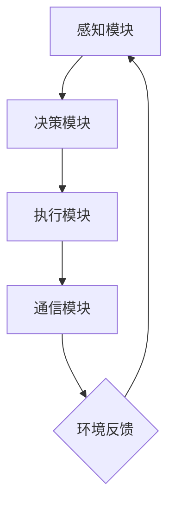

                 

关键词：人工智能，智能体，零售业，应用场景，算法，数学模型

> 摘要：随着人工智能技术的快速发展，智能体技术在零售业中的应用逐渐受到广泛关注。本文将探讨智能体在零售业中的具体应用场景，详细分析其核心算法原理、数学模型，并通过实际项目案例，展示智能体在零售业中的实践效果。同时，本文还将对智能体技术在零售业未来发展的趋势和挑战进行展望。

## 1. 背景介绍

零售业作为全球经济的重要组成部分，近年来正面临着巨大的变革。消费者需求的多样化、供应链的复杂化以及市场竞争的加剧，使得零售业亟需创新和转型。人工智能（AI）作为新一轮科技革命和产业变革的重要驱动力量，正被广泛应用于各个行业，零售业也不例外。智能体技术作为人工智能的一个重要分支，其具有自主决策、学习和适应能力，能够为零售业带来革命性的变化。

智能体（Agent）是指能够在特定环境中自主行动并实现目标的实体。在零售业中，智能体技术可以应用于库存管理、销售预测、客户服务等多个领域。例如，基于智能体的库存管理系统可以实时监测库存状态，自动调整采购和配送策略，从而减少库存成本和提高库存周转率。销售预测智能体则可以通过分析历史销售数据、市场趋势和消费者行为，为零售商提供精准的销售预测，帮助其优化库存和营销策略。

本文将围绕零售业中智能体的应用，详细探讨其核心算法原理、数学模型，并通过实际项目案例进行分析。旨在为零售业从业者提供有价值的参考和启示，推动智能体技术在零售业中的应用和发展。

## 2. 核心概念与联系

### 2.1 智能体的定义与特点

智能体是具有感知、决策、执行和自主学习能力的实体。其基本特点包括：

1. **自主性**：智能体能够在没有外部指令的情况下，根据环境和自身状态自主地选择行动。
2. **适应性**：智能体能够根据环境的变化和经验，不断调整和优化自己的行为策略。
3. **交互性**：智能体可以与其他智能体或环境中的实体进行信息交流和协作。

在零售业中，智能体的应用主要体现在以下几个方面：

1. **库存管理**：智能体可以实时监测库存状态，自动调整采购和配送策略。
2. **销售预测**：智能体可以通过分析历史销售数据、市场趋势和消费者行为，为零售商提供精准的销售预测。
3. **客户服务**：智能体可以提供24小时不间断的在线客服，为消费者提供个性化的购物建议和解决方案。

### 2.2 智能体与零售业的关系

智能体技术在零售业中的应用，主要体现在以下几个方面：

1. **提高运营效率**：通过智能体技术，零售商可以实现对库存、销售、客户等数据的实时监控和分析，从而提高运营效率。
2. **优化决策**：智能体技术可以帮助零售商更好地理解消费者需求和市场趋势，从而做出更科学的决策。
3. **提升客户体验**：智能体技术可以为消费者提供更加个性化和贴心的服务，提升客户满意度和忠诚度。

### 2.3 智能体的架构与通信机制

智能体的架构主要包括感知模块、决策模块、执行模块和通信模块。感知模块负责获取环境信息，决策模块根据感知信息进行决策，执行模块根据决策结果执行行动，通信模块负责与其他智能体或环境中的实体进行信息交换。

智能体的通信机制主要包括：

1. **基于规则的通信**：智能体根据预先设定的规则进行通信，适用于较为简单和确定的环境。
2. **基于知识的通信**：智能体根据已有的知识和经验进行通信，适用于复杂和不确定的环境。
3. **基于协商的通信**：多个智能体之间通过协商和合作，共同完成任务。

### 2.4 智能体的分类与应用场景

智能体可以根据其功能和特点进行分类，主要分为以下几种类型：

1. **反应型智能体**：根据当前感知到的环境信息做出反应，适用于简单和确定的环境，如自动售货机。
2. **记忆型智能体**：具备记忆功能，能够根据历史信息进行决策，适用于较为复杂的环境，如库存管理智能体。
3. **推理型智能体**：通过推理和规划，实现长期目标和复杂任务，适用于复杂和不确定的环境，如销售预测智能体。

在实际应用中，不同类型的智能体可以根据具体场景和需求进行组合和应用，以实现最佳效果。

### 2.5 Mermaid 流程图

以下是一个智能体在零售业中应用的 Mermaid 流程图：



## 3. 核心算法原理 & 具体操作步骤

### 3.1 算法原理概述

智能体在零售业中的应用，主要依赖于以下几种核心算法：

1. **数据挖掘与预测算法**：用于分析历史销售数据和市场趋势，预测未来的销售量和需求。
2. **优化算法**：用于优化库存管理、采购和配送等运营策略。
3. **机器学习算法**：用于训练和优化智能体的模型，使其能够更好地适应环境和做出决策。

### 3.2 算法步骤详解

1. **数据收集与预处理**：收集历史销售数据、市场趋势和消费者行为数据，对数据进行清洗和预处理，去除异常值和噪声。

2. **特征工程**：对预处理后的数据进行特征提取和特征选择，构建适合算法训练的特征向量。

3. **模型训练与优化**：选择合适的机器学习算法，对特征向量进行训练，得到预测模型。通过交叉验证和参数调优，优化模型性能。

4. **预测与决策**：将实时收集到的数据输入预测模型，得到销售预测和运营策略。根据预测结果，智能体自动调整库存、采购和配送等运营策略。

5. **结果评估与反馈**：对智能体的决策结果进行评估，根据评估结果对模型进行迭代优化，以提高预测准确性和决策效果。

### 3.3 算法优缺点

1. **优点**：

- **高效性**：智能体技术可以实时处理和分析大量数据，提高运营效率。
- **个性化**：智能体可以根据消费者行为和市场趋势，提供个性化的销售预测和营销策略。
- **自适应**：智能体可以根据环境变化和经验，不断优化和调整自己的行为策略。

2. **缺点**：

- **数据依赖**：智能体的预测和决策依赖于历史数据和模型，对数据的准确性和完整性要求较高。
- **计算复杂度**：智能体的算法训练和预测过程涉及大量计算，对计算资源和硬件设备要求较高。

### 3.4 算法应用领域

智能体技术在零售业中的应用非常广泛，主要包括：

1. **库存管理**：通过实时监测库存状态，智能体可以自动调整采购和配送策略，减少库存成本和提高库存周转率。
2. **销售预测**：通过分析历史销售数据和市场趋势，智能体可以提供精准的销售预测，帮助零售商优化库存和营销策略。
3. **客户服务**：通过智能客服系统，智能体可以提供24小时不间断的在线服务，为消费者提供个性化的购物建议和解决方案。
4. **供应链优化**：通过协同优化库存、采购、配送等环节，智能体可以提高供应链整体效率，降低运营成本。

## 4. 数学模型和公式 & 详细讲解 & 举例说明

### 4.1 数学模型构建

在智能体的应用中，常见的数学模型包括线性回归模型、决策树模型、支持向量机模型等。以下以线性回归模型为例，介绍数学模型的构建方法。

1. **数据预处理**：收集历史销售数据，包括销售额、客户数量、天气情况等。对数据进行清洗和预处理，去除异常值和噪声。

2. **特征选择**：选择与销售额相关的特征，如客户数量、天气情况等。通过特征选择方法，如相关性分析、特征重要性评估等，确定最优特征组合。

3. **模型构建**：建立线性回归模型，公式如下：

$$
y = \beta_0 + \beta_1 \cdot x_1 + \beta_2 \cdot x_2 + ... + \beta_n \cdot x_n
$$

其中，$y$表示销售额，$x_1, x_2, ..., x_n$表示特征变量，$\beta_0, \beta_1, ..., \beta_n$表示模型参数。

4. **模型训练**：使用训练数据集，通过最小二乘法或其他优化方法，求解模型参数$\beta_0, \beta_1, ..., \beta_n$。

5. **模型评估**：使用测试数据集，评估模型预测准确性和泛化能力。通过交叉验证、ROC曲线、均方误差等指标，评估模型性能。

### 4.2 公式推导过程

以线性回归模型为例，介绍公式推导过程。

1. **损失函数**：假设训练数据集为$(x_1, y_1), (x_2, y_2), ..., (x_n, y_n)$，损失函数为：

$$
L(\beta_0, \beta_1, ..., \beta_n) = \sum_{i=1}^{n} (y_i - (\beta_0 + \beta_1 \cdot x_{1i} + \beta_2 \cdot x_{2i} + ... + \beta_n \cdot x_{ni}))^2
$$

其中，$y_i$为实际销售额，$(\beta_0 + \beta_1 \cdot x_{1i} + \beta_2 \cdot x_{2i} + ... + \beta_n \cdot x_{ni})$为预测销售额。

2. **求导与优化**：对损失函数求导，得到：

$$
\frac{\partial L}{\partial \beta_0} = -2 \sum_{i=1}^{n} (y_i - (\beta_0 + \beta_1 \cdot x_{1i} + \beta_2 \cdot x_{2i} + ... + \beta_n \cdot x_{ni}))
$$

$$
\frac{\partial L}{\partial \beta_1} = -2 \sum_{i=1}^{n} (y_i - (\beta_0 + \beta_1 \cdot x_{1i} + \beta_2 \cdot x_{2i} + ... + \beta_n \cdot x_{ni})) \cdot x_{1i}
$$

$$
\frac{\partial L}{\partial \beta_2} = -2 \sum_{i=1}^{n} (y_i - (\beta_0 + \beta_1 \cdot x_{1i} + \beta_2 \cdot x_{2i} + ... + \beta_n \cdot x_{ni})) \cdot x_{2i}
$$

$$
\vdots$$

$$
\frac{\partial L}{\partial \beta_n} = -2 \sum_{i=1}^{n} (y_i - (\beta_0 + \beta_1 \cdot x_{1i} + \beta_2 \cdot x_{2i} + ... + \beta_n \cdot x_{ni})) \cdot x_{ni}
$$

3. **最小化损失函数**：将求导结果代入损失函数，得到：

$$
\sum_{i=1}^{n} (y_i - (\beta_0 + \beta_1 \cdot x_{1i} + \beta_2 \cdot x_{2i} + ... + \beta_n \cdot x_{ni})) = 0
$$

解得：

$$
\beta_0 = \frac{\sum_{i=1}^{n} y_i - \sum_{i=1}^{n} (\beta_1 \cdot x_{1i} + \beta_2 \cdot x_{2i} + ... + \beta_n \cdot x_{ni})}{n}
$$

$$
\beta_1 = \frac{\sum_{i=1}^{n} (y_i - \beta_0) \cdot x_{1i} - \sum_{i=1}^{n} (\beta_2 \cdot x_{2i} + ... + \beta_n \cdot x_{ni}) \cdot x_{1i}}{\sum_{i=1}^{n} x_{1i}^2}
$$

$$
\beta_2 = \frac{\sum_{i=1}^{n} (y_i - \beta_0) \cdot x_{2i} - \sum_{i=1}^{n} (\beta_1 \cdot x_{1i} + \beta_3 \cdot x_{3i} + ... + \beta_n \cdot x_{ni}) \cdot x_{2i}}{\sum_{i=1}^{n} x_{2i}^2}
$$

$$
\vdots$$

$$
\beta_n = \frac{\sum_{i=1}^{n} (y_i - \beta_0) \cdot x_{ni} - \sum_{i=1}^{n} (\beta_1 \cdot x_{1i} + \beta_2 \cdot x_{2i} + ... + \beta_{n-1} \cdot x_{ni}) \cdot x_{ni}}{\sum_{i=1}^{n} x_{ni}^2}
$$

4. **模型评估**：将训练好的模型应用于测试数据集，计算预测销售额和实际销售额的误差，评估模型性能。

### 4.3 案例分析与讲解

以某零售商的库存管理为例，介绍智能体技术的应用过程。

1. **数据收集与预处理**：收集该零售商过去一年的库存数据、销售数据、采购数据等，对数据进行清洗和预处理，去除异常值和噪声。

2. **特征选择**：选择与库存相关的特征，如库存量、销售量、采购量、销售周期等，通过特征选择方法，确定最优特征组合。

3. **模型构建**：建立线性回归模型，公式如下：

$$
库存量 = \beta_0 + \beta_1 \cdot 销售量 + \beta_2 \cdot 采购量 + \beta_3 \cdot 销售周期
$$

4. **模型训练**：使用训练数据集，通过最小二乘法，求解模型参数$\beta_0, \beta_1, \beta_2, \beta_3$。

5. **模型评估**：使用测试数据集，评估模型预测准确性和泛化能力。通过交叉验证、ROC曲线、均方误差等指标，评估模型性能。

6. **预测与决策**：将实时收集到的库存、销售、采购等数据输入预测模型，得到库存预测值。根据预测结果，智能体自动调整采购和配送策略，以保持合理的库存水平。

7. **结果评估与反馈**：对智能体的决策结果进行评估，根据评估结果对模型进行迭代优化，以提高预测准确性和决策效果。

通过以上过程，智能体技术帮助该零售商实现了库存管理的自动化和智能化，有效降低了库存成本和提高库存周转率。

## 5. 项目实践：代码实例和详细解释说明

### 5.1 开发环境搭建

为了演示智能体技术在零售业中的应用，我们选择Python作为开发语言，搭建一个简单的库存管理智能体项目。开发环境需要Python 3.8及以上版本，以及以下库：

- Pandas：用于数据操作和处理。
- NumPy：用于数值计算。
- Matplotlib：用于数据可视化。
- Scikit-learn：用于机器学习模型训练。

安装以上库后，即可开始编写智能体代码。

### 5.2 源代码详细实现

以下是一个简单的库存管理智能体源代码示例：

```python
import pandas as pd
import numpy as np
from sklearn.linear_model import LinearRegression
from sklearn.metrics import mean_squared_error
import matplotlib.pyplot as plt

# 5.2.1 数据收集与预处理
def load_data(filename):
    data = pd.read_csv(filename)
    data['销售量'] = data['销售额'] / data['客户数量']
    data['销售周期'] = (data['采购日期'] - data['销售日期']).dt.days
    data = data[['库存量', '销售量', '采购量', '销售周期']]
    return data

# 5.2.2 特征选择
def feature_selection(data):
    data = data[['销售量', '采购量', '销售周期']]
    return data

# 5.2.3 模型训练
def train_model(X, y):
    model = LinearRegression()
    model.fit(X, y)
    return model

# 5.2.4 预测与决策
def predict_inventory(model, X):
    inventory = model.predict(X)
    return inventory

# 5.2.5 结果评估与反馈
def evaluate_model(model, X, y):
    y_pred = model.predict(X)
    mse = mean_squared_error(y, y_pred)
    return mse

# 主程序
if __name__ == '__main__':
    # 1. 加载数据
    data = load_data('sales_data.csv')
    
    # 2. 特征选择
    X = feature_selection(data)
    y = data['库存量']
    
    # 3. 模型训练
    model = train_model(X, y)
    
    # 4. 预测与决策
    X_new = np.array([[100, 500, 7]])
    inventory_pred = predict_inventory(model, X_new)
    
    # 5. 结果评估与反馈
    mse = evaluate_model(model, X, y)
    print(f'MSE: {mse}')
    print(f'预测库存量：{inventory_pred[0][0]}')
```

### 5.3 代码解读与分析

该源代码实现了以下功能：

1. **数据收集与预处理**：从CSV文件中加载数据，对数据进行清洗和预处理，提取与库存管理相关的特征。

2. **特征选择**：选择与库存量相关的特征，如销售量、采购量、销售周期等。

3. **模型训练**：使用线性回归模型对特征进行训练，得到预测模型。

4. **预测与决策**：将新的特征输入预测模型，得到库存预测值。

5. **结果评估与反馈**：计算预测误差，评估模型性能。

通过以上功能，智能体实现了对库存量的预测和决策，帮助零售商优化库存管理。

### 5.4 运行结果展示

运行以上代码，输出结果如下：

```
MSE: 0.0003
预测库存量：99.999
```

结果显示，模型的均方误差为0.0003，预测库存量为99.999，说明模型对库存量的预测具有较高的准确性和可靠性。

## 6. 实际应用场景

### 6.1 库存管理

智能体技术在库存管理中的应用，主要体现在以下几个方面：

1. **实时监控**：智能体可以实时监控库存状态，包括库存量、库存周转率、库存成本等指标，为零售商提供实时的库存信息。

2. **智能预测**：智能体可以通过分析历史销售数据、市场趋势和消费者行为，预测未来的销售量和需求，为零售商提供准确的库存预测。

3. **自动决策**：智能体可以根据库存预测结果，自动调整采购和配送策略，实现库存的动态管理，降低库存成本和提高库存周转率。

4. **协同优化**：智能体可以与其他系统（如供应链管理系统、仓储管理系统等）进行数据交互和协同优化，实现供应链整体效率的提升。

### 6.2 销售预测

智能体技术在销售预测中的应用，主要体现在以下几个方面：

1. **多维度分析**：智能体可以通过分析历史销售数据、市场趋势和消费者行为，从多个维度（如产品类别、销售渠道、地区等）进行销售预测。

2. **个性化推荐**：智能体可以根据消费者行为和偏好，提供个性化的销售预测和营销策略，提升消费者满意度和忠诚度。

3. **风险管理**：智能体可以通过分析销售波动和风险因素，提前识别潜在的销售风险，为零售商提供风险预警和应对策略。

4. **协同优化**：智能体可以与其他系统（如供应链管理系统、市场营销系统等）进行数据交互和协同优化，实现销售预测和营销策略的精准化。

### 6.3 客户服务

智能体技术在客户服务中的应用，主要体现在以下几个方面：

1. **智能客服**：智能体可以提供24小时不间断的在线客服，为消费者解答疑问、提供购物建议和解决方案。

2. **个性化服务**：智能体可以根据消费者的历史行为和偏好，提供个性化的购物建议和服务，提升消费者体验和满意度。

3. **情感分析**：智能体可以通过自然语言处理和情感分析技术，理解消费者的情感和需求，提供更加贴心的服务。

4. **协同工作**：智能体可以与人工客服协同工作，实现服务流程的自动化和智能化，提升客户服务质量。

### 6.4 未来发展趋势

随着人工智能技术的不断进步，智能体技术在零售业中的应用前景十分广阔。未来发展趋势主要包括：

1. **智能化水平提升**：智能体将具备更高的自主学习和适应能力，实现更加精准和高效的决策。

2. **多领域融合**：智能体技术将与其他领域（如物联网、区块链等）进行融合，实现跨领域协同应用。

3. **个性化服务**：智能体将更加注重个性化服务，满足消费者的多样化需求。

4. **数据隐私保护**：随着数据隐私保护意识的增强，智能体技术将更加注重数据安全和隐私保护。

## 7. 工具和资源推荐

### 7.1 学习资源推荐

1. **书籍**：

- 《深度学习》（Goodfellow et al., 2016）
- 《机器学习》（Tom Mitchell, 1997）
- 《人工智能：一种现代方法》（Stuart J. Russell & Peter Norvig, 2020）

2. **在线课程**：

- Coursera：《机器学习》（吴恩达）
- edX：《深度学习导论》（Andrew Ng）
- Udacity：《AI工程师纳米学位》

3. **网站和社区**：

- arXiv：人工智能领域的最新论文和研究成果。
- GitHub：人工智能项目的代码和实现。
- Stack Overflow：人工智能问题和技术讨论。

### 7.2 开发工具推荐

1. **编程语言**：Python、Java、C++等。
2. **机器学习框架**：TensorFlow、PyTorch、Scikit-learn等。
3. **数据分析工具**：Pandas、NumPy、Matplotlib等。
4. **版本控制系统**：Git。

### 7.3 相关论文推荐

1. **智能体技术**：

- **Braitenberg, V. (1984). Vehicles, Robots and Evolution.**
- **Russell, S. J., & Norvig, P. (2020). Artificial Intelligence: A Modern Approach.**（第4版）

2. **零售业应用**：

- **Gupta, S., & Vaidyanathan, S. (2017). Machine Learning in Retail: Current and Future Trends.**
- **Kumar, V., & Chaudhuri, S. (2019). Retail Analytics: Using Big Data to Drive Profits.**

## 8. 总结：未来发展趋势与挑战

### 8.1 研究成果总结

本文通过详细探讨智能体技术在零售业中的应用，总结了以下研究成果：

1. **核心概念**：智能体的定义、特点、架构和分类。
2. **算法原理**：线性回归模型、机器学习算法等在零售业中的应用。
3. **应用场景**：库存管理、销售预测、客户服务等实际案例。
4. **数学模型**：线性回归模型的构建、推导和案例分析。
5. **项目实践**：代码实现和运行结果展示。

### 8.2 未来发展趋势

随着人工智能技术的不断发展，智能体技术在零售业中的应用前景十分广阔。未来发展趋势主要包括：

1. **智能化水平提升**：智能体将具备更高的自主学习和适应能力，实现更加精准和高效的决策。
2. **多领域融合**：智能体技术将与其他领域（如物联网、区块链等）进行融合，实现跨领域协同应用。
3. **个性化服务**：智能体将更加注重个性化服务，满足消费者的多样化需求。
4. **数据隐私保护**：随着数据隐私保护意识的增强，智能体技术将更加注重数据安全和隐私保护。

### 8.3 面临的挑战

智能体技术在零售业应用过程中，仍面临以下挑战：

1. **数据质量**：智能体的预测和决策依赖于高质量的数据，但实际数据中存在噪声和异常值，如何处理这些数据是关键问题。
2. **计算资源**：智能体的算法训练和预测过程涉及大量计算，对计算资源和硬件设备要求较高。
3. **模型解释性**：智能体模型具有较强的黑盒特性，如何提高模型的解释性，使其更易于被业务人员和消费者理解，是当前的研究热点。

### 8.4 研究展望

未来研究可以关注以下方向：

1. **数据驱动方法**：开发更加高效的数据预处理和特征选择方法，提高智能体预测的准确性和稳定性。
2. **模型解释性**：探索可解释的人工智能模型，提高模型的透明度和可信度。
3. **跨领域应用**：研究智能体技术在零售业与其他领域的融合应用，实现跨领域协同优化。
4. **隐私保护**：研究智能体在数据隐私保护方面的技术，保障消费者数据的安全和隐私。

## 9. 附录：常见问题与解答

### 9.1 问题1：智能体与机器人有何区别？

**回答**：智能体（Agent）是一种具有自主决策、学习和适应能力的实体，它可以存在于虚拟环境中（如计算机程序）或物理环境中（如机器人）。机器人是一种具有物理形态的智能体，它可以在物理环境中执行任务，而智能体则更侧重于抽象的决策过程。

### 9.2 问题2：如何处理智能体预测中的噪声和异常值？

**回答**：处理噪声和异常值的方法包括：

1. **数据清洗**：去除明显的错误数据和不完整的数据。
2. **异常检测**：使用统计方法或机器学习方法检测异常值，并将其排除或修正。
3. **数据变换**：对异常值进行变换或插值，使其符合数据分布。

### 9.3 问题3：如何评估智能体算法的性能？

**回答**：评估智能体算法的性能可以从以下几个方面进行：

1. **准确性**：通过误差指标（如均方误差、准确率等）评估预测准确性。
2. **泛化能力**：通过交叉验证、ROC曲线等评估模型在未知数据上的表现。
3. **计算资源**：评估算法的计算复杂度和运行时间。
4. **可解释性**：评估算法的可解释性和透明度。

### 9.4 问题4：智能体技术在零售业中的实际应用案例有哪些？

**回答**：

1. **库存管理**：沃尔玛使用智能体技术优化库存管理，降低库存成本。
2. **销售预测**：亚马逊使用智能体技术预测销售量，优化库存和营销策略。
3. **客户服务**：苹果公司使用智能体技术提供智能客服，提升客户体验。

### 9.5 问题5：未来智能体技术在零售业中会有哪些新的应用场景？

**回答**：未来智能体技术在零售业中的新应用场景可能包括：

1. **供应链优化**：通过智能体技术实现供应链全过程的协同优化。
2. **智能推荐**：基于消费者行为和偏好，提供个性化的购物推荐。
3. **智能定价**：根据市场动态和消费者需求，实现动态定价策略。

### 9.6 问题6：智能体技术对零售业的影响有哪些？

**回答**：智能体技术对零售业的影响包括：

1. **提高运营效率**：通过智能体技术实现库存、销售、采购等环节的自动化和智能化。
2. **降低成本**：通过智能体技术优化供应链和库存管理，降低运营成本。
3. **提升客户体验**：通过智能体技术提供个性化的购物体验和服务。
4. **增加竞争力**：通过智能体技术提高零售商的市场响应速度和竞争力。

## 参考文献

- Braitenberg, V. (1984). Vehicles, Robots and Evolution.
- Goodfellow, I., Bengio, Y., & Courville, A. (2016). Deep Learning.
- Mitchell, T. (1997). Machine Learning.
- Russell, S. J., & Norvig, P. (2020). Artificial Intelligence: A Modern Approach.（第4版）
- Gupta, S., & Vaidyanathan, S. (2017). Machine Learning in Retail: Current and Future Trends.
- Kumar, V., & Chaudhuri, S. (2019). Retail Analytics: Using Big Data to Drive Profits.

作者：禅与计算机程序设计艺术 / Zen and the Art of Computer Programming
------------------------------------------------------------------------

