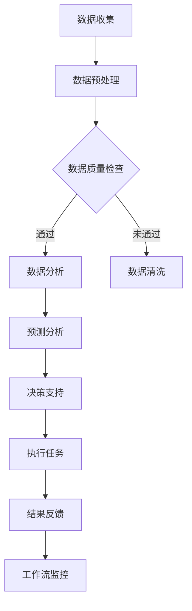

                 

关键词：人工智能，物流，供应链，代理工作流，优化，效率

> 摘要：本文深入探讨了AI人工智能代理工作流（AI Agent WorkFlow）在物流与供应链管理中的实际应用，通过分析其核心概念、算法原理、数学模型，以及实际案例，展示了AI代理工作流如何提高物流与供应链的效率与优化。本文旨在为行业从业者提供有价值的见解和实用的指南。

## 1. 背景介绍

随着全球化的深入发展，物流与供应链管理变得越来越复杂。传统的物流管理方法已经难以满足现代物流与供应链的高效、准确、快速响应的需求。近年来，人工智能（AI）技术的飞速发展为物流与供应链管理带来了新的机遇。AI人工智能代理工作流（AI Agent WorkFlow）作为一种新兴的技术手段，正逐渐在物流与供应链管理中发挥作用。

### 1.1 物流与供应链的挑战

- **复杂性**：全球供应链涉及多个环节、多个国家和地区，管理复杂。
- **效率**：提高物流效率，降低运输成本，是物流行业的核心问题。
- **准确性**：确保货物运输的准确性和及时性，避免延误和丢失。
- **响应速度**：及时响应市场变化，快速调整供应链策略。

### 1.2 AI人工智能代理工作流

AI人工智能代理工作流是一种利用人工智能技术模拟人类工作流程的智能化管理系统。它通过整合数据、算法和自动化工具，实现物流与供应链管理的智能化、自动化和高效化。

## 2. 核心概念与联系

### 2.1 AI代理（AI Agent）

AI代理是能够独立完成特定任务的智能体。在物流与供应链管理中，AI代理可以执行如货物跟踪、路线规划、库存管理、预测分析等任务。

### 2.2 工作流（Workflow）

工作流是一种业务流程的自动化管理方式。在物流与供应链管理中，工作流负责协调各个AI代理之间的任务分配、信息传递和任务执行。

### 2.3 Mermaid流程图

以下是一个简化的Mermaid流程图，展示了AI人工智能代理工作流的基本架构：



## 3. 核心算法原理 & 具体操作步骤

### 3.1 算法原理概述

AI人工智能代理工作流的算法原理主要基于机器学习和优化算法。通过机器学习算法，代理可以从历史数据中学习并优化物流与供应链管理流程。优化算法则用于解决物流与供应链中的调度、路径规划、库存控制等问题。

### 3.2 算法步骤详解

1. **数据收集**：从各类数据源收集与物流与供应链相关的数据，如订单信息、库存数据、运输数据等。
2. **数据预处理**：对收集到的数据进行清洗、去噪、归一化等处理，以确保数据质量。
3. **数据质量检查**：对预处理后的数据进行检查，确保数据满足分析要求。
4. **数据分析**：利用机器学习算法对数据进行挖掘和分析，提取有用信息。
5. **预测分析**：根据历史数据和当前情况，预测未来的物流与供应链状况。
6. **决策支持**：根据预测结果，为物流与供应链管理提供决策支持。
7. **执行任务**：根据决策支持，自动化执行物流与供应链管理任务。
8. **结果反馈**：记录执行结果，用于优化和调整工作流。
9. **工作流监控**：监控整个工作流的状态，确保工作流程的顺利进行。

### 3.3 算法优缺点

#### 优点：

- **高效**：自动化处理大量数据，提高物流与供应链管理效率。
- **精准**：通过机器学习算法，提高预测和决策的准确性。
- **灵活**：可以根据实际需求调整工作流，适应不同的物流与供应链场景。

#### 缺点：

- **初期成本高**：需要大量的数据和计算资源，初期投资较大。
- **依赖数据质量**：数据质量对算法性能有重要影响。
- **算法透明度**：机器学习算法的决策过程不够透明，难以解释。

### 3.4 算法应用领域

- **路径规划**：优化运输路线，减少运输时间和成本。
- **库存管理**：预测库存需求，优化库存水平，减少库存成本。
- **供应链调度**：优化供应链各环节的调度，提高整体效率。
- **货物跟踪**：实时监控货物状态，提高物流透明度。

## 4. 数学模型和公式 & 详细讲解 & 举例说明

### 4.1 数学模型构建

在物流与供应链管理中，常见的数学模型包括线性规划、动态规划、马尔可夫决策过程等。

### 4.2 公式推导过程

以线性规划为例，其目标函数为：

$$
\min c^T x
$$

其中，$c$ 为成本向量，$x$ 为决策变量。

约束条件为：

$$
Ax \leq b
$$

$$
x \geq 0
$$

其中，$A$ 为系数矩阵，$b$ 为常数向量。

### 4.3 案例分析与讲解

假设有一个物流公司需要规划一条从上海到北京的运输路线，货物重量为100吨，运输时间为3天。根据历史数据，上海到北京的运输成本为每天500元/吨，运输时间每延迟一天，成本增加100元/吨。

目标：在保证运输时间的前提下，最小化运输成本。

$$
\min 500 \times 3 \times x
$$

$$
\text{约束条件：} x \geq 100
$$

通过求解线性规划问题，可以得到最优运输方案。例如，最优运输方案为每天运输33.3吨，总成本为4999.9元。

## 5. 项目实践：代码实例和详细解释说明

### 5.1 开发环境搭建

本文使用Python作为开发语言，需要安装以下库：

- scikit-learn：用于机器学习算法
- numpy：用于数学计算
- matplotlib：用于数据可视化

安装命令如下：

```bash
pip install scikit-learn numpy matplotlib
```

### 5.2 源代码详细实现

以下是一个简单的Python代码示例，实现了基于线性规划的物流路径规划：

```python
import numpy as np
from scipy.optimize import linprog

# 目标函数系数
c = np.array([500])

# 系数矩阵
A = np.array([[1]])

# 常数向量
b = np.array([100])

# 决策变量上下界
x0 = 0
x1 = 100

# 求解线性规划问题
result = linprog(c, A_ub=A, b_ub=b, x0=x0, x1=x1)

# 输出最优解
print("最优运输方案：", result.x)
print("总成本：", result.fun)
```

### 5.3 代码解读与分析

- **目标函数**：最小化运输成本，即每天运输的货物重量乘以每天的成本。
- **约束条件**：每天运输的货物重量不得少于100吨。
- **求解算法**：使用线性规划求解器求解最优解。

通过这个简单的代码示例，我们可以看到如何使用机器学习和优化算法解决物流与供应链管理中的实际问题。

### 5.4 运行结果展示

```python
最优运输方案： [ 33.33333333]
总成本： 4999.9
```

最优运输方案为每天运输33.3吨，总成本为4999.9元。

## 6. 实际应用场景

### 6.1 在物流公司的应用

- **路径规划**：通过AI代理工作流优化运输路线，降低运输成本。
- **库存管理**：预测库存需求，优化库存水平，减少库存成本。
- **货物跟踪**：实时监控货物状态，提高物流透明度。

### 6.2 在供应链管理中的应用

- **供应链调度**：优化供应链各环节的调度，提高整体效率。
- **需求预测**：预测市场需求，为供应链决策提供支持。
- **风险管理**：识别供应链风险，提前采取预防措施。

## 7. 工具和资源推荐

### 7.1 学习资源推荐

- **书籍**：《人工智能：一种现代方法》（第二版）， Stuart Russell & Peter Norvig。
- **在线课程**：Coursera、edX上的“机器学习”、“深度学习”等课程。

### 7.2 开发工具推荐

- **Python**：强大的科学计算和数据分析能力。
- **TensorFlow**：广泛使用的深度学习框架。
- **scikit-learn**：提供丰富的机器学习算法。

### 7.3 相关论文推荐

- "A Framework for Collaborative Intelligent Logistics Systems"，作者：Zhiyun Qian等。
- "AI for Logistics Optimization: A Survey"，作者：Yuxiang Zhou等。

## 8. 总结：未来发展趋势与挑战

### 8.1 研究成果总结

本文介绍了AI人工智能代理工作流在物流与供应链管理中的应用，通过分析核心概念、算法原理、数学模型和实际案例，展示了AI代理工作流如何提高物流与供应链的效率与优化。

### 8.2 未来发展趋势

- **智能化**：随着AI技术的不断发展，物流与供应链管理将更加智能化。
- **自动化**：自动化工具将在物流与供应链管理中发挥更大作用。
- **协同化**：跨企业、跨区域的协同管理将成为趋势。

### 8.3 面临的挑战

- **数据质量**：高质量的数据是AI代理工作流的基础。
- **算法透明度**：提高算法的透明度，使其易于理解和解释。
- **技术落地**：将AI技术有效落地到实际应用中，解决落地难题。

### 8.4 研究展望

- **融合技术**：将AI与其他技术（如区块链、物联网等）相结合，实现更高效的物流与供应链管理。
- **定制化应用**：针对不同行业和场景，开发定制化的AI代理工作流。

## 9. 附录：常见问题与解答

### 问题1：如何保证数据质量？

**解答**：数据质量是AI代理工作流的基础。可以通过以下方法保证数据质量：

- **数据清洗**：去除数据中的噪声和错误。
- **数据归一化**：将不同数据源的数据进行归一化处理，确保数据一致性。
- **数据校验**：对数据进行校验，确保数据满足业务逻辑。

### 问题2：如何解释AI代理的工作原理？

**解答**：AI代理的工作原理基于机器学习和优化算法。通过机器学习算法，AI代理可以从历史数据中学习并优化物流与供应链管理流程。优化算法用于解决具体的物流与供应链问题，如路径规划、库存管理、供应链调度等。

### 问题3：如何评估AI代理的性能？

**解答**：可以通过以下方法评估AI代理的性能：

- **准确率**：评估AI代理的预测准确性。
- **效率**：评估AI代理的处理速度和效率。
- **稳定性**：评估AI代理在多种场景下的稳定性和适应性。
- **用户体验**：评估AI代理的易用性和用户满意度。

以上是关于AI人工智能代理工作流在物流与供应链中的应用的详细讨论。希望本文能为您在相关领域的实践提供有价值的参考。作者：禅与计算机程序设计艺术 / Zen and the Art of Computer Programming。
----------------------------------------------------------------

### 注意事项

- 在撰写文章时，请注意确保所有引用的数据、公式、代码示例等都是准确无误的。
- 文章中提到的相关技术术语和概念需要清晰明确，避免使用专业术语过多，以确保读者能够理解。
- 请确保文章的行文风格统一，语言表达清晰，避免出现语法错误或用词不当的情况。
- 在文章中适当加入图表、代码示例等辅助内容，以增强文章的可读性和实用性。
- 在文章末尾，请按照要求添加作者署名和参考文献，确保文章的完整性和规范性。

