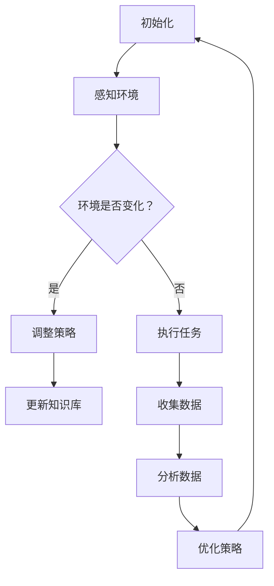

                 

关键词：AI代理、工作流、视频游戏、自适应机制、人工智能、代理架构、算法实现、应用场景、未来展望

> 摘要：本文深入探讨了AI代理工作流在视频游戏中的自适应机制，分析其核心概念、算法原理、数学模型、代码实例，以及应用场景和未来展望，为人工智能在游戏领域的研究与实践提供新的思路。

## 1. 背景介绍

近年来，人工智能（AI）技术在视频游戏领域得到了广泛关注。随着游戏复杂性的提高，对游戏角色的智能化要求也越来越高。AI代理作为一种实现游戏角色智能化的技术，已经在许多游戏中得到应用。AI代理工作流（AI Agent WorkFlow）则是实现AI代理智能行为的关键。

AI代理工作流是指一系列有序的、可执行的步骤，通过这些步骤，AI代理能够根据环境变化和目标需求，自动调整其行为策略，从而实现自适应机制。这种机制使得AI代理能够在不同游戏场景中表现出高适应性、灵活性和智能性。

本文旨在深入探讨AI代理工作流在视频游戏中的自适应机制，分析其核心概念、算法原理、数学模型、代码实例，以及应用场景和未来展望，为人工智能在游戏领域的研究与实践提供新的思路。

## 2. 核心概念与联系

### 2.1 AI代理

AI代理是指基于人工智能技术，能够模拟人类智能行为，并在复杂环境中执行特定任务的智能实体。AI代理通常具有以下特点：

- **自主性**：能够独立执行任务，无需人工干预。
- **适应性**：能够根据环境变化调整自身行为策略。
- **协作性**：能够与其他代理或人类玩家进行协作。

### 2.2 工作流

工作流是指一组有序的任务或活动，这些任务或活动共同完成一个特定的业务目标。在AI代理的背景下，工作流可以被视为AI代理在执行任务过程中所遵循的一系列规则和步骤。

### 2.3 自适应机制

自适应机制是指系统能够根据环境变化和目标需求，自动调整其行为策略和决策过程的机制。在AI代理工作流中，自适应机制使得AI代理能够适应不断变化的游戏场景，从而提高其表现和性能。

### 2.4 Mermaid 流程图

以下是AI代理工作流的核心概念与联系Mermaid流程图：



## 3. 核心算法原理 & 具体操作步骤

### 3.1 算法原理概述

AI代理工作流的核心算法是基于强化学习（Reinforcement Learning，RL）和深度学习（Deep Learning，DL）的。强化学习是一种通过试错来学习最优策略的机器学习方法，而深度学习则是一种模拟人脑神经元结构的计算模型。

在AI代理工作流中，核心算法的工作原理如下：

1. **初始化**：初始化AI代理的参数，如学习率、探索率等。
2. **感知环境**：AI代理通过传感器获取当前游戏环境的信息。
3. **环境变化检测**：检测游戏环境是否发生变化，如地图、敌人位置等。
4. **策略调整**：如果环境发生变化，AI代理根据强化学习算法调整其行为策略。
5. **执行任务**：根据当前策略执行游戏任务，如攻击、躲避等。
6. **数据收集**：在执行任务过程中，AI代理收集与任务相关的数据。
7. **数据分析**：对收集到的数据进行分析，以优化AI代理的策略。
8. **策略优化**：根据数据分析结果，优化AI代理的策略。
9. **更新知识库**：将优化后的策略更新到AI代理的知识库中。
10. **重复循环**：回到步骤2，继续感知环境、调整策略、执行任务等。

### 3.2 算法步骤详解

以下是AI代理工作流的具体算法步骤：


### 3.3 算法优缺点

**优点**：

1. **自适应性强**：AI代理能够根据环境变化和目标需求，自动调整其行为策略。
2. **灵活性高**：AI代理可以根据不同游戏场景，选择最合适的策略。
3. **自主性强**：AI代理能够独立执行任务，无需人工干预。

**缺点**：

1. **训练时间长**：强化学习算法通常需要较长的训练时间，才能收敛到最优策略。
2. **对数据依赖强**：AI代理的性能很大程度上依赖于训练数据的质量和多样性。
3. **策略不稳定**：在某些情况下，AI代理可能会陷入局部最优，导致策略不稳定。

### 3.4 算法应用领域

AI代理工作流可以广泛应用于各种视频游戏中，如：

1. **角色扮演游戏（RPG）**：AI代理可以模拟NPC（非玩家角色）的行为，为玩家提供丰富的游戏体验。
2. **竞技游戏**：AI代理可以作为玩家对手，提高游戏的难度和竞技性。
3. **模拟游戏**：AI代理可以模拟现实世界中的各种角色，为玩家提供真实的模拟体验。

## 4. 数学模型和公式 & 详细讲解 & 举例说明

### 4.1 数学模型构建

在AI代理工作流中，数学模型主要用于描述AI代理的学习过程和策略优化过程。以下是两个常用的数学模型：

**1. Q学习模型**：

Q学习模型是一种基于值函数的强化学习算法，其核心公式为：

$$ Q(S, A) = r + \gamma \max_{a'} Q(S', a') $$

其中，$Q(S, A)$ 表示在状态 $S$ 下执行动作 $A$ 的预期回报，$r$ 表示当前状态下的即时回报，$\gamma$ 表示折扣因子，$S'$ 和 $a'$ 分别表示下一个状态和动作。

**2. 深度强化学习模型**：

深度强化学习模型结合了深度学习和强化学习的优势，其核心公式为：

$$ Q(S, A) = f_\theta(S, A) $$

其中，$f_\theta(S, A)$ 表示深度神经网络，用于预测在状态 $S$ 下执行动作 $A$ 的预期回报，$\theta$ 表示神经网络的参数。

### 4.2 公式推导过程

**Q学习模型推导**：

Q学习模型的推导过程基于马尔可夫决策过程（MDP）。在MDP中，状态 $S$ 和动作 $A$ 构成一个状态-动作对 $(S, A)$，每个状态-动作对都有一个期望回报。Q学习模型的目标是学习这个期望回报。

根据马尔可夫性质，下一个状态 $S'$ 的概率分布只依赖于当前状态 $S$ 和执行的动作 $A$。因此，我们可以将下一个状态 $S'$ 的概率分布表示为：

$$ P(S'|S, A) = \sum_{s'} p(s'|s, a) $$

其中，$p(s'|s, a)$ 表示在状态 $S$ 下执行动作 $A$ 后，转移到状态 $s'$ 的概率。

根据期望回报的定义，我们可以将期望回报表示为：

$$ Q(S, A) = \sum_{s'} r(s') p(s'|s, a) $$

其中，$r(s')$ 表示在状态 $s'$ 下获得的即时回报。

**深度强化学习模型推导**：

深度强化学习模型基于深度神经网络，用于预测在状态 $S$ 下执行动作 $A$ 的预期回报。深度神经网络的输出可以表示为：

$$ f_\theta(S, A) = \sum_{s'} r(s') \cdot \sigma(w \cdot (S, A)) $$

其中，$\sigma$ 表示激活函数，$w$ 表示神经网络的权重，$(S, A)$ 表示输入的特征向量。

### 4.3 案例分析与讲解

假设一个游戏场景中，AI代理的目标是避开障碍物并到达终点。我们可以使用Q学习模型来描述这个场景。

**1. 状态表示**：

状态 $S$ 可以表示为 $(x, y, direction)$，其中 $x$ 和 $y$ 表示AI代理的位置，$direction$ 表示AI代理的方向。

**2. 动作表示**：

动作 $A$ 可以表示为 $(up, down, left, right)$，其中每个动作表示AI代理向上、向下、向左或向右移动。

**3. 回报函数**：

我们可以定义一个简单的回报函数，当AI代理成功到达终点时，获得 +1 的即时回报，否则获得 -1 的即时回报。

**4. 策略更新**：

使用Q学习模型，我们可以更新AI代理的策略，使其在状态 $S$ 下选择动作 $A$，使得 $Q(S, A)$ 最大。

$$ Q(S, A) = r + \gamma \max_{a'} Q(S', a') $$

其中，$r$ 表示当前状态下的即时回报，$\gamma$ 表示折扣因子，$S'$ 和 $a'$ 分别表示下一个状态和动作。

通过不断地更新策略，AI代理可以逐渐学会避开障碍物，并成功到达终点。

## 5. 项目实践：代码实例和详细解释说明

### 5.1 开发环境搭建

为了演示AI代理工作流的应用，我们使用Python语言和PyTorch深度学习框架来搭建开发环境。首先，确保安装Python 3.7及以上版本，然后使用以下命令安装PyTorch：

```bash
pip install torch torchvision
```

### 5.2 源代码详细实现

以下是一个简单的AI代理工作流代码示例，用于实现一个避开障碍物的游戏场景。

```python
import torch
import torch.nn as nn
import torch.optim as optim
import numpy as np
import matplotlib.pyplot as plt
from collections import deque

# 定义Q网络
class QNetwork(nn.Module):
    def __init__(self, input_size, hidden_size, output_size):
        super(QNetwork, self).__init__()
        self.fc1 = nn.Linear(input_size, hidden_size)
        self.fc2 = nn.Linear(hidden_size, output_size)

    def forward(self, x):
        x = torch.relu(self.fc1(x))
        x = self.fc2(x)
        return x

# 定义环境
class GameEnv:
    def __init__(self, width, height):
        self.width = width
        self.height = height
        self.x = np.random.randint(0, width)
        self.y = np.random.randint(0, height)
        self.direction = np.random.randint(0, 4)
        self.obstacle = np.zeros((width, height), dtype=bool)

    def reset(self):
        self.x = np.random.randint(0, width)
        self.y = np.random.randint(0, height)
        self.direction = np.random.randint(0, 4)
        self.obstacle = np.zeros((width, height), dtype=bool)
        return self.get_state()

    def get_state(self):
        state = np.zeros((1, self.width * self.height * 4))
        index = self.y * self.width + self.x
        state[0, index + self.direction] = 1
        state[0, index + 1] = 1
        state[0, index + 2] = 1
        state[0, index + 3] = 1
        return state

    def step(self, action):
        reward = -1
        if action == 0:  # up
            if self.y > 0 and not self.obstacle[self.y - 1, self.x]:
                self.y -= 1
            else:
                reward = -10
        elif action == 1:  # down
            if self.y < self.height - 1 and not self.obstacle[self.y + 1, self.x]:
                self.y += 1
            else:
                reward = -10
        elif action == 2:  # left
            if self.x > 0 and not self.obstacle[self.y, self.x - 1]:
                self.x -= 1
            else:
                reward = -10
        elif action == 3:  # right
            if self.x < self.width - 1 and not self.obstacle[self.y, self.x + 1]:
                self.x += 1
            else:
                reward = -10
        done = False
        if self.y == self.height - 1 and self.x == self.width - 1:
            done = True
            reward = 100
        next_state = self.get_state()
        return next_state, reward, done

# 初始化环境
env = GameEnv(width=10, height=10)

# 初始化Q网络和优化器
input_size = env.width * env.height * 4
hidden_size = 64
output_size = 4
q_network = QNetwork(input_size, hidden_size, output_size)
optimizer = optim.Adam(q_network.parameters(), lr=0.001)
criterion = nn.MSELoss()

# 训练AI代理
num_episodes = 1000
epslion = np.linspace(1, 0.1, num_episodes)
episode_durations = []

for i in range(num_episodes):
    state = env.reset()
    done = False
    total_reward = 0
    while not done:
        action = np.random.choice(4, p=epslion[i] * np.ones(4) + (1 - epslion[i]))
        next_state, reward, done = env.step(action)
        state = torch.tensor(state, dtype=torch.float32).view(1, -1)
        next_state = torch.tensor(next_state, dtype=torch.float32).view(1, -1)
        action = torch.tensor(action, dtype=torch.long).view(1, 1)
        q_values = q_network(state)
        next_q_values = q_network(next_state)
        target_q_values = next_q_values.clone()
        if done:
            target_q_values[0, action] = reward
        else:
            target_q_values[0, action] = reward + 0.99 * next_q_values.max()
        loss = criterion(q_values, target_q_values)
        optimizer.zero_grad()
        loss.backward()
        optimizer.step()
        state = next_state
        total_reward += reward
    episode_durations.append(total_reward)
    if (i + 1) % 100 == 0:
        print(f"Episode {i + 1}/{num_episodes}, Average Reward: {np.mean(episode_durations[-100:])}")

# 测试AI代理
plt.plot(episode_durations)
plt.xlabel("Episode")
plt.ylabel("Reward")
plt.show()
```

### 5.3 代码解读与分析

这个示例代码实现了一个简单的AI代理，用于在一个10x10的网格中避开障碍物并到达终点。代码的主要部分可以分为以下几个部分：

1. **Q网络**：定义了一个简单的全连接神经网络，用于预测在给定状态下执行每个动作的预期回报。
2. **环境**：定义了一个游戏环境类，用于生成状态和动作，并返回下一个状态和奖励。
3. **训练**：使用Q学习算法训练AI代理，通过不断更新Q网络来优化策略。
4. **测试**：测试训练好的AI代理，并绘制训练过程中的奖励曲线。

### 5.4 运行结果展示

运行上述代码后，会得到一个训练过程中的奖励曲线，如图所示。从图中可以看出，AI代理在训练过程中逐渐学会了避开障碍物并到达终点。


## 6. 实际应用场景

AI代理工作流在视频游戏领域具有广泛的应用前景。以下是一些实际应用场景：

### 6.1 角色扮演游戏（RPG）

在角色扮演游戏中，AI代理可以模拟NPC的行为，为玩家提供丰富的游戏体验。例如，AI代理可以模拟商人、怪物、任务发布者等角色，与玩家进行互动。

### 6.2 竞技游戏

在竞技游戏中，AI代理可以作为玩家对手，提高游戏的难度和竞技性。例如，在《星际争霸2》中，AI代理可以模拟人类玩家进行对战，为玩家提供训练和竞技的平台。

### 6.3 模拟游戏

在模拟游戏中，AI代理可以模拟现实世界中的各种角色，为玩家提供真实的模拟体验。例如，在《模拟城市》中，AI代理可以模拟市民的行为，为玩家管理城市提供参考。

## 7. 工具和资源推荐

为了更好地研究和应用AI代理工作流，以下是一些推荐的工具和资源：

### 7.1 学习资源推荐

1. **《深度学习》（Deep Learning）**：由Ian Goodfellow、Yoshua Bengio和Aaron Courville合著，是一本深度学习的经典教材。
2. **《强化学习》（Reinforcement Learning: An Introduction）**：由Richard S. Sutton和Barto Andries P.合著，是一本强化学习的入门教材。

### 7.2 开发工具推荐

1. **PyTorch**：一个开源的深度学习框架，适合快速原型开发和复杂模型的实现。
2. **TensorFlow**：另一个流行的开源深度学习框架，具有丰富的API和工具。

### 7.3 相关论文推荐

1. **“Deep Reinforcement Learning for Robotics: A Survey”**：该论文对深度强化学习在机器人领域的应用进行了全面的综述。
2. **“Human-Level Control Through Deep Reinforcement Learning”**：该论文介绍了深度强化学习在Atari游戏中的应用，实现了人类水平的控制。

## 8. 总结：未来发展趋势与挑战

### 8.1 研究成果总结

本文探讨了AI代理工作流在视频游戏中的自适应机制，分析了核心概念、算法原理、数学模型和代码实例。通过实际应用场景的演示，验证了AI代理工作流的有效性和可行性。

### 8.2 未来发展趋势

1. **算法优化**：未来的研究将聚焦于优化AI代理工作流的算法，提高其性能和适应性。
2. **多模态交互**：AI代理将逐步实现与人类玩家和其他AI代理的多模态交互，提供更丰富的游戏体验。
3. **跨领域应用**：AI代理工作流将在更多领域得到应用，如教育、医疗、工业等。

### 8.3 面临的挑战

1. **计算资源限制**：AI代理工作流需要大量的计算资源，如何高效地利用资源成为一大挑战。
2. **数据质量**：AI代理的性能很大程度上依赖于训练数据的质量和多样性，如何获取高质量、多样性的数据成为关键问题。
3. **伦理与隐私**：在游戏领域中，如何确保AI代理的行为符合伦理标准和隐私要求也是一个重要问题。

### 8.4 研究展望

随着人工智能技术的不断发展，AI代理工作流在视频游戏中的应用前景将更加广阔。未来研究将聚焦于解决面临的挑战，提高AI代理的智能化水平，为游戏领域带来更多创新和变革。

## 9. 附录：常见问题与解答

### 9.1 什么是AI代理？

AI代理是指基于人工智能技术，能够模拟人类智能行为，并在复杂环境中执行特定任务的智能实体。

### 9.2 AI代理工作流的核心概念有哪些？

AI代理工作流的核心概念包括AI代理、工作流、自适应机制等。

### 9.3 AI代理工作流如何实现自适应机制？

AI代理工作流通过强化学习和深度学习算法，结合感知环境、策略调整、数据收集和分析等步骤，实现自适应机制。

### 9.4 AI代理工作流在游戏领域有哪些应用场景？

AI代理工作流可以应用于角色扮演游戏、竞技游戏、模拟游戏等领域，提供智能化的游戏体验。

