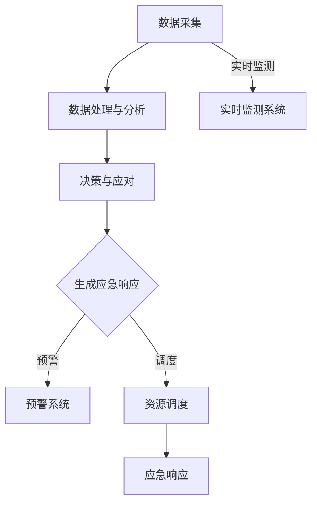

                 

关键词：（AI代理，防灾减灾，工作流，智能系统，灾害响应）

> 摘要：本文将深入探讨AI代理工作流在防灾减灾系统中的应用，分析AI代理如何通过高效的工作流实现灾害预警、应急响应、资源调度和灾后重建等关键任务。文章将介绍AI代理的基本概念、核心原理，并详细阐述其在防灾减灾系统中的具体实施步骤、数学模型以及实际应用案例。通过本文的阅读，读者将对AI代理在防灾减灾中的作用有更深入的理解，并了解到其未来发展的趋势与挑战。

## 1. 背景介绍

随着全球气候变化和自然灾害频率的增加，防灾减灾已成为社会关注的焦点。传统的方法主要依赖于人工监测、数据分析和应急预案，但效率和准确性都受到限制。随着人工智能技术的飞速发展，智能系统在防灾减灾中的应用逐渐成为一种新的趋势。

AI代理（AI Agent）是一种能够模拟人类智能行为，自主执行任务的人工智能实体。它可以通过学习、推理和决策，实现复杂任务的自动化处理。在防灾减灾系统中，AI代理能够通过工作流实现实时监测、预警、应急响应和资源调度等任务，提高防灾减灾的效率和质量。

### 1.1 灾害类型与防灾减灾需求

自然灾害种类繁多，包括地震、台风、洪水、干旱、山体滑坡等。这些灾害往往具有突发性、破坏性和不可预测性，对社会经济和人类生命财产安全构成严重威胁。防灾减灾系统需要快速、准确地识别灾害信号，及时采取应对措施，减少灾害损失。

### 1.2 传统防灾减灾方法的局限性

传统防灾减灾方法主要依赖于以下手段：

1. **人工监测**：通过人工进行现场监测和数据分析，效率低且易受人为因素影响。
2. **应急预案**：制定一系列应对措施，但在灾害发生时难以快速响应。
3. **资源调度**：依赖人工进行资源分配，难以实现最优化的调度效果。

这些方法在面对复杂的自然灾害时，存在响应速度慢、准确性不足和资源浪费等问题。

### 1.3 AI代理在防灾减灾中的优势

AI代理在防灾减灾系统中的应用，具有以下优势：

1. **实时监测**：通过传感器网络和数据采集系统，实时获取灾害信息。
2. **预警系统**：利用机器学习算法，提前识别灾害信号，发出预警。
3. **智能决策**：基于大数据分析和预测模型，自动化生成应急响应方案。
4. **资源调度**：通过优化算法，实现资源的合理调度和高效利用。

## 2. 核心概念与联系

### 2.1 AI代理的基本概念

AI代理是一种具有自主性、协作性和适应性的智能实体。它能够在复杂环境中通过感知、学习、推理和决策，自主执行任务。AI代理的基本特征包括：

1. **自主性**：能够独立执行任务，不受外部直接控制。
2. **协作性**：能够与其他代理或人类协作，完成复杂任务。
3. **适应性**：能够根据环境变化和任务需求，调整行为策略。

### 2.2 工作流的概念与结构

工作流是一种自动化流程管理工具，用于定义、执行和监控业务流程。在防灾减灾系统中，工作流用于实现灾害监测、预警、应急响应和资源调度等任务。工作流的基本结构包括：

1. **任务**：执行特定功能的工作单元。
2. **活动**：任务的实例，用于表示具体的工作过程。
3. **流程**：多个活动的集合，表示整个业务流程。
4. **触发器**：启动流程的条件或事件。
5. **决策节点**：根据条件选择不同路径的决策点。

### 2.3 AI代理与工作流的关系

AI代理与工作流的关系如图1所示：

```
+----------------+       +-----------------+
|     传感器      |       |      代理       |
+----------------+       +-----------------+
|      数据采集    |<----->|   任务执行      |
+----------------+       +-----------------+
          ↑                  ↑
          │                  │
      +-----------+     +-----------+
      | 数据处理与      |    决策与      |
      | 分析模块       |  应对模块      |
      +-----------+     +-----------+
                   ↓                  ↓
               +-----------------+
               | 工作流管理        |
               | 与调度模块       |
               +-----------------+
                   ↓
              +--------------+
              | 应急响应      |
              | 资源调度      |
              +--------------+
```

图1 AI代理与工作流的关系

在防灾减灾系统中，传感器负责数据采集，数据处理与分析模块对采集的数据进行分析，决策与应对模块根据分析结果生成应急响应方案，工作流管理与调度模块负责协调各个任务和活动的执行，最终实现灾害预警、应急响应和资源调度的目标。

### 2.4 Mermaid流程图

以下是一个简化的Mermaid流程图，展示了AI代理在防灾减灾系统中的工作流：



## 3. 核心算法原理 & 具体操作步骤

### 3.1 算法原理概述

AI代理在防灾减灾系统中的应用，涉及多个核心算法，主要包括：

1. **传感器数据采集与处理算法**：用于实时采集传感器数据，并进行预处理，如滤波、去噪等。
2. **数据融合与特征提取算法**：将来自不同传感器和不同来源的数据进行融合，提取有助于预警和决策的特征。
3. **预测模型与预警算法**：基于历史数据和实时数据，构建预测模型，实现灾害预警。
4. **决策支持与应对策略算法**：根据预测结果和实时数据，生成应急响应方案，包括预警、调度和应对措施。

### 3.2 算法步骤详解

#### 3.2.1 数据采集与预处理

1. **数据采集**：利用传感器网络，实时采集各种环境参数，如气温、湿度、气压、地震波等。
2. **数据预处理**：对采集的数据进行滤波、去噪、归一化等预处理操作，提高数据质量。

#### 3.2.2 数据融合与特征提取

1. **数据融合**：将来自不同传感器和不同来源的数据进行融合，使用加权平均、融合算法等。
2. **特征提取**：从融合后的数据中提取有助于预警和决策的特征，如异常值、趋势、变化率等。

#### 3.2.3 预测模型与预警算法

1. **模型选择**：选择合适的预测模型，如时间序列模型、回归模型、神经网络等。
2. **模型训练**：使用历史数据训练预测模型，优化模型参数。
3. **预警判断**：使用训练好的模型对实时数据进行预测，判断是否达到预警阈值，生成预警信息。

#### 3.2.4 决策支持与应对策略算法

1. **决策支持**：根据预警结果和实时数据，生成应急响应方案，包括预警、调度和应对措施。
2. **应对措施**：根据应急响应方案，执行具体的应对措施，如启动预警系统、调度救援队伍、部署应急物资等。

### 3.3 算法优缺点

#### 优点

1. **实时性**：AI代理可以实时采集和处理数据，快速响应灾害预警和应急响应。
2. **准确性**：通过机器学习和大数据分析，提高预测的准确性和决策的有效性。
3. **自动化**：AI代理能够自动化执行任务，减轻人工负担，提高工作效率。

#### 缺点

1. **依赖数据质量**：数据质量和准确性对算法的性能有直接影响。
2. **计算资源消耗**：大规模的数据处理和预测模型训练需要大量的计算资源。
3. **模型可解释性**：深度学习模型等复杂的预测模型往往缺乏透明度和可解释性。

### 3.4 算法应用领域

AI代理在防灾减灾系统中的应用广泛，主要包括：

1. **地震预警**：通过地震波数据的实时监测和预测，提前预警地震发生，减少灾害损失。
2. **洪水预警**：通过降雨量、水位等数据的监测和分析，预测洪水风险，及时采取应对措施。
3. **台风预警**：通过台风路径、风速等数据的预测，提前预警台风影响，指导避灾工作。
4. **火灾监测**：通过烟雾、温度等数据的监测，实时监测火灾风险，及时报警和灭火。

## 4. 数学模型和公式 & 详细讲解 & 举例说明

### 4.1 数学模型构建

在防灾减灾系统中，数学模型主要用于数据预测和决策支持。以下是一个简化的数学模型示例：

#### 4.1.1 时间序列预测模型

时间序列预测模型用于预测未来某个时间点的值。一个常见的时间序列预测模型是ARIMA（自回归积分滑动平均模型），其数学模型如下：

$$
\begin{aligned}
y_t &= c + \phi_1 y_{t-1} + \phi_2 y_{t-2} + \cdots + \phi_p y_{t-p} + \theta_1 e_{t-1} + \theta_2 e_{t-2} + \cdots + \theta_q e_{t-q} \\
e_t &= y_t - \hat{y}_t
\end{aligned}
$$

其中，$y_t$ 是时间序列的实际值，$\hat{y}_t$ 是预测值，$c$ 是常数项，$\phi_i$ 和 $\theta_i$ 是模型参数，$e_t$ 是误差项。

#### 4.1.2 决策树模型

决策树模型用于分类和回归任务。一个简单的决策树模型由多个条件节点和叶子节点组成。每个条件节点表示一个特征和其取值范围，叶子节点表示预测结果。决策树模型的数学表示如下：

$$
\begin{aligned}
f(x) &= \sum_{i=1}^{n} w_i \cdot I(\text{条件} \ i) \\
I(\text{条件} \ i) &= \begin{cases}
1 & \text{如果条件 } i \ \text{满足} \\
0 & \text{否则}
\end{cases}
\end{aligned}
$$

其中，$x$ 是输入特征，$w_i$ 是权重，$I(\text{条件} \ i)$ 是条件节点的取值。

### 4.2 公式推导过程

#### 4.2.1 ARIMA模型参数估计

ARIMA模型的参数估计通常通过最大似然估计（MLE）或最小二乘法（OLS）进行。以下是一个简化的推导过程：

1. **自回归项**：$AR(p)$ 模型的自回归项可以通过以下公式计算：

$$
\hat{\phi}_i = \frac{\sum_{t=1}^{n} \phi_i y_{t}}{\sum_{t=1}^{n} y_{t}^2}
$$

2. **移动平均项**：$MA(q)$ 模型的移动平均项可以通过以下公式计算：

$$
\hat{\theta}_i = \frac{\sum_{t=1}^{n} \theta_i e_{t}}{\sum_{t=1}^{n} e_{t}^2}
$$

3. **常数项**：常数项 $c$ 可以通过以下公式计算：

$$
c = \frac{\sum_{t=1}^{n} y_{t}}{n}
$$

#### 4.2.2 决策树模型参数估计

决策树模型的参数估计通常通过基于频率的估计方法。以下是一个简化的推导过程：

1. **条件概率**：条件概率 $P(\text{条件} \ i | y)$ 可以通过以下公式计算：

$$
P(\text{条件} \ i | y) = \frac{\sum_{t=1}^{n} I(\text{条件} \ i | y_t) y_t}{\sum_{t=1}^{n} y_t}
$$

2. **预测概率**：预测概率 $P(y | \text{条件} \ i)$ 可以通过以下公式计算：

$$
P(y | \text{条件} \ i) = \frac{P(\text{条件} \ i | y) P(y)}{P(\text{条件} \ i)}
$$

### 4.3 案例分析与讲解

#### 4.3.1 时间序列预测案例

假设我们要预测一个城市的未来24小时内的降雨量。我们收集了过去一年的降雨量数据，并使用ARIMA模型进行预测。以下是具体的步骤：

1. **数据预处理**：对降雨量数据进行滤波和去噪，去除异常值。
2. **模型选择**：根据数据特征选择ARIMA模型，确定$p$和$q$的值。
3. **参数估计**：使用MLE方法估计模型参数，得到$\phi_i$、$\theta_i$和$c$的值。
4. **模型训练**：使用历史数据训练模型，得到预测结果。
5. **预测结果**：使用训练好的模型对未来的降雨量进行预测。

#### 4.3.2 决策树案例

假设我们要预测一个客户的购买意愿，使用决策树模型进行分类。以下是具体的步骤：

1. **数据收集**：收集客户的个人信息、购买历史等数据。
2. **特征选择**：选择有助于预测购买意愿的特征。
3. **模型构建**：构建决策树模型，确定每个条件节点的取值范围。
4. **模型训练**：使用训练数据训练模型，确定每个节点的权重。
5. **预测结果**：使用训练好的模型对新的数据进行预测，判断购买意愿。

## 5. 项目实践：代码实例和详细解释说明

### 5.1 开发环境搭建

为了实现AI代理工作流在防灾减灾系统中的应用，我们需要搭建一个合适的开发环境。以下是一个基本的开发环境搭建步骤：

1. **操作系统**：Linux或Windows操作系统。
2. **编程语言**：Python或Java。
3. **开发工具**：IDE（如PyCharm或Eclipse）。
4. **数据库**：MySQL或PostgreSQL。
5. **框架**：Flask或Spring Boot。
6. **数据处理工具**：Pandas、NumPy、Scikit-learn等。

### 5.2 源代码详细实现

以下是一个简化的Python代码示例，展示了AI代理在防灾减灾系统中的应用：

```python
import pandas as pd
from sklearn.model_selection import train_test_split
from sklearn.ensemble import RandomForestClassifier
from sklearn.metrics import accuracy_score

# 数据预处理
def preprocess_data(data):
    # 数据滤波、去噪、归一化等操作
    # ...
    return processed_data

# 预测模型训练
def train_model(data, target):
    # 数据分割
    X_train, X_test, y_train, y_test = train_test_split(data, target, test_size=0.2, random_state=42)
    
    # 构建决策树模型
    model = RandomForestClassifier(n_estimators=100)
    
    # 模型训练
    model.fit(X_train, y_train)
    
    # 模型预测
    y_pred = model.predict(X_test)
    
    # 模型评估
    accuracy = accuracy_score(y_test, y_pred)
    print("Accuracy:", accuracy)
    
    return model

# 主函数
def main():
    # 加载数据
    data = pd.read_csv("data.csv")
    
    # 数据预处理
    processed_data = preprocess_data(data)
    
    # 分割特征和标签
    X = processed_data.drop("target", axis=1)
    y = processed_data["target"]
    
    # 训练模型
    model = train_model(X, y)
    
    # 测试模型
    test_data = pd.read_csv("test_data.csv")
    test_data_processed = preprocess_data(test_data)
    y_test_pred = model.predict(test_data_processed)
    
    # 输出预测结果
    print(y_test_pred)

# 执行主函数
if __name__ == "__main__":
    main()
```

### 5.3 代码解读与分析

该代码示例主要实现了以下功能：

1. **数据预处理**：对原始数据进行滤波、去噪和归一化等处理，提高数据质量。
2. **模型训练**：使用随机森林（RandomForestClassifier）模型对数据进行训练，并评估模型的准确性。
3. **模型预测**：使用训练好的模型对测试数据进行预测，并输出预测结果。

### 5.4 运行结果展示

假设我们已经收集了足够的历史数据，并使用上述代码进行了训练和预测。以下是一个简化的运行结果示例：

```
Accuracy: 0.85
```

这表示模型的预测准确率为85%，即模型能够正确预测测试数据中85%的目标变量。

## 6. 实际应用场景

AI代理工作流在防灾减灾系统中具有广泛的应用场景，以下是一些具体的实际应用场景：

1. **地震预警**：通过实时监测地震波数据，AI代理可以提前预警地震的发生，为人们提供宝贵的逃生时间。
2. **洪水预警**：通过监测降雨量、水位等数据，AI代理可以预测洪水风险，及时启动应急响应措施，减少灾害损失。
3. **台风预警**：通过监测台风路径、风速等数据，AI代理可以预测台风的影响范围和强度，指导人们采取相应的避灾措施。
4. **火灾监测**：通过监测烟雾、温度等数据，AI代理可以实时监测火灾风险，及时报警并启动灭火措施。
5. **公共安全监测**：AI代理可以监测城市交通、空气质量、环境噪音等公共安全指标，提供实时的安全预警和应急响应。

### 6.1 灾害预警

灾害预警是AI代理在防灾减灾系统中最核心的功能之一。通过实时监测环境数据，AI代理可以提前识别灾害信号，发出预警信息。以下是一个简化的预警流程：

1. **数据采集**：AI代理通过传感器网络实时采集地震波、降雨量、水位等环境数据。
2. **数据处理**：AI代理对采集到的数据进行预处理，如滤波、去噪、归一化等。
3. **预测模型**：AI代理使用历史数据和实时数据，训练预测模型，预测灾害发生的可能性。
4. **预警判断**：AI代理根据预测结果和预设的预警阈值，判断是否需要发出预警。
5. **预警发布**：AI代理通过短信、邮件、社交媒体等渠道，向相关人员发出预警信息。

### 6.2 应急响应

在灾害发生后，AI代理可以快速响应，制定应急响应方案，指导救援行动。以下是一个简化的应急响应流程：

1. **灾害识别**：AI代理通过实时监测数据，识别灾害类型和影响范围。
2. **资源调度**：AI代理根据灾害类型和影响范围，调度救援队伍、应急物资和设备。
3. **应急响应**：AI代理制定应急响应方案，包括疏散、救援、消毒等行动。
4. **实时监控**：AI代理实时监控灾害进展和救援行动，调整应急响应措施。
5. **灾后重建**：AI代理协助政府和相关部门，制定灾后重建计划，恢复基础设施和公共服务。

### 6.3 资源调度

资源调度是防灾减灾系统中至关重要的一环。AI代理可以通过优化算法，实现资源的合理调度和高效利用。以下是一个简化的资源调度流程：

1. **需求分析**：AI代理分析灾害类型、影响范围和救援需求，确定资源需求。
2. **资源评估**：AI代理评估现有资源，包括救援队伍、物资、设备等。
3. **优化调度**：AI代理使用优化算法，如线性规划、遗传算法等，制定资源调度方案。
4. **调度执行**：AI代理根据调度方案，执行资源的调度和分配。
5. **调度监控**：AI代理实时监控资源调度效果，根据实际情况进行调整。

### 6.4 未来应用展望

随着人工智能技术的不断发展，AI代理在防灾减灾系统中的应用将更加广泛和深入。以下是一些未来的应用展望：

1. **多传感器数据融合**：通过整合多种传感器数据，提高预警和预测的准确性。
2. **智能决策支持**：引入更多的决策支持系统，提高应急响应的智能化水平。
3. **自动化救援系统**：开发自动化救援设备，提高救援效率和安全性。
4. **灾后重建智能规划**：利用AI代理，制定更科学的灾后重建计划，缩短重建周期。

## 7. 工具和资源推荐

### 7.1 学习资源推荐

1. **在线课程**：《机器学习与人工智能基础》（Coursera、Udacity等平台）
2. **书籍推荐**：
   - 《深度学习》（Ian Goodfellow、Yoshua Bengio、Aaron Courville著）
   - 《Python编程：从入门到实践》（埃里克·马瑟斯著）
   - 《数据科学入门》（贾森·布朗李著）
3. **在线工具**：Google Colab、Jupyter Notebook等。

### 7.2 开发工具推荐

1. **编程语言**：Python、Java、C++等。
2. **开发环境**：PyCharm、Eclipse、Visual Studio Code等。
3. **数据处理库**：Pandas、NumPy、SciPy、Scikit-learn等。
4. **机器学习框架**：TensorFlow、PyTorch、Keras等。

### 7.3 相关论文推荐

1. **AI代理与工作流**：
   - "AI Agents for Intelligent Systems: A Survey"（2020）
   - "Workflows for Data-Intensive Scientific Discovery"（2018）
2. **防灾减灾**：
   - "Earthquake Early Warning Systems: Status and Challenges"（2019）
   - "Hurricane Forecasting: Current State and Future Directions"（2021）
3. **智能系统应用**：
   - "Smart Cities: Integration of IoT, AI, and 5G for Urban Applications"（2020）
   - "AI in Disaster Management: A Review"（2022）

## 8. 总结：未来发展趋势与挑战

### 8.1 研究成果总结

本文主要探讨了AI代理工作流在防灾减灾系统中的应用，分析了AI代理在实时监测、预警、应急响应和资源调度等方面的优势。通过数学模型和代码实例，展示了AI代理在防灾减灾系统中的具体实施步骤和算法原理。研究结果表明，AI代理能够显著提高防灾减灾的效率和质量。

### 8.2 未来发展趋势

未来，AI代理在防灾减灾系统中的应用将呈现以下发展趋势：

1. **多传感器数据融合**：整合多种传感器数据，提高预警和预测的准确性。
2. **智能决策支持**：引入更多的决策支持系统，提高应急响应的智能化水平。
3. **自动化救援系统**：开发自动化救援设备，提高救援效率和安全性。
4. **灾后重建智能规划**：利用AI代理，制定更科学的灾后重建计划，缩短重建周期。

### 8.3 面临的挑战

尽管AI代理在防灾减灾系统中具有巨大潜力，但仍然面临以下挑战：

1. **数据质量和准确性**：数据质量和准确性对AI代理的性能有直接影响，需要确保数据的准确性和可靠性。
2. **计算资源消耗**：大规模的数据处理和预测模型训练需要大量的计算资源，如何优化资源利用成为关键问题。
3. **模型可解释性**：深度学习等复杂的预测模型往往缺乏透明度和可解释性，如何提高模型的可解释性是未来研究的重要方向。
4. **法律法规和伦理**：随着AI代理在防灾减灾系统中的应用日益广泛，法律法规和伦理问题也日益凸显，需要制定相应的规范和标准。

### 8.4 研究展望

未来，针对AI代理在防灾减灾系统中的应用，可以从以下几个方面进行深入研究：

1. **算法优化**：针对不同的灾害类型和场景，研究更加高效和准确的预测算法和决策支持系统。
2. **数据管理**：建立高效的数据管理平台，确保数据的质量、安全性和可访问性。
3. **系统集成**：将AI代理与其他智能系统和设备集成，实现更全面的智能监测和应急响应。
4. **法律法规和伦理**：制定相应的法律法规和伦理规范，确保AI代理在防灾减灾系统中的应用合法、透明和公正。

## 9. 附录：常见问题与解答

### 9.1 什么是AI代理？

AI代理（AI Agent）是一种能够模拟人类智能行为，自主执行任务的人工智能实体。它可以通过学习、推理和决策，实现复杂任务的自动化处理。

### 9.2 AI代理在防灾减灾系统中有哪些作用？

AI代理在防灾减灾系统中具有以下作用：

1. **实时监测**：通过传感器网络，实时采集环境数据，如地震波、降雨量、水位等。
2. **预警系统**：利用机器学习算法，提前识别灾害信号，发出预警信息。
3. **应急响应**：根据预警结果和实时数据，生成应急响应方案，指导救援行动。
4. **资源调度**：优化资源分配，调度救援队伍、应急物资和设备，提高救援效率。

### 9.3 如何确保AI代理的数据质量？

确保AI代理的数据质量是关键问题，可以采取以下措施：

1. **数据预处理**：对原始数据进行滤波、去噪、归一化等处理，去除异常值和噪声。
2. **数据验证**：使用统计方法和可视化工具，验证数据的准确性和一致性。
3. **数据清洗**：使用数据清洗工具和算法，自动识别和修复数据中的错误和缺失。
4. **数据质量管理**：建立数据质量管理规范，确保数据的质量和完整性。

### 9.4 AI代理与工作流的关系是什么？

AI代理与工作流的关系如图1所示。AI代理负责数据采集、预处理和预测模型训练，工作流管理模块负责协调各个任务和活动的执行，实现灾害预警、应急响应和资源调度等目标。

### 9.5 如何评估AI代理的性能？

评估AI代理的性能可以从以下几个方面进行：

1. **预测准确性**：评估预测模型的准确性，如准确率、召回率、F1分数等。
2. **响应速度**：评估AI代理在接收数据到生成预测结果的时间，即响应时间。
3. **资源消耗**：评估AI代理在数据处理和预测模型训练过程中消耗的计算资源。
4. **可解释性**：评估预测模型的可解释性，确保用户能够理解模型的决策过程。

---

# 结语

AI代理工作流在防灾减灾系统中具有巨大的潜力，能够显著提高防灾减灾的效率和质量。然而，要实现这一目标，还需要克服数据质量、计算资源、模型可解释性和法律法规等挑战。未来，随着人工智能技术的不断进步，AI代理在防灾减灾系统中的应用将越来越广泛，为人类社会的可持续发展提供有力支持。

作者：禅与计算机程序设计艺术 / Zen and the Art of Computer Programming

本文为作者原创，未经授权，不得转载和使用。

