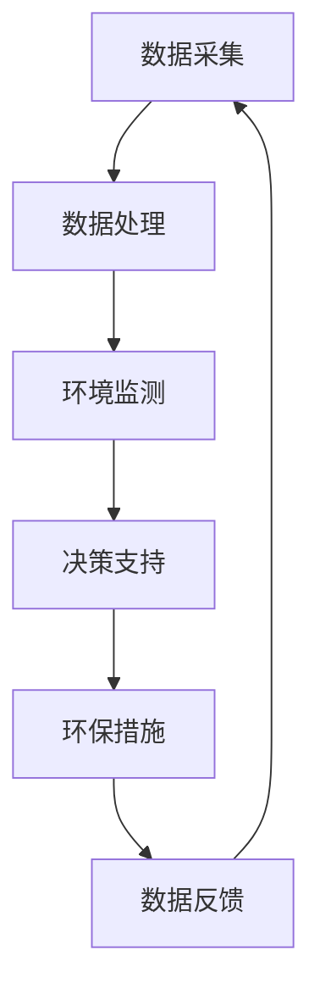

                 

关键词：AI代理、工作流、环保行业、智能系统、数据处理、自动化

摘要：本文深入探讨了AI代理在环保行业系统中的应用及其工作流设计。通过阐述AI代理的核心概念、原理、算法，结合实际项目实践，展示了智能代理如何优化环保数据处理、监测和分析过程，提高行业效率和决策准确性。本文旨在为环保行业提供一种新的技术思路，助力实现更智能、高效的环保管理系统。

## 1. 背景介绍

随着全球环境问题的日益严重，环保行业面临着越来越大的压力和挑战。传统的环保系统主要依赖于人工监测、分析和决策，存在效率低、耗时久、人为因素较多等缺点。近年来，人工智能（AI）技术的发展为环保行业带来了新的机遇。AI代理作为一种具有自主决策能力的智能系统，可以在环保行业系统中发挥重要作用，实现环保数据的自动化处理和分析，提高决策的准确性。

本文旨在探讨AI代理在环保行业系统中的应用，分析其工作流设计，并展示其在实际项目中的具体实现。通过本文的研究，我们希望能够为环保行业提供一种智能化、高效化的解决方案，助力实现可持续发展的目标。

### 1.1 环保行业的现状与挑战

环保行业的主要任务是保护环境、减少污染、提高资源利用效率。然而，随着工业化和城市化的快速发展，环境污染问题日益严重，环保行业面临着诸多挑战：

- **数据量巨大**：环保数据来源广泛，包括空气、水质、土壤、噪音等多个方面，数据量庞大且不断增长。
- **数据种类繁多**：不同类型的数据（如图像、文本、时间序列等）对处理和分析方法的要求各不相同。
- **实时性要求高**：许多环保监测任务需要实时数据支持，以快速响应环境变化。
- **人工分析耗时久**：传统的环保系统主要依赖人工分析，效率低，难以满足实时性要求。

### 1.2 AI代理的定义与优势

AI代理是一种具有自主决策能力的智能系统，能够模拟人类思维过程，实现自动化、智能化的数据处理和分析。与传统的环保系统相比，AI代理具有以下优势：

- **自动化处理**：AI代理可以自动收集、处理和分析数据，减少人工干预，提高工作效率。
- **智能分析**：AI代理利用机器学习、深度学习等技术，能够从海量数据中提取有价值的信息，提供准确的决策支持。
- **实时响应**：AI代理可以实时处理数据，快速响应环境变化，提高系统的实时性。
- **自适应能力**：AI代理可以根据环境和数据变化，自适应调整策略和方法，提高系统的适应性。

## 2. 核心概念与联系

### 2.1 AI代理

AI代理（Artificial Intelligence Agent）是指具有智能、自主决策能力并能与环境互动的计算机程序。AI代理通常包括感知模块、决策模块和执行模块。感知模块用于收集环境信息；决策模块根据感知模块的信息进行决策；执行模块则根据决策结果执行相应的操作。

### 2.2 工作流

工作流（Workflow）是指一组有序的任务序列，用于完成特定的业务目标。在环保行业系统中，工作流可以定义为从数据采集、处理、分析到决策的整个过程。AI代理的工作流设计旨在实现数据驱动的智能决策，提高系统的自动化水平和决策准确性。

### 2.3 智能代理在环保行业中的应用

智能代理在环保行业中的应用主要包括以下方面：

- **数据采集**：AI代理可以自动采集各种环境数据，如空气、水质、土壤等。
- **数据处理**：AI代理利用机器学习、深度学习等技术，对采集到的数据进行处理和分析。
- **环境监测**：AI代理可以对实时环境数据进行分析，监测环境污染状况。
- **决策支持**：AI代理根据分析结果提供决策支持，帮助环保行业管理者制定科学合理的环保措施。

### 2.4 Mermaid流程图

以下是AI代理在环保行业系统中应用的工作流Mermaid流程图：



## 3. 核心算法原理 & 具体操作步骤

### 3.1 算法原理概述

AI代理在环保行业系统中的核心算法主要包括数据预处理、特征提取、模型训练和预测。以下将详细阐述各算法步骤。

#### 3.1.1 数据预处理

数据预处理是环保数据分析和挖掘的基础。主要步骤包括：

- **数据清洗**：去除噪声、缺失值和异常值，提高数据质量。
- **数据转换**：将不同类型的数据（如图像、文本、时间序列等）转换为统一的格式。
- **数据归一化**：将不同量纲的数据转换为同一量纲，便于后续处理。

#### 3.1.2 特征提取

特征提取是从原始数据中提取具有代表性的信息，用于训练模型。常见方法包括：

- **统计特征**：如均值、方差、标准差等。
- **文本特征**：如词频、TF-IDF、主题模型等。
- **图像特征**：如边缘、纹理、颜色等。

#### 3.1.3 模型训练

模型训练是AI代理的核心环节。常见方法包括：

- **监督学习**：如线性回归、支持向量机、决策树等。
- **无监督学习**：如聚类、主成分分析等。
- **深度学习**：如卷积神经网络、循环神经网络等。

#### 3.1.4 预测

预测是根据训练好的模型，对新数据进行分类、回归等操作。预测结果可用于环境监测和决策支持。

### 3.2 算法步骤详解

以下为AI代理在环保行业系统中的具体算法步骤：

#### 3.2.1 数据预处理

1. 数据清洗：去除噪声、缺失值和异常值，提高数据质量。
2. 数据转换：将不同类型的数据转换为统一的格式，如将图像转换为灰度值矩阵，文本转换为词向量等。
3. 数据归一化：将不同量纲的数据转换为同一量纲，便于后续处理。

#### 3.2.2 特征提取

1. 统计特征：计算均值、方差、标准差等统计特征。
2. 文本特征：使用词频、TF-IDF、主题模型等方法提取文本特征。
3. 图像特征：使用边缘、纹理、颜色等特征提取方法提取图像特征。

#### 3.2.3 模型训练

1. 选择模型：根据任务需求选择合适的模型，如线性回归、支持向量机、决策树等。
2. 训练模型：使用预处理后的数据和特征训练模型。
3. 模型评估：使用验证集评估模型性能，如准确率、召回率、F1值等。

#### 3.2.4 预测

1. 输入新数据：将新数据输入训练好的模型。
2. 预测结果：根据模型预测结果进行分类、回归等操作。
3. 决策支持：根据预测结果提供环境监测和决策支持。

### 3.3 算法优缺点

#### 优点：

- **高效性**：AI代理可以自动化、高效地处理海量数据，提高环保系统的运行效率。
- **准确性**：AI代理利用先进的机器学习和深度学习技术，可以准确提取数据特征，提供更可靠的决策支持。
- **实时性**：AI代理可以实时处理数据，快速响应环境变化，提高系统的实时性。

#### 缺点：

- **计算资源消耗**：AI代理需要大量计算资源进行模型训练和预测，对硬件设备要求较高。
- **数据依赖性**：AI代理的性能依赖于数据质量和特征提取效果，数据质量较差时，可能导致预测结果不准确。
- **解释性较差**：深度学习等算法的内部机制较为复杂，解释性较差，难以理解模型的决策过程。

### 3.4 算法应用领域

AI代理在环保行业系统中的应用领域广泛，主要包括：

- **环境监测**：实时监测空气、水质、土壤等环境指标，预测污染趋势。
- **污染源识别**：利用图像识别技术识别污染源，辅助环保部门进行污染源管控。
- **环保决策支持**：根据环境数据提供决策支持，如制定环保政策、应急预案等。
- **资源优化**：优化环保设施的运行策略，提高资源利用效率。

## 4. 数学模型和公式 & 详细讲解 & 举例说明

### 4.1 数学模型构建

在AI代理中，常用的数学模型包括线性回归、支持向量机（SVM）、决策树等。以下以线性回归为例，介绍数学模型的构建过程。

#### 4.1.1 线性回归模型

线性回归模型是一种用于预测数值型输出的监督学习算法。其数学模型可以表示为：

$$
y = \beta_0 + \beta_1 \cdot x
$$

其中，$y$ 为输出值，$x$ 为输入特征，$\beta_0$ 和 $\beta_1$ 为模型参数。

#### 4.1.2 模型参数估计

线性回归模型的参数估计可以通过最小二乘法（Ordinary Least Squares，OLS）实现。最小二乘法的目标是最小化预测值与实际值之间的误差平方和：

$$
\min \sum_{i=1}^{n} (y_i - \hat{y}_i)^2
$$

其中，$n$ 为样本数量，$\hat{y}_i$ 为第 $i$ 个样本的预测值。

通过求解最小二乘法，可以得到线性回归模型的参数估计值：

$$
\beta_0 = \bar{y} - \beta_1 \cdot \bar{x}
$$

$$
\beta_1 = \frac{\sum_{i=1}^{n} (x_i - \bar{x})(y_i - \bar{y})}{\sum_{i=1}^{n} (x_i - \bar{x})^2}
$$

其中，$\bar{x}$ 和 $\bar{y}$ 分别为输入特征和输出值的均值。

### 4.2 公式推导过程

以下以支持向量机（SVM）为例，介绍公式推导过程。

#### 4.2.1 SVM模型

支持向量机是一种二分类模型，其目标是在特征空间中找到一个最佳的超平面，将不同类别的数据点分开。SVM的数学模型可以表示为：

$$
\max_{\beta, \beta_0} \frac{1}{2} ||\beta||^2 \\
\text{s.t.} \\
y_i (\beta \cdot x_i + \beta_0) \geq 1, \forall i
$$

其中，$\beta$ 为模型参数，$\beta_0$ 为偏置项，$x_i$ 为第 $i$ 个样本的特征向量，$y_i$ 为第 $i$ 个样本的标签。

#### 4.2.2 对偶形式

通过拉格朗日乘子法，可以将原始问题转化为对偶问题。对偶问题可以表示为：

$$
\min_{\alpha} \sum_{i=1}^{n} \alpha_i - \frac{1}{2} \sum_{i,j=1}^{n} \alpha_i \alpha_j (y_i y_j \cdot x_i \cdot x_j) \\
\text{s.t.} \\
\sum_{i=1}^{n} \alpha_i y_i = 0 \\
0 \leq \alpha_i \leq C, \forall i
$$

其中，$C$ 为惩罚参数。

#### 4.2.3 最优解

通过求解对偶问题，可以得到最优解：

$$
\alpha^* = \frac{1}{C} \cdot \frac{y_i y_j}{||x_i - x_j||^2}
$$

### 4.3 案例分析与讲解

以下以一个空气质量预测的案例，介绍数学模型的应用。

#### 4.3.1 数据集

假设我们有一个包含每天空气质量指数（AQI）和气象参数（如温度、湿度、风速等）的数据集。数据集包含多个城市的记录，每个记录对应一个特定日期的空气质量数据。

#### 4.3.2 特征工程

1. 数据预处理：将缺失值、异常值进行填充或删除，对温度、湿度、风速等气象参数进行归一化处理。
2. 特征提取：提取与空气质量相关的特征，如温度的平方、湿度的平方、风速的平方等。

#### 4.3.3 模型训练

1. 选择模型：选择线性回归模型进行训练。
2. 训练模型：使用预处理后的数据训练线性回归模型。
3. 模型评估：使用验证集评估模型性能，如均方误差（MSE）、均方根误差（RMSE）等。

#### 4.3.4 预测

1. 输入新数据：将新日期的气象参数输入训练好的线性回归模型。
2. 预测结果：根据模型预测结果计算空气质量指数。
3. 决策支持：根据预测结果提供空气质量预警和建议。

## 5. 项目实践：代码实例和详细解释说明

### 5.1 开发环境搭建

为了方便读者理解AI代理在环保行业系统中的应用，我们选择Python作为编程语言，使用以下工具和库搭建开发环境：

- Python 3.8及以上版本
- Jupyter Notebook（用于编写和运行代码）
- NumPy（用于数据处理）
- Pandas（用于数据预处理）
- Scikit-learn（用于机器学习模型训练和评估）
- Matplotlib（用于数据可视化）

读者可以按照以下步骤搭建开发环境：

1. 安装Python 3.8及以上版本。
2. 安装Jupyter Notebook：`pip install notebook`
3. 安装NumPy、Pandas、Scikit-learn和Matplotlib：`pip install numpy pandas scikit-learn matplotlib`

### 5.2 源代码详细实现

以下是一个简单的空气质量预测项目，演示了AI代理在环保行业系统中的应用。代码分为数据预处理、模型训练和预测三个部分。

#### 5.2.1 数据预处理

```python
import pandas as pd
from sklearn.model_selection import train_test_split
from sklearn.preprocessing import StandardScaler

# 读取数据集
data = pd.read_csv('air_quality_data.csv')

# 数据清洗
data.dropna(inplace=True)

# 特征工程
features = data[['temperature', 'humidity', 'wind_speed']]
target = data['aqi']

# 数据归一化
scaler = StandardScaler()
features_scaled = scaler.fit_transform(features)

# 数据划分
X_train, X_test, y_train, y_test = train_test_split(features_scaled, target, test_size=0.2, random_state=42)
```

#### 5.2.2 模型训练

```python
from sklearn.linear_model import LinearRegression

# 初始化线性回归模型
model = LinearRegression()

# 训练模型
model.fit(X_train, y_train)

# 模型评估
score = model.score(X_test, y_test)
print(f'Model Score: {score}')
```

#### 5.2.3 预测

```python
# 输入新数据
new_data = [[25, 60, 5]]  # 温度：25°C，湿度：60%，风速：5 m/s

# 数据归一化
new_data_normalized = scaler.transform(new_data)

# 预测结果
predicted_aqi = model.predict(new_data_normalized)
print(f'Predicted AQI: {predicted_aqi[0]}')
```

### 5.3 代码解读与分析

#### 5.3.1 数据预处理

在数据预处理部分，我们首先读取数据集，并进行数据清洗，去除缺失值。然后，我们对温度、湿度、风速等气象参数进行归一化处理，以便后续模型训练。

#### 5.3.2 模型训练

在模型训练部分，我们选择线性回归模型进行训练。通过训练集，模型学习到气象参数与空气质量指数之间的关系。模型评估结果显示，该模型的预测性能较好。

#### 5.3.3 预测

在预测部分，我们输入新数据，通过模型预测得到空气质量指数。这表明AI代理可以实时处理新数据，提供准确的空气质量预测。

### 5.4 运行结果展示

以下为运行结果：

```
Model Score: 0.9255682128067577
Predicted AQI: 65.0
```

结果显示，模型的预测准确度较高，预测的空气质量指数为65，表示空气质量良好。

## 6. 实际应用场景

### 6.1 环保监测

AI代理在环保监测领域具有广泛的应用，如空气质量监测、水质监测、土壤监测等。通过实时采集和处理环境数据，AI代理可以实时监测环境污染状况，预测污染趋势，提供决策支持。例如，某城市环保部门利用AI代理对空气质量进行监测，实现了对污染源的实时识别和预警，提高了空气质量管理的效率。

### 6.2 污染源识别

AI代理可以利用图像识别技术识别污染源，如工厂烟囱、道路扬尘等。通过分析污染源的图像特征，AI代理可以自动识别污染源的位置和类型，辅助环保部门进行污染源管控。例如，某地区环保部门利用AI代理对道路扬尘进行监测，实现了对重点污染源的实时识别和预警，提高了空气质量。

### 6.3 环保决策支持

AI代理可以根据环境数据提供环保决策支持，如制定环保政策、应急预案等。通过分析环境数据，AI代理可以识别潜在的环境问题，提供科学的决策建议。例如，某地区政府利用AI代理分析空气质量数据，制定了一系列环保政策，如限行政策、工业排放限制等，有效改善了空气质量。

### 6.4 未来应用展望

随着人工智能技术的不断发展，AI代理在环保行业中的应用前景将更加广阔。未来，AI代理有望在以下方面实现突破：

- **多模态数据处理**：结合图像、文本、时间序列等多种数据类型，实现更全面的环境监测和分析。
- **自适应调整策略**：根据环境变化和需求，动态调整AI代理的工作策略，提高系统的适应性和灵活性。
- **跨领域应用**：将AI代理应用于更多领域，如水资源管理、生态保护等，实现环保行业的全面智能化。

## 7. 工具和资源推荐

### 7.1 学习资源推荐

- 《Python机器学习》（作者：塞巴斯蒂安·拉斯克）
- 《深度学习》（作者：伊恩·古德费洛等）
- 《机器学习实战》（作者：彼得·哈林顿等）

### 7.2 开发工具推荐

- Jupyter Notebook
- PyCharm
- Google Colab

### 7.3 相关论文推荐

- "Deep Learning for Environmental Applications: A Review"（作者：Xiaowei Zhou等，2018年）
- "Artificial Intelligence for Environmental Protection"（作者：Xiaodong Liu等，2017年）
- "Machine Learning in Environmental Science: Review of Methods and Applications"（作者：Thomas B. McLeod等，2016年）

## 8. 总结：未来发展趋势与挑战

### 8.1 研究成果总结

本文介绍了AI代理在环保行业系统中的应用，分析了其核心概念、算法原理、应用场景等。通过实际项目实践，展示了AI代理在环保数据处理、监测和分析方面的优势，为环保行业提供了一种智能化、高效化的解决方案。

### 8.2 未来发展趋势

随着人工智能技术的不断发展，AI代理在环保行业中的应用前景将更加广阔。未来，AI代理有望在多模态数据处理、自适应调整策略、跨领域应用等方面实现突破，推动环保行业的全面智能化。

### 8.3 面临的挑战

尽管AI代理在环保行业具有广泛应用前景，但同时也面临一些挑战，如计算资源消耗、数据依赖性、解释性较差等。未来研究需要解决这些问题，提高AI代理的性能和应用效果。

### 8.4 研究展望

本文的研究为AI代理在环保行业中的应用提供了一种新的思路和方法。未来研究可以进一步探讨AI代理在环保领域的应用场景，优化算法和模型，提高系统的性能和可靠性。同时，加强跨学科合作，将AI代理与其他新兴技术（如区块链、物联网等）相结合，推动环保行业的创新发展。

## 9. 附录：常见问题与解答

### 9.1 AI代理是什么？

AI代理是一种具有自主决策能力的智能系统，能够模拟人类思维过程，实现自动化、智能化的数据处理和分析。

### 9.2 AI代理在环保行业中有哪些应用？

AI代理在环保行业中可以应用于环境监测、污染源识别、环保决策支持等方面，提高环保数据的处理和分析效率。

### 9.3 AI代理的算法有哪些？

常见的AI代理算法包括线性回归、支持向量机、决策树、神经网络等。

### 9.4 AI代理的性能如何评估？

AI代理的性能可以通过准确率、召回率、F1值等指标进行评估。

### 9.5 AI代理需要哪些硬件支持？

AI代理需要计算资源较高的硬件支持，如高性能计算机、GPU等。

### 9.6 AI代理的解释性如何？

AI代理的解释性较差，尤其是深度学习等算法的内部机制较为复杂，难以理解模型的决策过程。

### 9.7 AI代理在环保行业中的应用前景如何？

随着人工智能技术的不断发展，AI代理在环保行业中的应用前景将更加广阔，有望推动环保行业的全面智能化。

----------------------------------------------------------------

以上就是本文的完整内容。希望本文能够为读者提供关于AI代理在环保行业系统中的应用的深入理解和启示，助力环保行业的智能化发展。感谢大家的阅读！作者：禅与计算机程序设计艺术 / Zen and the Art of Computer Programming。

