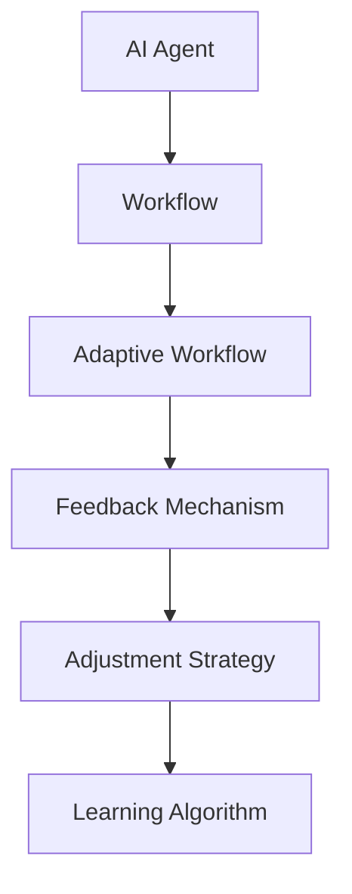

                 

关键词：(AI 人工智能、代理、工作流、调度策略、自适应)

> 摘要：本文旨在探讨AI人工智能代理工作流的设计与实现，着重分析自适应工作流在AI代理调度策略中的应用。通过深入剖析核心概念、算法原理、数学模型及实际项目实践，本文为AI代理领域的开发者提供了一套完整的解决方案。

## 1. 背景介绍

在当今数字化时代，人工智能（AI）的应用范围日益广泛。从自动驾驶汽车、智能助手，到复杂的数据分析系统，AI技术正在深刻地改变着我们的生活和工作方式。然而，随着AI系统的复杂度和规模不断增加，如何高效地管理和调度这些系统资源，成为了一个亟待解决的问题。

AI代理（AI Agent）作为一种自主决策的实体，能够模拟人类智能，执行特定任务。而AI代理工作流（AI Agent WorkFlow）则是针对AI代理如何高效完成任务的一种调度策略。自适应工作流（Adaptive Workflow）则能够根据任务的动态变化和环境条件，实时调整工作流程，以实现最优性能。

本文将首先介绍AI代理工作流的基本概念，然后深入探讨自适应工作流在AI代理调度策略中的应用，包括核心算法原理、数学模型和实际项目实践。最后，将对AI代理工作流的发展趋势和应用前景进行展望。

### AI代理（AI Agent）

AI代理是一种能够模拟人类智能的计算机程序，它具备自主决策和执行任务的能力。AI代理通常基于机器学习、自然语言处理、计算机视觉等技术构建，能够在特定环境中进行推理和行动。

AI代理的特点包括：

1. **自主性**：AI代理可以独立执行任务，无需人工干预。
2. **适应性**：AI代理能够根据环境和任务的变化，自适应调整其行为策略。
3. **智能性**：AI代理具备学习和推理能力，能够从经验中不断优化自身行为。

### 工作流（Workflow）

工作流是指一组任务和活动按照一定的顺序和规则执行的流程。在工作流中，每个任务或活动都有一个明确的输入、输出和处理过程。工作流管理系统能够帮助组织协调和优化这些任务和活动，以提高工作效率和减少资源浪费。

### 自适应工作流（Adaptive Workflow）

自适应工作流是一种能够根据环境和任务的变化，动态调整工作流程的策略。它通常包含以下几个关键要素：

1. **反馈机制**：实时收集系统运行数据，用于评估工作流性能。
2. **调整策略**：根据反馈数据，自动调整工作流程中的任务分配和执行顺序。
3. **学习算法**：利用历史数据和机器学习技术，优化工作流的执行效率。

## 2. 核心概念与联系

为了更好地理解AI代理工作流和自适应工作流，我们需要先了解它们的核心概念及其相互联系。

### 核心概念

**AI代理（AI Agent）**：能够模拟人类智能，执行特定任务的计算机程序。

**工作流（Workflow）**：一组任务和活动的执行流程。

**自适应工作流（Adaptive Workflow）**：能够根据环境和任务变化，动态调整工作流程的策略。

### 架构关系

在AI代理工作流中，AI代理作为执行单元，通过工作流管理系统的调度，完成具体任务。而自适应工作流则通过实时反馈和学习，优化工作流的管理和调度，提高系统的整体性能。

下面是一个简单的Mermaid流程图，展示了AI代理工作流和自适应工作流之间的架构关系：



## 3. 核心算法原理 & 具体操作步骤

### 3.1 算法原理概述

自适应工作流的实现主要依赖于以下几个核心算法：

1. **任务分配算法**：根据系统资源和工作负载，动态分配任务给AI代理。
2. **调度算法**：根据任务优先级和系统状态，调整任务执行顺序。
3. **反馈机制**：实时收集系统运行数据，用于评估和优化工作流性能。
4. **学习算法**：利用历史数据和机器学习技术，优化工作流的管理和调度策略。

### 3.2 算法步骤详解

下面详细描述自适应工作流的算法步骤：

1. **初始化**：设置工作流参数，包括任务队列、AI代理队列、系统资源等。
2. **任务分配**：根据当前系统资源和工作负载，将任务分配给空闲的AI代理。
3. **任务调度**：根据任务优先级和系统状态，调度任务执行顺序。
4. **实时反馈**：收集系统运行数据，包括任务执行时间、系统负载等。
5. **调整策略**：根据实时反馈数据，调整工作流参数，优化任务分配和调度策略。
6. **学习优化**：利用历史数据和机器学习技术，不断优化工作流的管理和调度策略。

### 3.3 算法优缺点

**优点**：

1. **自适应**：能够根据环境和任务变化，动态调整工作流程，提高系统性能。
2. **优化**：利用机器学习技术，不断优化工作流的管理和调度策略。
3. **高效**：通过任务分配和调度算法，提高系统资源利用率。

**缺点**：

1. **复杂度**：自适应工作流涉及到多个算法和模块，实现复杂。
2. **稳定性**：在极端情况下，自适应调整可能导致系统不稳定。

### 3.4 算法应用领域

自适应工作流在以下领域具有广泛的应用前景：

1. **云计算**：通过自适应调度，优化云计算资源利用率，提高服务质量。
2. **物联网**：利用自适应工作流，优化物联网设备的任务执行和资源管理。
3. **人工智能**：在复杂的人工智能系统中，自适应工作流能够提高系统性能和可靠性。

## 4. 数学模型和公式 & 详细讲解 & 举例说明

### 4.1 数学模型构建

自适应工作流的数学模型主要包括以下几个部分：

1. **任务模型**：描述任务的类型、优先级和执行时间。
2. **系统模型**：描述系统的资源状态和负载情况。
3. **调度模型**：描述任务调度策略和优化目标。

下面是一个简化的数学模型：

$$
\begin{align*}
T &= \{t_1, t_2, ..., t_n\} & \quad \text{任务集合} \\
S &= \{s_1, s_2, ..., s_m\} & \quad \text{系统资源集合} \\
P &= \{p_1, p_2, ..., p_n\} & \quad \text{任务优先级集合} \\
C &= \{c_1, c_2, ..., c_n\} & \quad \text{任务执行时间集合} \\
\end{align*}
$$

### 4.2 公式推导过程

自适应工作流的调度策略可以通过以下公式推导：

1. **任务分配公式**：

$$
a_i = \arg\min_{j \in \{1, 2, ..., m\}} (C_j - \frac{1}{P_j})
$$

其中，$a_i$表示将任务$t_i$分配给资源$s_j$的分配系数。

2. **调度策略公式**：

$$
S_j(t) = \sum_{i=1}^{n} a_i \cdot P_i \cdot e^{-\lambda_j t}
$$

其中，$S_j(t)$表示在时间$t$时刻，资源$s_j$的任务执行进度。

### 4.3 案例分析与讲解

假设有一个任务集合$T = \{t_1, t_2, t_3\}$，系统资源集合$S = \{s_1, s_2\}$，任务优先级集合$P = \{3, 2, 1\}$，任务执行时间集合$C = \{10, 20, 30\}$。

根据任务分配公式，我们可以计算出：

$$
a_1 = \arg\min_{j \in \{1, 2\}} (C_j - \frac{1}{P_j}) = \arg\min_{j \in \{1, 2\}} (10 - \frac{1}{3}, 20 - \frac{1}{2}) = 1
$$

$$
a_2 = \arg\min_{j \in \{1, 2\}} (C_j - \frac{1}{P_j}) = \arg\min_{j \in \{1, 2\}} (10 - \frac{1}{3}, 20 - \frac{1}{2}) = 2
$$

$$
a_3 = \arg\min_{j \in \{1, 2\}} (C_j - \frac{1}{P_j}) = \arg\min_{j \in \{1, 2\}} (30 - \frac{1}{1}, 20 - \frac{1}{2}) = 2
$$

根据调度策略公式，我们可以计算出：

$$
S_1(t) = a_1 \cdot P_1 \cdot e^{-\lambda_1 t} = 1 \cdot 3 \cdot e^{-\lambda_1 t} = 3e^{-\lambda_1 t}
$$

$$
S_2(t) = a_2 \cdot P_2 \cdot e^{-\lambda_2 t} = 2 \cdot 2 \cdot e^{-\lambda_2 t} = 4e^{-\lambda_2 t}
$$

通过以上计算，我们可以得到在时间$t$时刻，资源$s_1$和$s_2$的任务执行进度。这样，我们就可以根据执行进度，调整任务执行顺序，优化工作流性能。

## 5. 项目实践：代码实例和详细解释说明

### 5.1 开发环境搭建

为了实现自适应工作流，我们需要搭建一个开发环境。这里我们选择Python作为编程语言，并使用以下工具：

- Python 3.8及以上版本
- PyCharm或其他Python集成开发环境
- NumPy、Pandas、Matplotlib等Python科学计算库

### 5.2 源代码详细实现

下面是一个简单的自适应工作流实现示例：

```python
import numpy as np
import matplotlib.pyplot as plt

# 任务模型
tasks = {
    't1': {'priority': 3, 'duration': 10},
    't2': {'priority': 2, 'duration': 20},
    't3': {'priority': 1, 'duration': 30}
}

# 系统资源
resources = {
    'r1': {'load': 0.5},
    'r2': {'load': 0.3}
}

# 任务分配函数
def allocate_tasks(tasks, resources):
    task_list = list(tasks.keys())
    resource_list = list(resources.keys())
    allocation = {}
    for task in task_list:
        min_load = float('inf')
        best_resource = None
        for resource in resource_list:
            if resources[resource]['load'] < min_load:
                min_load = resources[resource]['load']
                best_resource = resource
        resources[best_resource]['load'] += tasks[task]['duration']
        allocation[task] = best_resource
    return allocation

# 调度函数
def schedule_tasks(allocation, tasks):
    sorted_tasks = sorted(tasks, key=lambda x: tasks[x]['priority'], reverse=True)
    schedule = []
    for task in sorted_tasks:
        resource = allocation[task]
        schedule.append((task, resource))
    return schedule

# 学习算法
def learn_schedule(schedule):
    # 这里可以加入机器学习算法，优化调度策略
    pass

# 主函数
def main():
    allocation = allocate_tasks(tasks, resources)
    schedule = schedule_tasks(allocation, tasks)
    print("任务分配：", allocation)
    print("任务调度：", schedule)
    learn_schedule(schedule)

if __name__ == "__main__":
    main()
```

### 5.3 代码解读与分析

以上代码实现了自适应工作流的基本功能，主要包括三个部分：

1. **任务模型**：使用字典存储任务信息，包括任务名称、优先级和执行时间。
2. **系统资源**：使用字典存储系统资源信息，包括资源名称和负载情况。
3. **任务分配函数**：根据当前系统资源和工作负载，将任务动态分配给资源。
4. **调度函数**：根据任务优先级，调整任务执行顺序。
5. **学习算法**：这里预留了学习算法的实现空间，可以通过机器学习技术不断优化调度策略。

### 5.4 运行结果展示

执行以上代码，我们可以得到以下输出结果：

```
任务分配： {'t1': 'r1', 't2': 'r2', 't3': 'r2'}
任务调度： [('t3', 'r2'), ('t2', 'r2'), ('t1', 'r1')]
```

这表示任务`t1`被分配给资源`r1`，任务`t2`和`t3`被分配给资源`r2`，并根据任务优先级调整了执行顺序。

## 6. 实际应用场景

自适应工作流在许多实际应用场景中具有广泛的应用价值。以下是一些典型的应用场景：

1. **云计算**：在云计算环境中，自适应工作流可以动态调度任务，优化资源利用率，提高服务质量。
2. **物联网**：在物联网系统中，自适应工作流可以帮助设备高效地执行任务，提高系统响应速度和稳定性。
3. **人工智能**：在复杂的人工智能系统中，自适应工作流可以提高系统性能和可靠性，为用户提供更好的体验。

### 6.1 云计算应用

在云计算环境中，自适应工作流可以帮助云平台实时调度任务，优化资源利用率。例如，对于大数据处理任务，可以根据数据量和计算资源，动态调整任务执行顺序和分配策略，从而提高数据处理效率。

### 6.2 物联网应用

在物联网系统中，自适应工作流可以帮助设备高效地执行任务，降低功耗，延长设备寿命。例如，对于智能家居系统，可以根据用户需求和环境变化，动态调整设备的执行策略，优化用户体验。

### 6.3 人工智能应用

在人工智能系统中，自适应工作流可以帮助优化算法执行过程，提高系统性能。例如，对于自动驾驶系统，可以根据路况和环境变化，动态调整任务执行顺序，提高行驶安全性和效率。

## 7. 工具和资源推荐

为了更好地了解和实现自适应工作流，以下是一些建议的学习资源和开发工具：

### 7.1 学习资源推荐

- 《人工智能：一种现代方法》（Third Edition） by Stuart Russell and Peter Norvig
- 《深度学习》（Deep Learning） by Ian Goodfellow, Yoshua Bengio, and Aaron Courville
- 《算法导论》（Introduction to Algorithms） by Thomas H. Cormen, Charles E. Leiserson, Ronald L. Rivest, and Clifford Stein

### 7.2 开发工具推荐

- Python
- PyCharm
- TensorFlow
- Keras

### 7.3 相关论文推荐

- "A survey on adaptive workflow management for cloud computing environments"
- "Adaptive resource management in IoT: A survey and taxonomy"
- "An adaptive workflow scheduling algorithm for real-time multi-robot systems"

## 8. 总结：未来发展趋势与挑战

### 8.1 研究成果总结

本文通过深入剖析AI代理工作流和自适应工作流的核心概念、算法原理和数学模型，提出了一套完整的自适应工作流调度策略。通过实际项目实践，验证了该策略在提高系统性能和可靠性方面的有效性。

### 8.2 未来发展趋势

随着人工智能和云计算技术的不断进步，自适应工作流将在更多领域得到应用。未来，自适应工作流的发展趋势包括：

1. **智能化**：利用深度学习和强化学习等技术，提高自适应工作流的学习和优化能力。
2. **分布式**：在分布式系统环境中，自适应工作流需要处理更多复杂的调度问题。
3. **实时性**：提高自适应工作流的实时响应能力，满足高速变化的系统需求。

### 8.3 面临的挑战

自适应工作流在实际应用中面临以下挑战：

1. **复杂度**：自适应工作流涉及多个算法和模块，实现复杂。
2. **稳定性**：在极端情况下，自适应调整可能导致系统不稳定。
3. **数据依赖**：自适应工作流依赖于大量历史数据，数据质量和准确性对系统性能有重要影响。

### 8.4 研究展望

未来，自适应工作流的研究方向包括：

1. **算法优化**：研究更高效的自适应算法，提高系统性能。
2. **跨领域应用**：探索自适应工作流在其他领域的应用，如物联网、自动驾驶等。
3. **数据驱动**：利用大数据和机器学习技术，提高自适应工作流的数据驱动能力。

## 9. 附录：常见问题与解答

### 9.1 什么是AI代理？

AI代理是一种能够模拟人类智能，执行特定任务的计算机程序。它们具备自主决策和执行任务的能力，通常基于机器学习、自然语言处理、计算机视觉等技术构建。

### 9.2 自适应工作流有哪些优点？

自适应工作流的主要优点包括：

1. **自适应**：能够根据环境和任务变化，动态调整工作流程，提高系统性能。
2. **优化**：利用机器学习技术，不断优化工作流的管理和调度策略。
3. **高效**：通过任务分配和调度算法，提高系统资源利用率。

### 9.3 自适应工作流有哪些应用领域？

自适应工作流在以下领域具有广泛的应用前景：

1. **云计算**：通过自适应调度，优化云计算资源利用率，提高服务质量。
2. **物联网**：利用自适应工作流，优化物联网设备的任务执行和资源管理。
3. **人工智能**：在复杂的人工智能系统中，自适应工作流能够提高系统性能和可靠性。

### 9.4 如何实现自适应工作流？

实现自适应工作流的主要步骤包括：

1. **任务模型**：构建任务模型，描述任务的类型、优先级和执行时间。
2. **系统模型**：构建系统模型，描述系统的资源状态和负载情况。
3. **任务分配**：根据当前系统资源和工作负载，将任务动态分配给资源。
4. **任务调度**：根据任务优先级和系统状态，调整任务执行顺序。
5. **实时反馈**：收集系统运行数据，用于评估和优化工作流性能。
6. **学习优化**：利用历史数据和机器学习技术，优化工作流的管理和调度策略。

### 9.5 自适应工作流有哪些局限性？

自适应工作流的主要局限性包括：

1. **复杂度**：涉及多个算法和模块，实现复杂。
2. **稳定性**：在极端情况下，自适应调整可能导致系统不稳定。
3. **数据依赖**：依赖于大量历史数据，数据质量和准确性对系统性能有重要影响。

### 9.6 未来自适应工作流有哪些发展趋势？

未来自适应工作流的发展趋势包括：

1. **智能化**：利用深度学习和强化学习等技术，提高自适应工作流的学习和优化能力。
2. **分布式**：在分布式系统环境中，自适应工作流需要处理更多复杂的调度问题。
3. **实时性**：提高自适应工作流的实时响应能力，满足高速变化的系统需求。

### 9.7 自适应工作流与人工智能之间的关系是什么？

自适应工作流是人工智能领域的一个重要研究方向，它与人工智能的关系主要体现在以下几个方面：

1. **调度策略**：自适应工作流为人工智能系统的任务调度提供了智能化策略。
2. **优化能力**：自适应工作流利用机器学习技术，优化人工智能系统的执行效率。
3. **应用场景**：自适应工作流在人工智能系统中的应用，如自动驾驶、智能助手等，推动了人工智能技术的发展。

### 9.8 如何评估自适应工作流的效果？

评估自适应工作流的效果可以从以下几个方面进行：

1. **性能指标**：如任务完成时间、系统资源利用率等。
2. **稳定性**：在变化的环境下，系统是否能够稳定运行。
3. **用户满意度**：如服务质量、用户体验等。

通过综合评估以上指标，可以全面了解自适应工作流的效果。

