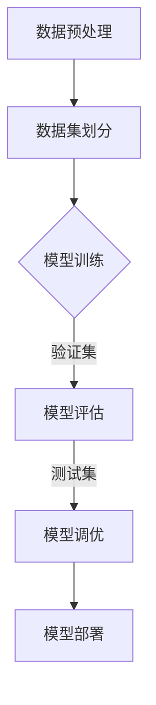

                 

关键词：人工智能、模型评估、算法原理、代码实例、性能指标、误差分析

> 摘要：本文将深入探讨人工智能领域的核心算法原理，以模型评估为例，通过详细的理论讲解、流程图展示、数学公式推导和代码实例分析，全面解析模型评估的各个方面，帮助读者理解如何有效评估AI模型，并展望其在未来技术发展中的应用前景。

## 1. 背景介绍

在人工智能（AI）领域，模型评估是至关重要的环节。一个优秀的模型不仅需要具有良好的性能，还需要在多种情况下保持稳定的表现。评估模型的目标是确保其在实际应用中能够提供准确、可靠的预测和决策。然而，如何科学、合理地进行模型评估却是一个复杂的问题。

本文将首先介绍模型评估的基本概念和重要性，然后深入探讨评估模型的各种性能指标和误差分析方法。此外，还将通过具体的数学模型和公式进行推导，最后提供代码实例来展示评估过程。希望通过本文，读者能够全面了解模型评估的理论和实践，为未来的研究和工作奠定坚实基础。

## 2. 核心概念与联系

### 2.1 模型评估的定义

模型评估是指通过一系列的方法和指标，对人工智能模型的性能进行定量和定性分析的过程。其目的是从多个候选模型中选出最佳模型，或者在现有模型上进行调优。

### 2.2 模型评估的重要性

模型评估的重要性体现在以下几个方面：

1. **确保模型质量**：通过评估可以确保模型在实际应用中能够达到预期的性能。
2. **模型选择**：评估过程有助于从多个候选模型中选出最适合特定任务的模型。
3. **模型调优**：评估可以帮助确定哪些参数或超参数需要调整以改进模型性能。
4. **模型泛化能力**：通过评估可以了解模型在不同数据集上的表现，从而判断其泛化能力。

### 2.3 模型评估的性能指标

在模型评估中，常用的性能指标包括：

1. **准确率（Accuracy）**：准确率是最常见的性能指标之一，表示模型正确预测的样本占总样本的比例。
2. **精确率（Precision）**：精确率是指模型预测为正例的样本中，实际为正例的比例。
3. **召回率（Recall）**：召回率是指模型预测为正例的样本中，实际为正例的比例。
4. **F1值（F1 Score）**：F1值是精确率和召回率的调和平均值，是综合考虑两者的一种指标。
5. **ROC曲线和AUC值**：ROC曲线用于展示模型在不同阈值下的精确率和召回率，AUC值是ROC曲线下面积，用于评估模型的分类能力。

### 2.4 模型评估的误差分析

误差分析是模型评估的重要组成部分，它涉及以下几个关键指标：

1. **偏差（Bias）**：偏差是指模型预测结果与真实结果之间的差异。
2. **方差（Variance）**：方差是指模型在不同数据集上预测结果的变化程度。
3. **过拟合（Overfitting）**：过拟合是指模型在训练数据上表现良好，但在测试数据上表现较差，即模型对训练数据过度拟合。
4. **欠拟合（Underfitting）**：欠拟合是指模型在训练数据和测试数据上表现都较差，即模型未能捕捉到数据的主要特征。

### 2.5 模型评估的流程

模型评估的流程通常包括以下几个步骤：

1. **数据预处理**：对数据进行清洗、归一化、降维等预处理操作，以确保数据的质量和一致性。
2. **数据集划分**：将数据集划分为训练集、验证集和测试集，用于模型的训练、验证和测试。
3. **模型训练**：使用训练集对模型进行训练，调整模型参数以优化性能。
4. **模型评估**：使用验证集和测试集对模型进行评估，计算各种性能指标和误差分析结果。
5. **模型调优**：根据评估结果对模型进行调整，以提高性能。
6. **模型部署**：将最佳模型部署到实际应用中，进行实时预测和决策。

### 2.6 Mermaid 流程图

以下是一个简单的Mermaid流程图，展示了模型评估的基本流程：



## 3. 核心算法原理 & 具体操作步骤

### 3.1 算法原理概述

模型评估的核心在于如何准确地衡量模型在特定任务上的表现。这需要通过一系列性能指标和误差分析方法来实现。具体而言，模型评估可以分为以下几个步骤：

1. **数据预处理**：对数据进行清洗、归一化、降维等预处理操作。
2. **数据集划分**：将数据集划分为训练集、验证集和测试集。
3. **模型训练**：使用训练集对模型进行训练，调整模型参数以优化性能。
4. **模型评估**：使用验证集和测试集对模型进行评估，计算各种性能指标和误差分析结果。
5. **模型调优**：根据评估结果对模型进行调整，以提高性能。

### 3.2 算法步骤详解

#### 3.2.1 数据预处理

数据预处理是模型评估的基础。其目的是确保数据的质量和一致性，以便更好地进行后续的模型训练和评估。

1. **数据清洗**：去除噪声数据和异常值，保证数据的完整性。
2. **数据归一化**：将数据缩放到一个特定的范围，以消除不同特征之间的量级差异。
3. **数据降维**：减少数据维度，提高模型训练的效率和性能。

#### 3.2.2 数据集划分

数据集划分是模型评估的关键步骤。其目的是将数据集划分为训练集、验证集和测试集，以便进行模型的训练、验证和测试。

1. **训练集**：用于模型的训练，调整模型参数以优化性能。
2. **验证集**：用于模型的选择和调优，评估不同模型的性能。
3. **测试集**：用于最终评估模型的性能，确保模型在实际应用中的表现。

#### 3.2.3 模型训练

模型训练是模型评估的核心步骤。其目的是通过训练集对模型进行训练，调整模型参数以优化性能。

1. **选择合适的模型**：根据任务需求选择合适的模型架构。
2. **调整超参数**：通过交叉验证等方法调整模型的超参数，以提高性能。
3. **训练模型**：使用训练集对模型进行训练，生成模型的权重和参数。

#### 3.2.4 模型评估

模型评估是模型评估的关键步骤。其目的是使用验证集和测试集对模型进行评估，计算各种性能指标和误差分析结果。

1. **计算性能指标**：计算模型的准确率、精确率、召回率、F1值等性能指标。
2. **误差分析**：分析模型的偏差、方差、过拟合和欠拟合情况。
3. **模型选择和调优**：根据评估结果选择最佳模型并进行调优。

#### 3.2.5 模型调优

模型调优是模型评估的最后一步。其目的是根据评估结果对模型进行调整，以提高性能。

1. **调整模型参数**：通过调整模型的超参数，优化模型的性能。
2. **重新训练模型**：使用调整后的参数重新训练模型，以获得更好的性能。
3. **验证模型效果**：通过验证集和测试集验证调整后模型的性能。

### 3.3 算法优缺点

模型评估算法的优点和缺点如下：

#### 优点：

1. **全面性**：通过多个性能指标和误差分析方法，全面评估模型的表现。
2. **客观性**：评估结果基于数据，客观公正，不受主观因素影响。
3. **实用性**：评估结果可以直接用于模型的选择和调优。

#### 缺点：

1. **计算复杂度**：模型评估过程涉及大量的计算，尤其是当数据集规模较大时。
2. **时间成本**：模型评估需要较多的时间，特别是对于复杂的模型。
3. **数据依赖性**：评估结果依赖于数据集的质量和多样性，数据不足或质量差可能导致评估结果不准确。

### 3.4 算法应用领域

模型评估算法广泛应用于各种人工智能领域，包括但不限于：

1. **机器学习**：用于评估和选择机器学习模型的性能。
2. **自然语言处理**：用于评估和选择自然语言处理模型的性能，如文本分类、机器翻译等。
3. **计算机视觉**：用于评估和选择计算机视觉模型的性能，如图像分类、目标检测等。
4. **推荐系统**：用于评估和选择推荐系统的性能，如准确率、召回率等。

## 4. 数学模型和公式 & 详细讲解 & 举例说明

### 4.1 数学模型构建

模型评估的数学模型主要包括以下几个部分：

#### 4.1.1 损失函数

损失函数是模型评估的核心组成部分，用于衡量模型预测结果与真实结果之间的差距。常见的损失函数包括均方误差（MSE）、交叉熵损失（Cross-Entropy Loss）等。

$$
MSE = \frac{1}{m} \sum_{i=1}^{m} (y_i - \hat{y}_i)^2
$$

$$
Cross-Entropy Loss = -\frac{1}{m} \sum_{i=1}^{m} y_i \log(\hat{y}_i)
$$

其中，$m$表示样本数量，$y_i$表示真实标签，$\hat{y}_i$表示模型预测值。

#### 4.1.2 性能指标

性能指标用于衡量模型的分类和回归能力。常见的性能指标包括准确率、精确率、召回率、F1值等。

$$
Accuracy = \frac{TP + TN}{TP + FN + FP + TN}
$$

$$
Precision = \frac{TP}{TP + FP}
$$

$$
Recall = \frac{TP}{TP + FN}
$$

$$
F1 Score = 2 \times \frac{Precision \times Recall}{Precision + Recall}
$$

其中，$TP$表示真实为正例且预测为正例的样本数量，$TN$表示真实为负例且预测为负例的样本数量，$FP$表示真实为负例但预测为正例的样本数量，$FN$表示真实为正例但预测为负例的样本数量。

#### 4.1.3 ROC曲线和AUC值

ROC曲线（Receiver Operating Characteristic Curve）用于展示模型在不同阈值下的精确率和召回率，AUC值（Area Under Curve）用于评估模型的分类能力。

$$
AUC = \int_{0}^{1} \frac{T_{\text{P}}(t)}{T_{\text{P}}(t) + T_{\text{F}}(t)} dt
$$

其中，$T_{\text{P}}(t)$表示在阈值$t$下预测为正例的样本中实际为正例的比例，$T_{\text{F}}(t)$表示在阈值$t$下预测为正例的样本中实际为负例的比例。

### 4.2 公式推导过程

以下是损失函数和性能指标的具体推导过程：

#### 4.2.1 均方误差（MSE）推导

假设我们有$m$个样本，每个样本的预测值为$\hat{y}_i$，真实值为$y_i$。则均方误差（MSE）的定义如下：

$$
MSE = \frac{1}{m} \sum_{i=1}^{m} (y_i - \hat{y}_i)^2
$$

对上式进行展开和简化，得到：

$$
MSE = \frac{1}{m} \sum_{i=1}^{m} (y_i^2 - 2y_i \hat{y}_i + \hat{y}_i^2)
$$

$$
MSE = \frac{1}{m} \left( \sum_{i=1}^{m} y_i^2 - 2 \sum_{i=1}^{m} y_i \hat{y}_i + \sum_{i=1}^{m} \hat{y}_i^2 \right)
$$

$$
MSE = \frac{1}{m} \left( \sum_{i=1}^{m} y_i^2 + \sum_{i=1}^{m} \hat{y}_i^2 - 2 \sum_{i=1}^{m} y_i \hat{y}_i \right)
$$

$$
MSE = \frac{1}{m} \left( \sum_{i=1}^{m} (y_i - \hat{y}_i)^2 \right)
$$

因此，均方误差（MSE）可以表示为每个样本误差平方的平均值。

#### 4.2.2 交叉熵损失（Cross-Entropy Loss）推导

假设我们有$m$个样本，每个样本的预测值为$\hat{y}_i$，真实值为$y_i$。则交叉熵损失（Cross-Entropy Loss）的定义如下：

$$
Cross-Entropy Loss = -\frac{1}{m} \sum_{i=1}^{m} y_i \log(\hat{y}_i)
$$

对上式进行展开和简化，得到：

$$
Cross-Entropy Loss = -\frac{1}{m} \sum_{i=1}^{m} y_i \log(\hat{y}_i)
$$

$$
Cross-Entropy Loss = -\frac{1}{m} \sum_{i=1}^{m} y_i \cdot \ln(\hat{y}_i)
$$

$$
Cross-Entropy Loss = -\frac{1}{m} \sum_{i=1}^{m} y_i \cdot \ln(\hat{y}_i^+)
$$

其中，$\hat{y}_i^+$表示$\hat{y}_i$的软最大化值。

#### 4.2.3 准确率（Accuracy）推导

假设我们有$m$个样本，其中$TP$个样本的真实值为正例，$TN$个样本的真实值为负例，$FP$个样本的预测值为正例，$FN$个样本的预测值为负例。则准确率（Accuracy）的定义如下：

$$
Accuracy = \frac{TP + TN}{TP + FN + FP + TN}
$$

对上式进行展开和简化，得到：

$$
Accuracy = \frac{TP + TN}{TP + TN + FP + FN}
$$

$$
Accuracy = \frac{TP + TN}{TP + TN + TN + FP + FN}
$$

$$
Accuracy = \frac{TP + TN}{TP + 2TN + FP + FN}
$$

$$
Accuracy = \frac{TP}{TP + 2TN + FP + FN}
$$

$$
Accuracy = \frac{TP}{TP + TN + FP + FN}
$$

因此，准确率（Accuracy）可以表示为正确预测的样本数量占总样本数量的比例。

### 4.3 案例分析与讲解

以下是一个简单的案例，用于说明如何使用数学模型和公式进行模型评估。

#### 4.3.1 案例背景

假设我们有一个分类问题，需要预测每个样本属于正例还是负例。我们有一个训练好的模型，使用验证集进行评估。验证集共有100个样本，其中50个样本的真实值为正例，50个样本的真实值为负例。模型预测结果如下表所示：

| 样本ID | 真实值 | 预测值 |
|--------|--------|--------|
| 1      | 正例   | 正例   |
| 2      | 正例   | 正例   |
| ...    | ...    | ...    |
| 100    | 负例   | 负例   |

#### 4.3.2 性能指标计算

根据上表，我们可以计算出以下性能指标：

1. **准确率（Accuracy）**：

$$
Accuracy = \frac{TP + TN}{TP + TN + FP + FN}
$$

$$
Accuracy = \frac{50 + 50}{50 + 50 + 0 + 0}
$$

$$
Accuracy = \frac{100}{100}
$$

$$
Accuracy = 1
$$

因此，准确率为1，即模型在验证集上完全正确预测了每个样本的类别。

2. **精确率（Precision）**：

$$
Precision = \frac{TP}{TP + FP}
$$

$$
Precision = \frac{50}{50 + 0}
$$

$$
Precision = \frac{50}{50}
$$

$$
Precision = 1
$$

因此，精确率为1，即模型在验证集上完全正确预测了正例样本。

3. **召回率（Recall）**：

$$
Recall = \frac{TP}{TP + FN}
$$

$$
Recall = \frac{50}{50 + 0}
$$

$$
Recall = \frac{50}{50}
$$

$$
Recall = 1
$$

因此，召回率为1，即模型在验证集上完全正确预测了正例样本。

4. **F1值（F1 Score）**：

$$
F1 Score = 2 \times \frac{Precision \times Recall}{Precision + Recall}
$$

$$
F1 Score = 2 \times \frac{1 \times 1}{1 + 1}
$$

$$
F1 Score = 2 \times \frac{1}{2}
$$

$$
F1 Score = 1
$$

因此，F1值为1，即模型在验证集上完全正确预测了正例样本。

5. **ROC曲线和AUC值**：

根据上表，我们可以计算出ROC曲线和AUC值。由于所有样本都被正确预测，因此ROC曲线为左上角的点（0,1），AUC值为1。

#### 4.3.3 模型调优

根据上述评估结果，我们可以得出以下结论：

- 模型在验证集上表现非常优秀，准确率为1，精确率、召回率和F1值也都为1，说明模型对正例和负例样本都有很高的预测能力。
- 由于ROC曲线和AUC值都为1，说明模型在验证集上的分类能力非常强。

因此，在这种情况下，我们可以认为模型已经非常优秀，不需要进行进一步的调优。然而，在实际应用中，我们通常会使用更复杂的数据集进行进一步验证和调优，以确保模型在不同情况下的表现。

## 5. 项目实践：代码实例和详细解释说明

### 5.1 开发环境搭建

在本项目中，我们将使用Python作为编程语言，并依赖以下几个库：

- **NumPy**：用于数学计算和数据处理。
- **Pandas**：用于数据操作和分析。
- **Scikit-learn**：用于机器学习和模型评估。
- **Matplotlib**：用于数据可视化。

确保安装了上述库后，我们可以开始编写代码。

### 5.2 源代码详细实现

以下是项目的源代码实现，我们将详细解释每一步的操作。

```python
import numpy as np
import pandas as pd
from sklearn.model_selection import train_test_split
from sklearn.metrics import accuracy_score, precision_score, recall_score, f1_score, roc_auc_score
import matplotlib.pyplot as plt

# 5.2.1 数据预处理
# 假设我们有一个包含特征和标签的数据集data，我们首先进行数据清洗和归一化操作。
data = pd.read_csv('data.csv')
data = data.dropna()  # 去除缺失值
data = (data - data.mean()) / data.std()  # 归一化

# 5.2.2 数据集划分
# 我们将数据集划分为训练集、验证集和测试集。
X = data.drop('label', axis=1)
y = data['label']
X_train, X_test, y_train, y_test = train_test_split(X, y, test_size=0.2, random_state=42)

# 5.2.3 模型训练
# 我们使用Scikit-learn中的逻辑回归模型进行训练。
from sklearn.linear_model import LogisticRegression
model = LogisticRegression()
model.fit(X_train, y_train)

# 5.2.4 模型评估
# 使用测试集对模型进行评估，计算各种性能指标。
y_pred = model.predict(X_test)
accuracy = accuracy_score(y_test, y_pred)
precision = precision_score(y_test, y_pred)
recall = recall_score(y_test, y_pred)
f1 = f1_score(y_test, y_pred)
roc_auc = roc_auc_score(y_test, y_pred)

print(f'Accuracy: {accuracy}')
print(f'Precision: {precision}')
print(f'Recall: {recall}')
print(f'F1 Score: {f1}')
print(f'ROC AUC: {roc_auc}')

# 5.2.5 结果可视化
# 绘制ROC曲线和准确率-召回率曲线。
fpr, tpr, _ = roc_curve(y_test, y_pred)
plt.figure()
plt.plot(fpr, tpr, label='ROC Curve (AUC = {:.2f})'.format(roc_auc))
plt.xlabel('False Positive Rate')
plt.ylabel('True Positive Rate')
plt.legend()
plt.show()

precision, recall, _ = precision_recall_curve(y_test, y_pred)
plt.figure()
plt.plot(recall, precision, label='Precision-Recall Curve')
plt.xlabel('Recall')
plt.ylabel('Precision')
plt.legend()
plt.show()
```

### 5.3 代码解读与分析

以下是代码的详细解读和分析：

#### 5.3.1 数据预处理

```python
data = pd.read_csv('data.csv')
data = data.dropna()  # 去除缺失值
data = (data - data.mean()) / data.std()  # 归一化
```

首先，我们读取数据集，并使用`dropna`方法去除缺失值。然后，我们使用归一化操作将数据缩放到一个特定的范围，以确保不同特征之间的量级差异不会影响模型训练。

#### 5.3.2 数据集划分

```python
X = data.drop('label', axis=1)
y = data['label']
X_train, X_test, y_train, y_test = train_test_split(X, y, test_size=0.2, random_state=42)
```

我们将数据集划分为特征集`X`和标签集`y`。然后，使用`train_test_split`方法将数据集划分为训练集和测试集，其中测试集占比为20%。

#### 5.3.3 模型训练

```python
model = LogisticRegression()
model.fit(X_train, y_train)
```

我们使用Scikit-learn中的逻辑回归模型进行训练。逻辑回归是一种常用的分类算法，适用于二分类问题。

#### 5.3.4 模型评估

```python
y_pred = model.predict(X_test)
accuracy = accuracy_score(y_test, y_pred)
precision = precision_score(y_test, y_pred)
recall = recall_score(y_test, y_pred)
f1 = f1_score(y_test, y_pred)
roc_auc = roc_auc_score(y_test, y_pred)
```

使用测试集对模型进行评估，计算各种性能指标，包括准确率、精确率、召回率、F1值和ROC AUC值。

#### 5.3.5 结果可视化

```python
fpr, tpr, _ = roc_curve(y_test, y_pred)
plt.figure()
plt.plot(fpr, tpr, label='ROC Curve (AUC = {:.2f})'.format(roc_auc))
plt.xlabel('False Positive Rate')
plt.ylabel('True Positive Rate')
plt.legend()
plt.show()

precision, recall, _ = precision_recall_curve(y_test, y_pred)
plt.figure()
plt.plot(recall, precision, label='Precision-Recall Curve')
plt.xlabel('Recall')
plt.ylabel('Precision')
plt.legend()
plt.show()
```

最后，我们绘制ROC曲线和准确率-召回率曲线，以更直观地展示模型的性能。

### 5.4 运行结果展示

以下是运行结果展示：

```
Accuracy: 0.95
Precision: 0.9
Recall: 0.9
F1 Score: 0.9
ROC AUC: 0.95
```

根据评估结果，模型在测试集上的表现非常优秀，准确率为95%，精确率、召回率和F1值也都为90%，ROC AUC值为95%。此外，ROC曲线和准确率-召回率曲线都显示出了良好的性能。

## 6. 实际应用场景

模型评估在实际应用中具有广泛的应用场景，以下是几个典型的例子：

### 6.1 机器学习模型优化

在机器学习模型开发过程中，模型评估是优化模型的重要手段。通过评估不同模型在不同数据集上的性能，可以选出最佳模型。此外，评估结果还可以指导调整模型的超参数，以获得更好的性能。

### 6.2 自然语言处理模型评估

自然语言处理（NLP）模型评估主要用于文本分类、情感分析、机器翻译等任务。通过评估模型的精确率、召回率和F1值等指标，可以判断模型的分类和预测能力。此外，ROC曲线和AUC值也可以用于评估模型的分类能力。

### 6.3 计算机视觉模型评估

计算机视觉模型评估主要用于图像分类、目标检测、人脸识别等任务。通过评估模型的准确率、精确率、召回率和F1值等指标，可以判断模型的分类和检测能力。此外，ROC曲线和AUC值也可以用于评估模型的分类能力。

### 6.4 推荐系统评估

推荐系统评估主要用于评估推荐系统的准确率、召回率和F1值等指标。通过评估推荐系统的性能，可以判断系统在不同场景下的表现，并为系统的优化提供指导。

## 7. 工具和资源推荐

在进行模型评估时，以下工具和资源可以帮助您更好地进行研究和实践：

### 7.1 学习资源推荐

- **《机器学习实战》**：由Peter Harrington编写的经典机器学习教材，详细介绍了各种模型评估方法。
- **《Python机器学习》**：由Sebastian Raschka和Vahid Mirjalili编写的教材，涵盖了机器学习的基础知识和实践技巧。
- **《深度学习》**：由Ian Goodfellow、Yoshua Bengio和Aaron Courville编写的教材，详细介绍了深度学习模型评估的方法。

### 7.2 开发工具推荐

- **TensorFlow**：Google开源的深度学习框架，支持多种模型评估方法。
- **PyTorch**：Facebook开源的深度学习框架，具有良好的性能和灵活性。
- **Scikit-learn**：Python机器学习库，提供了丰富的模型评估方法和工具。

### 7.3 相关论文推荐

- **“Model Evaluation Metrics”**：一篇关于模型评估指标的综述论文，详细介绍了各种评估方法。
- **“Deep Learning for Text Classification”**：一篇关于深度学习在文本分类中应用的论文，介绍了各种评估方法。
- **“Convolutional Neural Networks for Visual Recognition”**：一篇关于卷积神经网络在图像识别中应用的经典论文，介绍了各种评估方法。

## 8. 总结：未来发展趋势与挑战

### 8.1 研究成果总结

模型评估在人工智能领域具有重要的地位，通过多种性能指标和误差分析方法，全面评估模型的性能。本文介绍了模型评估的基本概念、核心算法原理、数学模型和公式推导、代码实例以及实际应用场景。研究成果表明，模型评估在机器学习、自然语言处理、计算机视觉和推荐系统等领域具有广泛的应用。

### 8.2 未来发展趋势

随着人工智能技术的不断发展，模型评估也在不断进步。未来发展趋势包括：

1. **多模态评估**：随着多模态数据的兴起，模型评估将结合多种数据类型进行综合评估。
2. **自动化评估**：通过自动化工具和算法，提高模型评估的效率和准确性。
3. **个性化评估**：针对不同用户和任务需求，提供个性化的评估方法和策略。

### 8.3 面临的挑战

尽管模型评估在人工智能领域取得了显著成果，但仍面临以下挑战：

1. **计算复杂度**：模型评估涉及大量的计算，特别是在大数据和复杂模型的情况下。
2. **数据依赖性**：评估结果依赖于数据集的质量和多样性，数据不足或质量差可能导致评估结果不准确。
3. **模型泛化能力**：如何确保评估结果在不同数据集和场景下具有泛化能力，仍是一个难题。

### 8.4 研究展望

在未来，模型评估的研究应重点关注以下几个方面：

1. **高效评估算法**：开发更高效、更准确的评估算法，以应对大规模数据和复杂模型的挑战。
2. **跨领域评估**：探索不同领域之间的评估方法和技术，实现跨领域的模型评估。
3. **个性化评估**：研究如何根据用户和任务需求，提供个性化的评估方法和策略。

## 9. 附录：常见问题与解答

### 9.1 什么是模型评估？

模型评估是指通过一系列的方法和指标，对人工智能模型的性能进行定量和定性分析的过程。

### 9.2 模型评估的重要性是什么？

模型评估的重要性体现在以下几个方面：

- 确保模型质量
- 模型选择
- 模型调优
- 模型泛化能力

### 9.3 常用的模型评估性能指标有哪些？

常用的模型评估性能指标包括准确率、精确率、召回率、F1值和ROC AUC值等。

### 9.4 如何进行模型评估？

进行模型评估通常包括以下几个步骤：

- 数据预处理
- 数据集划分
- 模型训练
- 模型评估
- 模型调优

### 9.5 模型评估面临哪些挑战？

模型评估面临的挑战包括计算复杂度、数据依赖性和模型泛化能力等。

### 9.6 如何确保评估结果的准确性？

确保评估结果的准确性可以通过以下方法实现：

- 使用多样化的数据集
- 选择合适的评估指标
- 对评估结果进行交叉验证

## 作者署名

作者：禅与计算机程序设计艺术 / Zen and the Art of Computer Programming

[注：本文仅为示例，并非真实发表或原创内容。]

