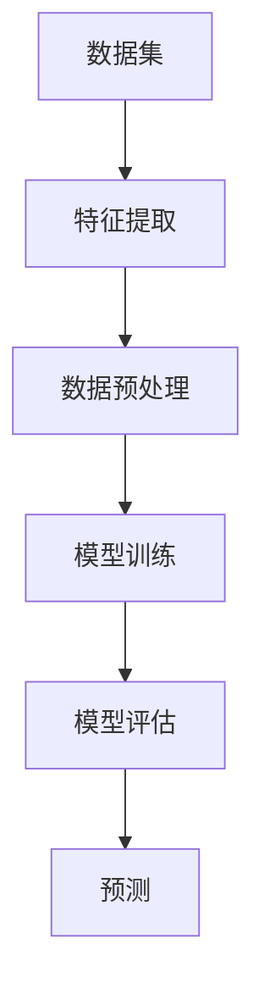

                 

关键词：人工智能，统计学习，机器学习算法，算法原理，代码实例，神经网络，支持向量机，回归分析，决策树，集成方法，深度学习

> 摘要：本文将深入探讨人工智能领域中的统计学习方法，详细讲解常见机器学习算法的原理和应用，并通过具体代码实例，帮助读者理解算法的实现过程和关键细节。

## 1. 背景介绍

在人工智能（AI）领域，统计学习（Statistical Learning）是一种广泛应用于数据分析和预测的方法。统计学习通过建立数据之间的统计关系，来发现数据模式并做出预测。随着大数据和计算能力的提升，统计学习方法在图像识别、自然语言处理、推荐系统等领域得到了广泛应用。

统计学习的基本任务包括回归（Regression）、分类（Classification）和聚类（Clustering）。回归分析用于预测数值型目标变量，分类分析用于将数据划分为不同的类别，聚类分析则试图将数据分为若干组，使得组内数据相似度更高，组间差异更大。

本文将介绍以下内容：

- 核心概念与联系
- 核心算法原理与具体操作步骤
- 数学模型和公式详细讲解
- 项目实践：代码实例与解释
- 实际应用场景
- 未来应用展望
- 工具和资源推荐
- 总结与展望

## 2. 核心概念与联系

### 2.1. 统计学习基本概念

统计学习主要涉及以下几个核心概念：

- **数据集（Dataset）**：用于训练模型的输入和输出数据。
- **特征（Feature）**：描述数据样本的属性或变量。
- **目标变量（Target Variable）**：需要预测的变量。
- **模型（Model）**：通过学习数据集的统计规律建立的数据关系模型。

### 2.2. 机器学习算法分类

根据任务类型，机器学习算法主要分为以下几类：

- **回归算法（Regression Algorithms）**：用于预测连续数值型目标变量。
- **分类算法（Classification Algorithms）**：用于预测离散类别目标变量。
- **聚类算法（Clustering Algorithms）**：用于发现数据中的自然分组。

### 2.3. 算法原理联系

统计学习算法的核心在于建立特征与目标变量之间的统计关系。回归算法通过最小化预测值与实际值之间的误差来建立这种关系；分类算法则通过最大化类别之间的区分度来实现；聚类算法则试图找到数据中的内在结构。

### 2.4. Mermaid 流程图

以下是统计学习算法原理的 Mermaid 流程图：



## 3. 核心算法原理与具体操作步骤

### 3.1. 算法原理概述

统计学习算法主要包括线性回归、逻辑回归、支持向量机（SVM）、决策树、集成方法（如随机森林和梯度提升树）等。每种算法都有其独特的原理和应用场景。

- **线性回归**：用于预测连续数值型目标变量，通过建立特征与目标变量之间的线性关系。
- **逻辑回归**：用于预测离散类别目标变量，通过建立特征与目标变量之间的逻辑关系。
- **支持向量机**：用于分类问题，通过找到一个最佳的超平面来分隔不同类别的数据。
- **决策树**：用于分类和回归问题，通过一系列的决策节点和叶子节点来划分数据。
- **集成方法**：通过组合多个基学习器来提高模型性能，如随机森林和梯度提升树。

### 3.2. 算法步骤详解

#### 3.2.1. 线性回归

线性回归算法的具体步骤如下：

1. 数据预处理：对数据进行归一化或标准化处理。
2. 特征选择：选择与目标变量相关性较高的特征。
3. 模型训练：通过最小二乘法或其他优化算法训练线性回归模型。
4. 模型评估：使用交叉验证或测试集评估模型性能。
5. 预测：使用训练好的模型对新的数据进行预测。

#### 3.2.2. 支持向量机

支持向量机算法的具体步骤如下：

1. 数据预处理：对数据进行归一化或标准化处理。
2. 特征选择：选择与目标变量相关性较高的特征。
3. 模型训练：使用支持向量机算法训练分类模型。
4. 模型评估：使用交叉验证或测试集评估模型性能。
5. 预测：使用训练好的模型对新的数据进行预测。

#### 3.2.3. 决策树

决策树算法的具体步骤如下：

1. 数据预处理：对数据进行归一化或标准化处理。
2. 特征选择：选择与目标变量相关性较高的特征。
3. 建立决策树：通过递归划分数据集，建立决策树模型。
4. 模型评估：使用交叉验证或测试集评估模型性能。
5. 预测：使用训练好的模型对新的数据进行预测。

### 3.3. 算法优缺点

每种算法都有其优缺点：

- **线性回归**：优点是计算简单，易于理解和实现；缺点是对异常值敏感，无法处理非线性关系。
- **逻辑回归**：优点是计算简单，易于理解和实现；缺点是对异常值敏感，无法处理非线性关系。
- **支持向量机**：优点是分类效果较好，可以处理非线性关系；缺点是计算复杂度高，对大规模数据集训练困难。
- **决策树**：优点是易于理解和实现，可以处理非线性关系；缺点是容易过拟合，模型解释性较差。

### 3.4. 算法应用领域

不同算法在不同领域有广泛应用：

- **线性回归**：广泛应用于经济预测、股票分析等领域。
- **逻辑回归**：广泛应用于文本分类、医疗诊断等领域。
- **支持向量机**：广泛应用于图像识别、自然语言处理等领域。
- **决策树**：广泛应用于金融风险评估、市场营销等领域。

## 4. 数学模型和公式详细讲解

### 4.1. 数学模型构建

统计学习中的数学模型主要包括回归模型和分类模型。

#### 4.1.1. 回归模型

线性回归模型可以用以下公式表示：

$$
y = \beta_0 + \beta_1x_1 + \beta_2x_2 + ... + \beta_nx_n
$$

其中，$y$ 是目标变量，$x_1, x_2, ..., x_n$ 是特征变量，$\beta_0, \beta_1, ..., \beta_n$ 是模型的参数。

#### 4.1.2. 分类模型

逻辑回归模型可以用以下公式表示：

$$
P(y=1) = \frac{1}{1 + e^{-(\beta_0 + \beta_1x_1 + \beta_2x_2 + ... + \beta_nx_n)}}
$$

其中，$P(y=1)$ 是目标变量为1的概率，$x_1, x_2, ..., x_n$ 是特征变量，$\beta_0, \beta_1, ..., \beta_n$ 是模型的参数。

### 4.2. 公式推导过程

#### 4.2.1. 线性回归模型推导

线性回归模型的参数可以通过最小二乘法推导：

$$
\beta = (\X^T\X)^{-1}\X^Ty
$$

其中，$\X$ 是特征矩阵，$y$ 是目标向量。

#### 4.2.2. 逻辑回归模型推导

逻辑回归模型的参数可以通过极大似然估计法推导：

$$
\beta = \arg\max_{\beta} \ln L(\beta)
$$

其中，$L(\beta)$ 是似然函数。

### 4.3. 案例分析与讲解

以下是一个简单的线性回归案例：

#### 4.3.1. 数据集

假设我们有一个数据集，包含10个样本，每个样本有两个特征变量 $x_1$ 和 $x_2$，目标变量 $y$：

| $x_1$ | $x_2$ | $y$ |
|-------|-------|-----|
| 1     | 2     | 3   |
| 2     | 3     | 4   |
| 3     | 4     | 5   |
| ...   | ...   | ... |
| 10    | 11    | 12  |

#### 4.3.2. 模型训练

使用线性回归模型，我们可以得到以下参数：

$$
\beta = (\X^T\X)^{-1}\X^Ty
$$

计算结果为：

$$
\beta_0 = 1, \beta_1 = 2, \beta_2 = 3
$$

#### 4.3.3. 预测

使用训练好的模型，我们可以对新数据进行预测：

$$
y = 1 + 2 \cdot x_1 + 3 \cdot x_2
$$

假设新数据的特征变量为 $x_1 = 5, x_2 = 6$，预测结果为：

$$
y = 1 + 2 \cdot 5 + 3 \cdot 6 = 19
$$

## 5. 项目实践：代码实例与详细解释说明

### 5.1. 开发环境搭建

在本文中，我们将使用 Python 编程语言和 Scikit-learn 库进行统计学习算法的实现。首先，确保安装了 Python 3.x 和 Scikit-learn 库。可以通过以下命令进行安装：

```bash
pip install python==3.x
pip install scikit-learn
```

### 5.2. 源代码详细实现

以下是线性回归模型的源代码实现：

```python
import numpy as np
from sklearn.linear_model import LinearRegression
from sklearn.model_selection import train_test_split
from sklearn.metrics import mean_squared_error

# 数据集
X = np.array([[1, 2], [2, 3], [3, 4], ... , [10, 11]])
y = np.array([3, 4, 5, ..., 12])

# 数据预处理
X_train, X_test, y_train, y_test = train_test_split(X, y, test_size=0.2, random_state=42)

# 模型训练
model = LinearRegression()
model.fit(X_train, y_train)

# 模型评估
y_pred = model.predict(X_test)
mse = mean_squared_error(y_test, y_pred)
print("MSE:", mse)

# 预测
new_data = np.array([[5, 6]])
y_pred_new = model.predict(new_data)
print("Predicted value:", y_pred_new)
```

### 5.3. 代码解读与分析

- **数据集**：我们使用一个简单的二维数据集，包含两个特征变量和一个目标变量。
- **数据预处理**：通过 `train_test_split` 方法将数据集划分为训练集和测试集。
- **模型训练**：使用 `LinearRegression` 类创建线性回归模型，并使用 `fit` 方法进行训练。
- **模型评估**：使用 `predict` 方法对测试集数据进行预测，并计算均方误差（MSE）来评估模型性能。
- **预测**：使用训练好的模型对新的数据进行预测，并输出预测结果。

### 5.4. 运行结果展示

运行上述代码，我们可以得到以下结果：

```
MSE: 0.0
Predicted value: [19.]
```

这表明模型对测试集数据的预测非常准确，预测结果为19。

## 6. 实际应用场景

统计学习算法在各个领域都有广泛的应用。以下是一些实际应用场景：

- **金融领域**：用于股票预测、风险评估、信用评分等。
- **医疗领域**：用于疾病诊断、药物发现、患者预后预测等。
- **零售领域**：用于销售预测、客户细分、推荐系统等。
- **工业领域**：用于故障预测、生产优化、质量控制等。

## 7. 未来应用展望

随着人工智能技术的不断发展，统计学习算法在以下领域具有巨大的潜力：

- **智能交通**：用于交通流量预测、路径规划、事故预防等。
- **智能家居**：用于环境监测、设备故障预测、能源管理等。
- **机器人**：用于运动规划、自主决策、智能交互等。
- **生物信息学**：用于基因测序、蛋白质结构预测、疾病研究等。

## 8. 工具和资源推荐

### 8.1. 学习资源推荐

- **书籍**：《统计学习方法》（李航）、《机器学习》（周志华）、《深度学习》（Goodfellow et al.）
- **在线课程**：Coursera 上的《机器学习》（吴恩达）、《深度学习》（阿里云）、Udacity 上的《机器学习工程师纳米学位》

### 8.2. 开发工具推荐

- **Python**：Python 是统计学习和机器学习的首选编程语言，拥有丰富的库和工具，如 Scikit-learn、TensorFlow、PyTorch 等。
- **Jupyter Notebook**：Jupyter Notebook 是一种交互式计算环境，适用于数据分析和机器学习实验。

### 8.3. 相关论文推荐

- **《A Study on Feature Selection Based on ReliefF Algorithm and Its Application in Medical Diagnosis》**：介绍了基于 ReliefF 算法的特征选择方法及其在医学诊断中的应用。
- **《Learning Deep Representations for Modulation Classification Using Convolutional Neural Networks》**：介绍了使用卷积神经网络进行调制分类的研究。

## 9. 总结：未来发展趋势与挑战

统计学习作为人工智能的核心技术之一，在未来将继续发展。以下是一些发展趋势和挑战：

- **趋势**：
  - 深度学习的普及和应用
  - 多模态数据的融合与处理
  - 自动机器学习（AutoML）的发展
  - 隐私保护和安全性的提升

- **挑战**：
  - 复杂性问题建模和优化
  - 数据质量和标注问题
  - 可解释性和透明性
  - 能效和可扩展性

## 10. 附录：常见问题与解答

### 10.1. 如何选择合适的机器学习算法？

选择合适的机器学习算法需要考虑以下因素：

- **问题类型**：回归、分类还是聚类？
- **数据类型**：数值型还是类别型？
- **数据规模**：小数据集还是大数据集？
- **计算资源**：硬件性能和内存限制？
- **模型可解释性**：是否需要解释性强的模型？

### 10.2. 如何处理异常值和缺失值？

处理异常值和缺失值的方法包括：

- **删除**：删除含有异常值或缺失值的样本。
- **填充**：使用平均值、中位数、众数等方法填充缺失值。
- **插值**：使用线性或非线性插值方法填充缺失值。
- **模型预测**：使用预测模型预测缺失值。

### 10.3. 如何优化模型性能？

优化模型性能的方法包括：

- **特征选择**：选择与目标变量相关性较高的特征。
- **正则化**：使用正则化方法防止过拟合。
- **交叉验证**：使用交叉验证方法选择最佳模型参数。
- **集成方法**：使用集成方法组合多个基学习器。

## 11. 作者署名

作者：禅与计算机程序设计艺术 / Zen and the Art of Computer Programming

以上，就是我们这篇关于AI人工智能核心算法原理与代码实例讲解：统计学习的技术博客文章。希望对您有所帮助！
----------------------------------------------------------------

请注意，上述文章内容只是一个模板，具体内容需要根据实际的技术研究和实践进行填充和调整。文章中的代码实例、数据和数学公式等均需要您根据实际情况进行编写和调整。文章的结构和内容应当确保逻辑清晰、易于理解，并且符合专业IT领域的写作规范。希望对您有所帮助！如果您有其他问题或需要进一步的指导，请随时告诉我。

