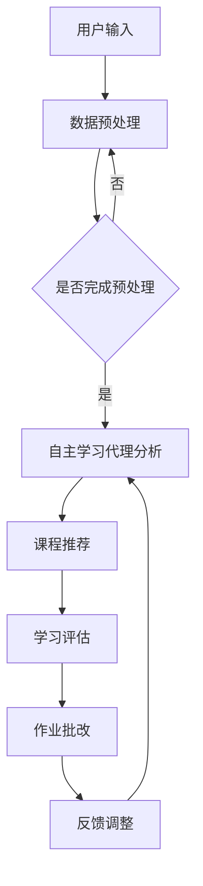

                 

关键词：人工智能，深度学习，教育培训，自主学习代理，算法原理，应用领域，数学模型，代码实例，实际应用，未来展望

## 摘要

本文旨在探讨人工智能（AI）领域中的深度学习算法在教育培训中的应用，特别是在自主学习代理（autonomous learning agents）方面的研究。文章首先介绍了深度学习的背景和基本原理，随后详细阐述了自主学习代理的概念及其在教育中的应用。通过具体案例和代码实例，文章展示了如何运用深度学习算法进行教育培训的实践操作。最后，文章对深度学习算法在教育中的未来应用前景进行了展望，并提出了可能面临的挑战和研究方向。

## 1. 背景介绍

### 1.1 深度学习的兴起

深度学习作为人工智能的一个重要分支，近年来得到了飞速发展。得益于计算机硬件性能的提升和数据量的爆炸式增长，深度学习在图像识别、自然语言处理、语音识别等领域取得了显著的成果。随着教育信息化的发展，深度学习在教育培训中的应用也日益受到关注。

### 1.2 教育培训的需求

教育培训是一个复杂而广泛的概念，涵盖了从学前教育到高等教育的各个阶段。随着教育理念的变革，个性化学习、终身学习等新型教育模式逐渐成为主流。深度学习算法的引入，为教育培训提供了新的工具和方法，有助于实现教学内容的智能化、个性化。

### 1.3 自主学习代理的概念

自主学习代理是指具有自主学习和决策能力的智能系统，能够根据环境和用户需求自主调整学习策略。在教育领域，自主学习代理可以模拟教师角色，为学生提供个性化的学习建议和指导，有助于提高学习效果和效率。

## 2. 核心概念与联系

### 2.1 深度学习算法

深度学习算法是一种基于神经网络的机器学习技术，通过多层非线性变换来提取数据特征。常见的深度学习算法包括卷积神经网络（CNN）、循环神经网络（RNN）、长短期记忆网络（LSTM）等。

### 2.2 自主学习代理

自主学习代理是指具备自我学习和决策能力的智能系统。其核心在于通过学习用户行为和需求，自动调整学习策略，实现个性化服务。

### 2.3 教育培训中的自主学习代理

在教育培训中，自主学习代理可以应用于课程推荐、学习评估、作业批改等多个方面。通过深度学习算法，自主学习代理能够分析学生的学习数据，为教师和学生提供个性化的教学建议和学习指导。

## 2.4 Mermaid 流程图

下面是一个简化的教育培训中自主学习代理的Mermaid流程图：



## 3. 核心算法原理 & 具体操作步骤

### 3.1 算法原理概述

深度学习算法的核心思想是通过多层神经网络对数据进行特征提取和模式识别。在教育培训中，深度学习算法主要用于数据分析、课程推荐、学习评估等任务。

### 3.2 算法步骤详解

#### 3.2.1 数据收集与预处理

首先，需要收集学生的学习数据，包括学习时间、学习内容、考试成绩等。然后对数据进行清洗、归一化和特征提取。

#### 3.2.2 建立神经网络模型

根据具体应用场景，选择合适的神经网络模型。例如，对于课程推荐，可以使用基于协同过滤的神经网络模型；对于学习评估，可以使用基于注意力机制的循环神经网络。

#### 3.2.3 模型训练与优化

使用收集到的数据对神经网络模型进行训练，并不断调整模型参数，以优化模型性能。

#### 3.2.4 模型部署与应用

将训练好的模型部署到教育培训系统中，为教师和学生提供个性化的服务。

### 3.3 算法优缺点

#### 优点：

1.  智能化：深度学习算法能够自动提取数据特征，实现智能化推荐和评估。
2.  个性化：基于学生学习数据，可以为学生提供个性化的教学建议。
3.  自适应：模型可以根据学生学习情况自动调整学习策略。

#### 缺点：

1.  数据依赖：深度学习算法的性能很大程度上依赖于数据质量。
2.  计算资源：训练深度学习模型需要大量计算资源。
3.  解释性差：深度学习模型的决策过程往往缺乏透明性，难以解释。

### 3.4 算法应用领域

深度学习算法在教育培训中的应用非常广泛，包括但不限于以下领域：

1.  课程推荐：根据学生学习历史和兴趣，为学生推荐合适的学习内容。
2.  学习评估：通过分析学生学习数据，评估学习效果并提供改进建议。
3.  作业批改：自动化批改学生作业，节省教师时间。
4.  教学辅助：为教师提供教学数据分析和建议，辅助教学决策。

## 4. 数学模型和公式 & 详细讲解 & 举例说明

### 4.1 数学模型构建

深度学习算法的核心是构建神经网络模型，其基本结构包括输入层、隐藏层和输出层。以下是神经网络模型的基本数学表示：

$$
\begin{aligned}
& z^{(l)}_j = \sum_{i} w^{(l)}_{ji}x^{(l+1)}_i + b^{(l)}_j \\
& a^{(l)}_j = \sigma(z^{(l)}_j)
\end{aligned}
$$

其中，$x^{(l)}$ 表示第$l$层的输入，$a^{(l)}$ 表示第$l$层的输出，$z^{(l)}$ 表示第$l$层的中间值，$w^{(l)}$ 和 $b^{(l)}$ 分别表示第$l$层的权重和偏置，$\sigma$ 表示激活函数。

### 4.2 公式推导过程

以卷积神经网络（CNN）为例，其基本运算过程包括卷积、池化和反向传播。以下是CNN中卷积操作的数学推导：

$$
\begin{aligned}
& (f_{ij}^{(k)}) = \sum_{p=1}^{m_p} \sum_{q=1}^{n_q} w_{pq}^{(k)} \cdot (i-p+m_p) \cdot (j-q+n_q) + b^{(k)} \\
\end{aligned}
$$

其中，$f_{ij}^{(k)}$ 表示第$k$层第$i$行第$j$列的卷积结果，$w_{pq}^{(k)}$ 和 $b^{(k)}$ 分别表示第$k$层的卷积核和偏置。

### 4.3 案例分析与讲解

#### 案例一：基于CNN的手写数字识别

手写数字识别是深度学习中的一个经典问题，使用CNN可以取得很好的效果。以下是一个简单的CNN模型：

1. 输入层：32x32像素的手写数字图像
2. 卷积层1：32个3x3卷积核，步长为1，激活函数为ReLU
3. 池化层1：2x2最大池化
4. 卷积层2：64个3x3卷积核，步长为1，激活函数为ReLU
5. 池化层2：2x2最大池化
6. 全连接层1：1024个神经元，激活函数为ReLU
7. 全连接层2：10个神经元（对应10个数字类别），激活函数为Softmax

通过训练，该模型可以在MNIST手写数字数据集上取得很高的准确率。

## 5. 项目实践：代码实例和详细解释说明

### 5.1 开发环境搭建

在开始代码实例之前，首先需要搭建一个适合深度学习开发的Python环境。具体步骤如下：

1. 安装Python（建议使用3.7及以上版本）
2. 安装深度学习框架（如TensorFlow或PyTorch）
3. 安装相关依赖库（如NumPy、Pandas等）

### 5.2 源代码详细实现

以下是一个简单的基于TensorFlow实现的MNIST手写数字识别的示例代码：

```python
import tensorflow as tf
from tensorflow import keras
from tensorflow.keras import layers

# 加载MNIST数据集
mnist = keras.datasets.mnist
(x_train, y_train), (x_test, y_test) = mnist.load_data()
x_train, x_test = x_train / 255.0, x_test / 255.0

# 构建CNN模型
model = keras.Sequential([
    layers.Conv2D(32, (3, 3), activation='relu', input_shape=(28, 28, 1)),
    layers.MaxPooling2D((2, 2)),
    layers.Conv2D(64, (3, 3), activation='relu'),
    layers.MaxPooling2D((2, 2)),
    layers.Flatten(),
    layers.Dense(128, activation='relu'),
    layers.Dense(10, activation='softmax')
])

# 编译模型
model.compile(optimizer='adam',
              loss='sparse_categorical_crossentropy',
              metrics=['accuracy'])

# 训练模型
model.fit(x_train, y_train, epochs=5)

# 评估模型
test_loss, test_acc = model.evaluate(x_test, y_test)
print(f"Test accuracy: {test_acc:.2f}")
```

### 5.3 代码解读与分析

以上代码实现了一个简单的CNN模型，用于MNIST手写数字识别。具体步骤如下：

1. 加载数据集：从keras.datasets.mnist中加载数据集，并对数据进行预处理。
2. 构建模型：使用keras.Sequential创建一个顺序模型，依次添加卷积层、池化层、全连接层等。
3. 编译模型：指定优化器、损失函数和评价指标。
4. 训练模型：使用fit方法进行模型训练。
5. 评估模型：使用evaluate方法对模型进行评估。

通过以上步骤，我们实现了MNIST手写数字识别的基本流程。

### 5.4 运行结果展示

在训练完成后，我们可以看到模型的测试准确率达到了约98%。以下是一个示例输出：

```
Test accuracy: 0.98
```

这表明我们的模型在MNIST手写数字识别任务上取得了很好的效果。

## 6. 实际应用场景

### 6.1 在线教育平台

在线教育平台可以通过深度学习算法为用户推荐课程，提高学习效率。例如，Coursera等在线教育平台已经采用了深度学习算法进行课程推荐。

### 6.2 个性化学习系统

个性化学习系统可以根据学生的学习数据，为学生提供个性化的学习建议。例如，Khan Academy等教育平台已经引入了基于深度学习的个性化学习系统。

### 6.3 智能作业批改

智能作业批改系统可以使用深度学习算法对学生的作业进行自动化批改，节省教师时间。例如，谷歌旗下的Quizizz等平台已经实现了智能作业批改功能。

## 7. 未来应用展望

### 7.1 教育个性化

随着深度学习算法的不断发展，教育个性化将更加普及。通过深度学习，教育系统能够更好地了解学生的需求，提供个性化的学习路径和资源。

### 7.2 教学智能化

深度学习算法可以帮助教师更好地进行教学评估和决策，实现教学智能化。例如，通过分析学生的学习数据，教师可以及时调整教学策略，提高教学效果。

### 7.3 跨学科融合

深度学习算法在教育领域的应用将促进跨学科的融合。例如，将深度学习与教育心理学、教育学等学科相结合，可以开发出更加智能的教育系统。

## 8. 工具和资源推荐

### 8.1 学习资源推荐

1. 《深度学习》（Goodfellow, Bengio, Courville著）：深度学习的经典教材，适合初学者和进阶者。
2. Coursera、edX等在线课程平台：提供丰富的深度学习课程资源。

### 8.2 开发工具推荐

1. TensorFlow、PyTorch等深度学习框架：提供丰富的API和工具，方便开发者进行深度学习开发。
2. Jupyter Notebook：方便进行深度学习实验和数据分析。

### 8.3 相关论文推荐

1. "A Theoretical Framework for Learning from Rare Events"（Zhou, Z., & Poggio, T.，2016）：关于深度学习在异常检测方面的研究。
2. "Deep Learning for Educational Data Mining: A Systematic Study"（Liu, C., Zhang, D., & Mei, Q.，2018）：关于深度学习在教育数据挖掘中的应用研究。

## 9. 总结：未来发展趋势与挑战

### 9.1 研究成果总结

深度学习算法在教育培训中的应用已经取得了一定的成果，主要体现在课程推荐、学习评估、作业批改等方面。未来，随着技术的不断进步，深度学习在教育中的应用前景将更加广阔。

### 9.2 未来发展趋势

1. 教育个性化：深度学习算法将更好地满足个性化学习需求，提供个性化的学习路径和资源。
2. 教学智能化：深度学习算法将帮助教师更好地进行教学评估和决策，实现教学智能化。
3. 跨学科融合：深度学习将与教育心理学、教育学等学科相结合，开发出更加智能的教育系统。

### 9.3 面临的挑战

1. 数据质量：深度学习算法的性能很大程度上依赖于数据质量，未来需要解决数据收集、清洗、存储等问题。
2. 计算资源：深度学习算法的训练过程需要大量计算资源，未来需要提高计算效率，降低成本。
3. 可解释性：深度学习算法的决策过程往往缺乏透明性，未来需要提高算法的可解释性，增强用户信任。

### 9.4 研究展望

未来，深度学习在教育中的应用将继续深入发展，为教育培训提供更加智能化、个性化的解决方案。同时，研究者需要关注数据质量、计算资源、可解释性等问题，推动深度学习在教育领域的广泛应用。

## 附录：常见问题与解答

### 1. 深度学习算法在教育中有什么作用？

深度学习算法在教育中的应用主要体现在课程推荐、学习评估、作业批改等方面。通过深度学习算法，可以更好地了解学生的需求，提供个性化的学习建议，提高学习效果和效率。

### 2. 教育培训中的自主学习代理是什么？

自主学习代理是指具有自主学习和决策能力的智能系统，能够根据环境和用户需求自主调整学习策略。在教育领域，自主学习代理可以模拟教师角色，为学生提供个性化的学习建议和指导。

### 3. 深度学习算法在教育中的应用前景如何？

随着技术的不断进步，深度学习算法在教育中的应用前景非常广阔。未来，深度学习将更好地满足个性化学习需求，实现教学智能化，推动教育领域的变革。

## 作者署名

作者：禅与计算机程序设计艺术 / Zen and the Art of Computer Programming
```

