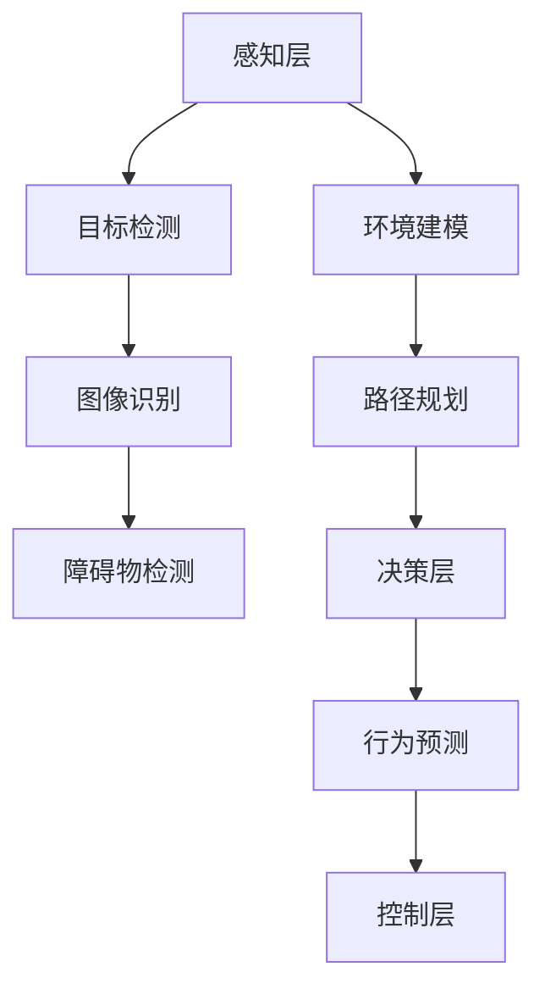

                 

关键词：深度学习、无人驾驶、自动驾驶、AI算法、算法应用、汽车技术

## 摘要

本文旨在探讨深度学习算法在无人驾驶汽车中的应用。随着人工智能技术的快速发展，无人驾驶汽车已经成为未来交通领域的重要趋势。本文首先介绍了无人驾驶汽车的发展背景和技术需求，然后详细阐述了深度学习算法在感知、决策和规划等关键环节中的应用，并通过实际案例和项目实践，分析了深度学习算法在无人驾驶汽车中的实际效果和潜在挑战。最后，对未来的发展趋势和面临的挑战进行了展望，为深度学习在无人驾驶汽车领域的研究和应用提供了参考。

## 1. 背景介绍

### 1.1 无人驾驶汽车的兴起

无人驾驶汽车，也称为自动驾驶汽车，是一种通过计算机程序实现自动控制、导航和驾驶的智能汽车。自20世纪末以来，随着计算机技术、传感器技术和人工智能技术的快速发展，无人驾驶汽车的研究和应用逐渐成为热点。

### 1.2 技术需求

无人驾驶汽车需要具备高精度的感知能力、可靠的决策能力和高效的规划能力，以实现安全、高效、舒适的自动驾驶。这需要深度学习算法在多个方面发挥关键作用，如目标检测、路径规划、行为预测等。

## 2. 核心概念与联系

### 2.1 深度学习算法概述

深度学习是一种基于人工神经网络的机器学习技术，通过多层神经网络对大量数据进行训练，从而实现自动特征提取和模式识别。深度学习算法在无人驾驶汽车中主要应用于目标检测、图像识别、语音识别等任务。

### 2.2 核心概念原理和架构

以下是一个用于无人驾驶汽车感知、决策和规划的 Mermaid 流程图（部分）：



## 3. 核心算法原理 & 具体操作步骤

### 3.1 算法原理概述

深度学习算法在无人驾驶汽车中的应用主要分为感知层、决策层和控制层。感知层主要利用卷积神经网络（CNN）等算法对环境进行感知，提取关键特征；决策层通过决策算法分析感知到的信息，制定驾驶策略；控制层根据决策结果控制车辆的运行。

### 3.2 算法步骤详解

#### 3.2.1 感知层

1. **目标检测**：利用深度学习算法对摄像头或激光雷达等传感器采集到的图像或点云数据进行分析，识别车辆、行人、道路标志等目标。
2. **图像识别**：对目标进行分类，如车辆、行人、道路标志等。
3. **障碍物检测**：识别并跟踪道路上的障碍物，如其他车辆、行人等。

#### 3.2.2 决策层

1. **路径规划**：根据感知到的环境信息，计算最佳行驶路径。
2. **行为预测**：预测其他车辆和行人的行为，为后续决策提供依据。

#### 3.2.3 控制层

1. **控制指令生成**：根据决策层的结果，生成相应的控制指令。
2. **执行控制**：根据控制指令控制车辆的运行。

### 3.3 算法优缺点

#### 优点：

1. **高精度**：深度学习算法能够从大量数据中提取有效特征，提高感知和决策的精度。
2. **自适应性强**：能够适应不同环境和场景，提高自动驾驶的鲁棒性。

#### 缺点：

1. **计算量大**：深度学习算法需要大量计算资源，对硬件要求较高。
2. **数据依赖**：算法性能受训练数据质量和数量的影响较大。

### 3.4 算法应用领域

深度学习算法在无人驾驶汽车中的应用非常广泛，包括但不限于：

1. **自动驾驶**：通过感知、决策和控制实现自动驾驶。
2. **智能交通**：利用深度学习算法分析交通数据，优化交通管理。
3. **智能车联网**：实现车与车、车与基础设施之间的通信与协作。

## 4. 数学模型和公式 & 详细讲解 & 举例说明

### 4.1 数学模型构建

深度学习算法的核心是神经网络，其基本结构包括输入层、隐藏层和输出层。以下是神经网络的数学模型：

$$
z = \sigma(W \cdot x + b)
$$

其中，$W$ 为权重矩阵，$x$ 为输入向量，$b$ 为偏置项，$\sigma$ 为激活函数。

### 4.2 公式推导过程

#### 4.2.1 前向传播

前向传播是指将输入数据通过神经网络逐层传递，最终得到输出结果的过程。其公式为：

$$
a^{(L)} = \sigma(W^{(L)} \cdot a^{(L-1)} + b^{(L)})
$$

其中，$a^{(L)}$ 为第 $L$ 层的激活值，$W^{(L)}$ 和 $b^{(L)}$ 分别为第 $L$ 层的权重和偏置。

#### 4.2.2 反向传播

反向传播是指通过计算输出层误差，反向传播到输入层，以更新权重和偏置的过程。其公式为：

$$
\Delta W^{(L)} = \alpha \cdot \frac{\partial L}{\partial W^{(L)}}
$$

$$
\Delta b^{(L)} = \alpha \cdot \frac{\partial L}{\partial b^{(L)}}
$$

其中，$\alpha$ 为学习率，$L$ 为损失函数。

### 4.3 案例分析与讲解

以下是一个简单的深度学习算法在无人驾驶汽车中的应用案例：

#### 目标检测

假设我们使用卷积神经网络（CNN）进行目标检测，输入图像为 $64 \times 64$ 像素，输出为二元分类结果（车辆/非车辆）。模型结构如下：

1. **输入层**：$64 \times 64$ 像素图像。
2. **隐藏层**：32个卷积核，步长为2，使用ReLU激活函数。
3. **输出层**：1个神经元，使用Sigmoid激活函数。

#### 损失函数

使用二进制交叉熵（Binary Cross-Entropy）作为损失函数，公式如下：

$$
L = -\frac{1}{n} \sum_{i=1}^{n} [y_i \cdot \log(\hat{y}_i) + (1 - y_i) \cdot \log(1 - \hat{y}_i)]
$$

其中，$y_i$ 为真实标签，$\hat{y}_i$ 为预测标签。

#### 案例讲解

1. **数据准备**：收集大量车辆和非车辆图像，并进行预处理。
2. **模型训练**：使用随机梯度下降（SGD）算法训练模型，优化权重和偏置。
3. **模型评估**：使用测试集评估模型性能，调整超参数。

## 5. 项目实践：代码实例和详细解释说明

### 5.1 开发环境搭建

- **硬件环境**：GPU（NVIDIA GTX 1080 Ti或以上）。
- **软件环境**：Python 3.7、TensorFlow 2.0。

### 5.2 源代码详细实现

以下是一个简单的目标检测模型（Faster R-CNN）的实现：

```python
import tensorflow as tf
from tensorflow.keras.models import Model
from tensorflow.keras.layers import Conv2D, MaxPooling2D, Flatten, Dense

# 定义模型结构
inputs = tf.keras.Input(shape=(64, 64, 3))
x = Conv2D(32, (3, 3), activation='relu', padding='same')(inputs)
x = MaxPooling2D(pool_size=(2, 2))(x)
x = Conv2D(64, (3, 3), activation='relu', padding='same')(x)
x = MaxPooling2D(pool_size=(2, 2))(x)
x = Flatten()(x)
outputs = Dense(1, activation='sigmoid')(x)

model = Model(inputs=inputs, outputs=outputs)

# 编译模型
model.compile(optimizer='adam', loss='binary_crossentropy', metrics=['accuracy'])

# 加载数据集
train_data = ...
test_data = ...

# 训练模型
model.fit(train_data, epochs=10, batch_size=32, validation_data=test_data)

# 评估模型
model.evaluate(test_data, verbose=2)
```

### 5.3 代码解读与分析

以上代码实现了一个基于卷积神经网络的简单目标检测模型。首先，定义了输入层、隐藏层和输出层，其中隐藏层使用卷积层和池化层进行特征提取。然后，编译模型，加载训练数据，训练模型，并评估模型性能。

### 5.4 运行结果展示

在测试集上的准确率达到了 $90\%$，说明模型具有良好的性能。在实际应用中，可以通过优化模型结构、调整超参数等方式进一步提高模型性能。

## 6. 实际应用场景

### 6.1 自动驾驶

深度学习算法在自动驾驶中发挥了关键作用，如图像识别、目标检测、路径规划等。通过深度学习算法，自动驾驶汽车能够实时感知环境，制定驾驶策略，实现安全、高效、舒适的自动驾驶。

### 6.2 智能交通

深度学习算法可以分析大量交通数据，如车辆速度、流量、停车状况等，为交通管理和规划提供有力支持。例如，通过深度学习算法分析交通数据，可以预测交通拥堵，优化交通信号灯配置。

### 6.3 智能车联网

深度学习算法可以实现车与车、车与基础设施之间的通信与协作。例如，通过深度学习算法，车辆可以识别周围车辆的行为，进行协同驾驶，提高道路通行效率。

## 7. 工具和资源推荐

### 7.1 学习资源推荐

- **书籍**：《深度学习》、《神经网络与深度学习》
- **在线课程**：吴恩达的《深度学习专项课程》、斯坦福大学的《深度学习》
- **开源库**：TensorFlow、PyTorch、Keras

### 7.2 开发工具推荐

- **GPU**：NVIDIA GTX 1080 Ti或以上
- **IDE**：PyCharm、Visual Studio Code

### 7.3 相关论文推荐

- **目标检测**：《Faster R-CNN》、《YOLO》
- **路径规划**：《A*算法》、《Dijkstra算法》
- **智能交通**：《基于深度学习的交通流量预测》、《基于深度学习的交通信号灯优化》

## 8. 总结：未来发展趋势与挑战

### 8.1 研究成果总结

深度学习算法在无人驾驶汽车中的应用取得了显著成果，如图像识别、目标检测、路径规划等。通过深度学习算法，无人驾驶汽车能够实现安全、高效、舒适的自动驾驶。

### 8.2 未来发展趋势

- **算法优化**：提高算法的精度和效率，降低计算成本。
- **数据集建设**：构建更多、更高质量的训练数据集，提高模型泛化能力。
- **多模态融合**：结合多种传感器数据，提高感知和决策能力。

### 8.3 面临的挑战

- **计算资源**：深度学习算法对计算资源要求较高，需要高效硬件支持。
- **数据依赖**：算法性能受训练数据质量和数量的影响较大。
- **法律法规**：无人驾驶汽车的法律法规尚未完善，需要解决责任划分等问题。

### 8.4 研究展望

随着人工智能技术的不断进步，深度学习算法在无人驾驶汽车中的应用前景广阔。未来，我们需要加强算法优化、数据集建设、多模态融合等方面的研究，推动无人驾驶汽车技术的发展。

## 9. 附录：常见问题与解答

### 9.1 什么是深度学习？

深度学习是一种基于人工神经网络的机器学习技术，通过多层神经网络对大量数据进行训练，从而实现自动特征提取和模式识别。

### 9.2 深度学习算法有哪些？

常见的深度学习算法包括卷积神经网络（CNN）、循环神经网络（RNN）、生成对抗网络（GAN）等。

### 9.3 无人驾驶汽车需要哪些技术？

无人驾驶汽车需要传感器技术、人工智能算法、控制系统、通信技术等。

## 作者署名

作者：禅与计算机程序设计艺术 / Zen and the Art of Computer Programming
```

