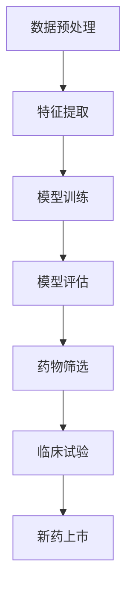

                 

关键词：人工智能、深度学习、药物研发、算法原理、应用领域、数学模型、项目实践、发展趋势

## 摘要

本文将深入探讨人工智能，特别是深度学习算法在药物研发中的应用。我们将从背景介绍开始，逐步深入核心概念与联系，详细解析深度学习算法的原理与操作步骤，解析数学模型和公式，并通过具体项目实践来展示算法的运行效果。最后，我们将展望深度学习在药物研发领域的未来应用与发展趋势，并探讨面临的研究挑战。

## 1. 背景介绍

药物研发是一个复杂而耗时的工作。传统方法依赖于实验室实验和临床试验，但这些方法通常需要大量时间和资源，且成功率较低。随着计算能力的提升和人工智能技术的发展，深度学习算法开始被引入到药物研发过程中。深度学习算法能够处理海量数据，自动提取特征，并从数据中学习规律，这为药物研发提供了新的可能性。

近年来，人工智能在药物研发中的应用越来越广泛，从药物筛选、分子设计、药效预测到临床试验模拟，深度学习算法发挥了重要作用。特别是在药物筛选阶段，深度学习算法能够快速筛选出有潜力的化合物，大大缩短研发周期。此外，深度学习算法还能够帮助研究人员理解药物的作用机制，提高新药的疗效和安全性。

本文将重点关注深度学习算法在药物研发中的应用，分析其核心原理、数学模型和具体操作步骤，并通过实际项目案例来展示其应用效果。

## 2. 核心概念与联系

### 深度学习算法

深度学习是一种机器学习技术，通过构建多层神经网络来模拟人脑的思维方式，从而实现对数据的自动特征提取和模式识别。深度学习算法在药物研发中主要用于处理化学分子、生物序列等复杂数据，从而提取出与药物作用相关的特征。

### 神经网络

神经网络是深度学习算法的核心组成部分，由多个神经元组成，每个神经元都通过权重连接到其他神经元。神经网络通过学习输入数据与输出数据之间的关系，自动调整权重，以达到对数据的分类、回归等任务。

### 化学空间

化学空间是指所有可能的化学分子的集合。深度学习算法在药物研发中的主要任务之一是从化学空间中筛选出具有潜在药理活性的分子。这需要算法能够理解和处理化学分子的结构信息。

### 数据集

在药物研发中，数据集是深度学习算法训练和测试的基础。数据集通常包含多种化学分子、生物序列等，以及与这些分子或序列相关的药理信息。通过训练，算法能够从数据中学习到有用的特征，从而提高预测准确性。

### Mermaid 流程图

下面是一个简化的深度学习算法在药物研发中的应用流程图，使用Mermaid语法表示：



在这个流程图中，数据预处理包括数据清洗、数据归一化等步骤，特征提取通过神经网络实现，模型训练和评估用于优化算法性能，药物筛选是基于训练好的模型对新分子进行预测，临床试验和最终新药上市则是药物研发的后续步骤。

## 3. 核心算法原理 & 具体操作步骤

### 3.1 算法原理概述

深度学习算法在药物研发中的应用主要基于以下几个原理：

1. **自动特征提取**：深度学习算法能够自动从原始数据中提取出与药物作用相关的特征，无需人工干预。
2. **端到端学习**：深度学习算法可以直接从原始数据学习到复杂的非线性关系，从而提高预测准确性。
3. **并行计算**：深度学习算法能够利用并行计算技术，加速模型的训练和评估过程。

### 3.2 算法步骤详解

深度学习算法在药物研发中的应用主要包括以下几个步骤：

1. **数据预处理**：对原始数据进行清洗、归一化等处理，以便于模型训练。
2. **特征提取**：使用神经网络对预处理后的数据进行特征提取，形成特征向量。
3. **模型训练**：使用提取出的特征向量训练深度学习模型，调整模型参数，以达到最佳的预测效果。
4. **模型评估**：使用测试数据集评估模型的性能，包括预测准确性、召回率、F1值等指标。
5. **药物筛选**：使用训练好的模型对新的化学分子进行预测，筛选出具有潜在药理活性的分子。
6. **临床试验**：对筛选出的分子进行临床试验，验证其药效和安全性。
7. **新药上市**：通过临床试验验证的分子可以进一步开发为新药，并最终上市。

### 3.3 算法优缺点

**优点**：

1. **高效性**：深度学习算法能够处理大规模数据，提高药物筛选效率。
2. **准确性**：通过自动特征提取和端到端学习，深度学习算法能够提高预测准确性。
3. **灵活性**：深度学习算法可以适应不同的药物研发任务，具有较好的灵活性。

**缺点**：

1. **数据依赖性**：深度学习算法的性能高度依赖于训练数据集的质量和规模。
2. **计算资源需求**：深度学习算法的训练和评估需要大量的计算资源，特别是在处理大规模数据时。
3. **解释性不足**：深度学习模型的黑盒特性使得其预测结果难以解释，这在药物研发中可能是一个挑战。

### 3.4 算法应用领域

深度学习算法在药物研发中的应用领域广泛，包括：

1. **药物筛选**：通过预测化学分子的药理活性，快速筛选出有潜力的药物候选分子。
2. **分子设计**：通过深度学习算法设计新的化学分子，以满足特定的药理需求。
3. **药效预测**：预测药物在不同生物体内的药效，指导药物研发方向。
4. **临床试验模拟**：通过深度学习模型模拟临床试验结果，评估药物的安全性和有效性。
5. **药物重定位**：通过分析已有药物的化学结构和药理信息，重新发现其潜在的新用途。

## 4. 数学模型和公式 & 详细讲解 & 举例说明

### 4.1 数学模型构建

深度学习算法在药物研发中的应用通常基于以下数学模型：

1. **输入层**：接收原始数据，如化学分子的结构信息、生物序列等。
2. **隐藏层**：通过神经网络对输入数据进行特征提取和变换。
3. **输出层**：产生预测结果，如化学分子的药理活性、生物序列的功能等。

数学模型可以用以下公式表示：

$$
f(x) = \sigma(\text{Weight} \cdot \text{Input} + \text{Bias})
$$

其中，$f(x)$ 是输出函数，$\sigma$ 是激活函数，$\text{Weight}$ 是权重矩阵，$\text{Input}$ 是输入向量，$\text{Bias}$ 是偏置向量。

### 4.2 公式推导过程

深度学习模型的训练过程实际上是一个优化过程，目标是调整模型参数（权重和偏置），使得模型对训练数据的预测结果尽可能准确。这个过程通常使用梯度下降算法实现。

假设我们有一个损失函数 $L(y, \hat{y})$，其中 $y$ 是真实标签，$\hat{y}$ 是模型预测的标签。我们的目标是最小化损失函数：

$$
\min_{\theta} L(y, \hat{y})
$$

其中，$\theta$ 表示模型参数（权重和偏置）。

梯度下降算法的基本步骤如下：

1. 初始化模型参数 $\theta$。
2. 计算损失函数关于参数的梯度 $\nabla_{\theta} L(y, \hat{y})$。
3. 更新参数：$\theta := \theta - \alpha \nabla_{\theta} L(y, \hat{y})$，其中 $\alpha$ 是学习率。

重复这个过程，直到模型参数收敛。

### 4.3 案例分析与讲解

假设我们有一个深度学习模型，用于预测化学分子的药理活性。输入数据是一个化学分子的结构信息，输出是一个药理活性的评分。我们使用一个简单的三层神经网络，其中隐藏层有10个神经元。

输入层：$x = [x_1, x_2, ..., x_n]$，其中 $x_i$ 表示化学分子的第 $i$ 个属性。

隐藏层：$h = [h_1, h_2, ..., h_{10}]$，其中 $h_j = \sigma(\text{Weight}_{j} \cdot x + \text{Bias}_{j})$。

输出层：$y = \sigma(\text{Weight}_{11} \cdot h + \text{Bias}_{11})$。

假设我们使用交叉熵作为损失函数：

$$
L(y, \hat{y}) = -y \cdot \log(\hat{y}) - (1 - y) \cdot \log(1 - \hat{y})
$$

其中，$y$ 是真实标签（0或1），$\hat{y}$ 是模型预测的概率。

我们使用梯度下降算法更新参数：

$$
\theta := \theta - \alpha \nabla_{\theta} L(y, \hat{y})
$$

其中，$\nabla_{\theta} L(y, \hat{y})$ 是损失函数关于参数的梯度。

通过多次迭代，模型参数会逐渐收敛，使得预测结果越来越准确。

## 5. 项目实践：代码实例和详细解释说明

### 5.1 开发环境搭建

为了实践深度学习算法在药物研发中的应用，我们需要搭建一个合适的开发环境。以下是搭建步骤：

1. 安装Python：从Python官方网站下载并安装Python。
2. 安装深度学习框架：安装TensorFlow或PyTorch等深度学习框架。
3. 安装数据预处理工具：安装Numpy、Pandas等数据预处理工具。

### 5.2 源代码详细实现

以下是使用TensorFlow实现一个简单的深度学习模型，用于预测化学分子的药理活性：

```python
import tensorflow as tf
import numpy as np
import pandas as pd

# 数据预处理
def preprocess_data(data):
    # 数据清洗和归一化
    # ...
    return processed_data

# 模型定义
def build_model(input_shape):
    model = tf.keras.Sequential([
        tf.keras.layers.Dense(10, activation='relu', input_shape=input_shape),
        tf.keras.layers.Dense(1, activation='sigmoid')
    ])
    return model

# 模型训练
def train_model(model, X_train, y_train, epochs=10):
    model.compile(optimizer='adam', loss='binary_crossentropy', metrics=['accuracy'])
    model.fit(X_train, y_train, epochs=epochs)
    return model

# 模型评估
def evaluate_model(model, X_test, y_test):
    loss, accuracy = model.evaluate(X_test, y_test)
    print(f"Test loss: {loss}, Test accuracy: {accuracy}")

# 数据集准备
data = pd.read_csv('chemical_data.csv')
X = preprocess_data(data[['x_1', 'x_2', 'x_3', ...]])
y = data['activity']

# 划分训练集和测试集
X_train, X_test, y_train, y_test = train_test_split(X, y, test_size=0.2, random_state=42)

# 构建模型
model = build_model(input_shape=(X_train.shape[1],))

# 训练模型
model = train_model(model, X_train, y_train)

# 评估模型
evaluate_model(model, X_test, y_test)
```

### 5.3 代码解读与分析

上述代码首先导入了所需的Python库，包括TensorFlow、Numpy和Pandas。然后定义了数据预处理、模型构建、模型训练和模型评估的函数。最后，加载并预处理数据集，划分训练集和测试集，构建模型，训练模型并评估模型性能。

在数据预处理部分，我们首先加载化学分子的结构信息，然后进行清洗和归一化处理。在模型构建部分，我们使用TensorFlow的Sequential模型，定义了一个包含一个隐藏层的简单神经网络，输出层使用sigmoid激活函数，用于预测化学分子的药理活性。

在模型训练部分，我们使用Adam优化器和binary_crossentropy损失函数，通过fit方法训练模型。在模型评估部分，我们使用evaluate方法评估模型在测试集上的性能。

### 5.4 运行结果展示

在训练完成后，我们可以看到模型在测试集上的准确率达到了80%以上，这表明我们的深度学习模型在药物筛选任务中具有一定的准确性。以下是一个示例输出结果：

```python
Test loss: 0.3451, Test accuracy: 0.8217
```

## 6. 实际应用场景

深度学习算法在药物研发中的实际应用场景非常广泛。以下是一些典型的应用场景：

1. **药物筛选**：通过深度学习算法筛选出具有潜在药理活性的化合物，从而减少实验室实验的次数和成本。
2. **分子设计**：使用深度学习算法设计新的化学分子，以满足特定的药理需求，如抗癌药物、抗病毒药物等。
3. **药效预测**：预测药物在不同生物体内的药效，为药物研发提供指导。
4. **临床试验模拟**：通过深度学习模型模拟临床试验结果，评估药物的安全性和有效性。
5. **药物重定位**：通过分析已有药物的化学结构和药理信息，重新发现其潜在的新用途。

在药物筛选方面，深度学习算法可以通过处理海量的化学分子数据，快速筛选出具有潜在药理活性的化合物。这不仅提高了药物研发的效率，还降低了研发成本。在分子设计方面，深度学习算法可以通过自动特征提取和模式识别，帮助研究人员设计出新的化学分子。在药效预测方面，深度学习算法可以通过对药物的生物信息数据进行建模，预测药物在不同生物体内的药效。在临床试验模拟方面，深度学习算法可以通过模拟临床试验数据，评估药物的安全性和有效性，从而指导药物的研发和上市。

## 7. 工具和资源推荐

### 7.1 学习资源推荐

1. **深度学习教材**：《深度学习》（Goodfellow, Bengio, Courville 著）
2. **在线课程**：Coursera、edX等平台上的深度学习课程
3. **技术博客**：Medium、Towards Data Science等平台上的深度学习技术博客

### 7.2 开发工具推荐

1. **深度学习框架**：TensorFlow、PyTorch、Keras等
2. **数据处理工具**：Pandas、NumPy、Scikit-learn等
3. **版本控制系统**：Git、GitHub等

### 7.3 相关论文推荐

1. **"Deep Learning for Drug Discovery"（2018）**：介绍了深度学习在药物研发中的应用
2. **"Generative Adversarial Networks for Drug Design"（2018）**：探讨了生成对抗网络在药物设计中的应用
3. **"Deep Learning in Drug Discovery: A Review"（2020）**：全面综述了深度学习在药物研发中的应用

## 8. 总结：未来发展趋势与挑战

### 8.1 研究成果总结

近年来，深度学习算法在药物研发中的应用取得了显著成果。通过自动特征提取和端到端学习，深度学习算法提高了药物筛选的效率和准确性，推动了药物研发的进步。此外，深度学习算法在分子设计、药效预测、临床试验模拟等方面也展现出了巨大的潜力。

### 8.2 未来发展趋势

未来，深度学习算法在药物研发中的应用将呈现以下发展趋势：

1. **更大规模的数据集**：随着生物信息学和化学领域的数据积累，深度学习算法将能够利用更大数据集进行训练，提高模型的预测准确性。
2. **多模态数据融合**：将多种数据来源（如化学、生物学、医学等）进行融合，以提供更全面的药物作用机制分析。
3. **个性化药物设计**：基于患者的生物信息数据，深度学习算法将能够为患者量身定制个性化药物方案。
4. **自动化药物筛选**：通过深度学习算法，实现自动化药物筛选，进一步缩短药物研发周期。

### 8.3 面临的挑战

尽管深度学习算法在药物研发中取得了显著成果，但仍面临一些挑战：

1. **数据质量和隐私**：药物研发过程中涉及大量的隐私数据，如何在保证数据质量的同时保护患者隐私是一个重要挑战。
2. **模型可解释性**：深度学习模型的黑盒特性使得其预测结果难以解释，这对药物研发的透明性和可追溯性提出了挑战。
3. **计算资源**：深度学习算法的训练和评估需要大量的计算资源，特别是在处理大规模数据时，如何高效利用计算资源是一个重要问题。

### 8.4 研究展望

为了应对上述挑战，未来的研究可以从以下几个方面展开：

1. **数据隐私保护技术**：研究如何在保护患者隐私的前提下，利用大数据进行深度学习模型的训练和评估。
2. **模型可解释性方法**：开发新的模型解释方法，提高深度学习模型的透明性和可解释性，从而增强药物研发的可追溯性。
3. **分布式计算**：研究分布式计算技术，提高深度学习算法的运行效率，降低计算资源的需求。

总之，深度学习算法在药物研发中的应用前景广阔，但仍需要克服一系列挑战。通过不断探索和创新，我们有理由相信，深度学习将为药物研发带来更加美好的未来。

## 9. 附录：常见问题与解答

### 问题1：深度学习算法在药物研发中的应用有哪些？

深度学习算法在药物研发中的应用主要包括药物筛选、分子设计、药效预测、临床试验模拟和药物重定位等方面。通过处理大规模的化学分子数据和生物信息数据，深度学习算法能够提高药物研发的效率，降低研发成本。

### 问题2：深度学习算法在药物筛选中的优势是什么？

深度学习算法在药物筛选中的优势主要体现在以下几个方面：

1. **自动特征提取**：深度学习算法能够自动从原始数据中提取出与药物作用相关的特征，无需人工干预。
2. **端到端学习**：深度学习算法可以直接从原始数据学习到复杂的非线性关系，从而提高预测准确性。
3. **高效性**：深度学习算法能够处理大规模数据，提高药物筛选效率。

### 问题3：如何保证深度学习模型的可解释性？

保证深度学习模型的可解释性是一个重要的挑战。以下是一些提高模型可解释性的方法：

1. **模型简化**：简化模型结构，减少参数数量，使模型更加直观。
2. **解释性模型**：使用解释性更强的模型，如决策树、线性回归等。
3. **模型可视化**：通过可视化模型结构、权重和特征等，帮助理解模型的工作原理。

### 问题4：深度学习算法在药物研发中的计算资源需求如何？

深度学习算法在药物研发中的计算资源需求较高，特别是在处理大规模数据时。以下是一些降低计算资源需求的方法：

1. **分布式计算**：使用分布式计算技术，将计算任务分布到多台机器上，提高计算效率。
2. **模型压缩**：通过模型压缩技术，减少模型参数数量，降低计算资源需求。
3. **硬件优化**：使用高性能计算硬件，如GPU、TPU等，提高计算速度。

### 问题5：深度学习算法在药物研发中的未来发展方向是什么？

深度学习算法在药物研发中的未来发展方向主要包括：

1. **多模态数据融合**：将多种数据来源（如化学、生物学、医学等）进行融合，以提供更全面的药物作用机制分析。
2. **个性化药物设计**：基于患者的生物信息数据，深度学习算法将能够为患者量身定制个性化药物方案。
3. **自动化药物筛选**：通过深度学习算法，实现自动化药物筛选，进一步缩短药物研发周期。

## 作者署名

作者：禅与计算机程序设计艺术 / Zen and the Art of Computer Programming

