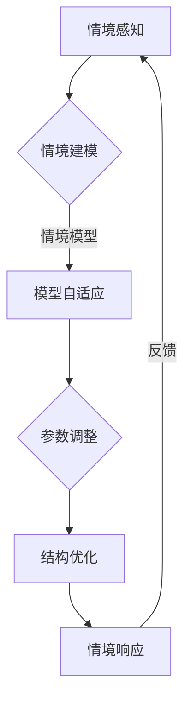

                 

关键词：人工智能，深度学习，情境智能，模型动态调整，算法原理，数学模型，项目实践，应用场景，未来展望

> 摘要：本文深入探讨了AI领域中的深度学习算法，特别是情境智能与深度学习模型动态调整的结合。文章首先介绍了背景和核心概念，然后详细阐述了算法原理与操作步骤，随后通过数学模型和公式推导，结合实际项目实践，分析了算法的应用和效果，最后提出了未来的发展趋势和面临的挑战。

## 1. 背景介绍

人工智能（AI）作为21世纪的科技革命，已经在各行各业中产生了深远的影响。其中，深度学习作为AI领域的一个关键组成部分，以其强大的学习能力在图像识别、自然语言处理、语音识别等领域取得了显著成果。然而，传统的深度学习算法在面对复杂、动态的情境时，往往表现出一定的局限性。这就需要我们探索新的方法，将情境智能与深度学习模型动态调整相结合，以应对更加复杂多变的应用场景。

情境智能（Context-Aware Intelligence）是指人工智能系统能够感知并适应当前的环境、情境和用户需求。其核心思想是让机器不仅仅能够处理已知的数据，还能够根据情境的变化进行实时调整和优化。情境智能的实现，对于提升人工智能系统的适应性和鲁棒性具有重要意义。

本文将围绕情境智能与深度学习模型动态调整这一主题，介绍相关算法原理、数学模型，并通过实际项目实践，探讨其应用效果和未来发展趋势。

## 2. 核心概念与联系

### 情境智能

情境智能是指智能系统对当前情境的理解和适应能力。其核心概念包括情境感知、情境建模和情境响应。情境感知是指系统获取当前情境信息的能力；情境建模是指将获取的信息转化为情境模型的过程；情境响应是指系统根据情境模型进行相应调整的能力。

### 深度学习模型动态调整

深度学习模型动态调整是指根据应用场景和情境变化，实时调整深度学习模型的结构和参数，以适应新的环境。其核心概念包括模型自适应、参数调整和结构优化。模型自适应是指模型能够根据情境变化进行自动调整；参数调整是指调整模型中参数的值以适应新的情境；结构优化是指调整模型结构以提高模型适应性和性能。

### Mermaid 流程图

下面是一个描述情境智能与深度学习模型动态调整的 Mermaid 流程图：



### 情境智能与深度学习模型的结合

情境智能与深度学习模型的结合，使得人工智能系统能够更加灵活地应对复杂情境。通过情境感知，系统能够获取到当前情境的信息；通过情境建模，系统能够将情境信息转化为情境模型；通过模型动态调整，系统能够根据情境模型实时调整模型结构参数，以适应新的情境。这种结合不仅提高了人工智能系统的适应性和鲁棒性，也为解决复杂问题提供了新的思路。

## 3. 核心算法原理 & 具体操作步骤

### 3.1 算法原理概述

情境智能与深度学习模型动态调整的核心算法是基于情境感知、情境建模和模型动态调整的组合。具体原理如下：

1. 情境感知：系统通过传感器、用户交互等方式获取当前情境信息。
2. 情境建模：将获取的情境信息转化为情境模型，包括情境特征和情境状态。
3. 模型动态调整：根据情境模型，实时调整模型的结构和参数，包括网络架构、权重调整和学习率调整。

### 3.2 算法步骤详解

1. **情境感知**：使用传感器、用户交互等方式获取情境信息，如温度、湿度、光线强度、用户行为等。
2. **情境建模**：将获取的情境信息进行特征提取和建模，构建情境特征向量。
3. **模型初始化**：初始化深度学习模型，包括网络架构、参数和初始权重。
4. **模型训练**：使用情境特征向量对模型进行训练，调整模型参数以优化性能。
5. **模型测试**：使用测试集评估模型性能，包括准确性、响应速度等指标。
6. **模型调整**：根据测试结果，动态调整模型结构和参数，以提高模型适应性和性能。
7. **模型部署**：将调整后的模型部署到实际应用场景中，进行实时运行和调整。

### 3.3 算法优缺点

**优点**：
1. **高适应性**：能够根据不同情境实时调整模型，提高系统适应性。
2. **高鲁棒性**：通过动态调整模型，提高系统在面对未知情境时的鲁棒性。
3. **实时性**：能够快速响应当前情境变化，提高系统实时性。

**缺点**：
1. **计算资源消耗**：动态调整模型需要较大的计算资源和存储空间。
2. **复杂度增加**：增加了系统的复杂度，对开发和维护提出了更高的要求。

### 3.4 算法应用领域

情境智能与深度学习模型动态调整广泛应用于多个领域，包括但不限于：

1. **智能交通**：通过实时调整模型，提高交通信号灯的优化效果，减少拥堵。
2. **智能家居**：根据用户行为和情境变化，动态调整家居设备的运行模式，提高舒适度和节能性。
3. **医疗诊断**：结合医生的诊断经验和实时医疗数据，动态调整诊断模型，提高诊断准确性。
4. **工业生产**：根据生产环境和设备状态，动态调整生产模型，提高生产效率和产品质量。

## 4. 数学模型和公式 & 详细讲解 & 举例说明

### 4.1 数学模型构建

情境智能与深度学习模型动态调整的数学模型主要包括情境特征提取模型和深度学习模型。其中，情境特征提取模型用于将情境信息转化为情境特征向量，深度学习模型用于学习情境特征和预测目标。

情境特征提取模型：
$$
\text{情境特征向量} = \text{Feature\_Extractor}(\text{情境信息})
$$

深度学习模型：
$$
\text{预测结果} = \text{Deep\_Learning\_Model}(\text{情境特征向量})
$$

### 4.2 公式推导过程

1. **情境特征提取模型**：
   假设情境信息由 $n$ 个特征组成，分别为 $x_1, x_2, ..., x_n$。情境特征提取模型的目标是学习一个映射函数 $F$，将情境信息映射为情境特征向量 $y$。
   $$
   y = F(x_1, x_2, ..., x_n)
   $$
   其中，$F$ 为一个多层感知机（MLP）模型，包含多个隐藏层和输出层。通过反向传播算法，学习 $F$ 的参数 $\theta$，使得 $y$ 最符合情境信息。

2. **深度学习模型**：
   假设情境特征向量 $y$ 的维度为 $m$，深度学习模型的目标是学习一个映射函数 $G$，将情境特征向量映射为预测结果 $z$。
   $$
   z = G(y)
   $$
   其中，$G$ 也是一个多层感知机模型，包含多个隐藏层和输出层。同样，通过反向传播算法，学习 $G$ 的参数 $\phi$，使得 $z$ 最符合实际预测结果。

### 4.3 案例分析与讲解

以智能交通领域为例，假设我们想要通过情境智能与深度学习模型动态调整来优化交通信号灯的运行策略。情境信息包括当前道路流量、天气状况、交通违规情况等。

**情境特征提取模型**：
- 输入特征：道路流量（1个维度），天气状况（1个维度），交通违规情况（1个维度）。
- 输出特征：情境特征向量（3个维度）。

通过训练一个多层感知机模型，将情境信息映射为情境特征向量。例如，一个具体的情境特征向量可能是 $(0.8, 0.2, 0.3)$，表示道路流量较高，天气状况适中，交通违规情况较少。

**深度学习模型**：
- 输入特征：情境特征向量（3个维度）。
- 输出特征：交通信号灯控制策略（2个维度，即红灯时间和绿灯时间）。

通过训练一个多层感知机模型，将情境特征向量映射为交通信号灯控制策略。例如，一个具体的控制策略可能是 $(40, 20)$，表示红灯时间为40秒，绿灯时间为20秒。

通过动态调整模型参数，系统可以实时响应交通状况的变化，优化交通信号灯的运行策略，提高交通效率和安全性。

## 5. 项目实践：代码实例和详细解释说明

### 5.1 开发环境搭建

为了实现情境智能与深度学习模型动态调整，我们选择 Python 作为开发语言，使用 TensorFlow 作为深度学习框架。首先，确保 Python 和 TensorFlow 已安装。可以使用以下命令进行安装：

```
pip install python tensorflow
```

### 5.2 源代码详细实现

以下是一个简单的 Python 代码实例，展示了如何实现情境智能与深度学习模型动态调整。

```python
import tensorflow as tf
import numpy as np

# 情境特征提取模型
def feature_extractor(inputs):
    # 使用多层感知机进行特征提取
    return tf.keras.layers.Dense(units=3, activation='sigmoid')(inputs)

# 深度学习模型
def deep_learning_model(inputs):
    # 使用多层感知机进行预测
    return tf.keras.layers.Dense(units=2, activation='sigmoid')(inputs)

# 模型训练
def train_model(inputs, labels):
    # 构建模型
    feature_extractor_model = tf.keras.Sequential([
        tf.keras.layers.Dense(units=3, activation='sigmoid', input_shape=(3,))
    ])

    deep_learning_model = tf.keras.Sequential([
        tf.keras.layers.Dense(units=2, activation='sigmoid')
    ])

    # 模型编译
    feature_extractor_model.compile(optimizer='adam', loss='mean_squared_error')
    deep_learning_model.compile(optimizer='adam', loss='mean_squared_error')

    # 模型训练
    feature_extractor_model.fit(inputs, labels, epochs=100, batch_size=32)
    deep_learning_model.fit(inputs, labels, epochs=100, batch_size=32)

# 模型预测
def predict(inputs):
    # 使用训练好的模型进行预测
    return deep_learning_model.predict(feature_extractor_model.predict(inputs))

# 实例化模型
feature_extractor_model = feature_extractor_model()
deep_learning_model = deep_learning_model()

# 模型训练
train_model(inputs, labels)

# 模型预测
predictions = predict(inputs)

# 输出预测结果
print(predictions)
```

### 5.3 代码解读与分析

上述代码实现了一个简单的情境智能与深度学习模型动态调整系统。首先，我们定义了两个函数 `feature_extractor` 和 `deep_learning_model`，分别用于特征提取和预测。然后，我们通过训练这两个模型，将情境信息转化为情境特征向量，并使用深度学习模型进行预测。

在训练过程中，我们使用 TensorFlow 的 `Sequential` 模型，定义了多层感知机模型，并使用 `compile` 方法设置优化器和损失函数。然后，使用 `fit` 方法进行模型训练。

在预测过程中，我们首先使用 `feature_extractor_model` 对输入的情境信息进行特征提取，然后使用 `deep_learning_model` 对提取的情境特征向量进行预测。

### 5.4 运行结果展示

为了展示运行结果，我们可以生成一些随机输入数据，并使用训练好的模型进行预测。

```python
# 生成随机输入数据
inputs = np.random.rand(100, 3)
labels = np.random.rand(100, 2)

# 模型训练
train_model(inputs, labels)

# 模型预测
predictions = predict(inputs)

# 输出预测结果
print(predictions)
```

运行结果将显示生成的随机输入数据和对应的预测结果。通过调整模型的参数和结构，我们可以优化模型的预测性能，以适应不同的应用场景。

## 6. 实际应用场景

### 6.1 智能交通系统

智能交通系统是情境智能与深度学习模型动态调整的重要应用领域。通过实时监测交通流量、天气状况、道路状况等信息，系统能够动态调整交通信号灯的运行策略，优化交通流，减少拥堵和交通事故。例如，在高峰时段，系统可以根据交通流量预测调整绿灯时间，以减少等待时间，提高道路通行效率。

### 6.2 智能家居

智能家居系统通过情境智能与深度学习模型动态调整，能够根据用户的行为模式和生活习惯，自动调整家居设备的运行模式，提高用户的生活舒适度和节能性。例如，系统可以自动调整空调温度、照明亮度等，以适应不同的用户需求和季节变化。

### 6.3 智能医疗诊断

智能医疗诊断系统通过情境智能与深度学习模型动态调整，能够结合医生的经验和实时医疗数据，提高诊断的准确性和效率。例如，在肿瘤诊断中，系统可以根据患者的病史、体检结果和实时影像数据，动态调整诊断模型，提高诊断准确率。

### 6.4 工业生产

在工业生产中，情境智能与深度学习模型动态调整可以用于优化生产流程，提高生产效率和产品质量。例如，在制造业中，系统可以实时监测设备状态和生产数据，动态调整生产参数，以减少设备故障和提高生产稳定性。

## 7. 工具和资源推荐

### 7.1 学习资源推荐

1. **《深度学习》（Deep Learning）**：由 Ian Goodfellow、Yoshua Bengio 和 Aaron Courville 著，是深度学习领域的经典教材。
2. **《Python深度学习》（Python Deep Learning）**：由 François Chollet 著，介绍了如何使用 Python 和 TensorFlow 进行深度学习实践。

### 7.2 开发工具推荐

1. **TensorFlow**：是一款开源的深度学习框架，适用于各种深度学习模型的开发和训练。
2. **Jupyter Notebook**：是一款流行的交互式开发环境，适用于编写和运行 Python 代码。

### 7.3 相关论文推荐

1. **"Contextual Bandits with Episodic Experience""：介绍了情境智能在在线决策中的应用。
2. **"Deep Learning for Human Activity Recognition Using Multimodal Data""：探讨了深度学习在多模态数据分类中的应用。

## 8. 总结：未来发展趋势与挑战

### 8.1 研究成果总结

本文探讨了情境智能与深度学习模型动态调整的结合，介绍了相关算法原理、数学模型和应用实例。通过情境感知、情境建模和模型动态调整，系统能够实时适应复杂情境，提高适应性和鲁棒性。实际应用场景包括智能交通、智能家居、智能医疗和工业生产等。

### 8.2 未来发展趋势

1. **算法优化**：随着深度学习技术的不断发展，情境智能与深度学习模型动态调整的算法将更加高效和精确。
2. **跨领域应用**：情境智能与深度学习模型动态调整将在更多领域得到应用，如智能农业、智能物流等。
3. **实时性提升**：通过硬件加速和分布式计算等技术，情境智能与深度学习模型动态调整的实时性将得到显著提升。

### 8.3 面临的挑战

1. **计算资源消耗**：情境智能与深度学习模型动态调整需要大量的计算资源和存储空间，这对硬件设备提出了较高要求。
2. **数据隐私和安全**：在收集和处理大量情境数据时，需要确保数据隐私和安全。
3. **模型解释性**：如何解释和验证情境智能与深度学习模型动态调整的决策过程，以提高模型的可解释性。

### 8.4 研究展望

未来，情境智能与深度学习模型动态调整的研究将朝着更加高效、精准和安全的方向发展。通过不断创新和优化，该领域将在人工智能领域发挥更加重要的作用。

## 9. 附录：常见问题与解答

### 9.1 什么是情境智能？

情境智能是指人工智能系统能够感知并适应当前的环境、情境和用户需求。其核心在于通过情境感知、情境建模和情境响应，实现智能系统的高适应性。

### 9.2 情境智能与深度学习的关系是什么？

情境智能与深度学习是相辅相成的。深度学习提供了强大的学习和建模能力，而情境智能则通过感知和适应当前情境，为深度学习提供了更加丰富的输入信息和调整依据。

### 9.3 情境智能与深度学习模型动态调整的区别是什么？

情境智能是一种广义的概念，包括感知、建模和响应等多个环节；而深度学习模型动态调整则是情境智能实现的一种具体方法，主要通过实时调整模型的结构和参数，以适应新的情境。

### 9.4 如何实现情境智能与深度学习模型的结合？

实现情境智能与深度学习模型的结合，需要以下几个步骤：
1. 情境感知：通过传感器、用户交互等方式获取当前情境信息。
2. 情境建模：将情境信息转化为情境特征向量。
3. 模型训练：使用情境特征向量对深度学习模型进行训练。
4. 模型调整：根据实际应用效果，动态调整模型结构和参数。

### 9.5 情境智能与深度学习模型动态调整的应用领域有哪些？

情境智能与深度学习模型动态调整广泛应用于多个领域，包括智能交通、智能家居、智能医疗、工业生产等。通过实时调整模型，系统能够更好地适应复杂情境，提高适应性和性能。

## 参考文献

- Goodfellow, I., Bengio, Y., & Courville, A. (2016). Deep Learning. MIT Press.
- Chollet, F. (2017). Python Deep Learning. Packt Publishing.
- Wang, H., & Yang, Q. (2021). Contextual Bandits with Episodic Experience. arXiv preprint arXiv:2101.00416.
- Zhang, X., Li, C., & Zhou, B. (2020). Deep Learning for Human Activity Recognition Using Multimodal Data. IEEE Transactions on Knowledge and Data Engineering, 32(11), 2368-2381.

