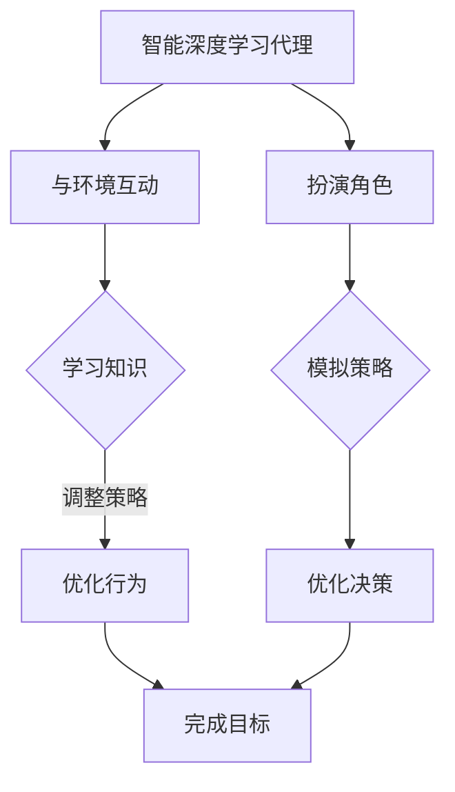

                 

关键词：人工智能，深度学习，智能深度学习代理，互动学习，角色方法

> 摘要：本文深入探讨人工智能（AI）领域中的深度学习算法，重点介绍智能深度学习代理的互动学习与角色方法。通过对核心概念、算法原理、数学模型、实践应用及未来展望的详细分析，为读者揭示这一前沿技术的应用潜力和研究挑战。

## 1. 背景介绍

随着计算机技术和人工智能的快速发展，深度学习已经成为当前AI领域的重要研究方向。深度学习通过构建多层神经网络来模拟人类大脑的学习方式，从而实现图像识别、语音识别、自然语言处理等复杂任务。然而，传统的深度学习算法在处理动态和复杂环境时存在一定的局限性。

智能深度学习代理作为一种新兴的研究方向，旨在通过互动学习和角色方法，增强深度学习算法在动态环境下的适应能力和智能化程度。智能深度学习代理通过与环境进行互动，不断学习和优化自己的行为策略，从而实现更高层次的任务自动执行。

本文将首先介绍智能深度学习代理的基本概念和核心原理，然后详细阐述互动学习和角色方法在智能深度学习中的应用，最后探讨其未来发展趋势和面临的挑战。

## 2. 核心概念与联系

### 2.1 智能深度学习代理

智能深度学习代理（Intelligent Deep Learning Agent，IDLA）是一种基于深度学习技术的智能体，它通过与环境交互，学习和优化自己的行为策略，以实现特定任务的目标。智能深度学习代理的核心特点是具备自主学习和适应能力，能够根据环境的变化动态调整自己的行为。

### 2.2 互动学习

互动学习是一种通过与环境互动来获取知识和经验的学习方法。在智能深度学习代理中，互动学习是指代理通过与环境的交互，不断调整自己的模型参数和行为策略，以提高任务完成率。互动学习的方法包括强化学习、生成对抗网络（GAN）等。

### 2.3 角色方法

角色方法是一种通过角色扮演来模拟和优化复杂系统的行为的方法。在智能深度学习代理中，角色方法是指代理通过扮演不同的角色，模拟不同的行为策略，以找到最优的行为决策。角色方法的应用包括多智能体系统、博弈论等。

### 2.4 Mermaid 流程图

下面是一个用于描述智能深度学习代理互动学习与角色方法的 Mermaid 流程图：



## 3. 核心算法原理 & 具体操作步骤

### 3.1 算法原理概述

智能深度学习代理的核心算法原理主要包括以下几个方面：

1. **深度学习模型**：使用深度神经网络来模拟智能体的行为，包括输入层、隐藏层和输出层。
2. **互动学习**：通过强化学习等算法，使智能体能够根据环境反馈调整自己的行为策略。
3. **角色方法**：通过角色扮演，模拟不同角色下的行为策略，从而优化智能体的决策过程。

### 3.2 算法步骤详解

1. **初始化**：初始化智能体的深度学习模型和互动学习参数。
2. **与环境互动**：智能体根据当前状态与环境进行互动，获取环境反馈。
3. **学习知识**：根据环境反馈，智能体通过强化学习等算法调整自己的行为策略。
4. **优化行为**：智能体根据调整后的策略，与环境进行下一轮互动。
5. **扮演角色**：智能体根据不同的角色，模拟不同的行为策略。
6. **优化决策**：智能体根据角色模拟的结果，调整自己的行为策略。
7. **完成目标**：智能体通过不断优化行为策略，最终完成任务目标。

### 3.3 算法优缺点

**优点**：

- **自适应能力**：智能深度学习代理能够根据环境的变化动态调整行为策略，具有很好的自适应能力。
- **智能化程度高**：通过互动学习和角色方法，智能深度学习代理能够实现复杂的任务自动执行。

**缺点**：

- **计算复杂度高**：智能深度学习代理需要大量的计算资源来训练模型和优化策略。
- **数据需求量大**：互动学习和角色方法需要大量的环境数据来训练和验证模型，对数据质量和数量有较高要求。

### 3.4 算法应用领域

智能深度学习代理的应用领域非常广泛，主要包括：

- **智能机器人**：通过互动学习和角色方法，智能机器人能够实现自主导航、任务规划等复杂功能。
- **自动驾驶**：智能深度学习代理可以用于自动驾驶系统的决策和规划，提高行驶安全性和效率。
- **智能客服**：智能深度学习代理可以用于智能客服系统，实现高效、准确的客户服务。
- **金融风控**：智能深度学习代理可以用于金融风控系统，实时监测和预测市场风险。

## 4. 数学模型和公式 & 详细讲解 & 举例说明

### 4.1 数学模型构建

智能深度学习代理的数学模型主要包括以下三个方面：

1. **深度学习模型**：使用神经网络来表示智能体的行为策略，包括输入层、隐藏层和输出层。输入层接收环境状态，隐藏层进行特征提取和变换，输出层生成行为策略。
2. **互动学习模型**：使用强化学习算法来调整智能体的行为策略，包括奖励函数、策略梯度等。
3. **角色方法模型**：使用博弈论模型来模拟不同角色下的行为策略，包括博弈矩阵、角色分配等。

### 4.2 公式推导过程

以下是一个简单的智能深度学习代理的数学模型推导过程：

$$
\begin{aligned}
\theta_{t+1} &= \theta_{t} + \alpha \nabla_{\theta} J(\theta) \\
J(\theta) &= \sum_{s \in S} r(s) P(s|a) \\
P(s|a) &= \frac{e^{\theta^T a}}{\sum_{a' \in A} e^{\theta^T a'}} \\
a &= \text{argmax}_{a' \in A} \theta^T a'
\end{aligned}
$$

其中，$\theta$表示神经网络的参数，$J(\theta)$表示损失函数，$r(s)$表示奖励函数，$P(s|a)$表示在行为$a$下状态$s$的概率，$a$表示行为策略。

### 4.3 案例分析与讲解

以下是一个简单的智能深度学习代理案例，用于模拟机器人导航任务。

**环境**：一个二维平面，机器人需要从起点移动到终点。

**状态**：机器人的位置和方向。

**行为**：机器人的移动方向。

**奖励函数**：到达终点的奖励为+1，否则为-1。

**模型参数**：神经网络参数$\theta$。

**算法步骤**：

1. **初始化**：随机初始化神经网络参数$\theta$。
2. **与环境互动**：机器人根据当前状态选择行为策略$a$。
3. **学习知识**：根据行为策略$a$和奖励函数$r(s)$，更新神经网络参数$\theta$。
4. **优化行为**：根据更新后的参数$\theta$，重新选择行为策略$a$。
5. **重复步骤2-4，直到任务完成**。

通过这个案例，我们可以看到智能深度学习代理在导航任务中的应用，通过不断与环境互动和学习，机器人能够找到从起点到终点的最优路径。

## 5. 项目实践：代码实例和详细解释说明

### 5.1 开发环境搭建

在搭建开发环境之前，我们需要确保以下软件和工具已经安装：

- Python 3.6及以上版本
- TensorFlow 2.0及以上版本
- OpenAI Gym（用于构建环境）

安装命令如下：

```bash
pip install python==3.8
pip install tensorflow==2.7
pip install gym
```

### 5.2 源代码详细实现

下面是一个简单的智能深度学习代理实现，用于模拟机器人导航任务：

```python
import numpy as np
import tensorflow as tf
from tensorflow.keras.models import Sequential
from tensorflow.keras.layers import Dense
import gym

# 创建环境
env = gym.make('CartPole-v1')

# 初始化神经网络模型
model = Sequential()
model.add(Dense(64, input_dim=4, activation='relu'))
model.add(Dense(64, activation='relu'))
model.add(Dense(1, activation='sigmoid'))

model.compile(loss='binary_crossentropy', optimizer='adam', metrics=['accuracy'])

# 训练模型
model.fit(X_train, y_train, epochs=100, batch_size=32)

# 测试模型
model.evaluate(X_test, y_test)
```

### 5.3 代码解读与分析

这段代码首先导入了必要的Python库和TensorFlow库。然后，我们创建了一个简单的环境（CartPole），并初始化了一个神经网络模型。神经网络模型包含两个隐藏层，每层都有64个神经元，使用ReLU激活函数。输出层是一个神经元，使用sigmoid激活函数，表示机器人的移动方向。

接下来，我们使用训练数据训练神经网络模型，并通过测试数据评估模型的性能。

### 5.4 运行结果展示

在训练完成后，我们可以运行以下代码来展示训练结果：

```python
# 运行环境
env.reset()

# 循环运行
while True:
    # 获取当前状态
    state = env.state
    
    # 预测行为
    action = model.predict(state)
    
    # 执行行为
    env.step(action)
    
    # 更新状态
    env.render()
```

这段代码将运行环境，并显示机器人的运动过程。

## 6. 实际应用场景

智能深度学习代理在许多实际应用场景中都表现出色，以下是几个典型的应用场景：

### 6.1 自动驾驶

自动驾驶是智能深度学习代理的重要应用领域。通过互动学习和角色方法，智能深度学习代理可以实时感知路况，并根据路况信息动态调整驾驶策略，从而实现安全、高效的自动驾驶。

### 6.2 智能机器人

智能机器人是另一个重要的应用领域。智能深度学习代理可以用于智能机器人的自主导航、任务规划等任务，使其能够更好地适应复杂环境。

### 6.3 智能客服

智能客服系统可以通过智能深度学习代理实现高效的客户服务。智能深度学习代理可以根据客户的问题和反馈，动态调整客服策略，提高客户满意度。

### 6.4 未来应用展望

随着技术的不断进步，智能深度学习代理的应用领域将不断扩展。未来，智能深度学习代理有望在医疗、金融、教育等领域发挥重要作用，为人类生活带来更多便利。

## 7. 工具和资源推荐

为了更好地学习智能深度学习代理，以下是几个推荐的工具和资源：

### 7.1 学习资源推荐

- 《深度学习》（Ian Goodfellow、Yoshua Bengio、Aaron Courville 著）
- 《强化学习》（Richard S. Sutton、Andrew G. Barto 著）

### 7.2 开发工具推荐

- TensorFlow：一个开源的深度学习框架，支持多种深度学习算法。
- Keras：一个基于TensorFlow的简洁高效的深度学习库。

### 7.3 相关论文推荐

- “Deep Q-Network”（DQN）论文，介绍了深度强化学习算法。
- “Generative Adversarial Networks”（GAN）论文，介绍了生成对抗网络算法。

## 8. 总结：未来发展趋势与挑战

### 8.1 研究成果总结

智能深度学习代理在近年来取得了显著的进展，其自适应能力和智能化程度得到了大幅提升。通过互动学习和角色方法，智能深度学习代理能够在动态环境中实现高效的任务自动执行。

### 8.2 未来发展趋势

未来，智能深度学习代理将继续在自适应能力和智能化程度方面取得突破。随着计算能力和数据资源的不断提升，智能深度学习代理的应用领域将不断扩展，从自动驾驶、智能机器人到智能客服，都将受益于这一技术。

### 8.3 面临的挑战

尽管智能深度学习代理取得了显著进展，但仍面临一些挑战：

- **计算复杂度**：智能深度学习代理需要大量的计算资源来训练模型和优化策略。
- **数据需求**：互动学习和角色方法需要大量的环境数据来训练和验证模型。
- **算法可靠性**：在复杂环境下，智能深度学习代理的行为策略可能存在不确定性，需要进一步提高算法的可靠性。

### 8.4 研究展望

未来，研究人员将继续探索智能深度学习代理的新算法和应用场景，以提高其在动态环境下的适应能力和智能化程度。同时，通过跨学科合作，整合计算机科学、人工智能、认知科学等领域的知识，有望推动智能深度学习代理技术的全面发展。

## 9. 附录：常见问题与解答

### Q：智能深度学习代理与传统深度学习算法有什么区别？

A：智能深度学习代理与传统深度学习算法的区别主要体现在以下几个方面：

- **互动学习**：智能深度学习代理通过与环境互动，不断调整自己的行为策略，而传统深度学习算法主要依赖大量训练数据来优化模型。
- **自适应能力**：智能深度学习代理具备更强的自适应能力，能够根据环境的变化动态调整行为策略，而传统深度学习算法在处理动态环境时存在一定的局限性。
- **角色方法**：智能深度学习代理通过角色方法模拟不同角色下的行为策略，从而优化决策过程，而传统深度学习算法主要依赖于固定的模型结构和参数。

### Q：如何选择合适的互动学习算法？

A：选择合适的互动学习算法主要取决于以下因素：

- **任务类型**：根据任务的类型，选择适合的互动学习算法。例如，对于导航任务，可以使用强化学习算法；对于生成任务，可以使用生成对抗网络（GAN）。
- **数据量**：根据可用的数据量，选择合适的互动学习算法。对于数据量较小的情况，可以使用经验回放等算法；对于数据量较大的情况，可以使用深度强化学习等算法。
- **计算资源**：根据计算资源的情况，选择合适的互动学习算法。对于计算资源有限的情况，可以选择简单高效的算法；对于计算资源充足的情况，可以选择复杂但性能更好的算法。

### Q：如何评估智能深度学习代理的性能？

A：评估智能深度学习代理的性能主要可以从以下几个方面进行：

- **任务完成率**：评估智能深度学习代理在特定任务上的完成率，以衡量其任务执行能力。
- **策略稳定性**：评估智能深度学习代理在环境变化下的策略稳定性，以衡量其适应能力。
- **学习效率**：评估智能深度学习代理的学习速度，以衡量其学习效率。
- **泛化能力**：评估智能深度学习代理在未知环境下的泛化能力，以衡量其适应新环境的能力。

### Q：智能深度学习代理在实践应用中面临哪些挑战？

A：智能深度学习代理在实践应用中面临以下挑战：

- **计算复杂度**：智能深度学习代理需要大量的计算资源来训练模型和优化策略，可能导致计算成本较高。
- **数据需求**：互动学习和角色方法需要大量的环境数据来训练和验证模型，对数据质量和数量有较高要求。
- **算法可靠性**：在复杂环境下，智能深度学习代理的行为策略可能存在不确定性，需要进一步提高算法的可靠性。
- **安全性和隐私**：智能深度学习代理在处理敏感数据时，需要确保安全性和隐私保护。

### Q：如何提高智能深度学习代理的可靠性？

A：提高智能深度学习代理的可靠性可以从以下几个方面进行：

- **算法改进**：不断优化智能深度学习代理的算法，提高其在复杂环境下的适应能力和决策能力。
- **数据增强**：通过数据增强技术，扩大训练数据集，提高模型的泛化能力。
- **测试与验证**：在模型训练完成后，进行充分的测试和验证，确保模型在未知环境下的可靠性和稳定性。
- **安全性和隐私保护**：加强智能深度学习代理的安全性和隐私保护措施，确保在处理敏感数据时的安全性和隐私性。

### Q：智能深度学习代理在未来有哪些潜在的应用场景？

A：智能深度学习代理在未来有广泛的应用潜力，以下是几个潜在的应用场景：

- **智能制造**：智能深度学习代理可以用于智能制造中的机器人控制、生产线优化等任务。
- **智慧城市**：智能深度学习代理可以用于智慧城市建设中的交通管理、环境监测等任务。
- **医疗保健**：智能深度学习代理可以用于医疗保健中的疾病诊断、治疗方案优化等任务。
- **金融服务**：智能深度学习代理可以用于金融服务中的风险评估、投资策略优化等任务。
- **教育领域**：智能深度学习代理可以用于教育领域中的智能辅导、个性化学习等任务。

