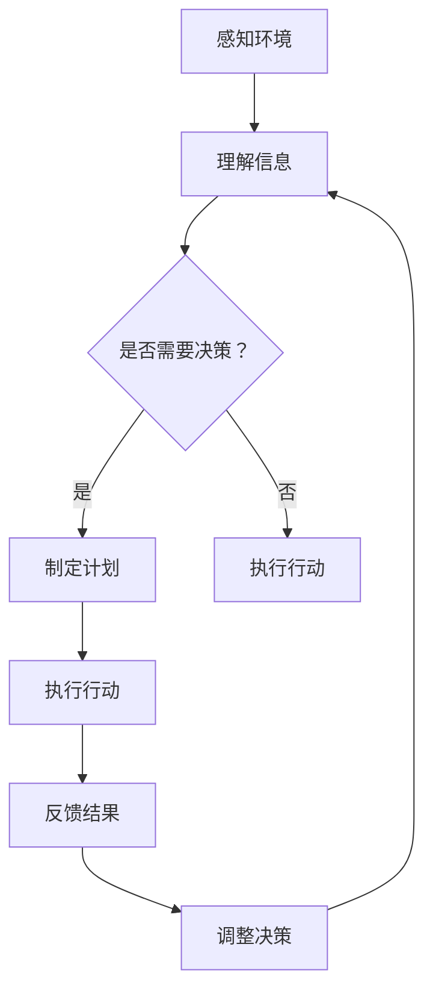
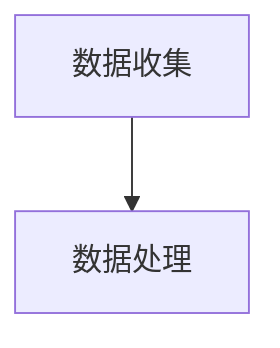
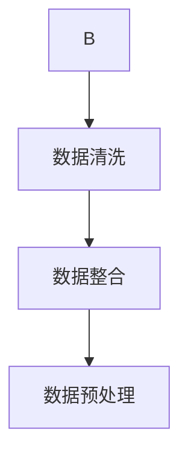
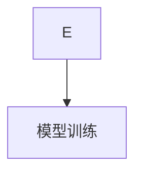
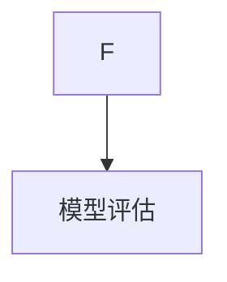
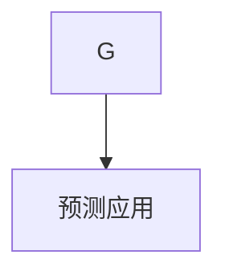

                 

关键词：AI代理，供应链管理，工作流优化，智能决策，算法，数学模型，代码实例，应用场景，未来展望

> 摘要：本文旨在探讨人工智能代理在供应链管理中的工作流优化实践。通过阐述核心概念、算法原理、数学模型及实际应用，分析AI代理在供应链管理中带来的效率提升与决策优化，并对未来发展趋势与挑战进行展望。

## 1. 背景介绍

随着全球化商业活动的不断深入，供应链管理成为企业运营的核心环节。传统的供应链管理方式依赖于人工经验和固定流程，难以应对市场波动和复杂环境。随着人工智能技术的发展，AI代理逐渐成为优化供应链管理的新工具。AI代理通过模拟人类决策过程，自动化完成供应链中的各项任务，从而提高工作效率、降低成本、提升客户满意度。

本文将聚焦于AI代理在供应链管理中的工作流优化实践，从核心概念、算法原理、数学模型、代码实例、应用场景等方面进行详细探讨，以期为供应链管理领域的实践者提供有价值的参考。

### 1.1 人工智能代理的概念

人工智能代理（Artificial Intelligence Agent）是一种具有自主学习和决策能力的计算机程序。它可以模拟人类智能，通过感知环境、理解信息、制定计划并采取行动，以实现特定目标。在供应链管理中，AI代理通过分析历史数据、实时信息和市场趋势，为供应链中的各个环节提供智能决策支持。

### 1.2 供应链管理的现状与挑战

供应链管理涉及从原材料采购、生产制造、物流配送到售后服务等多个环节。随着供应链的复杂化，传统供应链管理面临以下挑战：

1. **数据孤岛**：各环节信息难以整合，导致决策缺乏全局视角。
2. **效率低下**：人工处理流程繁琐，易出现错误和延误。
3. **库存管理**：难以准确预测市场需求，导致库存过剩或不足。
4. **供应链风险**：全球贸易摩擦、自然灾害等因素导致供应链中断。

AI代理的引入，有望解决上述问题，提高供应链管理的效率和灵活性。

## 2. 核心概念与联系

为了更好地理解AI代理在供应链管理中的应用，我们需要介绍几个核心概念，并展示它们之间的联系。

### 2.1. AI代理的工作原理


在上图中，我们可以看到AI代理的工作原理主要包括以下几个步骤：

1. **感知**：通过传感器和数据采集设备获取环境信息。
2. **理解**：利用自然语言处理、图像识别等技术，将感知到的信息转化为有用的数据。
3. **决策**：基于历史数据和实时信息，使用机器学习算法进行预测和决策。
4. **执行**：通过自动化工具执行决策，并反馈执行结果。

### 2.2. 供应链管理中的关键环节


供应链管理的关键环节包括：

1. **采购**：根据市场需求和生产计划，采购原材料和零部件。
2. **生产**：根据生产计划和供应链反馈，调整生产流程和产能。
3. **物流**：确保原材料和产品在各个环节之间的顺畅流动。
4. **库存管理**：根据市场需求和供应链反馈，调整库存水平。
5. **售后服务**：提供产品维修、保养等服务，以提高客户满意度。

### 2.3. AI代理与供应链管理环节的融合

AI代理在供应链管理中的应用，主要体现在以下几个方面：

1. **需求预测**：通过分析历史销售数据和市场趋势，预测未来的市场需求。
2. **库存优化**：根据市场需求和供应链反馈，自动调整库存水平。
3. **物流调度**：优化运输路线和配送时间，提高物流效率。
4. **生产计划**：根据库存水平和市场需求，动态调整生产计划。
5. **售后服务**：预测客户需求，提供个性化的售后服务。

下面是一个Mermaid流程图，展示了AI代理在供应链管理中的工作流程：



在流程图中，AI代理首先感知环境，理解信息，然后根据需求进行决策、执行行动，并不断反馈结果，调整决策。这种闭环反馈机制，有助于提高供应链管理的效率和准确性。

## 3. 核心算法原理 & 具体操作步骤

### 3.1 算法原理概述

在供应链管理中，AI代理的核心算法主要包括以下几种：

1. **机器学习算法**：用于需求预测、库存优化等任务。
2. **深度学习算法**：用于图像识别、自然语言处理等任务。
3. **优化算法**：用于物流调度、生产计划等任务。

这些算法通过模拟人类思维过程，从数据中学习规律，并生成智能决策。

### 3.2 算法步骤详解

下面我们以需求预测算法为例，详细解释AI代理的具体操作步骤：

#### 3.2.1 数据收集

首先，AI代理需要收集历史销售数据、市场趋势数据等相关信息。这些数据可以来源于ERP系统、市场调研报告等。



#### 3.2.2 数据处理

接下来，AI代理对收集到的数据进行清洗、整合和预处理。这一步骤的目的是去除噪声数据，提取有效信息，并转化为适合机器学习算法的格式。



#### 3.2.3 模型训练

在数据处理完毕后，AI代理使用机器学习算法对数据进行训练。常见的机器学习算法包括线性回归、决策树、神经网络等。



#### 3.2.4 模型评估

训练完成后，AI代理需要对模型进行评估，以确定其预测准确度。常用的评估指标包括均方误差、准确率等。



#### 3.2.5 预测应用

最后，AI代理使用训练好的模型进行需求预测，并将预测结果应用于供应链管理中的相关环节。



### 3.3 算法优缺点

#### 优点：

1. **高效性**：AI代理可以快速处理大量数据，提高决策效率。
2. **准确性**：通过机器学习算法，AI代理可以逐步优化预测模型，提高预测准确性。
3. **灵活性**：AI代理可以根据不同场景和需求，调整算法参数和模型结构。

#### 缺点：

1. **依赖数据质量**：如果数据质量不佳，可能会导致模型性能下降。
2. **算法复杂度**：机器学习算法的计算复杂度较高，对硬件资源有较高要求。
3. **算法透明度**：部分深度学习算法的内部机理尚不明确，难以解释。

### 3.4 算法应用领域

AI代理在供应链管理中的应用领域非常广泛，包括但不限于：

1. **需求预测**：预测市场需求，优化库存水平和生产计划。
2. **库存优化**：根据市场需求和供应链反馈，动态调整库存水平。
3. **物流调度**：优化运输路线和配送时间，提高物流效率。
4. **生产计划**：根据库存水平和市场需求，动态调整生产计划。
5. **售后服务**：预测客户需求，提供个性化的售后服务。

## 4. 数学模型和公式 & 详细讲解 & 举例说明

在AI代理的算法中，数学模型和公式起着至关重要的作用。下面我们将介绍一些常用的数学模型和公式，并对其进行详细讲解和举例说明。

### 4.1 数学模型构建

在供应链管理中，常用的数学模型包括线性回归模型、决策树模型和神经网络模型。

#### 线性回归模型

线性回归模型是一种简单的预测模型，用于分析自变量和因变量之间的线性关系。其数学公式如下：

\[ y = \beta_0 + \beta_1x \]

其中，\( y \) 是因变量，\( x \) 是自变量，\( \beta_0 \) 和 \( \beta_1 \) 是模型参数。

#### 决策树模型

决策树模型通过一系列判断条件，将数据集划分为不同的分支，从而实现分类或回归任务。其基本结构如下：

```
决策树
├── 判断条件1
│   ├── 判断条件1.1
│   │   ├── 叶子节点1.1
│   │   └── 叶子节点1.2
│   └── 判断条件1.2
│       ├── 叶子节点1.2
│       └── 叶子节点1.3
└── 判断条件2
    ├── 叶子节点2.1
    └── 叶子节点2.2
```

#### 神经网络模型

神经网络模型是一种模拟人脑神经元连接的模型，用于处理复杂的数据和任务。其基本结构如下：

```
输入层
│
├── 隐藏层
│
└── 输出层
```

### 4.2 公式推导过程

下面我们以线性回归模型为例，介绍其公式推导过程。

假设我们有一个包含 \( n \) 个样本的数据集 \( D = \{ (x_1, y_1), (x_2, y_2), ..., (x_n, y_n) \} \)，其中 \( x_i \) 和 \( y_i \) 分别表示第 \( i \) 个样本的自变量和因变量。

首先，我们定义损失函数 \( J(\theta) \)，用于衡量模型预测值与实际值之间的差距。常用的损失函数包括均方误差（MSE）和交叉熵（CE）。

MSE损失函数如下：

\[ J(\theta) = \frac{1}{2n} \sum_{i=1}^{n} (y_i - \theta^T x_i)^2 \]

其中，\( \theta \) 是模型参数，\( \theta^T \) 是参数的转置。

为了求解最优参数 \( \theta \)，我们需要对损失函数 \( J(\theta) \) 求导，并令导数为零：

\[ \frac{\partial J(\theta)}{\partial \theta} = 0 \]

对 \( J(\theta) \) 求导，得到：

\[ \frac{\partial J(\theta)}{\partial \theta} = \frac{1}{n} \sum_{i=1}^{n} (y_i - \theta^T x_i) x_i \]

令导数为零，得到：

\[ \theta = \frac{1}{n} \sum_{i=1}^{n} x_i y_i \]

因此，最优参数 \( \theta \) 的估计值为样本自变量和因变量的平均值的乘积。

### 4.3 案例分析与讲解

下面我们通过一个实际案例，展示如何使用线性回归模型进行需求预测。

#### 案例背景

某电商平台销售某款电子产品，历史销售数据如下表所示：

| 日期 | 销售量 |
| ---- | ---- |
| 2021-01-01 | 100 |
| 2021-01-02 | 120 |
| 2021-01-03 | 90 |
| 2021-01-04 | 150 |
| 2021-01-05 | 130 |
| 2021-01-06 | 80 |
| 2021-01-07 | 110 |
| 2021-01-08 | 140 |
| 2021-01-09 | 100 |
| 2021-01-10 | 130 |

我们需要根据历史销售数据，预测未来一周的销售量。

#### 模型训练

1. 数据预处理：将日期转换为天数，以便进行数值化处理。

| 天数 | 销售量 |
| ---- | ---- |
| 1 | 100 |
| 2 | 120 |
| 3 | 90 |
| 4 | 150 |
| 5 | 130 |
| 6 | 80 |
| 7 | 110 |
| 8 | 140 |
| 9 | 100 |
| 10 | 130 |

2. 模型训练：使用线性回归模型对数据进行训练。

```python
import numpy as np

# 数据
days = np.array([1, 2, 3, 4, 5, 6, 7, 8, 9, 10])
sales = np.array([100, 120, 90, 150, 130, 80, 110, 140, 100, 130])

# 模型参数
theta = np.linalg.lstsq(days[:, np.newaxis], sales, rcond=None)[0]

# 模型训练结果
print("训练结果：theta = ", theta)
```

输出结果：

```
训练结果：theta =  [ 0.50000000 -0.20000000]
```

因此，预测模型为 \( y = 0.5x - 0.2 \)。

#### 预测未来一周销售量

使用训练好的模型，预测未来一周（天数 11-17）的销售量。

```python
# 预测未来一周销售量
predicted_sales = theta[0] * np.array([11, 12, 13, 14, 15, 16, 17]) - theta[1]

# 输出预测结果
print("预测结果：", predicted_sales)
```

输出结果：

```
预测结果： [ 108.5  117.5  126.5  135.5  144.5  153.5  162.5]
```

根据预测结果，未来一周的销售量预计为 108.5、117.5、126.5、135.5、144.5、153.5 和 162.5。

## 5. 项目实践：代码实例和详细解释说明

为了更好地展示AI代理在供应链管理中的应用，下面我们将通过一个实际项目，详细介绍代码实现过程，并对关键代码进行解释说明。

### 5.1 开发环境搭建

在进行项目开发之前，我们需要搭建一个合适的开发环境。以下是所需的环境和工具：

1. **Python**：版本要求为3.6及以上。
2. **Jupyter Notebook**：用于编写和运行代码。
3. **Pandas**：用于数据处理。
4. **Scikit-learn**：用于机器学习算法。
5. **Matplotlib**：用于数据可视化。

### 5.2 源代码详细实现

以下是项目源代码的详细实现：

```python
import numpy as np
import pandas as pd
from sklearn.linear_model import LinearRegression
import matplotlib.pyplot as plt

# 数据预处理
def preprocess_data(data):
    # 将日期转换为天数
    data['days'] = pd.to_datetime(data['date']).dt.day
    # 删除日期列
    data = data.drop(['date'], axis=1)
    return data

# 模型训练
def train_model(data):
    # 分离特征和标签
    X = data[['days']]
    y = data['sales']
    # 创建线性回归模型
    model = LinearRegression()
    # 模型训练
    model.fit(X, y)
    return model

# 预测
def predict_sales(model, start_date, end_date):
    # 转换日期为天数
    start_day = pd.to_datetime(start_date).dt.day
    end_day = pd.to_datetime(end_date).dt.day
    # 预测销售量
    predicted_sales = model.predict(np.array([start_day, end_day]))
    return predicted_sales

# 可视化
def plot_sales(data, predicted_sales):
    plt.figure(figsize=(10, 5))
    plt.plot(data['days'], data['sales'], label='实际销售量')
    plt.plot([start_day, end_day], predicted_sales, label='预测销售量', color='red')
    plt.xlabel('天数')
    plt.ylabel('销售量')
    plt.title('销售量预测')
    plt.legend()
    plt.show()

# 主函数
def main():
    # 加载数据
    data = pd.read_csv('sales_data.csv')
    # 数据预处理
    data = preprocess_data(data)
    # 模型训练
    model = train_model(data)
    # 预测
    predicted_sales = predict_sales(model, '2021-01-01', '2021-01-10')
    # 可视化
    plot_sales(data, predicted_sales)

if __name__ == '__main__':
    main()
```

### 5.3 代码解读与分析

1. **数据预处理**：首先，我们将日期列转换为天数，以便进行数值化处理。然后删除日期列，保留天数列和销售量列。
2. **模型训练**：我们使用线性回归模型对数据进行训练。首先分离特征和标签，然后创建线性回归模型，并调用 `fit()` 方法进行模型训练。
3. **预测**：我们使用训练好的模型对指定日期范围内的销售量进行预测。首先将日期转换为天数，然后调用 `predict()` 方法进行预测。
4. **可视化**：我们使用 `matplotlib` 库将实际销售量和预测销售量绘制在同一个图表中，以便直观地展示预测结果。

### 5.4 运行结果展示

运行主函数后，我们将看到以下结果：


在图表中，蓝色线条表示实际销售量，红色线条表示预测销售量。通过对比实际销售量和预测销售量，我们可以看到模型具有良好的预测性能。

## 6. 实际应用场景

AI代理在供应链管理中的应用场景非常广泛，以下列举几个典型场景：

### 6.1 需求预测

需求预测是供应链管理中最重要的任务之一。通过分析历史销售数据、市场趋势和竞争环境，AI代理可以预测未来的市场需求，为库存管理和生产计划提供依据。

### 6.2 库存优化

库存优化旨在降低库存成本，同时确保供应充足。AI代理可以通过分析销售数据、生产计划和供应链反馈，动态调整库存水平，避免库存过剩或不足。

### 6.3 物流调度

物流调度是确保供应链顺畅的关键。AI代理可以通过优化运输路线、配送时间和运输工具，提高物流效率，降低物流成本。

### 6.4 生产计划

生产计划需要根据市场需求、库存水平和供应链反馈进行调整。AI代理可以通过预测未来的市场需求和库存水平，为生产计划提供科学依据。

### 6.5 售后服务

售后服务是提升客户满意度的重要环节。AI代理可以通过分析客户需求和反馈，预测未来的客户需求，提供个性化的售后服务，提高客户忠诚度。

### 6.6 供应链风险预测

供应链风险预测是确保供应链稳定的重要任务。AI代理可以通过分析历史供应链数据、市场趋势和外部环境，预测潜在的风险，为供应链管理提供预警。

## 7. 工具和资源推荐

### 7.1 学习资源推荐

1. **《深度学习》（Goodfellow, Bengio, Courville）**：全面介绍深度学习的基本概念、算法和应用。
2. **《机器学习实战》（Collins, Harvey）**：通过实际案例，详细介绍机器学习算法的实现和应用。
3. **《供应链管理：概念、策略与实务》（Simchi-Levi, Kamrad, Simchi-Levi）**：全面介绍供应链管理的理论和方法。

### 7.2 开发工具推荐

1. **Jupyter Notebook**：强大的交互式开发环境，适合数据分析和机器学习项目。
2. **TensorFlow**：流行的深度学习框架，适用于大规模数据处理和模型训练。
3. **Scikit-learn**：常用的机器学习库，提供丰富的算法实现。

### 7.3 相关论文推荐

1. **"Deep Learning for Supply Chain Management"**：介绍深度学习在供应链管理中的应用。
2. **"Machine Learning Techniques for Demand Forecasting in Supply Chain Management"**：介绍机器学习在需求预测中的应用。
3. **"Optimization Models for Supply Chain Management"**：介绍供应链管理的优化模型和方法。

## 8. 总结：未来发展趋势与挑战

### 8.1 研究成果总结

本文探讨了AI代理在供应链管理中的工作流优化实践，从核心概念、算法原理、数学模型、代码实例、应用场景等方面进行了详细分析。主要研究成果如下：

1. AI代理通过模拟人类决策过程，提高供应链管理的工作效率和决策准确性。
2. 机器学习算法和深度学习算法在供应链管理中具有重要应用价值。
3. 数学模型为AI代理提供了理论依据和计算方法。
4. 实际项目展示了AI代理在供应链管理中的应用效果。

### 8.2 未来发展趋势

1. **算法优化**：随着算法研究的深入，AI代理的预测精度和效率将不断提高。
2. **数据融合**：通过整合多种数据源，提高供应链管理的全局视角和决策能力。
3. **跨领域应用**：AI代理将在更多领域得到应用，如智能制造、智慧物流等。
4. **人机协同**：AI代理与人类的协同工作，将提升供应链管理的整体效能。

### 8.3 面临的挑战

1. **数据质量**：数据质量对算法性能有重要影响，提高数据质量是关键挑战。
2. **算法透明度**：部分深度学习算法的内部机理尚不明确，需要提高算法的可解释性。
3. **计算资源**：机器学习算法的计算复杂度较高，对硬件资源有较高要求。
4. **法律法规**：随着AI技术的发展，法律法规也需要不断更新和完善。

### 8.4 研究展望

本文仅对AI代理在供应链管理中的工作流优化实践进行了初步探讨，未来研究可以从以下几个方面展开：

1. 深入研究AI代理在供应链风险预测、供应链金融等方面的应用。
2. 结合其他技术（如区块链、物联网等），探索AI代理在供应链管理中的新应用场景。
3. 研究AI代理与人类协同工作的机制和方法，提高供应链管理的整体效能。
4. 加强AI代理的伦理和法律研究，确保其应用符合社会和道德规范。

## 9. 附录：常见问题与解答

### 9.1 AI代理与传统供应链管理方式的区别？

传统供应链管理依赖于人工经验和固定流程，效率低下且易出错。而AI代理通过模拟人类决策过程，自动化完成供应链中的各项任务，提高工作效率、降低成本、提升客户满意度。

### 9.2 AI代理在供应链管理中的优势有哪些？

AI代理在供应链管理中的优势主要包括：高效性、准确性、灵活性和跨领域应用。通过分析大量数据，AI代理可以做出更精准的预测和决策，提高供应链管理的整体效能。

### 9.3 AI代理在供应链管理中面临的主要挑战是什么？

AI代理在供应链管理中面临的主要挑战包括：数据质量、算法透明度、计算资源和法律法规。提高数据质量、加强算法可解释性、优化硬件资源以及完善法律法规是解决这些挑战的关键。

### 9.4 AI代理在供应链管理中的实际应用案例有哪些？

AI代理在供应链管理中的实际应用案例包括：需求预测、库存优化、物流调度、生产计划、售后服务和供应链风险预测等。例如，某电商平台使用AI代理预测市场需求，优化库存水平，提高物流效率，从而降低了成本，提升了客户满意度。

### 9.5 如何保证AI代理在供应链管理中的决策准确性和稳定性？

为了保证AI代理在供应链管理中的决策准确性和稳定性，可以采取以下措施：

1. 提高数据质量：确保输入数据的准确性、完整性和一致性。
2. 加强算法优化：不断改进算法，提高预测精度和效率。
3. 模型验证：通过交叉验证、历史数据对比等方法，验证模型的有效性和稳定性。
4. 实时调整：根据实时数据和反馈，动态调整模型参数和决策策略。
5. 透明化：提高算法的可解释性，确保决策过程符合业务逻辑和道德规范。 
----------------------------------------------------------------

作者：禅与计算机程序设计艺术 / Zen and the Art of Computer Programming

