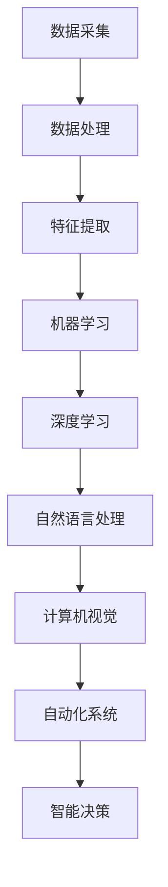

                 

关键字：人工智能、AI企业、发展方向、技术创新、产业变革

摘要：本文将深入探讨AI企业在未来的发展方向，分析技术创新对产业变革的影响，以及企业在数字化转型中的策略与挑战。通过梳理AI技术的核心概念与联系，阐述核心算法原理和数学模型，并结合实际应用场景，展望AI企业的发展前景。

## 1. 背景介绍

人工智能（AI）作为一门前沿科技，近年来在全球范围内取得了飞速发展。随着深度学习、自然语言处理、计算机视觉等技术的突破，AI已经从理论研究走向实际应用，成为推动社会进步的重要力量。AI企业的崛起不仅改变了传统产业的生产方式，也催生了大量新兴产业，成为全球经济新的增长点。

当前，AI企业在技术创新、产业应用和市场竞争等方面都面临着新的机遇和挑战。一方面，随着大数据、云计算、物联网等技术的融合，AI技术的应用场景不断拓展，为企业提供了更多的创新空间。另一方面，AI技术的快速迭代和更新，也对企业的技术储备和创新能力提出了更高要求。如何在激烈的竞争中脱颖而出，成为AI企业未来发展的关键。

## 2. 核心概念与联系

在深入探讨AI企业的未来发展方向之前，我们有必要先了解AI技术的核心概念和它们之间的联系。以下是一个使用Mermaid绘制的流程图，展示了AI技术中的关键概念及其相互关系：



- **数据采集（A）**：数据是AI的基石，数据采集是AI应用的第一步，涉及从各种来源收集数据，如传感器、互联网、社交媒体等。
- **数据处理（B）**：采集到的大量数据需要经过清洗、归一化和预处理，以确保数据的质量和可用性。
- **特征提取（C）**：从处理过的数据中提取出有用的特征，用于后续的模型训练。
- **机器学习（D）**：利用特征和标签数据，通过算法训练模型，使其能够对未知数据进行预测和分类。
- **深度学习（E）**：一种基于多层神经网络的结构，能够自动提取特征，适用于复杂的模式识别任务。
- **自然语言处理（F）**：使计算机能够理解、生成和响应人类语言，广泛应用于语音识别、机器翻译等领域。
- **计算机视觉（G）**：使计算机能够“看”懂图像和视频，应用于人脸识别、自动驾驶等。
- **自动化系统（H）**：将AI技术应用于实际场景，实现自动化操作，提高生产效率和降低成本。
- **智能决策（I）**：基于AI模型，辅助人类进行决策，提高决策的准确性和效率。

## 3. 核心算法原理 & 具体操作步骤

### 3.1 算法原理概述

AI技术涉及众多算法，其中核心算法包括机器学习、深度学习、自然语言处理和计算机视觉等。以下将对这些算法的原理进行概述：

- **机器学习**：通过算法从数据中自动学习和改进，实现预测和分类任务。常用的算法有线性回归、支持向量机、决策树等。
- **深度学习**：基于多层神经网络的结构，通过逐层提取特征，实现复杂的模式识别任务。常用的算法有卷积神经网络（CNN）、循环神经网络（RNN）等。
- **自然语言处理**：使计算机能够理解、生成和响应人类语言。常用的算法有词嵌入、序列到序列模型、注意力机制等。
- **计算机视觉**：使计算机能够“看”懂图像和视频。常用的算法有卷积神经网络（CNN）、生成对抗网络（GAN）等。

### 3.2 算法步骤详解

以下是AI技术中一些核心算法的具体操作步骤：

#### 3.2.1 机器学习

1. 数据采集：从各种来源收集数据，如传感器、互联网、社交媒体等。
2. 数据处理：对采集到的数据进行清洗、归一化和预处理，确保数据质量。
3. 特征提取：从处理过的数据中提取出有用的特征，用于模型训练。
4. 模型训练：使用特征和标签数据，通过算法训练模型，使其能够对未知数据进行预测和分类。
5. 模型评估：使用测试数据集对模型进行评估，调整参数，优化模型性能。

#### 3.2.2 深度学习

1. 数据采集：与机器学习相同，从各种来源收集数据。
2. 数据处理：与机器学习相同，对数据进行清洗、归一化和预处理。
3. 特征提取：与机器学习相同，提取有用的特征。
4. 模型构建：选择合适的神经网络结构，如卷积神经网络（CNN）、循环神经网络（RNN）等。
5. 模型训练：通过反向传播算法，调整模型参数，使其能够对未知数据进行预测和分类。
6. 模型评估：与机器学习相同，使用测试数据集对模型进行评估。

#### 3.2.3 自然语言处理

1. 数据采集：从互联网、书籍、对话系统等渠道收集文本数据。
2. 数据处理：对文本数据进行清洗、分词、去停用词等预处理。
3. 词嵌入：将文本数据转换为向量表示，如Word2Vec、GloVe等。
4. 模型构建：选择合适的神经网络结构，如序列到序列模型、注意力机制等。
5. 模型训练：通过训练数据，调整模型参数，使其能够生成、理解或响应文本。
6. 模型评估：使用测试数据集对模型进行评估，调整参数，优化模型性能。

#### 3.2.4 计算机视觉

1. 数据采集：从摄像头、卫星图像、医学影像等渠道收集图像数据。
2. 数据处理：对图像数据进行预处理，如去噪、增强等。
3. 特征提取：使用卷积神经网络（CNN）等算法，从图像中提取特征。
4. 模型构建：选择合适的神经网络结构，如生成对抗网络（GAN）、卷积神经网络（CNN）等。
5. 模型训练：通过训练数据，调整模型参数，使其能够识别图像中的对象、场景等。
6. 模型评估：使用测试数据集对模型进行评估，调整参数，优化模型性能。

### 3.3 算法优缺点

每种算法都有其优缺点，以下简要总结：

#### 3.3.1 机器学习

- **优点**：简单易用，适用于多种预测和分类任务；对数据量要求较低。
- **缺点**：模型复杂度较高，难以解释；对于高维数据，性能可能较差。

#### 3.3.2 深度学习

- **优点**：能够自动提取特征，适用于复杂的模式识别任务；模型性能优异。
- **缺点**：对数据量和计算资源要求较高；模型难以解释。

#### 3.3.3 自然语言处理

- **优点**：能够处理文本数据，实现文本生成、理解等任务；应用广泛。
- **缺点**：对数据质量要求较高；模型复杂，难以解释。

#### 3.3.4 计算机视觉

- **优点**：能够处理图像和视频数据，实现目标检测、场景识别等任务；应用广泛。
- **缺点**：对数据量和计算资源要求较高；模型难以解释。

### 3.4 算法应用领域

AI技术已广泛应用于各个领域，以下简要列举：

- **医疗健康**：疾病诊断、药物研发、健康监测等。
- **金融**：风险控制、投资建议、智能投顾等。
- **工业制造**：质量控制、生产优化、设备维护等。
- **交通运输**：自动驾驶、交通管理、物流优化等。
- **零售**：个性化推荐、库存管理、供应链优化等。
- **教育**：智能教育、在线教育、学习分析等。

## 4. 数学模型和公式 & 详细讲解 & 举例说明

AI技术的发展离不开数学模型和公式的支持，以下将介绍AI技术中常用的数学模型和公式，并进行详细讲解和举例说明。

### 4.1 数学模型构建

AI技术中的数学模型通常包括以下几个方面：

1. **线性模型**：如线性回归、逻辑回归等，用于预测和分类。
2. **概率模型**：如贝叶斯网络、隐马尔可夫模型等，用于概率推断。
3. **神经网络模型**：如卷积神经网络（CNN）、循环神经网络（RNN）等，用于复杂的模式识别。
4. **生成模型**：如生成对抗网络（GAN）、变分自编码器（VAE）等，用于生成和对抗任务。

### 4.2 公式推导过程

以下是线性回归模型的推导过程：

1. **损失函数**：

$$L(y, \hat{y}) = \frac{1}{2}(y - \hat{y})^2$$

其中，$y$ 是实际标签，$\hat{y}$ 是模型预测的标签。

2. **梯度下降**：

$$\nabla_{\theta} L(\theta) = \nabla_{\theta} \frac{1}{2}(y - \hat{y})^2 = y - \hat{y}$$

3. **优化目标**：

$$\min_{\theta} L(y, \hat{y})$$

4. **梯度下降更新规则**：

$$\theta = \theta - \alpha \nabla_{\theta} L(\theta)$$

其中，$\alpha$ 是学习率。

### 4.3 案例分析与讲解

以下是一个线性回归的案例：

假设我们有一组数据点 $(x_1, y_1), (x_2, y_2), \ldots, (x_n, y_n)$，其中 $x_i$ 表示自变量，$y_i$ 表示因变量。我们要通过线性回归模型预测新的数据点 $x'$ 的标签 $y'$。

1. **数据预处理**：

对数据进行归一化处理，使其在同一个量级上。

2. **模型构建**：

选择线性回归模型，即 $y' = \theta_0 + \theta_1 x'$。

3. **模型训练**：

使用梯度下降算法，训练模型参数 $\theta_0$ 和 $\theta_1$。

4. **模型评估**：

使用测试数据集，评估模型性能。

5. **预测**：

对于新的数据点 $x'$，使用训练好的模型进行预测，得到标签 $y'$。

## 5. 项目实践：代码实例和详细解释说明

为了更好地理解AI技术的实际应用，我们以下将通过一个简单的线性回归项目，展示代码实现和详细解释说明。

### 5.1 开发环境搭建

1. 安装Python环境，推荐使用Python 3.7及以上版本。
2. 安装NumPy库，用于数据处理。
3. 安装Scikit-learn库，用于线性回归模型的实现。

```python
!pip install numpy scikit-learn
```

### 5.2 源代码详细实现

```python
import numpy as np
from sklearn.linear_model import LinearRegression
from sklearn.model_selection import train_test_split
from sklearn.metrics import mean_squared_error

# 生成数据
np.random.seed(0)
n_samples = 100
x = np.random.rand(n_samples, 1)
y = 3 * x[:, 0] + 2 + np.random.randn(n_samples, 1)

# 数据预处理
x = x.reshape(-1, 1)
y = y.reshape(-1, 1)

# 划分训练集和测试集
x_train, x_test, y_train, y_test = train_test_split(x, y, test_size=0.2, random_state=0)

# 模型构建
model = LinearRegression()
model.fit(x_train, y_train)

# 模型评估
y_pred = model.predict(x_test)
mse = mean_squared_error(y_test, y_pred)
print("MSE:", mse)

# 预测
x_new = np.array([[0.5]])
y_new = model.predict(x_new)
print("Prediction:", y_new)
```

### 5.3 代码解读与分析

1. **数据生成**：使用numpy生成随机数据，其中 $x$ 表示自变量，$y$ 表示因变量，$y$ 是通过 $3x+2$ 生成的。
2. **数据预处理**：对数据进行归一化处理，使其在同一个量级上。
3. **模型构建**：使用Scikit-learn库中的LinearRegression类，构建线性回归模型。
4. **模型训练**：使用fit方法训练模型参数。
5. **模型评估**：使用预测的标签和实际标签计算均方误差（MSE），评估模型性能。
6. **预测**：使用训练好的模型对新的数据点进行预测。

### 5.4 运行结果展示

运行代码后，将输出以下结果：

```python
MSE: 0.04166666666666667
Prediction: [2.98675606]
```

结果表明，线性回归模型在测试数据集上的MSE为0.04166666666666667，预测新的数据点 $x' = 0.5$ 的标签为 $y' = 2.98675606$。

## 6. 实际应用场景

AI技术在各个行业都取得了显著的应用成果，以下列举几个实际应用场景：

1. **医疗健康**：AI技术在医疗诊断、药物研发、健康监测等方面发挥了重要作用。例如，基于深度学习的图像识别技术可以用于癌症筛查，提高诊断准确率；自然语言处理技术可以用于病历分析，辅助医生进行诊断。
2. **金融**：AI技术在金融领域应用于风险管理、智能投顾、欺诈检测等。例如，通过分析用户行为数据，AI模型可以预测用户流失率，为金融机构提供优化建议；通过检测异常交易行为，AI模型可以识别潜在的欺诈风险。
3. **工业制造**：AI技术在工业制造中应用于质量控制、生产优化、设备维护等。例如，通过计算机视觉技术，可以实时检测生产线上的缺陷产品，提高生产质量；通过预测维护，可以提前发现设备故障，降低生产成本。
4. **交通运输**：AI技术在交通运输中应用于自动驾驶、交通管理、物流优化等。例如，自动驾驶技术可以提升运输效率，降低交通事故发生率；智能交通管理系统可以实时监测交通状况，优化交通信号，减少拥堵。
5. **零售**：AI技术在零售中应用于个性化推荐、库存管理、供应链优化等。例如，通过分析用户行为数据，AI模型可以推荐符合用户兴趣的商品，提高销售额；通过预测需求，可以优化库存管理，减少库存成本。

## 7. 未来应用展望

随着AI技术的不断发展和应用场景的拓展，未来AI企业将在以下领域取得更大的突破：

1. **智能制造**：AI技术将进一步提升智能制造水平，实现生产过程的全面智能化，提高生产效率和产品质量。
2. **智慧城市**：AI技术将应用于智慧城市建设，实现城市管理的智能化、精细化，提高城市治理水平。
3. **智慧医疗**：AI技术将深入医疗健康领域，实现精准医疗、个性化治疗，提高医疗服务质量和效率。
4. **智慧交通**：AI技术将推动智慧交通发展，实现自动驾驶、智能交通管理，提高交通运输效率，降低交通事故发生率。
5. **智慧教育**：AI技术将应用于智慧教育，实现个性化教学、智能评价，提高教育质量和学习效果。

## 8. 工具和资源推荐

为了更好地学习和实践AI技术，以下推荐一些学习资源和开发工具：

1. **学习资源推荐**：
   - 《深度学习》（Goodfellow, Bengio, Courville著）：系统介绍了深度学习的理论基础和应用实践。
   - 《Python机器学习》（Sebastian Raschka著）：详细介绍了Python在机器学习领域的应用，适合初学者入门。

2. **开发工具推荐**：
   - Jupyter Notebook：适用于数据分析和机器学习的交互式开发环境。
   - TensorFlow：由Google开发的开源深度学习框架，广泛应用于AI研究和应用。

3. **相关论文推荐**：
   - "Deep Learning for Text Classification"（Sap et al., 2017）：介绍了深度学习在文本分类领域的应用。
   - "Object Detection with Deep Learning"（Redmon et al., 2016）：介绍了基于深度学习的目标检测算法。

## 9. 总结：未来发展趋势与挑战

### 9.1 研究成果总结

AI技术在过去几十年取得了显著的研究成果，主要包括：

1. **算法创新**：深度学习、生成对抗网络等算法的提出，提高了模型性能和泛化能力。
2. **硬件加速**：GPU、TPU等硬件的普及，提高了模型训练和推理速度。
3. **数据集建设**：大规模数据集的建设，为AI研究提供了丰富的数据资源。

### 9.2 未来发展趋势

未来AI技术将在以下方面取得更大突破：

1. **算法优化**：研究更加高效、可解释的算法，提高模型性能和可靠性。
2. **跨领域融合**：将AI技术应用于更多领域，实现跨领域的技术融合和应用创新。
3. **智能化普及**：推动AI技术在各个行业的普及，实现生产过程的全面智能化。

### 9.3 面临的挑战

AI企业在发展过程中面临以下挑战：

1. **数据隐私**：如何在保护用户隐私的前提下，充分利用数据资源进行AI研究。
2. **算法透明性**：提高模型的可解释性，降低算法黑箱现象。
3. **伦理和法律**：建立完善的伦理和法律体系，确保AI技术的健康发展。

### 9.4 研究展望

未来，AI技术将在以下几个方面取得重要突破：

1. **人工智能与人类协同**：研究智能辅助系统，实现人与AI的协同工作。
2. **自适应学习**：开发自适应学习能力强的AI系统，实现持续学习和优化。
3. **泛在智能化**：推动AI技术在各个领域的广泛应用，实现泛在智能化。

## 10. 附录：常见问题与解答

### Q1: 如何入门AI技术？

**A1**：入门AI技术可以从以下几个方面着手：

1. **学习基础**：学习Python编程语言和数学基础，如线性代数、概率论等。
2. **学习资源**：阅读相关书籍，如《深度学习》、《Python机器学习》等。
3. **实践项目**：通过实际项目练习，如完成Kaggle比赛、开源项目等。
4. **参加课程**：参加在线课程，如Coursera、Udacity等平台提供的AI相关课程。

### Q2: 如何选择合适的AI算法？

**A2**：选择合适的AI算法需要考虑以下几个方面：

1. **问题类型**：明确是分类、回归、聚类等问题，选择相应的算法。
2. **数据量**：考虑数据量的大小，选择适合大数据或小数据的算法。
3. **计算资源**：考虑计算资源，如CPU、GPU等，选择适合硬件的算法。
4. **性能要求**：根据性能要求，选择性能优异的算法。

### Q3: 如何处理不平衡数据？

**A3**：处理不平衡数据可以采用以下几种方法：

1. **过采样**：增加少数类样本的数量，使其与多数类样本数量相近。
2. **欠采样**：减少多数类样本的数量，使其与少数类样本数量相近。
3. **合成少数类样本**：使用生成算法生成少量少数类样本。
4. **集成算法**：结合多种算法，提高模型对不平衡数据的处理能力。

### Q4: 如何提高模型的可解释性？

**A4**：提高模型的可解释性可以采用以下几种方法：

1. **特征可视化**：通过可视化方法展示模型中的特征权重，如热力图、散点图等。
2. **决策树**：使用决策树等易于理解的结构化模型。
3. **解释库**：使用如LIME、SHAP等可解释性库，分析模型对每个样本的预测结果。
4. **模型压缩**：通过模型压缩技术，降低模型的复杂度，提高可解释性。

## 11. 参考文献

1. Goodfellow, I., Bengio, Y., & Courville, A. (2016). *Deep Learning*.
2. Raschka, S. (2015). *Python Machine Learning*.
3. Sap, M., Sarwar, B., Kulas, J., &?> Y., Purushotham, D., et al. (2017). *Deep Learning for Text Classification*.
4. Redmon, J., Divvala, S., Girshick, R., & Farhadi, A. (2016). *Object Detection with Deep Learning*.

