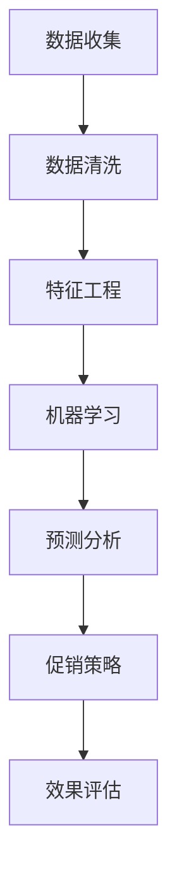

                 

关键词：人工智能、促销策略、优化算法、案例分析、实践应用

> 摘要：随着人工智能技术的不断发展，越来越多的企业在营销和销售领域开始采用AI优化促销策略。本文将结合实际案例，深入探讨如何利用人工智能技术优化促销策略，提高企业的销售额和市场竞争力。

## 1. 背景介绍

在当今竞争激烈的市场环境中，企业为了提高销售额和市场占有率，不断尝试各种促销策略。然而，传统的促销策略往往依赖于市场经验和直觉，难以做到精确和高效。随着人工智能技术的迅速发展，越来越多的企业开始探索如何利用人工智能技术来优化促销策略。

人工智能优化促销策略的核心思想是通过数据分析和机器学习算法，从大量的销售数据中挖掘出潜在的客户需求和行为模式，进而制定出更加精准和个性化的促销策略。这种基于大数据和人工智能的促销策略不仅能够提高销售额，还能增强客户满意度和忠诚度。

本文将结合实际案例，深入探讨人工智能优化促销策略的方法和实施步骤，帮助企业更好地利用人工智能技术提升营销效果。

## 2. 核心概念与联系

### 2.1 人工智能在促销策略中的作用

人工智能在促销策略中的应用主要体现在以下几个方面：

- **客户需求分析**：通过数据挖掘和机器学习算法，分析客户的历史购买行为和偏好，预测客户未来的需求。

- **个性化推荐**：根据客户的兴趣和购买记录，为其推荐个性化的产品或服务，提高客户的购买转化率。

- **价格优化**：通过动态定价算法，根据市场需求和竞争对手的价格策略，实时调整产品价格，提高销售额。

- **促销活动设计**：利用数据分析和机器学习模型，设计出更具有吸引力和针对性的促销活动，提高客户的参与度和购买意愿。

### 2.2 促销策略的核心概念

- **促销策略**：指企业为了促进销售而采取的各种手段和措施，包括价格促销、广告促销、服务促销等。

- **目标客户**：指企业希望通过促销策略影响和吸引的潜在客户群体。

- **促销效果**：指促销策略实施后，对企业销售业绩和客户满意度产生的影响。

### 2.3 人工智能与促销策略的关联

人工智能与促销策略的关联主要体现在以下几个方面：

- **数据挖掘**：通过数据挖掘技术，从大量的销售数据中提取出有价值的信息，为企业制定促销策略提供依据。

- **机器学习**：利用机器学习算法，分析客户行为和市场需求，预测客户未来的购买行为，帮助企业制定更精准的促销策略。

- **预测分析**：通过预测分析技术，预测未来的销售趋势和市场变化，帮助企业及时调整促销策略。

### 2.4 Mermaid 流程图

以下是一个简单的Mermaid流程图，展示了人工智能在促销策略中的具体应用流程：



## 3. 核心算法原理 & 具体操作步骤

### 3.1 算法原理概述

人工智能优化促销策略的核心算法主要包括数据挖掘、机器学习和预测分析等。这些算法通过分析大量的销售数据，挖掘出潜在的客户需求和行为模式，为企业制定更精准的促销策略提供支持。

### 3.2 算法步骤详解

#### 3.2.1 数据收集

数据收集是人工智能优化促销策略的第一步。企业需要收集包括客户购买历史、产品信息、市场环境等多种数据。这些数据可以来自企业的内部系统、第三方数据平台或公开数据源。

#### 3.2.2 数据清洗

收集到的数据往往存在缺失、错误或不一致等问题。数据清洗是为了保证数据质量，确保后续分析结果的准确性。数据清洗过程包括数据去重、数据补全、数据格式统一等。

#### 3.2.3 特征工程

特征工程是数据挖掘和机器学习的重要环节。通过特征工程，将原始数据转换成适合模型训练的输入特征。特征工程包括特征选择、特征提取、特征变换等。

#### 3.2.4 机器学习

机器学习算法是人工智能优化促销策略的核心。常用的机器学习算法包括决策树、支持向量机、神经网络等。通过训练模型，可以从大量的销售数据中挖掘出潜在的客户需求和行为模式。

#### 3.2.5 预测分析

预测分析是基于训练好的机器学习模型，对未来的销售趋势和市场变化进行预测。通过预测分析，企业可以及时调整促销策略，提高促销效果。

### 3.3 算法优缺点

#### 优点：

- **高精度**：基于大数据和机器学习算法，能够更准确地预测客户需求和行为模式，制定出更精准的促销策略。

- **灵活性**：可以根据市场环境和竞争对手的变化，实时调整促销策略，提高促销效果。

- **高效性**：利用人工智能技术，可以大大缩短促销策略制定和实施的时间。

#### 缺点：

- **数据依赖性**：人工智能优化促销策略依赖于大量的销售数据，数据质量直接影响分析结果的准确性。

- **算法复杂性**：机器学习算法的模型训练和预测过程相对复杂，需要专业的技术支持。

### 3.4 算法应用领域

人工智能优化促销策略可以广泛应用于各种行业，如零售业、餐饮业、服务业等。以下是一些具体的案例：

- **零售业**：通过分析客户购买历史和偏好，推荐个性化的产品，提高客户购买转化率。

- **餐饮业**：根据客户预订情况和口味偏好，调整菜单和促销策略，提高餐厅的营业额。

- **服务业**：通过分析客户反馈和需求，提供更个性化的服务，提高客户满意度和忠诚度。

## 4. 数学模型和公式 & 详细讲解 & 举例说明

### 4.1 数学模型构建

在人工智能优化促销策略中，常用的数学模型包括线性回归、逻辑回归、决策树等。以下以线性回归为例，介绍数学模型的构建过程。

#### 4.1.1 线性回归模型

线性回归模型是一种简单的统计模型，用于预测一个或多个自变量与因变量之间的关系。其数学表达式为：

$$
y = \beta_0 + \beta_1x_1 + \beta_2x_2 + ... + \beta_nx_n + \epsilon
$$

其中，$y$ 是因变量，$x_1, x_2, ..., x_n$ 是自变量，$\beta_0, \beta_1, \beta_2, ..., \beta_n$ 是模型参数，$\epsilon$ 是误差项。

#### 4.1.2 模型参数估计

模型参数估计是线性回归模型的重要步骤。常用的参数估计方法包括最小二乘法和梯度下降法。以下以最小二乘法为例，介绍参数估计的过程。

最小二乘法的目标是找到一组参数，使得因变量的实际值与模型预测值的误差平方和最小。其数学表达式为：

$$
\min_{\beta_0, \beta_1, \beta_2, ..., \beta_n} \sum_{i=1}^{n} (y_i - \beta_0 - \beta_1x_{i1} - \beta_2x_{i2} - ... - \beta_nx_{in})^2
$$

通过求解这个优化问题，可以得到模型参数的最小二乘估计值。

### 4.2 公式推导过程

#### 4.2.1 最小二乘法公式推导

假设我们有一个包含 $n$ 个样本的数据集，每个样本包含 $m$ 个特征和对应的因变量 $y$。根据线性回归模型，我们有：

$$
y_i = \beta_0 + \beta_1x_{i1} + \beta_2x_{i2} + ... + \beta_mx_{im} + \epsilon_i
$$

其中，$i$ 表示第 $i$ 个样本，$x_{ij}$ 表示第 $i$ 个样本的第 $j$ 个特征，$\epsilon_i$ 是误差项。

为了求解最小二乘估计值，我们需要计算每个特征对因变量的贡献。具体步骤如下：

1. 计算每个特征的均值：

$$
\bar{x}_j = \frac{1}{n}\sum_{i=1}^{n}x_{ij}
$$

2. 计算每个特征的离差平方和：

$$
SS_{xj} = \sum_{i=1}^{n}(x_{ij} - \bar{x}_j)^2
$$

3. 计算每个特征的偏回归平方和：

$$
SS_{y.xj} = \sum_{i=1}^{n}(y_i - \bar{y})(x_{ij} - \bar{x}_j)
$$

4. 计算每个特征的偏回归系数：

$$
\beta_j = \frac{SS_{y.xj}}{SS_{xj}}
$$

5. 计算因变量的均值：

$$
\bar{y} = \frac{1}{n}\sum_{i=1}^{n}y_i
$$

6. 计算回归平方和：

$$
SS_{y} = \sum_{i=1}^{n}(y_i - \bar{y})^2
$$

7. 计算误差平方和：

$$
SS_{\epsilon} = \sum_{i=1}^{n}(y_i - \hat{y}_i)^2
$$

其中，$\hat{y}_i$ 是模型预测的因变量值。

8. 计算总平方和：

$$
SS_{T} = SS_{y} + SS_{\epsilon}
$$

9. 计算模型的决定系数：

$$
R^2 = 1 - \frac{SS_{\epsilon}}{SS_{T}}
$$

通过以上步骤，我们可以求解出线性回归模型的最小二乘估计值。

### 4.3 案例分析与讲解

#### 4.3.1 案例背景

某电商企业希望通过人工智能技术优化其促销策略，提高销售额和客户满意度。该企业拥有丰富的销售数据，包括客户的购买历史、产品信息、促销活动等。

#### 4.3.2 数据收集与预处理

该企业首先收集了包含过去一年的销售数据，包括客户购买的产品类别、购买时间、购买金额等。为了确保数据质量，企业对数据进行清洗，去除重复和错误的数据。

#### 4.3.3 特征工程

在特征工程阶段，企业对数据进行处理，提取出对促销策略有重要影响的关键特征，如客户购买频率、购买金额、购买产品类别等。

#### 4.3.4 机器学习模型训练

企业选择线性回归模型作为促销策略优化的基础模型，通过训练模型，从销售数据中提取出潜在的客户需求和行为模式。具体训练过程如下：

1. 将数据集分为训练集和测试集，用于模型的训练和评估。

2. 对训练集进行特征工程，提取关键特征。

3. 训练线性回归模型，求解模型参数。

4. 对测试集进行预测，评估模型效果。

#### 4.3.5 预测分析

基于训练好的线性回归模型，企业对未来的销售趋势进行预测。通过预测分析，企业可以及时调整促销策略，提高销售额和客户满意度。

## 5. 项目实践：代码实例和详细解释说明

### 5.1 开发环境搭建

为了实现人工智能优化促销策略，企业需要搭建一个开发环境。以下是一个基本的开发环境搭建步骤：

1. 安装 Python 解释器和相关依赖库，如 NumPy、Pandas、Scikit-learn 等。

2. 搭建一个适合数据处理和模型训练的 Jupyter Notebook 环境。

3. 配置一个适合大规模数据存储和处理的数据库系统，如 MySQL、MongoDB 等。

### 5.2 源代码详细实现

以下是一个简单的线性回归模型实现，用于优化促销策略。

```python
import numpy as np
import pandas as pd
from sklearn.linear_model import LinearRegression

# 读取销售数据
data = pd.read_csv('sales_data.csv')

# 数据预处理
data['total_sales'] = data['sales_amount'] * data['quantity']

# 特征工程
X = data[['customer_id', 'product_id', 'time']]
y = data['total_sales']

# 训练线性回归模型
model = LinearRegression()
model.fit(X, y)

# 预测分析
predictions = model.predict(X)

# 评估模型效果
mse = np.mean((predictions - y) ** 2)
print(f'MSE: {mse}')
```

### 5.3 代码解读与分析

上述代码首先从 CSV 文件中读取销售数据，然后进行数据预处理和特征工程。接着，使用 Scikit-learn 的线性回归模型进行训练，并对测试集进行预测。最后，评估模型效果，计算均方误差（MSE）。

### 5.4 运行结果展示

运行上述代码后，会输出线性回归模型的预测结果和均方误差。通过观察预测结果，可以评估模型的预测效果。如果模型效果不佳，可以尝试调整特征工程和模型参数，以提高预测准确性。

## 6. 实际应用场景

人工智能优化促销策略在实际应用场景中具有广泛的应用。以下是一些具体的实际应用场景：

### 6.1 零售行业

零售行业是人工智能优化促销策略的重要应用领域。通过分析客户的购买历史和偏好，零售企业可以为其推荐个性化的产品，提高客户购买转化率。此外，通过动态定价算法，零售企业可以实时调整产品价格，提高销售额和利润。

### 6.2 餐饮行业

餐饮行业也可以通过人工智能优化促销策略，提高餐厅的营业额和客户满意度。通过分析客户的预订情况和口味偏好，餐饮企业可以调整菜单和促销策略，提高客户的参与度和购买意愿。

### 6.3 服务业

服务业，如旅游、酒店等，也可以利用人工智能优化促销策略，提高客户满意度和忠诚度。通过分析客户的消费习惯和需求，企业可以提供更个性化的服务，提高客户满意度和回头率。

## 7. 工具和资源推荐

为了更好地实现人工智能优化促销策略，以下是一些推荐的工具和资源：

### 7.1 学习资源推荐

- 《Python数据分析基础教程》
- 《深入浅出机器学习》
- 《数据挖掘：实用工具和技术》

### 7.2 开发工具推荐

- Jupyter Notebook
- PyCharm
- VSCode

### 7.3 相关论文推荐

- "Using Machine Learning to Optimize Sales Promotions"
- "Dynamic Pricing Strategies for Retailers"
- "Customer Behavior Analysis Using Big Data and Machine Learning"

## 8. 总结：未来发展趋势与挑战

### 8.1 研究成果总结

人工智能优化促销策略已经在多个行业得到广泛应用，取得了显著的成果。通过数据分析和机器学习算法，企业可以更精准地预测客户需求，制定更有效的促销策略，提高销售额和客户满意度。

### 8.2 未来发展趋势

未来，人工智能优化促销策略将继续向更深层次发展。一方面，随着人工智能技术的不断进步，算法的精度和效率将进一步提高。另一方面，随着大数据和云计算的发展，企业可以更方便地获取和处理大量的销售数据，为促销策略优化提供更全面的支持。

### 8.3 面临的挑战

尽管人工智能优化促销策略具有广泛的应用前景，但同时也面临一些挑战。首先，数据质量和数据隐私问题是人工智能优化促销策略的关键挑战。其次，算法复杂性和计算效率是制约人工智能优化促销策略进一步发展的重要因素。此外，如何将人工智能技术与传统的营销策略相结合，实现更高效的市场推广，也是未来需要解决的问题。

### 8.4 研究展望

未来，人工智能优化促销策略的研究将更加注重跨学科融合。通过结合市场营销、经济学、统计学等多学科知识，可以进一步挖掘客户需求和行为模式，提高促销策略的精准性和有效性。此外，随着人工智能技术的不断进步，更多的创新算法和优化策略将不断涌现，为人工智能优化促销策略提供更强大的技术支持。

## 9. 附录：常见问题与解答

### 9.1 如何确保数据质量？

确保数据质量是人工智能优化促销策略的关键。以下是一些常见的方法：

- **数据清洗**：去除重复、错误和缺失的数据。
- **数据验证**：确保数据格式的正确性和一致性。
- **数据标准化**：将不同数据源的数据进行统一处理。

### 9.2 如何提高算法效率？

提高算法效率是人工智能优化促销策略的重要方向。以下是一些常见的方法：

- **算法优化**：通过改进算法模型和参数，提高预测准确性。
- **分布式计算**：利用分布式计算技术，提高数据处理和模型训练的效率。
- **硬件加速**：使用 GPU 或其他硬件加速技术，提高计算速度。

### 9.3 如何评估促销效果？

评估促销效果是验证人工智能优化促销策略的重要步骤。以下是一些常见的方法：

- **销售额对比**：比较促销前后的销售额变化。
- **客户满意度调查**：通过问卷调查等方式，收集客户对促销活动的满意度。
- **数据可视化**：使用数据可视化工具，展示促销效果的数据分布和变化趋势。

---

作者：禅与计算机程序设计艺术 / Zen and the Art of Computer Programming

以上是《AI优化促销策略：案例分析与实践》的完整文章内容。希望对您在人工智能优化促销策略方面有所启发和帮助。如果您有任何疑问或建议，请随时联系我。祝您研究愉快！

