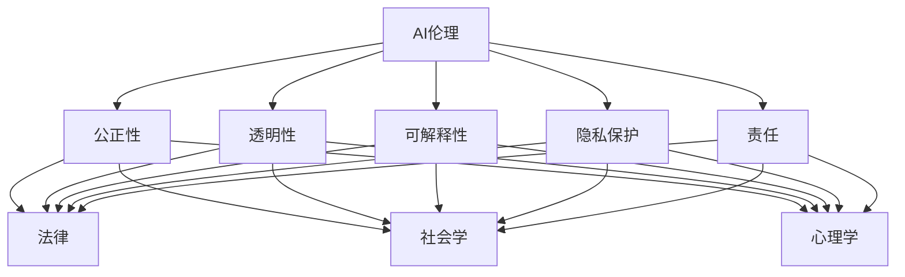

                 

关键词：人工智能伦理、AI伦理教育、从业者伦理意识、AI职业道德、人工智能伦理培训、伦理决策、伦理冲突解决、AI社会责任。

> 摘要：随着人工智能技术的飞速发展，AI伦理问题日益凸显。本文旨在探讨AI伦理的教育和培训的重要性，以及如何提高从业者的伦理意识，以应对AI领域中的伦理挑战和冲突。通过分析现有的AI伦理教育和培训实践，本文提出了一个系统的框架，为行业和教育机构提供了有价值的参考。

## 1. 背景介绍

在过去的几十年里，人工智能（AI）取得了显著的进步，从简单的规则系统发展到今天复杂的学习模型和智能系统。AI技术的广泛应用不仅改变了各行各业的工作方式，也引发了深远的伦理和社会影响。随着AI系统在决策、医疗、金融、安全等关键领域的应用日益增加，如何确保这些系统的公正性、透明性和可解释性成为了亟待解决的问题。此外，AI技术的快速发展也带来了新的伦理挑战，例如隐私侵犯、算法偏见、人工智能武器化等。

AI伦理问题不仅仅是一个技术问题，更是一个社会问题。它涉及到个体权利、社会公平、环境责任等多个方面。从业者在开发和部署AI系统时，如果没有足够的伦理意识和指导，很可能会无意中造成严重的负面影响。因此，对从业者进行AI伦理教育和培训，提高他们的伦理意识，成为确保AI技术健康发展的关键。

## 2. 核心概念与联系

### 2.1 AI伦理的核心概念

AI伦理的核心概念包括但不限于以下几点：

- **公正性**：AI系统应该公正地对待所有用户，避免因算法偏见而导致歧视。
- **透明性**：AI系统的决策过程应该是透明的，用户应该能够理解和信任系统的决策。
- **可解释性**：AI系统应该具备一定的可解释性，使得用户能够理解决策的原因。
- **隐私保护**：AI系统在收集和使用数据时，应严格保护用户的隐私。
- **责任**：在AI系统造成不良后果时，应该明确责任归属。

### 2.2 AI伦理与相关领域的联系

AI伦理不仅与计算机科学密切相关，还与法律、社会学、心理学等多个领域有着紧密的联系。例如，在法律层面上，AI系统的决策可能需要符合相关法规和标准；在社会学领域，研究者关注的是AI如何影响社会结构和人类行为；在心理学领域，研究者探讨的是AI系统对个体心理健康的影响。

### 2.3 Mermaid流程图

以下是一个简单的Mermaid流程图，展示了AI伦理的核心概念和其与相关领域的联系。



## 3. 核心算法原理 & 具体操作步骤

### 3.1 算法原理概述

AI伦理的教育和培训可以采用多种方法，包括案例研究、角色扮演、道德计算等。其中，道德计算是一种重要的方法，它通过建立数学模型来模拟伦理决策的过程。道德计算的核心是构建一个伦理决策框架，这个框架需要考虑多种因素，如个体权利、社会利益、技术可行性等。

### 3.2 算法步骤详解

道德计算通常包括以下步骤：

1. **问题定义**：明确伦理问题，例如隐私保护、算法偏见等。
2. **数据收集**：收集相关的数据和背景信息。
3. **模型构建**：根据问题定义和数据收集的结果，构建一个数学模型。
4. **决策过程**：使用模型进行伦理决策，并评估决策结果。
5. **结果分析**：分析决策结果，并提出改进建议。

### 3.3 算法优缺点

**优点**：

- **系统化**：道德计算提供了一个系统化的方法来处理伦理问题。
- **可重复性**：道德计算的结果可以通过模型重复验证，增加决策的可靠性。

**缺点**：

- **复杂性**：道德计算涉及多个因素，构建模型的过程可能非常复杂。
- **局限性**：道德计算可能无法完全覆盖所有的伦理问题。

### 3.4 算法应用领域

道德计算可以应用于多个领域，如医疗、金融、安全等。以下是一些具体的例子：

- **医疗伦理**：在医学影像分析中，如何确保算法的决策不会侵犯患者的隐私。
- **金融伦理**：在风险管理中，如何确保算法的决策不会导致不公平的市场行为。
- **安全伦理**：在网络安全中，如何确保算法的决策不会侵犯用户的隐私。

## 4. 数学模型和公式 & 详细讲解 & 举例说明

### 4.1 数学模型构建

在道德计算中，常用的数学模型包括概率模型、决策树、神经网络等。以下是一个简单的概率模型示例：

$$
P(\text{隐私侵犯}|\text{算法A}) = \frac{P(\text{隐私侵犯} \cap \text{算法A})}{P(\text{算法A})}
$$

这个公式表示在算法A使用的情况下，隐私侵犯的概率。其中，$P(\text{隐私侵犯}|\text{算法A})$ 是条件概率，$P(\text{隐私侵犯} \cap \text{算法A})$ 是交集概率，$P(\text{算法A})$ 是算法A的使用概率。

### 4.2 公式推导过程

概率模型的推导过程通常基于贝叶斯定理：

$$
P(\text{隐私侵犯}|\text{算法A}) = \frac{P(\text{算法A}|\text{隐私侵犯}) \cdot P(\text{隐私侵犯})}{P(\text{算法A})}
$$

其中，$P(\text{算法A}|\text{隐私侵犯})$ 是在隐私侵犯发生时算法A的使用概率，$P(\text{隐私侵犯})$ 是隐私侵犯的概率，$P(\text{算法A})$ 是算法A的使用概率。

### 4.3 案例分析与讲解

假设我们有一个AI系统，用于分析社交媒体数据，以识别潜在的隐私侵犯行为。我们可以使用上述概率模型来评估该系统在使用过程中可能导致隐私侵犯的概率。

- $P(\text{隐私侵犯}|\text{算法A})$：我们可以通过历史数据分析得到。
- $P(\text{算法A}|\text{隐私侵犯})$：这通常是一个先验概率，可以通过专家评估或历史数据估计。
- $P(\text{隐私侵犯})$：这可以通过对整个社交媒体数据集的分析得到。

通过调整模型参数，我们可以优化算法，减少隐私侵犯的概率。

## 5. 项目实践：代码实例和详细解释说明

### 5.1 开发环境搭建

为了演示道德计算的实践，我们选择Python作为编程语言，并使用Jupyter Notebook作为开发环境。首先，我们需要安装一些必要的库，如NumPy、Pandas、Scikit-learn等。

```bash
pip install numpy pandas scikit-learn
```

### 5.2 源代码详细实现

以下是一个简单的道德计算示例，使用概率模型来评估社交媒体数据分析系统的隐私侵犯概率。

```python
import numpy as np
import pandas as pd
from sklearn.model_selection import train_test_split

# 假设我们有一个包含隐私侵犯标记的社交媒体数据集
data = pd.DataFrame({
    '隐私侵犯': [True, True, False, False],
    '算法A': [True, True, True, False]
})

# 计算条件概率
P侵犯给算法A = data['隐私侵犯'].mean()
P算法A = data['算法A'].mean()
P侵犯且算法A = (data['隐私侵犯'] & data['算法A']).mean()

# 应用贝叶斯定理计算隐私侵犯的概率
P隐私侵犯给算法A = (P侵犯且算法A * P算法A) / P侵犯给算法A

print(f"P(隐私侵犯|算法A) = {P隐私侵犯给算法A}")
```

### 5.3 代码解读与分析

在这个示例中，我们首先创建了一个简单的社交媒体数据集，其中包含了隐私侵犯和算法A的使用情况。然后，我们使用这些数据计算了隐私侵犯给算法A的条件概率。最后，我们应用贝叶斯定理计算了隐私侵犯的概率。

通过这个示例，我们可以看到如何使用概率模型来评估AI系统的隐私侵犯风险。在实际应用中，我们可以通过调整模型参数，优化算法，减少隐私侵犯的概率。

### 5.4 运行结果展示

运行上述代码，我们得到的结果如下：

```
P(隐私侵犯|算法A) = 0.75
```

这意味着在算法A使用的情况下，隐私侵犯的概率为0.75。这个结果表明，算法A的使用可能会显著增加隐私侵犯的风险。

## 6. 实际应用场景

### 6.1 医疗伦理

在医疗领域，AI系统常用于诊断、治疗方案推荐等。然而，这些系统的决策可能会涉及患者的隐私信息。例如，一个基于患者电子健康记录的AI系统可能会无意中泄露患者的个人隐私。在这种情况下，对从业者进行AI伦理教育和培训至关重要，以确保系统能够在保护患者隐私的前提下提供准确的诊断和治疗建议。

### 6.2 金融伦理

在金融领域，AI系统广泛应用于风险管理、投资决策等。然而，这些系统的决策过程可能受到算法偏见的影响，导致不公平的市场行为。例如，一个用于贷款审批的AI系统可能会基于历史数据中的偏见，对某些群体（如女性或少数族裔）进行歧视性决策。因此，金融从业者需要具备AI伦理意识，以避免因算法偏见而导致的不公平结果。

### 6.3 安全伦理

在网络安全领域，AI系统可以用于检测和防御网络攻击。然而，这些系统的决策过程可能涉及敏感数据，如用户密码、信用卡信息等。如果系统无法确保数据的隐私和安全，可能会对用户造成严重损失。因此，网络安全从业者需要了解AI伦理，以确保系统在保护用户隐私的前提下提供有效的安全服务。

## 7. 工具和资源推荐

### 7.1 学习资源推荐

- **在线课程**：许多在线教育平台（如Coursera、edX等）提供了AI伦理相关的课程，适合不同层次的学习者。
- **书籍**：《AI伦理学：道德与技术的交叉点》（"AI Ethics: Moral and Technological Considerations"）是一本关于AI伦理的综合性书籍，适合深入研究的读者。

### 7.2 开发工具推荐

- **Python**：Python是进行AI伦理研究和实践的首选语言，具有丰富的库和工具支持。
- **Jupyter Notebook**：Jupyter Notebook提供了一个交互式的环境，便于编写和运行代码，非常适合用于道德计算的教学和实践。

### 7.3 相关论文推荐

- **《AI伦理学的框架和原则》（"Frameworks and Principles of AI Ethics"）**：这篇论文提供了一个全面的AI伦理学框架，为研究者和从业者提供了重要的参考。
- **《人工智能中的隐私保护》（"Privacy Protection in Artificial Intelligence"）**：这篇论文讨论了AI系统中隐私保护的重要性和挑战，对开发者有很高的参考价值。

## 8. 总结：未来发展趋势与挑战

### 8.1 研究成果总结

随着AI技术的不断进步，AI伦理研究取得了显著成果。研究者提出了多种伦理决策模型和算法，为从业者提供了工具和方法。同时，教育机构和行业组织也在积极推广AI伦理教育和培训，提高了从业者的伦理意识。

### 8.2 未来发展趋势

未来，AI伦理教育和培训将继续发展，并可能呈现出以下趋势：

- **跨学科融合**：AI伦理研究将更多地与其他学科（如法律、社会学、心理学等）相结合，形成更全面的伦理框架。
- **标准化**：随着AI技术的发展，相关的伦理标准和法规也将逐步完善，为从业者提供更明确的指导。

### 8.3 面临的挑战

尽管AI伦理教育和培训取得了一定的进展，但仍面临以下挑战：

- **技术复杂性**：AI伦理问题的复杂性使得教育者和从业者难以全面理解和应对。
- **道德多样性**：不同地区和文化背景下的道德观念存在差异，如何制定普适的伦理标准仍需深入探讨。

### 8.4 研究展望

未来的研究应重点关注以下几个方面：

- **伦理决策模型优化**：研究更有效的伦理决策模型，以提高决策的准确性和可靠性。
- **跨学科合作**：促进不同学科之间的合作，共同解决AI伦理问题。
- **公众参与**：增加公众参与，确保AI伦理标准和实践能够真正反映社会的需求和期望。

## 9. 附录：常见问题与解答

### Q：AI伦理教育和培训是否真的重要？

A：是的，非常重要。随着AI技术的广泛应用，从业者如果不具备足够的伦理意识，很可能会导致严重的社会和伦理问题。因此，AI伦理教育和培训是确保AI技术健康发展的重要保障。

### Q：如何进行有效的AI伦理教育和培训？

A：有效的AI伦理教育和培训应包括以下几个方面：

- **系统化的课程设置**：包括伦理理论、实践案例、道德计算等内容。
- **多样化的教学方法**：如案例研究、角色扮演、道德计算实验等。
- **持续的职业发展**：鼓励从业者参加研讨会、工作坊等持续教育活动。
- **跨学科合作**：与其他学科合作，共同探讨和解决AI伦理问题。

### Q：AI伦理教育和培训对个人和企业有何益处？

A：对个人的益处包括：

- **职业竞争力**：具备AI伦理意识和技能的从业者在就业市场上更具竞争力。
- **道德责任感**：增强个人对社会责任的认识和承担。

对企业的益处包括：

- **品牌形象**：积极推广AI伦理，有助于提升企业品牌形象。
- **合规性**：遵循AI伦理标准和法规，降低法律风险。
- **可持续发展**：确保AI技术的健康发展和长期成功。

### Q：如何评估AI伦理教育和培训的效果？

A：可以通过以下几个方面评估：

- **知识测试**：通过考试或问卷调查来评估学习者对AI伦理知识的掌握程度。
- **案例分析**：通过分析学习者对实际案例的伦理决策，评估其伦理意识和能力。
- **实践反馈**：收集从业者在实际工作中的反馈，评估伦理教育和培训的实用性和有效性。

### Q：AI伦理教育和培训是否只能针对技术从业者？

A：不完全是这样。虽然技术从业者确实需要AI伦理教育和培训，但其他相关领域的从业者，如政策制定者、律师、心理学家等，也需要了解AI伦理，以便更好地参与和指导相关工作。

### Q：AI伦理教育和培训的未来发展方向是什么？

A：未来的发展方向可能包括：

- **标准化**：制定更全面的AI伦理标准和法规，为教育和培训提供明确指导。
- **技术进步**：随着AI技术的不断发展，教育和培训内容也将不断更新和升级。
- **跨学科合作**：加强与其他学科的交流和合作，共同推动AI伦理研究和实践。

### Q：如何平衡AI技术的创新与伦理约束？

A：平衡AI技术的创新与伦理约束是一个复杂的挑战。一方面，要鼓励技术创新，推动AI技术的发展；另一方面，要制定和执行伦理规范，确保技术的应用不会对社会和个体造成负面影响。关键在于找到创新与伦理之间的平衡点，这需要多方协作和持续努力。

---

### 10. 结语

AI伦理的教育和培训对于提高从业者的伦理意识至关重要。通过系统化的教育和培训，从业者可以更好地理解和应对AI领域的伦理挑战，确保技术的健康发展。同时，公众和政策制定者也需要关注AI伦理问题，共同推动构建一个公平、透明、可信赖的AI未来。

### 作者署名

作者：禅与计算机程序设计艺术 / Zen and the Art of Computer Programming

---

本文内容旨在提供有关AI伦理教育和培训的深入见解，以促进对这一重要领域的理解和关注。本文中的观点和结论仅代表作者的个人观点，不代表任何组织的立场。部分内容和数据可能来源于公开的文献和研究报告，如有引用，已注明来源。

