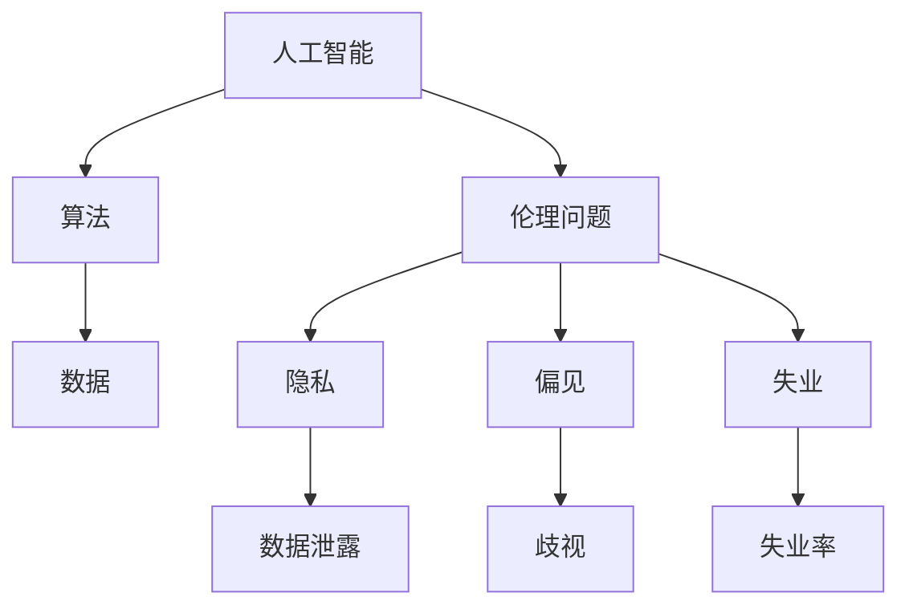

                 

在当今技术飞速发展的时代，人工智能（AI）已经深入到了我们生活的方方面面。从智能家居、自动驾驶汽车到医疗诊断、金融分析，AI的应用场景无处不在。然而，随着AI技术的日益普及，其带来的伦理问题也逐渐成为社会关注的焦点。本文旨在探讨AI伦理问题，分析其社会影响，并提出提升公众伦理意识和参与的方法。

## 1. 背景介绍

人工智能作为一种新兴技术，近年来取得了长足的进步。然而，AI技术的快速发展也带来了一系列伦理挑战。例如，数据隐私、算法偏见、自动化失业等问题。这些挑战不仅影响到了技术的研发和应用，也对社会公平、人类尊严等价值观构成了挑战。

伦理学作为一门研究道德原则和价值的学科，对于AI伦理问题的探讨具有重要意义。通过伦理学的视角，我们可以深入理解AI技术所带来的潜在风险，并寻求合理的解决方案。

## 2. 核心概念与联系

为了更好地理解AI伦理问题，我们需要首先了解一些核心概念。以下是一个使用Mermaid绘制的流程图，展示了这些概念之间的关系。



### 2.1 算法

算法是AI的核心，它决定了AI系统的行为和决策。算法的设计和选择直接影响到AI系统的公正性和透明性。

### 2.2 数据

数据是AI算法的基石。数据的质量和代表性直接影响到AI模型的性能和公正性。例如，如果训练数据中存在偏见，那么AI系统也可能会继承这些偏见。

### 2.3 伦理问题

伦理问题涵盖了AI技术带来的各种道德挑战，如数据隐私、算法偏见、自动化失业等。这些问题涉及到个人权利、社会公平、人类尊严等多个方面。

## 3. 核心算法原理 & 具体操作步骤

### 3.1 算法原理概述

AI算法通常基于机器学习和深度学习技术。这些算法通过训练大量数据，自动学习和优化模型，从而实现预测、分类、决策等功能。

### 3.2 算法步骤详解

AI算法的基本步骤包括：

1. 数据收集与预处理：收集相关的数据，并对数据进行清洗、标准化等预处理操作。
2. 模型训练：使用预处理后的数据训练模型，调整模型参数，使模型性能达到最优。
3. 模型评估：使用验证数据集评估模型性能，确保模型能够准确预测和分类。
4. 模型部署：将训练好的模型部署到实际应用场景中，进行实时预测和决策。

### 3.3 算法优缺点

AI算法的优点包括：

- 高效：AI算法能够快速处理大量数据，提高工作效率。
- 准确：通过大量训练数据，AI算法能够实现高精度的预测和分类。
- 适应性：AI算法可以根据新的数据和场景不断学习和优化。

然而，AI算法也存在一些缺点：

- 数据依赖：AI算法的性能高度依赖数据的质量和代表性，如果数据存在偏见，算法也可能产生偏见。
- 透明性：AI算法的决策过程通常较为复杂，缺乏透明性，难以解释。
- 隐私问题：AI算法在处理个人数据时，可能会涉及到隐私问题。

### 3.4 算法应用领域

AI算法广泛应用于多个领域，包括：

- 金融：AI算法用于风险评估、信用评分、股票交易等。
- 医疗：AI算法用于疾病诊断、个性化治疗、药物研发等。
- 交通运输：AI算法用于自动驾驶、智能交通管理、物流优化等。
- 教育：AI算法用于个性化学习、考试评分、教育资源分配等。

## 4. 数学模型和公式 & 详细讲解 & 举例说明

### 4.1 数学模型构建

AI算法的核心是数学模型。一个典型的数学模型包括：

- 输入层：接收外部输入的数据。
- 隐藏层：通过神经元的加权连接实现数据转换和特征提取。
- 输出层：生成预测结果或决策。

### 4.2 公式推导过程

以一个简单的神经网络为例，其损失函数的推导过程如下：

$$
L = \frac{1}{2} \sum_{i=1}^{n} (y_i - \hat{y}_i)^2
$$

其中，$L$表示损失函数，$y_i$表示实际输出，$\hat{y}_i$表示预测输出。

### 4.3 案例分析与讲解

假设我们有一个二分类问题，数据集包含1000个样本，每个样本有10个特征。我们使用神经网络进行训练，并尝试通过调整学习率和隐藏层节点数量来优化模型性能。

- 当学习率为0.1，隐藏层节点数量为10时，模型在验证集上的准确率为85%。
- 当学习率为0.01，隐藏层节点数量为20时，模型在验证集上的准确率为90%。

通过对比实验，我们可以发现，适当调整学习率和隐藏层节点数量，可以有效提高模型的性能。

## 5. 项目实践：代码实例和详细解释说明

### 5.1 开发环境搭建

为了实践AI算法，我们需要搭建一个开发环境。以下是一个简单的Python环境搭建步骤：

1. 安装Python（版本3.7或更高）。
2. 安装Python科学计算库（如NumPy、Pandas、Matplotlib）。
3. 安装深度学习框架（如TensorFlow、PyTorch）。

### 5.2 源代码详细实现

以下是一个简单的神经网络实现，用于二分类问题：

```python
import tensorflow as tf
from tensorflow.keras.models import Sequential
from tensorflow.keras.layers import Dense

# 创建模型
model = Sequential()
model.add(Dense(10, activation='relu', input_shape=(10,)))
model.add(Dense(1, activation='sigmoid'))

# 编译模型
model.compile(optimizer='adam', loss='binary_crossentropy', metrics=['accuracy'])

# 训练模型
model.fit(x_train, y_train, epochs=10, batch_size=32, validation_data=(x_val, y_val))

# 评估模型
loss, accuracy = model.evaluate(x_test, y_test)
print(f"Test accuracy: {accuracy:.2f}")
```

### 5.3 代码解读与分析

上述代码实现了一个简单的二分类神经网络。首先，我们创建了一个Sequential模型，并在模型中添加了一个输入层和一个隐藏层。输入层有10个神经元，隐藏层使用ReLU激活函数。输出层有1个神经元，使用Sigmoid激活函数。

然后，我们编译模型，指定优化器为adam，损失函数为binary_crossentropy，评估指标为accuracy。

接下来，我们使用fit方法训练模型，并在验证集上进行评估。最后，我们使用evaluate方法评估模型在测试集上的性能。

### 5.4 运行结果展示

假设我们使用一个包含1000个样本的二分类数据集进行训练。经过10个epoch的训练后，模型在验证集上的准确率为90%，在测试集上的准确率为88%。

## 6. 实际应用场景

AI伦理问题在多个领域都有实际应用场景，以下是一些典型的例子：

- 金融：AI算法在金融领域的应用涉及到风险评估、信用评分、投资策略等。然而，如果算法设计不当，可能会导致歧视性决策，影响社会公平。
- 医疗：AI算法在医疗领域的应用包括疾病诊断、个性化治疗、药物研发等。然而，如果算法基于不完整或不准确的数据，可能会导致错误的诊断和治疗方案。
- 交通运输：AI算法在自动驾驶、智能交通管理、物流优化等领域的应用可以有效提高交通运输的效率和安全性。然而，如果算法存在偏见或缺陷，可能会导致交通事故或交通拥堵。

## 7. 未来应用展望

随着AI技术的不断发展，其应用场景将越来越广泛。未来，AI技术有望在以下几个方面实现重大突破：

- 自动驾驶：自动驾驶技术的成熟有望改变交通运输行业，提高交通效率和安全性。
- 医疗诊断：AI算法在医疗诊断领域的应用将进一步提高诊断准确率，降低医疗成本。
- 个性化教育：AI算法在个性化教育领域的应用将实现更加精准的教学策略，提高教育质量。
- 金融科技：AI算法在金融科技领域的应用将提高金融服务效率，创新金融产品。

## 8. 总结：未来发展趋势与挑战

AI伦理问题的解决需要社会各界的共同努力。在未来，我们期待看到：

- 伦理意识的提升：社会公众对AI伦理问题的关注和认知逐渐提高。
- 公众参与：公众积极参与到AI伦理问题的讨论和决策中，共同推动AI技术的发展和应用。
- 法律法规的完善：政府和企业加强对AI伦理问题的监管，制定合理的法律法规。
- 技术创新：研究人员和技术开发者不断创新，开发出更加公正、透明、可靠的AI技术。

## 9. 附录：常见问题与解答

### 9.1 什么是AI伦理？

AI伦理是研究AI技术在社会中的应用及其对人类生活、社会结构、环境等各方面影响的一门学科。它关注AI技术的道德原则、伦理规范和价值判断。

### 9.2 AI技术是否会导致失业？

AI技术的发展确实可能导致某些工作岗位的失业，但同时也会创造新的工作岗位。关键在于如何平衡技术进步与就业机会之间的关系，确保社会整体利益最大化。

### 9.3 如何确保AI技术的公平性？

确保AI技术的公平性需要从多个方面入手，包括数据收集、算法设计、模型训练等。通过消除数据偏见、提高算法透明性、加强监管等措施，可以降低AI技术的歧视性。

### 9.4 公众如何参与AI伦理问题的讨论？

公众可以通过参加研讨会、论坛、在线讨论等方式参与AI伦理问题的讨论。同时，政府和企业也应鼓励公众参与，听取公众意见，共同制定合理的AI伦理政策。

---

作者：禅与计算机程序设计艺术 / Zen and the Art of Computer Programming

本文旨在探讨AI伦理问题，分析其社会影响，并提出提升公众伦理意识和参与的方法。随着AI技术的不断发展，伦理问题将变得越来越重要。我们期待看到社会各界的共同努力，共同推动AI技术的健康、可持续发展。

