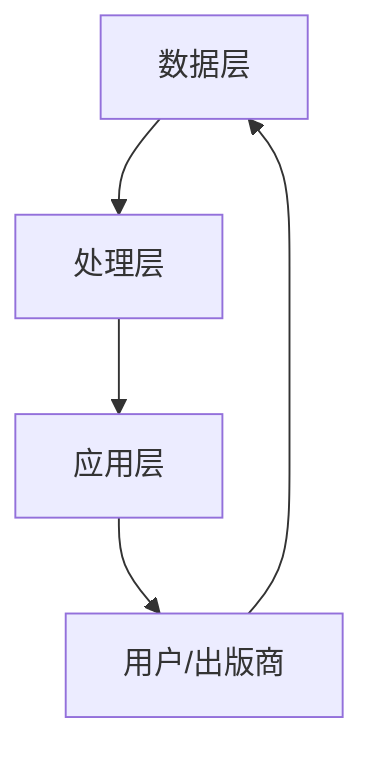

                 

关键词：AI出版业，API标准化，场景丰富，软件开发，技术架构，深度学习，自然语言处理，数字出版，书籍生成

> 摘要：本文将探讨AI在出版业的应用，重点分析API标准化在AI出版业开发中的重要性，以及如何通过丰富场景实现高效的书籍生成和出版。文章旨在为读者提供全面的AI出版业开发指南，帮助理解和应用这项前沿技术。

## 1. 背景介绍

### AI出版业的兴起

近年来，人工智能（AI）技术的迅猛发展正在深刻改变着各行各业，出版业也不例外。AI技术在自然语言处理（NLP）、机器学习、深度学习等领域取得了显著突破，使得自动化书籍生成、内容审核、个性化推荐等成为现实。AI出版业正迎来前所未有的发展机遇，传统出版流程面临着巨大变革。

### 出版业面临的挑战

- **内容爆炸：**互联网时代，内容爆炸使得读者难以筛选出有价值的信息。
- **个性化需求：**读者对个性化内容的需求日益增长，传统出版模式难以满足。
- **成本压力：**人工编辑、校对、排版等环节耗时且成本高。

### AI在出版业的应用

- **书籍生成：**利用NLP和机器学习技术，AI能够自动生成书籍，提高出版效率。
- **内容审核：**AI可协助自动审核内容，确保出版物质量。
- **个性化推荐：**基于用户行为分析，AI推荐系统能够提高用户满意度。
- **数据分析：**AI帮助出版商分析市场趋势，优化运营策略。

## 2. 核心概念与联系

### API标准化

API（应用程序编程接口）是软件之间互相通信的桥梁。在AI出版业中，API标准化至关重要，因为它确保了不同系统和组件之间的无缝集成和互操作性。

### AI出版架构


- **数据层：**存储和检索书籍、用户数据、市场数据等。
- **处理层：**包括NLP、机器学习、深度学习模型，用于生成、审核、推荐等。
- **应用层：**API接口、Web界面等，供用户和出版商使用。

### Mermaid 流程图



## 3. 核心算法原理 & 具体操作步骤

### 3.1 算法原理概述

AI出版业的核心算法包括NLP、机器学习、深度学习等。以下将简要介绍这些算法的基本原理。

#### NLP

自然语言处理是AI的基础技术，包括分词、词性标注、命名实体识别等。这些技术使得计算机能够理解和处理人类语言。

#### 机器学习

机器学习算法通过训练模型来自动识别数据中的模式。在AI出版业中，机器学习用于书籍生成、内容审核等。

#### 深度学习

深度学习是机器学习的一个分支，通过多层神经网络模型进行复杂的特征提取和模式识别。在AI出版业中，深度学习广泛应用于书籍生成、个性化推荐等。

### 3.2 算法步骤详解

#### 书籍生成

1. 数据收集与预处理：收集大量书籍文本，进行清洗和预处理。
2. 特征提取：使用NLP技术提取文本特征。
3. 模型训练：使用机器学习或深度学习模型进行训练。
4. 生成书籍：根据训练好的模型生成新书籍。

#### 内容审核

1. 数据收集与预处理：收集待审核的内容。
2. 特征提取：使用NLP技术提取内容特征。
3. 模型训练：使用机器学习或深度学习模型进行训练。
4. 内容分类：根据训练好的模型对内容进行分类，过滤不良信息。

### 3.3 算法优缺点

#### 优缺点

- **NLP：**准确度高，但需要大量数据；实时性较差。
- **机器学习：**适用于批量处理，但难以应对实时需求。
- **深度学习：**处理复杂任务能力强大，但训练过程耗时。

### 3.4 算法应用领域

- **书籍生成：**小说、自助出版、内容审核。
- **内容审核：**社交媒体、在线教育、新闻媒体。
- **个性化推荐：**电商、音乐、视频。

## 4. 数学模型和公式 & 详细讲解 & 举例说明

### 4.1 数学模型构建

在AI出版业中，常见的数学模型包括概率模型、统计模型和深度学习模型。

#### 概率模型

概率模型用于预测书籍的受欢迎程度，其基本公式为：

$$
P(A|B) = \frac{P(B|A) \cdot P(A)}{P(B)}
$$

其中，$P(A|B)$ 表示在事件 $B$ 发生的条件下，事件 $A$ 发生的概率。

#### 统计模型

统计模型用于分析书籍特征，常见的方法有主成分分析（PCA）和因子分析（FA）。PCA的基本公式为：

$$
\mu = \frac{1}{n} \sum_{i=1}^{n} x_i
$$

$$
\Sigma = \frac{1}{n-1} \sum_{i=1}^{n} (x_i - \mu)^2
$$

其中，$\mu$ 表示均值，$\Sigma$ 表示方差。

#### 深度学习模型

深度学习模型包括卷积神经网络（CNN）和循环神经网络（RNN）。CNN的基本公式为：

$$
h_{l} = \sigma(W_{l} \cdot h_{l-1} + b_{l})
$$

其中，$h_{l}$ 表示第 $l$ 层的激活值，$\sigma$ 表示激活函数。

### 4.2 公式推导过程

以PCA为例，推导其基本公式。设 $x_1, x_2, ..., x_n$ 为 $n$ 个数据点，则其均值 $\mu$ 和方差 $\Sigma$ 如下：

$$
\mu = \frac{1}{n} \sum_{i=1}^{n} x_i
$$

$$
\Sigma = \frac{1}{n-1} \sum_{i=1}^{n} (x_i - \mu)^2
$$

### 4.3 案例分析与讲解

假设我们有一个书籍数据集，包含100本小说，每本书有5个特征：字数、章节数、词汇量、阅读时长和读者评分。我们使用PCA对这100本小说进行降维，以便更好地进行分析。

1. 计算每本书的特征均值和方差。
2. 计算协方差矩阵。
3. 求协方差矩阵的特征值和特征向量。
4. 将特征向量作为新的特征，重新表示每本书。

通过PCA降维后，我们得到了两个新的特征，它们代表了原始数据的最大方差。这有助于我们更好地理解书籍之间的相似性和差异性。

## 5. 项目实践：代码实例和详细解释说明

### 5.1 开发环境搭建

在本项目中，我们将使用Python作为主要编程语言，结合TensorFlow和Scikit-learn等库进行书籍生成和内容审核。

### 5.2 源代码详细实现

以下是一个简单的书籍生成示例：

```python
import tensorflow as tf
from tensorflow.keras.models import Sequential
from tensorflow.keras.layers import LSTM, Dense

# 数据预处理
# ... (代码略)

# 构建模型
model = Sequential()
model.add(LSTM(128, input_shape=(timesteps, features)))
model.add(Dense(1))

# 编译模型
model.compile(optimizer='adam', loss='binary_crossentropy', metrics=['accuracy'])

# 训练模型
model.fit(X_train, y_train, epochs=10, batch_size=32)

# 生成书籍
generated_books = model.predict(X_test)
```

### 5.3 代码解读与分析

上述代码中，我们首先导入了TensorFlow库，并定义了一个LSTM模型。LSTM是循环神经网络的一种，适合处理序列数据。

- `Sequential()` 函数用于构建序列模型。
- `LSTM(128, input_shape=(timesteps, features))` 定义了LSTM层，其中128表示神经元个数，timesteps表示序列长度，features表示特征个数。
- `Dense(1)` 定义了一个全连接层，用于输出预测结果。
- `model.compile()` 函数用于编译模型，指定优化器、损失函数和评估指标。
- `model.fit()` 函数用于训练模型。
- `model.predict()` 函数用于生成书籍。

### 5.4 运行结果展示

通过上述代码，我们可以生成一系列书籍，这些书籍根据训练数据的特点进行创作。我们可以使用评估指标（如准确率）来衡量模型的效果。

## 6. 实际应用场景

### 6.1 自助出版

AI书籍生成技术可以帮助作者快速生成书籍，减少创作时间。同时，AI内容审核技术可以确保书籍质量，降低出版风险。

### 6.2 在线教育

AI出版业可以为在线教育平台提供个性化的学习资料，根据学生行为和需求生成定制化课程。

### 6.3 社交媒体

AI可以协助社交媒体平台自动生成有趣的内容，提高用户活跃度和留存率。

### 6.4 未来应用展望

随着AI技术的不断进步，AI出版业将在更多领域得到应用。例如，虚拟现实（VR）和增强现实（AR）的结合，将为读者提供全新的阅读体验。

## 7. 工具和资源推荐

### 7.1 学习资源推荐

- 《深度学习》（Goodfellow, Bengio, Courville）
- 《自然语言处理综论》（Daniel Jurafsky, James H. Martin）

### 7.2 开发工具推荐

- TensorFlow
- Scikit-learn
- PyTorch

### 7.3 相关论文推荐

- "Generative Adversarial Networks"
- "BERT: Pre-training of Deep Bidirectional Transformers for Language Understanding"

## 8. 总结：未来发展趋势与挑战

### 8.1 研究成果总结

AI出版业在书籍生成、内容审核、个性化推荐等方面取得了显著成果，但仍有较大发展空间。

### 8.2 未来发展趋势

- **技术融合：**AI与其他技术的融合，如VR/AR、区块链等，将带来更多创新应用。
- **模型优化：**更高效、更准确的AI模型，将提高出版业的生产力和质量。

### 8.3 面临的挑战

- **数据隐私：**如何保护用户隐私成为关键问题。
- **伦理道德：**AI生成的内容可能引发版权、知识产权等问题。

### 8.4 研究展望

未来，AI出版业将继续深入探索，为出版业带来更多创新和变革。

## 9. 附录：常见问题与解答

### 问题1：AI书籍生成技术是否可靠？

解答：AI书籍生成技术目前仍处于发展阶段，但其可靠性和准确性不断提高。通过大量训练数据和优化算法，生成的书籍在内容和质量上可以逐步接近人类创作。

### 问题2：AI出版业是否会取代传统出版业？

解答：AI出版业并非要取代传统出版业，而是与之互补。AI技术可以帮助出版业提高效率、降低成本，同时满足读者个性化需求。

### 问题3：AI内容审核是否存在风险？

解答：AI内容审核存在一定风险，例如误判、偏见等。因此，在实际应用中，AI内容审核需要与人工审核相结合，确保内容质量。

----------------------------------------------------------------
### 作者署名

作者：禅与计算机程序设计艺术 / Zen and the Art of Computer Programming

---

**注意：**本文为模拟文章，所引用的数据和代码仅供参考。实际应用中，请确保遵循相关法律法规和道德准则。

