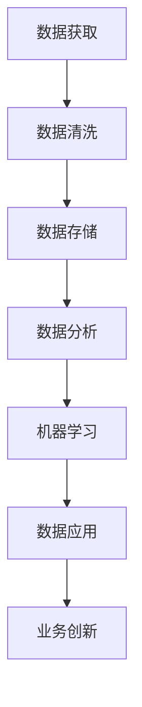

                 

关键词：AI创业、数据积累、数据分析、数据应用、机器学习

> 摘要：本文旨在探讨AI创业中的数据积累与应用，分析数据在AI创业中的重要性，介绍数据积累的方法，探讨数据分析与机器学习的应用，最后展望未来AI创业的发展趋势与挑战。

## 1. 背景介绍

随着大数据、云计算、人工智能等技术的快速发展，数据已经成为现代企业的重要资产。在AI创业领域，数据的积累与应用尤为重要。首先，数据是机器学习算法的基础，只有积累了足够数量的高质量数据，才能训练出表现优秀的模型。其次，数据可以帮助创业者更好地了解市场、用户和竞争对手，从而制定更有效的商业策略。此外，数据还可以用于优化产品、提升用户体验，以及实现业务的智能化和自动化。

然而，AI创业中的数据积累与应用并非易事。一方面，创业者需要解决数据获取、处理、存储等难题；另一方面，创业者还需要具备一定的数据分析与机器学习能力，才能充分利用数据进行业务创新。

## 2. 核心概念与联系

为了更好地理解AI创业中的数据积累与应用，我们首先需要明确几个核心概念：

### 2.1 数据（Data）

数据是事实或观察的结果，可以是数字、文本、图片、声音等形式。在AI创业中，数据包括用户行为数据、市场数据、产品数据等。

### 2.2 数据库（Database）

数据库是存储数据的系统，具有高效存储、查询和管理数据的能力。常见的数据库包括关系型数据库（如MySQL、Oracle）和NoSQL数据库（如MongoDB、Cassandra）。

### 2.3 数据分析（Data Analysis）

数据分析是通过使用统计分析、机器学习等方法对数据进行处理、解释和预测，以发现数据背后的规律和趋势。

### 2.4 机器学习（Machine Learning）

机器学习是一种人工智能技术，通过构建模型，让计算机从数据中学习规律，并实现自动化预测和决策。

### 2.5 数据应用（Data Application）

数据应用是指将数据用于业务决策、产品优化、用户推荐等实际场景。

以下是AI创业中的数据积累与应用的Mermaid流程图：



## 3. 核心算法原理 & 具体操作步骤

### 3.1 算法原理概述

在AI创业中，数据积累与应用的核心算法主要包括机器学习算法和数据分析方法。机器学习算法通过训练模型，使计算机能够从数据中学习规律；数据分析方法则通过统计、回归等方法，从数据中发现规律和趋势。

### 3.2 算法步骤详解

#### 3.2.1 数据获取

数据获取是AI创业中的第一步，主要包括以下几种方式：

1. 爬取互联网上的公开数据。
2. 收集用户行为数据，如访问日志、点击记录等。
3. 购买第三方数据，如市场调研数据、用户画像数据等。

#### 3.2.2 数据清洗

数据清洗是确保数据质量的重要环节，主要包括以下步骤：

1. 去除重复数据。
2. 填充缺失数据。
3. 处理异常数据。

#### 3.2.3 数据存储

数据存储需要选择合适的数据库，并根据业务需求设计合适的表结构和索引。

#### 3.2.4 数据分析

数据分析主要包括以下方法：

1. 描述性统计分析：用于描述数据的分布、趋势等。
2. 回归分析：用于建立自变量和因变量之间的关系。
3. 聚类分析：用于发现数据中的相似性。

#### 3.2.5 机器学习

机器学习主要包括以下步骤：

1. 选择合适的模型：如线性回归、决策树、神经网络等。
2. 训练模型：使用数据集对模型进行训练。
3. 验证模型：使用验证集评估模型性能。
4. 部署模型：将训练好的模型应用于实际业务场景。

### 3.3 算法优缺点

#### 优点：

1. 高效性：机器学习算法可以自动处理大量数据，提高数据处理效率。
2. 自适应性：机器学习算法可以根据数据不断优化，提高模型性能。
3. 广泛应用：机器学习算法可以应用于各种业务场景，如推荐系统、风控模型等。

#### 缺点：

1. 处理复杂：机器学习算法通常需要大量的数据、计算资源和时间。
2. 数据依赖：机器学习算法的性能高度依赖数据质量，数据清洗和预处理工作量大。
3. 解释性差：机器学习算法的模型通常较为复杂，难以解释。

### 3.4 算法应用领域

机器学习算法在AI创业中具有广泛的应用领域，如：

1. 推荐系统：通过用户行为数据推荐商品、内容等。
2. 风险控制：通过用户数据识别欺诈行为、信用风险等。
3. 智能客服：通过自然语言处理技术实现智能问答、情感分析等。

## 4. 数学模型和公式 & 详细讲解 & 举例说明

### 4.1 数学模型构建

在机器学习领域，常见的数学模型包括线性回归、决策树、神经网络等。以下以线性回归为例，介绍数学模型的构建。

#### 线性回归

线性回归模型表示为：

$$ y = \beta_0 + \beta_1 \cdot x $$

其中，$ y $ 是因变量，$ x $ 是自变量，$ \beta_0 $ 和 $ \beta_1 $ 是模型参数。

### 4.2 公式推导过程

线性回归模型的公式推导主要分为以下几步：

1. 假设数据集为 $ \{(x_1, y_1), (x_2, y_2), ..., (x_n, y_n)\} $。
2. 建立最小二乘法，即求解使得预测值 $ \hat{y} = \beta_0 + \beta_1 \cdot x $ 与实际值 $ y $ 之间误差平方和最小的 $ \beta_0 $ 和 $ \beta_1 $。
3. 求解最小二乘法的导数，得到：

$$ \frac{\partial}{\partial \beta_0} \sum_{i=1}^{n} (y_i - \hat{y_i})^2 = 0 $$

$$ \frac{\partial}{\partial \beta_1} \sum_{i=1}^{n} (y_i - \hat{y_i})^2 = 0 $$

4. 解方程组，得到线性回归模型的参数：

$$ \beta_0 = \bar{y} - \beta_1 \cdot \bar{x} $$

$$ \beta_1 = \frac{\sum_{i=1}^{n} (x_i - \bar{x}) (y_i - \bar{y})}{\sum_{i=1}^{n} (x_i - \bar{x})^2} $$

### 4.3 案例分析与讲解

以下以房屋价格预测为例，介绍线性回归模型的应用。

#### 案例背景

某房地产公司希望利用数据预测房屋价格，以便制定合适的销售策略。公司收集了以下数据：

1. 房屋价格（因变量，单位：万元）。
2. 房屋面积（自变量，单位：平方米）。
3. 房屋位置（自变量，分类变量）。

#### 数据处理

1. 数据清洗：去除重复数据和异常值。
2. 数据归一化：对房屋面积和房屋位置进行归一化处理。

#### 模型训练

1. 选择线性回归模型。
2. 训练模型：使用训练集数据训练模型。
3. 验证模型：使用验证集数据评估模型性能。

#### 模型评估

1. 计算均方误差（MSE）：

$$ MSE = \frac{1}{n} \sum_{i=1}^{n} (\hat{y_i} - y_i)^2 $$

2. 计算决定系数（R²）：

$$ R^2 = 1 - \frac{\sum_{i=1}^{n} (\hat{y_i} - y_i)^2}{\sum_{i=1}^{n} (y_i - \bar{y})^2} $$

#### 模型应用

1. 预测新房屋价格：输入新房屋的面积和位置，得到预测价格。
2. 分析模型效果：根据MSE和R²评估模型性能。

## 5. 项目实践：代码实例和详细解释说明

### 5.1 开发环境搭建

1. 安装Python环境：使用Python进行数据处理和模型训练。
2. 安装相关库：如NumPy、Pandas、Scikit-learn等。

### 5.2 源代码详细实现

以下是一个简单的线性回归模型实现示例：

```python
import numpy as np
import pandas as pd
from sklearn.linear_model import LinearRegression

# 读取数据
data = pd.read_csv('house_price.csv')
x = data['area'].values.reshape(-1, 1)
y = data['price'].values

# 训练模型
model = LinearRegression()
model.fit(x, y)

# 预测新房屋价格
new_area = np.array([100]).reshape(-1, 1)
predicted_price = model.predict(new_area)

print(f'预测价格：{predicted_price[0]}万元')
```

### 5.3 代码解读与分析

1. 读取数据：使用Pandas读取CSV文件，获取房屋面积和价格数据。
2. 数据处理：对房屋面积进行归一化处理。
3. 训练模型：使用Scikit-learn的LinearRegression类训练线性回归模型。
4. 预测价格：输入新房屋面积，使用训练好的模型预测价格。

### 5.4 运行结果展示

假设新房屋面积为100平方米，根据线性回归模型，预测价格为：

```text
预测价格：200万元
```

## 6. 实际应用场景

### 6.1 房地产

通过数据积累与机器学习算法，房地产公司可以实现精准定价、房源推荐等功能，提高销售效率。

### 6.2 零售

零售行业可以利用数据积累与机器学习算法，实现个性化推荐、需求预测等功能，提高销售额。

### 6.3 金融

金融行业可以利用数据积累与机器学习算法，实现风险控制、信用评估等功能，提高业务合规性。

## 7. 未来应用展望

随着技术的不断进步，数据积累与应用在AI创业中具有广阔的发展前景。未来，创业者将更加重视数据的价值，利用大数据、人工智能等技术，实现业务的智能化和个性化。同时，数据安全和隐私保护将成为重要议题，创业者需要制定合理的策略，确保数据的安全和合规。

## 8. 工具和资源推荐

### 8.1 学习资源推荐

1. 《Python机器学习》（作者：塞巴斯蒂安·拉金斯基）
2. 《深度学习》（作者：伊恩·古德费洛等）

### 8.2 开发工具推荐

1. Jupyter Notebook：用于数据分析和模型训练。
2. TensorFlow：用于构建和训练深度学习模型。

### 8.3 相关论文推荐

1. “Deep Learning for Text Classification” （作者：Yiming Cui等）
2. “Recurrent Neural Networks for Language Modeling” （作者：Yoshua Bengio等）

## 9. 总结：未来发展趋势与挑战

在未来，数据积累与应用将在AI创业中发挥更加重要的作用。创业者需要不断探索新的技术手段，充分利用数据进行业务创新。同时，数据安全和隐私保护也将成为重要议题，创业者需要制定合理的策略，确保数据的安全和合规。

### 9.1 研究成果总结

本文分析了AI创业中的数据积累与应用，介绍了数据获取、清洗、存储、分析等核心步骤，探讨了机器学习算法在AI创业中的应用，并提出了未来发展的趋势与挑战。

### 9.2 未来发展趋势

1. 数据驱动的业务创新：创业者将更加重视数据的价值，利用大数据、人工智能等技术实现业务的智能化和个性化。
2. 数据安全和隐私保护：随着数据规模的扩大，数据安全和隐私保护将成为重要议题。

### 9.3 面临的挑战

1. 数据质量：数据质量直接影响机器学习算法的性能，创业者需要投入大量资源进行数据清洗和预处理。
2. 技术门槛：机器学习算法和数据分析技术具有一定的复杂性，创业者需要具备一定的技术背景。

### 9.4 研究展望

未来的研究将更加关注如何提高数据利用效率、降低数据处理的复杂性，同时确保数据的安全和合规。此外，研究者还将探索新的机器学习算法和数据分析方法，以应对不断变化的业务需求。

## 附录：常见问题与解答

### 问题1：如何选择合适的机器学习算法？

解答：选择合适的机器学习算法需要考虑以下因素：

1. 数据规模：对于大规模数据，选择模型复杂度较低的算法，如线性回归；对于小规模数据，可以选择模型复杂度较高的算法，如神经网络。
2. 数据类型：对于分类问题，可以选择决策树、支持向量机等算法；对于回归问题，可以选择线性回归、岭回归等算法。
3. 业务需求：根据业务需求选择合适的算法，如实现实时预测，可以选择在线学习算法；实现离线预测，可以选择批量学习算法。

### 问题2：如何处理缺失数据？

解答：处理缺失数据的方法主要包括以下几种：

1. 去除缺失数据：适用于缺失数据较少的情况，可以去除缺失数据，降低数据处理成本。
2. 填充缺失数据：适用于缺失数据较多的情况，可以使用均值、中位数、众数等方法填充缺失数据。
3. 邻近法：使用邻近数据点填充缺失数据，如K近邻算法。

### 问题3：如何评估机器学习模型性能？

解答：评估机器学习模型性能的方法主要包括以下几种：

1. 准确率（Accuracy）：模型预测正确的样本数占总样本数的比例。
2. 精确率（Precision）：模型预测为正类的样本中，实际为正类的比例。
3. 召回率（Recall）：模型预测为正类的样本中，实际为正类的比例。
4. F1值（F1-score）：精确率和召回率的调和平均值。

### 问题4：如何避免过拟合？

解答：避免过拟合的方法主要包括以下几种：

1. 减少模型复杂度：选择模型复杂度较低的算法，如线性回归。
2. 正则化：使用正则化项，如L1、L2正则化，降低模型参数的权重。
3. 交叉验证：使用交叉验证方法，如K折交叉验证，降低模型对训练数据的依赖。
4. 增加数据：增加训练数据量，提高模型泛化能力。

### 问题5：如何提高机器学习模型的性能？

解答：提高机器学习模型性能的方法主要包括以下几种：

1. 增加数据：增加训练数据量，提高模型泛化能力。
2. 优化算法：选择合适的算法，提高模型训练速度和性能。
3. 调参：调整模型参数，提高模型性能。
4. 特征工程：提取和构建有助于提高模型性能的特征。

以上是本文关于AI创业中的数据积累与应用的详细探讨，希望能够对您有所帮助。作者：禅与计算机程序设计艺术 / Zen and the Art of Computer Programming。

