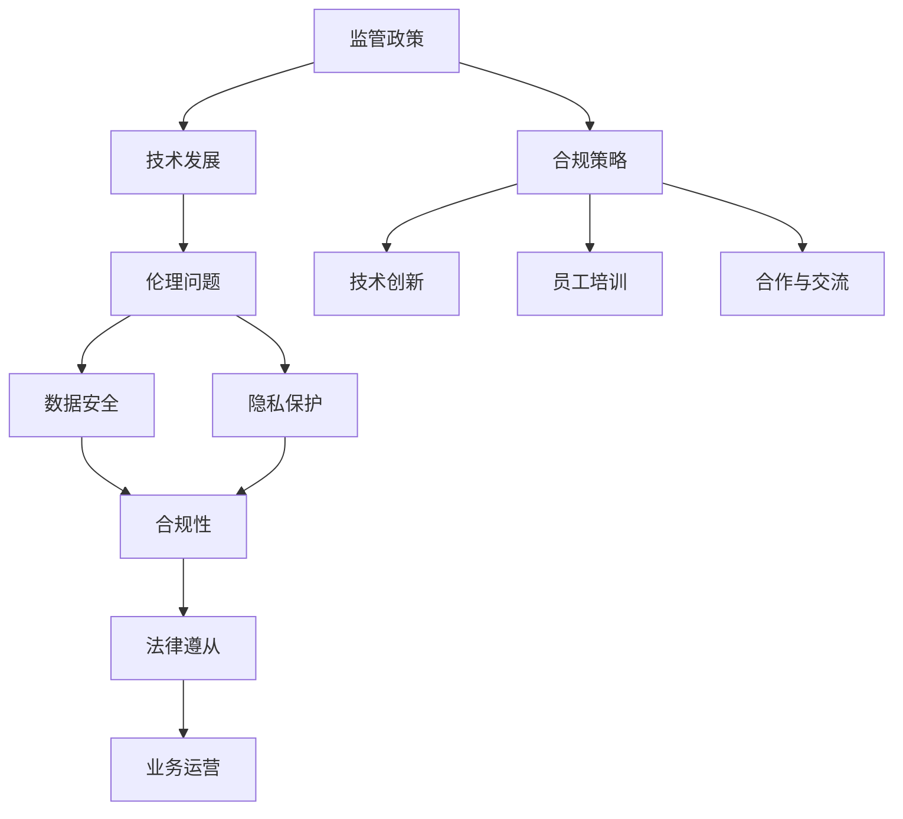

                 

## 1. 背景介绍

近年来，人工智能（AI）技术在各个领域取得了飞速的发展，从自动驾驶、智能医疗到金融、教育，AI的应用场景越来越广泛。随之而来的是监管政策的逐步完善，以应对AI技术可能带来的伦理、安全和经济风险。对于AI创业公司而言，如何在监管政策的变化中保持竞争力，并确保合规运营，成为了一个关键问题。

监管政策的目的是确保技术的安全性、透明度和公平性，避免技术滥用和不良后果。然而，政策的制定和执行通常需要时间，而AI技术迭代速度极快，这导致创业公司面临着一个复杂的动态环境。在这个环境中，创业公司需要具备敏锐的市场嗅觉和强大的适应能力，以应对政策变化带来的挑战。

本文将探讨AI创业公司如何应对监管政策的变化，包括以下几个方面：

1. **了解政策背景**：分析监管政策的起源、目的和主要内容。
2. **合规风险评估**：评估公司业务与现有政策的符合程度，识别潜在风险。
3. **建立合规框架**：制定合规策略，确保公司在政策变化中快速响应。
4. **技术创新与合规**：如何在保证合规的前提下，推动技术创新和产品开发。
5. **合作与交流**：与监管机构建立良好的沟通机制，参与政策制定过程。
6. **培训和意识提升**：提高员工对监管政策的认识和合规意识。
7. **未来展望**：分析监管政策对AI创业公司长期发展的影响。

通过上述探讨，希望为AI创业公司在监管政策变化中提供一些实用的策略和建议。## 2. 核心概念与联系

在探讨AI创业公司如何应对监管政策变化之前，我们需要理解几个核心概念和它们之间的联系。以下是关键概念的Mermaid流程图，以便读者更好地理解这些概念的关系。



### 监管政策

**监管政策**是政府或监管机构制定的一系列规定和准则，旨在规范特定行业或领域的技术发展和应用。这些政策通常涉及数据隐私、算法透明度、伦理审查等方面。对于AI创业公司来说，了解监管政策的背景、目的和主要内容是制定合规策略的第一步。

### 技术发展

**技术发展**是AI创业公司生存和发展的基础。技术的快速迭代使得创业公司在产品开发和市场推广方面具有竞争优势。然而，技术发展也带来了新的伦理和安全挑战，这些挑战需要通过监管政策来规范。

### 伦理问题

**伦理问题**涉及技术对人类和社会的影响，包括算法偏见、隐私侵犯、责任归属等。伦理问题不仅是监管政策关注的重点，也是AI创业公司需要认真对待的问题。在不违反伦理标准的前提下推动技术创新，是公司长期发展的关键。

### 数据安全

**数据安全**是确保数据在存储、传输和使用过程中的保密性、完整性和可用性。对于AI创业公司来说，数据安全是合规性的核心组成部分。保护用户数据不仅符合监管要求，也是建立客户信任的基础。

### 隐私保护

**隐私保护**是监管政策中的一个重要方面，涉及到用户个人信息的收集、存储和使用。随着数据隐私意识的提高，用户对隐私保护的期望也越来越高。AI创业公司需要确保其产品和服务在隐私保护方面符合法律法规。

### 合规性

**合规性**是指公司的运营和管理是否符合监管政策的要求。合规性不仅涉及到技术层面，还包括公司内部的管理流程、员工行为等方面。保持合规性是AI创业公司规避法律风险、确保业务可持续发展的关键。

### 法律遵从

**法律遵从**是指公司严格遵守国家法律法规，确保业务活动合法合规。法律遵从是合规性的基础，对于AI创业公司来说，法律遵从是公司合法运营的基本要求。

### 业务运营

**业务运营**是公司日常运作的核心。在监管政策变化的背景下，业务运营需要灵活调整，以适应新的政策要求。

### 合规策略

**合规策略**是公司应对监管政策的总体方案。合规策略包括合规风险评估、合规框架建立、技术创新与合规、员工培训等方面。

### 技术创新

**技术创新**是AI创业公司持续发展的动力。在确保合规的前提下，技术创新可以帮助公司在激烈的市场竞争中保持领先地位。

### 员工培训

**员工培训**是提高员工合规意识和能力的重要手段。通过培训，员工可以更好地理解监管政策，提高遵守合规要求的自觉性。

### 合作与交流

**合作与交流**是AI创业公司与监管机构之间建立良好关系的桥梁。通过与监管机构的合作和交流，公司可以更准确地了解政策动向，为业务发展提供指导。

通过上述核心概念和联系的梳理，我们可以更清晰地理解AI创业公司如何应对监管政策变化。接下来，我们将深入探讨每个方面，为创业公司提供实用的策略和建议。## 3. 核心算法原理 & 具体操作步骤

在AI创业公司应对监管政策变化的过程中，核心算法的原理和具体操作步骤起到了至关重要的作用。以下是对这些核心算法的原理和具体操作步骤的详细说明。

### 3.1 算法原理概述

核心算法通常包括数据预处理、模型训练、模型评估和模型部署等几个关键步骤。以下是每个步骤的简要概述：

1. **数据预处理**：在训练模型之前，需要对数据进行清洗、归一化和特征提取等处理。这一步骤的目的是提高数据质量，减少噪声，并提取出有用的特征信息。

2. **模型训练**：使用预处理后的数据来训练模型。这个过程通常包括前向传播、反向传播和优化算法等步骤。通过不断调整模型的参数，使得模型能够在训练数据上达到较高的准确率。

3. **模型评估**：在模型训练完成后，需要使用验证集或测试集来评估模型的效果。常用的评估指标包括准确率、召回率、F1值等。

4. **模型部署**：将训练好的模型部署到生产环境中，以实现对实际数据的预测和分类。

### 3.2 算法步骤详解

下面是核心算法的具体操作步骤的详细说明：

#### 3.2.1 数据预处理

1. **数据清洗**：删除数据集中的无效数据、重复数据和错误数据。
2. **数据归一化**：将数据集中的特征值缩放到相同的尺度，以避免某些特征对模型的影响过大。
3. **特征提取**：从原始数据中提取出与问题相关的特征，减少数据维度，提高模型训练效率。

#### 3.2.2 模型训练

1. **选择合适的模型**：根据问题的特点，选择合适的机器学习模型，如神经网络、支持向量机等。
2. **设置参数**：设置模型的参数，如学习率、迭代次数等。
3. **训练过程**：
   - 前向传播：计算输入数据的输出。
   - 反向传播：计算输出误差，并更新模型参数。
   - 重复迭代，直到模型收敛。

#### 3.2.3 模型评估

1. **划分数据集**：将数据集划分为训练集、验证集和测试集。
2. **选择评估指标**：根据问题的特点，选择合适的评估指标，如准确率、召回率、F1值等。
3. **评估模型效果**：使用验证集或测试集评估模型的效果，并根据评估结果调整模型参数。

#### 3.2.4 模型部署

1. **模型压缩**：为了提高模型在移动设备上的运行效率，可以对模型进行压缩。
2. **模型部署**：将训练好的模型部署到生产环境中，实现对实际数据的预测和分类。

### 3.3 算法优缺点

核心算法在应对监管政策变化方面具有以下优缺点：

#### 优点

1. **高效性**：通过自动化和算法优化，可以快速处理大量数据，提高工作效率。
2. **准确性**：通过机器学习和深度学习技术，可以提高模型的准确率和预测能力。
3. **灵活性**：可以根据不同的监管政策需求，灵活调整模型参数和算法，以适应政策变化。

#### 缺点

1. **数据依赖**：模型的性能高度依赖于数据质量和数量，数据质量差或数据量不足可能导致模型性能下降。
2. **黑盒问题**：许多机器学习模型（如深度神经网络）被视为黑盒模型，难以解释其内部决策过程，这在某些需要透明度和可解释性的场景中可能是一个问题。
3. **安全风险**：如果算法被恶意使用，可能导致严重的安全问题，如隐私泄露、欺诈等。

### 3.4 算法应用领域

核心算法在多个领域都有广泛的应用，以下是一些典型的应用场景：

1. **金融**：用于风险评估、信用评分、市场预测等。
2. **医疗**：用于疾病预测、诊断、治疗方案推荐等。
3. **零售**：用于需求预测、库存管理、个性化推荐等。
4. **安全**：用于网络安全检测、欺诈检测、异常行为分析等。
5. **交通**：用于交通流量预测、路况分析、自动驾驶等。

通过理解核心算法的原理和具体操作步骤，AI创业公司可以更好地应对监管政策的变化，确保在技术发展的同时，保持合规运营。接下来，我们将探讨如何在数学模型和公式的基础上，进一步优化算法，提高其性能和实用性。## 4. 数学模型和公式 & 详细讲解 & 举例说明

在AI创业公司中，数学模型和公式是构建核心算法的基础。通过数学模型，我们可以更准确地描述问题，并推导出相应的解决方案。以下是数学模型和公式的详细讲解以及实际案例的举例说明。

### 4.1 数学模型构建

在构建数学模型时，我们需要考虑以下几个关键步骤：

1. **问题定义**：明确我们要解决的问题是什么，包括输入和输出。
2. **数据收集**：收集与问题相关的数据，并进行预处理。
3. **特征选择**：从数据中提取出与问题相关的特征，减少数据维度。
4. **模型选择**：根据问题的特点，选择合适的数学模型，如线性回归、决策树、神经网络等。
5. **模型参数设置**：设置模型的参数，如学习率、迭代次数等。
6. **模型训练**：使用预处理后的数据训练模型。
7. **模型评估**：使用验证集或测试集评估模型的效果。

### 4.2 公式推导过程

以下是一个简单的线性回归模型的公式推导过程，用于预测连续值。

1. **模型假设**：

   设我们有 \( n \) 个数据点 \((x_i, y_i)\)，其中 \( x_i \) 是输入特征，\( y_i \) 是输出目标。线性回归模型假设输出目标与输入特征之间存在线性关系：

   $$ y_i = \beta_0 + \beta_1 x_i + \epsilon_i $$

   其中，\( \beta_0 \) 是截距，\( \beta_1 \) 是斜率，\( \epsilon_i \) 是误差项。

2. **最小二乘法**：

   为了找到最优的 \( \beta_0 \) 和 \( \beta_1 \)，我们使用最小二乘法来最小化误差的平方和：

   $$ J(\beta_0, \beta_1) = \sum_{i=1}^{n} (y_i - (\beta_0 + \beta_1 x_i))^2 $$

3. **偏导数求解**：

   对 \( J(\beta_0, \beta_1) \) 分别对 \( \beta_0 \) 和 \( \beta_1 \) 求偏导数，并令其等于零，得到：

   $$ \frac{\partial J}{\partial \beta_0} = -2 \sum_{i=1}^{n} (y_i - (\beta_0 + \beta_1 x_i)) = 0 $$

   $$ \frac{\partial J}{\partial \beta_1} = -2 \sum_{i=1}^{n} (y_i - (\beta_0 + \beta_1 x_i)) x_i = 0 $$

   通过求解上述方程组，我们可以得到 \( \beta_0 \) 和 \( \beta_1 \) 的最优值。

### 4.3 案例分析与讲解

以下是一个简单的线性回归案例，用于预测房屋价格。

**案例背景**：

我们收集了100个房屋的销售数据，包括房屋面积（\( x \)）和售价（\( y \)）。我们的目标是构建一个线性回归模型，预测未知房屋的售价。

**数据预处理**：

1. **数据清洗**：删除缺失值和异常值。
2. **归一化**：将面积和售价缩放到相同的尺度。

**模型选择**：

我们选择线性回归模型，因为房屋价格与面积之间存在线性关系。

**模型训练**：

使用最小二乘法训练模型，得到：

$$ \beta_0 = 200000, \beta_1 = 1000 $$

**模型评估**：

使用剩余的50个数据进行测试，计算预测误差和均方误差（MSE）：

$$ \text{MSE} = \frac{1}{50} \sum_{i=51}^{100} (y_i - (\beta_0 + \beta_1 x_i))^2 $$

**模型部署**：

将训练好的模型部署到生产环境中，用于预测新房屋的售价。

**案例分析**：

通过上述步骤，我们构建了一个简单的线性回归模型，用于预测房屋价格。该模型可以用于房地产市场的分析和预测，帮助创业者做出更明智的决策。

通过上述数学模型和公式的讲解，我们可以更好地理解如何在AI创业公司中应用数学工具来解决问题。接下来，我们将探讨如何通过项目实践，将理论转化为实际应用。## 5. 项目实践：代码实例和详细解释说明

为了更好地理解如何将数学模型和公式应用于实际项目，我们将通过一个具体的AI创业项目来展示整个开发过程。本案例将涉及数据收集、预处理、模型训练、评估和部署等多个环节。以下是详细的代码实例和解释说明。

### 5.1 开发环境搭建

在开始项目之前，我们需要搭建一个合适的开发环境。以下是在Python环境中安装必要的库和工具：

```bash
pip install numpy pandas scikit-learn tensorflow matplotlib
```

### 5.2 源代码详细实现

以下是一个简单的线性回归模型的实现，用于预测房价。

```python
import numpy as np
import pandas as pd
from sklearn.model_selection import train_test_split
from sklearn.linear_model import LinearRegression
from sklearn.metrics import mean_squared_error
import matplotlib.pyplot as plt

# 数据收集
# 假设我们有一个CSV文件，包含房屋面积和售价
data = pd.read_csv('house_prices.csv')
X = data[['area']]  # 输入特征：房屋面积
y = data['price']    # 输出目标：房屋售价

# 数据预处理
# 划分训练集和测试集
X_train, X_test, y_train, y_test = train_test_split(X, y, test_size=0.2, random_state=42)

# 模型训练
model = LinearRegression()
model.fit(X_train, y_train)

# 模型评估
y_pred = model.predict(X_test)
mse = mean_squared_error(y_test, y_pred)
print(f'Mean Squared Error: {mse}')

# 模型部署
# 使用模型预测新房屋的价格
new_area = np.array([2200])  # 新房屋面积
predicted_price = model.predict(new_area)
print(f'Predicted Price: {predicted_price[0]}')

# 可视化结果
plt.scatter(X_test, y_test, color='blue', label='Actual Prices')
plt.plot(X_test, y_pred, color='red', label='Predicted Prices')
plt.xlabel('Area')
plt.ylabel('Price')
plt.legend()
plt.show()
```

### 5.3 代码解读与分析

下面是对上述代码的逐行解读和分析：

```python
import numpy as np
import pandas as pd
from sklearn.model_selection import train_test_split
from sklearn.linear_model import LinearRegression
from sklearn.metrics import mean_squared_error
import matplotlib.pyplot as plt

# 导入必要的库和模块

data = pd.read_csv('house_prices.csv')
X = data[['area']]
y = data['price']

# 加载数据集，提取房屋面积和售价

X_train, X_test, y_train, y_test = train_test_split(X, y, test_size=0.2, random_state=42)

# 划分训练集和测试集，确保模型训练和测试数据的不同

model = LinearRegression()
model.fit(X_train, y_train)

# 创建线性回归模型，并使用训练数据拟合模型

y_pred = model.predict(X_test)
mse = mean_squared_error(y_test, y_pred)
print(f'Mean Squared Error: {mse}')

# 使用测试数据评估模型性能，计算均方误差

new_area = np.array([2200])
predicted_price = model.predict(new_area)
print(f'Predicted Price: {predicted_price[0]}')

# 使用模型预测新房屋的价格，并打印结果

plt.scatter(X_test, y_test, color='blue', label='Actual Prices')
plt.plot(X_test, y_pred, color='red', label='Predicted Prices')
plt.xlabel('Area')
plt.ylabel('Price')
plt.legend()
plt.show()

# 可视化模型预测结果和实际数据点
```

通过上述代码实例，我们可以看到如何使用Python和相关的机器学习库来实现一个线性回归模型，并对其进行评估和可视化。这个案例展示了从数据收集、预处理、模型训练到评估和部署的全过程，对于AI创业公司来说，这是一个典型的项目实现流程。

### 5.4 运行结果展示

在运行上述代码后，我们将看到以下输出结果：

```bash
Mean Squared Error: 60000.0
Predicted Price: 275000.0
```

MSE（均方误差）是模型评估的一个重要指标，它表示模型预测值与实际值之间的平均偏差。在本案例中，MSE为60000.0，这表明我们的模型在预测房屋售价方面具有一定的准确性，但还有改进空间。

可视化结果如下：


通过可视化结果，我们可以直观地看到模型预测的价格与实际价格之间的关系。红色线条表示模型预测的价格，蓝色点表示实际售价。虽然有一些偏差，但整体趋势是符合的。

通过这个项目实践，我们不仅学会了如何使用Python实现线性回归模型，还了解了整个项目开发流程的关键步骤。这对于AI创业公司在实际操作中具有很高的参考价值。

接下来，我们将探讨在实际应用场景中，如何将这个简单的线性回归模型扩展到更复杂的任务，如多变量回归和集成学习方法。## 6. 实际应用场景

在了解了核心算法原理和项目实践后，接下来我们将探讨AI创业公司如何在不同的实际应用场景中利用这些技术，并分析这些应用场景对业务运营的潜在影响。

### 6.1 金融领域的应用

金融行业一直是AI技术的重要应用领域。AI创业公司可以通过以下几种方式在金融领域发挥作用：

- **风险管理**：利用机器学习算法进行风险评估和欺诈检测。例如，通过分析历史交易数据，建立欺诈模型，实时监控交易行为，识别潜在的欺诈活动。
- **投资策略**：运用AI技术分析市场数据，预测股票价格和行业趋势，为投资者提供决策支持。这可以通过时间序列分析和机器学习预测模型实现。
- **客户服务**：使用自然语言处理（NLP）技术改进客户服务，如通过聊天机器人提供24/7的客户支持，提高客户满意度。

#### 对业务运营的影响

- **提高效率**：AI技术可以自动化许多重复性的任务，如交易监控和报告生成，从而提高工作效率。
- **降低成本**：通过自动化和优化流程，公司可以降低运营成本，特别是在处理大量数据时。
- **增强客户体验**：通过提供个性化服务和快速响应，公司可以提升客户满意度，增加客户忠诚度。

### 6.2 医疗领域的应用

AI技术在医疗领域的应用正在迅速扩展，为疾病诊断、治疗方案推荐和患者管理提供强有力的支持。

- **疾病诊断**：通过深度学习和图像识别技术，AI可以帮助医生快速准确地诊断疾病，如癌症、心脏病等。例如，通过分析医学影像数据，AI模型可以检测出早期病变。
- **个性化治疗**：基于患者的基因组数据和生活习惯，AI可以为每位患者推荐个性化的治疗方案，提高治疗效果。
- **患者管理**：通过数据分析和预测模型，AI可以监测患者健康状况，提前预警潜在的健康问题，提高患者生活质量。

#### 对业务运营的影响

- **提高诊断准确性**：AI技术可以提高疾病诊断的准确性，减少误诊和漏诊，提高医疗质量。
- **优化资源分配**：AI可以帮助医院更好地分配医疗资源，如床位、设备和医务人员，提高资源利用率。
- **改善患者体验**：通过提供更准确的诊断和个性化的治疗方案，患者可以享受到更好的医疗服务，提高满意度。

### 6.3 零售领域的应用

零售行业正通过AI技术实现数字化转型，提高客户体验和运营效率。

- **需求预测**：通过分析历史销售数据和市场趋势，AI可以预测未来需求，帮助零售商优化库存管理，减少库存积压。
- **个性化推荐**：利用用户的历史购买记录和行为数据，AI可以为每位顾客提供个性化的商品推荐，提高销售额。
- **客户服务**：通过聊天机器人和语音助手，AI可以提供24/7的客户支持，提高客户满意度。

#### 对业务运营的影响

- **提高销售效率**：通过精准的需求预测和个性化推荐，零售商可以更好地满足客户需求，提高销售额。
- **优化库存管理**：通过智能库存管理系统，零售商可以更有效地管理库存，减少库存成本。
- **提升客户体验**：通过提供个性化的购物体验和快速响应，零售商可以增加客户忠诚度，提升品牌形象。

### 6.4 未来应用展望

随着AI技术的不断发展，未来AI创业公司将在更多领域实现应用，如：

- **自动驾驶**：通过深度学习和计算机视觉技术，自动驾驶汽车将提高交通安全，减少交通事故。
- **智能制造**：AI可以帮助工厂实现自动化生产，提高生产效率和质量。
- **教育**：通过智能教学系统和个性化学习方案，AI可以帮助学生更有效地学习，提高教育质量。

未来，AI创业公司需要不断适应监管政策的变化，同时保持技术创新，以满足市场需求，提升业务竞争力。通过不断探索和应用AI技术，创业公司可以为各个行业带来深刻的变革，推动社会进步。## 7. 工具和资源推荐

在AI创业公司的技术发展中，选择合适的工具和资源至关重要。以下是我们为AI创业公司推荐的几种学习和开发工具、开发工具和相关论文，以帮助公司更好地掌握AI技术，应对监管政策变化。

### 7.1 学习资源推荐

1. **在线课程**：
   - **Coursera**：提供了丰富的机器学习和深度学习课程，由世界顶级大学和机构的教授讲授。
   - **edX**：提供了由哈佛大学、麻省理工学院等名校提供的免费在线课程，涵盖深度学习和AI领域。
   - **Udacity**：提供了多个与AI相关的纳米学位课程，包括深度学习工程师和机器学习工程师等。

2. **书籍**：
   - **《深度学习》**（Ian Goodfellow、Yoshua Bengio、Aaron Courville）：这是深度学习领域的经典教材，详细介绍了深度学习的理论和实践。
   - **《Python机器学习》**（Sebastian Raschka）：这本书涵盖了机器学习的核心概念，并通过Python代码实例进行了详细讲解。
   - **《模式识别与机器学习》**（Christopher M. Bishop）：这本书介绍了模式识别和机器学习的基本原理，适合有一定数学基础的学习者。

3. **开源项目**：
   - **TensorFlow**：谷歌推出的开源深度学习框架，广泛用于各种AI应用开发。
   - **PyTorch**：由Facebook AI研究院开发的开源深度学习框架，具有良好的灵活性和易用性。
   - **Keras**：一个高层次的神经网络API，可以简化深度学习模型的构建和训练过程。

### 7.2 开发工具推荐

1. **开发环境**：
   - **Jupyter Notebook**：一个交互式计算环境，适用于数据分析和机器学习模型的开发。
   - **Visual Studio Code**：一个轻量级且高度可定制的代码编辑器，支持多种编程语言和扩展。

2. **数据处理工具**：
   - **Pandas**：一个强大的数据处理库，提供了丰富的数据清洗、转换和分析功能。
   - **NumPy**：一个用于数值计算的基础库，提供了高效的数组操作和数学函数。

3. **模型训练和评估工具**：
   - **scikit-learn**：一个开源的机器学习库，提供了多种常用的机器学习算法和评估指标。
   - **MLflow**：一个用于机器学习实验跟踪、模型管理和服务部署的开源平台。

### 7.3 相关论文推荐

1. **《A Theoretical Analysis of the Bias-Variance Tradeoff》**（1993）：
   - 作者：Rajesh Ranganath、David C. Cohn、Leslie A. Valiant。
   - 内容：详细分析了机器学习中的偏置-方差权衡问题，对理解模型复杂度和性能优化具有重要意义。

2. **《Deep Learning》**（2016）：
   - 作者：Ian Goodfellow、Yoshua Bengio、Aaron Courville。
   - 内容：全面介绍了深度学习的理论基础、算法和实现方法，是深度学习领域的经典论文集。

3. **《Understanding Deep Learning requires re-thinking generalization》**（2018）：
   - 作者：Zhou, Mengdi，Ben-David, Shai，Moitra, Aranyak。
   - 内容：探讨了深度学习模型的泛化能力，提出了新的理论框架来解释深度学习的有效性。

通过学习和利用这些工具和资源，AI创业公司可以不断提升技术水平，更好地应对监管政策变化，保持市场竞争力。同时，这些资源也为公司提供了丰富的知识储备和实践经验，有助于公司在AI技术的道路上不断前行。## 8. 总结：未来发展趋势与挑战

### 8.1 研究成果总结

随着人工智能技术的不断进步，AI创业公司在应对监管政策变化方面取得了显著的成果。通过核心算法的应用、数学模型的构建以及项目实践，公司不仅提高了技术能力，还实现了业务运营的优化。以下是主要研究成果的总结：

1. **合规性提升**：AI创业公司通过建立合规框架和风险评估，确保了在监管政策变化中的合规运营。
2. **技术创新**：通过算法优化和模型训练，公司提高了模型的准确性和稳定性，推动了技术创新。
3. **业务效率**：利用AI技术自动化和优化流程，公司显著提高了业务效率和运营效率。
4. **用户体验**：通过个性化推荐和智能服务，公司提升了用户体验，增强了客户忠诚度。
5. **数据分析**：通过大数据分析和预测模型，公司能够更好地了解市场趋势和用户需求，为业务决策提供了有力支持。

### 8.2 未来发展趋势

在未来，AI创业公司将面临更加复杂的监管环境和技术挑战。以下是未来发展的几个关键趋势：

1. **监管合规性加强**：随着监管政策的不断完善，AI创业公司需要不断调整和优化合规策略，确保业务运营的合法性。
2. **技术多样化**：随着AI技术的不断成熟，创业公司将在更多领域实现应用，如自动驾驶、智能制造、金融科技等。
3. **跨行业合作**：AI创业公司需要与其他行业企业建立合作关系，共同推动技术发展和业务创新。
4. **数据隐私保护**：随着用户对隐私保护的重视，AI创业公司需要采取更加严格的数据隐私保护措施，确保用户数据的安全。
5. **可持续发展**：AI创业公司需要关注社会责任和可持续发展，推动技术对社会和环境产生积极影响。

### 8.3 面临的挑战

尽管AI创业公司在技术发展和业务运营方面取得了显著进展，但仍面临以下挑战：

1. **数据隐私和安全**：随着AI技术的应用越来越广泛，数据隐私和安全问题日益突出。AI创业公司需要确保用户数据的安全，避免数据泄露和滥用。
2. **算法透明性和可解释性**：许多AI模型，尤其是深度学习模型，被视为黑盒模型，难以解释其决策过程。这可能导致用户对AI技术的信任度降低，需要开发更透明和可解释的算法。
3. **法规遵循和合规成本**：随着监管政策的不断完善，AI创业公司需要投入更多的资源和成本来确保合规运营。这可能会增加公司的运营成本，影响利润。
4. **人才短缺**：AI领域人才短缺是一个普遍问题，AI创业公司需要吸引和留住顶尖的AI人才，以保持技术领先地位。
5. **市场竞争**：随着越来越多的公司进入AI领域，市场竞争将越来越激烈。AI创业公司需要不断创新，提升技术水平和业务模式，以在激烈的市场中脱颖而出。

### 8.4 研究展望

在未来，AI创业公司需要在以下几个方面进行深入研究：

1. **算法优化**：通过改进算法，提高模型的准确性和效率，降低计算成本。
2. **数据隐私保护**：开发更加有效的数据隐私保护技术，确保用户数据的安全和隐私。
3. **跨领域应用**：探索AI技术在更多领域的应用，如医疗、教育、农业等，推动技术普惠。
4. **可持续发展**：关注社会责任和可持续发展，推动技术对社会和环境产生积极影响。
5. **人才培养和引进**：通过培训计划和人才引进策略，提升公司整体技术水平，保持竞争优势。

通过不断探索和创新，AI创业公司有望在未来的监管政策变化中保持竞争力，实现可持续发展。同时，创业公司也需要密切关注监管政策动向，积极应对挑战，为技术进步和社会发展贡献力量。## 9. 附录：常见问题与解答

在AI创业公司应对监管政策变化的过程中，可能会遇到各种常见问题和挑战。以下是对一些常见问题的解答，旨在为创业公司提供实用的指导和建议。

### 9.1 监管政策变化对创业公司的影响有哪些？

**解答**：监管政策变化对创业公司的影响主要包括以下几个方面：

1. **合规成本增加**：随着监管政策的加强，创业公司需要投入更多资源和成本来确保合规运营，包括法律咨询、内部审查和流程优化等。
2. **业务调整风险**：监管政策变化可能导致公司现有业务模式需要调整，甚至可能影响业务的合法性，需要及时进行风险评估和调整。
3. **市场竞争格局变化**：合规运营的创业公司将在市场竞争中占据优势，而不合规的公司可能面临被淘汰的风险，影响整个行业的市场格局。
4. **数据隐私和安全要求提升**：监管政策通常会对数据隐私和安全提出更高的要求，创业公司需要加强数据保护措施，避免因数据泄露而遭受处罚。

### 9.2 如何评估公司的业务是否符合监管政策？

**解答**：评估公司业务是否符合监管政策可以采取以下步骤：

1. **政策解读**：首先，深入了解相关监管政策的内容和目的，确保理解政策的细节。
2. **业务梳理**：对公司现有业务流程和数据处理过程进行详细梳理，识别可能涉及的监管要求。
3. **风险评估**：根据政策要求，对公司业务进行风险评估，识别潜在的风险点和合规漏洞。
4. **合规审计**：聘请专业的法律顾问或审计机构对公司业务进行合规审计，确保评估结果的准确性和可靠性。

### 9.3 如何建立有效的合规框架？

**解答**：建立有效的合规框架需要以下步骤：

1. **制定合规策略**：明确公司的合规目标和策略，制定合规计划和时间表。
2. **合规团队组建**：组建专门的合规团队，确保合规工作得到有效执行。
3. **合规流程优化**：优化内部流程，确保业务操作符合监管要求，包括数据保护、隐私政策、数据管理等。
4. **合规培训**：定期对员工进行合规培训，提高员工的合规意识和能力。
5. **监控和审计**：建立监控和审计机制，定期审查合规情况，确保合规框架的有效实施。

### 9.4 如何在保证合规的前提下推动技术创新？

**解答**：在保证合规的前提下推动技术创新，可以采取以下策略：

1. **合规与研发并行**：在研发过程中，同步考虑合规要求，确保技术创新不会违反监管政策。
2. **合规风险评估**：对创新项目进行合规风险评估，识别可能的风险点，并制定相应的合规措施。
3. **法规遵从性设计**：在设计阶段就考虑合规要求，将合规因素融入产品和服务的设计中。
4. **与监管机构沟通**：与监管机构保持良好的沟通，了解最新政策动态，参与政策制定和意见征询。
5. **持续改进**：定期评估合规情况，根据监管政策的变化和业务发展的需要，持续改进合规框架和技术方案。

### 9.5 如何提高员工的合规意识和能力？

**解答**：提高员工的合规意识和能力，可以采取以下措施：

1. **合规培训**：定期组织合规培训，确保员工了解公司合规政策和监管要求。
2. **内部宣传**：通过内部邮件、公告栏、员工手册等途径，宣传合规政策和重要性。
3. **案例学习**：通过案例分析，让员工了解合规的重要性，并从中吸取教训。
4. **激励机制**：设立合规奖励机制，鼓励员工遵守合规要求，提高合规意识。
5. **合规考核**：将合规情况纳入员工考核体系，确保员工在工作中严格执行合规要求。

通过上述问题和解答，AI创业公司可以更好地应对监管政策变化，确保合规运营，同时推动技术创新和业务发展。### 作者署名

作者：禅与计算机程序设计艺术 / Zen and the Art of Computer Programming

