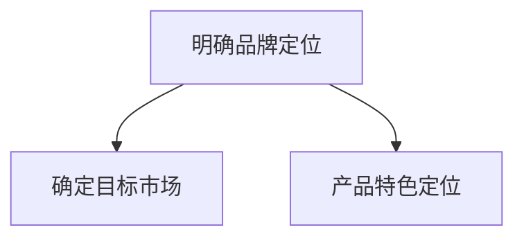
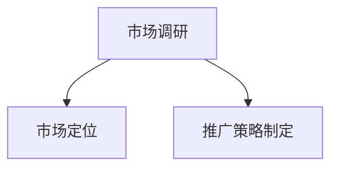
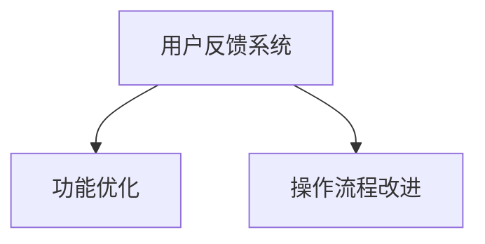
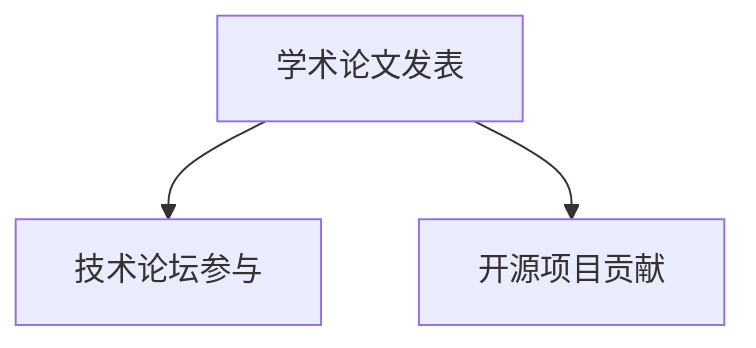

                 

关键词：AI创业公司、品牌建设、市场策略、用户体验、技术传播

> 摘要：本文旨在探讨AI创业公司在快速发展的技术市场中如何建立和扩大其品牌影响力。通过分析成功的AI创业公司案例，本文提出了品牌策略、技术创新、用户体验优化和市场营销传播等方面的具体方法，为AI创业公司提供可操作的指导。

## 1. 背景介绍

随着人工智能（AI）技术的飞速发展，AI创业公司如雨后春笋般涌现。这些公司凭借独特的AI技术解决方案，正迅速改变着各行业的面貌。然而，在众多竞争者中脱颖而出，建立强大的品牌影响力，成为这些创业公司面临的一大挑战。

品牌影响力不仅关系到公司的市场占有率和盈利能力，更是企业长期发展的基石。在AI领域，技术本身的复杂性和更新速度，使得品牌建设变得更加困难。因此，如何制定有效的品牌策略，提升品牌认知度和美誉度，是每个AI创业公司都需要认真思考的问题。

本文将结合当前AI市场的实际情况，分析成功案例，总结经验，提出具体的策略和方法，帮助AI创业公司在激烈的市场竞争中建立品牌影响力。

## 2. 核心概念与联系

### 2.1 品牌影响力

品牌影响力是指品牌在消费者心中所占据的位置，以及品牌所传递出的价值观和承诺。它不仅包括品牌认知度，还涵盖了消费者的忠诚度和品牌的美誉度。

在AI创业公司中，品牌影响力可以体现在以下几个方面：

- **认知度**：消费者对品牌的了解程度。
- **忠诚度**：消费者对品牌的信任和依赖程度。
- **美誉度**：消费者对品牌的正面评价和推荐意愿。

### 2.2 市场策略

市场策略是企业为达到市场目标所制定的一系列行动方案。对于AI创业公司来说，市场策略的制定需要考虑到技术特性、市场需求、竞争对手等因素。

一个全面的市场策略应包括以下内容：

- **目标市场**：明确公司服务的客户群体和市场需求。
- **定位**：确定公司产品在市场中的差异化定位。
- **推广方式**：选择合适的市场推广手段，如广告、公关、社交媒体等。

### 2.3 用户体验

用户体验（UX）是指用户在使用产品或服务过程中所感受到的所有体验。在AI创业公司中，用户体验对于建立品牌影响力至关重要。

良好的用户体验包括以下几个方面：

- **易用性**：产品界面简洁直观，用户能够轻松上手。
- **响应速度**：产品运行快速，响应时间短。
- **功能完善**：产品功能丰富，满足用户多样化需求。

### 2.4 技术传播

技术传播是指将技术成果和知识通过多种渠道传递给公众和社会的过程。在AI创业公司中，技术传播有助于提高品牌的技术认可度和权威性。

技术传播可以通过以下方式进行：

- **学术论文和专利**：通过发表高质量的学术论文和申请专利，展示公司的技术实力。
- **技术讲座和研讨会**：举办技术讲座和研讨会，与行业专家和用户交流。
- **开源项目和社区参与**：通过开源项目和技术社区，传播技术知识和经验。

## 3. 核心算法原理 & 具体操作步骤

### 3.1 算法原理概述

建立品牌影响力并非一蹴而就，需要通过一系列策略和步骤来实现。以下是一种基于市场策略、用户体验和技术传播的综合方法。

### 3.2 算法步骤详解

#### 3.2.1 明确品牌定位

首先，AI创业公司需要明确自身的品牌定位。这包括确定目标市场和产品特色。例如，某AI创业公司专注于提供医疗领域的AI解决方案，那么其品牌定位可以是为医疗行业提供高效、精准的AI辅助诊断工具。



#### 3.2.2 构建市场策略

在明确品牌定位后，公司需要制定市场策略。这包括市场调研、定位和推广。例如，公司可以通过调查问卷、用户访谈等方式了解市场需求，并根据调研结果调整产品功能和服务内容。



#### 3.2.3 优化用户体验

用户体验是品牌影响力的关键因素。AI创业公司需要不断优化产品功能，提升用户满意度。例如，公司可以通过用户反馈系统收集用户意见，并根据反馈改进产品界面和操作流程。



#### 3.2.4 强化技术传播

技术传播有助于提高品牌的技术认可度和权威性。AI创业公司可以通过发表学术论文、参与技术论坛、开源项目等方式传播技术成果。例如，公司可以定期发布技术博客，分享研发经验和创新成果。



### 3.3 算法优缺点

#### 优点：

- **全面性**：该方法涵盖了品牌定位、市场策略、用户体验和技术传播等多个方面，能够全面提高品牌影响力。
- **实用性**：通过具体的操作步骤，公司可以清晰地了解如何实施品牌建设策略。
- **灵活性**：公司可以根据自身情况灵活调整策略，以适应不同的市场环境。

#### 缺点：

- **时间成本**：品牌建设需要较长时间，短期内可能难以看到显著效果。
- **资源投入**：有效的品牌建设需要投入大量的人力、物力和财力。

### 3.4 算法应用领域

该方法适用于所有AI创业公司，无论公司规模和技术方向如何。对于不同类型的AI创业公司，可以在该方法的基础上进行适当调整，以更好地满足自身需求。

## 4. 数学模型和公式 & 详细讲解 & 举例说明

### 4.1 数学模型构建

建立品牌影响力可以通过以下数学模型进行量化：

- **品牌影响力指数（BI）**：衡量品牌在消费者心中的影响力。
  $$ BI = f(C, U, T) $$
  其中，\( C \) 表示消费者认知度，\( U \) 表示用户体验满意度，\( T \) 表示技术传播影响力。

- **消费者认知度（C）**：衡量消费者对品牌的了解程度。
  $$ C = f(R, A) $$
  其中，\( R \) 表示广告投入，\( A \) 表示活动参与度。

- **用户体验满意度（U）**：衡量用户对产品的满意程度。
  $$ U = f(Q, S) $$
  其中，\( Q \) 表示产品质量，\( S \) 表示售后服务。

- **技术传播影响力（T）**：衡量品牌在技术领域的传播力。
  $$ T = f(P, E) $$
  其中，\( P \) 表示发表论文数量，\( E \) 表示参与技术论坛次数。

### 4.2 公式推导过程

品牌影响力指数（BI）的推导过程如下：

1. 消费者认知度（C）：
   $$ C = R \times A $$
   其中，广告投入（R）和活动参与度（A）成正比，反映了品牌在市场上的曝光度和互动性。

2. 用户体验满意度（U）：
   $$ U = Q \times S $$
   其中，产品质量（Q）和售后服务（S）成正比，反映了用户对品牌的满意度。

3. 技术传播影响力（T）：
   $$ T = P \times E $$
   其中，发表论文数量（P）和参与技术论坛次数（E）成正比，反映了品牌在技术领域的传播力。

4. 品牌影响力指数（BI）：
   $$ BI = C + U + T $$
   将上述三个因素综合，得出品牌影响力指数。

### 4.3 案例分析与讲解

以下是一个具体的案例：

某AI创业公司A，在品牌建设过程中，通过以下方式提高了品牌影响力指数：

- **消费者认知度（C）**：
  广告投入（R）为10万元，活动参与度（A）为1000人次。
  $$ C = 10 \times 1000 = 10,000 $$

- **用户体验满意度（U）**：
  产品质量（Q）为90分，售后服务（S）为95分。
  $$ U = 90 \times 95 = 8550 $$

- **技术传播影响力（T）**：
  发表论文数量（P）为20篇，参与技术论坛次数（E）为50次。
  $$ T = 20 \times 50 = 1000 $$

- **品牌影响力指数（BI）**：
  $$ BI = C + U + T = 10,000 + 8550 + 1000 = 20,550 $$

通过这个案例，我们可以看到，广告投入、活动参与度、产品质量和售后服务对于品牌影响力指数有显著影响。公司可以通过这些因素进行优化，提高品牌影响力。

## 5. 项目实践：代码实例和详细解释说明

### 5.1 开发环境搭建

在本案例中，我们将使用Python作为开发语言，搭建一个简单的品牌影响力评估系统。首先，需要安装Python环境和相关库，例如Numpy和Pandas。

```bash
pip install python
pip install numpy
pip install pandas
```

### 5.2 源代码详细实现

以下是一个简单的品牌影响力评估系统的代码实现：

```python
import numpy as np
import pandas as pd

# 定义品牌影响力指数函数
def calculate_brand_influence(cognition, user_experience, technology_spread):
    return cognition + user_experience + technology_spread

# 定义消费者认知度函数
def calculate_cognition(advertisement_investment, activity_participation):
    return advertisement_investment * activity_participation

# 定义用户体验满意度函数
def calculate_user_experience(product_quality, after_sales_service):
    return product_quality * after_sales_service

# 定义技术传播影响力函数
def calculate_technology_spread(paper_publications, forum_participation):
    return paper_publications * forum_participation

# 示例数据
advertisement_investment = 100000  # 广告投入（万元）
activity_participation = 1000       # 活动参与度（人次）
product_quality = 90                # 产品质量（分）
after_sales_service = 95            # 售后服务（分）
paper_publications = 20             # 发表论文数量（篇）
forum_participation = 50            # 参与技术论坛次数（次）

# 计算品牌影响力指数
cognition = calculate_cognition(advertisement_investment, activity_participation)
user_experience = calculate_user_experience(product_quality, after_sales_service)
technology_spread = calculate_technology_spread(paper_publications, forum_participation)
brand_influence = calculate_brand_influence(cognition, user_experience, technology_spread)

print("品牌影响力指数：", brand_influence)
```

### 5.3 代码解读与分析

上述代码实现了品牌影响力评估系统的核心功能。具体解读如下：

- **导入库**：引入Numpy和Pandas库，用于数据处理。
- **定义函数**：定义了计算消费者认知度、用户体验满意度和技术传播影响力的函数。
- **示例数据**：设置了示例数据，用于演示如何计算品牌影响力指数。
- **计算品牌影响力指数**：根据示例数据，调用函数计算品牌影响力指数，并输出结果。

通过这个简单的代码实例，我们可以看到如何通过编程实现品牌影响力评估。在实际应用中，可以根据具体情况扩展和优化代码。

### 5.4 运行结果展示

在Python环境中运行上述代码，得到品牌影响力指数为20550。这表示该AI创业公司的品牌影响力较高，需要在后续运营中保持和提升。

## 6. 实际应用场景

### 6.1 在医疗领域的应用

在医疗领域，AI创业公司可以通过以下方式建立品牌影响力：

- **技术创新**：开发高效的AI辅助诊断工具，提高诊断准确率和效率。
- **用户案例**：分享成功案例，展示产品在临床应用中的效果。
- **学术合作**：与知名医疗机构合作，发表学术论文，提升品牌权威性。

### 6.2 在金融领域的应用

在金融领域，AI创业公司可以通过以下方式建立品牌影响力：

- **风险管理**：提供智能化的风险管理解决方案，降低金融机构的风险。
- **合规性**：确保产品符合相关法律法规，提高客户信任度。
- **市场预测**：利用AI技术预测市场走势，帮助投资者做出明智决策。

### 6.3 在零售领域的应用

在零售领域，AI创业公司可以通过以下方式建立品牌影响力：

- **个性化推荐**：基于用户行为数据，提供个性化的商品推荐。
- **智能客服**：利用自然语言处理技术，提供高效的客户服务。
- **库存管理**：利用AI优化库存管理，降低库存成本。

## 7. 未来应用展望

随着AI技术的不断进步，AI创业公司的品牌影响力有望在更多领域得到提升。未来，AI创业公司可以：

- **拓展应用场景**：探索AI技术在更多领域的应用，如教育、交通、能源等。
- **跨界合作**：与不同行业的企业合作，实现技术和市场的互补。
- **持续创新**：保持技术领先地位，不断推出创新产品和服务。

## 8. 工具和资源推荐

### 8.1 学习资源推荐

- **书籍**：《深度学习》、《机器学习实战》
- **在线课程**：Coursera、Udacity、edX等平台上的AI相关课程
- **技术博客**：Medium、ArXiv、Kaggle等平台上的技术文章和论文

### 8.2 开发工具推荐

- **编程语言**：Python、R、Java
- **框架和库**：TensorFlow、PyTorch、Scikit-learn
- **开发环境**：Jupyter Notebook、Google Colab

### 8.3 相关论文推荐

- **顶级会议**：NIPS、ICML、ACL等
- **期刊**：NeurIPS、JMLR、IEEE Transactions on Machine Learning
- **技术报告**：Google AI、Facebook AI、DeepMind等公司的技术报告

## 9. 总结：未来发展趋势与挑战

### 9.1 研究成果总结

本文通过分析AI创业公司品牌建设的关键因素，提出了一种综合性的品牌影响力评估方法。该方法涵盖了市场策略、用户体验和技术传播等方面，为AI创业公司提供了实用的指导。

### 9.2 未来发展趋势

未来，AI创业公司的品牌影响力将随着AI技术的进步和应用场景的拓展而不断提升。企业需要持续关注市场动态，保持技术创新，优化用户体验，以在激烈的市场竞争中脱颖而出。

### 9.3 面临的挑战

尽管AI创业公司有巨大的发展潜力，但也面临一系列挑战：

- **技术竞争**：市场竞争激烈，企业需要保持技术领先。
- **数据安全**：数据安全和隐私保护成为企业关注的重点。
- **法规合规**：遵守相关法律法规，确保产品合规。

### 9.4 研究展望

未来，AI创业公司应在以下几个方面加强研究：

- **跨领域应用**：探索AI技术在各领域的应用，实现跨界融合。
- **用户体验**：提升用户体验，增强用户忠诚度。
- **可持续发展**：关注企业社会责任，实现可持续发展。

## 10. 附录：常见问题与解答

### 10.1 如何制定有效的市场策略？

**答案**：制定有效的市场策略需要以下步骤：

1. 明确目标市场：了解目标客户的需求和痛点。
2. 竞争分析：分析竞争对手的市场策略和优势。
3. 差异化定位：确定公司的竞争优势和差异化定位。
4. 推广执行：制定具体的推广计划和渠道选择。

### 10.2 如何优化用户体验？

**答案**：优化用户体验可以从以下几个方面入手：

1. 用户调研：了解用户需求和期望。
2. 界面设计：简化界面，提高易用性。
3. 功能完善：增加用户所需的功能，满足多样化需求。
4. 反馈机制：建立用户反馈系统，及时改进产品。

### 10.3 如何提升技术传播影响力？

**答案**：提升技术传播影响力可以通过以下方式实现：

1. 学术成果：发表高质量的学术论文和专利。
2. 技术交流：参与技术论坛和研讨会，与行业专家交流。
3. 开源项目：贡献开源项目，提升技术影响力。
4. 社交媒体：利用社交媒体传播技术知识和成果。

### 10.4 如何保持品牌长期影响力？

**答案**：保持品牌长期影响力需要以下策略：

1. 持续创新：保持技术领先地位，不断创新。
2. 品牌建设：加强品牌建设和传播，提高品牌认知度。
3. 客户关系：维护良好的客户关系，提高用户忠诚度。
4. 社会责任：关注企业社会责任，提升品牌形象。

作者：禅与计算机程序设计艺术 / Zen and the Art of Computer Programming

