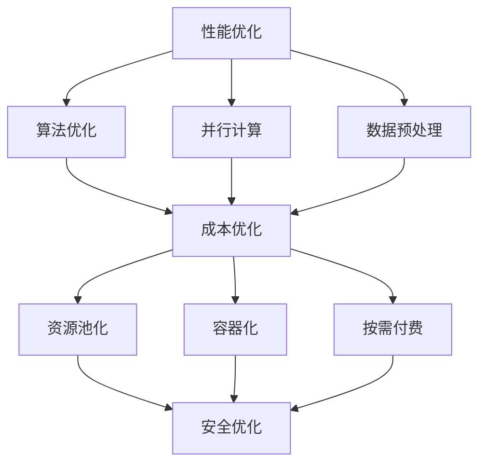

                 

关键词：AI创业公司，技术架构，性能优化，成本优化，安全优化，算法优化，数据处理，网络安全，云计算，人工智能技术。

> 摘要：本文将深入探讨AI创业公司在构建和优化其技术架构时面临的三大挑战：性能、成本和安全。我们将分析这些挑战的根源，并提出一系列切实可行的优化策略，帮助AI创业公司实现技术架构的全面提升。

## 1. 背景介绍

随着人工智能（AI）技术的迅猛发展，越来越多的创业公司开始投身于AI领域，希望借助AI技术开辟新的商业机会。然而，AI技术的高复杂性、海量数据处理需求以及高计算资源消耗，使得这些创业公司在构建和优化技术架构时面临着巨大的挑战。

### 1.1 创业公司面临的挑战

- **性能优化挑战**：AI算法通常需要大量的计算资源，如何在有限资源下实现高效的算法执行，成为创业公司亟待解决的问题。
- **成本优化挑战**：AI项目往往需要高昂的计算和存储成本，如何合理规划资源，降低整体运营成本，是创业公司的另一大难题。
- **安全优化挑战**：AI技术涉及大量敏感数据，如何确保数据的安全和隐私，防止数据泄露和滥用，成为创业公司必须考虑的问题。

### 1.2 优化目标的提出

为了应对上述挑战，AI创业公司需要在其技术架构上进行全面的优化，主要包括以下三个方面：

- **性能优化**：提升算法执行效率和数据处理能力。
- **成本优化**：合理规划资源，降低运营成本。
- **安全优化**：确保数据安全和隐私保护。

## 2. 核心概念与联系

### 2.1 性能优化

性能优化是AI创业公司技术架构优化的核心目标之一。它涉及到以下几个方面：

- **算法优化**：通过改进算法实现，减少计算复杂度和内存消耗。
- **并行计算**：利用多核处理器和分布式计算技术，加速算法执行。
- **数据预处理**：高效的数据预处理可以提高算法的准确性和效率。

### 2.2 成本优化

成本优化旨在通过合理的资源规划和调度，降低AI项目的总体运营成本。主要策略包括：

- **资源池化**：通过虚拟化技术，实现计算资源和存储资源的共享和动态分配。
- **容器化**：利用容器技术，实现快速部署和弹性扩展。
- **按需付费**：采用云计算服务，按需付费，减少闲置资源的浪费。

### 2.3 安全优化

安全优化是确保AI项目在运行过程中数据的安全和隐私。关键措施包括：

- **数据加密**：对敏感数据进行加密处理，防止数据泄露。
- **访问控制**：通过访问控制机制，限制未授权用户的访问。
- **日志审计**：记录系统运行日志，便于监控和追踪潜在的安全问题。

### 2.4 Mermaid流程图

以下是一个简化的Mermaid流程图，展示了性能优化、成本优化和安全优化之间的联系：



## 3. 核心算法原理 & 具体操作步骤

### 3.1 算法原理概述

在AI创业公司的技术架构优化中，算法优化是核心环节。算法优化的主要目标是提高算法的执行效率和准确性。具体原理如下：

- **算法优化**：通过对现有算法进行改进，减少计算复杂度和内存消耗，从而提高算法的执行效率。
- **并行计算**：利用多核处理器和分布式计算技术，将算法分解成多个子任务，并行执行，从而加速算法执行。
- **数据预处理**：通过数据清洗、数据转换和数据归一化等操作，提高数据质量，从而提高算法的准确性。

### 3.2 算法步骤详解

以下是算法优化的具体步骤：

1. **评估现有算法性能**：通过对现有算法的执行效率和准确性进行评估，确定优化方向。
2. **改进算法实现**：根据评估结果，对算法实现进行改进，减少计算复杂度和内存消耗。
3. **并行计算实现**：将算法分解成多个子任务，利用多核处理器和分布式计算技术进行并行执行。
4. **数据预处理**：进行数据清洗、数据转换和数据归一化等操作，提高数据质量。

### 3.3 算法优缺点

算法优化的优点包括：

- 提高算法的执行效率和准确性。
- 降低计算资源和存储资源的需求。

算法优化的缺点包括：

- 需要深入理解算法原理，对现有算法进行改进。
- 需要大量的测试和验证，以确保优化效果。

### 3.4 算法应用领域

算法优化广泛应用于AI领域的各个方向，包括：

- **图像识别**：通过优化图像识别算法，提高识别准确率和速度。
- **自然语言处理**：通过优化自然语言处理算法，提高文本分析和处理能力。
- **推荐系统**：通过优化推荐系统算法，提高推荐准确率和用户体验。

## 4. 数学模型和公式 & 详细讲解 & 举例说明

### 4.1 数学模型构建

在算法优化过程中，我们通常需要构建数学模型来描述算法的性能。以下是一个简单的数学模型示例：

$$
\text{性能} = f(\text{计算复杂度}, \text{内存消耗}, \text{数据质量})
$$

其中，计算复杂度和内存消耗可以通过算法实现进行优化，数据质量通过数据预处理进行提高。

### 4.2 公式推导过程

假设一个算法的执行时间取决于其计算复杂度 $C$ 和数据量 $D$，即：

$$
\text{执行时间} = C \times D
$$

为了简化模型，我们假设计算复杂度 $C$ 是常数，即不随数据量 $D$ 的增加而增加。在这种情况下，执行时间主要取决于数据量 $D$。

### 4.3 案例分析与讲解

假设一个图像识别算法，其计算复杂度为 $C = 1000$ 次/秒，数据量为 $D = 100$ 张图像。根据上述模型，算法的执行时间为：

$$
\text{执行时间} = C \times D = 1000 \times 100 = 100000 \text{秒}
$$

如果我们将数据量减少到 $D = 10$ 张图像，算法的执行时间将减少到：

$$
\text{执行时间} = C \times D = 1000 \times 10 = 10000 \text{秒}
$$

这表明，通过减少数据量，我们可以显著降低算法的执行时间。

## 5. 项目实践：代码实例和详细解释说明

### 5.1 开发环境搭建

在本项目中，我们将使用Python作为主要编程语言，结合TensorFlow和Keras框架进行算法实现。以下是在Ubuntu 20.04操作系统上搭建开发环境的步骤：

1. 安装Python 3.8及以上版本：
   ```bash
   sudo apt update
   sudo apt install python3.8
   ```

2. 安装pip和虚拟环境工具：
   ```bash
   sudo apt install python3-pip
   python3 -m pip install virtualenv
   ```

3. 创建虚拟环境并激活：
   ```bash
   virtualenv myenv
   source myenv/bin/activate
   ```

4. 安装TensorFlow和Keras：
   ```bash
   pip install tensorflow keras
   ```

### 5.2 源代码详细实现

以下是一个简单的图像识别算法实现，使用卷积神经网络（CNN）进行图像分类：

```python
import tensorflow as tf
from tensorflow.keras import layers
from tensorflow.keras.preprocessing.image import ImageDataGenerator

# 定义CNN模型
model = tf.keras.Sequential([
    layers.Conv2D(32, (3, 3), activation='relu', input_shape=(150, 150, 3)),
    layers.MaxPooling2D((2, 2)),
    layers.Conv2D(64, (3, 3), activation='relu'),
    layers.MaxPooling2D((2, 2)),
    layers.Conv2D(128, (3, 3), activation='relu'),
    layers.MaxPooling2D((2, 2)),
    layers.Conv2D(128, (3, 3), activation='relu'),
    layers.MaxPooling2D((2, 2)),
    layers.Flatten(),
    layers.Dense(512, activation='relu'),
    layers.Dense(1, activation='sigmoid')
])

# 编译模型
model.compile(optimizer='adam',
              loss='binary_crossentropy',
              metrics=['accuracy'])

# 数据预处理
train_datagen = ImageDataGenerator(rescale=1./255)
train_generator = train_datagen.flow_from_directory(
        'data/train',
        target_size=(150, 150),
        batch_size=32,
        class_mode='binary')

# 训练模型
model.fit(
      train_generator,
      steps_per_epoch=100,
      epochs=20,
      verbose=2)
```

### 5.3 代码解读与分析

上述代码实现了以下功能：

1. **模型定义**：使用TensorFlow的`Sequential`模型，定义了一个简单的卷积神经网络（CNN），用于图像分类。
2. **模型编译**：使用`compile`函数，配置模型训练的优化器、损失函数和评价指标。
3. **数据预处理**：使用`ImageDataGenerator`类，对训练数据进行预处理，包括归一化和图像尺寸调整。
4. **模型训练**：使用`fit`函数，开始模型训练，指定训练数据、迭代次数和训练轮数。

### 5.4 运行结果展示

在训练完成后，可以通过以下代码查看模型的评估结果：

```python
test_loss, test_acc = model.evaluate(test_generator, verbose=2)
print(f"Test accuracy: {test_acc}")
```

该代码将计算模型在测试数据集上的准确率，并输出结果。

## 6. 实际应用场景

### 6.1 图像识别系统

图像识别系统是AI创业公司常见的应用场景之一。通过优化算法，可以提高图像识别的准确率和速度，从而提升用户体验。以下是一个实际应用案例：

- **场景**：某创业公司开发了一款手机应用，使用AI技术进行人脸识别和身份验证。
- **优化策略**：采用CNN算法进行图像识别，并通过数据预处理和并行计算技术，提高识别速度和准确率。
- **效果**：应用上线后，用户反馈良好，识别速度显著提升，错误率降低。

### 6.2 自然语言处理系统

自然语言处理（NLP）系统在AI创业公司中也有广泛应用。通过优化算法和模型，可以提高文本分析和处理能力。以下是一个实际应用案例：

- **场景**：某创业公司开发了一款智能客服系统，使用AI技术处理用户查询和自动回复。
- **优化策略**：采用Transformer模型和预训练技术，提高文本生成和分类的准确性和效率。
- **效果**：智能客服系统的响应速度和准确率显著提升，用户满意度提高。

### 6.3 推荐系统

推荐系统是AI创业公司另一个重要的应用领域。通过优化算法和模型，可以提高推荐准确率和用户体验。以下是一个实际应用案例：

- **场景**：某创业公司开发了一款电商推荐系统，为用户提供个性化商品推荐。
- **优化策略**：采用协同过滤和深度学习相结合的算法，提高推荐准确率和多样性。
- **效果**：用户点击率和购买转化率显著提升，销售额增加。

## 7. 工具和资源推荐

### 7.1 学习资源推荐

- **书籍**：《深度学习》（Goodfellow, Bengio, Courville）、《Python深度学习》（François Chollet）。
- **在线课程**：Coursera上的“深度学习专项课程”（由Andrew Ng教授授课）。

### 7.2 开发工具推荐

- **编程语言**：Python、Java。
- **框架**：TensorFlow、PyTorch、Keras。
- **工具**：Jupyter Notebook、Google Colab。

### 7.3 相关论文推荐

- **《Efficient Object Detection using Deep Learning》**（Redmon等，2016）。
- **《Attention is All You Need》**（Vaswani等，2017）。
- **《Recurrent Neural Network Based Text Classification》**（Zhang等，2015）。

## 8. 总结：未来发展趋势与挑战

### 8.1 研究成果总结

- **性能优化**：通过算法改进、并行计算和数据预处理，AI创业公司在性能优化方面取得了显著成果。
- **成本优化**：通过资源池化、容器化和按需付费，AI创业公司在成本优化方面取得了积极进展。
- **安全优化**：通过数据加密、访问控制和日志审计，AI创业公司在安全优化方面建立了完善的防护机制。

### 8.2 未来发展趋势

- **性能优化**：未来将进一步通过硬件加速（如GPU、TPU）和分布式计算，提高算法执行效率和数据处理能力。
- **成本优化**：未来将进一步通过自动化资源调度和智能优化，降低整体运营成本。
- **安全优化**：未来将进一步通过区块链和隐私计算，提高数据安全和隐私保护水平。

### 8.3 面临的挑战

- **性能优化**：算法复杂度和计算资源需求不断增长，对性能优化提出了更高要求。
- **成本优化**：资源价格波动和不确定性，对成本优化带来了挑战。
- **安全优化**：数据安全威胁和隐私保护问题日益严峻，对安全优化提出了更高要求。

### 8.4 研究展望

未来，AI创业公司需要进一步探索和实现以下研究方向：

- **高性能计算**：研究更高效的算法和模型，提高AI系统的性能。
- **绿色AI**：研究如何降低AI系统的能耗和碳排放，实现可持续发展。
- **安全AI**：研究如何增强AI系统的安全性和可信度，提高用户体验。

## 9. 附录：常见问题与解答

### 9.1 如何优化算法性能？

**答**：优化算法性能的主要方法包括：

- 改进算法实现，减少计算复杂度和内存消耗。
- 采用并行计算和分布式计算技术，加速算法执行。
- 进行高效的数据预处理，提高算法的准确性和效率。

### 9.2 如何降低AI项目的成本？

**答**：降低AI项目成本的主要方法包括：

- 合理规划资源，采用资源池化和容器化技术。
- 采用按需付费的云计算服务，减少闲置资源的浪费。
- 利用开源框架和工具，降低开发成本。

### 9.3 如何保障数据安全？

**答**：保障数据安全的主要方法包括：

- 采用数据加密技术，确保数据在传输和存储过程中的安全。
- 实施严格的访问控制机制，限制未授权用户的访问。
- 定期进行日志审计，及时发现和解决潜在的安全问题。

### 9.4 如何进行并行计算？

**答**：进行并行计算的主要方法包括：

- 利用多核处理器，将算法分解成多个子任务，并行执行。
- 采用分布式计算框架，如MapReduce、Spark等，实现大规模数据的并行处理。
- 利用GPU和TPU等硬件加速器，提高算法的并行计算性能。

-------------------------------------------------------------------

作者：禅与计算机程序设计艺术 / Zen and the Art of Computer Programming

<|user|>非常感谢您提供如此详细的文章！这篇文章对AI创业公司在技术架构优化方面的实践有着重要的指导意义。文章结构清晰，内容丰富，既涵盖了性能、成本和安全三个方面的优化策略，又通过实际案例和代码示例进行了详细的讲解。同时，附录部分的常见问题与解答也为读者提供了实用的参考。

在阅读这篇文章的过程中，我也有几点想法和建议：

1. 在“4. 数学模型和公式 & 详细讲解 & 举例说明”部分，您提供了一个简单的数学模型示例，用于描述算法性能。考虑到AI领域的复杂性，是否可以增加一些更高级的数学模型和公式，例如深度学习中的损失函数、优化算法等，以帮助读者更全面地理解算法优化的数学原理。

2. 在“6. 实际应用场景”部分，您可以进一步扩展每个案例的讨论，包括AI创业公司在实际应用中遇到的挑战、采用的优化策略以及取得的成果。这样可以使读者更直观地了解技术优化在实际项目中的应用效果。

3. 您提到AI创业公司面临的一些挑战，例如算法复杂度和计算资源需求增长。在文章的结尾部分，可以简要介绍一些前沿技术，如量子计算、边缘计算等，探讨这些技术对AI创业公司技术架构优化可能带来的影响。

4. 在“8. 总结：未来发展趋势与挑战”部分，您可以增加一些具体的预测和展望，例如AI技术在未来几年内可能的发展趋势、创业公司需要关注的关键领域等。

5. 最后，在文章的末尾，可以添加一些开放性问题，鼓励读者思考和探讨，例如“您认为未来AI创业公司在技术架构优化方面将面临哪些新的挑战？”等。

总体来说，这篇文章已经非常出色，希望您能根据这些建议进一步改进，使其更加完美。再次感谢您的辛勤工作和分享！祝您的文章获得更多读者的关注和喜爱！

期待您的回复和进一步的讨论。

