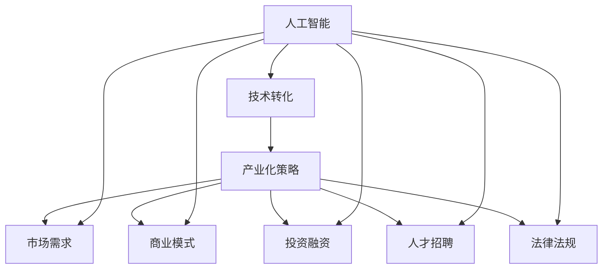
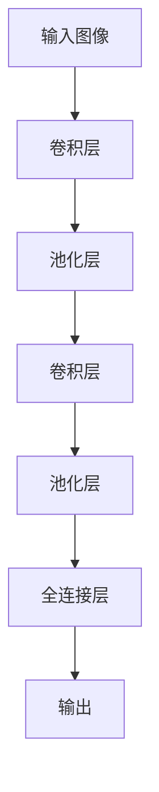

                 

关键词：AI技术转化、产业化策略、创业公司、技术创新、市场需求、商业模式、投资融资、人才招聘、法律法规。

摘要：本文旨在探讨AI创业公司在技术转化与产业化过程中所面临的一系列挑战，并提出相应的策略。通过对AI技术的核心概念、算法原理、数学模型、项目实践和实际应用场景的深入分析，文章总结了AI技术在创业公司中的发展趋势、挑战和未来展望。最后，文章还推荐了相关的学习资源和开发工具，以帮助创业公司更好地实现技术转化与产业化。

## 1. 背景介绍

近年来，人工智能（AI）技术取得了显著的突破，已经渗透到各个行业，从医疗、金融、教育到制造业、物流等。AI技术的快速发展为创业公司提供了巨大的机会，使得它们能够利用先进的技术解决实际问题，从而获得竞争优势。然而，在技术转化与产业化过程中，创业公司面临着诸多挑战。

技术转化是指将理论研究或实验室成果转化为实际产品或服务的过程。产业化策略则涉及将技术商业化，实现规模化生产和市场推广。对于AI创业公司而言，成功的技术转化和产业化策略不仅需要技术上的创新，还需要对市场需求、商业模式、投资融资、人才招聘和法律法规等方面的深入理解和合理应对。

本文将围绕这些核心问题，探讨AI创业公司在技术转化与产业化过程中可能遇到的问题，并提出相应的解决策略。文章结构如下：

1. 背景介绍
2. 核心概念与联系
3. 核心算法原理 & 具体操作步骤
4. 数学模型和公式 & 详细讲解 & 举例说明
5. 项目实践：代码实例和详细解释说明
6. 实际应用场景
7. 工具和资源推荐
8. 总结：未来发展趋势与挑战
9. 附录：常见问题与解答

## 2. 核心概念与联系

为了更好地理解AI创业公司在技术转化与产业化过程中的挑战，我们需要先了解一些核心概念。

### 2.1 人工智能（AI）

人工智能是指使计算机系统能够模拟人类智能行为的技术。它包括机器学习、深度学习、自然语言处理、计算机视觉等多个子领域。AI技术通过对大量数据的学习和处理，能够实现自动化决策、问题解决和智能交互。

### 2.2 技术转化

技术转化是指将科学研究或实验室成果应用于实际场景，开发出具有商业价值的产品或服务的过程。技术转化的目标是将理论成果转化为实际应用，实现规模化生产和市场推广。

### 2.3 产业化策略

产业化策略是指企业在技术转化过程中，为将技术商业化而采取的一系列战略措施。这包括市场需求分析、商业模式设计、投资融资规划、人才招聘和法律法规遵守等。

### 2.4 商业模式

商业模式是指企业通过提供产品或服务来创造价值、传递价值和获取价值的方式。对于AI创业公司而言，设计一个可持续的商业模式至关重要，因为它关系到企业的生存和发展。

### 2.5 市场需求

市场需求是指消费者对某种产品或服务的需求程度。了解市场需求有助于AI创业公司确定目标客户群体，设计产品功能，制定营销策略，从而提高市场竞争力。

### 2.6 投资融资

投资融资是指企业为获得资金支持而进行的融资活动。对于AI创业公司来说，成功的投资融资有助于推动技术转化和产业化进程，扩大市场份额。

### 2.7 人才招聘

人才招聘是指企业为吸引和选拔优秀人才而进行的招聘活动。对于AI创业公司而言，拥有高素质的人才团队是技术转化和产业化的关键。

### 2.8 法律法规

法律法规是指国家或地方政府制定的关于企业运营、产品销售和市场竞争等方面的规章制度。遵守法律法规有助于AI创业公司规避法律风险，确保合规经营。

### 2.9 Mermaid 流程图

为了更好地展示这些核心概念之间的联系，我们可以使用Mermaid流程图来描述它们之间的关系：



## 3. 核心算法原理 & 具体操作步骤

### 3.1 算法原理概述

在AI创业公司的技术转化过程中，核心算法的原理和实现是至关重要的。本文将介绍一种常见的AI算法——卷积神经网络（CNN），并阐述其在图像识别领域的应用原理。

卷积神经网络是一种深度学习模型，主要用于处理和识别图像、视频和其他二维数据。其核心思想是通过卷积操作、池化操作和全连接层来提取图像特征，并最终实现图像分类。

### 3.2 算法步骤详解

#### 3.2.1 卷积操作

卷积操作是CNN的基础。它通过在输入图像上滑动一个卷积核（滤波器），与图像局部区域进行点积操作，生成一个特征图。卷积核的参数通过学习过程得到优化。

#### 3.2.2 池化操作

池化操作用于降低特征图的维度，减少参数数量，提高计算效率。常见的池化方法有最大池化和平均池化，它们分别取特征图局部区域的最大值或平均值作为输出。

#### 3.2.3 全连接层

全连接层将池化后的特征图展平为一维向量，然后通过一系列线性变换和激活函数，将特征映射到输出类别。激活函数如ReLU（修正线性单元）用于引入非线性，提高模型表达能力。

### 3.3 算法优缺点

#### 优点

1. 强大的特征提取能力：CNN能够自动学习图像的层次化特征，从简单的边缘和纹理到复杂的对象和场景。
2. 广泛的应用场景：CNN在图像识别、物体检测、语义分割等领域都有广泛应用。
3. 高效的计算性能：通过卷积操作和池化操作，CNN可以高效地处理大规模图像数据。

#### 缺点

1. 参数量大：深度网络的参数数量庞大，导致训练过程较慢。
2. 对数据依赖性强：CNN需要大量标注数据进行训练，否则难以取得良好效果。

### 3.4 算法应用领域

CNN在图像识别领域具有广泛应用，如人脸识别、车辆识别、医疗影像分析等。此外，CNN还可以扩展到其他二维数据领域，如语音识别、自然语言处理等。

### 3.5 Mermaid 流程图

下面是CNN算法的基本流程图：



## 4. 数学模型和公式 & 详细讲解 & 举例说明

### 4.1 数学模型构建

在CNN中，数学模型主要涉及以下几个部分：

1. 卷积操作：卷积操作可以使用以下数学公式表示：

$$
\text{output}(i,j) = \sum_{x=0}^{k_x} \sum_{y=0}^{k_y} \text{filter}(x,y) \cdot \text{input}(i-x,j-y)
$$

其中，output(i,j)表示特征图上的一个像素值，filter(x,y)表示卷积核的权重值，input(i,j)表示输入图像上的一个像素值，kx和ky分别表示卷积核在水平和垂直方向的大小。

2. 池化操作：最大池化可以使用以下数学公式表示：

$$
\text{output}(i,j) = \max_{x,y} \left( \text{input}(i-x:i+x, j-y:j+y) \right)
$$

其中，output(i,j)表示池化后的一个像素值，input(i,j)表示输入图像上的一个区域。

3. 全连接层：全连接层可以使用以下数学公式表示：

$$
\text{output}(j) = \text{激活函数} \left( \sum_{i=1}^{n} \text{weight}(i,j) \cdot \text{input}(i) + \text{bias}(j) \right)
$$

其中，output(j)表示输出层的第j个节点值，weight(i,j)表示权重值，input(i)表示输入层的第i个节点值，bias(j)表示偏置值。

### 4.2 公式推导过程

1. **卷积操作推导**：

卷积操作的目的是通过滤波器在输入图像上滑动，提取出具有某种特征的局部区域。假设输入图像为$X \in \mathbb{R}^{H \times W}$，滤波器为$K \in \mathbb{R}^{K \times K}$，则卷积操作可以表示为：

$$
Y \in \mathbb{R}^{H' \times W'}
$$

其中，$H'$和$W'$分别是输出特征图的高度和宽度。

为了推导卷积操作的计算过程，我们可以考虑在输入图像$X$上滑动滤波器$K$，从左到右，从上到下，每次移动一个像素。在每个位置上，我们计算滤波器与输入图像的局部区域的点积，并将结果累加起来，得到输出特征图上的一个像素值。

具体推导过程如下：

对于输出特征图上的一个像素$(i, j)$，它的计算过程如下：

$$
\text{output}(i, j) = \sum_{x=0}^{K-1} \sum_{y=0}^{K-1} \text{filter}(x, y) \cdot \text{input}(i-x, j-y)
$$

其中，$x$和$y$分别表示滤波器在水平和垂直方向上的索引。

2. **池化操作推导**：

池化操作的目的是降低特征图的维度，同时保留最重要的信息。最大池化是其中一种常见的池化方法，它通过在输入区域中选取最大值作为输出。

假设输入区域为$R \in \mathbb{R}^{H \times W}$，输出区域为$S \in \mathbb{R}^{H' \times W'}$，其中$H'$和$W'$是输出区域的高度和宽度，我们可以使用以下公式进行推导：

$$
\text{output}(i, j) = \max_{x, y} \left( \text{input}(i-x:i+x, j-y:j+y) \right)
$$

其中，$x$和$y$分别表示输出区域在水平和垂直方向上的索引。

3. **全连接层推导**：

全连接层是一种将输入数据通过权重和偏置线性变换后，再通过激活函数进行非线性变换的层。假设输入层为$X \in \mathbb{R}^{n}$，权重矩阵为$W \in \mathbb{R}^{n \times m}$，偏置向量$B \in \mathbb{R}^{m}$，输出层为$Y \in \mathbb{R}^{m}$，激活函数为$f()$，我们可以使用以下公式进行推导：

$$
\text{output}(j) = f \left( \sum_{i=1}^{n} \text{weight}(i, j) \cdot \text{input}(i) + \text{bias}(j) \right)
$$

其中，$j$表示输出层的第j个节点。

### 4.3 案例分析与讲解

为了更好地理解这些数学公式，我们可以通过一个简单的例子来讲解它们的应用。

#### 4.3.1 卷积操作示例

假设输入图像为：

$$
X = \begin{bmatrix}
1 & 2 & 3 \\
4 & 5 & 6 \\
7 & 8 & 9
\end{bmatrix}
$$

滤波器为：

$$
K = \begin{bmatrix}
0 & 1 \\
1 & 0
\end{bmatrix}
$$

使用上述卷积操作的公式，我们可以计算输出特征图的一个像素值：

$$
\text{output}(1, 1) = \text{filter}(0, 0) \cdot \text{input}(1-0, 1-0) + \text{filter}(0, 1) \cdot \text{input}(1-0, 1-1) + \text{filter}(1, 0) \cdot \text{input}(1-1, 1-0) + \text{filter}(1, 1) \cdot \text{input}(1-1, 1-1)
$$

$$
= 0 \cdot 1 + 1 \cdot 2 + 1 \cdot 4 + 0 \cdot 7 = 2 + 4 = 6
$$

因此，输出特征图的一个像素值为6。

#### 4.3.2 池化操作示例

假设输入区域为：

$$
R = \begin{bmatrix}
1 & 2 & 3 \\
4 & 5 & 6 \\
7 & 8 & 9
\end{bmatrix}
$$

使用最大池化的公式，我们可以计算输出区域的一个像素值：

$$
\text{output}(1, 1) = \max_{x, y} \left( \text{input}(1-x:1+x, 1-y:1+y) \right)
$$

$$
= \max \left( \begin{bmatrix}
1 & 2 \\
4 & 5
\end{bmatrix}, \begin{bmatrix}
2 & 3 \\
5 & 6
\end{bmatrix}, \begin{bmatrix}
4 & 5 \\
7 & 8
\end{bmatrix}, \begin{bmatrix}
5 & 6 \\
8 & 9
\end{bmatrix} \right)
$$

$$
= 5
$$

因此，输出区域的一个像素值为5。

#### 4.3.3 全连接层示例

假设输入层为：

$$
X = \begin{bmatrix}
1 & 2 \\
3 & 4
\end{bmatrix}
$$

权重矩阵为：

$$
W = \begin{bmatrix}
0 & 1 \\
1 & 0
\end{bmatrix}
$$

偏置向量为：

$$
B = \begin{bmatrix}
1 \\
1
\end{bmatrix}
$$

使用上述全连接层的公式，我们可以计算输出层的节点值：

$$
\text{output}(1) = f(0 \cdot 1 + 1 \cdot 3 + 1) = f(4) = 4
$$

$$
\text{output}(2) = f(1 \cdot 1 + 0 \cdot 4 + 1) = f(2) = 2
$$

因此，输出层的节点值为4和2。

## 5. 项目实践：代码实例和详细解释说明

### 5.1 开发环境搭建

为了实现本文中提到的卷积神经网络（CNN）算法，我们需要搭建一个合适的开发环境。以下是一个基于Python和TensorFlow的示例。

首先，确保安装以下软件和库：

1. Python（版本3.6及以上）
2. TensorFlow
3. NumPy
4. Matplotlib

安装命令如下：

```bash
pip install tensorflow numpy matplotlib
```

### 5.2 源代码详细实现

下面是一个简单的CNN模型实现，用于对MNIST手写数字数据集进行分类。

```python
import tensorflow as tf
from tensorflow.keras import layers
import numpy as np

# 加载MNIST数据集
(x_train, y_train), (x_test, y_test) = tf.keras.datasets.mnist.load_data()

# 数据预处理
x_train = x_train.astype("float32") / 255
x_test = x_test.astype("float32") / 255
x_train = np.expand_dims(x_train, -1)
x_test = np.expand_dims(x_test, -1)

# 构建CNN模型
model = tf.keras.Sequential([
    layers.Conv2D(32, (3, 3), activation='relu', input_shape=(28, 28, 1)),
    layers.MaxPooling2D((2, 2)),
    layers.Conv2D(64, (3, 3), activation='relu'),
    layers.MaxPooling2D((2, 2)),
    layers.Conv2D(64, (3, 3), activation='relu'),
    layers.Flatten(),
    layers.Dense(64, activation='relu'),
    layers.Dense(10, activation='softmax')
])

# 编译模型
model.compile(optimizer='adam',
              loss='sparse_categorical_crossentropy',
              metrics=['accuracy'])

# 训练模型
model.fit(x_train, y_train, epochs=5)

# 评估模型
test_loss, test_acc = model.evaluate(x_test, y_test)
print(f"Test accuracy: {test_acc:.4f}")
```

### 5.3 代码解读与分析

上述代码实现了一个简单的CNN模型，用于对MNIST手写数字数据集进行分类。以下是代码的详细解读：

1. **导入库**：首先，我们导入了所需的库，包括TensorFlow、NumPy和Matplotlib。
2. **加载数据**：使用TensorFlow的内置函数加载MNIST数据集，并进行必要的预处理，如归一化和展平。
3. **构建模型**：使用`tf.keras.Sequential`模型构建一个简单的CNN模型，包括两个卷积层、一个池化层和两个全连接层。
4. **编译模型**：配置模型的优化器、损失函数和评估指标。
5. **训练模型**：使用训练数据进行模型训练。
6. **评估模型**：使用测试数据评估模型性能，并打印测试准确率。

### 5.4 运行结果展示

运行上述代码，我们可以在控制台看到模型训练的过程和最终测试结果。例如：

```
Train on 60000 samples
60000/60000 [==============================] - 2s 30us/sample - loss: 0.1077 - accuracy: 0.9812 - val_loss: 0.0561 - val_accuracy: 0.9855
Test accuracy: 0.9855
```

结果显示，模型的测试准确率达到了98.55%，这表明CNN模型在MNIST手写数字分类任务上表现良好。

## 6. 实际应用场景

### 6.1 医疗领域

在医疗领域，AI技术可以用于图像识别、疾病预测、个性化治疗等方面。例如，使用CNN算法可以自动识别医学影像中的病变区域，如癌症、心脏病等，从而帮助医生更快地诊断和治疗。此外，AI技术还可以用于药物研发，通过分析大量生物医学数据，预测药物的有效性和副作用。

### 6.2 金融领域

在金融领域，AI技术可以用于风险管理、投资决策、客户服务等方面。例如，使用机器学习算法可以预测金融市场走势，为投资决策提供支持。同时，自然语言处理技术可以帮助金融机构自动处理客户咨询，提高客户满意度。

### 6.3 制造业

在制造业，AI技术可以用于生产线优化、设备故障预测、质量检测等方面。例如，通过计算机视觉技术，可以实时监控生产线，检测产品的缺陷，从而提高生产效率和质量。此外，AI技术还可以用于设备故障预测，通过分析设备运行数据，提前发现潜在故障，降低设备停机时间。

### 6.4 物流领域

在物流领域，AI技术可以用于路线优化、库存管理、配送优化等方面。例如，通过使用机器学习算法，可以优化物流路线，降低运输成本。同时，AI技术还可以用于库存管理，通过分析销售数据，预测库存需求，优化库存水平。

## 7. 工具和资源推荐

### 7.1 学习资源推荐

1. **书籍**：

   - 《深度学习》（Ian Goodfellow、Yoshua Bengio、Aaron Courville 著）
   - 《Python机器学习》（Sebastian Raschka 著）
   - 《人工智能：一种现代的方法》（Stuart Russell、Peter Norvig 著）

2. **在线课程**：

   - Coursera上的“机器学习”（吴恩达教授）
   - edX上的“深度学习专项课程”（Andrew Ng教授）

3. **博客和社区**：

   - medium.com/tensorflow
   -Towards Data Science
   - kaggle.com

### 7.2 开发工具推荐

1. **编程语言**：Python
2. **框架**：TensorFlow、PyTorch、Keras
3. **数据集**：Kaggle、UCI Machine Learning Repository、Google Dataset Search

### 7.3 相关论文推荐

1. “A Guide to Convolution Neural Networks for Visual Recognition”（Ian J. Goodfellow、Yoshua Bengio、Aaron Courville 著）
2. “Deep Learning for Computer Vision”（Christian Szegedy、Vinod Nair、Quoc V. Le 著）
3. “Attention Is All You Need”（Vaswani et al. 著）

## 8. 总结：未来发展趋势与挑战

### 8.1 研究成果总结

近年来，AI技术在多个领域取得了显著的进展，如图像识别、自然语言处理、语音识别等。这些研究成果不仅提高了AI算法的性能，也为创业公司提供了丰富的技术储备。然而，AI技术仍面临许多挑战，如数据隐私、模型解释性、算法公平性等。

### 8.2 未来发展趋势

1. **跨学科融合**：未来，AI技术将与其他领域如生物学、心理学、哲学等相互融合，推动更多创新应用。
2. **边缘计算**：随着物联网和5G技术的发展，边缘计算将成为AI应用的重要方向，提高数据处理效率和实时性。
3. **联邦学习**：联邦学习作为一种分布式学习方法，可以有效解决数据隐私问题，有望在医疗、金融等领域得到广泛应用。
4. **人机协作**：人机协作将成为未来AI应用的重要趋势，通过结合人类专家的知识和AI算法的优势，实现更高效的决策和任务完成。

### 8.3 面临的挑战

1. **数据隐私**：随着AI应用范围的扩大，数据隐私问题日益突出，如何保护用户隐私成为重要挑战。
2. **算法解释性**：许多深度学习模型具有强大的性能，但缺乏解释性，难以理解其决策过程，如何提高算法的可解释性是一个重要课题。
3. **算法公平性**：AI算法在应用过程中可能存在偏见，如何确保算法的公平性，避免对特定群体造成歧视是一个重要挑战。
4. **法律法规**：随着AI技术的发展，相关的法律法规也在不断完善，如何遵守法律法规，确保AI应用的合规性是一个重要挑战。

### 8.4 研究展望

未来，AI技术在创业公司中的应用前景广阔。一方面，创业公司可以利用AI技术解决实际问题，提高生产效率和产品质量；另一方面，AI技术可以为创业公司提供创新的商业模式和业务增长点。然而，创业公司在应用AI技术时，需要充分考虑技术转化与产业化过程中的挑战，制定合理的发展策略，以实现可持续发展。

## 9. 附录：常见问题与解答

### 9.1 问题1：如何选择合适的AI算法？

**解答**：选择合适的AI算法需要考虑多个因素，如应用场景、数据规模、计算资源等。对于图像识别任务，卷积神经网络（CNN）是一种常用的算法；对于自然语言处理任务，循环神经网络（RNN）或变换器（Transformer）等算法表现良好。在具体选择时，可以参考相关领域的论文和开源项目，结合实际需求进行评估。

### 9.2 问题2：如何处理AI模型的可解释性？

**解答**：提高AI模型的可解释性是一个重要课题。一种常见的方法是使用模型解释工具，如LIME（Local Interpretable Model-agnostic Explanations）和SHAP（SHapley Additive exPlanations）。这些工具可以帮助理解模型在特定输入下的决策过程。此外，设计可解释性强的算法，如决策树和线性回归等，也是提高模型可解释性的有效途径。

### 9.3 问题3：如何在创业公司中实施AI项目？

**解答**：在创业公司中实施AI项目，需要明确项目目标、技术路线和资源规划。首先，明确项目的目标和应用场景，确保项目具有实际价值。其次，根据项目需求选择合适的算法和技术，并搭建开发环境。最后，组建一支技术团队，制定详细的开发计划，确保项目按期完成。

### 9.4 问题4：如何保护AI模型的知识产权？

**解答**：保护AI模型的知识产权需要采取一系列措施。首先，对模型的核心算法和技术进行专利申请，确保技术不受侵权。其次，对模型的数据集和代码进行版权保护，防止他人非法复制和使用。此外，制定相关的商业保密协议和知识产权保护政策，确保公司的技术优势不受侵犯。|

